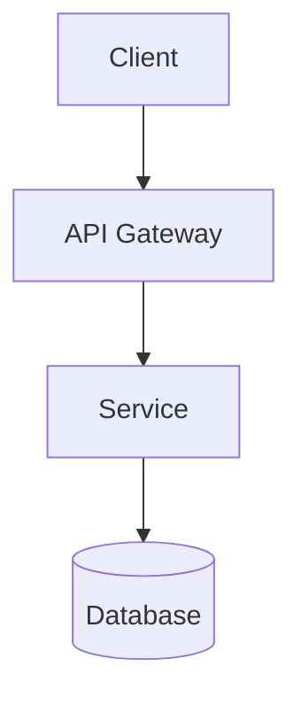

# Fumadocs Technical Writer

Write technical documentation as `.mdx`/`.md` files styled for [Fumadocs](https://www.fumadocs.dev/) — the React.js documentation framework. Fumadocs renders GitHub-Flavored Markdown plus MDX (JSX-in-Markdown) and ships a set of built-in components (Callout, Cards, Tabs, Steps, TypeTable, Files, Accordion, etc.) that make technical docs far more readable than plain prose.

This skill covers: **what to output, how to structure it, which Fumadocs component to reach for, and how to decide between Mermaid diagrams and ASCII diagrams.**

## Workflow

1. **Figure out the doc type.** Architecture/design doc, API reference, runbook/operations guide, getting-started guide, or a general explainer. The doc type drives structure (see `references/doc-structures.md` if you want fuller templates — but for most requests you can just use the patterns below directly).
2. **Figure out the diagram strategy** (see below) before writing — plan diagrams alongside the content, not as an afterthought bolted on at the end.
3. **Write the file** with correct Fumadocs frontmatter and componentized structure (see `references/fumadocs-components.md` for full syntax of every component).
4. **Save as `.mdx`** by default (safe superset — plain Markdown files still work fine as `.mdx`), unless the user's project clearly uses plain `.md` (e.g., they show you existing `.md` files in the repo — then match that).
5. Create the file with the `create_file`/file tools as normal (see file-creation guidance in the main instructions) — this produces a real file the user can drop into their `content/docs/` folder, not just a chat reply.

## Diagram strategy: Mermaid vs ASCII

Don't default to one blindly — pick per-diagram based on this:

**Use Mermaid (` ```mermaid ` code block) when:**
- The diagram is non-trivial (more than ~5 nodes, has branching/decision logic, sequence/timing matters, or is a flowchart/sequence/state/ER/gantt diagram).
- The target renderer supports it. Plain Mermaid code blocks render natively on GitHub, GitLab, and many Markdown viewers. **Fumadocs itself does not render Mermaid out of the box** — it requires either the `remarkMdxMermaid` plugin + a custom `<Mermaid>` component, or the `fumadocs-mermaid` package. If you don't know whether the user's site has this configured, say so explicitly in your reply (one line) and still deliver the Mermaid block — it's the standard, most maintainable format and degrades gracefully to a visible code block if unconfigured.
- The user is likely to want to edit/regenerate the diagram later — Mermaid text is far easier to version-control and tweak than ASCII art.

**Use ASCII diagrams (inside a plain ` ``` ` or ` ```text ` code block) when:**
- The diagram is simple (a few boxes and arrows, a small directory/file tree, a simple before/after).
- It needs to render correctly with zero dependencies anywhere — terminal output, plain-text READMEs, code comments, or contexts where you're not sure Mermaid support exists at all.
- It's decorative/illustrative rather than precise (e.g., a rough mental model), where hand-drawn boxes read faster than a rendered graph.
- Directory/file trees — use Fumadocs' `<Files>` component instead if it's an actual file structure being documented (see reference doc), otherwise plain ASCII tree.

**Default when unsure:** Mermaid for architecture/flow/sequence diagrams (they're the modern standard and Fumadocs users who ask for this skill are almost always on a Mermaid-capable setup or will configure it), ASCII for small inline sketches and file trees. If truly ambiguous and it materially changes the deliverable, ask — otherwise just pick and mention the choice briefly.

Never generate diagrams as external image files/PNGs for content that's naturally a diagram — keep it as text (Mermaid/ASCII) so it stays version-controllable and matches how Fumadocs docs are normally authored. Only reach for an actual image file (``) for genuine screenshots, photos, or logos.

## Multi-part technical series

This skill is commonly used to generate one part/section at a time within a larger technical topic (e.g. a Redis series, a Java series, microservices, interview-question collections, Kafka, Kubernetes, etc.). Keep this in mind:

- Treat each generated doc as one page in a series, not a one-off. Write it so it stands alone (a reader landing directly on this page can still follow it), but keep tone/depth/heading style consistent with a typical multi-part technical series so parts feel like they belong together.
- If the user gives context about earlier/later parts (or you can see other files in the series), keep terminology, naming conventions, and depth consistent with them.
- End-of-doc `<Cards>` linking to sibling parts in the series is a good default when a series structure is evident (see Core structure pattern).

## Table of contents (mục lục) — required at the top of every doc

In addition to Fumadocs' auto-generated sidebar TOC, every doc this skill produces must include a **manual, hand-written table of contents right after the frontmatter/intro callout, before the first content section**. Use a heading + a bullet list of Markdown anchor links to each `##`/`###` section in the doc, e.g.:

```mdx
## Mục lục

- [Tổng quan](#tổng-quan)
- [Kiến trúc](#kiến-trúc)
  - [Thành phần chính](#thành-phần-chính)
- [Ví dụ](#ví-dụ)
- [Câu hỏi thường gặp](#câu-hỏi-thường-gặp)
```

Rules for building it correctly:
- Anchor slugs are the heading text lowercased, spaces replaced with `-`, punctuation stripped — Fumadocs auto-generates anchors this way, so the manual TOC must match exactly or the links break. Vietnamese diacritics are kept in the slug (Fumadocs sanitizes spaces/punctuation, not accented characters), e.g. `## Ví dụ` → `#ví-dụ`.
- Nest sub-bullets for `###` under their parent `##` entry, matching the doc's actual heading hierarchy.
- Build the TOC *after* you've written the doc's headings (or at least finalized them), so links don't drift out of sync — if you revise headings later, update the TOC to match.
- This manual TOC is written in whichever language the doc body is in (Vietnamese docs get a Vietnamese "Mục lục" heading, English docs get "Table of Contents").

## Frontmatter (always include)

Every Fumadocs page needs YAML frontmatter. `title` becomes the page's H1 — do not also add a `# Heading` at the top of the body.

```mdx
---
title: Short Page Title
description: One-sentence summary shown in search results and page headers.
---
```

## Core structure pattern

For most technical docs, follow this shape (adapt per doc type):

```mdx
---
title: <Title>
description: <One-line summary>
---

<Callout type="info">
  Optional: audience/prereqs/scope note.
</Callout>

## Mục lục
- [Overview](#overview)
- [Architecture / Flow](#architecture--flow)
- [Details](#details)
- [Next steps](#next-steps)

## Overview
Short paragraph — what this is and why it exists.

## Architecture / Flow


## Details
### Subsection
...

<Callout type="warn" title="Gotcha">
  Anything that could bite the reader.
</Callout>

## Next steps
<Cards>
  <Card title="Related doc" href="/docs/related" />
</Cards>
```

Reach for these components as the content calls for them (full syntax in the reference file):
- **`<Callout>`** — notes, warnings, errors, tips. Use liberally in place of "Note:" prose.
- **`<Steps>` / `<Step>`** — any sequential procedure (install → configure → deploy).
- **`<Tabs>`** — content that varies by variant (package manager, OS, language, environment).
- **`<TypeTable>`** — documenting props/parameters/config options with types.
- **`<Files>`** — showing a project/directory file tree.
- **`<Accordion>`** — optional/advanced detail that would clutter the main flow (FAQs, edge cases).
- **`<Cards>`** — linking out to related pages at the end of a doc.
- Tabbed code blocks (` ```npm ` style) — install commands across package managers.

Don't over-componentize a short doc — a two-paragraph doc doesn't need Steps/Tabs/Accordion just because they exist. Match component density to doc complexity.

## Length: no cap, optimize for clarity and flow

There is no target length and no ceiling — never cut content, explanation, or examples short just to keep the doc "concise." The only thing that matters is that a reader can follow it easily:

- Explain *why*, not just *what*, wherever it helps understanding — don't compress reasoning into a single dense sentence if it needs two.
- Prefer more sections with clear headings over fewer sections crammed with unrelated content. Long is fine; confusing is not.
- Keep a logical, linear flow: overview before details, context before specifics, simple case before edge cases. Reorder content if the natural writing order isn't the natural reading order.
- Use transitions between sections so the doc reads as one connected explanation, not a bullet dump — but bullets/tables are still the right call for enumerable facts (params, steps, comparisons).
- It's fine (encouraged) to add extra examples, an extra diagram, or a worked walkthrough if it makes a concept click — don't hold back because it adds length.
- The only trims that are ever appropriate: removing genuinely redundant restatements, or removing content that's flat-out irrelevant to the doc's purpose. Never trim for length's own sake.

Length being unconstrained is not license to write dense, hard-to-parse prose — it's the opposite: use the room to explain things clearly instead of compressing them. See the next section for the concrete sentence-level rules that make a long doc still easy to read.

## Sentence & paragraph-level readability (required)

Length has no cap, but *density* does — a long doc made of clear sentences is good; a long doc made of dense, jargon-packed sentences is not, even if every fact in it is correct. Apply these rules to every doc this skill produces:

**1. Gloss jargon on first use — don't chain undefined terms.**
If a sentence needs multiple technical terms the reader may not already know (e.g. "selectivity", "planner", "heap fetch", "visibility map" in a database-internals doc), don't string them together assuming familiarity. Define each unfamiliar term in plain language the first time it appears, in the same sentence or the one right after — a short parenthetical or a one-clause definition is usually enough. Once a term has been defined, it's fine to use it freely afterward.
- Weak: "Vì selectivity thấp, planner có thể chọn seq scan thay vì index scan để tránh heap fetch dư thừa."
- Better: "Selectivity — tỷ lệ rows khớp điều kiện — quyết định planner (bộ phận chọn execution plan) có dùng index hay không. Nếu selectivity thấp (đa số rows đều khớp), quét tuần tự cả bảng thường rẻ hơn."

**2. One main idea per sentence — split compound sentences that stack unrelated clauses.**
If a sentence joins three or four separate claims with commas/periods-as-connectors ("X, và Y, ngoài ra Z, tuy nhiên W..."), split it into separate sentences, one claim each. A reader should never have to hold more than one new idea in mind per sentence. This applies especially to lists of consequences/costs/trade-offs — write them as short sentences or an actual bullet list, not one run-on sentence.

**3. Concrete example immediately with (or before) abstract explanation — never several sentences of abstraction first.**
Don't state an abstract rule for multiple sentences and only then reveal the example that makes it concrete — by the time the reader reaches the example, they've already lost the thread. Instead: state the rule in one short sentence, then immediately show the concrete example (code, query, scenario), then (if needed) one closing sentence tying the example back to the rule. Abstraction sandwiched by concreteness reads far easier than abstraction stacked up front.

**4. Every hedge needs a landing — don't stack qualifiers without a takeaway.**
Technical accuracy often requires caveats ("it depends", "not always", "in most cases except when..."), and that's fine — but a paragraph that's nothing but chained qualifiers with no clear bottom line is exhausting to read and teaches the reader nothing they can act on. After hedging, always close with one plain sentence stating what to actually do or conclude (e.g. "Nói ngắn gọn: kiểm tra `EXPLAIN` thay vì đoán."). If a concept genuinely can't be simplified to a clear takeaway, say so explicitly rather than trailing off in qualifiers.

**Self-check before finishing a doc:** re-read a few of the denser paragraphs and ask — could someone unfamiliar with 1-2 of the terms here still follow the sentence? Does any single sentence contain more than one new idea? Is there an example within a sentence or two of every abstract claim? Does every hedge-heavy paragraph end with a clear takeaway? Fix any paragraph that fails these checks before considering the doc done.


## Read before writing

Before producing the file, view `references/fumadocs-components.md` for exact import statements and JSX syntax for every component mentioned above — get these right the first time rather than guessing at prop names.
