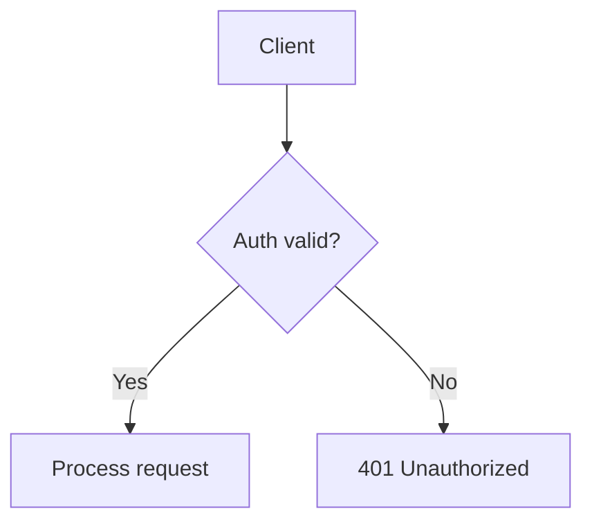

# Fumadocs Component Syntax Reference

Exact syntax for the Fumadocs built-in MDX components. Source: https://www.fumadocs.dev/docs/markdown and https://www.fumadocs.dev/docs/ui/components

All of these components except Callout/Cards/Code Blocks/Headings require an explicit `import` in real MDX files. **When writing a doc file for the user, you generally do NOT need to add the import lines yourself** — most Fumadocs setups auto-inject default MDX components (Callout, Cards, headings, code blocks) via `mdx-components.tsx`, and non-default ones (Tabs, Steps, TypeTable, Files, Accordion) are typically also pre-registered in the project's `getMDXComponents()`. Only add explicit `import` statements at the top of the file if the user tells you their project requires manual imports per-file, or if you're producing a minimal standalone example.

---

## Frontmatter

```mdx
---
title: Page Title
description: Shown in search results and page header subtitle.
---
```
`title` renders as the page's H1 automatically — don't duplicate it with `# Heading`.

---

## Callout

Built-in, no import needed in most setups.

```mdx
<Callout>Plain note, default styling.</Callout>

<Callout title="Title" type="info">
  Informational note.
</Callout>

<Callout title="Watch out" type="warn">
  Something the reader should be careful about.
</Callout>

<Callout title="Breaking" type="error">
  A hard failure mode / breaking change.
</Callout>

<Callout title="Tip" type="idea">
  A helpful shortcut or best practice.
</Callout>
```
Types: `info` (default), `warn`, `error`, `idea`.

---

## Mermaid diagrams

Plain fenced code block with `mermaid` as the language:

````mdx

````

**Important caveat to mention to the user if relevant:** Fumadocs does not render Mermaid out of the box. The project needs either:
- The `fumadocs-mermaid` package (simplest), or
- Manual setup: install `mermaid` + `next-themes`, build a `<Mermaid>` client component, register it in `mdx-components.tsx`, and add the `remarkMdxMermaid` remark plugin to `source.config.ts` so ` ```mermaid ` blocks are converted into `<Mermaid>` usages automatically.

Common Mermaid diagram types to use depending on content:
- `flowchart TD` / `flowchart LR` — architecture, decision flows
- `sequenceDiagram` — request/response, service-to-service interactions, API calls
- `stateDiagram-v2` — state machines, lifecycle
- `erDiagram` — data models / entity relationships
- `gantt` — timelines/schedules
- `journey` — user journeys

---

## ASCII diagrams

Plain fenced code block, no language or `text`:

````mdx
```text
┌─────────┐      ┌─────────────┐      ┌──────────┐
│ Client  │ ───► │ API Gateway │ ───► │ Service  │
└─────────┘      └─────────────┘      └────┬─────┘
                                            │
                                            ▼
                                      ┌──────────┐
                                      │ Database │
                                      └──────────┘
```
````

Use box-drawing characters (`┌ ┐ └ ┘ ─ │ ├ ┤ ┬ ┴ ┼`) and arrows (`► ◄ ▲ ▼ →`) for a cleaner look than plain ASCII `+ - |`. Keep lines aligned — count characters carefully, this is the #1 way ASCII diagrams break.

For simple file trees, plain indentation is fine:
```text
project/
├── src/
│   ├── index.ts
│   └── utils.ts
└── package.json
```
(But prefer the `<Files>` component below for anything that should look polished.)

---

## Cards

```mdx
<Cards>
  <Card title="Getting Started" href="/docs/getting-started" description="Set up your first project." />
  <Card title="API Reference" href="/docs/api" />
</Cards>
```

---

## Steps

```mdx
import { Step, Steps } from 'fumadocs-ui/components/steps';

<Steps>
<Step>

### Install dependencies
```npm
npm install my-package
```

</Step>
<Step>

### Configure
Edit `config.ts` with your settings.

</Step>
<Step>

### Run
```bash
npm run dev
```

</Step>
</Steps>
```

Alternative lightweight syntax (needs `remark-steps` enabled): append `[step]` after a heading inside consecutive headings — but prefer the explicit `<Steps>/<Step>` component form above, it's more portable.

---

## Tabs

```mdx
import { Tab, Tabs } from 'fumadocs-ui/components/tabs';

<Tabs items={['npm', 'pnpm', 'yarn', 'bun']}>
  <Tab value="npm">
    ```bash
    npm install my-package
    ```
  </Tab>
  <Tab value="pnpm">
    ```bash
    pnpm add my-package
    ```
  </Tab>
  <Tab value="yarn">
    ```bash
    yarn add my-package
    ```
  </Tab>
  <Tab value="bun">
    ```bash
    bun add my-package
    ```
  </Tab>
</Tabs>
```

For simple package-manager install commands specifically, there's also a shorthand codeblock-group syntax:
````mdx
```npm
npm i next -D
```
````
Fumadocs auto-expands this into an npm/pnpm/yarn/bun tab group via `remark-npm`.

---

## TypeTable

For documenting props, config options, or API parameters with types:

```mdx
import { TypeTable } from 'fumadocs-ui/components/type-table';

<TypeTable
  type={{
    name: {
      description: 'The user display name',
      type: 'string',
      required: true,
    },
    email: {
      description: 'Email address',
      type: 'string',
    },
    role: {
      description: 'User role',
      type: "'admin' | 'user'",
      default: "'user'",
    },
  }}
/>
```

---

## Files (directory tree)

```mdx
import { File, Folder, Files } from 'fumadocs-ui/components/files';

<Files>
  <Folder name="app" defaultOpen>
    <File name="layout.tsx" />
    <File name="page.tsx" />
  </Folder>
  <Folder name="components">
    <File name="button.tsx" />
  </Folder>
  <File name="package.json" />
</Files>
```

---

## Accordion

For optional/advanced/FAQ-style content that shouldn't clutter the main flow:

```mdx
import { Accordion, Accordions } from 'fumadocs-ui/components/accordion';

<Accordions type="single">
  <Accordion title="What if the request times out?">
    Explain the edge case here.
  </Accordion>
  <Accordion title="Can I use this in production?">
    Explain here.
  </Accordion>
</Accordions>
```

---

## Standard Markdown / GFM (no import needed)

- Tables: standard `| a | b |` pipe tables.
- Task lists: `- [ ] todo`, `- [x] done`.
- Images: `` — use for real screenshots/photos only, not for diagrams.
- Internal links: relative paths work; Fumadocs resolves them against the docs structure.
- Code blocks: standard triple-backtick with language tag for syntax highlighting (powered by Shiki), e.g. ` ```ts `, ` ```python `, ` ```json `.
- Headings: `##`/`###` etc. get automatic anchors and feed the auto-generated table of contents. Don't use `#` (h1) — that's reserved for the frontmatter `title`.
- Heading TOC control: append `[!toc]` to hide a heading from the TOC, or `[toc]` to force-include a non-heading TOC entry.

---

## include (Fumadocs MDX only)

Reuse content from another file:
```mdx
<include>./shared-section.mdx</include>
```
