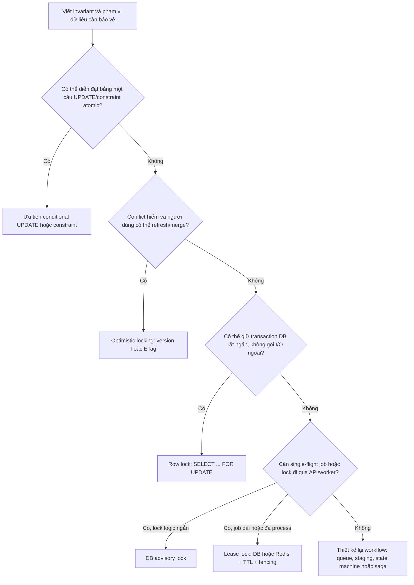
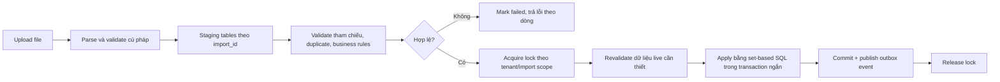

> Phạm vi bài này là **concurrency control ở tầng application**: dữ liệu cũ ghi đè dữ liệu mới, nhiều worker cùng chạy một job, và nghiệp vụ phải giữ invariant trên nhiều bản ghi. Để hiểu lock mode, MVCC và isolation level của database, xem [Lock trong Database](/fundamentals/lock/) và [Mối quan hệ giữa Locking Level, Locking Type và Isolation Level](/fundamentals/locking-isolation-relationship/).

## Mục lục

- [Vấn đề cần giải quyết](#vấn-đề-cần-giải-quyết)
  - [Lost update](#lost-update)
  - [Lock không thay thế transaction và constraint](#lock-không-thay-thế-transaction-và-constraint)
- [Bắt đầu từ invariant và phạm vi bảo vệ](#bắt-đầu-từ-invariant-và-phạm-vi-bảo-vệ)
- [Chọn chiến lược](#chọn-chiến-lược)
  - [Cây quyết định](#cây-quyết-định)
  - [Bảng so sánh](#bảng-so-sánh)
- [Không phải lúc nào cũng cần lock](#không-phải-lúc-nào-cũng-cần-lock)
- [Optimistic locking cho API chỉnh sửa](#optimistic-locking-cho-api-chỉnh-sửa)
  - [Version phải đến từ client](#version-phải-đến-từ-client)
  - [SQL cập nhật có điều kiện](#sql-cập-nhật-có-điều-kiện)
  - [HTTP ETag và If-Match](#http-etag-và-if-match)
  - [Xử lý conflict](#xử-lý-conflict)
  - [Giới hạn của optimistic locking](#giới-hạn-của-optimistic-locking)
- [Pessimistic row lock với SELECT FOR UPDATE](#pessimistic-row-lock-với-select-for-update)
  - [Khi nào dùng](#khi-nào-dùng)
  - [Transaction phải ngắn](#transaction-phải-ngắn)
  - [Chờ, fail nhanh hay bỏ qua](#chờ-fail-nhanh-hay-bỏ-qua)
  - [Tránh deadlock](#tránh-deadlock)
- [Advisory lock của database](#advisory-lock-của-database)
  - [PostgreSQL](#postgresql)
  - [MySQL](#mysql)
  - [Giới hạn](#giới-hạn)
- [Lease lock lưu trong database](#lease-lock-lưu-trong-database)
  - [Mô hình dữ liệu](#mô-hình-dữ-liệu)
  - [Acquire, renew và release](#acquire-renew-và-release)
  - [TTL không đủ: fencing token](#ttl-không-đủ-fencing-token)
- [Redis distributed lock](#redis-distributed-lock)
  - [Acquire và release an toàn](#acquire-và-release-an-toàn)
  - [Renew và split-brain](#renew-và-split-brain)
  - [Khi nào không nên tin Redis lock một mình](#khi-nào-không-nên-tin-redis-lock-một-mình)
- [Ba bài toán thực tế](#ba-bài-toán-thực-tế)
  - [Form sản phẩm](#form-sản-phẩm)
  - [Import 20.000 dòng](#import-20000-dòng)
  - [Di chuyển cây category](#di-chuyển-cây-category)
- [Vận hành và kiểm thử](#vận-hành-và-kiểm-thử)
  - [Timeout, retry và idempotency](#timeout-retry-và-idempotency)
  - [Metrics và log](#metrics-và-log)
  - [Kịch bản test bắt buộc](#kịch-bản-test-bắt-buộc)
- [Checklist trước khi dùng lock](#checklist-trước-khi-dùng-lock)
- [Tài liệu liên quan](#tài-liệu-liên-quan)

## Vấn đề cần giải quyết

Concurrency xuất hiện khi hai hoặc nhiều request, transaction hay worker cùng tác động đến một trạng thái nghiệp vụ. Điều đáng bảo vệ không nhất thiết là một row. Nó có thể là:

- giá và campaign của một sản phẩm;
- số ghế còn lại của một suất chiếu;
- toàn bộ dữ liệu của một tenant trong lúc import;
- cấu trúc cha-con của một category tree;
- quy tắc “mỗi tenant chỉ chạy một batch job tại một thời điểm”.

### Lost update

Ví dụ sản phẩm đang có giá `120.000` và `version = 7`:

1. Admin A mở form và nhìn thấy giá `120.000`.
2. Admin B cũng mở form, trước khi A lưu.
3. A đổi giá thành `90.000` để chạy campaign và lưu thành công.
4. B chỉ đổi tên sản phẩm, nhưng frontend gửi lại toàn bộ object cũ gồm `price = 120.000`.
5. Lệnh ghi của B chạy sau và ghi đè giá của A.

```text
Admin A: đọc price=120.000, version=7 ── đổi giá ──► lưu price=90.000
Admin B: đọc price=120.000, version=7 ── đổi tên ──► lưu cả object có price=120.000

Kết quả cuối: price=120.000  ← thay đổi của A bị mất
```

Đây là **lost update**: thay đổi đã commit của A bị một thao tác dựa trên dữ liệu cũ ghi đè mà hệ thống không phát hiện.

### Lock không thay thế transaction và constraint

Lock chỉ kiểm soát thứ tự cạnh tranh. Nó không tự kiểm tra mọi quy tắc dữ liệu.

Ví dụ quy tắc `sale_price < list_price` cần được đảm bảo ở nơi ghi dữ liệu. Nếu hai API cập nhật hai cột khác nhau, chỉ dựa vào partial update không đủ để bảo đảm quy tắc luôn đúng. Khi database hỗ trợ, hãy dùng constraint hoặc transaction để bảo vệ invariant.

```sql
ALTER TABLE products
ADD CONSTRAINT products_sale_price_lt_list_price
CHECK (sale_price IS NULL OR sale_price < list_price);
```

> Constraint là hàng rào cuối cùng cho invariant dữ liệu. Optimistic lock, pessimistic lock và validation ở application là các lớp bổ sung, không phải thay thế constraint.

## Bắt đầu từ invariant và phạm vi bảo vệ

Đừng bắt đầu bằng câu hỏi “dùng Redis hay `SELECT FOR UPDATE`?”. Hãy viết rõ điều **không được phép xảy ra**.

| Nghiệp vụ | Invariant cần bảo vệ | Phạm vi tài nguyên hợp lý |
|---|---|---|
| Sửa thông tin sản phẩm | Không ghi đè thay đổi người khác | Một product row |
| Giảm tồn kho | `stock >= 0`; không bán quá số lượng | Một inventory row hoặc SKU |
| Import tenant | Một tenant không có hai import apply đồng thời | Tenant hoặc import batch |
| Move category | Không tạo cycle; cấu trúc cây nhất quán | Node chuyển, cha cũ, cha mới và subtree liên quan |
| Migration schema | Một database không chạy hai migration song song | Toàn database/schema |

Phạm vi lock quá nhỏ sẽ bỏ sót invariant. Phạm vi lock quá lớn sẽ biến tài nguyên đó thành điểm nóng: những thao tác không liên quan vẫn phải chờ nhau.

Ví dụ, tăng version của root category cho mọi thay đổi có thể bảo vệ cả cây. Nhưng hai người sửa hai nhánh xa nhau cũng conflict. Đây là đánh đổi giữa **correctness**, **throughput** và **trải nghiệm người dùng**.

## Chọn chiến lược

### Cây quyết định



### Bảng so sánh

| Cơ chế | Thời điểm phát hiện conflict | Phạm vi | Giữ qua worker/process khác? | Phù hợp nhất | Rủi ro chính |
|---|---|---|---|---|---|
| Conditional `UPDATE` | Ngay khi ghi | Một row/điều kiện | Không cần | Counter, quota, reserve đơn giản | Bỏ sót rule nhiều row |
| Optimistic lock | Khi ghi | Resource có version | Client mang version | Form ít conflict | UX conflict, retry/merge |
| `SELECT ... FOR UPDATE` | Trước khi thay đổi | Row/range DB | Không | Transaction ngắn | Lock wait, deadlock, cạn connection |
| DB advisory lock | Khi lấy lock | Key logic | Thường không tiện | Singleton task/migration ngắn | Gắn DB session, khác biệt engine |
| DB lease lock | Khi lấy lease | Key logic | Có | Job dài, cần inspect bằng SQL | TTL expiry, split-brain |
| Redis lease lock | Khi lấy lease | Key logic | Có | Coordination tần suất cao | Failover/TTL, không thay DB constraint |

## Không phải lúc nào cũng cần lock

Nhiều bài toán tưởng cần read → lock → tính toán → write, nhưng thực tế có thể giải bằng một lệnh atomic. Đây thường là lựa chọn đơn giản và có throughput tốt nhất.

Ví dụ trừ tồn kho:

```sql
UPDATE inventories
SET available = available - :quantity
WHERE sku_id = :sku_id
  AND available >= :quantity;
```

- `affected_rows = 1`: giữ hàng thành công.
- `affected_rows = 0`: không đủ tồn kho hoặc SKU không tồn tại.

Database tự xử lý cạnh tranh trên row ghi. Application không phải giữ transaction mở trong lúc gọi service khác.

Tương tự, quota, trạng thái chuyển đổi một chiều và claim một job thường có thể dùng điều kiện trong `WHERE`:

```sql
UPDATE jobs
SET status = 'running', started_at = CURRENT_TIMESTAMP
WHERE id = :job_id
  AND status = 'queued';
```

> Ưu tiên invariant được thực thi bởi `UPDATE ... WHERE ...`, unique constraint hoặc check constraint. Chỉ thêm lock khi một câu lệnh atomic không diễn đạt được nghiệp vụ.

## Optimistic locking cho API chỉnh sửa

Optimistic locking giả định conflict tương đối hiếm. Client đọc resource, giữ lại dấu mốc phiên bản, và server chỉ cho phép ghi nếu resource vẫn ở đúng phiên bản client đã đọc.

### Version phải đến từ client

Giả sử client đọc:

```json
{
  "id": 42,
  "name": "Áo khoác",
  "price": 120000,
  "version": 7
}
```

Request update phải mang `version: 7` này. Backend **không được** nhận request rồi query version mới nhất và dùng version đó để update. Làm vậy khiến kiểm tra luôn khớp với database hiện tại, nên lost update vẫn xảy ra.

```text
Đúng:  expected_version = version client đã nhìn thấy
Sai:   expected_version = version backend vừa SELECT từ database
```

### SQL cập nhật có điều kiện

Ví dụ client đổi giá từ `120.000` thành `90.000`:

```sql
UPDATE products
SET price = :price,
    version = version + 1,
    updated_at = CURRENT_TIMESTAMP
WHERE id = :id
  AND version = :expected_version;
```

Cần kiểm tra số row bị ảnh hưởng:

| `affected_rows` | Ý nghĩa | API nên làm gì |
|---:|---|---|
| `1` | Update thành công | Trả resource mới và version mới |
| `0` | Resource bị sửa/xóa từ khi client đọc, hoặc ID không tồn tại | Phân biệt bằng query khi cần; trả conflict cho trường hợp version cũ |

`version` nên là integer tăng đơn điệu. `updated_at` có thể dùng khi không có lựa chọn khác, nhưng timestamp dễ gặp vấn đề độ phân giải, timezone và nhiều update sát nhau. Integer rõ ràng hơn.

### HTTP ETag và If-Match

Với REST API, HTTP đã có precondition cho tình huống này.

```http
GET /products/42 HTTP/1.1

HTTP/1.1 200 OK
ETag: "product-42-v7"
Content-Type: application/json

{
  "id": 42,
  "price": 120000
}
```

Client gửi ETag lúc cập nhật:

```http
PATCH /products/42 HTTP/1.1
If-Match: "product-42-v7"
Content-Type: application/json

{
  "price": 90000
}
```

Server map ETag về expected version và chạy update có điều kiện. Nếu không còn khớp, trả:

```http
HTTP/1.1 412 Precondition Failed
```

Quy ước thực tế:

- Dùng `If-Match`/ETag: ưu tiên `412 Precondition Failed` khi precondition không còn đúng.
- Dùng trường `version` riêng trong JSON: `409 Conflict` là lựa chọn phổ biến.

Không cần dùng cả ETag lẫn `version` trong body nếu chúng mang cùng một ý nghĩa. Chọn một contract rõ ràng.

### Xử lý conflict

Không được **blind retry** request cũ, vì retry như vậy vẫn có thể ghi đè thay đổi của người khác.

Cách xử lý phụ thuộc loại dữ liệu:

| Loại thao tác | Cách xử lý sau conflict |
|---|---|
| Form admin nhiều trường | Fetch bản mới, hiển thị field nào đã đổi, cho người dùng merge/gửi lại |
| Chỉnh sửa văn bản | Dùng merge theo field/CRDT/OT nếu nghiệp vụ cần collaborative editing |
| Counter, like, increment | Không dùng version; dùng atomic increment |
| Thao tác idempotent | Có thể fetch trạng thái mới rồi quyết định retry theo rule rõ ràng |

Ví dụ thông báo UI phù hợp:

> Bản ghi đã được người khác cập nhật. Hãy tải dữ liệu mới, kiểm tra thay đổi và lưu lại lần nữa.

### Giới hạn của optimistic locking

Optimistic locking bảo vệ resource có version. Nó không tự bảo vệ:

- row mới được insert vào một tập dữ liệu;
- invariant trải trên nhiều row;
- thứ tự xử lý của job dài;
- thao tác external side effect như gửi email, charge payment hoặc gọi vendor API.

Ví dụ hai admin sửa `list_price` và `sale_price` ở hai request khác nhau. Mỗi request có thể đúng với snapshot mình đọc, nhưng trạng thái kết hợp vẫn vi phạm rule. Khi invariant trải nhiều row/field, cần constraint, transaction với lock đúng scope, hoặc thiết kế workflow khác.

## Pessimistic row lock với SELECT FOR UPDATE

Pessimistic locking cho rằng việc để conflict xảy ra rồi bắt client làm lại là không chấp nhận được. Application lấy lock trong database trước khi đọc-tính-ghi.

```sql
BEGIN;

SELECT available
FROM inventories
WHERE sku_id = :sku_id
FOR UPDATE;

-- Kiểm tra available >= :quantity trong application.
UPDATE inventories
SET available = available - :quantity
WHERE sku_id = :sku_id;

COMMIT;
```

Lock được giữ đến `COMMIT` hoặc `ROLLBACK` của **cùng database transaction/session**.

### Khi nào dùng

Phù hợp khi:

- cần đọc một trạng thái rồi đưa ra quyết định dựa trên chính trạng thái đó;
- transaction chỉ gồm query và tính toán ngắn trong application;
- số resource lock được kiểm soát;
- retry/merge ở client gây hậu quả lớn hoặc UX tệ.

Ví dụ: giữ ghế trong một giao dịch ngắn, chuyển trạng thái đơn hàng, phân bổ tài nguyên, hoặc xử lý một queue bằng `SKIP LOCKED`.

### Transaction phải ngắn

Không gọi network I/O trong transaction đang giữ row lock:

```text
Sai:
BEGIN
SELECT ... FOR UPDATE
Gọi payment provider trong 5 giây
Gọi shipping provider trong 2 giây
UPDATE ...
COMMIT
```

Trong 7 giây đó, lock bị giữ và database connection bị chiếm. Khi tải tăng, connection pool có thể cạn trước cả khi CPU database đạt ngưỡng.

Thay vào đó:

1. Giữ transaction ngắn để quyết định và persist trạng thái nội bộ.
2. Commit.
3. Gọi external service qua outbox/worker.
4. Xử lý retry và idempotency cho external side effect.

> `SELECT ... FOR UPDATE` không phải distributed lock. Không thể giữ transaction DB mở để “mang lock” qua một HTTP request hay một job chạy nhiều phút.

### Chờ, fail nhanh hay bỏ qua

Cùng một row lock có ba hành vi UX khác nhau:

| Hành vi | Cú pháp ví dụ PostgreSQL | Dùng khi |
|---|---|---|
| Chờ lock | `FOR UPDATE` | Chờ ngắn chấp nhận được |
| Fail nhanh | `FOR UPDATE NOWAIT` | Muốn báo “đang được xử lý” ngay |
| Bỏ qua row đang lock | `FOR UPDATE SKIP LOCKED` | Nhiều worker claim job queue |

Ví dụ worker claim batch job trong PostgreSQL:

```sql
WITH picked AS (
  SELECT id
  FROM jobs
  WHERE status = 'queued'
  ORDER BY created_at
  FOR UPDATE SKIP LOCKED
  LIMIT 10
)
UPDATE jobs j
SET status = 'running', started_at = CURRENT_TIMESTAMP
FROM picked
WHERE j.id = picked.id
RETURNING j.*;
```

`SKIP LOCKED` tốt cho queue nhưng không phù hợp nếu caller bắt buộc phải xử lý chính resource đang bị lock. Nó chủ động bỏ qua resource đó.

### Tránh deadlock

**Deadlock** là vòng chờ lock: A giữ resource 1 và chờ resource 2, trong khi B giữ resource 2 và chờ resource 1. Đây khác với lock bị bỏ quên khi process chết.

Quy tắc quan trọng nhất: lock nhiều resource theo một thứ tự ổn định, thường là tăng dần theo ID.

```sql
BEGIN;

-- Luôn lock account có ID nhỏ trước.
SELECT * FROM accounts
WHERE id IN (:from_id, :to_id)
ORDER BY id
FOR UPDATE;

UPDATE accounts SET balance = balance - :amount WHERE id = :from_id;
UPDATE accounts SET balance = balance + :amount WHERE id = :to_id;

COMMIT;
```

Cần thêm:

- đặt lock timeout phù hợp;
- bắt lỗi deadlock/serialization failure và retry **toàn transaction** với backoff giới hạn;
- không retry vô hạn;
- log resource, lock duration và attempt để điều tra contention.

## Advisory lock của database

Advisory lock là lock theo **key logic** do application tự định nghĩa. Database chỉ quản lý việc mutual exclusion; nó không biết key đó đại diện cho tenant, campaign hay migration.

Nó phù hợp với “một tác vụ theo scope X chỉ chạy một lần tại một thời điểm”, trong khi không có một row nghiệp vụ tự nhiên để `FOR UPDATE`.

### PostgreSQL

PostgreSQL có advisory lock theo session và theo transaction. Với tác vụ nhỏ trong một transaction, ưu tiên transaction-scoped lock để lock tự nhả khi transaction kết thúc:

```sql
BEGIN;

-- Hai số int tạo thành key logic. Ví dụ: tenant_id và mã resource.
SELECT pg_try_advisory_xact_lock(:tenant_id, :resource_code) AS acquired;

-- Nếu acquired = false: một transaction khác đang xử lý cùng scope.
-- Nếu acquired = true: thực hiện các query ngắn.

COMMIT;
```

Các biến thể session-scoped như `pg_advisory_lock(...)` phải được release rõ ràng hoặc chờ session đóng. Chúng dễ bị giữ lâu ngoài ý muốn khi ứng dụng dùng connection pool.

### MySQL

MySQL có named lock qua `GET_LOCK(name, timeout)`:

```sql
SELECT GET_LOCK(CONCAT('tenant-import:', :tenant_id), 0) AS acquired;
```

`GET_LOCK` là lock gắn với connection/session, không tự động gắn với transaction nghiệp vụ theo cách tương đương PostgreSQL transaction-scoped advisory lock. Cần gọi `RELEASE_LOCK(name)` khi hoàn tất và phải hiểu rõ hành vi phiên bản MySQL đang vận hành.

> Đừng copy API lock giữa PostgreSQL và MySQL chỉ vì tên đều là “advisory lock”. Scope, timeout và điều kiện release là đặc tính riêng của từng database engine.

### Giới hạn

Advisory lock DB có lợi thế là connection/process chết thường khiến DB nhả lock. Tuy vậy, nó không phù hợp cho mọi job dài:

- lock gắn với DB session nên khó chuyển từ API sang worker;
- giữ connection vài phút chỉ để giữ lock gây áp lực pool;
- không có record nghiệp vụ để quan sát lock owner, trạng thái và deadline một cách tiện lợi;
- không thay thế transaction hoặc constraint cho dữ liệu đang ghi.

Ví dụ điển hình phù hợp là database migration hoặc singleton cleanup task chạy ngắn. Với job dài cần handoff giữa process, dùng lease lock có owner và expiry rõ ràng hơn.

## Lease lock lưu trong database

Lease lock là một record dữ liệu mô tả quyền sở hữu tạm thời: ai đang xử lý resource nào và quyền đó hết hạn lúc nào. Nó không phải row lock DB truyền thống; đây là một cơ chế distributed coordination được implement bằng database.

### Mô hình dữ liệu

```sql
CREATE TABLE resource_locks (
  resource_key   VARCHAR(255) PRIMARY KEY,
  owner_token    UUID NOT NULL,
  lock_until     TIMESTAMPTZ NOT NULL,
  fencing_token  BIGINT NOT NULL DEFAULT 0,
  updated_at     TIMESTAMPTZ NOT NULL DEFAULT CURRENT_TIMESTAMP
);
```

- `resource_key`: phạm vi lock, ví dụ `tenant:42:import`.
- `owner_token`: UUID ngẫu nhiên của lần acquire hiện tại; không dùng chỉ `worker_id` vì cùng worker có thể xử lý nhiều attempt.
- `lock_until`: thời điểm lease hết hạn.
- `fencing_token`: số tăng đơn điệu mỗi lần owner mới lấy lock.

Dùng thời gian của database (`CURRENT_TIMESTAMP`) thay vì thời gian từ application server để tránh clock skew giữa nhiều máy.

### Acquire, renew và release

Acquire phải atomic. Với PostgreSQL, có thể dùng upsert chỉ khi lock đã hết hạn:

```sql
INSERT INTO resource_locks (
  resource_key, owner_token, lock_until, fencing_token
)
VALUES (
  :resource_key,
  :owner_token,
  CURRENT_TIMESTAMP + INTERVAL '30 seconds',
  1
)
ON CONFLICT (resource_key) DO UPDATE
SET owner_token = EXCLUDED.owner_token,
    lock_until = CURRENT_TIMESTAMP + INTERVAL '30 seconds',
    fencing_token = resource_locks.fencing_token + 1,
    updated_at = CURRENT_TIMESTAMP
WHERE resource_locks.lock_until <= CURRENT_TIMESTAMP
RETURNING fencing_token, lock_until;
```

Không có row trả về nghĩa là lock đang còn hiệu lực ở owner khác.

Owner đang chạy cần renew trước khi lease hết hạn:

```sql
UPDATE resource_locks
SET lock_until = CURRENT_TIMESTAMP + INTERVAL '30 seconds',
    updated_at = CURRENT_TIMESTAMP
WHERE resource_key = :resource_key
  AND owner_token = :owner_token
  AND lock_until > CURRENT_TIMESTAMP;
```

Release cũng phải kiểm tra owner token. Không được xóa lock vô điều kiện, vì owner cũ có thể xóa lock mà owner mới vừa acquire sau khi TTL hết hạn.

```sql
DELETE FROM resource_locks
WHERE resource_key = :resource_key
  AND owner_token = :owner_token;
```

### TTL không đủ: fencing token

TTL ngăn orphan lock tồn tại mãi, nhưng nó tạo ra một rủi ro khác.

```text
Worker A lấy lease token=10, TTL=30s
Worker A bị pause quá 30s
Worker B lấy lease token=11 và tiếp tục xử lý
Worker A hoạt động lại, vẫn tưởng mình được phép ghi
```

Nếu A và B đều ghi được, mutual exclusion đã bị phá vỡ. Đây thường được gọi là **split-brain**.

Fencing token giải quyết ở nơi ghi dữ liệu: chỉ chấp nhận thao tác từ token mới hơn token đã được chấp nhận trước đó. Ví dụ scope import là tenant:

```sql
ALTER TABLE tenants
ADD COLUMN import_fencing_token BIGINT NOT NULL DEFAULT 0;

UPDATE tenants
SET import_fencing_token = :fencing_token
WHERE id = :tenant_id
  AND import_fencing_token < :fencing_token;
```

Mọi write quan trọng trong import phải được bảo vệ bởi token hoặc đi qua một state/root record có token đó. Worker A với token `10` không còn được phép finalize dữ liệu sau khi B đã có token `11`.

> TTL và heartbeat cải thiện khả năng sống sót khi worker chết. Fencing token bảo vệ correctness khi worker cũ quay lại sau lúc lease đã hết hạn. Với thao tác có hậu quả lớn, cần cả hai.

## Redis distributed lock

Redis phù hợp khi số lần acquire lock lớn và database không nên gánh thêm coordination traffic. Redis chạy in-memory nên latency thấp, nhưng tốc độ không biến nó thành nguồn chân lý cho dữ liệu nghiệp vụ.

### Acquire và release an toàn

Acquire dùng `SET` với điều kiện “chỉ set nếu chưa tồn tại” (`NX`) và expiry (`PX`). Value phải là token ngẫu nhiên, không phải tên worker cố định.

```redis
SET lock:tenant:42:import 7b07c9cf-3d0f-4d99-9b2a-2c3540f8c5c4 NX PX 30000
```

- Trả `OK`: caller sở hữu lease trong 30 giây.
- Trả nil: lock đang do owner khác giữ.

Release phải so sánh token và xóa trong **một Lua script atomic**:

```lua
-- KEYS[1] = lock key
-- ARGV[1] = owner token
if redis.call('GET', KEYS[1]) == ARGV[1] then
  return redis.call('DEL', KEYS[1])
end
return 0
```

Không dùng `DEL lock:key` trực tiếp. Nếu lease cũ đã hết hạn, owner mới có thể đã lấy cùng key; `DEL` vô điều kiện sẽ xóa nhầm lock của owner mới.

### Renew và split-brain

Renew cũng kiểm tra token trong Lua:

```lua
-- KEYS[1] = lock key
-- ARGV[1] = owner token
-- ARGV[2] = TTL milliseconds
if redis.call('GET', KEYS[1]) == ARGV[1] then
  return redis.call('PEXPIRE', KEYS[1], ARGV[2])
end
return 0
```

Worker nên renew trước khi hết hạn, ví dụ TTL 30 giây và heartbeat mỗi 10 giây. Nếu renew fail, worker phải coi quyền sở hữu đã mất và dừng trước write/finalize tiếp theo.

Dù vậy, Redis lease vẫn có split-brain do pause, network partition hoặc failover. Nếu lock bảo vệ write quan trọng trong database, hãy dùng fencing token ở database tương tự phần lease lock DB.

### Khi nào không nên tin Redis lock một mình

Không dùng Redis lock đơn thuần làm hàng rào correctness cuối cùng cho:

- chuyển tiền hoặc charge payment;
- cấp phát inventory không thể bán vượt;
- cập nhật dữ liệu có invariant mà database có thể enforce;
- side effect không idempotent ở external provider.

Trong các tình huống này, ưu tiên transaction/constraint/conditional update trong database. Redis chỉ làm coordinator hoặc giảm contention; database vẫn phải từ chối write stale bằng condition, version hoặc fencing token.

## Ba bài toán thực tế

### Form sản phẩm

**Bài toán:** Hai admin mở cùng form. A đổi giá campaign. B đổi mô tả và gửi toàn bộ object cũ.

**Thiết kế đề xuất:** Optimistic lock theo product row.

```text
GET product → trả version 7
PATCH product với expected version 7
UPDATE ... WHERE id = 42 AND version = 7

A ghi thành công → version 8
B ghi affected_rows = 0 → 409/412, UI reload hoặc merge
```

Nếu API chỉ hỗ trợ partial update, nó giảm rủi ro B ghi đè trường `price`. Nhưng vẫn cần version nếu hai người cùng sửa một field hoặc có invariant liên trường.

### Import 20.000 dòng

**Bài toán:** File phải “thành công hết hoặc fail hết”; import chạy vài phút; người dùng khác vẫn có thể sửa dữ liệu tenant trong lúc đó.

Không giữ database transaction và row locks suốt ba phút. Không gọi external I/O trong transaction đó.

Luồng khuyến nghị:



Các điểm quyết định:

- Nếu policy là “mỗi tenant chỉ có một import apply”, lấy lock theo `tenant:{id}:import`.
- Parse và validate file ở staging, ngoài transaction apply.
- Apply bằng `INSERT ... SELECT`, `UPDATE ... FROM` hoặc batch set-based SQL để rút ngắn transaction.
- Nếu không thể apply trong một transaction ngắn, cân nhắc mô hình dữ liệu versioned: tạo snapshot mới rồi atomically đổi “active snapshot pointer”.
- Nếu người dùng có thể sửa dữ liệu live trong import, phải xác định policy rõ ràng: chặn họ theo tenant scope, detect version conflict, hoặc đưa edit vào queue sau import. Không có policy thì “all-or-nothing” chỉ là khẩu hiệu.

Lease lock theo tenant có thể phù hợp vì API upload, worker parse và worker apply là các process khác nhau. Nhưng release/renew phải dùng owner token; write/finalize quan trọng cần fencing token nếu TTL có thể hết hạn.

### Di chuyển cây category

**Bài toán:** Chuyển node A từ cha cũ sang cha mới, đồng thời một request khác thêm child vào A hoặc thay đổi một nhánh liên quan.

Optimistic lock chỉ trên node A không đủ. Child mới có thể được insert mà không hề kiểm tra version của A. Lock root toàn cây thì an toàn hơn nhưng gây conflict cả với các thay đổi không liên quan.

Một cách thực dụng khi dùng adjacency list (`parent_id`) là:

1. Xác định các node chịu ảnh hưởng: node được move, cha cũ, cha mới và các ancestor/subtree cần thiết.
2. Lock chúng theo thứ tự ID ổn định trong một transaction ngắn.
3. Kiểm tra cha mới không nằm trong subtree của node đang move để tránh cycle.
4. Cập nhật `parent_id`.
5. Commit.

```sql
BEGIN;

-- Ví dụ chỉ minh họa; danh sách ID thực tế phải do application tính đúng scope.
SELECT id
FROM categories
WHERE id IN (:node_id, :old_parent_id, :new_parent_id)
ORDER BY id
FOR UPDATE;

-- Kiểm tra cycle bằng recursive query hoặc mô hình tree phù hợp.
UPDATE categories
SET parent_id = :new_parent_id
WHERE id = :node_id;

COMMIT;
```

Nếu tree có query ancestor/descendant nặng hoặc update thường xuyên, cần đánh giá closure table, materialized path hay mô hình khác. Lock không sửa được mô hình dữ liệu không phù hợp.

## Vận hành và kiểm thử

### Timeout, retry và idempotency

Ba khái niệm này phải đi cùng lock:

- **Timeout:** Giới hạn thời gian chờ lock và thời gian chạy transaction. Chờ vô hạn sẽ biến một conflict cục bộ thành outage toàn hệ thống.
- **Retry:** Chỉ retry lỗi có thể transient, như deadlock hoặc serialization failure. Retry toàn bộ transaction, có exponential backoff và giới hạn số lần.
- **Idempotency:** Cùng một request/job chạy lại không được tạo side effect lần hai. Dùng idempotency key, unique constraint hoặc state machine.

Ví dụ payment request nên có idempotency key ngay cả khi đã có lock. Lock có thể mất vì timeout; client có thể gửi lại request; worker có thể crash sau lúc provider đã xử lý nhưng trước lúc DB ghi nhận.

### Metrics và log

Không thể vận hành lock bằng cảm giác. Tối thiểu cần quan sát:

| Tín hiệu | Ý nghĩa |
|---|---|
| Lock acquisition latency | Mức contention; p95/p99 tăng nghĩa là scope quá nóng hoặc lock giữ quá lâu |
| Acquisition failure rate | Tỷ lệ `NOWAIT`/lease acquire thất bại |
| Lock hold duration | Phát hiện transaction/job giữ lock quá lâu |
| Deadlock và serialization failure count | Phát hiện lock order hoặc isolation không phù hợp |
| Retry attempt distribution | Biết retry có đang che lỗi thiết kế hay không |
| Lease renew failure | Dấu hiệu Redis/DB/network hoặc worker bị pause |
| Expired lease while job running | Dấu hiệu TTL/heartbeat thiết kế không phù hợp |

Log nên có `resource_key`, `owner_token` đã rút gọn, `job_id`, `fencing_token`, thời gian acquire/renew/release và kết quả. Không log token bí mật đầy đủ nếu token có giá trị bảo mật.

### Kịch bản test bắt buộc

- [ ] Hai request cùng update một resource với cùng version; chỉ một request thành công.
- [ ] Client gửi version cũ; API trả `409` hoặc `412` đúng contract.
- [ ] Hai transaction lock nhiều resource theo thứ tự ngược nhau; hệ thống retry/rollback đúng khi deadlock.
- [ ] Row đang lock với `NOWAIT`; API fail nhanh theo UX đã chọn.
- [ ] N worker claim queue bằng `SKIP LOCKED`; không job nào chạy hai lần khi trạng thái bình thường.
- [ ] Worker chết khi đang giữ DB/Redis lease; owner khác có thể tiếp tục sau TTL.
- [ ] Worker cũ tiếp tục sau TTL; fencing token chặn stale write/finalize.
- [ ] Release của owner cũ không xóa lock owner mới.
- [ ] Job bị retry sau khi external provider đã xử lý; idempotency key ngăn side effect trùng.

## Checklist trước khi dùng lock

- [ ] Invariant cần bảo vệ được viết thành câu cụ thể.
- [ ] Đã thử giải bằng unique/check constraint hoặc conditional `UPDATE` atomic.
- [ ] Đã xác định lock scope nhỏ nhất nhưng vẫn đủ bảo vệ invariant.
- [ ] Đã quyết định caller sẽ chờ, fail nhanh hay được queue.
- [ ] Transaction chứa `FOR UPDATE` không gọi external I/O và có thời lượng mục tiêu rõ ràng.
- [ ] Nếu lock nhiều resource, thứ tự acquire là cố định.
- [ ] Retry chỉ áp dụng cho lỗi transient, có giới hạn và backoff.
- [ ] Job/retry có idempotency key hoặc state machine.
- [ ] Lease lock có random owner token, TTL, renew và conditional release.
- [ ] Write quan trọng sau lease expiry được bảo vệ bằng fencing token hoặc condition tương đương.
- [ ] Có metrics, log và test cạnh tranh thực sự.

## Tài liệu liên quan

- [ACID và Transaction](/fundamentals/acid-transaction/)
- [Isolation Levels](/fundamentals/isolation-levels/)
- [Lock trong Database](/fundamentals/lock/)
- [Mối quan hệ giữa Locking Level, Locking Type và Isolation Level](/fundamentals/locking-isolation-relationship/)
- [MVCC — Multi-Version Concurrency Control](/fundamentals/mvcc/)
- [MySQL InnoDB](/mysql/innodb/)
- [MySQL và PostgreSQL: Concurrency & Locking](/comparison/mysql-vs-postgresql/)
