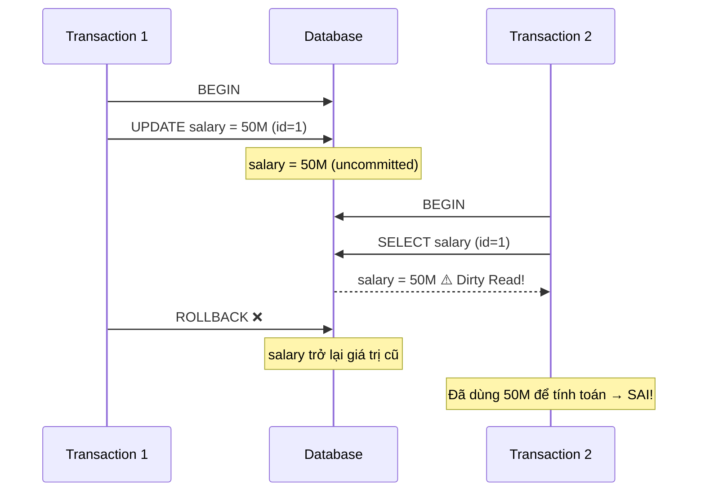
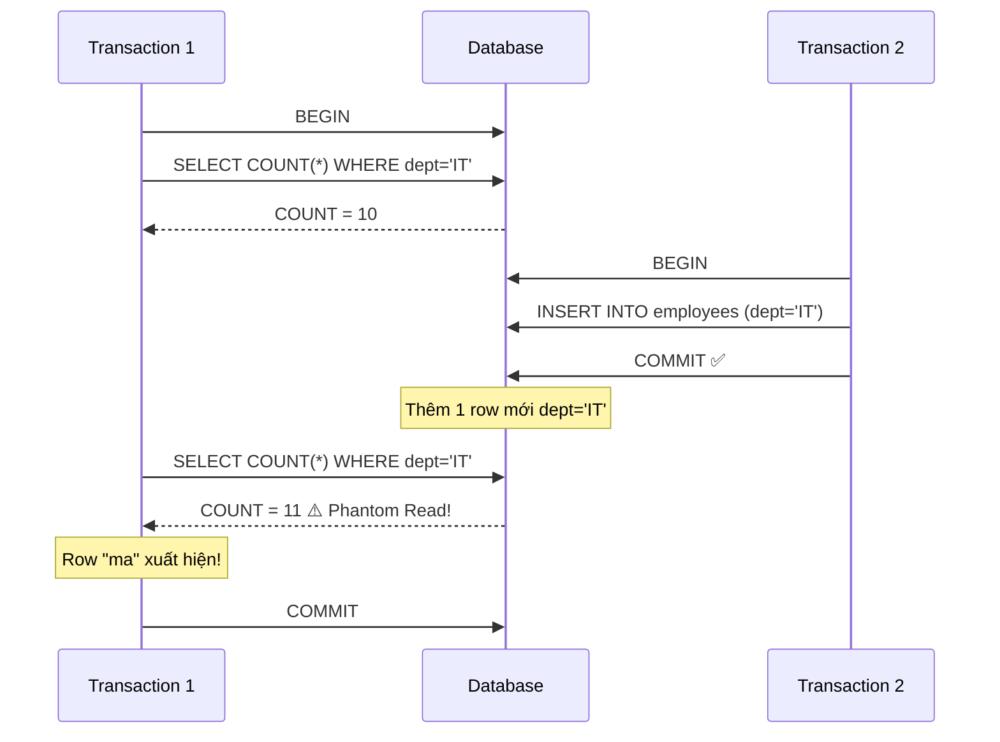
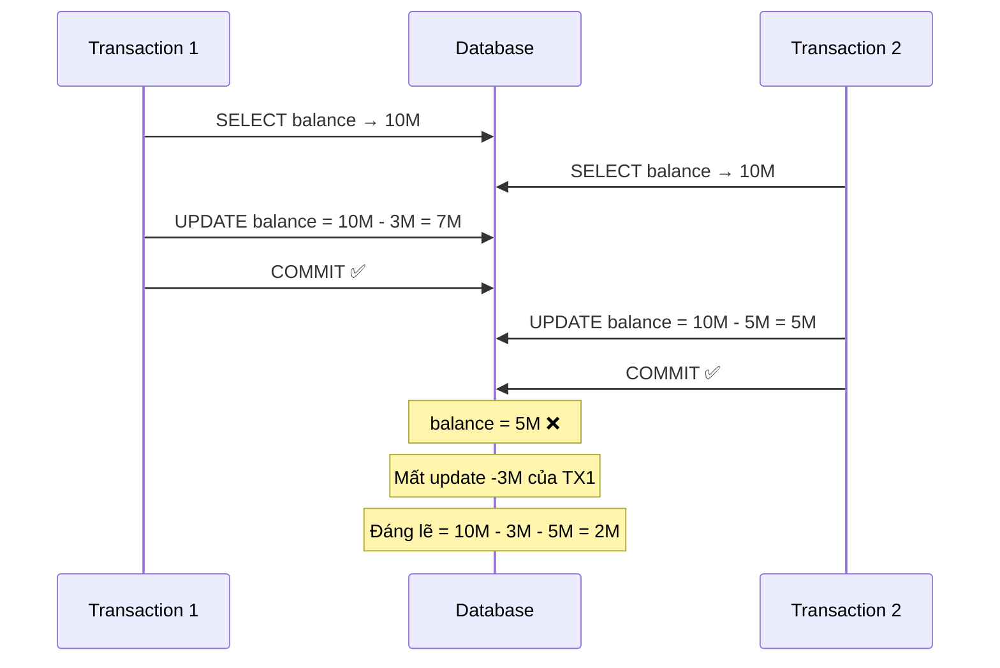

## Mục lục

- [Tại sao cần Isolation Levels](#tại-sao-cần-isolation-levels)
- [Các vấn đề đọc dữ liệu đồng thời](#các-vấn-đề-đọc-dữ-liệu-đồng-thời)
- [4 mức Isolation Level](#4-mức-isolation-level)
  - [Read Uncommitted](#read-uncommitted)
  - [Read Committed](#read-committed)
  - [Repeatable Read](#repeatable-read)
  - [Serializable](#serializable)
- [Bảng so sánh tổng hợp](#bảng-so-sánh-tổng-hợp)
- [Default Isolation Level theo Database](#default-isolation-level-theo-database)
- [Mermaid Diagram minh họa](#mermaid-diagram-minh-họa)
- [Khi nào chọn level nào](#khi-nào-chọn-level-nào)

---

## Tại sao cần Isolation Levels

Trong hệ thống thực tế, **hàng nghìn transaction** có thể chạy đồng thời trên cùng một database. Nếu không kiểm soát, các transaction sẽ can thiệp lẫn nhau, gây ra dữ liệu sai lệch.

Tuy nhiên, cô lập hoàn toàn (chạy tuần tự) sẽ **giết chết hiệu suất**. Isolation Levels cho phép ta **cân bằng** giữa tính đúng đắn và hiệu suất — chọn mức cô lập phù hợp với từng use case.

```
Hiệu suất cao ◄──────────────────────────────► Tính đúng đắn cao

Read Uncommitted → Read Committed → Repeatable Read → Serializable
   (ít lock)                                          (nhiều lock)
```

## Các vấn đề đọc dữ liệu đồng thời

Trước khi tìm hiểu các level, cần nắm rõ 3 vấn đề chính:

| Vấn đề | Mô tả | Mức độ nghiêm trọng |
|--------|--------|---------------------|
| **Dirty Read** | Đọc dữ liệu **chưa commit** từ transaction khác | 🔴 Cao |
| **Non-Repeatable Read** | Cùng query, chạy 2 lần cho **kết quả khác** (do row bị update) | 🟡 Trung bình |
| **Phantom Read** | Cùng query, chạy 2 lần thấy **thêm/bớt row** (do insert/delete) | 🟠 Trung bình |

## 4 mức Isolation Level

### Read Uncommitted

Mức cô lập **thấp nhất**. Transaction có thể đọc dữ liệu mà transaction khác đã thay đổi nhưng **chưa commit** (dirty read).

**Đặc điểm:**
- Không đặt read lock
- Hiệu suất cao nhất
- Rủi ro dữ liệu sai lệch cao nhất
- Rất hiếm khi được sử dụng trong thực tế

**Ví dụ minh họa Dirty Read:**

```sql
-- Session 1: Cập nhật salary nhưng CHƯA commit
SET TRANSACTION ISOLATION LEVEL READ UNCOMMITTED;
BEGIN;
UPDATE employees SET salary = 50000000 WHERE id = 1;
-- CHƯA COMMIT!

-- Session 2: Đọc dữ liệu chưa commit
SET TRANSACTION ISOLATION LEVEL READ UNCOMMITTED;
BEGIN;
SELECT salary FROM employees WHERE id = 1;
-- Kết quả: 50000000 ← Dirty Read! Dữ liệu chưa commit

-- Session 1: Rollback!
ROLLBACK;
-- salary thực tế vẫn là giá trị cũ, nhưng Session 2 đã dùng 50M để tính toán → SAI
```

```
Timeline:

Session 1: |--BEGIN--|--UPDATE salary=50M--|------------|--ROLLBACK--|
Session 2:              |--BEGIN--|--SELECT salary--|
                                     → 50M (DIRTY!) ❌
                                  Giá trị thực: vẫn là giá trị cũ
```

### Read Committed

Mức cô lập **mặc định** của PostgreSQL và Oracle. Transaction chỉ đọc được dữ liệu đã **commit**. Tránh được dirty read nhưng vẫn có thể gặp non-repeatable read.

**Đặc điểm:**
- Mỗi câu SELECT lấy snapshot tại thời điểm nó chạy
- Nếu transaction khác commit giữa 2 lần SELECT → kết quả khác nhau
- Phù hợp cho hầu hết các ứng dụng thông thường

**Ví dụ minh họa Non-Repeatable Read:**

```sql
-- Session 1
SET TRANSACTION ISOLATION LEVEL READ COMMITTED;
BEGIN;
SELECT salary FROM employees WHERE id = 1;
-- Kết quả: 20000000

    -- Session 2 chạy xen kẽ
    BEGIN;
    UPDATE employees SET salary = 30000000 WHERE id = 1;
    COMMIT;

-- Session 1 đọc lại
SELECT salary FROM employees WHERE id = 1;
-- Kết quả: 30000000 ← Non-Repeatable Read! Khác lần đọc trước
COMMIT;
```

```
Timeline:

Session 1: |--BEGIN--|--SELECT→20M--|---------------------|--SELECT→30M--|--COMMIT--|
Session 2:                   |--BEGIN--|--UPDATE=30M--|--COMMIT--|
                                                                 ↑
                                              Session 1 đọc lại → thấy giá trị mới
```

### Repeatable Read

Transaction **đóng băng snapshot** tại thời điểm transaction bắt đầu. Mọi lần đọc trong transaction đều thấy cùng dữ liệu — tránh dirty read và non-repeatable read. Tuy nhiên, **phantom read** vẫn có thể xảy ra (theo chuẩn SQL).

**Đặc điểm:**
- Snapshot được tạo khi transaction bắt đầu (hoặc khi chạy SELECT đầu tiên)
- Đây là default level của MySQL InnoDB
- MySQL InnoDB thực tế đã ngăn cả phantom read nhờ **gap locking**

**Ví dụ minh họa Phantom Read (theo chuẩn SQL):**

```sql
-- Session 1
SET TRANSACTION ISOLATION LEVEL REPEATABLE READ;
BEGIN;
SELECT COUNT(*) FROM employees WHERE department = 'IT';
-- Kết quả: 10

    -- Session 2
    BEGIN;
    INSERT INTO employees (name, department) VALUES ('Nguyễn Mới', 'IT');
    COMMIT;

-- Session 1 đọc lại
SELECT COUNT(*) FROM employees WHERE department = 'IT';
-- Theo chuẩn SQL: có thể thấy 11 (Phantom Read)
-- MySQL InnoDB: vẫn thấy 10 (gap lock ngăn phantom)
COMMIT;
```

```
Timeline:

Session 1: |--BEGIN--|--COUNT=10--|--------------------------|--COUNT=???--|
Session 2:                |--BEGIN--|--INSERT new row--|--COMMIT--|
                                                                  ↑
                                    Chuẩn SQL: COUNT=11 (Phantom Read)
                                    MySQL InnoDB: COUNT=10 (Gap Lock ngăn)
```

### Serializable

Mức cô lập **cao nhất**. Các transaction chạy đồng thời cho kết quả **giống hệt** như khi chạy tuần tự (serial). Ngăn tất cả các vấn đề: dirty read, non-repeatable read, phantom read.

**Đặc điểm:**
- PostgreSQL dùng **SSI** (Serializable Snapshot Isolation) — phát hiện conflict và abort transaction
- MySQL dùng **locking** — tất cả SELECT tự động thành `SELECT ... LOCK IN SHARE MODE`
- Hiệu suất thấp nhất, throughput giảm đáng kể
- Có thể gây **deadlock** và cần retry logic

**Ví dụ:**

```sql
-- PostgreSQL: Serializable
SET TRANSACTION ISOLATION LEVEL SERIALIZABLE;
BEGIN;

SELECT SUM(amount) FROM transactions WHERE account_id = 1;
-- PostgreSQL ghi nhận dependency

INSERT INTO transactions (account_id, amount) VALUES (1, -500000);
-- Nếu transaction khác cũng đọc/ghi cùng dữ liệu
-- → PostgreSQL phát hiện serialization conflict
-- → Abort 1 trong 2 transaction

COMMIT;
-- ERROR: could not serialize access due to read/write dependencies
-- → Application cần RETRY transaction
```

```sql
-- MySQL: Serializable
SET TRANSACTION ISOLATION LEVEL SERIALIZABLE;
BEGIN;

SELECT * FROM accounts WHERE id = 1;
-- MySQL tự động thêm LOCK IN SHARE MODE
-- → Block các transaction khác muốn UPDATE row này

UPDATE accounts SET balance = balance - 500000 WHERE id = 1;
COMMIT;
```

## Bảng so sánh tổng hợp

| Isolation Level | Dirty Read | Non-Repeatable Read | Phantom Read | Hiệu suất |
|----------------|-----------|-------------------|-------------|-----------|
| **Read Uncommitted** | ⚠️ Có thể xảy ra | ⚠️ Có thể xảy ra | ⚠️ Có thể xảy ra | ⚡ Cao nhất |
| **Read Committed** | ✅ Ngăn chặn | ⚠️ Có thể xảy ra | ⚠️ Có thể xảy ra | ⚡ Cao |
| **Repeatable Read** | ✅ Ngăn chặn | ✅ Ngăn chặn | ⚠️ Có thể xảy ra* | 🔄 Trung bình |
| **Serializable** | ✅ Ngăn chặn | ✅ Ngăn chặn | ✅ Ngăn chặn | 🐌 Thấp nhất |

> *MySQL InnoDB ở Repeatable Read đã ngăn phantom read nhờ gap locking. Tuy nhiên theo chuẩn SQL, phantom read vẫn được phép ở level này.

## Default Isolation Level theo Database

| Database | Default Level | Ghi chú |
|----------|--------------|---------|
| **MySQL (InnoDB)** | Repeatable Read | Sử dụng MVCC + gap locking, ngăn cả phantom read |
| **PostgreSQL** | Read Committed | Sử dụng MVCC, hỗ trợ SSI cho Serializable |
| **Oracle** | Read Committed | Chỉ hỗ trợ Read Committed và Serializable |
| **SQL Server** | Read Committed | Hỗ trợ thêm `SNAPSHOT` isolation (tương tự Repeatable Read) |

**Cách kiểm tra và thay đổi isolation level:**

```sql
-- MySQL: Kiểm tra
SELECT @@transaction_isolation;
-- Thay đổi cho session hiện tại
SET SESSION TRANSACTION ISOLATION LEVEL READ COMMITTED;
-- Thay đổi global
SET GLOBAL TRANSACTION ISOLATION LEVEL READ COMMITTED;

-- PostgreSQL: Kiểm tra
SHOW default_transaction_isolation;
-- Thay đổi cho transaction hiện tại
SET TRANSACTION ISOLATION LEVEL SERIALIZABLE;
-- Thay đổi trong postgresql.conf
-- default_transaction_isolation = 'read committed'
```

## Mermaid Diagram minh họa

### Dirty Read (Read Uncommitted)



### Phantom Read (Read Committed / Repeatable Read)



### Lost Update



## Khi nào chọn level nào

### Read Uncommitted

**Use case:** Hầu như không dùng trong production. Chỉ phù hợp cho:
- Đọc dữ liệu thống kê gần đúng (approximate count)
- Monitoring dashboard không cần chính xác tuyệt đối
- Debug trong development

### Read Committed

**Use case:** Phù hợp cho đa số ứng dụng thông thường:
- Web application CRUD cơ bản
- API endpoint đọc dữ liệu
- Report không yêu cầu snapshot nhất quán
- Hệ thống cần throughput cao

### Repeatable Read

**Use case:** Khi cần đọc nhất quán trong suốt transaction:
- Hệ thống tài chính tính toán số dư
- Batch processing đọc dữ liệu nhiều lần
- Report cần snapshot nhất quán (đọc nhiều bảng liên quan)
- Kiểm tra inventory trước khi đặt hàng

### Serializable

**Use case:** Khi tính đúng đắn là tối quan trọng:
- Chuyển tiền giữa các tài khoản
- Booking (đặt vé máy bay, phòng khách sạn) — tránh overbooking
- Auction system (đấu giá)
- Bất kỳ logic nào dạng "đọc → kiểm tra → ghi" cần serializable

**Lưu ý khi dùng Serializable:**

```sql
-- Luôn cần retry logic khi dùng Serializable
-- vì transaction có thể bị abort do serialization conflict

-- Ví dụ pseudocode:
-- max_retries = 3
-- for i in range(max_retries):
--     try:
--         execute_transaction()
--         break
--     except SerializationFailure:
--         if i == max_retries - 1:
--             raise
--         continue
```

### Bảng quyết định nhanh

| Tình huống | Isolation Level khuyên dùng |
|-----------|---------------------------|
| CRUD API thông thường | Read Committed |
| Đọc report đơn giản | Read Committed |
| Batch job tính toán | Repeatable Read |
| Chuyển tiền ngân hàng | Serializable |
| Đặt vé / booking | Serializable |
| Dashboard monitoring | Read Uncommitted / Read Committed |
| E-commerce checkout | Repeatable Read + `SELECT FOR UPDATE` |
| Analytics / data warehouse | Read Committed |
