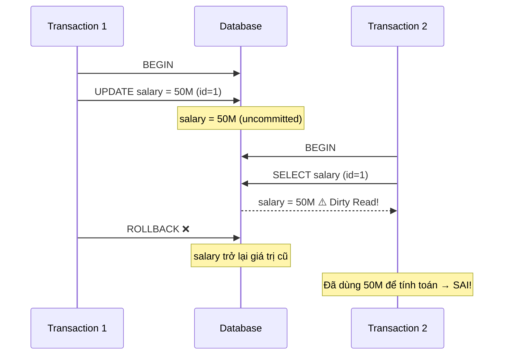
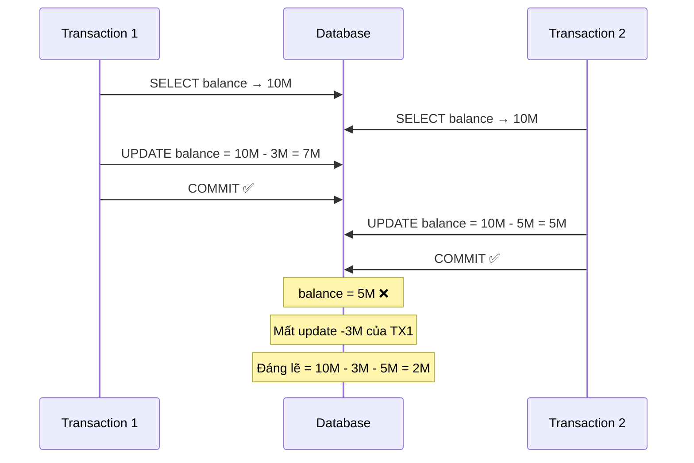

## Mục lục

- [Tại sao cần Isolation Levels](#tại-sao-cần-isolation-levels)
- [Các vấn đề đọc dữ liệu đồng thời](#các-vấn-đề-đọc-dữ-liệu-đồng-thời)
- [4 mức Isolation Level](#4-mức-isolation-level)
  - [Read Uncommitted](#read-uncommitted)
  - [Read Committed](#read-committed)
  - [Repeatable Read](#repeatable-read)
  - [Serializable](#serializable)
- [Bảng so sánh tổng hợp](#bảng-so-sánh-tổng-hợp)
- [Repeatable Read khác Serializable ở đâu?](#repeatable-read-khác-serializable-ở-đâu)
  - [Ví dụ write skew: hai bác sĩ cùng xin nghỉ](#ví-dụ-write-skew-hai-bác-sĩ-cùng-xin-nghỉ)
  - [Vì sao đọc lại COUNT vẫn không cứu được Repeatable Read?](#vì-sao-đọc-lại-count-vẫn-không-cứu-được-repeatable-read)
  - [Serializable xử lý thế nào?](#serializable-xử-lý-thế-nào)
- [Default Isolation Level theo Database](#default-isolation-level-theo-database)
- [Mermaid Diagram minh họa](#mermaid-diagram-minh-họa)
  - [Dirty Read (Read Uncommitted)](#dirty-read-read-uncommitted)
  - [Phantom Read (Read Committed hoặc SQL Server Repeatable Read)](#phantom-read-read-committed-hoặc-sql-server-repeatable-read)
  - [Lost Update](#lost-update)
- [Sự khác biệt giữa các Database](#sự-khác-biệt-giữa-các-database)
  - [PostgreSQL — chỉ có 3 behavior thực sự](#postgresql--chỉ-có-3-behavior-thực-sự)
  - [MySQL InnoDB — Repeatable Read mạnh hơn chuẩn](#mysql-innodb--repeatable-read-mạnh-hơn-chuẩn)
  - [PostgreSQL vs MySQL — Serializable khác nhau hoàn toàn](#postgresql-vs-mysql--serializable-khác-nhau-hoàn-toàn)
  - [Oracle — chỉ có Read Committed và Serializable](#oracle--chỉ-có-read-committed-và-serializable)
  - [Thực hành Phantom Read trên Oracle](#thực-hành-phantom-read-trên-oracle)
  - [SQL Server — Repeatable Read vẫn có Phantom Read](#sql-server--repeatable-read-vẫn-có-phantom-read)
  - [Bảng so sánh tổng hợp theo Database](#bảng-so-sánh-tổng-hợp-theo-database)
- [Khi nào chọn level nào](#khi-nào-chọn-level-nào)
  - [Khi nào dùng Read Uncommitted](#khi-nào-dùng-read-uncommitted)
  - [Khi nào dùng Read Committed](#khi-nào-dùng-read-committed)
  - [Khi nào dùng Repeatable Read](#khi-nào-dùng-repeatable-read)
  - [Khi nào dùng Serializable](#khi-nào-dùng-serializable)
  - [Bảng quyết định nhanh](#bảng-quyết-định-nhanh)

---

## Tại sao cần Isolation Levels

Trong hệ thống thực tế, **hàng nghìn transaction** có thể chạy đồng thời trên cùng một database. Nếu không kiểm soát, các transaction sẽ can thiệp lẫn nhau, gây ra dữ liệu sai lệch.

Tuy nhiên, cô lập hoàn toàn (chạy tuần tự) sẽ **giết chết hiệu suất**. Isolation Levels cho phép ta **cân bằng** giữa tính đúng đắn và hiệu suất — chọn mức cô lập phù hợp với từng use case.

```text
Hiệu suất/concurrency cao ◄──────────────────────► Đảm bảo nhất quán mạnh

Read Uncommitted → Read Committed → Repeatable Read → Serializable
```

Không nên hiểu chiều bên phải luôn đồng nghĩa với “nhiều lock hơn”. PostgreSQL dùng MVCC và Serializable Snapshot Isolation; Oracle dùng snapshot theo SCN; SQL Server thường dùng lock. Cùng một tên isolation level nhưng mỗi database có thể dùng cơ chế khác nhau.

## Các vấn đề đọc dữ liệu đồng thời

Trước khi tìm hiểu các level, cần nắm rõ 3 vấn đề chính:

| Vấn đề | Mô tả | Mức độ nghiêm trọng |
|--------|--------|---------------------|
| **Dirty Read** | Đọc dữ liệu **chưa commit** từ transaction khác | 🔴 Cao |
| **Non-Repeatable Read** | Cùng query, chạy 2 lần cho **kết quả khác** (do row bị update) | 🟡 Trung bình |
| **Phantom Read** | Cùng query, chạy 2 lần thấy **thêm/bớt row** (do insert/delete) | 🟠 Trung bình |

## 4 mức Isolation Level

### Read Uncommitted

Mức cô lập **thấp nhất**. Transaction có thể đọc dữ liệu mà transaction khác đã thay đổi nhưng **chưa commit** (dirty read).

**Đặc điểm:**
- Không đặt read lock
- Hiệu suất cao nhất
- Rủi ro dữ liệu sai lệch cao nhất
- Rất hiếm khi được sử dụng trong thực tế

**Ví dụ minh họa Dirty Read:**

```sql
-- Session 1: Cập nhật salary nhưng CHƯA commit
SET TRANSACTION ISOLATION LEVEL READ UNCOMMITTED;
BEGIN;
UPDATE employees SET salary = 50000000 WHERE id = 1;
-- CHƯA COMMIT!

-- Session 2: Đọc dữ liệu chưa commit
SET TRANSACTION ISOLATION LEVEL READ UNCOMMITTED;
BEGIN;
SELECT salary FROM employees WHERE id = 1;
-- Kết quả: 50000000 ← Dirty Read! Dữ liệu chưa commit

-- Session 1: Rollback!
ROLLBACK;
-- salary thực tế vẫn là giá trị cũ, nhưng Session 2 đã dùng 50M để tính toán → SAI
```

```
Timeline:

Session 1: |--BEGIN--|--UPDATE salary=50M--|------------|--ROLLBACK--|
Session 2:              |--BEGIN--|--SELECT salary--|
                                     → 50M (DIRTY!) ❌
                                  Giá trị thực: vẫn là giá trị cũ
```

### Read Committed

Mức cô lập **mặc định** của PostgreSQL và Oracle. Transaction chỉ đọc được dữ liệu đã **commit**. Tránh được dirty read nhưng vẫn có thể gặp non-repeatable read.

**Đặc điểm:**
- Mỗi câu SELECT lấy snapshot tại thời điểm nó chạy
- Nếu transaction khác commit giữa 2 lần SELECT → kết quả khác nhau
- Phù hợp cho hầu hết các ứng dụng thông thường

**Ví dụ minh họa Non-Repeatable Read:**

```sql
-- Session 1
SET TRANSACTION ISOLATION LEVEL READ COMMITTED;
BEGIN;
SELECT salary FROM employees WHERE id = 1;
-- Kết quả: 20000000

    -- Session 2 chạy xen kẽ
    BEGIN;
    UPDATE employees SET salary = 30000000 WHERE id = 1;
    COMMIT;

-- Session 1 đọc lại
SELECT salary FROM employees WHERE id = 1;
-- Kết quả: 30000000 ← Non-Repeatable Read! Khác lần đọc trước
COMMIT;
```

```
Timeline:

Session 1: |--BEGIN--|--SELECT→20M--|---------------------|--SELECT→30M--|--COMMIT--|
Session 2:                   |--BEGIN--|--UPDATE=30M--|--COMMIT--|
                                                                 ↑
                                              Session 1 đọc lại → thấy giá trị mới
```

### Repeatable Read

`REPEATABLE READ` bảo đảm row đã đọc không tự đổi giá trị giữa hai lần đọc trong cùng transaction. Theo mức đảm bảo tối thiểu của chuẩn SQL, level này vẫn **được phép** có phantom read: một row mới do transaction khác chèn có thể xuất hiện ở lần chạy query thứ hai.

Tuy nhiên, “được phép” không có nghĩa mọi database đều trả kết quả đó. Implementation thực tế khác nhau:

| Database ở `REPEATABLE READ` | Lần đầu `COUNT=10`, transaction khác INSERT rồi commit, lần hai |
|---|---:|
| PostgreSQL | **10** — snapshot transaction ổn định |
| MySQL InnoDB, consistent read thông thường | **10** — consistent snapshot ổn định |
| SQL Server | Có thể **11** — khóa row cũ nhưng không khóa khoảng chèn row mới |
| Oracle | Không có level `REPEATABLE READ` |

Ví dụ `10 → 11` phù hợp với SQL Server:

```sql
-- SQL Server — Session 1
SET TRANSACTION ISOLATION LEVEL REPEATABLE READ;
BEGIN TRANSACTION;

SELECT COUNT(*)
FROM employees
WHERE department = 'IT';
-- 10

-- Session 2 INSERT một employee IT rồi COMMIT

SELECT COUNT(*)
FROM employees
WHERE department = 'IT';
-- Có thể 11: Phantom Read

COMMIT;
```

SQL Server giữ shared lock trên 10 row đã đọc nên transaction khác không thể sửa/xóa chúng. Nhưng `REPEATABLE READ` không yêu cầu key-range lock, nên một row thứ 11 vẫn có thể được chèn. `SERIALIZABLE` mới khóa cả range để ngăn trường hợp này.

Với PostgreSQL và consistent read thông thường của MySQL InnoDB, lần hai vẫn là `10`. Snapshot ổn định khiến row được chèn sau snapshot không visible với transaction đang đọc.

> [!IMPORTANT]
> MySQL InnoDB không chỉ có một loại read. Plain `SELECT` là consistent read và tránh phantom nhờ snapshot. Locking read như `SELECT ... FOR UPDATE` đọc trạng thái hiện tại và dùng next-key/gap lock để ngăn transaction khác chèn vào range đang khóa.

### Serializable

Mức cô lập **cao nhất**. Các transaction chạy đồng thời cho kết quả **giống hệt** như khi chạy tuần tự (serial). Ngăn tất cả các vấn đề: dirty read, non-repeatable read, phantom read.

**Đặc điểm:**
- PostgreSQL dùng **SSI** (Serializable Snapshot Isolation): cho chạy đồng thời, theo dõi dependency rồi abort transaction khi cần.
- MySQL InnoDB chủ yếu dùng locking; khi `autocommit` tắt, plain `SELECT` ở `SERIALIZABLE` được xử lý như locking read.
- Oracle dùng snapshot theo SCN và có thể báo `ORA-08177` khi transaction không thể serialize.
- SQL Server dùng key-range lock để ngăn row mới xuất hiện trong range đã đọc.
- Có thể giảm throughput do blocking, abort hoặc retry; mức ảnh hưởng phụ thuộc database và tỷ lệ conflict.

**Ví dụ:**

```sql
-- PostgreSQL: Serializable
SET TRANSACTION ISOLATION LEVEL SERIALIZABLE;
BEGIN;

SELECT SUM(amount) FROM transactions WHERE account_id = 1;
-- PostgreSQL ghi nhận dependency

INSERT INTO transactions (account_id, amount) VALUES (1, -500000);
-- Nếu transaction khác cũng đọc/ghi cùng dữ liệu
-- → PostgreSQL phát hiện serialization conflict
-- → Abort 1 trong 2 transaction

COMMIT;
-- ERROR: could not serialize access due to read/write dependencies
-- → Application cần RETRY transaction
```

```sql
-- MySQL: Serializable
SET TRANSACTION ISOLATION LEVEL SERIALIZABLE;
BEGIN;

SELECT * FROM accounts WHERE id = 1;
-- MySQL tự động thêm LOCK IN SHARE MODE
-- → Block các transaction khác muốn UPDATE row này

UPDATE accounts SET balance = balance - 500000 WHERE id = 1;
COMMIT;
```

## Bảng so sánh tổng hợp

| Isolation Level | Dirty Read | Non-Repeatable Read | Phantom Read | Hiệu suất |
|----------------|-----------|-------------------|-------------|-----------|
| **Read Uncommitted** | ⚠️ Có thể xảy ra | ⚠️ Có thể xảy ra | ⚠️ Có thể xảy ra | ⚡ Cao nhất |
| **Read Committed** | ✅ Ngăn chặn | ⚠️ Có thể xảy ra | ⚠️ Có thể xảy ra | ⚡ Cao |
| **Repeatable Read** | ✅ Ngăn chặn | ✅ Ngăn chặn | ⚠️ Chuẩn SQL cho phép; tùy implementation | 🔄 Trung bình |
| **Serializable** | ✅ Ngăn chặn | ✅ Ngăn chặn | ✅ Ngăn chặn | 🐌 Thấp nhất |

> [!NOTE]
> Bảng trên mô tả mức đảm bảo của chuẩn SQL. PostgreSQL và MySQL InnoDB ngăn classic phantom ở `REPEATABLE READ`, còn SQL Server vẫn có thể gặp. Ngăn phantom cũng chưa đồng nghĩa với ngăn mọi serialization anomaly; snapshot isolation vẫn có thể gặp write skew.

## Repeatable Read khác Serializable ở đâu?

Trong PostgreSQL, cả hai level đều giữ một snapshot ổn định. Khác biệt nằm ở mức đảm bảo khi **nhiều transaction cùng đọc rồi ghi**:

```text
REPEATABLE READ
= transaction có góc nhìn ổn định.

SERIALIZABLE
= góc nhìn ổn định
+ kết quả cuối phải tương đương với một thứ tự chạy lần lượt.
```

“Chạy lần lượt” nghĩa là T1 chạy xong rồi T2, hoặc T2 chạy xong rồi T1. Nếu kết quả của hai transaction đồng thời không thể xuất hiện trong bất kỳ thứ tự nào như vậy, hệ thống phải block hoặc abort một transaction.

### Ví dụ write skew: hai bác sĩ cùng xin nghỉ

Bảng ban đầu:

```sql
CREATE TABLE doctors (
    name    TEXT PRIMARY KEY,
    on_call BOOLEAN NOT NULL
);

INSERT INTO doctors VALUES
    ('An', true),
    ('Binh', true);
```

Quy tắc nghiệp vụ: **luôn phải còn ít nhất một bác sĩ trực**. Một bác sĩ chỉ được nghỉ khi có nhiều hơn một người đang trực.

Nếu chạy tuần tự:

```text
T1 chạy trước: thấy 2 người → cho An nghỉ → COMMIT
T2 chạy sau:  thấy 1 người → không cho Bình nghỉ
```

Nếu đổi thứ tự, Bình nghỉ và An ở lại. Không có thứ tự tuần tự hợp lệ nào dẫn tới cả hai cùng nghỉ.

Với PostgreSQL `REPEATABLE READ`, hai transaction có thể chạy như sau:

```sql
-- Session T1
BEGIN ISOLATION LEVEL REPEATABLE READ;
SELECT COUNT(*) FROM doctors WHERE on_call = true; -- 2
UPDATE doctors SET on_call = false WHERE name = 'An';

-- Session T2, bắt đầu trước khi T1 commit
BEGIN ISOLATION LEVEL REPEATABLE READ;
SELECT COUNT(*) FROM doctors WHERE on_call = true; -- 2
UPDATE doctors SET on_call = false WHERE name = 'Binh';
```

Hai snapshot đều thấy trạng thái ban đầu:

```text
Snapshot T1: An=true, Bình=true
Snapshot T2: An=true, Bình=true
```

T1 ghi row `An`, T2 ghi row `Binh`, nên không có write/write conflict trên cùng một row. Cả hai có thể commit và tạo ra:

```text
An=false, Bình=false  ❌
```

Đây là **write skew**: mỗi transaction đưa ra quyết định hợp lệ theo snapshot riêng, nhưng hai quyết định kết hợp lại vi phạm invariant nghiệp vụ.

### Vì sao đọc lại COUNT vẫn không cứu được Repeatable Read?

Sau khi update, T1 đọc lại:

```text
T1 thấy:
An=false   ← thay đổi của chính T1
Bình=true  ← từ snapshot cũ
COUNT=1
```

T2 cũng đọc lại:

```text
T2 thấy:
An=true    ← từ snapshot cũ
Bình=false ← thay đổi của chính T2
COUNT=1
```

Mỗi transaction luôn thấy thay đổi của chính nó, nhưng không thấy thay đổi concurrent nằm ngoài snapshot. Vì vậy cả hai vẫn nghĩ còn một bác sĩ khác đang trực.

```text
T1 snapshot                 T2 snapshot
An=true                     An=true
Bình=true                   Bình=true

T1 update An=false          T2 update Bình=false

T1 COUNT=1                  T2 COUNT=1
T1 COMMIT                   T2 COMMIT

Database cuối: An=false, Bình=false
```

Điều này không phải phantom read. Phantom là cùng một transaction chạy lại predicate và thấy tập row thay đổi, ví dụ `COUNT 10 → 11`. Ở đây mỗi transaction vẫn thấy snapshot ổn định; lỗi nằm ở **tổng hợp hai quyết định ghi**.

### Serializable xử lý thế nào?

PostgreSQL `SERIALIZABLE` vẫn có thể cho T1 và T2 đọc cùng snapshot. Nó không làm mới snapshot để transaction tự nhìn thấy thay đổi concurrent. Thay vào đó, SSI theo dõi dependency:

```text
T1 đọc Bình=true, nhưng T2 ghi Bình=false.
T2 đọc An=true, nhưng T1 ghi An=false.
```

Các dependency tạo thành một cấu trúc nguy hiểm. Nếu cả hai commit, kết quả không thể tương đương với T1→T2 hoặc T2→T1. PostgreSQL abort một transaction:

```text
T1 → COMMIT thành công
T2 → ERROR: could not serialize access due to
     read/write dependencies among transactions
```

Application phải retry toàn bộ T2. Lần chạy lại, snapshot mới thấy chỉ còn một bác sĩ trực nên không cho người còn lại nghỉ.

| Thuộc tính | PostgreSQL Repeatable Read | PostgreSQL Serializable |
|---|---|---|
| Snapshot ổn định | Có | Có |
| Ngăn non-repeatable read | Có | Có |
| Ngăn classic phantom | Có | Có |
| Có thể gặp write skew | **Có** | Không cho cả hai transaction cùng commit |
| Theo dõi dependency đọc–ghi | Không để bảo đảm serializability | Có, qua SSI |
| Có thể cần retry | Có thể do write conflict | Có, đặc biệt SQLSTATE `40001` |

> [!WARNING]
> `SERIALIZABLE` không có nghĩa application không bao giờ gặp lỗi concurrency. Nó bảo vệ tính đúng đắn bằng cách từ chối một transaction khi cần, nên application phải có retry với giới hạn và backoff phù hợp.

## Default Isolation Level theo Database

| Database | Default Level | Ghi chú |
|----------|--------------|---------|
| **MySQL (InnoDB)** | Repeatable Read | Plain read dùng consistent snapshot; locking read có next-key/gap lock |
| **PostgreSQL** | Read Committed | Sử dụng MVCC, hỗ trợ SSI cho Serializable |
| **Oracle** | Read Committed | Hỗ trợ Read Committed, Serializable và transaction Read Only |
| **SQL Server** | Read Committed | Hỗ trợ thêm RCSI và `SNAPSHOT`; `REPEATABLE READ` vẫn có thể phantom |

**Cách kiểm tra và thay đổi isolation level:**

```sql
-- MySQL: Kiểm tra
SELECT @@transaction_isolation;
-- Thay đổi cho session hiện tại
SET SESSION TRANSACTION ISOLATION LEVEL READ COMMITTED;
-- Thay đổi global
SET GLOBAL TRANSACTION ISOLATION LEVEL READ COMMITTED;

-- PostgreSQL: Kiểm tra
SHOW default_transaction_isolation;
-- Thay đổi cho transaction hiện tại
SET TRANSACTION ISOLATION LEVEL SERIALIZABLE;
-- Thay đổi trong postgresql.conf
-- default_transaction_isolation = 'read committed'
```

## Mermaid Diagram minh họa

### Dirty Read (Read Uncommitted)



### Phantom Read (Read Committed hoặc SQL Server Repeatable Read)

```mermaid
sequenceDiagram
    participant TX1 as Transaction 1
    participant DB as Database
    participant TX2 as Transaction 2

    TX1->>DB: BEGIN
    TX1->>DB: SELECT COUNT(*) WHERE dept='IT'
    DB-->>TX1: COUNT = 10

    TX2->>DB: BEGIN
    TX2->>DB: INSERT INTO employees (dept='IT')
    TX2->>DB: COMMIT ✅
    Note over DB: Thêm 1 row mới dept='IT'

    TX1->>DB: SELECT COUNT(*) WHERE dept='IT'
    DB-->>TX1: COUNT = 11 ⚠️ Phantom Read!
    Note over TX1: Xảy ra ở Read Committed; cũng có thể xảy ra ở SQL Server Repeatable Read
    TX1->>DB: COMMIT
```

PostgreSQL `REPEATABLE READ` và MySQL InnoDB consistent read thông thường sẽ trả lại `10`, không đi theo diagram này.

### Lost Update



## Sự khác biệt giữa các Database

Chuẩn SQL định nghĩa 4 isolation levels, nhưng mỗi database **implement khác nhau** — thậm chí cùng tên level nhưng behavior không giống nhau.

### PostgreSQL — chỉ có 3 behavior thực sự

PostgreSQL dùng **MVCC thuần túy** cho mọi read operation. Điều này có nghĩa là reader không bao giờ block writer và ngược lại — và **dirty read không thể xảy ra** dù bạn set level nào.

```
Chuẩn SQL:   READ UNCOMMITTED → READ COMMITTED → REPEATABLE READ → SERIALIZABLE
PostgreSQL:  READ UNCOMMITTED ↗
                              READ COMMITTED  → REPEATABLE READ → SERIALIZABLE
                              (behavior giống nhau)
```

| Level (set) | Behavior thực tế trong PostgreSQL |
|-------------|----------------------------------|
| READ UNCOMMITTED | Hoạt động **giống READ COMMITTED** — MVCC không bao giờ show uncommitted data |
| READ COMMITTED | Snapshot mới cho **mỗi statement** trong transaction |
| REPEATABLE READ | Snapshot cố định từ statement **đầu tiên** của transaction — ngăn cả phantom read |
| SERIALIZABLE | Dùng **SSI** (Serializable Snapshot Isolation) — optimistic, phát hiện conflict sau |

**PostgreSQL REPEATABLE READ ngăn cả phantom read** — khác với chuẩn SQL (chuẩn SQL chỉ yêu cầu ngăn non-repeatable read ở level này). Lý do: snapshot MVCC đã "đóng băng" toàn bộ view của data, insert mới từ transaction khác không thể lọt vào.

```sql
-- PostgreSQL: REPEATABLE READ vẫn ngăn phantom read
BEGIN TRANSACTION ISOLATION LEVEL REPEATABLE READ;
SELECT COUNT(*) FROM employees WHERE dept = 'IT';  -- = 10

-- Session khác INSERT + COMMIT

SELECT COUNT(*) FROM employees WHERE dept = 'IT';  -- vẫn = 10 (không phải 11)
COMMIT;
```

---

### MySQL InnoDB — Repeatable Read mạnh hơn chuẩn

MySQL InnoDB mặc định dùng `REPEATABLE READ`, nhưng cần phân biệt **consistent read** và **locking read**:

| Kiểu đọc ở Repeatable Read | Ví dụ | Cơ chế chính |
|---|---|---|
| Consistent read | Plain `SELECT` | MVCC consistent snapshot; lần hai vẫn thấy cùng dữ liệu |
| Locking read | `SELECT ... FOR UPDATE` / `FOR SHARE` | Current read + next-key/gap lock |

Với plain `SELECT COUNT(*)`, transaction khác có thể `INSERT` và commit, nhưng transaction đang đọc vẫn thấy `10` vì row mới không thuộc snapshot. Không có read lock nào cần giữ cho plain consistent read này.

Với locking read, InnoDB cần bảo vệ cả phạm vi predicate. **Next-key lock** kết hợp record lock và gap lock để ngăn transaction khác chèn row vào khoảng đang khóa:

```sql
START TRANSACTION;

SELECT *
FROM employees
WHERE department = 'IT'
FOR UPDATE;
-- Transaction khác có thể bị block khi INSERT row IT phù hợp range lock
```

| Level | Plain consistent read | Locking read / ghi | Classic phantom |
|---|---|---|---|
| READ UNCOMMITTED | Có thể đọc uncommitted | Lock theo thao tác ghi | Có thể xảy ra |
| READ COMMITTED | Snapshot mới mỗi statement | Ít gap lock hơn | Có thể xảy ra |
| REPEATABLE READ | Snapshot transaction ổn định | Next-key/gap lock khi phù hợp | Thông thường được ngăn |
| SERIALIZABLE | Read được nâng thành locking read khi transaction phù hợp | Locking mạnh hơn | Được ngăn |

> [!NOTE]
> Không nên giải thích mọi trường hợp MySQL `REPEATABLE READ` bằng gap lock. Plain consistent read giữ kết quả ổn định nhờ MVCC snapshot; gap/next-key lock chủ yếu giải quyết locking read và thao tác ghi.

---

### PostgreSQL vs MySQL — Serializable khác nhau hoàn toàn

Đây là điểm khác biệt lớn nhất:

| | PostgreSQL Serializable | MySQL Serializable |
|--|------------------------|-------------------|
| **Cơ chế** | SSI — Serializable Snapshot Isolation | Pessimistic Locking |
| **Approach** | **Optimistic** — chạy trước, phát hiện conflict sau | **Pessimistic** — block ngay từ đầu |
| **Khi conflict** | Abort 1 transaction → app phải retry | Block và chờ transaction kia xong |
| **Throughput** | Cao hơn khi ít conflict | Thấp hơn — nhiều lock contention |
| **Deadlock** | Ít hơn | Nhiều hơn (do locking) |
| **SELECT** | Không thêm lock | Tự động thêm `LOCK IN SHARE MODE` |

```sql
-- PostgreSQL Serializable: chạy bình thường, lỗi xảy ra khi COMMIT
BEGIN TRANSACTION ISOLATION LEVEL SERIALIZABLE;
SELECT SUM(amount) FROM accounts WHERE user_id = 1;
INSERT INTO transactions ...;
COMMIT;
-- ERROR: could not serialize access due to read/write dependencies
-- → App cần retry

-- MySQL Serializable: block ngay khi SELECT
BEGIN;
SELECT * FROM accounts WHERE user_id = 1;
-- ^ Tự động thêm LOCK IN SHARE MODE
-- → Transaction khác muốn UPDATE row này phải chờ
```

---

### Oracle — chỉ có Read Committed và Serializable

Oracle không có isolation level tên `READ UNCOMMITTED` hoặc `REPEATABLE READ`. Hai level isolation chính là:

```sql
SET TRANSACTION ISOLATION LEVEL READ COMMITTED; -- mặc định
SET TRANSACTION ISOLATION LEVEL SERIALIZABLE;
```

Oracle còn có transaction mode chỉ đọc:

```sql
SET TRANSACTION READ ONLY;
```

`SET TRANSACTION` phải là statement đầu tiên của transaction. Nếu session đang có transaction mở, hãy `COMMIT` hoặc `ROLLBACK` trước.

| Oracle mode | Snapshot | Phantom giữa hai statement |
|---|---|---|
| `READ COMMITTED` | Mỗi statement lấy một snapshot SCN | Có thể xảy ra |
| `SERIALIZABLE` | Snapshot ổn định cho transaction | Không |
| `READ ONLY` | Snapshot ổn định, không DML thông thường | Không |
| `REPEATABLE READ` | Không hỗ trợ | N/A |

Ở `READ COMMITTED`, mỗi statement riêng lẻ vẫn nhất quán. Một query chạy lâu không thay snapshot giữa chừng; chỉ statement tiếp theo mới có thể thấy commit mới.

Ở `SERIALIZABLE`, transaction khác vẫn có thể insert và commit. Oracle không nhất thiết block insert như SQL Server key-range locking. Transaction đang đọc đơn giản tiếp tục nhìn snapshot SCN cũ. Nếu nó cố cập nhật dữ liệu đã bị thay đổi sau khi snapshot được thiết lập, Oracle có thể báo:

```text
ORA-08177: can't serialize access for this transaction
```

Application phải rollback và retry toàn bộ transaction.

### Thực hành Phantom Read trên Oracle

Mở hai worksheet trong SQL Developer, kết nối cùng schema.

#### Chuẩn bị dữ liệu

Chạy một lần:

```sql
BEGIN
    EXECUTE IMMEDIATE 'DROP TABLE isolation_employees PURGE';
EXCEPTION
    WHEN OTHERS THEN
        IF SQLCODE != -942 THEN
            RAISE;
        END IF;
END;
/

CREATE TABLE isolation_employees (
    id         NUMBER PRIMARY KEY,
    name       VARCHAR2(100) NOT NULL,
    department VARCHAR2(20) NOT NULL
);

INSERT ALL
    INTO isolation_employees VALUES (1,  'IT 01', 'IT')
    INTO isolation_employees VALUES (2,  'IT 02', 'IT')
    INTO isolation_employees VALUES (3,  'IT 03', 'IT')
    INTO isolation_employees VALUES (4,  'IT 04', 'IT')
    INTO isolation_employees VALUES (5,  'IT 05', 'IT')
    INTO isolation_employees VALUES (6,  'IT 06', 'IT')
    INTO isolation_employees VALUES (7,  'IT 07', 'IT')
    INTO isolation_employees VALUES (8,  'IT 08', 'IT')
    INTO isolation_employees VALUES (9,  'IT 09', 'IT')
    INTO isolation_employees VALUES (10, 'IT 10', 'IT')
SELECT 1 FROM dual;

COMMIT;
```

Xác nhận:

```sql
SELECT COUNT(*) AS it_count
FROM isolation_employees
WHERE department = 'IT';
-- 10
```

#### Test 1 — Read Committed trả 10 rồi 11

Session 1:

```sql
COMMIT;
SET TRANSACTION ISOLATION LEVEL READ COMMITTED;

SELECT COUNT(*) AS first_count
FROM isolation_employees
WHERE department = 'IT';
-- 10

-- Dừng ở đây, chưa COMMIT
```

Session 2:

```sql
INSERT INTO isolation_employees(id, name, department)
VALUES (11, 'IT 11', 'IT');

COMMIT;
```

Quay lại Session 1:

```sql
SELECT COUNT(*) AS second_count
FROM isolation_employees
WHERE department = 'IT';
-- 11: statement mới lấy snapshot SCN mới

COMMIT;
```

#### Test 2 — Serializable vẫn trả 10

Reset ở một session không còn transaction mở:

```sql
DELETE FROM isolation_employees WHERE id = 11;
COMMIT;
```

Session 1:

```sql
COMMIT;
SET TRANSACTION ISOLATION LEVEL SERIALIZABLE;

SELECT COUNT(*) AS first_count
FROM isolation_employees
WHERE department = 'IT';
-- 10

-- Dừng ở đây, chưa COMMIT
```

Session 2:

```sql
INSERT INTO isolation_employees(id, name, department)
VALUES (11, 'IT 11', 'IT');

COMMIT;
-- Thường thành công, không nhất thiết bị block
```

Quay lại Session 1:

```sql
SELECT COUNT(*) AS second_count
FROM isolation_employees
WHERE department = 'IT';
-- Vẫn 10: row id=11 nằm sau snapshot SCN của transaction

COMMIT;

SELECT COUNT(*) AS after_commit_count
FROM isolation_employees
WHERE department = 'IT';
-- 11: transaction mới lấy snapshot mới
```

#### Test 3 — Read Only giữ snapshot nhưng không cho ghi

Reset:

```sql
DELETE FROM isolation_employees WHERE id = 11;
COMMIT;
```

Session 1:

```sql
COMMIT;
SET TRANSACTION READ ONLY;

SELECT COUNT(*)
FROM isolation_employees
WHERE department = 'IT';
-- 10
```

Session 2 insert `id=11` rồi commit như các test trước. Session 1 đọc lại:

```sql
SELECT COUNT(*)
FROM isolation_employees
WHERE department = 'IT';
-- Vẫn 10

INSERT INTO isolation_employees(id, name, department)
VALUES (12, 'IT 12', 'IT');
-- ORA-01456: may not perform insert/delete/update operation
-- in a READ ONLY transaction

ROLLBACK;
```

#### Test 4 — Quan sát ORA-08177

Reset và bảo đảm Session 1 bắt đầu trước khi Session 2 update:

```sql
-- Session 1
COMMIT;
SET TRANSACTION ISOLATION LEVEL SERIALIZABLE;

SELECT name
FROM isolation_employees
WHERE id = 1;
-- IT 01
```

Session 2:

```sql
UPDATE isolation_employees
SET name = 'IT 01 changed by T2'
WHERE id = 1;

COMMIT;
```

Quay lại Session 1 và cố ghi vào row đã thay đổi sau snapshot:

```sql
UPDATE isolation_employees
SET name = 'IT 01 changed by T1'
WHERE id = 1;
-- ORA-08177: can't serialize access for this transaction

ROLLBACK;
```

Test này minh họa một hành vi khác với query `COUNT(*)`. Session 2 có thể commit bình thường, nhưng khi Session 1 cố ghi dựa trên snapshot cũ, Oracle từ chối để tránh kết quả không thể serialize.

Kết quả cần quan sát:

| Oracle mode | Lần đầu | Session 2 insert | Lần hai trong Session 1 |
|---|---:|---|---:|
| `READ COMMITTED` | 10 | Commit thành công | **11** |
| `SERIALIZABLE` | 10 | Thường commit thành công | **10** |
| `READ ONLY` | 10 | Commit thành công | **10** |

> [!IMPORTANT]
> Oracle ngăn phantom ở `SERIALIZABLE` bằng snapshot ổn định, không nhất thiết bằng cách block transaction chèn row mới. Sau khi Session 1 commit và chạy statement mới, nó sẽ thấy row thứ 11.

---

### SQL Server — Repeatable Read vẫn có Phantom Read

SQL Server `REPEATABLE READ` giữ shared lock trên những row đã đọc đến cuối transaction. Điều này ngăn transaction khác update/delete các row cũ, nhưng không bảo vệ toàn bộ key range nên row mới vẫn có thể được insert.

```sql
-- Session 1
SET TRANSACTION ISOLATION LEVEL REPEATABLE READ;
BEGIN TRANSACTION;

SELECT COUNT(*)
FROM dbo.employees
WHERE department = 'IT';
-- 10

-- Session 2 INSERT một row IT rồi COMMIT

SELECT COUNT(*)
FROM dbo.employees
WHERE department = 'IT';
-- Có thể 11

COMMIT;
```

Ở `SERIALIZABLE`, SQL Server dùng key-range lock. Nếu có index phù hợp cho predicate, insert vào range `department = 'IT'` sẽ bị block cho tới khi transaction đọc kết thúc.

SQL Server còn hỗ trợ row versioning qua RCSI và `SNAPSHOT`:

```sql
ALTER DATABASE mydb SET READ_COMMITTED_SNAPSHOT ON;
ALTER DATABASE mydb SET ALLOW_SNAPSHOT_ISOLATION ON;

SET TRANSACTION ISOLATION LEVEL SNAPSHOT;
```

| Level / option | Cơ chế chính | Ghi chú |
|---|---|---|
| `READ UNCOMMITTED` | Không giữ shared read lock | Có dirty read |
| `READ COMMITTED` mặc định | Lock-based | Shared lock thường nhả sau statement |
| RCSI | Row versioning theo statement | Vẫn là semantics Read Committed |
| `REPEATABLE READ` | Giữ lock trên row đã đọc | Vẫn có thể phantom |
| `SNAPSHOT` | Snapshot transaction qua row versions | Ngăn classic phantom nhưng có thể write skew |
| `SERIALIZABLE` | Key-range locking | Ngăn phantom bằng blocking |

> [!NOTE]
> `SNAPSHOT` không tương đương hoàn toàn với `SERIALIZABLE`. Nó giữ góc nhìn transaction ổn định nhưng vẫn có thể gặp write skew, tương tự bài toán hai bác sĩ. `SERIALIZABLE` mới bảo đảm kết quả tương đương chạy tuần tự.

---

### Bảng so sánh tổng hợp theo Database

| | MySQL InnoDB | PostgreSQL | Oracle | SQL Server |
|--|-------------|-----------|--------|-----------|
| **Default level** | Repeatable Read | Read Committed | Read Committed | Read Committed |
| **MVCC / row versioning** | ✅ | ✅ | ✅ (SCN + undo) | ✅ (opt-in RCSI/SNAPSHOT) |
| **READ UNCOMMITTED** | ✅ (dirty read) | Nhận cú pháp nhưng chạy như RC | ❌ | ✅ |
| **READ COMMITTED** | ✅ | ✅ | ✅ | ✅ |
| **REPEATABLE READ** | ✅ | ✅ | ❌ | ✅ |
| **SERIALIZABLE** | ✅ (locking) | ✅ (SSI) | ✅ (SCN + conflict handling) | ✅ (key-range locking) |
| **SNAPSHOT level riêng** | ❌ | ❌ | ❌ | ✅ |
| **Classic Phantom ở RR** | Thông thường ngăn | Ngăn bằng snapshot | N/A | ⚠️ Có thể xảy ra |
| **Write skew ở snapshot-style RR** | Có thể tùy access pattern | Có thể | N/A | Có thể ở SNAPSHOT |

---

## Khi nào chọn level nào

### Khi nào dùng Read Uncommitted

**Use case:** Hầu như không dùng trong production. Chỉ phù hợp cho:
- Đọc dữ liệu thống kê gần đúng (approximate count)
- Monitoring dashboard không cần chính xác tuyệt đối
- Debug trong development

### Khi nào dùng Read Committed

**Use case:** Phù hợp cho đa số ứng dụng thông thường:
- Web application CRUD cơ bản
- API endpoint đọc dữ liệu
- Report không yêu cầu snapshot nhất quán
- Hệ thống cần throughput cao

### Khi nào dùng Repeatable Read

**Use case:** Khi cần đọc nhất quán trong suốt transaction:
- Hệ thống tài chính tính toán số dư
- Batch processing đọc dữ liệu nhiều lần
- Report cần snapshot nhất quán (đọc nhiều bảng liên quan)
- Kiểm tra inventory trước khi đặt hàng

### Khi nào dùng Serializable

**Use case:** Khi tính đúng đắn là tối quan trọng:
- Chuyển tiền giữa các tài khoản
- Booking (đặt vé máy bay, phòng khách sạn) — tránh overbooking
- Auction system (đấu giá)
- Bất kỳ logic nào dạng "đọc → kiểm tra → ghi" cần serializable

**Lưu ý khi dùng Serializable:**

```sql
-- Luôn cần retry logic khi dùng Serializable
-- vì transaction có thể bị abort do serialization conflict

-- Ví dụ pseudocode:
-- max_retries = 3
-- for i in range(max_retries):
--     try:
--         execute_transaction()
--         break
--     except SerializationFailure:
--         if i == max_retries - 1:
--             raise
--         continue
```

### Bảng quyết định nhanh

| Tình huống | Isolation Level khuyên dùng |
|-----------|---------------------------|
| CRUD API thông thường | Read Committed |
| Đọc report đơn giản | Read Committed |
| Batch job tính toán | Repeatable Read |
| Chuyển tiền ngân hàng | Serializable |
| Đặt vé / booking | Serializable |
| Dashboard monitoring | Read Uncommitted / Read Committed |
| E-commerce checkout | Repeatable Read + `SELECT FOR UPDATE` |
| Analytics / data warehouse | Read Committed |
