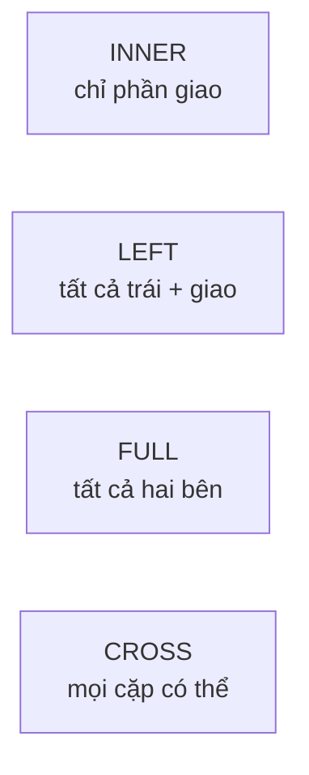
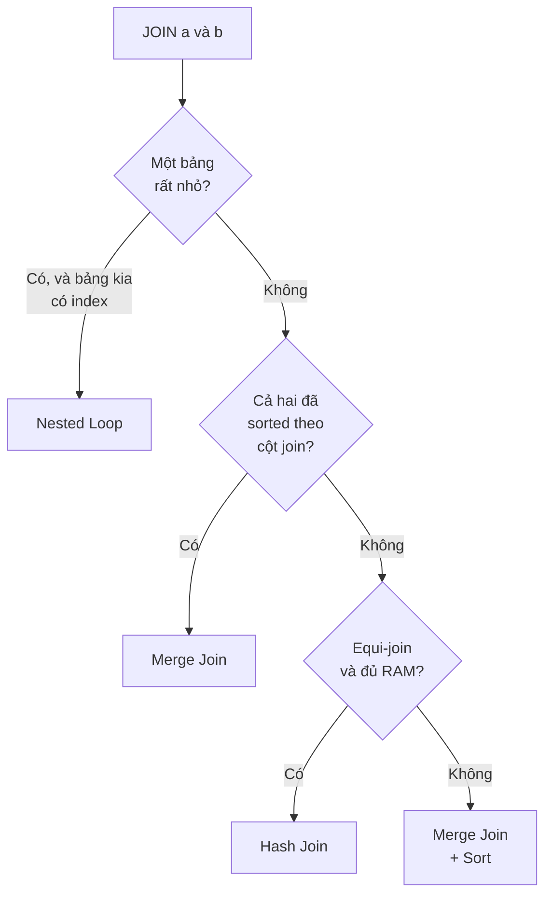

# JOIN & Join Algorithms — Deep Dive

## Mục lục

- [Bối cảnh: Cùng một JOIN, hai plan, chênh nhau 400 lần](#1-bối-cảnh-cùng-một-join-hai-plan-chênh-nhau-400-lần)
- [JOIN logic vs JOIN vật lý — Hai tầng khác nhau](#2-join-logic-vs-join-vật-lý--hai-tầng-khác-nhau)
- [Các loại JOIN logic — INNER, LEFT, RIGHT, FULL, CROSS](#3-các-loại-join-logic--inner-left-right-full-cross)
- [Nested Loop Join — Thuật toán đơn giản nhất](#4-nested-loop-join--thuật-toán-đơn-giản-nhất)
- [Hash Join — Vũ khí cho bảng lớn không sắp xếp](#5-hash-join--vũ-khí-cho-bảng-lớn-không-sắp-xếp)
- [Merge Join — Khi dữ liệu đã sắp xếp sẵn](#6-merge-join--khi-dữ-liệu-đã-sắp-xếp-sẵn)
- [Bảng so sánh 3 thuật toán](#7-bảng-so-sánh-3-thuật-toán)
- [Optimizer chọn thuật toán nào — Cost model](#8-optimizer-chọn-thuật-toán-nào--cost-model)
- [Driving Table & Join Order — Ai chạy trước quyết định tất cả](#9-driving-table--join-order--ai-chạy-trước-quyết-định-tất-cả)
- [Đọc EXPLAIN cho JOIN — Từng dòng một](#10-đọc-explain-cho-join--từng-dòng-một)
- [OUTER JOIN ảnh hưởng thuật toán như thế nào](#11-outer-join-ảnh-hưởng-thuật-toán-như-thế-nào)
- [Semi Join & Anti Join — EXISTS, IN, NOT EXISTS](#12-semi-join--anti-join--exists-in-not-exists)
- [So sánh giữa Postgres / MySQL / Oracle / SQL Server](#13-so-sánh-giữa-postgres--mysql--oracle--sql-server)
- [Anti-patterns cần tránh](#14-anti-patterns-cần-tránh)
- [Tóm tắt — Cheat sheet](#15-tóm-tắt--cheat-sheet)

---

## 1. Bối cảnh: Cùng một JOIN, hai plan, chênh nhau 400 lần

Bạn có 2 bảng trong hệ thống e-commerce:

```sql
CREATE TABLE customers (
    id         BIGSERIAL PRIMARY KEY,
    name       TEXT,
    country    TEXT
);
-- 1,000,000 rows

CREATE TABLE orders (
    id          BIGSERIAL PRIMARY KEY,
    customer_id BIGINT REFERENCES customers(id),
    total       NUMERIC(10,2),
    created_at  TIMESTAMPTZ
);
-- 50,000,000 rows
CREATE INDEX idx_orders_customer ON orders(customer_id);
```

Bạn viết một câu JOIN tưởng như vô hại:

```sql
SELECT c.name, o.total
FROM customers c
JOIN orders o ON o.customer_id = c.id
WHERE c.country = 'Vietnam';
```

- Nếu `Vietnam` chỉ có **50 khách** → optimizer chọn **Nested Loop**, chạy trong **8ms**.
- Nếu `Vietnam` có **900,000 khách** → optimizer chọn **Hash Join**, chạy trong **3.2 giây**.

Nhưng nếu optimizer **đoán sai** số khách (do statistics cũ), nó có thể chọn Nested Loop cho 900,000 khách → **3.400 giây** (gần 1 giờ). Cùng câu SQL, cùng dữ liệu, **chênh nhau hơn 400.000 lần**.

> [!IMPORTANT]
> Bạn viết `JOIN` — đó là **ý định logic**. Database dịch nó thành **một trong ba thuật toán vật lý**: Nested Loop, Hash Join, hoặc Merge Join. Chọn sai thuật toán là nguyên nhân số một khiến JOIN chậm. Hiểu ba thuật toán này = hiểu 80% việc tối ưu JOIN.

Trong doc này ta sẽ mổ xẻ:

1. Sự khác nhau giữa **JOIN logic** (bạn viết) và **JOIN vật lý** (DB chạy).
2. Ba thuật toán, cách chúng hoạt động **từng bước**, kèm chi phí cụ thể.
3. Cách **optimizer** dựa vào cost model để chọn.
4. Vì sao **join order** và **driving table** quyết định tất cả.
5. Cách **đọc EXPLAIN** để biết DB đang làm gì.

---

## 2. JOIN logic vs JOIN vật lý — Hai tầng khác nhau

Đây là điểm nhầm lẫn lớn nhất của người mới. `INNER JOIN`, `LEFT JOIN` là **cú pháp logic** — mô tả **kết quả mong muốn**. Chúng **không** quyết định cách DB thực thi.

```
┌────────────────────────────────────────────────────────────┐
│  TẦNG LOGIC (bạn viết)                                     │
│  INNER JOIN · LEFT JOIN · RIGHT JOIN · FULL JOIN · CROSS   │
│  → Định nghĩa: row nào xuất hiện trong kết quả             │
└───────────────────────────┬────────────────────────────────┘
                            │ optimizer dịch
                            ▼
┌────────────────────────────────────────────────────────────┐
│  TẦNG VẬT LÝ (DB chạy)                                     │
│  Nested Loop · Hash Join · Merge Join                      │
│  → Định nghĩa: CÁCH ghép hai tập row lại với nhau          │
└────────────────────────────────────────────────────────────┘
```

Ví dụ minh họa: cùng một `INNER JOIN` dưới đây có thể được thực thi bằng **cả ba** thuật toán tùy dữ liệu và index:

```sql
SELECT * FROM a JOIN b ON a.id = b.a_id;
```

| Tình huống | Thuật toán optimizer chọn |
|-----------|---------------------------|
| `a` nhỏ (10 row), `b` có index trên `a_id` | Nested Loop |
| `a` và `b` đều lớn, không có index phù hợp | Hash Join |
| `a` và `b` đều lớn, cả hai đã sort theo cột join | Merge Join |

> [!NOTE]
> Bạn **không** viết `NESTED LOOP JOIN` trong SQL chuẩn. Optimizer tự chọn. Bạn chỉ có thể *gợi ý* (hint) ở một số DB — xem [phần so sánh](#13-so-sánh-giữa-postgres--mysql--oracle--sql-server).

---

## 3. Các loại JOIN logic — INNER, LEFT, RIGHT, FULL, CROSS

Trước khi vào thuật toán, cần chắc chắn về ngữ nghĩa logic. Dùng 2 bảng nhỏ:

```
customers                    orders
┌────┬─────────┐            ┌────┬─────────────┬───────┐
│ id │ name    │            │ id │ customer_id │ total │
├────┼─────────┤            ├────┼─────────────┼───────┤
│ 1  │ An      │            │ 10 │ 1           │ 100   │
│ 2  │ Bình    │            │ 11 │ 1           │ 200   │
│ 3  │ Chi     │            │ 12 │ 2           │ 150   │
└────┴─────────┘            │ 13 │ 9 (rác)     │ 999   │
                            └────┴─────────────┴───────┘
```

### 3.1. INNER JOIN — Chỉ giữ row khớp cả hai bên

```sql
SELECT c.name, o.total
FROM customers c
INNER JOIN orders o ON o.customer_id = c.id;
```

```
name │ total
─────┼──────
An   │ 100
An   │ 200
Bình │ 150
```

Chi (id=3) không có order → **bị loại**. Order id=13 (customer_id=9 không tồn tại) → **bị loại**.

### 3.2. LEFT JOIN — Giữ tất cả bên trái

```sql
SELECT c.name, o.total
FROM customers c
LEFT JOIN orders o ON o.customer_id = c.id;
```

```
name │ total
─────┼──────
An   │ 100
An   │ 200
Bình │ 150
Chi  │ NULL   ← Chi vẫn xuất hiện, cột bên phải là NULL
```

### 3.3. RIGHT JOIN — Giữ tất cả bên phải

Đối xứng với LEFT. `A RIGHT JOIN B` ≡ `B LEFT JOIN A`. Thực tế hiếm dùng — người ta viết lại thành LEFT cho dễ đọc.

### 3.4. FULL OUTER JOIN — Giữ cả hai bên

```
name │ total
─────┼──────
An   │ 100
An   │ 200
Bình │ 150
Chi  │ NULL   ← customer không có order
NULL │ 999    ← order không có customer
```

### 3.5. CROSS JOIN — Tích Descartes

Mỗi row bên trái ghép với **mọi** row bên phải. 3 customer × 4 order = **12 row**. Nguy hiểm khi quên điều kiện JOIN → tạo ra "accidental cross join" bùng nổ số row.



> [!TIP]
> `WHERE b.col = x` trên cột của bảng **outer** (bên phải LEFT JOIN) sẽ **âm thầm biến LEFT JOIN thành INNER JOIN**, vì row NULL bị `WHERE` loại bỏ. Muốn giữ ngữ nghĩa LEFT, đặt điều kiện vào `ON` chứ không phải `WHERE`.

---

## 4. Nested Loop Join — Thuật toán đơn giản nhất

### 4.1. Ý tưởng

Giống hai vòng lặp `for` lồng nhau:

```
for mỗi row R trong OUTER table:       -- bảng ngoài (driving/outer)
    for mỗi row S trong INNER table:   -- bảng trong (inner/probed)
        if R khớp S theo điều kiện join:
            xuất (R, S)
```

### 4.2. Ví dụ cụ thể

`customers` có 3 row, `orders` có 4 row:

```
Vòng ngoài lấy An  → quét 4 order → khớp order 10, 11
Vòng ngoài lấy Bình → quét 4 order → khớp order 12
Vòng ngoài lấy Chi  → quét 4 order → không khớp
```

Nếu quét thô (không index): chi phí = `số row outer × số row inner` = 3 × 4 = **12 phép so sánh**. Với 1 triệu × 50 triệu = **50.000 tỉ phép** → không khả thi.

### 4.3. Cứu tinh: Index trên bảng inner

Nested Loop **chỉ nhanh khi bảng inner có index** trên cột join. Khi đó vòng trong không quét toàn bảng mà **nhảy thẳng** bằng B-Tree:

```
for mỗi row R trong OUTER (nhỏ):
    dùng index của INNER để tìm row khớp R.id  -- O(log N), không quét
```

Chi phí ≈ `số row outer × log(số row inner)`. Với outer = 50 row, inner = 50 triệu row có index:

```
50 × log₂(50,000,000) ≈ 50 × 26 ≈ 1,300 lần đọc index
```

Cực nhanh. Đây là lý do:

> [!IMPORTANT]
> Nested Loop là **lựa chọn tối ưu khi bảng outer NHỎ và bảng inner có INDEX** trên cột join. Đây là trường hợp phổ biến nhất trong OLTP (query lấy vài row rồi join sang bảng lớn).

### 4.4. EXPLAIN thực tế

```sql
EXPLAIN ANALYZE
SELECT c.name, o.total
FROM customers c
JOIN orders o ON o.customer_id = c.id
WHERE c.country = 'Vietnam';   -- chỉ 50 khách
```

```text
 Nested Loop  (cost=0.86..842.13 rows=520 width=40)
              (actual time=0.041..7.912 rows=487 loops=1)
   ->  Index Scan using idx_customers_country on customers c
              (actual time=0.018..0.203 rows=50 loops=1)   ← OUTER: 50 row
         Index Cond: (country = 'Vietnam')
   ->  Index Scan using idx_orders_customer on orders o
              (actual time=0.004..0.142 rows=10 loops=50)  ← INNER: chạy 50 LẦN
         Index Cond: (customer_id = c.id)
 Execution Time: 8.104 ms
```

> [!TIP]
> Dấu hiệu Nested Loop trong EXPLAIN: node `Nested Loop`, và node inner có `loops=N` với N = số row outer. `loops` càng lớn thì Nested Loop càng nguy hiểm — mỗi loop là một lần đọc index.

### 4.5. Khi nào Nested Loop thành thảm họa

Khi outer **lớn** mà optimizer vẫn chọn Nested Loop (thường do đoán sai số row):

```text
 Nested Loop  (actual time=... rows=900000 loops=1)
   ->  Seq Scan on customers   (rows=900000 loops=1)   ← OUTER: 900K row!
   ->  Index Scan on orders    (rows=50 loops=900000)  ← chạy 900,000 LẦN
```

900.000 lần đọc index → hàng nghìn giây. Trường hợp này Hash Join sẽ nhanh hơn hàng trăm lần.

---

## 5. Hash Join — Vũ khí cho bảng lớn không sắp xếp

### 5.1. Ý tưởng: xây bảng băm rồi dò

Hash Join gồm **2 pha**:

```
PHA 1 — BUILD:
    Chọn bảng nhỏ hơn (build input).
    Đọc toàn bộ, băm cột join → dựng hash table trong RAM.

PHA 2 — PROBE:
    Đọc bảng lớn (probe input) từng row.
    Băm cột join của row → tra hash table → khớp thì xuất.
```

```
BUILD (customers nhỏ)                PROBE (orders lớn)
┌─────────────────┐
│ hash(1) → An    │  ◀── tra ───  order(customer_id=1) → khớp An
│ hash(2) → Bình  │  ◀── tra ───  order(customer_id=2) → khớp Bình
│ hash(3) → Chi   │               order(customer_id=9) → không có → bỏ
└─────────────────┘
```

### 5.2. Vì sao nhanh

Tra hash table là **O(1)**. Toàn bộ chỉ cần **đọc mỗi bảng đúng 1 lần**:

```
Chi phí ≈ (số row build) + (số row probe)      -- tuyến tính!
```

So với Nested Loop `outer × inner`, Hash Join thắng áp đảo khi **cả hai bảng lớn** và **không có index** phù hợp (hoặc index không giúp vì phải quét gần hết bảng).

### 5.3. Cái giá: RAM và không tận dụng order

- Cần **RAM** để chứa hash table. Ở Postgres, nếu build input lớn hơn `work_mem`, hash table **tràn ra đĩa** (batched hash join) → chậm đi nhiều.
- Kết quả **không được sắp xếp** theo cột join.
- Chỉ hỗ trợ **equi-join** (`=`). Không dùng được cho `a.x < b.y`.

### 5.4. EXPLAIN thực tế

```sql
EXPLAIN ANALYZE
SELECT c.name, o.total
FROM customers c
JOIN orders o ON o.customer_id = c.id;   -- không filter → cả 2 bảng lớn
```

```text
 Hash Join  (cost=32150..1284301 rows=50000000 width=40)
            (actual time=412..3187 rows=49999500 loops=1)
   Hash Cond: (o.customer_id = c.id)
   ->  Seq Scan on orders o        (rows=50000000 loops=1)   ← PROBE (lớn)
   ->  Hash  (rows=1000000)                                  ← BUILD (nhỏ)
         Buckets: 131072  Batches: 4  Memory Usage: 6144kB   ← Batches>1 = tràn đĩa
         ->  Seq Scan on customers c  (rows=1000000 loops=1)
 Execution Time: 3204 ms
```

> [!IMPORTANT]
> Đọc dòng `Batches: N`. Nếu `Batches > 1`, hash table **không đủ RAM** và phải chia batch ghi ra đĩa. Tăng `work_mem` (Postgres) hoặc `join_buffer_size` (MySQL) có thể đưa về `Batches: 1` và tăng tốc đáng kể.

---

## 6. Merge Join — Khi dữ liệu đã sắp xếp sẵn

### 6.1. Ý tưởng: hai con trỏ chạy song song

Giống việc ghép hai danh sách **đã sắp xếp** (như bước merge trong merge sort):

```
customers (sort theo id)     orders (sort theo customer_id)
   1  An      ptr_c →           1  → khớp
   2  Bình                      1  → khớp
   3  Chi                       2  → khớp   ptr_o →
                                9  → ptr_c vượt qua, dừng
```

Hai con trỏ chỉ **tiến, không lùi**. Mỗi bảng đọc đúng 1 lần.

### 6.2. Điều kiện tiên quyết: cả hai đầu vào phải sorted

Merge Join chỉ khả thi khi **cả hai** đầu vào được sắp theo cột join. Nguồn của "đã sort":

- **Index Scan** trên B-Tree (index vốn đã sắp xếp), hoặc
- Một bước **Sort** rõ ràng trước đó (tốn chi phí).

Nếu phải sort cả hai bảng lớn từ đầu → thường Hash Join rẻ hơn.

### 6.3. Điểm mạnh riêng

- Xử lý tốt **dữ liệu rất lớn** vì không cần chứa cả bảng trong RAM (chỉ giữ 1 row mỗi bên).
- Hỗ trợ cả **range join** (`a.x <= b.y`) ở một số DB, không chỉ equi-join.
- Kết quả **đã sắp xếp** → miễn phí cho `ORDER BY` phía sau.

### 6.4. EXPLAIN thực tế

```text
 Merge Join  (actual time=0.06..1820 rows=49999500 loops=1)
   Merge Cond: (c.id = o.customer_id)
   ->  Index Scan using customers_pkey on customers c   (rows=1000000)
   ->  Index Scan using idx_orders_customer on orders o (rows=50000000)
 Execution Time: 1912 ms
```

Không có node `Sort` → cả hai đầu vào lấy từ Index Scan (đã sorted). Đây là Merge Join lý tưởng.

---

## 7. Bảng so sánh 3 thuật toán

| Tiêu chí | Nested Loop | Hash Join | Merge Join |
|----------|-------------|-----------|------------|
| **Ý tưởng** | 2 vòng lặp lồng nhau | Build hash + probe | 2 con trỏ trên dữ liệu sorted |
| **Độ phức tạp** | O(M × N), hoặc O(M × log N) nếu inner có index | O(M + N) | O(M + N) nếu đã sort; +O(N log N) nếu phải sort |
| **Tốt nhất khi** | Outer nhỏ + inner có index | Cả hai lớn, equi-join, không sorted | Cả hai lớn + đã sorted sẵn |
| **Cần RAM** | Rất ít | Nhiều (hash table) | Ít |
| **Loại join** | Mọi loại (=, <, >, range) | Chỉ equi-join (=) | Equi + một số range |
| **Kết quả sorted?** | Theo outer | Không | Có (theo cột join) |
| **Điểm chết** | Outer lớn → cực chậm | Build tràn RAM → tràn đĩa | Phải sort 2 bảng lớn |
| **Điển hình** | OLTP, lookup vài row | OLAP, join 2 bảng lớn | Join theo PK/FK đã index |



---

## 8. Optimizer chọn thuật toán nào — Cost model

Optimizer **không** chạy thử cả ba rồi chọn. Nó **ước lượng chi phí** (cost) của từng phương án dựa trên **statistics** và chọn cái rẻ nhất.

### 8.1. Công thức trực giác (Postgres)

```
Nested Loop cost ≈ cost_outer + (rows_outer × cost_1_lookup_inner)
Hash Join cost   ≈ cost_build + cost_probe + cost_dựng_hash
Merge Join cost  ≈ cost_sort_a + cost_sort_b + cost_merge
```

Biến quyết định lớn nhất là **`rows_outer`** (số row ước tính của bảng ngoài). Đây là lý do:

> [!IMPORTANT]
> Statistics sai (số row ước tính lệch xa thực tế) là nguyên nhân số một khiến optimizer chọn nhầm thuật toán join. Nếu nó nghĩ `rows_outer = 5` nhưng thực tế là `5,000,000`, nó sẽ chọn Nested Loop → thảm họa. Xem doc [Statistics & Query Planner](/optimization/statistics-query-planner-deep-dive/).

### 8.2. Ví dụ đoán sai statistics

```text
->  Nested Loop  (cost=... rows=5 ...) (actual ... rows=5000000 ...)
                              ▲                          ▲
                        optimizer đoán 5           thực tế 5 triệu
```

Khi `estimated rows` (5) và `actual rows` (5.000.000) lệch nhau hàng triệu lần → đó là dấu hiệu statistics cũ. Fix: `ANALYZE orders;` để cập nhật thống kê.

---

## 9. Driving Table & Join Order — Ai chạy trước quyết định tất cả

### 9.1. Driving table là gì

Khi join nhiều bảng, DB phải chọn **thứ tự** ghép. Bảng được xử lý đầu tiên gọi là **driving table** (bảng dẫn). Nguyên tắc vàng:

> [!TIP]
> **Bảng có ít row nhất sau khi lọc nên làm driving table.** Lọc sớm để giảm số row càng nhiều càng tốt trước khi join sang bảng lớn — đây gọi là "lọc trước, join sau".

### 9.2. Ví dụ 3 bảng

```sql
SELECT *
FROM customers c
JOIN orders o    ON o.customer_id = c.id
JOIN products p  ON p.id = o.product_id
WHERE c.country = 'Vietnam'         -- lọc còn 50 row
  AND p.category = 'Electronics';   -- lọc còn 200 row
```

Thứ tự tốt: bắt đầu từ `customers` (50 row sau lọc) → join `orders` → cuối cùng `products`. Bắt đầu từ `orders` (50 triệu row) sẽ là thảm họa.

### 9.3. Số lượng join order bùng nổ

Với N bảng, số thứ tự join khả thi là **N!** (giai thừa):

| Số bảng | Số join order |
|---------|--------------|
| 3 | 6 |
| 5 | 120 |
| 10 | 3,628,800 |

Vì thế optimizer có giới hạn (Postgres: `join_collapse_limit`, `geqo_threshold`). Vượt ngưỡng, nó chuyển sang thuật toán di truyền (GEQO) để tìm plan "đủ tốt" thay vì tối ưu tuyệt đối.

---

## 10. Đọc EXPLAIN cho JOIN — Từng dòng một

Plan là **cây**: đọc từ **trong ra ngoài**, từ **dưới lên**. Node con thực thi trước, kết quả đưa lên node cha.

```text
 Hash Join                          ← (3) ghép kết quả 2 node con
   Hash Cond: (o.customer_id = c.id)
   ->  Seq Scan on orders o         ← (1) probe input, chạy trước
   ->  Hash                         ← (2) build input
         ->  Seq Scan on customers c
```

Thứ tự thực thi thật: (1) quét customers dựng hash → (2) → (3) quét orders dò hash.

| Bạn thấy trong EXPLAIN | Nghĩa là |
|------------------------|----------|
| `Nested Loop` + `loops=N` cao | Vòng lặp chạy N lần — coi chừng N lớn |
| `Hash Join` + `Batches > 1` | Hash tràn RAM, đang dùng đĩa |
| `Merge Join` + node `Sort` | Phải sort trước — tốn chi phí |
| `rows=` (est) lệch xa `rows=` (actual) | Statistics sai → dễ chọn nhầm thuật toán |
| `Rows Removed by Filter` cao | Đọc thừa nhiều row rồi vứt |

> [!NOTE]
> Chi tiết cách đọc mọi node và con số trong plan: xem doc [EXPLAIN / EXPLAIN ANALYZE — Deep Dive](/optimization/explain-analyze-deep-dive/).

---

## 11. OUTER JOIN ảnh hưởng thuật toán như thế nào

OUTER JOIN (LEFT/RIGHT/FULL) ràng buộc thứ tự và thuật toán:

- **LEFT JOIN**: bảng trái **bắt buộc** là bên "giữ tất cả row" → optimizer không được tự do đảo thứ tự như INNER JOIN. Điều này giới hạn không gian tối ưu.
- **FULL OUTER JOIN**: chỉ **Hash Join** và **Merge Join** hỗ trợ; **Nested Loop không** làm được FULL (vì phải giữ dấu row chưa khớp ở cả hai bên). Postgres sẽ luôn dùng Hash/Merge cho FULL.
- **Anti/Semi join** (dưới đây) có thuật toán riêng.

> [!TIP]
> INNER JOIN cho optimizer nhiều tự do đảo thứ tự nhất → thường tối ưu tốt hơn. Chỉ dùng OUTER JOIN khi thực sự cần giữ row không khớp; đừng dùng LEFT JOIN "cho chắc" khi INNER là đủ.

---

## 12. Semi Join & Anti Join — EXISTS, IN, NOT EXISTS

Đây là hai loại join "ẩn" mà optimizer sinh ra từ subquery.

### 12.1. Semi Join — "tồn tại ít nhất một khớp"

`EXISTS` và `IN` sinh ra **Semi Join**: chỉ cần **một** row bên phải khớp là giữ row bên trái, và **không nhân bản** row trái (khác INNER JOIN).

```sql
-- Lấy khách có ÍT NHẤT một order
SELECT * FROM customers c
WHERE EXISTS (SELECT 1 FROM orders o WHERE o.customer_id = c.id);
```

```text
 Hash Semi Join  (actual ... rows=... )
   Hash Cond: (c.id = o.customer_id)
```

Semi Join dừng ngay khi tìm thấy khớp đầu tiên → thường rẻ hơn INNER JOIN + DISTINCT.

### 12.2. Anti Join — "không có khớp nào"

`NOT EXISTS` sinh ra **Anti Join**: giữ row trái khi **không** có row phải nào khớp.

```sql
-- Lấy khách CHƯA từng order
SELECT * FROM customers c
WHERE NOT EXISTS (SELECT 1 FROM orders o WHERE o.customer_id = c.id);
```

```text
 Hash Anti Join  (actual ... rows=... )
```

> [!IMPORTANT]
> Ưu tiên `NOT EXISTS` hơn `NOT IN` khi cột có thể NULL. `NOT IN` với một giá trị NULL trong danh sách sẽ trả về **rỗng một cách âm thầm** (three-valued logic). `NOT EXISTS` không dính bẫy này. Xem chi tiết trong [Query Optimization Patterns](/optimization/query-optimization-patterns/).

---

## 13. So sánh giữa Postgres / MySQL / Oracle / SQL Server

| Đặc điểm | PostgreSQL | MySQL (8.0+) | Oracle | SQL Server |
|----------|-----------|--------------|--------|------------|
| Nested Loop | ✅ | ✅ | ✅ | ✅ |
| Hash Join | ✅ | ✅ (từ 8.0.18) | ✅ | ✅ |
| Merge Join | ✅ | ❌ (không có) | ✅ | ✅ |
| FULL OUTER JOIN | ✅ | ❌ (giả lập bằng UNION) | ✅ | ✅ |
| Tham số buffer | `work_mem` | `join_buffer_size` | `pga_aggregate_target` | memory grant |
| Join hint | ❌ (chỉ `enable_*` toàn cục) | ✅ (`/*+ ... */`) | ✅ (mạnh nhất) | ✅ (`OPTION`) |
| Xem plan | `EXPLAIN ANALYZE` | `EXPLAIN ANALYZE` / `FORMAT=JSON` | `DBMS_XPLAN` | Execution Plan (SSMS) |

> [!NOTE]
> **MySQL trước 8.0.18 chỉ có Nested Loop** (biến thể Block Nested Loop dùng `join_buffer`). Đây là lý do MySQL cũ join hai bảng lớn không index rất chậm — không có Hash Join để cứu.

---

## 14. Anti-patterns cần tránh

- **Quên điều kiện JOIN → Cross Join vô tình**: `FROM a, b` mà thiếu `WHERE a.id = b.a_id` → bùng nổ M×N row.
- **JOIN rồi mới lọc, thay vì lọc rồi mới JOIN**: đặt điều kiện lọc sớm để giảm driving table.
- **Điều kiện lọc trên cột outer đặt sai vào WHERE của LEFT JOIN**: âm thầm biến LEFT thành INNER.
- **Hàm bọc quanh cột join**: `ON UPPER(a.name) = UPPER(b.name)` → không dùng được index → ép Hash/Nested Loop chậm.
- **JOIN quá nhiều bảng (10+) trong một query**: optimizer quá tải, cân nhắc denormalize hoặc chia nhỏ.
- **Kiểu dữ liệu cột join không khớp**: `a.id BIGINT` join `b.id VARCHAR` → implicit conversion → mất index.

> [!TIP]
> Nếu JOIN chậm bất ngờ, việc đầu tiên: chạy `EXPLAIN ANALYZE` và so `estimated rows` với `actual rows`. Lệch nhiều → `ANALYZE` lại bảng. Đúng thì soi thuật toán và index.

---

## 15. Tóm tắt — Cheat sheet

```
╭──────────────────────────────────────────────────────────────╮
│  BA THUẬT TOÁN JOIN                                          │
│                                                              │
│  Nested Loop  → outer NHỎ + inner có INDEX     (OLTP lookup) │
│  Hash Join    → hai bảng LỚN, equi-join, RAM đủ (OLAP)       │
│  Merge Join   → hai bảng LỚN, đã SORTED sẵn                  │
│                                                              │
│  NGUYÊN TẮC VÀNG                                             │
│  1. Driving table = bảng ít row nhất sau lọc                 │
│  2. Lọc sớm, join sau                                        │
│  3. Cột join phải cùng kiểu + có index                       │
│  4. estimated rows lệch actual rows → ANALYZE lại            │
│  5. INNER cho optimizer tự do nhất → nhanh hơn OUTER         │
╰──────────────────────────────────────────────────────────────╯
```

| Triệu chứng | Nguyên nhân thường gặp | Cách xử lý |
|-------------|------------------------|------------|
| Nested Loop với `loops` cực lớn | Optimizer đoán sai outer nhỏ | `ANALYZE`, kiểm tra statistics |
| Hash Join `Batches > 1` | Thiếu RAM cho hash | Tăng `work_mem` / `join_buffer_size` |
| Merge Join có node `Sort` lớn | Không có index để lấy sorted | Tạo index trên cột join |
| Query nhanh dần rồi chậm | Statistics lỗi thời sau khi data lớn lên | Lịch `ANALYZE`/autovacuum |
| JOIN trả nhiều row hơn mong đợi | Thiếu điều kiện join → cross | Kiểm tra `ON` đầy đủ |

---

## Tài liệu tham khảo

- [PostgreSQL — Join Methods](https://www.postgresql.org/docs/current/planner-optimizer.html)
- [Use The Index, Luke — Joins](https://use-the-index-luke.com/sql/join)
- [EXPLAIN / EXPLAIN ANALYZE — Deep Dive](/optimization/explain-analyze-deep-dive/)
- [Statistics & Query Planner — Deep Dive](/optimization/statistics-query-planner-deep-dive/)
- [Query Optimization Patterns](/optimization/query-optimization-patterns/)
