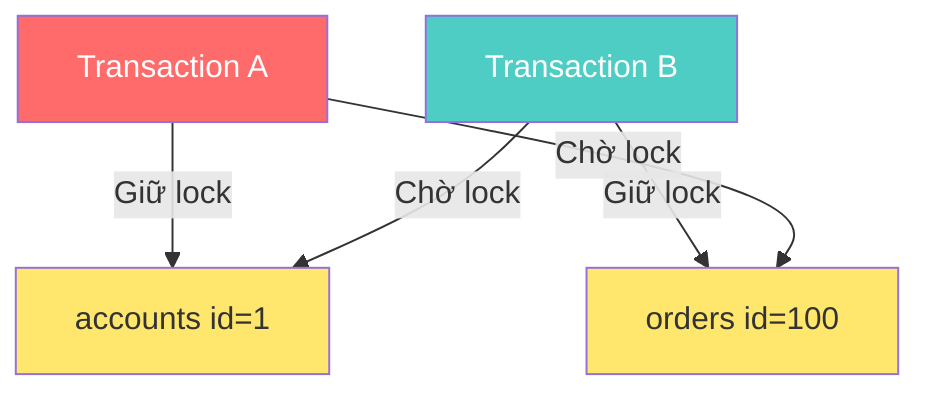

## Mục lục

- [Lock là gì và tại sao cần Lock](#lock-là-gì-và-tại-sao-cần-lock)
- [Locking Levels](#locking-levels)
- [Locking Types](#locking-types)
  - [Shared Lock (S)](#shared-lock-s)
  - [Exclusive Lock (X)](#exclusive-lock-x)
  - [Compatibility Matrix](#compatibility-matrix)
  - [Intent Locks (IS, IX)](#intent-locks-is-ix)
- [Deadlock](#deadlock)
- [Optimistic Lock vs Pessimistic Lock](#optimistic-lock-vs-pessimistic-lock)
- [Lock trong MySQL InnoDB vs PostgreSQL](#lock-trong-mysql-innodb-vs-postgresql)
- [Tổng kết](#tổng-kết)

---

## Lock là gì và tại sao cần Lock

**Lock** (khóa) là cơ chế kiểm soát truy cập đồng thời vào dữ liệu trong database. Khi nhiều transaction cùng truy cập một tài nguyên (row, table, page…), lock đảm bảo:

- **Data integrity**: tránh ghi đè dữ liệu lẫn nhau.
- **Isolation**: mỗi transaction hoạt động độc lập, không bị ảnh hưởng bởi transaction khác.
- **Consistency**: dữ liệu luôn ở trạng thái hợp lệ sau mỗi transaction.

Nếu không có lock, hai transaction UPDATE cùng một row có thể dẫn đến **lost update** — transaction sau ghi đè kết quả của transaction trước mà không biết.

```
T1: READ balance = 100
T2: READ balance = 100
T1: balance = 100 - 30 → WRITE 70
T2: balance = 100 - 50 → WRITE 50   ← T1 bị mất!
```

## Locking Levels

Database hỗ trợ nhiều **mức độ khóa** (lock granularity). Mức càng nhỏ thì concurrency càng cao nhưng overhead quản lý lock càng lớn.

| Level | Phạm vi | Concurrency | Overhead | Khi nào dùng |
|-------|---------|-------------|----------|---------------|
| **Database level** | Toàn bộ database | Rất thấp | Rất thấp | Backup, migration |
| **Table level** | Toàn bộ table | Thấp | Thấp | DDL (ALTER TABLE), bulk operations |
| **Page/Block level** | Một page (thường 8KB) | Trung bình | Trung bình | SQL Server internal |
| **Row level** | Một row cụ thể | Cao | Cao | OLTP — UPDATE/DELETE row đơn lẻ |
| **Column level** | Một column cụ thể | Rất cao | Rất cao | Hiếm khi dùng, một số DB không hỗ trợ |

### Granularity Trade-offs

```
Coarse-grained (Database/Table lock)
├── Ít lock hơn → overhead thấp
├── Nhưng block nhiều transaction → throughput thấp
│
Fine-grained (Row/Column lock)
├── Nhiều lock hơn → overhead cao (memory, CPU)
├── Nhưng ít block → throughput cao
```

Hầu hết các RDBMS hiện đại (MySQL InnoDB, PostgreSQL) mặc định sử dụng **row-level locking** để tối ưu concurrency cho OLTP workload.

## Locking Types

Locking type là cơ chế database-level lock mà DB engine thực hiện để kiểm soát truy cập vào tài nguyên.

### Shared Lock (S)

**Shared Lock** (còn gọi là **Read Lock**) được sử dụng khi một transaction muốn **đọc** dữ liệu.

Đặc điểm:

- Nhiều transaction có thể giữ Shared Lock **cùng lúc** trên cùng một tài nguyên.
- Các transaction khác **chỉ có thể đọc**, không được ghi.
- Đảm bảo dữ liệu không bị thay đổi trong lúc đang đọc.

```sql
-- PostgreSQL: Shared Lock implicit khi SELECT trong Repeatable Read / Serializable
SELECT * FROM accounts WHERE id = 1;

-- MySQL: Explicit Shared Lock
SELECT * FROM accounts WHERE id = 1 LOCK IN SHARE MODE;
-- Hoặc MySQL 8.0+
SELECT * FROM accounts WHERE id = 1 FOR SHARE;
```

### Exclusive Lock (X)

**Exclusive Lock** (còn gọi là **Write Lock**) được sử dụng khi một transaction muốn **đọc và ghi** dữ liệu.

Đặc điểm:

- Chỉ **duy nhất một transaction** được giữ Exclusive Lock tại một thời điểm.
- Trong thời gian tài nguyên có Exclusive Lock, **không transaction nào khác** được phép giữ Shared Lock hay Exclusive Lock.
- Đảm bảo toàn quyền kiểm soát dữ liệu cho transaction đang ghi.

```sql
-- Exclusive Lock tự động khi UPDATE/DELETE
UPDATE accounts SET balance = balance - 100 WHERE id = 1;

-- Explicit Exclusive Lock
SELECT * FROM accounts WHERE id = 1 FOR UPDATE;
```

### Compatibility Matrix

Ma trận tương thích giữa Shared Lock và Exclusive Lock:

| | Shared Lock (S) | Exclusive Lock (X) |
|---|:---:|:---:|
| **Shared Lock (S)** | ✅ Tương thích | ❌ Xung đột |
| **Exclusive Lock (X)** | ❌ Xung đột | ❌ Xung đột |

- **S + S**: nhiều reader cùng đọc → OK.
- **S + X**: reader đang đọc, writer muốn ghi → writer phải chờ.
- **X + X**: hai writer cùng ghi → writer sau phải chờ.

### Intent Locks (IS, IX)

**Intent Lock** là lock ở level cao hơn (table) để thông báo rằng transaction **dự định** lock ở level thấp hơn (row).

| Lock | Ý nghĩa |
|------|---------|
| **IS (Intent Shared)** | Transaction dự định đặt Shared Lock trên một số row |
| **IX (Intent Exclusive)** | Transaction dự định đặt Exclusive Lock trên một số row |

Lợi ích: database engine không cần quét toàn bộ row để kiểm tra xung đột — chỉ cần kiểm tra Intent Lock ở table level.

**Ví dụ**: Transaction A muốn `SELECT FOR UPDATE` trên row id=1:

1. Đặt **IX** lock trên table `accounts`.
2. Đặt **X** lock trên row `id=1`.

Transaction B muốn `LOCK TABLE accounts` (Exclusive):

1. Kiểm tra table `accounts` → thấy IX lock → **phải chờ**.

## Deadlock

**Deadlock** xảy ra khi hai hoặc nhiều transaction **chờ đợi lẫn nhau** giải phóng lock, tạo thành vòng lặp chờ vô hạn.

### Nguyên nhân

- Hai transaction lock tài nguyên theo **thứ tự ngược nhau**.
- Escalation lock từ Shared → Exclusive trên cùng tài nguyên.
- Transaction giữ lock quá lâu (long-running transaction).

### Ví dụ Deadlock scenario

```
Transaction A                    Transaction B
─────────────                    ─────────────
BEGIN;                           BEGIN;
UPDATE accounts SET ...          UPDATE orders SET ...
  WHERE id = 1;                    WHERE id = 100;
  (lock row accounts#1)            (lock row orders#100)

UPDATE orders SET ...            UPDATE accounts SET ...
  WHERE id = 100;                  WHERE id = 1;
  ⏳ Chờ B giải phóng              ⏳ Chờ A giải phóng
       orders#100                       accounts#1

→ DEADLOCK!
```

### Mermaid Diagram minh họa



### Cách phát hiện

- **Wait-for graph**: database xây dựng đồ thị chờ, nếu phát hiện **cycle** → deadlock.
- **Timeout**: nếu transaction chờ quá thời gian cấu hình → hủy transaction.
- MySQL InnoDB và PostgreSQL đều có deadlock detection tự động.

### Cách giải quyết

| Phương pháp | Mô tả |
|-------------|-------|
| **Victim selection** | DB chọn transaction "nhẹ nhất" để rollback (victim) |
| **Lock ordering** | Đảm bảo tất cả transaction lock tài nguyên theo **cùng thứ tự** |
| **Lock timeout** | Đặt `innodb_lock_wait_timeout` (MySQL) hoặc `lock_timeout` (PostgreSQL) |
| **Giảm transaction scope** | Giữ transaction ngắn nhất có thể |
| **Retry logic** | Application bắt deadlock error và retry transaction |

```sql
-- PostgreSQL: đặt lock timeout
SET lock_timeout = '5s';

-- MySQL: đặt lock wait timeout
SET innodb_lock_wait_timeout = 5;
```

## Optimistic Lock vs Pessimistic Lock

Đây là hai **cơ chế kiểm soát đồng thời ở tầng ứng dụng / ORM**, khác với database-level lock.

### Pessimistic Lock

**Triết lý**: "Xung đột **sẽ xảy ra**" → khóa tài nguyên **trước** khi thao tác.

**Cơ chế**: Sử dụng `SELECT ... FOR UPDATE` để lock row ngay khi đọc. Transaction khác muốn truy cập cùng row sẽ phải **chờ** cho đến khi lock được giải phóng.

```sql
-- MySQL / PostgreSQL: Pessimistic Lock
BEGIN;

-- Lock row ngay khi đọc
SELECT * FROM products WHERE id = 1 FOR UPDATE;

-- Thao tác an toàn vì row đã bị lock
UPDATE products SET stock = stock - 1 WHERE id = 1;

COMMIT;
```

### Optimistic Lock

**Triết lý**: "Xung đột **hiếm khi xảy ra**" → không lock, chỉ kiểm tra xung đột **khi ghi**.

**Cơ chế**: Thêm column `version` (hoặc `updated_at`) vào table. Khi UPDATE, kiểm tra version có khớp với lúc đọc không. Nếu version thay đổi → có conflict → retry hoặc báo lỗi.

```sql
-- Bước 1: Đọc dữ liệu + version hiện tại
SELECT id, stock, version FROM products WHERE id = 1;
-- Kết quả: stock = 10, version = 3

-- Bước 2: UPDATE với điều kiện version
UPDATE products
SET stock = stock - 1, version = version + 1
WHERE id = 1 AND version = 3;

-- Nếu affected_rows = 0 → conflict → retry!
-- Nếu affected_rows = 1 → thành công
```

### So sánh chi tiết

| Tiêu chí | Optimistic Lock | Pessimistic Lock |
|----------|----------------|-----------------|
| **Cơ chế** | Version column / timestamp | `SELECT ... FOR UPDATE` |
| **Lock thực tế** | Không lock DB | Lock row trong DB |
| **Xử lý conflict** | Detect khi write → retry | Prevent bằng lock trước |
| **Performance** | Tốt khi ít conflict | Tốt khi nhiều conflict |
| **Concurrency** | Cao (không chờ đợi) | Thấp (transaction chờ nhau) |
| **Phức tạp** | Logic retry ở application | Đơn giản hơn ở application |
| **Phù hợp** | Read-heavy, ít write conflict | Write-heavy, nhiều conflict |
| **Risk** | Starvation nếu conflict liên tục | Deadlock nếu lock order sai |

### Khi nào dùng cái nào

**Dùng Optimistic Lock khi:**

- Hệ thống **read-heavy**, ít ghi đồng thời.
- Xung đột hiếm khi xảy ra.
- Cần throughput cao, không muốn transaction chờ đợi.
- Ví dụ: CMS, blog, e-commerce catalog.

**Dùng Pessimistic Lock khi:**

- Hệ thống **write-heavy**, nhiều transaction ghi cùng tài nguyên.
- Xung đột xảy ra thường xuyên.
- Chi phí retry cao (business logic phức tạp).
- Ví dụ: hệ thống đặt vé, chuyển tiền, inventory real-time.

### Code ví dụ đầy đủ

**Optimistic Lock — Application level (pseudocode)**:

```python
def update_stock_optimistic(product_id, quantity):
    while True:
        # Đọc dữ liệu + version
        product = db.query(
            "SELECT stock, version FROM products WHERE id = %s",
            product_id
        )

        new_stock = product.stock - quantity
        if new_stock < 0:
            raise InsufficientStockError()

        # UPDATE với version check
        affected = db.execute(
            """UPDATE products
               SET stock = %s, version = version + 1
               WHERE id = %s AND version = %s""",
            new_stock, product_id, product.version
        )

        if affected == 1:
            return  # Thành công
        # affected == 0 → conflict, retry
```

**Pessimistic Lock — Database level**:

```sql
-- PostgreSQL
BEGIN;
SELECT stock FROM products WHERE id = 1 FOR UPDATE;
-- Row bị lock, transaction khác phải chờ
UPDATE products SET stock = stock - 1 WHERE id = 1;
COMMIT;

-- MySQL InnoDB (tương tự)
START TRANSACTION;
SELECT stock FROM products WHERE id = 1 FOR UPDATE;
UPDATE products SET stock = stock - 1 WHERE id = 1;
COMMIT;
```

## Lock trong MySQL InnoDB vs PostgreSQL

| Đặc điểm | MySQL InnoDB | PostgreSQL |
|-----------|-------------|------------|
| **Default lock level** | Row-level | Row-level |
| **Lock cơ chế** | Lock trên index record | Lock trên tuple (heap) |
| **Gap Lock** | Có — lock khoảng trống giữa các index record | Không có gap lock |
| **Next-Key Lock** | Có (range lock = record + gap) | Không, dùng predicate lock cho Serializable |
| **Deadlock detection** | Tự động, rollback transaction nhỏ nhất | Tự động, rollback transaction phát hiện sau |
| **Advisory Lock** | `GET_LOCK()` / `RELEASE_LOCK()` | `pg_advisory_lock()` / `pg_try_advisory_lock()` |
| **MVCC interaction** | Lock + Undo Log | Lock + tuple versioning trong heap |

### Gap Lock trong MySQL InnoDB

Gap Lock là đặc trưng của InnoDB, lock khoảng trống giữa các giá trị index để ngăn **phantom read** ở isolation level `REPEATABLE READ`.

```sql
-- MySQL InnoDB: Nếu index có giá trị 10, 20, 30
SELECT * FROM t WHERE id BETWEEN 15 AND 25 FOR UPDATE;
-- Lock gap (10, 20) + record 20 + gap (20, 30)
-- Insert id = 12, 18, 22, 28 đều bị block!
```

PostgreSQL không có Gap Lock, thay vào đó sử dụng **SSI (Serializable Snapshot Isolation)** ở level Serializable để detect conflict.

## Tổng kết

- **Lock** là cơ chế thiết yếu để đảm bảo data integrity trong môi trường concurrent.
- Chọn **lock granularity** phù hợp: row-level cho OLTP, table-level cho DDL/batch.
- **Shared Lock** cho đọc, **Exclusive Lock** cho ghi — hiểu compatibility matrix để tránh bottleneck.
- **Deadlock** có thể tránh bằng lock ordering, timeout, và giữ transaction ngắn.
- **Optimistic Lock** phù hợp read-heavy, **Pessimistic Lock** phù hợp write-heavy.
- Hiểu rõ cơ chế lock của DB engine cụ thể (InnoDB Gap Lock vs PostgreSQL SSI) để thiết kế hệ thống hiệu quả.
