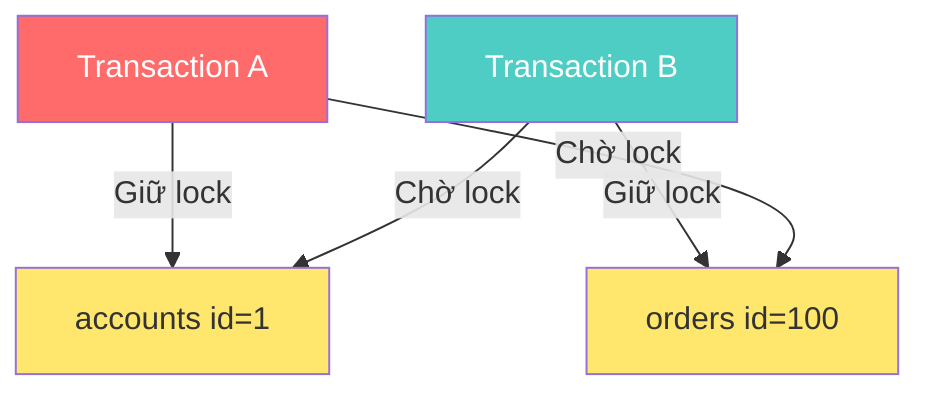

## Mục lục

- [Lock là gì và tại sao cần Lock](#lock-là-gì-và-tại-sao-cần-lock)
- [Locking Levels](#locking-levels)
  - [Granularity Trade-offs](#granularity-trade-offs)
- [Locking Types](#locking-types)
  - [Shared Lock (S)](#shared-lock-s)
  - [Exclusive Lock (X)](#exclusive-lock-x)
  - [Compatibility Matrix](#compatibility-matrix)
  - [Intent Locks (IS, IX)](#intent-locks-is-ix)
- [Range, Gap, Next-Key và Predicate Lock](#range-gap-next-key-và-predicate-lock)
  - [Vì sao Row Lock chưa đủ](#vì-sao-row-lock-chưa-đủ)
  - [Range Lock](#range-lock)
  - [Gap Lock và Next-Key Lock trong MySQL](#gap-lock-và-next-key-lock-trong-mysql)
  - [Predicate Lock trong PostgreSQL](#predicate-lock-trong-postgresql)
  - [So sánh cách ngăn Phantom Read](#so-sánh-cách-ngăn-phantom-read)
- [Deadlock](#deadlock)
  - [Nguyên nhân](#nguyên-nhân)
  - [Ví dụ Deadlock scenario](#ví-dụ-deadlock-scenario)
  - [Mermaid Diagram minh họa](#mermaid-diagram-minh-họa)
  - [Cách phát hiện](#cách-phát-hiện)
  - [Cách giải quyết](#cách-giải-quyết)
- [Optimistic Lock vs Pessimistic Lock](#optimistic-lock-vs-pessimistic-lock)
  - [Pessimistic Lock](#pessimistic-lock)
  - [Optimistic Lock](#optimistic-lock)
  - [So sánh chi tiết](#so-sánh-chi-tiết)
  - [Khi nào dùng cái nào](#khi-nào-dùng-cái-nào)
  - [Code ví dụ đầy đủ](#code-ví-dụ-đầy-đủ)
- [Lock trong MySQL InnoDB vs PostgreSQL](#lock-trong-mysql-innodb-vs-postgresql)
  - [Gap Lock trong MySQL InnoDB](#gap-lock-trong-mysql-innodb)
- [Tổng kết](#tổng-kết)

---

## Lock là gì và tại sao cần Lock

**Lock** (khóa) là cơ chế kiểm soát truy cập đồng thời vào dữ liệu trong database. Khi nhiều transaction cùng truy cập một tài nguyên (row, table, page…), lock đảm bảo:

- **Data integrity**: tránh ghi đè dữ liệu lẫn nhau.
- **Isolation**: mỗi transaction hoạt động độc lập, không bị ảnh hưởng bởi transaction khác.
- **Consistency**: dữ liệu luôn ở trạng thái hợp lệ sau mỗi transaction.

Nếu không có lock, hai transaction UPDATE cùng một row có thể dẫn đến **lost update** — transaction sau ghi đè kết quả của transaction trước mà không biết.

```
T1: READ balance = 100
T2: READ balance = 100
T1: balance = 100 - 30 → WRITE 70
T2: balance = 100 - 50 → WRITE 50   ← T1 bị mất!
```

## Locking Levels

Database hỗ trợ nhiều **mức độ khóa** (lock granularity). Mức càng nhỏ thì concurrency càng cao nhưng overhead quản lý lock càng lớn.

| Level | Phạm vi | Concurrency | Overhead | Khi nào dùng |
|-------|---------|-------------|----------|---------------|
| **Database level** | Toàn bộ database | Rất thấp | Rất thấp | Backup, migration |
| **Table level** | Toàn bộ table | Thấp | Thấp | DDL (ALTER TABLE), bulk operations |
| **Page/Block level** | Một page (thường 8KB) | Trung bình | Trung bình | SQL Server internal |
| **Row level** | Một row cụ thể | Cao | Cao | OLTP — UPDATE/DELETE row đơn lẻ |
| **Column level** | Một column cụ thể | Rất cao | Rất cao | Hiếm khi dùng, một số DB không hỗ trợ |

### Granularity Trade-offs

```
Coarse-grained (Database/Table lock)
├── Ít lock hơn → overhead thấp
├── Nhưng block nhiều transaction → throughput thấp
│
Fine-grained (Row/Column lock)
├── Nhiều lock hơn → overhead cao (memory, CPU)
├── Nhưng ít block → throughput cao
```

Hầu hết các RDBMS hiện đại (MySQL InnoDB, PostgreSQL) mặc định sử dụng **row-level locking** để tối ưu concurrency cho OLTP workload.

## Locking Types

Locking type là cơ chế database-level lock mà DB engine thực hiện để kiểm soát truy cập vào tài nguyên.

### Shared Lock (S)

**Shared Lock** (còn gọi là **Read Lock**) được dùng khi một transaction cần bảo vệ tài nguyên đang đọc trong hệ thống lock-based.

Đặc điểm:

- Nhiều transaction có thể giữ Shared Lock **cùng lúc** trên cùng một tài nguyên.
- Shared Lock xung đột với Exclusive Lock trên cùng tài nguyên.
- Thời gian giữ Shared Lock phụ thuộc database và isolation level.

```sql
-- MySQL 8.0+: yêu cầu shared lock rõ ràng
SELECT * FROM accounts WHERE id = 1 FOR SHARE;

-- PostgreSQL: locking read gần tương đương
SELECT * FROM accounts WHERE id = 1 FOR SHARE;
```

> PostgreSQL không đặt Shared Row Lock cho `SELECT` thông thường, kể cả ở `REPEATABLE READ`. PostgreSQL chủ yếu dùng MVCC snapshot để reader không block writer. `FOR SHARE` chỉ cần khi ứng dụng chủ động yêu cầu locking read.

### Exclusive Lock (X)

**Exclusive Lock** (còn gọi là **Write Lock**) được sử dụng khi một transaction muốn **đọc và ghi** dữ liệu.

Đặc điểm:

- Chỉ **duy nhất một transaction** được giữ Exclusive Lock trên cùng một tài nguyên tại một thời điểm.
- Exclusive Lock xung đột với Shared Lock và Exclusive Lock khác trên cùng tài nguyên.
- Trong database dùng MVCC, một `SELECT` thông thường vẫn có thể đọc version cũ thay vì bị block bởi writer.
- Lock ghi thường được giữ đến khi transaction `COMMIT` hoặc `ROLLBACK`.

```sql
-- Exclusive Lock tự động khi UPDATE/DELETE
UPDATE accounts SET balance = balance - 100 WHERE id = 1;

-- Explicit Exclusive Lock
SELECT * FROM accounts WHERE id = 1 FOR UPDATE;
```

### Compatibility Matrix

Ma trận tương thích giữa Shared Lock và Exclusive Lock:

| | Shared Lock (S) | Exclusive Lock (X) |
|---|:---:|:---:|
| **Shared Lock (S)** | ✅ Tương thích | ❌ Xung đột |
| **Exclusive Lock (X)** | ❌ Xung đột | ❌ Xung đột |

- **S + S**: nhiều reader cùng đọc → OK.
- **S + X**: reader đang đọc, writer muốn ghi → writer phải chờ.
- **X + X**: hai writer cùng ghi → writer sau phải chờ.

### Intent Locks (IS, IX)

**Intent Lock** là lock ở level cao hơn (table) để thông báo rằng transaction **dự định** lock ở level thấp hơn (row).

| Lock | Ý nghĩa |
|------|---------|
| **IS (Intent Shared)** | Transaction dự định đặt Shared Lock trên một số row |
| **IX (Intent Exclusive)** | Transaction dự định đặt Exclusive Lock trên một số row |

Lợi ích: database engine không cần quét toàn bộ row để kiểm tra xung đột — chỉ cần kiểm tra Intent Lock ở table level.

**Ví dụ**: Transaction A muốn `SELECT FOR UPDATE` trên row id=1:

1. Đặt **IX** lock trên table `accounts`.
2. Đặt **X** lock trên row `id=1`.

Transaction B muốn `LOCK TABLE accounts` (Exclusive):

1. Kiểm tra table `accounts` → thấy IX lock → **phải chờ**.

## Range, Gap, Next-Key và Predicate Lock

Shared/Exclusive Lock mô tả **chế độ truy cập** trên một tài nguyên. Range, Gap, Next-Key và Predicate Lock lại tập trung vào **phạm vi hoặc tập kết quả cần bảo vệ**, đặc biệt để xử lý Phantom Read.

Các tên gọi này không phải cú pháp SQL thống nhất cho mọi database. Mỗi database có thể bảo vệ cùng một yêu cầu isolation bằng cơ chế khác nhau.

### Vì sao Row Lock chưa đủ

Giả sử index `salary` đang có hai giá trị `10M` và `20M`. TX1 đọc tất cả nhân viên có lương trong khoảng này:

```sql
BEGIN;
SELECT *
FROM employees
WHERE salary BETWEEN 10000000 AND 20000000;
```

Nếu database chỉ khóa các row hiện có, TX2 vẫn có thể chèn một row mới vì row đó chưa tồn tại để bị khóa:

```sql
INSERT INTO employees (id, name, salary)
VALUES (3, 'Bình', 15000000);
COMMIT;
```

Khi TX1 chạy lại query, nhân viên Bình có thể xuất hiện trong tập kết quả. Đây là **Phantom Read**.

```text
Lần 1: salary = {10M, 20M}
TX2:    INSERT salary = 15M; COMMIT
Lần 2: salary = {10M, 15M, 20M}  ← row mới xuất hiện
```

Muốn ngăn hiện tượng này bằng locking, database phải bảo vệ cả nơi mà row mới **có thể được chèn vào**, không chỉ các row đang tồn tại.

### Range Lock

**Range Lock** bảo vệ một khoảng key trong index, ví dụ `salary` từ `10M` đến `20M`:

```text
Index salary:

... ── 10M ═══════════════════ 20M ── ...
          khoảng cần bảo vệ
```

Trong thời gian range được bảo vệ, thao tác chèn hoặc cập nhật làm một key đi vào khoảng đó có thể bị block. Range Lock gần với câu hỏi **"khóa phạm vi giá trị nào?"** hơn là một lock mode ngang hàng với Shared/Exclusive Lock.

`Range Lock` là tên gọi khái quát. SQL Server có **Key-Range Lock**; MySQL InnoDB thực hiện ý tưởng tương tự bằng Gap Lock và Next-Key Lock.

### Gap Lock và Next-Key Lock trong MySQL

MySQL InnoDB phân biệt:

| Cơ chế | Bảo vệ |
|---|---|
| **Record Lock** | Một index record đang tồn tại |
| **Gap Lock** | Khoảng trống giữa các index record |
| **Next-Key Lock** | Record Lock kết hợp Gap Lock liền trước record |

Ví dụ index có các key `10`, `20`, `30`:

```text
        Gap                 Gap
10 ───────────── 20 ───────────── 30
                  ▲
               Record

Next-Key Lock có thể bảo vệ cả gap + record.
```

Một locking read có thể tạo Next-Key Lock trên những khoảng index được quét:

```sql
-- MySQL InnoDB, thường xét trong transaction REPEATABLE READ
SELECT *
FROM t
WHERE id BETWEEN 15 AND 25
FOR UPDATE;
```

Transaction khác muốn chèn key vào khoảng đang bị bảo vệ có thể phải chờ đến khi TX1 kết thúc.

> Với MySQL, cần phân biệt **consistent read** thông thường và **locking read** như `FOR UPDATE`/`FOR SHARE`. Consistent read chủ yếu dựa vào MVCC snapshot; Gap/Next-Key Lock đặc biệt quan trọng với locking read và thao tác ghi. Index, execution plan và isolation level đều ảnh hưởng phạm vi lock thực tế.

### Predicate Lock trong PostgreSQL

**Predicate** là điều kiện logic trong `WHERE`, ví dụ:

```sql
WHERE department = 'IT'
```

Về mặt khái niệm, predicate locking bảo vệ hoặc theo dõi tập dữ liệu thỏa điều kiện, kể cả row có thể xuất hiện sau này do `INSERT` hoặc `UPDATE`.

PostgreSQL dùng **Serializable Snapshot Isolation (SSI)** ở isolation level `SERIALIZABLE`. Các `SIReadLock`, thường được PostgreSQL gọi là predicate locks, ghi nhận dữ liệu transaction đã đọc để phát hiện quan hệ phụ thuộc đọc-ghi.

Điểm quan trọng là Predicate Lock của PostgreSQL **không block writer giống MySQL Gap Lock**:

```text
MySQL Next-Key Lock:
Conflict → transaction khác thường phải chờ

PostgreSQL SSI / Predicate Lock:
Cho các transaction tiếp tục chạy
→ phát hiện dependency nguy hiểm
→ abort một transaction với serialization failure
```

Ứng dụng PostgreSQL phải sẵn sàng retry toàn bộ transaction khi gặp lỗi:

```text
ERROR: could not serialize access due to read/write dependencies
```

Tên "predicate lock" không có nghĩa PostgreSQL luôn lưu nguyên biểu thức `WHERE`. `SIReadLock` có thể được theo dõi ở tuple, page hoặc relation level và được dùng để phát hiện conflict, không phải để khóa cứng một khoảng index.

### So sánh cách ngăn Phantom Read

| Database/cơ chế | Cách bảo vệ tập kết quả | Khi conflict |
|---|---|---|
| MySQL InnoDB | Gap/Next-Key Lock trên index cho locking operations | Thường block và chờ |
| SQL Server | Key-Range Lock ở `SERIALIZABLE` | Thường block và chờ |
| PostgreSQL `REPEATABLE READ` | MVCC snapshot cố định | Không thấy phantom trong snapshot |
| PostgreSQL `SERIALIZABLE` | MVCC + SSI Predicate Lock | Có thể abort một transaction |

Nói ngắn gọn:

```text
Range Lock      = bảo vệ một khoảng key trong index
Gap Lock        = bảo vệ khoảng trống giữa hai index record
Next-Key Lock   = Record Lock + Gap Lock
Predicate Lock  = theo dõi/bảo vệ tập dữ liệu theo điều kiện logic
```

## Deadlock

**Deadlock** xảy ra khi hai hoặc nhiều transaction **chờ đợi lẫn nhau** giải phóng lock, tạo thành vòng lặp chờ vô hạn.

### Nguyên nhân

- Hai transaction lock tài nguyên theo **thứ tự ngược nhau**.
- Escalation lock từ Shared → Exclusive trên cùng tài nguyên.
- Transaction giữ lock quá lâu (long-running transaction).

### Ví dụ Deadlock scenario

```
Transaction A                    Transaction B
─────────────                    ─────────────
BEGIN;                           BEGIN;
UPDATE accounts SET ...          UPDATE orders SET ...
  WHERE id = 1;                    WHERE id = 100;
  (lock row accounts#1)            (lock row orders#100)

UPDATE orders SET ...            UPDATE accounts SET ...
  WHERE id = 100;                  WHERE id = 1;
  ⏳ Chờ B giải phóng              ⏳ Chờ A giải phóng
       orders#100                       accounts#1

→ DEADLOCK!
```

### Mermaid Diagram minh họa



### Cách phát hiện

- **Wait-for graph**: database xây dựng đồ thị chờ, nếu phát hiện **cycle** → deadlock.
- **Timeout**: nếu transaction chờ quá thời gian cấu hình → hủy transaction.
- MySQL InnoDB và PostgreSQL đều có deadlock detection tự động.

### Cách giải quyết

| Phương pháp | Mô tả |
|-------------|-------|
| **Victim selection** | DB chọn transaction "nhẹ nhất" để rollback (victim) |
| **Lock ordering** | Đảm bảo tất cả transaction lock tài nguyên theo **cùng thứ tự** |
| **Lock timeout** | Đặt `innodb_lock_wait_timeout` (MySQL) hoặc `lock_timeout` (PostgreSQL) |
| **Giảm transaction scope** | Giữ transaction ngắn nhất có thể |
| **Retry logic** | Application bắt deadlock error và retry transaction |

```sql
-- PostgreSQL: đặt lock timeout
SET lock_timeout = '5s';

-- MySQL: đặt lock wait timeout
SET innodb_lock_wait_timeout = 5;
```

## Optimistic Lock vs Pessimistic Lock

Đây là hai **chiến lược kiểm soát đồng thời** thường do application hoặc ORM lựa chọn. Chúng không phải lock mode ngang hàng với Shared/Exclusive Lock:

- **Pessimistic Locking** yêu cầu database đặt lock thật để ngăn conflict trước.
- **Optimistic Locking** không giữ explicit lock từ lúc đọc đến lúc ghi; application kiểm tra `version` để phát hiện conflict sau.

### Pessimistic Lock

**Triết lý**: "Xung đột **sẽ xảy ra**" → khóa tài nguyên **trước** khi thao tác.

**Cơ chế**: Sử dụng `SELECT ... FOR UPDATE` để lock row ngay khi đọc. Transaction khác muốn truy cập cùng row sẽ phải **chờ** cho đến khi lock được giải phóng.

```sql
-- MySQL / PostgreSQL: Pessimistic Lock
BEGIN;

-- Lock row ngay khi đọc
SELECT * FROM products WHERE id = 1 FOR UPDATE;

-- Thao tác an toàn vì row đã bị lock
UPDATE products SET stock = stock - 1 WHERE id = 1;

COMMIT;
```

### Optimistic Lock

**Triết lý**: "Xung đột **hiếm khi xảy ra**" → không lock, chỉ kiểm tra xung đột **khi ghi**.

**Cơ chế**: Thêm column `version` (hoặc `updated_at`) vào table. Khi UPDATE, kiểm tra version có khớp với lúc đọc không. Nếu version thay đổi → có conflict → retry hoặc báo lỗi.

```sql
-- Bước 1: Đọc dữ liệu + version hiện tại
SELECT id, stock, version FROM products WHERE id = 1;
-- Kết quả: stock = 10, version = 3

-- Bước 2: UPDATE với điều kiện version
UPDATE products
SET stock = stock - 1, version = version + 1
WHERE id = 1 AND version = 3;

-- Nếu affected_rows = 0 → conflict → retry!
-- Nếu affected_rows = 1 → thành công
```

### So sánh chi tiết

| Tiêu chí | Optimistic Lock | Pessimistic Lock |
|----------|----------------|-----------------|
| **Cơ chế** | Version column / timestamp | `SELECT ... FOR UPDATE` |
| **Lock thực tế** | Không giữ explicit lock giữa lúc đọc và ghi; `UPDATE` vẫn lock nội bộ | Yêu cầu database giữ row lock |
| **Xử lý conflict** | Detect khi write → retry | Prevent bằng lock trước |
| **Performance** | Tốt khi ít conflict | Tốt khi nhiều conflict |
| **Concurrency** | Cao (không chờ đợi) | Thấp (transaction chờ nhau) |
| **Phức tạp** | Logic retry ở application | Đơn giản hơn ở application |
| **Phù hợp** | Read-heavy, ít write conflict | Write-heavy, nhiều conflict |
| **Risk** | Starvation nếu conflict liên tục | Deadlock nếu lock order sai |

### Khi nào dùng cái nào

**Dùng Optimistic Lock khi:**

- Hệ thống **read-heavy**, ít ghi đồng thời.
- Xung đột hiếm khi xảy ra.
- Cần throughput cao, không muốn transaction chờ đợi.
- Ví dụ: CMS, blog, e-commerce catalog.

**Dùng Pessimistic Lock khi:**

- Hệ thống **write-heavy**, nhiều transaction ghi cùng tài nguyên.
- Xung đột xảy ra thường xuyên.
- Chi phí retry cao (business logic phức tạp).
- Ví dụ: hệ thống đặt vé, chuyển tiền, inventory real-time.

### Code ví dụ đầy đủ

**Optimistic Lock — Application level (pseudocode)**:

```python
def update_stock_optimistic(product_id, quantity):
    while True:
        # Đọc dữ liệu + version
        product = db.query(
            "SELECT stock, version FROM products WHERE id = %s",
            product_id
        )

        new_stock = product.stock - quantity
        if new_stock < 0:
            raise InsufficientStockError()

        # UPDATE với version check
        affected = db.execute(
            """UPDATE products
               SET stock = %s, version = version + 1
               WHERE id = %s AND version = %s""",
            new_stock, product_id, product.version
        )

        if affected == 1:
            return  # Thành công
        # affected == 0 → conflict, retry
```

**Pessimistic Lock — Database level**:

```sql
-- PostgreSQL
BEGIN;
SELECT stock FROM products WHERE id = 1 FOR UPDATE;
-- Row bị lock, transaction khác phải chờ
UPDATE products SET stock = stock - 1 WHERE id = 1;
COMMIT;

-- MySQL InnoDB (tương tự)
START TRANSACTION;
SELECT stock FROM products WHERE id = 1 FOR UPDATE;
UPDATE products SET stock = stock - 1 WHERE id = 1;
COMMIT;
```

## Lock trong MySQL InnoDB vs PostgreSQL

| Đặc điểm | MySQL InnoDB | PostgreSQL |
|-----------|-------------|------------|
| **Default lock level** | Row-level | Row-level |
| **Lock cơ chế** | Lock trên index record | Lock trên tuple (heap) |
| **Gap Lock** | Có — lock khoảng trống giữa các index record | Không có gap lock |
| **Next-Key Lock** | Có (range lock = record + gap) | Không, dùng predicate lock cho Serializable |
| **Deadlock detection** | Tự động, rollback transaction nhỏ nhất | Tự động, rollback transaction phát hiện sau |
| **Advisory Lock** | `GET_LOCK()` / `RELEASE_LOCK()` | `pg_advisory_lock()` / `pg_try_advisory_lock()` |
| **MVCC interaction** | Lock + Undo Log | Lock + tuple versioning trong heap |

### Gap Lock trong MySQL InnoDB

Gap Lock là đặc trưng của InnoDB, lock khoảng trống giữa các giá trị index để ngăn **phantom read** ở isolation level `REPEATABLE READ`.

```sql
-- MySQL InnoDB: Nếu index có giá trị 10, 20, 30
SELECT * FROM t WHERE id BETWEEN 15 AND 25 FOR UPDATE;
-- Lock gap (10, 20) + record 20 + gap (20, 30)
-- Insert id = 12, 18, 22, 28 đều bị block!
```

PostgreSQL không có Gap Lock. Ở level `SERIALIZABLE`, PostgreSQL dùng **SSI (Serializable Snapshot Isolation)** và Predicate Lock để phát hiện dependency nguy hiểm. Predicate Lock không block `INSERT` như Gap Lock; PostgreSQL có thể abort một transaction và yêu cầu application retry.

Xem phần [Range, Gap, Next-Key và Predicate Lock](#range-gap-next-key-và-predicate-lock) để phân biệt chi tiết các cơ chế này.

## Tổng kết

- **Lock** là cơ chế thiết yếu để đảm bảo data integrity trong môi trường concurrent.
- Chọn **lock granularity** phù hợp: row-level cho OLTP, table-level cho DDL/batch.
- **Shared Lock** bảo vệ thao tác đọc trong hệ thống lock-based; **Exclusive Lock** bảo vệ ghi. Với MVCC, plain `SELECT` có thể đọc version cũ mà không giữ Shared Row Lock.
- **Range/Gap/Next-Key Lock** bảo vệ khoảng index; PostgreSQL Predicate Lock phục vụ phát hiện serialization conflict mà không block writer.
- **Deadlock** có thể tránh bằng lock ordering, timeout, và giữ transaction ngắn.
- **Optimistic Lock** phù hợp read-heavy, **Pessimistic Lock** phù hợp write-heavy.
- Hiểu rõ cơ chế lock của DB engine cụ thể (InnoDB Gap Lock vs PostgreSQL SSI) để thiết kế hệ thống hiệu quả.

Để đặt Locking Type và Locking Level vào bức tranh tổng thể, xem [Mối quan hệ giữa Locking Level, Locking Type và Isolation Level](/fundamentals/locking-isolation-relationship).
