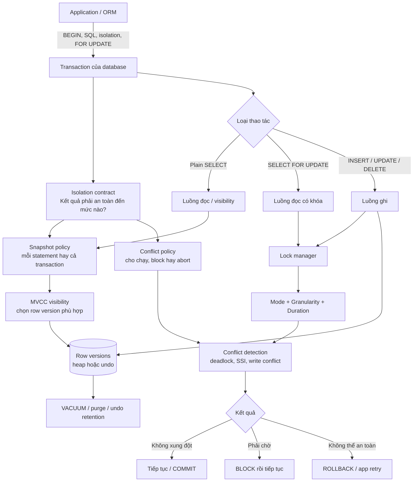

Ba khái niệm này thường xuất hiện cạnh nhau nhưng không nằm cùng một hệ phân loại. Cách hiểu ngắn nhất là: **Isolation Level đặt ra yêu cầu; Locking Type và Locking Level là một phần công cụ database có thể dùng để đáp ứng yêu cầu đó.**

## Mục lục

- [Mô hình tổng quát](#mô-hình-tổng-quát)
- [Bức tranh toàn cảnh](#bức-tranh-toàn-cảnh)
  - [Tầng 1 — Application đưa ra yêu cầu](#tầng-1--application-đưa-ra-yêu-cầu)
  - [Tầng 2 — Isolation Level đặt ra cam kết](#tầng-2--isolation-level-đặt-ra-cam-kết)
  - [Tầng 3 — Database phối hợp các cơ chế](#tầng-3--database-phối-hợp-các-cơ-chế)
  - [Tầng 4 — Kết quả quan sát được](#tầng-4--kết-quả-quan-sát-được)
  - [Hai luồng cần tách biệt](#hai-luồng-cần-tách-biệt)
  - [Theo dõi toàn bộ vòng đời một transaction](#theo-dõi-toàn-bộ-vòng-đời-một-transaction)
  - [Bảng định vị các khái niệm](#bảng-định-vị-các-khái-niệm)
- [Ba thành phần trả lời ba câu hỏi khác nhau](#ba-thành-phần-trả-lời-ba-câu-hỏi-khác-nhau)
  - [Isolation Level — cần bảo vệ đến mức nào](#isolation-level--cần-bảo-vệ-đến-mức-nào)
  - [Locking Type — khóa theo chế độ nào](#locking-type--khóa-theo-chế-độ-nào)
  - [Locking Level — khóa tài nguyên lớn đến đâu](#locking-level--khóa-tài-nguyên-lớn-đến-đâu)
- [Lock Duration là mắt xích còn thiếu](#lock-duration-là-mắt-xích-còn-thiếu)
- [Theo dõi một câu UPDATE từ đầu đến cuối](#theo-dõi-một-câu-update-từ-đầu-đến-cuối)
- [Cùng một SELECT dưới các Isolation Level](#cùng-một-select-dưới-các-isolation-level)
  - [Read Committed](#read-committed)
  - [Repeatable Read](#repeatable-read)
  - [Serializable](#serializable)
- [Bảng tương quan trong hệ thống lock-based](#bảng-tương-quan-trong-hệ-thống-lock-based)
- [MVCC làm mối quan hệ thay đổi thế nào](#mvcc-làm-mối-quan-hệ-thay-đổi-thế-nào)
  - [PostgreSQL](#postgresql)
  - [MySQL InnoDB](#mysql-innodb)
- [Range và Predicate Lock nằm ở đâu](#range-và-predicate-lock-nằm-ở-đâu)
- [Optimistic và Pessimistic Locking nằm ở đâu](#optimistic-và-pessimistic-locking-nằm-ở-đâu)
- [Database tự lock hay developer yêu cầu](#database-tự-lock-hay-developer-yêu-cầu)
- [Các cách hiểu sai thường gặp](#các-cách-hiểu-sai-thường-gặp)
- [Cách phân tích một tình huống concurrency](#cách-phân-tích-một-tình-huống-concurrency)
- [Tổng kết](#tổng-kết)
- [Tài liệu liên quan](#tài-liệu-liên-quan)

---

## Mô hình tổng quát

Hãy hình dung quá trình database xử lý concurrency theo hai tầng:

```text
TẦNG YÊU CẦU
Isolation Level
"Transaction phải được bảo vệ đến mức nào?"
        │
        ▼
TẦNG THỰC THI
Database kết hợp:
├── Locking Type   — Shared, Exclusive, Intent...
├── Locking Level  — Row, Page, Table, Range...
├── Lock Duration  — giữ đến hết statement hay transaction
├── MVCC Snapshot  — transaction nhìn thấy version nào
└── Conflict Check — block, deadlock detection hoặc abort/retry
```

Không có ánh xạ một-một như:

```text
READ COMMITTED = Row Lock
SERIALIZABLE   = Table Lock
```

Cùng một Isolation Level có thể được database A thực hiện bằng lock, nhưng database B lại dùng MVCC snapshot và conflict detection.

## Bức tranh toàn cảnh

Để không trộn lẫn các khái niệm, hãy đi từ **yêu cầu của application** xuống **cách storage engine thực thi**. Isolation Level, MVCC và locking nằm ở các tầng khác nhau:



Sơ đồ trên có thể rút gọn thành một công thức:

```text
Yêu cầu nghiệp vụ
      ↓
Isolation Level                         ← cam kết về hành vi
      ↓
Snapshot + MVCC + Lock + Conflict Check ← công cụ thực thi
      ↓
COMMIT, BLOCK hoặc ABORT/RETRY           ← kết quả quan sát được
```

### Tầng 1 — Application đưa ra yêu cầu

Application không trực tiếp tạo lock hay chọn row version trong storage. Nó chỉ gửi các tín hiệu như:

```sql
BEGIN TRANSACTION ISOLATION LEVEL REPEATABLE READ;

SELECT balance FROM accounts WHERE id = 1;

SELECT * FROM orders WHERE id = 10 FOR UPDATE;

UPDATE accounts SET balance = balance - 100 WHERE id = 1;
COMMIT;
```

Các tín hiệu này mang ý nghĩa khác nhau:

- `ISOLATION LEVEL` chọn mức đảm bảo cho **toàn transaction**.
- Plain `SELECT` yêu cầu đọc dữ liệu visible theo snapshot hiện tại.
- `FOR UPDATE` yêu cầu một **locking read** vì application chuẩn bị sửa dữ liệu.
- `UPDATE` là thao tác ghi; database tự đặt lock cần thiết dù application không viết từ khóa `LOCK`.

### Tầng 2 — Isolation Level đặt ra cam kết

Isolation Level mô tả **hành vi được phép quan sát**, không mô tả cấu trúc lưu trữ cụ thể.

Ví dụ với hai lần đọc trong cùng transaction:

```text
READ COMMITTED:
SELECT lần 1 → 100
transaction khác UPDATE + COMMIT
SELECT lần 2 → có thể thấy 200

REPEATABLE READ:
SELECT lần 1 → 100
transaction khác UPDATE + COMMIT
SELECT lần 2 → vẫn thấy 100

SERIALIZABLE:
Ngoài góc nhìn ổn định, kết quả còn phải tương đương
với một thứ tự chạy tuần tự hợp lệ.
```

Isolation Level không bắt buộc database phải đạt cam kết bằng lock hay bằng MVCC. Hai engine có thể cung cấp cùng một cam kết bằng hai chiến lược khác nhau.

### Tầng 3 — Database phối hợp các cơ chế

Database thường không chọn đúng **một** cơ chế. Nó phối hợp nhiều cơ chế cùng lúc:

1. **Snapshot policy** quyết định snapshot được tạo cho từng statement hay giữ cho cả transaction.
2. **MVCC visibility** chọn row version nào được phép xuất hiện trong snapshot đó.
3. **Lock manager** bảo vệ thao tác ghi, locking read, DDL và các invariant nội bộ.
4. **Lock mode** quyết định quyền đọc/ghi nào tương thích với nhau.
5. **Lock granularity** xác định tài nguyên là row, page, table hay key range.
6. **Lock duration** xác định lock được giữ đến hết statement hay hết transaction.
7. **Conflict detection** quyết định cho transaction chờ, chọn deadlock victim hoặc báo serialization failure.
8. **Version cleanup** dọn version cũ khi không còn snapshot nào cần chúng.

Vì vậy, nói “PostgreSQL dùng MVCC” không có nghĩa PostgreSQL không dùng lock. PostgreSQL có thể đồng thời:

```text
Plain SELECT       → dùng MVCC snapshot, thường không lấy row lock
UPDATE             → tạo row version mới + lấy row lock
SELECT FOR UPDATE  → đọc theo visibility rule + lấy row lock
SERIALIZABLE       → snapshot + SSI dependency tracking + có thể abort
VACUUM             → dọn version cũ khi không transaction nào còn cần
```

### Tầng 4 — Kết quả quan sát được

Sau khi phối hợp các cơ chế, một thao tác thường rơi vào một trong ba kết quả:

| Kết quả | Ý nghĩa | Ví dụ |
|---|---|---|
| **Tiếp tục** | Có version visible và không có conflict nguy hiểm | Plain `SELECT` đọc version cũ trong MVCC |
| **Block** | Phải chờ transaction đang giữ lock không tương thích | Hai transaction cùng `UPDATE` một row |
| **Abort** | Không thể đảm bảo tính đúng đắn hoặc xảy ra deadlock | Serialization failure, deadlock victim |

Application phải chuẩn bị cho cả ba. Đặc biệt, `SERIALIZABLE` theo hướng optimistic có thể không block từ đầu nhưng báo lỗi ở cuối; application phải retry **toàn bộ transaction**.

### Hai luồng cần tách biệt

Điểm dễ nhầm nhất là gộp việc **đọc version nào** với việc **ai được sửa tài nguyên**. Trong thực tế đây là hai luồng liên quan nhưng khác nhau.

#### Luồng visibility — “Tôi nhìn thấy version nào?”

```text
Isolation Level
      ↓
Snapshot lifetime
      ↓
MVCC visibility rules
      ↓
Row version visible cho câu SELECT
```

Ví dụ PostgreSQL:

- `READ COMMITTED`: mỗi statement lấy snapshot mới.
- `REPEATABLE READ`: giữ snapshot từ statement đầu tiên của transaction.
- `SERIALIZABLE`: giữ snapshot ổn định và theo dõi thêm read/write dependency.

MVCC cung cấp các version để lựa chọn. Isolation Level quyết định quy tắc và vòng đời của lựa chọn đó.

#### Luồng conflict — “Tôi có được sửa tài nguyên không?”

```text
Loại câu lệnh
      ↓
Tài nguyên cần bảo vệ
      ↓
Lock mode + granularity + duration
      ↓
Chạy ngay, block, deadlock hoặc abort
```

Ví dụ:

```text
TX1: UPDATE accounts SET balance = 90 WHERE id = 1;
     → giữ write lock trên row id=1

TX2: SELECT balance FROM accounts WHERE id = 1;
     → plain MVCC read có thể đọc version cũ, không chờ TX1

TX3: UPDATE accounts SET balance = 80 WHERE id = 1;
     → muốn ghi cùng row nên phải chờ TX1
```

Do đó, câu “reader không block writer” trong MVCC chỉ đúng chủ yếu với **plain consistent read**. Writer vẫn block writer; locking read và DDL vẫn có thể tạo blocking.

### Theo dõi toàn bộ vòng đời một transaction

Xét PostgreSQL ở `READ COMMITTED`:

```sql
BEGIN;
SELECT balance FROM accounts WHERE id = 1;
UPDATE accounts SET balance = balance - 100 WHERE id = 1;
COMMIT;
```

Toàn bộ quá trình có thể được đọc theo thứ tự sau:

```text
1. BEGIN
   └── Database tạo transaction context.

2. SELECT bắt đầu
   ├── READ COMMITTED yêu cầu snapshot cho statement này.
   ├── MVCC kiểm tra xmin/xmax và trạng thái transaction.
   └── Chọn row version đã commit và visible.

3. UPDATE bắt đầu
   ├── Statement có snapshot riêng để tìm row mục tiêu.
   ├── Database lấy row-level write lock.
   ├── Nếu writer khác đang giữ lock: chờ hoặc deadlock handling.
   └── Khi được phép ghi: row cũ bị supersede, row version mới được tạo.

4. COMMIT
   ├── Version mới trở thành visible cho snapshot phù hợp trong tương lai.
   ├── Write lock được giải phóng.
   └── Transaction khác đang chờ được đánh thức.

5. Sau transaction
   └── Version cũ chưa bị xóa ngay; VACUUM chỉ dọn khi không snapshot nào cần nó.
```

Nếu đổi sang MySQL InnoDB, cam kết isolation có thể tương tự nhưng chi tiết vật lý thay đổi: bản hiện tại nằm trong clustered index, before-image nằm trong Undo Log và purge thread dọn undo cũ. Đó là khác biệt của **MVCC implementation**, không phải bản thân định nghĩa Isolation Level.

### Bảng định vị các khái niệm

| Khái niệm | Nó quyết định điều gì? | Ví dụ |
|---|---|---|
| **Transaction** | Biên atomic của một nhóm thao tác | `BEGIN ... COMMIT` |
| **Isolation Level** | Anomaly và hành vi quan sát nào được phép | `READ COMMITTED`, `SERIALIZABLE` |
| **Snapshot** | Tập trạng thái transaction dùng để xét visibility | Snapshot theo statement hoặc transaction |
| **MVCC** | Cách duy trì và tìm nhiều row version | PostgreSQL heap, InnoDB Undo Log |
| **Visibility Rule** | Version cụ thể nào hiện ra cho reader | Kiểm tra transaction tạo/xóa version đã commit chưa |
| **Locking Type** | Quyền nào tương thích trên tài nguyên | Shared, Exclusive, Intent |
| **Locking Level** | Tài nguyên được bảo vệ lớn đến đâu | Row, page, table, key range |
| **Lock Duration** | Bảo vệ kéo dài đến khi nào | Hết statement hoặc đến `COMMIT` |
| **Conflict Detection** | Khi nào phải chờ hoặc hủy transaction | Deadlock detection, PostgreSQL SSI |
| **Cleanup** | Khi nào version cũ được thu hồi | VACUUM, purge, undo retention |
| **Application Retry** | Cách phục hồi sau conflict có chủ đích | Chạy lại toàn bộ transaction |

Cách nhớ toàn cảnh:

> **Isolation nói database phải đảm bảo điều gì. Snapshot và MVCC quyết định transaction nhìn thấy gì. Lock quyết định ai được đụng vào tài nguyên. Conflict detection quyết định ai phải chờ hoặc làm lại. Cleanup thu hồi các version không còn cần thiết.**

## Ba thành phần trả lời ba câu hỏi khác nhau

### Isolation Level — cần bảo vệ đến mức nào

Isolation Level là **cam kết về hành vi quan sát được** giữa các transaction.

Ví dụ:

- `READ COMMITTED` không cho đọc dữ liệu chưa commit.
- `REPEATABLE READ` giữ cho dữ liệu đã đọc không thay đổi trong góc nhìn của transaction.
- `SERIALIZABLE` yêu cầu kết quả tương đương với một thứ tự chạy tuần tự hợp lệ.

Isolation Level quan tâm đến kết quả cuối cùng và các anomaly được phép xảy ra. Nó không bắt buộc mọi database phải dùng cùng một loại lock.

### Locking Type — khóa theo chế độ nào

Locking Type, hay lock mode, mô tả **quyền truy cập trên tài nguyên đang bị khóa**.

| Lock Type | Ý nghĩa khái quát |
|---|---|
| Shared Lock | Nhiều transaction có thể cùng giữ để đọc trong mô hình lock-based |
| Exclusive Lock | Một transaction giữ quyền ghi độc quyền trên cùng tài nguyên |
| Intent Lock | Báo ở level cao rằng transaction sẽ lock tài nguyên ở level thấp hơn |

Locking Type trả lời:

> Transaction khác có được đọc, ghi hoặc lấy một lock khác trên cùng tài nguyên không?

### Locking Level — khóa tài nguyên lớn đến đâu

Locking Level, hay lock granularity, mô tả **phạm vi tài nguyên được bảo vệ**.

| Locking Level | Phạm vi ví dụ |
|---|---|
| Row/Tuple | `accounts.id = 1` |
| Page/Block | Một page dữ liệu chứa nhiều rows |
| Table | Toàn bộ bảng `accounts` |
| Database | Toàn bộ database |
| Key Range | Một khoảng key trong index |

Locking Level trả lời:

> Lock đang bảo vệ một row, một page, một table hay cả khoảng giá trị?

Một lock thực tế vì vậy có thể được mô tả bằng nhiều thuộc tính cùng lúc:

```text
Lock {
    resource: accounts.id = 1,  ← Locking Level: row
    mode: exclusive,            ← Locking Type: X
    duration: đến COMMIT         ← thời gian giữ lock
}
```

## Lock Duration là mắt xích còn thiếu

Nếu chỉ nhìn Locking Type và Locking Level, ta vẫn chưa giải thích được vì sao Isolation Level khác nhau. **Thời gian giữ lock** thường là mắt xích quan trọng nhất.

Trong một hệ thống lock-based điển hình, cùng một Shared Row Lock có thể được dùng khác nhau:

```text
READ COMMITTED:
Shared Row Lock → đọc xong statement → giải phóng

REPEATABLE READ:
Shared Row Lock → giữ đến COMMIT/ROLLBACK
```

Type vẫn là Shared và level vẫn là Row. Điểm thay đổi là duration, nên transaction khác có hoặc không thể cập nhật row ở giữa hai lần đọc.

Isolation Level có thể ảnh hưởng đến:

- Có đặt read lock hay không.
- Lock được giữ đến hết statement hay hết transaction.
- Chỉ khóa row hiện có hay bảo vệ thêm key range.
- Transaction khác phải chờ hay được chạy rồi một transaction bị abort.
- Snapshot được tạo cho mỗi statement hay cho cả transaction.

## Theo dõi một câu UPDATE từ đầu đến cuối

Giả sử TX1 chạy:

```sql
BEGIN;

UPDATE accounts
SET balance = 8000000
WHERE id = 1;

-- Thực hiện thêm business logic...
COMMIT;
```

Database thường phải bảo vệ row đang được ghi:

```text
Bước 1: Xác định tài nguyên
        accounts.id = 1
        → Locking Level: Row

Bước 2: Xác định quyền cần có
        UPDATE cần ghi độc quyền
        → Locking Type: Exclusive/Write Lock

Bước 3: Xác định thời gian giữ
        Giữ write lock đến COMMIT hoặc ROLLBACK

Bước 4: Áp dụng quy tắc isolation và visibility
        Transaction khác chờ khi muốn ghi cùng row;
        reader dùng MVCC có thể vẫn đọc version cũ đã commit.
```

Mô tả ngắn gọn câu `UPDATE` này:

```text
Strategy:       database tự bảo vệ thao tác ghi
Locking Type:   Exclusive
Locking Level:  Row accounts.id = 1
Lock Duration:  đến cuối transaction
Isolation:      quyết định thêm cách các transaction quan sát và xung đột
```

Isolation Level không thay thế Exclusive Row Lock. Nó đặt thêm quy tắc cho toàn bộ transaction.

## Cùng một SELECT dưới các Isolation Level

Xét TX1 đọc cùng row hai lần:

```sql
BEGIN;

SELECT balance FROM accounts WHERE id = 1;
-- Xử lý...
SELECT balance FROM accounts WHERE id = 1;

COMMIT;
```

Giữa hai lần đọc, TX2 thay đổi số dư và commit:

```sql
UPDATE accounts
SET balance = 9000000
WHERE id = 1;
COMMIT;
```

### Read Committed

TX1 có thể thấy hai giá trị khác nhau:

```text
TX1 SELECT lần 1 → 10M
TX2 UPDATE + COMMIT → 9M
TX1 SELECT lần 2 → 9M
```

Trong hệ thống lock-based, read lock có thể chỉ được giữ đến hết statement. Trong hệ thống MVCC như PostgreSQL, mỗi statement nhận một snapshot mới.

Hai cách triển khai khác nhau nhưng cùng tạo ra hành vi `READ COMMITTED`: chỉ đọc dữ liệu đã commit, nhưng vẫn có thể gặp Non-Repeatable Read.

### Repeatable Read

TX1 cần giữ một góc nhìn ổn định:

```text
TX1 SELECT lần 1 → 10M
TX2 UPDATE + COMMIT → 9M
TX1 SELECT lần 2 → vẫn thấy 10M
```

Database có thể thực hiện bằng một trong hai hướng:

```text
Lock-based:
Giữ Shared Row Lock đến cuối transaction
→ writer có thể phải chờ

MVCC-based:
Giữ một snapshot ổn định cho transaction
→ writer vẫn có thể commit
→ TX1 tiếp tục nhìn thấy version 10M
```

### Serializable

Ngoài việc giữ dữ liệu đã đọc ổn định, database còn phải ngăn hoặc phát hiện kết quả không thể tương đương với bất kỳ thứ tự chạy tuần tự nào.

Với query theo khoảng:

```sql
SELECT *
FROM accounts
WHERE balance BETWEEN 5000000 AND 10000000;
```

Database có thể:

- Dùng Key-Range/Next-Key Lock để ngăn key mới đi vào khoảng.
- Dùng MVCC và theo dõi read/write dependency.
- Cho các transaction chạy đồng thời rồi abort một transaction khi phát hiện serialization conflict.

Serializable không đồng nghĩa với Table Lock. Nó là yêu cầu về kết quả; database được quyền chọn cơ chế thực hiện.

## Bảng tương quan trong hệ thống lock-based

Bảng dưới đây là **mô hình khái quát** cho database lock-based, không phải hành vi bắt buộc của mọi engine:

| Isolation Level | Read Lock điển hình | Phạm vi | Thời gian giữ | Anomaly chính còn có thể xảy ra |
|---|---|---|---|---|
| `READ UNCOMMITTED` | Không dùng hoặc không tôn trọng Shared Lock khi đọc | Ít bảo vệ | Không có/rất ngắn | Dirty, non-repeatable, phantom read |
| `READ COMMITTED` | Shared Lock | Row/page được đọc | Đến hết statement | Non-repeatable và phantom read |
| `REPEATABLE READ` | Shared Lock | Row/page được đọc | Đến cuối transaction | Phantom read theo chuẩn SQL |
| `SERIALIZABLE` | Shared + Key-Range Lock | Row và khoảng key | Đến cuối transaction | Không cho phép các anomaly trên |

Điều thường thay đổi khi isolation tăng:

```text
Giữ lock lâu hơn
       +
Bảo vệ phạm vi rộng hơn
       +
Kiểm tra conflict chặt hơn
```

Điều đó không có nghĩa database luôn khóa nguyên table ở level cao.

## MVCC làm mối quan hệ thay đổi thế nào

**MVCC — Multi-Version Concurrency Control** lưu hoặc duy trì nhiều version của row. Reader có thể đọc một version phù hợp với snapshot mà không cần chặn writer.

Khi có MVCC, Isolation Level thường ảnh hưởng mạnh đến **snapshot lifetime** thay vì chỉ ảnh hưởng read lock duration.

### PostgreSQL

Plain `SELECT` trong PostgreSQL không đặt Shared Row Lock, kể cả ở `REPEATABLE READ`:

```sql
SELECT * FROM accounts WHERE id = 1;
```

PostgreSQL thực hiện isolation chủ yếu bằng snapshot:

| Isolation Level | Snapshot và conflict handling |
|---|---|
| `READ COMMITTED` | Snapshot mới cho mỗi statement |
| `REPEATABLE READ` | Snapshot ổn định từ statement đầu tiên của transaction |
| `SERIALIZABLE` | Snapshot ổn định + SSI phát hiện dependency nguy hiểm |

PostgreSQL vẫn dùng lock thật cho:

- `UPDATE` và `DELETE`.
- `SELECT ... FOR UPDATE` hoặc `FOR SHARE`.
- DDL và table-level operations.
- Foreign key, uniqueness check và nhiều thao tác nội bộ.

Ở `SERIALIZABLE`, PostgreSQL dùng `SIReadLock`, thường được gọi là Predicate Lock, để theo dõi dữ liệu đã đọc. Lock này không block writer như Key-Range Lock truyền thống. Nếu phát hiện cấu trúc dependency nguy hiểm, PostgreSQL abort một transaction và application phải retry.

### MySQL InnoDB

MySQL InnoDB kết hợp MVCC và locking:

```text
Consistent SELECT:
Dùng MVCC snapshot

UPDATE/DELETE:
Dùng record lock và có thể có gap/next-key lock

SELECT ... FOR UPDATE/FOR SHARE:
Locking read; có thể dùng record hoặc next-key lock
```

Ở `REPEATABLE READ`, consistent read giữ một read view ổn định nên các query thường không thấy phantom trong snapshot. Với locking read và thao tác ghi, Gap/Next-Key Lock giúp bảo vệ các khoảng index khỏi thay đổi cạnh tranh.

Vì vậy, không nên kết luận rằng cùng tên `REPEATABLE READ` thì PostgreSQL và MySQL phải đặt cùng Locking Type hoặc Locking Level.

## Range và Predicate Lock nằm ở đâu

Range và Predicate Lock xuất hiện khi một query cần bảo vệ **tập rows theo điều kiện**, không chỉ một row đã tồn tại.

```sql
SELECT *
FROM employees
WHERE salary BETWEEN 10000000 AND 20000000;
```

Nếu chỉ khóa các row hiện có, transaction khác vẫn có thể chèn `salary = 15M`, tạo Phantom Read.

```text
Isolation requirement:
Ngăn hoặc phát hiện Phantom Read
        │
        ├── MySQL: Gap/Next-Key Lock trên index
        ├── SQL Server: Key-Range Lock
        └── PostgreSQL: MVCC + SSI Predicate Lock ở SERIALIZABLE
```

Trong mô hình ba thành phần:

- **Isolation Level** yêu cầu tập kết quả phải an toàn đến mức nào.
- **Range/Predicate** mô tả phạm vi hoặc dependency cần bảo vệ/theo dõi.
- **Lock Type** vẫn mô tả mode và khả năng tương thích nếu engine dùng blocking lock.

Xem giải thích chi tiết tại [Range, Gap, Next-Key và Predicate Lock](/fundamentals/lock#range-gap-next-key-và-predicate-lock).

## Optimistic và Pessimistic Locking nằm ở đâu

Optimistic/Pessimistic không phải Locking Type hoặc Locking Level. Chúng là **chiến lược xử lý conflict** thường do developer hoặc ORM lựa chọn.

```text
Pessimistic:
Cho rằng conflict dễ xảy ra
→ yêu cầu database lock trước
→ transaction khác chờ

Optimistic:
Cho rằng conflict hiếm
→ không giữ explicit lock từ lúc đọc đến lúc ghi
→ kiểm tra version khi UPDATE
→ conflict thì retry/báo lỗi
```

Một câu Pessimistic Locking có thể được mô tả theo nhiều chiều:

```sql
SELECT *
FROM products
WHERE id = 1
FOR UPDATE;
```

```text
Strategy:       Pessimistic
Locking Type:   Write/Exclusive-style row lock
Locking Level:  Row products.id = 1
Duration:       đến COMMIT/ROLLBACK
Isolation:      level hiện tại vẫn điều khiển visibility của cả transaction
```

Optimistic Locking thường dùng conditional update:

```sql
UPDATE products
SET stock = 9,
    version = version + 1
WHERE id = 1
  AND version = 5;
```

Application kiểm tra:

```text
affected_rows = 1 → thành công
affected_rows = 0 → version đã đổi, cần xử lý conflict
```

Database vẫn đặt lock nội bộ trong lúc thực thi `UPDATE`. "Optimistic" chỉ có nghĩa application không giữ explicit lock trong toàn bộ khoảng thời gian từ đọc đến ghi.

## Database tự lock hay developer yêu cầu

Cả hai trường hợp đều tồn tại:

| Tình huống | Ai chọn hành vi? | Ai quản lý lock thực tế? |
|---|---|---|
| `UPDATE`/`DELETE` thông thường | Database tự chọn lock cần thiết | Database |
| Locking type/level nội bộ | Database engine và execution plan | Database |
| `SELECT ... FOR UPDATE` | Developer/ORM chủ động yêu cầu | Database |
| `LOCK TABLE` | Developer/DBA chủ động yêu cầu | Database |
| Optimistic version check | Developer/ORM thiết kế | Database thực hiện atomic `UPDATE` và lock ngắn hạn |
| Isolation Level | Developer/config chọn mức; DB thực thi | Database |

Developer không tự khóa row trong storage engine. Developer chọn strategy, isolation hoặc explicit locking clause; database mới là thành phần tạo, theo dõi, chờ và giải phóng lock.

## Các cách hiểu sai thường gặp

| Cách hiểu sai | Cách hiểu đúng |
|---|---|
| `SERIALIZABLE` nghĩa là khóa cả table | Serializable yêu cầu kết quả tuần tự; database có thể dùng range lock, MVCC, SSI hoặc abort/retry |
| `REPEATABLE READ` luôn giữ Shared Row Lock | Đúng với một số engine lock-based; PostgreSQL dùng transaction snapshot cho plain `SELECT` |
| Row Lock thuộc riêng `READ COMMITTED` | Row Lock có thể xuất hiện ở nhiều isolation level; nó chỉ mô tả granularity |
| Exclusive Lock luôn block mọi reader | Trong MVCC, reader thường đọc version cũ đã commit và không lấy lock xung đột |
| Optimistic Lock hoàn toàn không có DB lock | Conditional `UPDATE` vẫn cần lock nội bộ; chỉ không giữ explicit lock từ read đến write |
| Predicate Lock của PostgreSQL chặn `INSERT` | `SIReadLock` chủ yếu theo dõi dependency; PostgreSQL thường abort thay vì block writer |

## Cách phân tích một tình huống concurrency

Khi gặp một đoạn SQL, hãy hỏi lần lượt:

1. **Isolation Level là gì?** Transaction được phép gặp anomaly nào?
2. **Đây là plain read, locking read hay write?** `SELECT`, `FOR UPDATE`, `UPDATE` có hành vi khác nhau.
3. **Database dùng lock-based hay MVCC?** Không suy luận PostgreSQL giống SQL Server hoặc MySQL.
4. **Tài nguyên nào cần bảo vệ?** Một row, table hay khoảng index?
5. **Lock mode nào cần thiết?** Shared, Exclusive, Intent hay mode riêng của engine?
6. **Giữ lock/snapshot đến bao giờ?** Hết statement hay hết transaction?
7. **Conflict được xử lý thế nào?** Chờ, deadlock victim, serialization failure hay optimistic retry?

Ví dụ kết luận hoàn chỉnh:

```text
PostgreSQL, READ COMMITTED,
SELECT ... FOR UPDATE WHERE id = 1

├── Isolation: snapshot mới cho statement
├── Strategy: pessimistic locking read
├── Resource: row id = 1
├── Lock: row-level write lock do PostgreSQL quản lý
├── Duration: đến cuối transaction
└── Conflict: writer khác trên row đó phải chờ hoặc lỗi do timeout/deadlock
```

## Tổng kết

Ba thành phần có quan hệ nhưng không đồng nghĩa:

```text
Isolation Level
= Mức an toàn transaction phải đạt

Locking Type
= Chế độ truy cập trên tài nguyên bị khóa

Locking Level
= Phạm vi tài nguyên bị khóa
```

Mối quan hệ đầy đủ hơn:

```text
Isolation requirement
        ↓
Database implementation
├── Locking Type
├── Locking Level
├── Lock Duration
├── MVCC Snapshot
└── Conflict Detection / Retry
```

Điểm cần nhớ nhất:

> **Isolation Level quy định kết quả cần đảm bảo. Locking Type và Locking Level chỉ là hai trong số các công cụ triển khai; thời gian giữ lock và MVCC mới hoàn thiện bức tranh.**

## Tài liệu liên quan

- [Lock trong Database](/fundamentals/lock)
- [Isolation Levels](/fundamentals/isolation-levels)
- [MVCC — Multi-Version Concurrency Control](/fundamentals/mvcc)
- [ACID Transaction](/fundamentals/acid-transaction)
