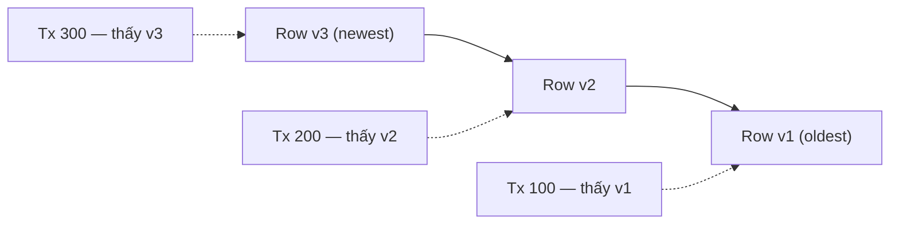

## Mục lục

- [MVCC là gì](#mvcc-là-gì)
- [Tại sao cần MVCC](#tại-sao-cần-mvcc)
- [Cách MVCC hoạt động](#cách-mvcc-hoạt-động)
- [MVCC trong PostgreSQL](#mvcc-trong-postgresql)
- [MVCC trong MySQL InnoDB](#mvcc-trong-mysql-innodb)
- [MVCC trong Oracle](#mvcc-trong-oracle)
- [So sánh chi tiết 3 Database](#so-sánh-chi-tiết-3-database)
- [Ví dụ minh họa UPDATE trong cả 3 DB](#ví-dụ-minh-họa-update-trong-cả-3-db)
- [Tổng kết xếp hạng theo tiêu chí](#tổng-kết-xếp-hạng-theo-tiêu-chí)

---

## MVCC là gì

**MVCC** (Multi-Version Concurrency Control) là cơ chế kiểm soát đồng thời đa phiên bản, giúp các database như PostgreSQL, MySQL (InnoDB), Oracle xử lý nhiều transaction cùng lúc mà không bị khóa (lock) quá nhiều, vẫn đảm bảo tính nhất quán dữ liệu (consistency).

Ý tưởng cốt lõi: **tạo nhiều "phiên bản" của mỗi row** để mỗi transaction thấy một **snapshot riêng** của dữ liệu. Nhờ đó, **đọc không bị khóa ghi** và ngược lại.

## Tại sao cần MVCC

### Vấn đề của Lock-based Concurrency

Nếu chỉ dùng lock thuần túy (không có MVCC):

- Khi một transaction **đọc** dữ liệu đang bị transaction khác **sửa đổi** → phải **chờ** (block).
- Reader block writer, writer block reader → **throughput giảm mạnh**.
- Hệ thống concurrent cao sẽ trở nên **rất chậm** vì hầu hết thời gian dành cho việc chờ lock.

```
Không có MVCC:
┌──────────────┐     ┌──────────────┐
│ Transaction A│     │ Transaction B│
│  UPDATE row  │     │  SELECT row  │
│  (giữ X lock)│     │  ⏳ BLOCKED  │
│              │     │  chờ A xong  │
│  COMMIT      │     │  mới đọc được│
└──────────────┘     └──────────────┘

Có MVCC:
┌──────────────┐     ┌──────────────┐
│ Transaction A│     │ Transaction B│
│  UPDATE row  │     │  SELECT row  │
│  (tạo v2)    │     │  (đọc v1 cũ) │
│              │     │  ✅ không chờ│
│  COMMIT      │     │              │
└──────────────┘     └──────────────┘
```

### MVCC giải quyết thế nào

- Mỗi transaction thấy dữ liệu **tại thời điểm nó bắt đầu** (snapshot).
- Khi ghi (UPDATE, DELETE) → **không ghi đè** mà tạo một **bản mới** của row (record version).
- Các transaction khác vẫn đọc **bản cũ** → không bị chặn.
- Kết quả: **readers never block writers, writers never block readers**.

## Cách MVCC hoạt động

### Snapshot

Khi một transaction bắt đầu, database tạo một **snapshot** — ảnh chụp trạng thái dữ liệu tại thời điểm đó. Transaction chỉ thấy các thay đổi đã **commit trước** snapshot, không thấy các thay đổi chưa commit hoặc commit sau.

### Version Chain

Mỗi row có thể tồn tại **nhiều phiên bản** đồng thời. Các phiên bản được liên kết thành chuỗi (version chain). Database sử dụng thông tin transaction ID để quyết định phiên bản nào **visible** cho từng transaction.



## MVCC trong PostgreSQL

PostgreSQL sử dụng kiến trúc **heap-based versioning** — lưu tất cả phiên bản row **ngay trong table heap**.

### Cơ chế hoạt động

Mỗi row trong PostgreSQL có hai system column ẩn:

| Column | Ý nghĩa |
|--------|---------|
| **xmin** | Transaction ID đã **INSERT** row này |
| **xmax** | Transaction ID đã **DELETE/UPDATE** row này (0 nếu row còn sống) |

Khi **UPDATE** xảy ra:

1. Row cũ được đánh dấu `xmax = txid_current`.
2. Row mới được INSERT với `xmin = txid_current`, `xmax = 0`.
3. Cả hai version **đều nằm trong heap**.

### Transaction Snapshot

PostgreSQL dùng snapshot chứa:

- `xmin`: transaction ID nhỏ nhất còn đang chạy.
- `xmax`: transaction ID tiếp theo sẽ được cấp.
- `xip_list`: danh sách các transaction đang in-progress.

Một row **visible** cho transaction T nếu:

- `row.xmin` đã commit VÀ `row.xmin` < `T.snapshot.xmax`.
- `row.xmax` = 0 HOẶC `row.xmax` chưa commit HOẶC `row.xmax` > `T.snapshot`.

### Dead Tuples và VACUUM

Vì row cũ nằm ngay trong heap → sau UPDATE/DELETE, row cũ trở thành **dead tuple** — chiếm không gian nhưng không ai nhìn thấy nữa.

Dead tuple tích lũy dẫn đến:

- **Table bloat**: table phình to dù dữ liệu thực tế ít.
- **Index bloat**: index trỏ đến dead tuple.
- **Query chậm**: sequential scan phải quét qua dead tuple.

**VACUUM** là cơ chế **bắt buộc** để dọn dẹp dead tuple:

- `VACUUM`: dọn dead tuple, cập nhật visibility map, **không trả disk về OS**.
- `VACUUM FULL`: rebuild table, **trả disk về OS** nhưng khóa bảng.
- `AUTOVACUUM`: PostgreSQL tự động chạy khi dead tuple vượt ngưỡng.

### ASCII Diagram: Row Versioning trong Heap

```
PostgreSQL Heap (Table File)
┌──────────────────────────────────────────────────┐
│  Page 0                                          │
│  ┌──────────────────────────────────────────┐    │
│  │ Row: id=1, name='Alice', salary=5000     │    │
│  │ xmin=100, xmax=105  ← DEAD (đã UPDATE)   │    │
│  ├──────────────────────────────────────────┤    │
│  │ Row: id=1, name='Alice', salary=6000     │    │
│  │ xmin=105, xmax=0    ← ALIVE (bản mới)    │    │
│  ├──────────────────────────────────────────┤    │
│  │ Row: id=2, name='Bob', salary=4000       │    │
│  │ xmin=101, xmax=0    ← ALIVE              │    │
│  └──────────────────────────────────────────┘    │
│                                                  │
│  → VACUUM sẽ dọn row id=1 có xmax=105            │
│  → Giải phóng slot cho row mới                   │
└──────────────────────────────────────────────────┘
```

## MVCC trong MySQL InnoDB

MySQL InnoDB sử dụng **Undo Log** để lưu trữ phiên bản cũ — table heap luôn chỉ chứa **bản mới nhất**.

### Cơ chế hoạt động

Khi **UPDATE** xảy ra:

1. Row hiện tại trong table được **ghi đè** bằng giá trị mới.
2. Giá trị cũ được sao chép vào **Undo Log** (rollback segment).
3. Row mới chứa pointer trỏ về Undo Log entry.

### Read View

Khi transaction cần đọc snapshot:

1. InnoDB tạo **Read View** chứa danh sách transaction đang active.
2. Nếu row hiện tại bị sửa bởi transaction chưa commit → InnoDB **đi ngược** qua Undo Log để tìm phiên bản visible.

```
MySQL InnoDB Architecture
┌─────────────────────────────┐
│  Table Heap                 │
│  ┌───────────────────────┐  │
│  │ id=1, salary=6000     │──┼──→ Undo Log
│  │ (bản mới nhất)        │  │    ┌─────────────────────┐
│  └───────────────────────┘  │    │ id=1, salary=5000   │
│  ┌───────────────────────┐  │    │(bản cũ, cho snapshot│
│  │ id=2, salary=4000     │  │    │  read hoặc rollback)│
│  │ (chưa bị sửa)         │  │    └─────────────────────┘
│  └───────────────────────┘  │
└─────────────────────────────┘
```

### Purge Thread

- Undo Log entry chỉ bị xóa khi **không còn transaction nào** cần đọc phiên bản cũ đó.
- **Purge thread** chạy nền, tự động dọn dẹp Undo Log → **không cần VACUUM**.
- Nếu có **long-running transaction** giữ snapshot lâu → Undo Log phình to, purge bị lag.

## MVCC trong Oracle

Oracle sử dụng **Undo Tablespace** — vùng lưu trữ chuyên biệt được tối ưu cho MVCC.

### Cơ chế hoạt động

- Khi UPDATE/DELETE, Oracle lưu **before-image** của row vào **Undo Tablespace**.
- Table heap chỉ chứa **bản hiện tại**.
- Mỗi thay đổi được gắn **SCN (System Change Number)** — con số tăng dần đại diện cho thời điểm logic.

### SCN — System Change Number

SCN là "đồng hồ logic" của Oracle:

- Mỗi commit tạo một SCN mới.
- Snapshot read sử dụng SCN để xác định dữ liệu nào visible.
- Cho phép **flashback query**: đọc dữ liệu tại bất kỳ SCN nào trong quá khứ (nếu undo còn).

```sql
-- Oracle: Flashback Query — đọc dữ liệu 1 giờ trước
SELECT * FROM employees
AS OF TIMESTAMP (SYSTIMESTAMP - INTERVAL '1' HOUR);
```

### Automatic Undo Management

Oracle tự động quản lý vùng Undo:

- **Undo Retention**: cấu hình thời gian tối thiểu giữ undo (ví dụ: 15 phút).
- Nếu undo bị ghi đè quá sớm → lỗi **ORA-01555: snapshot too old**.
- DBA tune bằng `UNDO_RETENTION` parameter và sizing Undo Tablespace.

```
Oracle Architecture
┌─────────────────────┐     ┌──────────────────────┐
│  Table Heap         │     │  Undo Tablespace     │
│  ┌───────────────┐  │     │  ┌────────────────┐  │
│  │ id=1          │  │     │  │ SCN 1000:      │  │
│  │ salary=6000   │──┼────→│  │ id=1           │  │
│  │ SCN: 1050     │  │     │  │ salary=5000    │  │
│  └───────────────┘  │     │  └────────────────┘  │
│                     │     │  Auto-managed by     │
│                     │     │  Undo Retention      │
└─────────────────────┘     └──────────────────────┘
```

## So sánh chi tiết 3 Database

### Bảng so sánh tổng quan

| Tiêu chí | PostgreSQL | MySQL InnoDB | Oracle |
|----------|-----------|-------------|--------|
| **Nơi lưu row cũ** | Heap (ngay trong table) | Undo Log | Undo Tablespace |
| **Table chứa nhiều phiên bản** | ✔ Có | ❌ Không | ❌ Không |
| **Cần VACUUM** | ✔ Có | ❌ Không | ❌ Không |
| **Cleanup mechanism** | VACUUM, VACUUM FULL | Purge thread, `OPTIMIZE TABLE` | Undo retention, segment shrink |
| **Version tracking** | xmin / xmax | Transaction ID + Undo pointer | SCN |
| **Rollback** | Nhanh (data cũ ngay trong heap) | Cần đọc Undo Log | Cần đọc Undo Tablespace |

### Tại sao PostgreSQL cần VACUUM mà MySQL/Oracle không cần?

**PostgreSQL** — kiến trúc storage dạng **append-only**:

- Row cũ vẫn nằm trong table → hình thành **dead tuples**.
- VACUUM là cơ chế **bắt buộc** để dọn dead tuples, giữ hiệu năng ổn định.

**MySQL/Oracle**:

- Table chỉ chứa **bản mới nhất**; row cũ nằm trong undo log / undo tablespace.
- **Purge thread** (MySQL) hoặc **undo retention** (Oracle) tự động loại bỏ phiên bản cũ.

### Ưu/nhược điểm chi tiết

#### PostgreSQL — Heap-based versioning

**Ưu điểm:**

- Concurrency mạnh, không cần lock row khi UPDATE.
- Rollback nhanh vì dữ liệu cũ nằm ngay trong heap.
- Crash recovery đơn giản (WAL xử lý).

**Nhược điểm:**

- Table/index bloat nếu VACUUM không theo kịp.
- UPDATE tốn I/O hơn do ghi phiên bản mới vào heap.

| Tác vụ | Hiệu năng |
|--------|-----------|
| SELECT song song | ⭐ Rất mạnh |
| UPDATE thường xuyên | ❗ Trung bình, dễ bloat |
| DELETE nhiều | ❗ Cần VACUUM liên tục |
| OLTP write-heavy | Không lý tưởng nếu VACUUM chậm |
| OLAP | Ổn nhưng có thể chậm nếu bloat |

#### MySQL InnoDB — Undo Log + Purge Thread

**Ưu điểm:**

- Table luôn sạch, không dead row.
- Không cần VACUUM, hạn chế bloat.
- UPDATE/DELETE hiệu quả hơn trong workload write-heavy.

**Nhược điểm:**

- Purge thread có thể bị lag nếu workload quá lớn.
- SELECT snapshot phải đọc undo log → đôi khi chậm.
- Transaction dài giữ snapshot lâu, undo khó purge.

| Tác vụ | Hiệu năng |
|--------|-----------|
| UPDATE/DELETE liên tục | ⭐ Mạnh |
| SELECT snapshot | Medium |
| High write OLTP | ⭐ Tốt |
| Long transactions | ❗ Dễ purge lag |
| Bảng TB-size | ⭐ Ổn định |

#### Oracle — Undo Tablespace tối ưu

**Ưu điểm:**

- MVCC ổn định nhất, undo được tối ưu riêng.
- SELECT snapshot rất nhanh, write-heavy workload ổn định.
- Không bloat table.

**Nhược điểm:**

- Cần quản trị undo retention kỹ, thiếu undo gây ORA-01555.
- Cấu trúc phức tạp, khó tune hơn MySQL.

| Tác vụ | Hiệu năng |
|--------|-----------|
| SELECT snapshot | ⭐⭐ Nhanh nhất |
| UPDATE/DELETE | ⭐⭐ Rất mạnh |
| High write workload | ⭐⭐ Ổn định |
| Long transactions | ⭐ Chịu tải tốt |
| OLAP + OLTP kết hợp | ⭐⭐ Phù hợp |

## Ví dụ minh họa UPDATE trong cả 3 DB

Giả sử ta thực hiện: `UPDATE employees SET salary = 6000 WHERE id = 1` (salary cũ = 5000).

### PostgreSQL

```
Heap TRƯỚC UPDATE:
┌────────────────────────────────────┐
│ id=1, salary=5000                  │
│ xmin=100, xmax=0   ← ALIVE         │
└────────────────────────────────────┘

Heap SAU UPDATE (transaction 105):
┌────────────────────────────────────┐
│ id=1, salary=5000                  │
│ xmin=100, xmax=105  ← DEAD         │
├────────────────────────────────────┤
│ id=1, salary=6000                  │
│ xmin=105, xmax=0    ← ALIVE        │
└────────────────────────────────────┘
→ Cả hai version nằm trong heap
→ VACUUM sẽ dọn row dead (xmax=105) sau khi không còn tx cần
```

### MySQL InnoDB

```
Table TRƯỚC UPDATE:
┌────────────────────────┐
│ id=1, salary=5000      │
└────────────────────────┘

Table SAU UPDATE:
┌────────────────────────┐     Undo Log:
│ id=1, salary=6000      │──→  ┌──────────────────────┐
│ (bản mới, in-place)    │     │ id=1, salary=5000    │
└────────────────────────┘     │(cho rollback/snapshot│
                               │ purge thread dọn sau)│
                               └──────────────────────┘
→ Table chỉ chứa bản mới nhất
→ Purge thread tự động dọn undo khi không cần
```

### Oracle

```
Table TRƯỚC UPDATE:
┌────────────────────────┐
│ id=1, salary=5000      │
│ SCN: 1000              │
└────────────────────────┘

Table SAU UPDATE:
┌────────────────────────┐     Undo Tablespace:
│ id=1, salary=6000      │──→  ┌──────────────────────┐
│ SCN: 1050              │     │ SCN 1000:            │
└────────────────────────┘     │ id=1, salary=5000    │
                               │ (giữ theo undo       │
                               │  retention period)   │
                               └──────────────────────┘
→ Table chỉ chứa bản hiện tại
→ Undo tự động quản lý theo retention
→ Nếu undo hết → ORA-01555
```

## Tổng kết xếp hạng theo tiêu chí

| Tiêu chí | Thứ hạng |
|----------|----------|
| Write-heavy OLTP | Oracle > MySQL > PostgreSQL |
| Read consistency | Oracle > PostgreSQL > MySQL |
| Clean-up / maintenance | MySQL = Oracle > PostgreSQL |
| Ít bloat nhất | Oracle |
| Hiệu năng ổn định dài hạn | Oracle |
| Chi phí / thân thiện | MySQL |
| MVCC đơn giản nhưng mạnh | PostgreSQL |

### Khi nào chọn DB nào?

| Scenario | Khuyến nghị |
|----------|------------|
| **Startup, chi phí thấp, cần JSON/extension** | PostgreSQL |
| **Web app, write-heavy, ecosystem lớn** | MySQL |
| **Enterprise, mission-critical, budget lớn** | Oracle |
| **Read-heavy analytics + OLTP** | PostgreSQL hoặc Oracle |
| **High-concurrency write + ổn định lâu dài** | Oracle > MySQL |

### Lưu ý quan trọng

- PostgreSQL cần **monitor và tune AUTOVACUUM** cẩn thận để tránh bloat.
- MySQL cần tránh **long-running transaction** gây purge lag.
- Oracle cần **sizing Undo Tablespace** đúng và cấu hình `UNDO_RETENTION` phù hợp.
- Cả ba đều implement MVCC nhưng với kiến trúc khác nhau — không có "tốt nhất tuyệt đối", chỉ có **phù hợp nhất** cho workload cụ thể.

---

> [!NOTE]
> **Đọc thêm:**
> - PostgreSQL VACUUM — cách xử lý dead tuple phát sinh từ MVCC: [PostgreSQL VACUUM](/docs/postgresql/vacuum)
> - InnoDB architecture (Undo Log, Purge Thread): [InnoDB](/docs/mysql/innodb)
> - So sánh MVCC giữa MySQL và PostgreSQL: [MySQL vs PostgreSQL](/docs/comparison/mysql-vs-postgresql)
