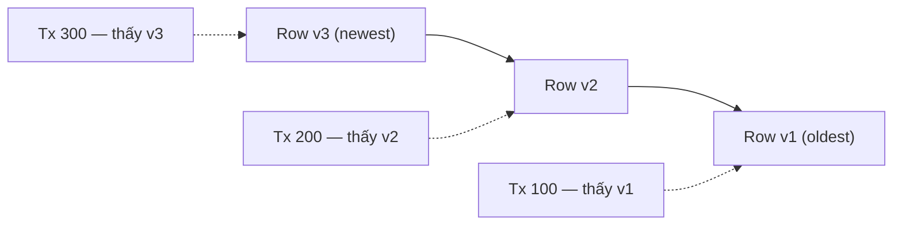

## Mục lục

- [MVCC là gì](#mvcc-là-gì)
- [Tại sao cần MVCC](#tại-sao-cần-mvcc)
  - [Vấn đề của Lock-based Concurrency](#vấn-đề-của-lock-based-concurrency)
  - [MVCC giải quyết thế nào](#mvcc-giải-quyết-thế-nào)
- [Cách MVCC hoạt động](#cách-mvcc-hoạt-động)
  - [Snapshot](#snapshot)
  - [Version Chain](#version-chain)
- [MVCC trong PostgreSQL](#mvcc-trong-postgresql)
  - [Cơ chế hoạt động](#cơ-chế-hoạt-động)
  - [Transaction Snapshot](#transaction-snapshot)
  - [Snapshot theo từng isolation level](#snapshot-theo-từng-isolation-level)
  - [REPEATABLE READ và SERIALIZABLE khác nhau thế nào](#repeatable-read-và-serializable-khác-nhau-thế-nào)
  - [Dead Tuples và VACUUM](#dead-tuples-và-vacuum)
  - [ASCII Diagram: Row Versioning trong Heap](#ascii-diagram-row-versioning-trong-heap)
- [MVCC trong MySQL InnoDB](#mvcc-trong-mysql-innodb)
  - [Cơ chế hoạt động](#cơ-chế-hoạt-động-1)
  - [Read View](#read-view)
  - [Purge Thread](#purge-thread)
- [MVCC trong Oracle](#mvcc-trong-oracle)
  - [Cơ chế hoạt động](#cơ-chế-hoạt-động-2)
  - [SCN — System Change Number](#scn--system-change-number)
  - [Automatic Undo Management](#automatic-undo-management)
- [So sánh chi tiết 3 Database](#so-sánh-chi-tiết-3-database)
  - [Bảng so sánh tổng quan](#bảng-so-sánh-tổng-quan)
  - [Tại sao PostgreSQL cần VACUUM mà MySQL/Oracle không cần?](#tại-sao-postgresql-cần-vacuum-mà-mysqloracle-không-cần)
  - [Ưu/nhược điểm chi tiết](#ưunhược-điểm-chi-tiết)
- [Ví dụ minh họa UPDATE trong cả 3 DB](#ví-dụ-minh-họa-update-trong-cả-3-db)
  - [PostgreSQL](#postgresql)
  - [MySQL InnoDB](#mysql-innodb)
  - [Oracle](#oracle)
- [Tổng kết xếp hạng theo tiêu chí](#tổng-kết-xếp-hạng-theo-tiêu-chí)
  - [Khi nào chọn DB nào?](#khi-nào-chọn-db-nào)
  - [Lưu ý quan trọng](#lưu-ý-quan-trọng)

---

## MVCC là gì

**MVCC** (Multi-Version Concurrency Control) là cơ chế kiểm soát đồng thời đa phiên bản, giúp các database như PostgreSQL, MySQL (InnoDB), Oracle xử lý nhiều transaction cùng lúc mà không bị khóa (lock) quá nhiều, vẫn đảm bảo tính nhất quán dữ liệu (consistency).

Ý tưởng cốt lõi: **tạo nhiều "phiên bản" của mỗi row** để mỗi transaction thấy một **snapshot riêng** của dữ liệu. Nhờ đó, **đọc không bị khóa ghi** và ngược lại.

## Tại sao cần MVCC

### Vấn đề của Lock-based Concurrency

Nếu chỉ dùng lock thuần túy (không có MVCC):

- Khi một transaction **đọc** dữ liệu đang bị transaction khác **sửa đổi** → phải **chờ** (block).
- Reader block writer, writer block reader → **throughput giảm mạnh**.
- Hệ thống concurrent cao sẽ trở nên **rất chậm** vì hầu hết thời gian dành cho việc chờ lock.

```
Không có MVCC:
┌──────────────┐     ┌──────────────┐
│ Transaction A│     │ Transaction B│
│  UPDATE row  │     │  SELECT row  │
│  (giữ X lock)│     │  ⏳ BLOCKED  │
│              │     │  chờ A xong  │
│  COMMIT      │     │  mới đọc được│
└──────────────┘     └──────────────┘

Có MVCC:
┌──────────────┐     ┌──────────────┐
│ Transaction A│     │ Transaction B│
│  UPDATE row  │     │  SELECT row  │
│  (tạo v2)    │     │  (đọc v1 cũ) │
│              │     │  ✅ không chờ│
│  COMMIT      │     │              │
└──────────────┘     └──────────────┘
```

### MVCC giải quyết thế nào

- Mỗi consistent read dùng một **snapshot** để có góc nhìn dữ liệu nhất quán. Snapshot tồn tại trong một statement hay cả transaction tùy isolation level.
- Khi ghi (UPDATE, DELETE) → database duy trì phiên bản cũ và mới của row theo cách phù hợp với storage engine.
- Các transaction khác vẫn đọc **bản cũ** → không bị chặn.
- Kết quả: **readers never block writers, writers never block readers**.

## Cách MVCC hoạt động

### Snapshot

**Snapshot không phải bản copy toàn bộ database.** “Chụp snapshot” chỉ là cách nói hình tượng cho việc database ghi lại một lượng metadata nhỏ về trạng thái transaction tại lúc bắt đầu một consistent read:

```text
Transaction nào đã hoàn thành?
Transaction nào vẫn đang chạy?
Transaction nào chưa xuất hiện tại thời điểm đó?
```

Snapshot không chứa bảng, row hay giá trị column. Database 1 TB cũng không tạo snapshot 1 TB. Khi query đọc một row version, database dùng metadata trong snapshot để quyết định row version đó có **visible** hay không.

**Visible** nghĩa là query hiện tại được phép sử dụng row version đó. Một version vẫn có thể tồn tại vật lý trên disk nhưng không visible với query hiện tại.

Ví dụ, transaction B đang sửa giá nhưng chưa commit:

```sql
-- Session B
BEGIN;
UPDATE products SET price = 200 WHERE id = 1;
-- Chưa COMMIT
```

PostgreSQL có thể đang giữ cả hai version:

```text
price = 100 → version cũ
price = 200 → version do transaction B vừa tạo
```

Nếu session A bắt đầu một `SELECT` lúc B chưa commit, snapshot của A ghi nhận rằng B vẫn đang chạy. Vì vậy:

```text
price = 100 → visible với A
price = 200 → không visible với A
```

Ngay cả khi B commit trong lúc câu `SELECT` của A đang chạy, A vẫn giữ cùng góc nhìn cho tới khi statement kết thúc. Nhờ đó, một query dài không đọc nửa bảng ở trạng thái cũ và nửa bảng ở trạng thái mới.

> [!IMPORTANT]
> Snapshot “chụp” **trạng thái transaction**, không chụp dữ liệu. Database chỉ đọc các page và row mà execution plan cần, rồi dùng snapshot như một bộ lọc visibility.

### Version Chain

Mỗi row có thể tồn tại **nhiều phiên bản** đồng thời. Database sử dụng thông tin transaction để quyết định phiên bản nào **visible** cho từng statement hoặc transaction.



## MVCC trong PostgreSQL

PostgreSQL sử dụng kiến trúc **heap-based versioning** — lưu tất cả phiên bản row **ngay trong table heap**.

### Cơ chế hoạt động

Mỗi row trong PostgreSQL có hai system column ẩn:

| Column | Ý nghĩa |
|--------|---------|
| **xmin** | Transaction ID đã **INSERT** row này |
| **xmax** | Transaction ID đã **DELETE/UPDATE** row này (0 nếu row còn sống) |

Khi **UPDATE** xảy ra:

1. Row cũ được đánh dấu `xmax = txid_current`.
2. Row mới được INSERT với `xmin = txid_current`, `xmax = 0`.
3. Cả hai version **đều nằm trong heap**.

### Transaction Snapshot

PostgreSQL dùng cùng tên `xmin` và `xmax` cho **row version** và **snapshot**, nhưng ý nghĩa của chúng khác nhau:

| Thuộc về | `xmin` | `xmax` |
|---|---|---|
| Row version | Transaction tạo version này | Transaction xóa hoặc thay thế version này |
| Snapshot | Transaction đang chạy nhỏ nhất | Ranh giới bắt đầu của các transaction “tương lai” |

Một snapshot PostgreSQL được đơn giản hóa thành:

- `snapshot.xmin`: transaction ID nhỏ nhất còn đang chạy.
- `snapshot.xmax`: transaction ID tiếp theo chưa được cấp tại thời điểm lấy snapshot.
- `xip_list`: danh sách transaction đang chạy tại thời điểm đó.

Ví dụ:

```text
Transaction 10: đang chạy
Transaction 11: đã commit
Transaction 12: đang chạy
Transaction 13: chưa bắt đầu

Snapshot:
snapshot.xmin = 10
snapshot.xmax = 13
xip_list      = [10, 12]
```

Có thể hình dung:

```text
        đã cũ                vùng đang xét              tương lai
          │                                               │
          ▼                                               ▼
... 8, 9  |  10, 11, 12  |  13, 14, 15 ...
             ↑   ↑   ↑
          active │ active
              committed
```

Ý nghĩa visibility của các transaction trong ví dụ:

| Transaction ID | Trạng thái lúc snapshot | Thay đổi visible? |
|---:|---|---|
| 9 | Đã commit từ trước | Có |
| 10 | Đang chạy | Không |
| 11 | Đã commit trước snapshot | Có |
| 12 | Đang chạy | Không |
| 13 trở lên | Chưa bắt đầu lúc snapshot được lấy | Không |

Khi kiểm tra một row version, hãy nhớ quy tắc đơn giản:

```text
Transaction tạo row đã visible
VÀ
Transaction xóa row chưa visible
→ row version visible
```

Ví dụ với snapshot trên:

```text
Row A: xmin=11, xmax=0
→ transaction 11 đã commit, chưa ai xóa
→ visible

Row B: xmin=12, xmax=0
→ transaction 12 đang chạy lúc lấy snapshot
→ không visible

Row C: xmin=9, xmax=10
→ transaction 10 đang xóa row nhưng chưa commit
→ việc xóa chưa visible, nên Row C vẫn visible

Row D: xmin=9, xmax=11
→ transaction 11 đã commit việc xóa trước snapshot
→ Row D không visible
```

Transaction luôn nhìn thấy thay đổi do **chính nó** thực hiện, ngay cả khi đang dùng một snapshot ổn định.

### Snapshot theo từng isolation level

Câu “mỗi transaction có một snapshot” chỉ là cách giải thích đơn giản. Trong PostgreSQL, thời điểm và phạm vi sử dụng snapshot phụ thuộc isolation level.

#### READ COMMITTED — mỗi statement một snapshot

`READ COMMITTED` là mức mặc định. Mỗi statement lấy một snapshot mới khi statement bắt đầu:

```sql
BEGIN;

SELECT price FROM products WHERE id = 1;
-- Snapshot A → 100

-- Transaction khác đổi price thành 200 và COMMIT

SELECT price FROM products WHERE id = 1;
-- Snapshot B mới → 200

COMMIT;
```

Một statement đang chạy không đổi snapshot giữa chừng. Nếu một `SELECT` chạy 10 giây và transaction khác commit ở giây thứ 5, câu `SELECT` đó vẫn dùng snapshot ban đầu cho đủ 10 giây. Statement tiếp theo mới lấy snapshot mới.

```text
Transaction
├── Statement 1 → Snapshot A, cố định trong statement 1
├── Statement 2 → Snapshot B, cố định trong statement 2
└── Statement 3 → Snapshot C, cố định trong statement 3
```

#### REPEATABLE READ — một snapshot ổn định

Ở `REPEATABLE READ`, transaction giữ một snapshot ổn định, thường từ statement đầu tiên cần snapshot:

```sql
BEGIN ISOLATION LEVEL REPEATABLE READ;

SELECT price FROM products WHERE id = 1;
-- Snapshot A → 100

-- Transaction khác đổi price thành 200 và COMMIT

SELECT price FROM products WHERE id = 1;
-- Vẫn Snapshot A → 100

COMMIT;
```

#### SERIALIZABLE — snapshot ổn định và kiểm tra xung đột

`SERIALIZABLE` cũng dùng góc nhìn ổn định, nhưng PostgreSQL còn theo dõi quan hệ đọc–ghi giữa các transaction. Nếu cho tất cả commit sẽ tạo ra kết quả không thể tương đương với bất kỳ thứ tự chạy lần lượt nào, PostgreSQL hủy một transaction và application phải retry.

| Isolation level | Cách dùng snapshot |
|---|---|
| `READ COMMITTED` | Mỗi statement lấy snapshot mới |
| `REPEATABLE READ` | Một snapshot ổn định cho transaction |
| `SERIALIZABLE` | Snapshot ổn định + phát hiện serialization anomaly |

### REPEATABLE READ và SERIALIZABLE khác nhau thế nào

Khác biệt chính không nằm ở việc snapshot có ổn định hay không. Cả hai đều cung cấp một góc nhìn ổn định. `SERIALIZABLE` kiểm tra thêm xem kết quả của các transaction chạy đồng thời có thể được giải thích như thể chúng đã chạy **lần lượt** hay không.

Xét bảng lịch trực:

```sql
CREATE TABLE doctors (
    name    TEXT PRIMARY KEY,
    on_call BOOLEAN NOT NULL
);

INSERT INTO doctors VALUES
    ('An', true),
    ('Binh', true);
```

Quy tắc nghiệp vụ: **luôn phải còn ít nhất một bác sĩ trực**. Một bác sĩ chỉ được nghỉ nếu đang có nhiều hơn một người trực.

#### Nếu chạy tuần tự

T1 chạy trước:

```text
T1 đếm 2 người trực → cho An nghỉ → COMMIT
T2 chạy sau, đếm 1 người trực → không cho Bình nghỉ
```

Kết quả hợp lệ là An nghỉ và Bình trực. Nếu đảo thứ tự, Bình nghỉ và An trực. Không có thứ tự tuần tự hợp lệ nào cho phép cả hai cùng nghỉ.

#### Với REPEATABLE READ

Hai transaction chạy đồng thời:

```sql
-- Session T1
BEGIN ISOLATION LEVEL REPEATABLE READ;
SELECT COUNT(*) FROM doctors WHERE on_call = true; -- 2
UPDATE doctors SET on_call = false WHERE name = 'An';

-- Session T2, bắt đầu trước khi T1 commit
BEGIN ISOLATION LEVEL REPEATABLE READ;
SELECT COUNT(*) FROM doctors WHERE on_call = true; -- 2
UPDATE doctors SET on_call = false WHERE name = 'Binh';
```

Cả hai snapshot đều thấy trạng thái ban đầu:

```text
Snapshot T1: An=true, Bình=true
Snapshot T2: An=true, Bình=true
```

T1 update row `An`, còn T2 update row `Binh`, nên không có xung đột ghi trực tiếp trên cùng một row. Cả hai có thể commit:

```text
An   = false
Bình = false
```

Mỗi transaction riêng lẻ đều nghĩ quyết định của mình hợp lệ, nhưng kết quả kết hợp vi phạm quy tắc. Hiện tượng này gọi là **write skew**.

#### Với SERIALIZABLE

Hai transaction vẫn có thể đọc cùng trạng thái ban đầu và thực hiện hai `UPDATE`. Tuy nhiên, PostgreSQL còn ghi nhận:

```text
T1 đã đọc Bình=true, nhưng T2 đang đổi Bình thành false.
T2 đã đọc An=true, nhưng T1 đang đổi An thành false.
```

Hai quan hệ đọc–ghi tạo thành một vòng xung đột. Nếu cả hai cùng commit, kết quả không tương đương với trường hợp T1 chạy trước T2 hoặc T2 chạy trước T1. PostgreSQL vì vậy hủy một transaction:

```text
T1 → COMMIT thành công
T2 → ERROR: could not serialize access due to
     read/write dependencies among transactions
```

Application retry T2. Lần chạy lại, T2 thấy chỉ còn Bình đang trực nên không cho Bình nghỉ.

```text
REPEATABLE READ
= mỗi transaction có góc nhìn ổn định,
  nhưng vẫn có thể xảy ra write skew.

SERIALIZABLE
= góc nhìn ổn định + theo dõi xung đột;
  abort một transaction nếu cần để kết quả giống chạy tuần tự.
```

> [!WARNING]
> Ứng dụng dùng `SERIALIZABLE` phải chuẩn bị retry toàn bộ transaction khi nhận lỗi serialization, thường có SQLSTATE `40001`.

### Dead Tuples và VACUUM

Vì row cũ nằm ngay trong heap → sau UPDATE/DELETE, row cũ trở thành **dead tuple** — chiếm không gian nhưng không ai nhìn thấy nữa.

Dead tuple tích lũy dẫn đến:

- **Table bloat**: table phình to dù dữ liệu thực tế ít.
- **Index bloat**: index trỏ đến dead tuple.
- **Query chậm**: sequential scan phải quét qua dead tuple.

**VACUUM** là cơ chế **bắt buộc** để dọn dẹp dead tuple:

- `VACUUM`: dọn dead tuple, cập nhật visibility map, **không trả disk về OS**.
- `VACUUM FULL`: rebuild table, **trả disk về OS** nhưng khóa bảng.
- `AUTOVACUUM`: PostgreSQL tự động chạy khi dead tuple vượt ngưỡng.

### ASCII Diagram: Row Versioning trong Heap

```
PostgreSQL Heap (Table File)
┌──────────────────────────────────────────────────┐
│  Page 0                                          │
│  ┌──────────────────────────────────────────┐    │
│  │ Row: id=1, name='Alice', salary=5000     │    │
│  │ xmin=100, xmax=105  ← DEAD (đã UPDATE)   │    │
│  ├──────────────────────────────────────────┤    │
│  │ Row: id=1, name='Alice', salary=6000     │    │
│  │ xmin=105, xmax=0    ← ALIVE (bản mới)    │    │
│  ├──────────────────────────────────────────┤    │
│  │ Row: id=2, name='Bob', salary=4000       │    │
│  │ xmin=101, xmax=0    ← ALIVE              │    │
│  └──────────────────────────────────────────┘    │
│                                                  │
│  → VACUUM sẽ dọn row id=1 có xmax=105            │
│  → Giải phóng slot cho row mới                   │
└──────────────────────────────────────────────────┘
```

## MVCC trong MySQL InnoDB

MySQL InnoDB sử dụng **Undo Log** để lưu trữ phiên bản cũ — table heap luôn chỉ chứa **bản mới nhất**.

### Cơ chế hoạt động

Khi **UPDATE** xảy ra:

1. Row hiện tại trong table được **ghi đè** bằng giá trị mới.
2. Giá trị cũ được sao chép vào **Undo Log** (rollback segment).
3. Row mới chứa pointer trỏ về Undo Log entry.

### Read View

Khi transaction cần đọc snapshot:

1. InnoDB tạo **Read View** chứa danh sách transaction đang active.
2. Nếu row hiện tại bị sửa bởi transaction chưa commit → InnoDB **đi ngược** qua Undo Log để tìm phiên bản visible.

```
MySQL InnoDB Architecture
┌─────────────────────────────┐
│  Table Heap                 │
│  ┌───────────────────────┐  │
│  │ id=1, salary=6000     │──┼──→ Undo Log
│  │ (bản mới nhất)        │  │    ┌─────────────────────┐
│  └───────────────────────┘  │    │ id=1, salary=5000   │
│  ┌───────────────────────┐  │    │(bản cũ, cho snapshot│
│  │ id=2, salary=4000     │  │    │  read hoặc rollback)│
│  │ (chưa bị sửa)         │  │    └─────────────────────┘
│  └───────────────────────┘  │
└─────────────────────────────┘
```

### Purge Thread

- Undo Log entry chỉ bị xóa khi **không còn transaction nào** cần đọc phiên bản cũ đó.
- **Purge thread** chạy nền, tự động dọn dẹp Undo Log → **không cần VACUUM**.
- Nếu có **long-running transaction** giữ snapshot lâu → Undo Log phình to, purge bị lag.

## MVCC trong Oracle

Oracle sử dụng **Undo Tablespace** — vùng lưu trữ chuyên biệt được tối ưu cho MVCC.

### Cơ chế hoạt động

- Khi UPDATE/DELETE, Oracle lưu **before-image** của row vào **Undo Tablespace**.
- Table heap chỉ chứa **bản hiện tại**.
- Mỗi thay đổi được gắn **SCN (System Change Number)** — con số tăng dần đại diện cho thời điểm logic.

### SCN — System Change Number

SCN là "đồng hồ logic" của Oracle:

- Mỗi commit tạo một SCN mới.
- Snapshot read sử dụng SCN để xác định dữ liệu nào visible.
- Cho phép **flashback query**: đọc dữ liệu tại bất kỳ SCN nào trong quá khứ (nếu undo còn).

```sql
-- Oracle: Flashback Query — đọc dữ liệu 1 giờ trước
SELECT * FROM employees
AS OF TIMESTAMP (SYSTIMESTAMP - INTERVAL '1' HOUR);
```

### Automatic Undo Management

Oracle tự động quản lý vùng Undo:

- **Undo Retention**: cấu hình thời gian tối thiểu giữ undo (ví dụ: 15 phút).
- Nếu undo bị ghi đè quá sớm → lỗi **ORA-01555: snapshot too old**.
- DBA tune bằng `UNDO_RETENTION` parameter và sizing Undo Tablespace.

```
Oracle Architecture
┌─────────────────────┐     ┌──────────────────────┐
│  Table Heap         │     │  Undo Tablespace     │
│  ┌───────────────┐  │     │  ┌────────────────┐  │
│  │ id=1          │  │     │  │ SCN 1000:      │  │
│  │ salary=6000   │──┼────→│  │ id=1           │  │
│  │ SCN: 1050     │  │     │  │ salary=5000    │  │
│  └───────────────┘  │     │  └────────────────┘  │
│                     │     │  Auto-managed by     │
│                     │     │  Undo Retention      │
└─────────────────────┘     └──────────────────────┘
```

## So sánh chi tiết 3 Database

### Bảng so sánh tổng quan

| Tiêu chí | PostgreSQL | MySQL InnoDB | Oracle |
|----------|-----------|-------------|--------|
| **Nơi lưu row cũ** | Heap (ngay trong table) | Undo Log | Undo Tablespace |
| **Table chứa nhiều phiên bản** | ✔ Có | ❌ Không | ❌ Không |
| **Cần VACUUM** | ✔ Có | ❌ Không | ❌ Không |
| **Cleanup mechanism** | VACUUM, VACUUM FULL | Purge thread, `OPTIMIZE TABLE` | Undo retention, segment shrink |
| **Version tracking** | xmin / xmax | Transaction ID + Undo pointer | SCN |
| **Rollback** | Nhanh (data cũ ngay trong heap) | Cần đọc Undo Log | Cần đọc Undo Tablespace |

### Tại sao PostgreSQL cần VACUUM mà MySQL/Oracle không cần?

**PostgreSQL** — kiến trúc storage dạng **append-only**:

- Row cũ vẫn nằm trong table → hình thành **dead tuples**.
- VACUUM là cơ chế **bắt buộc** để dọn dead tuples, giữ hiệu năng ổn định.

**MySQL/Oracle**:

- Table chỉ chứa **bản mới nhất**; row cũ nằm trong undo log / undo tablespace.
- **Purge thread** (MySQL) hoặc **undo retention** (Oracle) tự động loại bỏ phiên bản cũ.

### Ưu/nhược điểm chi tiết

#### PostgreSQL — Heap-based versioning

**Ưu điểm:**

- Concurrency mạnh, không cần lock row khi UPDATE.
- Rollback nhanh vì dữ liệu cũ nằm ngay trong heap.
- Crash recovery đơn giản (WAL xử lý).

**Nhược điểm:**

- Table/index bloat nếu VACUUM không theo kịp.
- UPDATE tốn I/O hơn do ghi phiên bản mới vào heap.

| Tác vụ | Hiệu năng |
|--------|-----------|
| SELECT song song | ⭐ Rất mạnh |
| UPDATE thường xuyên | ❗ Trung bình, dễ bloat |
| DELETE nhiều | ❗ Cần VACUUM liên tục |
| OLTP write-heavy | Không lý tưởng nếu VACUUM chậm |
| OLAP | Ổn nhưng có thể chậm nếu bloat |

#### MySQL InnoDB — Undo Log + Purge Thread

**Ưu điểm:**

- Table luôn sạch, không dead row.
- Không cần VACUUM, hạn chế bloat.
- UPDATE/DELETE hiệu quả hơn trong workload write-heavy.

**Nhược điểm:**

- Purge thread có thể bị lag nếu workload quá lớn.
- SELECT snapshot phải đọc undo log → đôi khi chậm.
- Transaction dài giữ snapshot lâu, undo khó purge.

| Tác vụ | Hiệu năng |
|--------|-----------|
| UPDATE/DELETE liên tục | ⭐ Mạnh |
| SELECT snapshot | Medium |
| High write OLTP | ⭐ Tốt |
| Long transactions | ❗ Dễ purge lag |
| Bảng TB-size | ⭐ Ổn định |

#### Oracle — Undo Tablespace tối ưu

**Ưu điểm:**

- MVCC ổn định nhất, undo được tối ưu riêng.
- SELECT snapshot rất nhanh, write-heavy workload ổn định.
- Không bloat table.

**Nhược điểm:**

- Cần quản trị undo retention kỹ, thiếu undo gây ORA-01555.
- Cấu trúc phức tạp, khó tune hơn MySQL.

| Tác vụ | Hiệu năng |
|--------|-----------|
| SELECT snapshot | ⭐⭐ Nhanh nhất |
| UPDATE/DELETE | ⭐⭐ Rất mạnh |
| High write workload | ⭐⭐ Ổn định |
| Long transactions | ⭐ Chịu tải tốt |
| OLAP + OLTP kết hợp | ⭐⭐ Phù hợp |

## Ví dụ minh họa UPDATE trong cả 3 DB

Giả sử ta thực hiện: `UPDATE employees SET salary = 6000 WHERE id = 1` (salary cũ = 5000).

### PostgreSQL

```
Heap TRƯỚC UPDATE:
┌────────────────────────────────────┐
│ id=1, salary=5000                  │
│ xmin=100, xmax=0   ← ALIVE         │
└────────────────────────────────────┘

Heap SAU UPDATE (transaction 105):
┌────────────────────────────────────┐
│ id=1, salary=5000                  │
│ xmin=100, xmax=105  ← DEAD         │
├────────────────────────────────────┤
│ id=1, salary=6000                  │
│ xmin=105, xmax=0    ← ALIVE        │
└────────────────────────────────────┘
→ Cả hai version nằm trong heap
→ VACUUM sẽ dọn row dead (xmax=105) sau khi không còn tx cần
```

### MySQL InnoDB

```
Table TRƯỚC UPDATE:
┌────────────────────────┐
│ id=1, salary=5000      │
└────────────────────────┘

Table SAU UPDATE:
┌────────────────────────┐     Undo Log:
│ id=1, salary=6000      │──→  ┌──────────────────────┐
│ (bản mới, in-place)    │     │ id=1, salary=5000    │
└────────────────────────┘     │(cho rollback/snapshot│
                               │ purge thread dọn sau)│
                               └──────────────────────┘
→ Table chỉ chứa bản mới nhất
→ Purge thread tự động dọn undo khi không cần
```

### Oracle

```
Table TRƯỚC UPDATE:
┌────────────────────────┐
│ id=1, salary=5000      │
│ SCN: 1000              │
└────────────────────────┘

Table SAU UPDATE:
┌────────────────────────┐     Undo Tablespace:
│ id=1, salary=6000      │──→  ┌──────────────────────┐
│ SCN: 1050              │     │ SCN 1000:            │
└────────────────────────┘     │ id=1, salary=5000    │
                               │ (giữ theo undo       │
                               │  retention period)   │
                               └──────────────────────┘
→ Table chỉ chứa bản hiện tại
→ Undo tự động quản lý theo retention
→ Nếu undo hết → ORA-01555
```

## Tổng kết xếp hạng theo tiêu chí

| Tiêu chí | Thứ hạng |
|----------|----------|
| Write-heavy OLTP | Oracle > MySQL > PostgreSQL |
| Read consistency | Oracle > PostgreSQL > MySQL |
| Clean-up / maintenance | MySQL = Oracle > PostgreSQL |
| Ít bloat nhất | Oracle |
| Hiệu năng ổn định dài hạn | Oracle |
| Chi phí / thân thiện | MySQL |
| MVCC đơn giản nhưng mạnh | PostgreSQL |

### Khi nào chọn DB nào?

| Scenario | Khuyến nghị |
|----------|------------|
| **Startup, chi phí thấp, cần JSON/extension** | PostgreSQL |
| **Web app, write-heavy, ecosystem lớn** | MySQL |
| **Enterprise, mission-critical, budget lớn** | Oracle |
| **Read-heavy analytics + OLTP** | PostgreSQL hoặc Oracle |
| **High-concurrency write + ổn định lâu dài** | Oracle > MySQL |

### Lưu ý quan trọng

- PostgreSQL cần **monitor và tune AUTOVACUUM** cẩn thận để tránh bloat.
- MySQL cần tránh **long-running transaction** gây purge lag.
- Oracle cần **sizing Undo Tablespace** đúng và cấu hình `UNDO_RETENTION` phù hợp.
- Cả ba đều implement MVCC nhưng với kiến trúc khác nhau — không có "tốt nhất tuyệt đối", chỉ có **phù hợp nhất** cho workload cụ thể.

---

> [!NOTE]
> **Đọc thêm:**
> - PostgreSQL VACUUM — cách xử lý dead tuple phát sinh từ MVCC: [PostgreSQL VACUUM](/docs/postgresql/vacuum)
> - InnoDB architecture (Undo Log, Purge Thread): [InnoDB](/docs/mysql/innodb)
> - So sánh MVCC giữa MySQL và PostgreSQL: [MySQL vs PostgreSQL](/docs/comparison/mysql-vs-postgresql)
