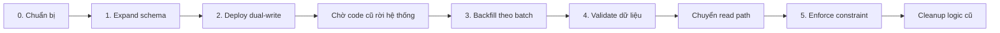

## Mục lục

- [Câu hỏi phỏng vấn](#1-câu-hỏi-phỏng-vấn)
- [Câu trả lời 30 giây](#2-câu-trả-lời-30-giây)
- [Trước khi trả lời: làm rõ 5 điều](#3-trước-khi-trả-lời-làm-rõ-5-điều)
- [Vì sao cách làm ngây thơ rất nguy hiểm?](#4-vì-sao-cách-làm-ngây-thơ-rất-nguy-hiểm)
- [Chiến lược tổng thể: Expand → Migrate → Contract](#5-chiến-lược-tổng-thể-expand--migrate--contract)
- [Giai đoạn 0: Chuẩn bị và đặt guardrail](#6-giai-đoạn-0-chuẩn-bị-và-đặt-guardrail)
- [Giai đoạn 1: Thêm column theo cách backward-compatible](#7-giai-đoạn-1-thêm-column-theo-cách-backward-compatible)
- [Giai đoạn 2: Deploy application và sửa mọi write path](#8-giai-đoạn-2-deploy-application-và-sửa-mọi-write-path)
- [Giai đoạn 3: Backfill dữ liệu lịch sử](#9-giai-đoạn-3-backfill-dữ-liệu-lịch-sử)
- [Giai đoạn 4: Validate và chuyển read path](#10-giai-đoạn-4-validate-và-chuyển-read-path)
- [Giai đoạn 5: Enforce constraint và cleanup](#11-giai-đoạn-5-enforce-constraint-và-cleanup)
- [Race condition thường gặp và cách xử lý](#12-race-condition-thường-gặp-và-cách-xử-lý)
- [Ví dụ end-to-end với PostgreSQL](#13-ví-dụ-end-to-end-với-postgresql)
- [Khác biệt giữa các database engine](#14-khác-biệt-giữa-các-database-engine)
- [Rollback và xử lý sự cố](#15-rollback-và-xử-lý-sự-cố)
- [Những câu hỏi đào sâu trong phỏng vấn](#16-những-câu-hỏi-đào-sâu-trong-phỏng-vấn)
- [Checklist triển khai production](#17-checklist-triển-khai-production)
- [Tóm tắt — Cheat sheet và nguyên tắc cần nhớ](#18-tóm-tắt--cheat-sheet-và-nguyên-tắc-cần-nhớ)
- [Tài liệu tham khảo](#tài-liệu-tham-khảo)

---

## 1. Câu hỏi phỏng vấn

> *"Một bảng có 300 triệu dòng và đang được đọc/ghi 24/7. Bạn cần thêm một column mới, điền dữ liệu cho toàn bộ dòng cũ, và cuối cùng column đó không được phép `NULL`. Không được tắt database và không chấp nhận downtime. Bạn sẽ triển khai như thế nào?"*

Đây không chỉ là câu hỏi về cú pháp `ALTER TABLE`. Interviewer đang kiểm tra liệu bạn có hiểu:

- Schema migration trên hệ thống đang phục vụ traffic thật.
- Lock và metadata lock.
- Transaction log, WAL/redo log và replication lag.
- Backward compatibility giữa nhiều phiên bản application.
- Cách backfill hàng trăm triệu dòng mà không làm nghẽn database.
- Race condition giữa live traffic và background job.
- Validation, rollback và observability.

> [!IMPORTANT]
> Câu trả lời tốt không phải là một câu SQL thông minh. Câu trả lời tốt là một **quy trình migration nhiều giai đoạn**, trong đó mỗi bước đều nhỏ, quan sát được, dừng được, chạy lại được và rollback được.

---

## 2. Câu trả lời 30 giây

> Tôi sẽ dùng pattern **expand-and-contract** thay vì thay đổi mọi thứ trong một lần.
>
> 1. Xác nhận database engine/version và kiểm tra loại DDL có được hỗ trợ online hay không.
> 2. Thêm column ở trạng thái `NULL`, chưa có constraint hoặc default phức tạp; đặt lock timeout để DDL fail nhanh thay vì chờ và chặn traffic.
> 3. Deploy application backward-compatible để mọi `INSERT` và `UPDATE` liên quan đều ghi column mới. Chờ toàn bộ instance cũ rời khỏi hệ thống.
> 4. Chạy background job backfill dữ liệu cũ theo primary-key range hoặc keyset, transaction nhỏ, idempotent và có adaptive throttling.
> 5. Validate không còn dữ liệu thiếu hoặc sai, rồi chuyển read path sang column mới bằng feature flag.
> 6. Chỉ sau đó mới thêm `NOT NULL`, default/index nếu cần, rồi cleanup logic cũ ở một release riêng.
>
> Trong toàn bộ quá trình, tôi theo dõi latency, lock wait, CPU/I/O, WAL/redo log, replication lag và error rate. Nếu hệ thống chịu tải kém, backfill phải có khả năng pause ngay lập tức.

Đó là câu trả lời đủ tốt cho vòng đầu. Các phần dưới đây giải thích vì sao từng bước cần thiết.

---

## 3. Trước khi trả lời: làm rõ 5 điều

Một senior engineer không nên chạy thẳng vào giải pháp khi chưa biết column mới có ý nghĩa gì. Hãy hỏi ngắn gọn các câu sau.

### 3.1. Database engine và version là gì?

PostgreSQL, MySQL/InnoDB, SQL Server và Oracle có hành vi DDL khác nhau. Ngay trong cùng một engine, version khác nhau có thể quyết định:

- `ADD COLUMN` là metadata-only, instant hay phải rebuild table.
- DDL cần loại lock nào.
- Có hỗ trợ online index build hay không.
- Có thể validate constraint riêng hay không.
- Cách kiểm soát lock timeout và statement timeout.

> [!IMPORTANT]
> Không nên nói: *"Mọi modern database đều thêm column trong vài millisecond."* Câu đúng hơn là: *"Trong nhiều engine/version, thêm nullable column không có default có thể là metadata-only, nhưng vẫn cần metadata/schema lock ngắn và phải xác minh trên engine cụ thể."*

### 3.2. Column mới thuộc loại nào?

| Loại column | Ví dụ | Có cần backfill? | Độ khó |
|---|---|---:|---:|
| Optional | `nickname` | Không nhất thiết | Thấp |
| Có constant default | `status = 'active'` | Tùy semantics/engine | Thấp–trung bình |
| Dẫn xuất từ dữ liệu cũ | `email_normalized = lower(email)` | Có | Trung bình |
| Tổng hợp từ nhiều bảng | `lifetime_value` | Có | Cao |
| Lấy từ external system | `risk_score` | Có pipeline riêng | Rất cao |
| Phải unique | `external_id` | Có thêm bài toán duplicate/index | Cao |

Doc này dùng ví dụ xuyên suốt:

```sql
users(
    id bigint primary key,
    email varchar(320),
    email_normalized varchar(320) -- column mới
)
```

Giá trị mới được tính bằng `lower(email)`.

### 3.3. Column có bắt buộc `NOT NULL` ngay lập tức không?

Trong zero-downtime migration, câu trả lời thường là **không**. Ta thêm column nullable trước, điền dữ liệu, validate, rồi mới enforce `NOT NULL` ở giai đoạn cuối.

Nếu business yêu cầu mọi dữ liệu mới phải có giá trị ngay từ đầu, application mới có thể enforce điều đó trong write path trước khi database constraint được thêm.

### 3.4. Có bao nhiêu nơi đang ghi vào bảng?

Đừng chỉ nghĩ đến API chính. Cần inventory toàn bộ writer:

- API service.
- Background worker.
- Scheduled job.
- Event consumer.
- Admin tool.
- ETL/import pipeline.
- Stored procedure hoặc trigger.
- Service cũ vẫn dùng chung database.
- Script vận hành chạy thủ công.

Chỉ cần bỏ sót một writer, các dòng `NULL` mới vẫn tiếp tục xuất hiện sau khi backfill.

### 3.5. SLO và giới hạn tài nguyên là gì?

Cần biết ít nhất:

- P95/P99 latency tối đa cho phép.
- Replication lag tối đa.
- Mức CPU/I/O an toàn.
- Khung giờ traffic thấp.
- Thời gian migration có thể kéo dài bao lâu.
- Khả năng dừng/resume job.

300 triệu dòng không bắt buộc phải backfill trong vài giờ. Nếu không có deadline business, chạy chậm trong vài ngày thường an toàn hơn chạy nhanh và gây incident.

---

## 4. Vì sao cách làm ngây thơ rất nguy hiểm?

Cách dễ nghĩ nhất là:

```sql
ALTER TABLE users
ADD COLUMN email_normalized varchar(320) NOT NULL DEFAULT '';

UPDATE users
SET email_normalized = lower(email);
```

Hoặc chạy toàn bộ `UPDATE` trong một transaction duy nhất:

```sql
BEGIN;

UPDATE users
SET email_normalized = lower(email)
WHERE email_normalized IS NULL;

COMMIT;
```

Với 300 triệu dòng, đây là một blast radius rất lớn.

### 4.1. Row lock tồn tại quá lâu

`UPDATE` thường khóa từng row bị thay đổi cho đến khi transaction commit hoặc rollback. Live traffic muốn cập nhật cùng các row đó có thể phải chờ.

Không phải mọi câu `SELECT` đều bị chặn trong database dùng MVCC, nhưng write/write contention vẫn xảy ra, và query đọc có thể chịu hậu quả gián tiếp từ I/O, bloat, cache eviction hoặc replica lag.

### 4.2. Transaction log/WAL/redo log tăng mạnh

Mỗi row update tạo log phục vụ recovery và replication. Update 300 triệu row có thể:

- Làm đầy disk chứa WAL/transaction log.
- Tăng network traffic tới replica.
- Khiến replica lag từ vài giây thành hàng giờ.
- Làm CDC connector và downstream consumer bị tụt lại.

### 4.3. I/O và cache bị migration chiếm dụng

Backfill lớn đọc và ghi lượng page khổng lồ. Nó có thể đẩy hot pages của traffic thật khỏi buffer pool, làm query bình thường chậm dù không chờ lock.

### 4.4. MVCC bloat và maintenance debt

Trên PostgreSQL, update tạo row version mới và để lại dead tuple. Một migration lớn có thể:

- Làm table/index phình nhanh.
- Tăng áp lực autovacuum.
- Tăng thời gian scan.
- Tốn thêm disk tạm thời đáng kể.

### 4.5. Rollback cực kỳ đắt

Nếu transaction khổng lồ thất bại ở 90%, database không đơn giản "quên" nó ngay lập tức. Quá trình rollback/recovery cũng có thể tiêu tốn nhiều thời gian và I/O.

### 4.6. DDL có thể chờ lock và tạo hàng đợi phía sau

Ngay cả một metadata-only `ALTER TABLE` vẫn có thể cần schema/metadata lock. Tình huống nguy hiểm:

```diagram
Transaction dài đang giữ lock
          │
          ▼
ALTER TABLE chờ schema lock
          │
          ▼
Các query mới xếp hàng phía sau ALTER TABLE
          │
          ▼
Latency tăng, connection pool cạn, incident lan rộng
```

Đó là lý do migration phải có `lock_timeout` ngắn: nếu không lấy được lock nhanh, nó nên **fail và retry sau**, không được chờ vô hạn.

> [!WARNING]
> "DDL chạy nhanh" và "DDL không gây downtime" là hai khái niệm khác nhau. Một câu lệnh chỉ mất 20ms sau khi lấy được lock vẫn có thể đã chờ lock 10 phút và làm traffic phía sau xếp hàng.

---

## 5. Chiến lược tổng thể: Expand → Migrate → Contract



### Expand

Mở rộng schema theo cách code cũ vẫn hoạt động:

- Thêm nullable column.
- Chưa xóa hoặc đổi tên column cũ.
- Chưa áp constraint khiến code cũ lỗi.

### Migrate

Di chuyển application và data dần dần:

- Code mới ghi cả representation cũ và mới.
- Backfill historical rows.
- Validate correctness.
- Chuyển read path bằng feature flag.

### Contract

Chỉ thu hẹp schema khi không còn dependency cũ:

- Enforce `NOT NULL`/constraint.
- Xóa fallback hoặc dual-write không còn cần thiết.
- Drop column/index cũ ở release sau nếu có.

> [!IMPORTANT]
> Mỗi mũi tên trong flow trên nên là một deployment hoặc operational step độc lập. Đừng gộp `ADD COLUMN`, deploy code, backfill, `SET NOT NULL` và cleanup vào cùng một release.

---

## 6. Giai đoạn 0: Chuẩn bị và đặt guardrail

Mục tiêu của giai đoạn này là biết cách nhận ra migration đang gây hại và có nút dừng trước khi chạy bất cứ thứ gì.

### 6.1. Kiểm tra hành vi DDL trên đúng engine/version

Không thử nghiệm với bảng 1.000 dòng rồi suy luận cho production. Cần:

- Đọc official documentation của đúng version.
- Test trên staging có schema và kích thước gần production.
- Nếu có thể, clone/anonymize snapshot production.
- Quan sát loại lock bằng công cụ của engine.
- Đo thời gian chờ lock riêng với thời gian thực thi.

### 6.2. Kiểm tra transaction dài

DDL thường khó lấy metadata lock nếu có transaction mở lâu. Trước migration cần tìm:

- Session `idle in transaction`.
- Query/report chạy nhiều phút.
- Batch job chưa commit.
- Transaction từ application bị treo.

Không tự động kill session production nếu chưa hiểu hậu quả. Nhưng phải biết session nào có thể cản DDL.

### 6.3. Đặt ngưỡng pause/abort

Ví dụ guardrail ban đầu:

| Metric | Ngưỡng ví dụ | Hành động |
|---|---:|---|
| P99 write latency | Tăng > 20% trong 5 phút | Pause backfill |
| Database CPU | > 75% | Giảm batch/rate |
| Replica lag | > 30 giây | Pause ngay |
| Disk/WAL usage | Chạm 70–80% | Pause và điều tra |
| Lock wait | Tăng bất thường | Pause; giảm transaction |
| Application error rate | Vượt SLO | Stop migration |

Con số thực tế phải dựa trên baseline của hệ thống. Không copy máy móc các ngưỡng trên.

### 6.4. Chuẩn bị kill switch và checkpoint

Background job phải hỗ trợ:

- `pause` mà không mất tiến độ.
- `resume` từ checkpoint.
- Stop an toàn giữa hai batch.
- Điều chỉnh batch size/rate khi đang chạy.
- Chạy lại mà không làm sai dữ liệu.

Nếu cách duy nhất để dừng backfill là kill process và đoán xem nó đã chạy đến đâu, thiết kế chưa đạt yêu cầu production.

---

## 7. Giai đoạn 1: Thêm column theo cách backward-compatible

### 7.1. Trạng thái schema mong muốn

```sql
ALTER TABLE users
ADD COLUMN email_normalized varchar(320) NULL;
```

Đặc điểm:

- Nullable.
- Không có volatile default.
- Chưa có `NOT NULL`.
- Chưa tạo index theo cách blocking.
- Code cũ không truyền column này vẫn insert/update được.

Trong nhiều database engine hiện đại, thao tác trên có thể chỉ thay đổi metadata và không rewrite 300 triệu row. Nhưng nó vẫn có thể cần lock ngắn.

### 7.2. PostgreSQL: fail nhanh nếu không lấy được lock

```sql
BEGIN;

SET LOCAL lock_timeout = '2s';
SET LOCAL statement_timeout = '10s';

ALTER TABLE users
ADD COLUMN email_normalized varchar(320);

COMMIT;
```

Nếu không lấy được lock trong 2 giây, migration thất bại và có thể retry ở thời điểm khác. Đây thường là hành vi tốt hơn chờ vô hạn.

> [!NOTE]
> Timeout chỉ là ví dụ. Chọn giá trị phù hợp với SLO và migration tooling. Trước khi retry phải đảm bảo transaction trước đã rollback sạch.

### 7.3. Vì sao không thêm `NOT NULL` ngay?

300 triệu row cũ chưa có giá trị. Nếu thêm `NOT NULL` ngay:

- DDL có thể fail vì dữ liệu cũ là `NULL`.
- Database có thể phải scan toàn bảng để xác minh constraint.
- Code cũ trong rolling deployment có thể tiếp tục insert row không có column mới.

Nullable là trạng thái tương thích tạm thời, không nhất thiết là trạng thái cuối.

### 7.4. Có thực sự phải bỏ default không?

Cần phân biệt:

- **Constant default** như `false`, `0`, `'pending'`: một số engine/version có optimization metadata-only.
- **Volatile default** như thời gian hiện tại hoặc function thay đổi theo từng row: có thể buộc rewrite/evaluate toàn bảng.
- **Giá trị dẫn xuất** như `lower(email)`: không phải constant default và cần backfill logic riêng.

Trong phỏng vấn, lựa chọn an toàn mang tính portable là: thêm nullable column không default, rồi tách backfill. Trong thực tế, hãy tận dụng instant/default optimization nếu official docs của đúng engine/version xác nhận và semantics phù hợp.

---

## 8. Giai đoạn 2: Deploy application và sửa mọi write path

Thêm column chỉ giải quyết schema. Tiếp theo phải ngăn backlog tiếp tục tăng.

### 8.1. Dual-write cho cả INSERT và UPDATE

Pseudo-code:

```typescript
function normalizeEmail(email: string): string {
  return email.trim().toLowerCase();
}

async function createUser(input: CreateUserInput) {
  const normalized = normalizeEmail(input.email);

  await db.query(
    `INSERT INTO users (email, email_normalized)
     VALUES ($1, $2)`,
    [input.email, normalized],
  );
}

async function changeEmail(userId: number, newEmail: string) {
  const normalized = normalizeEmail(newEmail);

  await db.query(
    `UPDATE users
        SET email = $1,
            email_normalized = $2
      WHERE id = $3`,
    [newEmail, normalized, userId],
  );
}
```

Hai giá trị phải được ghi trong **cùng transaction** để không xuất hiện trạng thái `email` mới nhưng `email_normalized` cũ.

### 8.2. Vì sao chỉ sửa INSERT là chưa đủ?

Nếu `email` có thể thay đổi, row cũ đã backfill vẫn có thể trở nên sai:

```diagram
Backfill hoàn tất:
email = Alice@Example.com
email_normalized = alice@example.com

Code cũ UPDATE email:
email = Bob@Example.com
email_normalized = alice@example.com   ← dữ liệu lệch
```

Do đó phải cập nhật mọi write path làm thay đổi nguồn dữ liệu, không chỉ lúc tạo row mới.

### 8.3. Rolling deployment tạo ra giai đoạn mixed-version

Trong vài phút hoặc vài giờ:

```diagram
Load Balancer
   ├── App v1: chỉ ghi email
   ├── App v1: chỉ ghi email
   ├── App v2: ghi email + email_normalized
   └── App v2: ghi email + email_normalized
```

Column phải tiếp tục nullable để App v1 không lỗi. Chỉ bắt đầu coi backlog là hữu hạn sau khi:

- Tất cả App v1 đã bị loại khỏi traffic.
- Worker/consumer cũ đã restart hoặc drain.
- Scheduled job cũ đã được cập nhật.
- Không còn script hay service nào ghi schema cũ.

> [!WARNING]
> "Code mới đã deploy" không đồng nghĩa "mọi writer đều đang chạy code mới". Phải xác minh rollout hoàn tất trên toàn bộ fleet.

### 8.4. Read path nên làm gì trong giai đoạn này?

Hai lựa chọn an toàn:

**Lựa chọn A — tiếp tục đọc column cũ:**

- Đơn giản nhất.
- Không phụ thuộc backfill.
- Chỉ switch sau validation.

**Lựa chọn B — đọc mới với fallback:**

```sql
SELECT COALESCE(email_normalized, lower(email)) AS email_for_search
FROM users
WHERE id = $1;
```

Fallback giúp rollout sớm nhưng có tradeoff:

- Tăng logic tạm thời.
- Expression trong filter có thể không dùng index như mong muốn.
- Hai implementation normalize ở app/database có thể khác semantics.

Mặc định nên tiếp tục đọc representation cũ cho đến khi backfill và validation hoàn tất.

### 8.5. Trigger có thay được dual-write trong application không?

Có thể dùng trigger như lớp tương thích tạm thời nếu có quá nhiều writer khó cập nhật đồng thời:

```sql
-- Chỉ mang tính minh họa; syntax phụ thuộc database.
BEFORE INSERT OR UPDATE OF email ON users
SET NEW.email_normalized = lower(NEW.email);
```

Tradeoff:

| Application dual-write | Database trigger |
|---|---|
| Logic rõ trong code | Bao phủ nhiều writer tự động |
| Dễ test cùng business logic | Logic ẩn trong database |
| Phải sửa mọi service | Tăng tải trên database |
| Dễ version/control theo app | Deploy/rollback phức tạp hơn |

Trigger không mặc định tốt hơn. Nó phù hợp khi database có nhiều writer không thể nâng cấp cùng lúc, nhưng phải đo overhead và có kế hoạch gỡ bỏ rõ ràng.

---

## 9. Giai đoạn 3: Backfill dữ liệu lịch sử

Khi mọi write path mới đã ổn định, các row `NULL` còn lại trở thành một backlog hữu hạn. Bây giờ mới backfill.

### 9.1. Bốn thuộc tính bắt buộc của backfill job

Backfill phải:

1. **Batched** — transaction nhỏ.
2. **Idempotent** — chạy lại không làm sai dữ liệu.
3. **Resumable** — có checkpoint.
4. **Throttled** — nhường tài nguyên cho live traffic.

### 9.2. Không dùng OFFSET để duyệt 300 triệu row

Cách không nên dùng:

```sql
SELECT id
FROM users
ORDER BY id
LIMIT 1000 OFFSET 200000000;
```

Database vẫn phải đi qua lượng lớn entry trước offset. Càng về cuối càng chậm.

Dùng primary-key range hoặc keyset:

```sql
SELECT id
FROM users
WHERE id > :last_seen_id
ORDER BY id
LIMIT :batch_size;
```

Sau batch, lưu `MAX(id)` làm checkpoint cho lần kế tiếp.

### 9.3. Update có điều kiện để job idempotent

```sql
UPDATE users
SET email_normalized = lower(email)
WHERE id >= :range_start
  AND id < :range_end
  AND email_normalized IS NULL;
```

Điều kiện `email_normalized IS NULL` rất quan trọng:

- Chạy lại batch không gây thay đổi thêm.
- Không ghi đè giá trị mà application mới vừa ghi.
- Giảm số row update và lượng log sinh ra.

Nếu business cho phép `NULL` là giá trị hợp lệ, cần một migration marker riêng thay vì dùng `NULL` làm trạng thái "chưa xử lý".

### 9.4. Batch size không có con số thần kỳ

"Mỗi batch vài nghìn row" chỉ là điểm khởi đầu, không phải quy luật. Batch phù hợp phụ thuộc:

- Kích thước row và index.
- Số index phải update.
- Latency của storage.
- Replication topology.
- Mức traffic hiện tại.
- Tốc độ autovacuum/garbage collection.

Chiến lược thực tế:

```diagram
Bắt đầu 500 row/batch
        │
        ▼
Đo latency + CPU + I/O + replica lag
        │
   ┌────┴────┐
   │         │
Tải thấp   Tải cao
   │         │
Tăng nhẹ   Giảm batch / sleep / pause
   │         │
   └────┬────┘
        ▼
Lặp lại
```

Adaptive throttling tốt hơn hard-code `sleep(100ms)` vì tải production thay đổi theo thời gian.

### 9.5. Commit sau mỗi batch

Pseudo-code cho worker:

```typescript
let cursor = await loadCheckpoint("users.email_normalized");
let batchSize = 1000;

while (true) {
  if (await shouldPauseMigration()) {
    await sleep(5000);
    continue;
  }

  const ids = await db.query<number>(
    `SELECT id
       FROM users
      WHERE id > $1
      ORDER BY id
      LIMIT $2`,
    [cursor, batchSize],
  );

  if (ids.length === 0) break;

  await db.transaction(async (tx) => {
    await tx.query(
      `UPDATE users
          SET email_normalized = lower(email)
        WHERE id = ANY($1)
          AND email_normalized IS NULL`,
      [ids],
    );
  });

  cursor = ids[ids.length - 1];
  await saveCheckpoint("users.email_normalized", cursor);

  batchSize = await adjustBatchSizeFromMetrics(batchSize);
}
```

Ý tưởng quan trọng hơn syntax:

- Chọn một batch nhỏ theo keyset.
- Update có điều kiện.
- Commit.
- Lưu checkpoint.
- Đo tải.
- Mới chạy batch tiếp theo.

> [!NOTE]
> Cần thiết kế checkpoint cẩn thận nếu process có thể crash giữa `COMMIT` database và `saveCheckpoint`. Vì update idempotent, chạy lại batch trước vẫn an toàn. Có thể lưu checkpoint trong cùng database/transaction nếu cần guarantee mạnh hơn.

### 9.6. Một worker hay nhiều worker?

Bắt đầu bằng **một worker**. Nhiều worker chỉ cần khi một worker không đạt deadline và database còn dư capacity.

Nếu chạy song song:

- Chia non-overlapping primary-key ranges.
- Hoặc dùng cơ chế claim job/range.
- Tránh các worker tranh cùng row.
- Mỗi worker vẫn phải có rate limit.
- Tổng throughput phải bị giới hạn ở cấp toàn hệ thống.

`FOR UPDATE SKIP LOCKED` có thể giúp worker tránh nhau trong một số engine, nhưng không thay thế partitioning/checkpoint tốt và có thể bỏ qua row đang lock; cần final sweep để xử lý lại.

### 9.7. Những metric cần theo dõi trong suốt backfill

| Nhóm | Metric |
|---|---|
| Application | P50/P95/P99 latency, error rate, timeout |
| Database | CPU, IOPS, throughput, buffer/cache hit rate |
| Lock | Lock wait count/time, deadlock, blocked sessions |
| Log | WAL/redo generation rate, disk usage |
| Replication | Replica lag theo time và byte |
| Maintenance | Dead tuples/bloat, autovacuum pressure |
| Pool | Active/idle/waiting connections |
| Migration | Rows/s, batch latency, retry rate, ETA |

Migration throughput không phải metric ưu tiên cao nhất. Ưu tiên số một là live traffic vẫn nằm trong SLO.

### 9.8. Tạo index khi nào?

Nếu column mới cần index, thường nên:

1. Backfill dữ liệu trước.
2. Build index bằng cơ chế online/concurrent của engine.
3. Validate index.
4. Mới chuyển query sang dùng column/index mới.

Ví dụ PostgreSQL:

```sql
CREATE INDEX CONCURRENTLY idx_users_email_normalized
ON users (email_normalized);
```

Không chạy `CREATE INDEX CONCURRENTLY` bên trong transaction block. Nếu build thất bại, PostgreSQL có thể để lại invalid index; phải kiểm tra và cleanup trước khi retry.

Một số migration cần index sớm để phục vụ dual-read hoặc validation. Khi đó vẫn phải dùng online index build và đo tác động I/O.

---

## 10. Giai đoạn 4: Validate và chuyển read path

Backfill job báo "done" không đủ để kết luận dữ liệu đúng.

### 10.1. Validate completeness

Câu hỏi đầu tiên: còn row nào chưa có giá trị không?

```sql
SELECT 1
FROM users
WHERE email_normalized IS NULL
LIMIT 1;
```

Nếu không có index phù hợp và không còn `NULL`, database có thể phải scan rất nhiều dữ liệu để chứng minh kết quả rỗng. Đây là chi phí validation cần lên lịch và quan sát, không nên chạy lặp liên tục mỗi vài giây.

Có thể validate theo range/partition:

```sql
SELECT COUNT(*) AS missing_rows
FROM users
WHERE id >= :range_start
  AND id < :range_end
  AND email_normalized IS NULL;
```

### 10.2. Validate correctness

Không `NULL` chưa có nghĩa là đúng:

```sql
SELECT id, email, email_normalized
FROM users
WHERE email_normalized IS DISTINCT FROM lower(email)
LIMIT 100;
```

Tùy engine, dùng toán tử null-safe tương ứng. Với dữ liệu cực lớn:

- Validate theo từng range.
- Random sample.
- So sánh checksum/aggregate phù hợp.
- Ghi nhận số mismatch.
- Điều tra trước khi tiếp tục.

### 10.3. Final sweep

Sau lần quét chính, chạy thêm một hoặc nhiều final sweep:

- Tìm `NULL` bị bỏ qua do lock/retry.
- Tìm row do writer cũ còn sót.
- Sửa mismatch có thể tự động sửa an toàn.
- Xác minh tốc độ phát sinh `NULL` mới bằng 0.

Nếu `NULL` mới vẫn xuất hiện, đừng tăng tốc backfill. Hãy tìm writer bị bỏ sót.

### 10.4. Chuyển read path bằng feature flag

Flow an toàn:

```diagram
0% đọc column mới
      │
      ▼
Canary 1% instance / request
      │
      ▼
10% → quan sát error, latency, business metric
      │
      ▼
50%
      │
      ▼
100%
      │
      ▼
Giữ fallback trong một khoảng ổn định
```

Feature flag giúp rollback read path mà không cần rollback schema hoặc backfill.

### 10.5. So sánh shadow read nếu dữ liệu quan trọng

Trong thời gian canary, application có thể đọc cả hai representation nhưng chỉ trả một kết quả cho user:

```typescript
const oldValue = normalizeEmail(row.email);
const newValue = row.emailNormalized;

if (oldValue !== newValue) {
  metrics.increment("email_normalized_mismatch");
}

return oldValue; // vẫn phục vụ bằng path cũ trong giai đoạn shadow
```

Shadow read giúp phát hiện lỗi semantics trước khi column mới trở thành source of truth.

---

## 11. Giai đoạn 5: Enforce constraint và cleanup

Chỉ vào giai đoạn này khi:

- Mọi writer đã ghi column mới.
- Backfill hoàn tất.
- Validation không còn `NULL`/mismatch.
- Read path mới đã ổn định.
- Rollback plan đã được duyệt.

### 11.1. Thêm `NOT NULL` có thể vẫn scan toàn bảng

Câu lệnh đơn giản:

```sql
ALTER TABLE users
ALTER COLUMN email_normalized SET NOT NULL;
```

Database có thể phải scan toàn bộ 300 triệu row để chứng minh không có `NULL`, đồng thời cần lock ở mức nào đó. Không được giả định bước này miễn phí.

### 11.2. PostgreSQL: validate constraint theo hai bước

Một pattern phổ biến:

```sql
-- Bước A: thêm CHECK nhưng chưa scan dữ liệu cũ ngay lúc ADD
ALTER TABLE users
ADD CONSTRAINT users_email_normalized_nn
CHECK (email_normalized IS NOT NULL) NOT VALID;

-- Bước B: validate riêng; vẫn tốn scan/I/O nhưng lock ít cản trở hơn
ALTER TABLE users
VALIDATE CONSTRAINT users_email_normalized_nn;

-- Bước C: chuyển thành thuộc tính NOT NULL.
-- PostgreSQL có thể dùng CHECK hợp lệ để tránh scan lại toàn bảng.
ALTER TABLE users
ALTER COLUMN email_normalized SET NOT NULL;

-- Bước D: xóa CHECK tạm nếu không còn cần
ALTER TABLE users
DROP CONSTRAINT users_email_normalized_nn;
```

Mỗi bước DDL vẫn nên có lock timeout, monitoring và retry plan. Kiểm tra behavior theo đúng PostgreSQL version đang dùng.

### 11.3. Có cần database default không?

Nếu application luôn truyền giá trị, default có thể không cần thiết. Chỉ thêm default nếu nó có business meaning rõ ràng.

```sql
ALTER TABLE users
ALTER COLUMN some_flag SET DEFAULT false;
```

Default chỉ ảnh hưởng các write tương lai; nó không tự sửa historical rows đã tồn tại.

### 11.4. Cleanup phải là release riêng

Sau một khoảng soak time:

- Xóa read fallback.
- Xóa metrics/shadow comparison tạm.
- Xóa trigger tạm nếu có.
- Dừng backfill worker.
- Xóa dual-write cũ nếu migration thay thế representation cũ.
- Drop column/index cũ chỉ khi chắc chắn không còn consumer.

> [!WARNING]
> Drop column cũ là bước làm rollback trở nên khó hoặc không thể. Đừng cleanup ngay sau khi switch read. Giữ một khoảng ổn định đủ dài theo risk của hệ thống.

---

## 12. Race condition thường gặp và cách xử lý

### 12.1. Backfill ghi đè dữ liệu mới

Tình huống:

```diagram
T1: Backfill đọc email cũ
T2: User đổi email; app ghi email + email_normalized mới
T3: Backfill ghi email_normalized tính từ email cũ
```

Kết quả column mới bị stale.

Giảm rủi ro bằng:

- Application cập nhật source và destination trong cùng transaction.
- Backfill tính từ giá trị source hiện tại trong database.
- Backfill chỉ update khi destination vẫn `NULL`.
- Không đọc dữ liệu ra ngoài, xử lý lâu rồi update mù không có condition/version check.

```sql
UPDATE users
SET email_normalized = lower(email)
WHERE id = :id
  AND email_normalized IS NULL;
```

Row lock/MVCC của database sẽ serialize các update cạnh tranh; điều kiện được dùng để tránh ghi đè destination đã được writer mới điền.

### 12.2. Writer cũ tiếp tục tạo `NULL`

Dấu hiệu: backfill đã đi qua high watermark nhưng số `NULL` vẫn tăng.

Nguyên nhân thường là:

- Worker cũ chưa restart.
- Cron job dùng image/version cũ.
- Admin script không qua application layer.
- Service khác cùng ghi database.

Giải pháp là sửa writer, không phải tăng số worker backfill.

### 12.3. Hai implementation normalize khác nhau

Ví dụ application dùng Unicode-aware lowercase nhưng database `lower()` phụ thuộc collation khác. Dữ liệu mới và historical data có thể khác nhau.

Cần định nghĩa một canonical transformation:

- Cùng algorithm/version.
- Cùng whitespace handling.
- Cùng collation/locale.
- Test với dữ liệu biên.
- Nếu cần, backfill qua application code thay vì SQL function.

### 12.4. Job skip row đang bị lock

Nếu dùng `SKIP LOCKED`, row bận có thể bị bỏ qua. Vì vậy:

- Không coi một pass là đủ.
- Chạy final sweep.
- Job phải lọc lại các row chưa migration.
- Chỉ enforce constraint sau validation độc lập.

### 12.5. `NULL` là dữ liệu hợp lệ

Nếu destination hợp lệ khi `NULL`, không thể dùng `IS NULL` để phân biệt "chưa migrate" và "đã migrate nhưng kết quả là NULL".

Các lựa chọn:

- Thêm migration marker tạm như `new_column_backfilled_at`.
- Dùng bảng checkpoint theo primary-key range.
- Ghi trạng thái migration ở side table.
- Dùng sentinel value nếu domain cho phép và không gây nhập nhằng.

---

## 13. Ví dụ end-to-end với PostgreSQL

Phần này minh họa một runbook hoàn chỉnh. Cần điều chỉnh timeout, batch size và syntax cho hệ thống thật.

### Step 1 — Expand schema

```sql
BEGIN;
SET LOCAL lock_timeout = '2s';
SET LOCAL statement_timeout = '10s';

ALTER TABLE users
ADD COLUMN email_normalized varchar(320);

COMMIT;
```

Nếu lock timeout:

1. Rollback.
2. Kiểm tra transaction dài/blocker.
3. Retry ở cửa sổ ít tải.
4. Không tăng timeout lên nhiều phút chỉ để "cho nó chạy được".

### Step 2 — Deploy dual-write

- Deploy code ghi `email` và `email_normalized` cùng transaction.
- Update API, worker, import pipeline và admin tool.
- Theo dõi lỗi write.
- Chờ toàn bộ instance version cũ kết thúc.
- Xác minh sample row mới đều có giá trị.

```sql
SELECT id, email, email_normalized, created_at
FROM users
ORDER BY id DESC
LIMIT 100;
```

### Step 3 — Backfill theo keyset

Một batch minh họa:

```sql
WITH batch AS (
    SELECT id
    FROM users
    WHERE id > :last_seen_id
    ORDER BY id
    LIMIT 1000
)
UPDATE users AS u
SET email_normalized = lower(u.email)
FROM batch AS b
WHERE u.id = b.id
  AND u.email_normalized IS NULL;
```

Job phải lấy `MAX(id)` của tập batch để lưu checkpoint. Có thể tách bước chọn ID và update trong application transaction để quản lý checkpoint rõ hơn.

Sau mỗi batch:

- Commit.
- Ghi batch duration và rows updated.
- Kiểm tra replica lag/latency.
- Sleep hoặc giảm rate nếu cần.

### Step 4 — Final validation

```sql
-- Completeness
SELECT COUNT(*) AS missing_rows
FROM users
WHERE email_normalized IS NULL;

-- Correctness
SELECT COUNT(*) AS mismatched_rows
FROM users
WHERE email_normalized IS DISTINCT FROM lower(email);
```

Hai query có thể scan bảng lớn. Chạy có kiểm soát, có thể chia theo range/partition và tránh peak traffic.

### Step 5 — Build index concurrently nếu cần

```sql
CREATE INDEX CONCURRENTLY idx_users_email_normalized
ON users (email_normalized);
```

Kiểm tra index hợp lệ trước khi chuyển query.

### Step 6 — Canary read path mới

- Bật cho internal traffic hoặc 1% instance.
- So sánh result cũ/mới.
- Theo dõi query plan và latency.
- Tăng dần lên 100%.
- Giữ feature flag rollback.

### Step 7 — Enforce constraint

```sql
BEGIN;
SET LOCAL lock_timeout = '2s';
SET LOCAL statement_timeout = '10s';

ALTER TABLE users
ADD CONSTRAINT users_email_normalized_nn
CHECK (email_normalized IS NOT NULL) NOT VALID;

COMMIT;
```

Validate ở một operation riêng:

```sql
ALTER TABLE users
VALIDATE CONSTRAINT users_email_normalized_nn;
```

Sau khi constraint valid:

```sql
BEGIN;
SET LOCAL lock_timeout = '2s';
SET LOCAL statement_timeout = '10s';

ALTER TABLE users
ALTER COLUMN email_normalized SET NOT NULL;

ALTER TABLE users
DROP CONSTRAINT users_email_normalized_nn;

COMMIT;
```

### Step 8 — Soak và cleanup

- Theo dõi ít nhất qua một hoặc nhiều chu kỳ peak traffic.
- Xóa fallback tạm.
- Archive migration metrics/log.
- Xóa code backfill.
- Chỉ drop representation cũ trong release khác.

---

## 14. Khác biệt giữa các database engine

### 14.1. PostgreSQL

Điểm cần nhớ:

- `ADD COLUMN` không default thường không rewrite từng row, nhưng `ALTER TABLE` vẫn cần lock phù hợp; nhiều subcommand mặc định cần `ACCESS EXCLUSIVE` nếu docs không nói khác.
- Constant default ở các version hiện đại có fast path, trong khi volatile default có thể yêu cầu update/rewrite dữ liệu.
- `CREATE INDEX CONCURRENTLY` cho phép write tiếp tục nhưng tốn thời gian/tài nguyên hơn và có caveat khi thất bại.
- `CHECK ... NOT VALID` rồi `VALIDATE CONSTRAINT` hữu ích để tách enforcement cho dữ liệu mới khỏi validation dữ liệu cũ.
- Backfill lớn tạo WAL, dead tuple và áp lực autovacuum.

### 14.2. MySQL/InnoDB

Điểm cần xác minh theo version:

- `ALGORITHM=INSTANT`, `INPLACE` hay `COPY` có được dùng cho loại `ADD COLUMN` cụ thể không.
- Dù `INSTANT`, operation vẫn có thể cần metadata lock ngắn.
- Transaction dài hoặc session giữ metadata dependency có thể làm DDL chờ.
- Online DDL có thể cho phép concurrent DML nhưng vẫn tiêu tốn I/O/CPU và có các pha lock ngắn.

Ví dụ chỉ dùng khi version hỗ trợ:

```sql
ALTER TABLE users
ADD COLUMN email_normalized varchar(320) NULL,
ALGORITHM=INSTANT;
```

Nếu engine không thể dùng `INSTANT`, câu lệnh nên fail thay vì âm thầm rơi về table copy — nhưng behavior và syntax phải kiểm tra theo version/tooling.

### 14.3. SQL Server

Cần xem xét:

- Schema modification lock (`Sch-M`).
- Transaction log growth.
- Online index operation phụ thuộc edition/version/option.
- Lock escalation và blocking.
- Cách validate/enforce constraint.

### 14.4. Oracle

Cần xem xét:

- DDL lock và implicit commit.
- Online redefinition/online index capabilities.
- Undo/redo generation.
- Edition/version và license feature.

> [!IMPORTANT]
> Pattern application-level — expand, dual-write, backfill, validate, contract — dùng được rộng rãi. Nhưng cú pháp và guarantee của DDL/index/constraint phải lấy từ official docs của đúng engine và version.

---

## 15. Rollback và xử lý sự cố

### 15.1. Rollback theo từng giai đoạn

| Giai đoạn | Cách rollback an toàn |
|---|---|
| Vừa thêm nullable column | Có thể giữ nguyên column; chưa cần drop ngay |
| Dual-write lỗi | Rollback app về version cũ; column vẫn nullable |
| Backfill gây tải | Pause/stop job; các batch đã commit vẫn hợp lệ |
| Dữ liệu backfill sai | Stop job, sửa algorithm, backfill lại có version/condition |
| Read path mới lỗi | Tắt feature flag, quay lại read path cũ |
| Đã thêm `NOT NULL` | Có thể drop constraint nếu cần, nhưng phải hiểu semantics |
| Đã drop dữ liệu/schema cũ | Rollback khó; có thể cần restore/recompute |

### 15.2. Vì sao thường không drop column mới khi rollback?

Nếu column mới không ảnh hưởng code cũ, giữ nó lại thường an toàn hơn chạy thêm một DDL trong lúc incident. Incident response nên giảm thay đổi, không tăng thay đổi.

Quy trình hợp lý:

1. Stop backfill.
2. Tắt feature flag.
3. Rollback application nếu cần.
4. Ổn định hệ thống.
5. Điều tra.
6. Cleanup schema sau trong change window riêng.

### 15.3. Replica lag tăng mạnh

Hành động:

1. Pause backfill ngay.
2. Kiểm tra WAL/redo generation và network/disk của replica.
3. Đảm bảo disk không sắp đầy.
4. Chờ replica catch up.
5. Resume với batch nhỏ/rate thấp hơn.

Không tăng parallelism để "chạy xong nhanh" khi replica đang tụt lại.

### 15.4. Lock wait hoặc latency tăng

Hành động:

1. Stop tạo batch mới.
2. Để transaction hiện tại commit/rollback nhanh.
3. Tìm blocked/blocking sessions.
4. Giảm batch size và transaction duration.
5. Retry ngoài peak hoặc theo rate thấp hơn.

### 15.5. Disk tăng nhanh do WAL/bloat

Hành động:

- Pause migration.
- Kiểm tra log retention do replica/backup slot.
- Kiểm tra autovacuum và dead tuples.
- Ước lượng free space cần cho phần còn lại.
- Không chạy `VACUUM FULL` tùy tiện trên bảng đang live vì nó có thể cần lock mạnh/rewrite.

---

## 16. Những câu hỏi đào sâu trong phỏng vấn

### "Tại sao phải update write path trước khi backfill?"

Để ngăn tạo thêm dữ liệu thiếu và biến historical backlog thành một tập hữu hạn. Về lý thuyết backfill vẫn có thể bắt kịp nếu throughput lớn hơn write rate, nhưng ta không muốn migration phụ thuộc vào cuộc đua đó và khó biết khi nào thực sự hoàn tất.

### "Tại sao không dùng một transaction lớn?"

Vì lock giữ lâu, log tăng mạnh, replica lag, I/O spike, rollback đắt và blast radius lớn. Transaction nhỏ giới hạn thiệt hại, cho phép pause và nhường tài nguyên cho traffic thật.

### "Nullable column có chắc chắn metadata-only không?"

Không chắc nếu chưa biết engine/version/type/default. Trong nhiều engine, nullable column không default có fast path, nhưng vẫn có metadata/schema lock ngắn. Phải đọc docs và test trên môi trường tương tự production.

### "Nếu `ADD COLUMN` chỉ mất vài millisecond, tại sao cần lock timeout?"

Thời gian thực thi sau khi lấy lock có thể rất ngắn, nhưng thời gian chờ lock có thể dài. DDL đang chờ còn có thể khiến query phía sau xếp hàng. Lock timeout buộc migration fail nhanh và retry an toàn.

### "Tại sao không đặt database default để code cũ tự hoạt động?"

Được nếu default có semantics đúng và engine hỗ trợ fast path. Nhưng default không giải quyết column dẫn xuất như `lower(email)`, không sửa update path và có thể che giấu writer chưa được migrate.

### "Backfill vài nghìn row mỗi batch có luôn đúng không?"

Không. Batch size phải được tune/adapt theo latency, CPU, I/O, WAL và replica lag. Bắt đầu nhỏ, đo, rồi tăng dần. Live traffic luôn có ưu tiên cao hơn migration ETA.

### "Làm sao tránh backfill ghi đè write mới?"

Dual-write source/destination trong cùng transaction, backfill tính từ source hiện tại và dùng condition như `new_column IS NULL`. Nếu logic phức tạp, dùng optimistic version check hoặc row-level synchronization phù hợp.

### "Nếu có 20 service cùng ghi vào bảng thì sao?"

Inventory và nâng cấp tất cả writer. Nếu không thể đồng bộ, cân nhắc trigger tạm hoặc compatibility layer ở database, nhưng phải chấp nhận overhead và logic ẩn. Không enforce `NOT NULL` cho đến khi writer cuối cùng đã compatible.

### "Làm sao biết migration đã xong?"

Không dựa vào checkpoint duy nhất. Cần:

- Backfill pass hoàn tất.
- Final sweep không còn missing row.
- Correctness validation không có mismatch.
- Không phát sinh `NULL` mới trong một khoảng quan sát.
- Read canary ổn định.
- Constraint validation thành công.

### "Zero downtime có nghĩa hoàn toàn không lock?"

Không. Thường vẫn có những lock rất ngắn. Mục tiêu là không có planned outage và không vi phạm SLO: lock phải ngắn, có timeout, có monitoring, retry được và không gây hàng đợi kéo dài.

### "Có nên chạy backfill trên replica không?"

Replica read-only không thể update primary data. Có thể dùng replica để phân tích/validation read nếu consistency cho phép, nhưng write backfill vẫn phải tới primary hoặc qua kiến trúc khác. Đừng để query validation nặng làm replica phục vụ user bị chậm.

### "Nếu primary key là UUID thì keyset còn dùng được không?"

Có thể dùng `WHERE id > :cursor ORDER BY id LIMIT ...` nếu UUID có ordering/index phù hợp, nhưng locality có thể kém. Các lựa chọn khác:

- Keyset theo `(created_at, id)`.
- Chia theo partition.
- Chia hash bucket ổn định.
- Dùng range từ index khác phù hợp.

Không quay lại deep `OFFSET` chỉ vì PK không phải integer.

### "Có thể thêm index trước backfill không?"

Có, nhưng index sẽ phải được duy trì cho từng update backfill, làm tăng write amplification. Thường backfill trước rồi build index online sẽ hiệu quả hơn. Tuy nhiên nếu index cần để phục vụ dual-read hoặc tìm row chưa migrate, thứ tự có thể khác. Đây là tradeoff cần benchmark.

---

## 17. Checklist triển khai production

### Trước migration

- [ ] Xác nhận database engine và version.
- [ ] Xác nhận `ADD COLUMN` dùng algorithm nào và cần lock gì.
- [ ] Xác định source of truth và công thức tạo giá trị mới.
- [ ] Inventory mọi writer/read consumer.
- [ ] Test trên dữ liệu gần production.
- [ ] Kiểm tra disk headroom, WAL/redo và replication.
- [ ] Xác định SLO/guardrail/pause threshold.
- [ ] Chuẩn bị dashboard và alert.
- [ ] Chuẩn bị kill switch, checkpoint và rollback runbook.

### Expand schema

- [ ] Column mới nullable/backward-compatible.
- [ ] Không thêm volatile default hoặc blocking constraint ngoài dự kiến.
- [ ] DDL có lock timeout và statement timeout.
- [ ] Có người theo dõi live metrics lúc chạy.
- [ ] Nếu DDL fail, rollback sạch trước khi retry.

### Deploy application

- [ ] Tất cả INSERT path ghi column mới.
- [ ] Tất cả UPDATE path liên quan ghi column mới.
- [ ] Source và destination được ghi atomically.
- [ ] Code mới vẫn đọc được row chưa backfill.
- [ ] Tất cả instance/worker/cron cũ đã rời hệ thống.
- [ ] Không còn writer tạo `NULL` mới.

### Backfill

- [ ] Duyệt bằng PK range/keyset, không dùng deep OFFSET.
- [ ] Batch nhỏ và commit từng batch.
- [ ] Update có điều kiện, idempotent.
- [ ] Có checkpoint và resume.
- [ ] Có adaptive throttling.
- [ ] Theo dõi latency, lock, I/O, log, replica lag và disk.
- [ ] Có final sweep cho row bị skip/retry.

### Validate và cutover

- [ ] Missing row = 0.
- [ ] Mismatch = 0 hoặc đã được giải thích.
- [ ] Không phát sinh missing row mới.
- [ ] Index mới đã build/validate nếu cần.
- [ ] Canary/shadow read thành công.
- [ ] Read path mới được rollout dần bằng feature flag.
- [ ] Feature flag rollback vẫn hoạt động.

### Contract và cleanup

- [ ] Constraint được validate bằng phương pháp phù hợp engine.
- [ ] DDL cuối vẫn có lock timeout/monitoring.
- [ ] Đã qua soak period đủ dài.
- [ ] Không còn consumer dùng schema cũ.
- [ ] Cleanup thực hiện trong release riêng.
- [ ] Không drop dữ liệu cũ nếu chưa có recovery plan.

---

## 18. Tóm tắt — Cheat sheet và nguyên tắc cần nhớ

### 18.1. Flow hoàn chỉnh

```diagram
╭──────────────────────────────────────────────────────────────────╮
│  1. XÁC MINH engine/version + lock behavior                     │
│                           ↓                                      │
│  2. ADD nullable column, no risky default, lock timeout          │
│                           ↓                                      │
│  3. DEPLOY code backward-compatible + dual-write INSERT/UPDATE   │
│                           ↓                                      │
│  4. CHỜ mọi writer cũ rời hệ thống                              │
│                           ↓                                      │
│  5. BACKFILL PK range/keyset, batch nhỏ, idempotent, throttled   │
│                           ↓                                      │
│  6. VALIDATE completeness + correctness + final sweep            │
│                           ↓                                      │
│  7. CANARY rồi switch read path                                  │
│                           ↓                                      │
│  8. ENFORCE constraint/index/default nếu cần                     │
│                           ↓                                      │
│  9. SOAK rồi cleanup trong release riêng                         │
╰──────────────────────────────────────────────────────────────────╯
```

### 18.2. Sáu nguyên tắc cần nhớ trong phỏng vấn

> [!IMPORTANT]
> **1. Đừng biến schema change thành một big-bang migration.**
> Chia thành expand, dual-write, backfill, validate và contract.
>
> **2. Metadata-only không có nghĩa lock-free.**
> DDL vẫn có thể chờ schema/metadata lock. Dùng lock timeout để fail nhanh và retry.
>
> **3. Sửa mọi write path trước khi xử lý historical data.**
> Bao gồm cả INSERT, UPDATE, worker, cron, import và service cũ.
>
> **4. Backfill phải nhỏ, idempotent, resumable và throttled.**
> Dùng PK range/keyset, commit từng batch, monitor live traffic và pause khi cần.
>
> **5. Checkpoint hoàn tất không thay thế validation.**
> Phải kiểm tra completeness, correctness, final sweep và writer bị bỏ sót.
>
> **6. Constraint và cleanup luôn đến cuối.**
> `NOT NULL`, switch source of truth và drop schema cũ là các bước làm rollback khó hơn; tách chúng thành release riêng.

### 18.3. Câu trả lời kết thúc gây ấn tượng tốt

> *"Tôi không coi đây là một câu `ALTER TABLE`; tôi coi đây là một distributed rollout giữa database, nhiều phiên bản application và historical data. Tôi sẽ dùng expand-and-contract: thêm schema tương thích ngược với lock timeout, migrate toàn bộ write path, backfill theo batch có throttling, validate độc lập, canary read path mới, rồi mới enforce constraint. Mỗi bước đều phải observable, retryable và rollbackable."*

---

## Tài liệu tham khảo

- [PostgreSQL — Modifying Tables](https://www.postgresql.org/docs/current/ddl-alter.html)
- [PostgreSQL — ALTER TABLE](https://www.postgresql.org/docs/current/sql-altertable.html)
- [PostgreSQL — CREATE INDEX và CONCURRENTLY](https://www.postgresql.org/docs/current/sql-createindex.html)
- [MySQL 8.4 — InnoDB Online DDL Operations](https://dev.mysql.com/doc/refman/8.4/en/innodb-online-ddl-operations.html)
- [Lock trong Database](/fundamentals/lock/)
- [MVCC — Multi-Version Concurrency Control](/fundamentals/mvcc/)
- [ACID và Transaction](/fundamentals/acid-transaction/)
- [Vì sao OFFSET càng sâu càng chậm?](/interview/offset-pagination-slow/)
