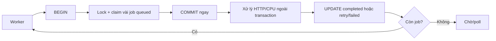

> [!IMPORTANT]
> `FOR UPDATE SKIP LOCKED` không phải cách làm cho câu `SELECT` nhanh hơn. Nó là cơ chế để nhiều transaction **chia nhau công việc**: row đang được worker khác lock sẽ bị bỏ qua ngay, thay vì transaction hiện tại phải chờ.

## Mục lục

- [1. Câu hỏi phỏng vấn](#1-câu-hỏi-phỏng-vấn)
- [2. Câu trả lời 30 giây](#2-câu-trả-lời-30-giây)
- [3. Ba hành vi khi gặp row đã bị lock](#3-ba-hành-vi-khi-gặp-row-đã-bị-lock)
- [4. `FOR UPDATE SKIP LOCKED` hoạt động như thế nào?](#4-for-update-skip-locked-hoạt-động-như-thế-nào)
  - [4.1. Timeline với hai worker](#41-timeline-với-hai-worker)
  - [4.2. Lock được giữ trong bao lâu?](#42-lock-được-giữ-trong-bao-lâu)
- [5. Use case đúng: database-backed job queue](#5-use-case-đúng-database-backed-job-queue)
- [6. Mẫu claim job an toàn trong PostgreSQL](#6-mẫu-claim-job-an-toàn-trong-postgresql)
  - [6.1. Schema và index](#61-schema-và-index)
  - [6.2. Claim một batch bằng một câu SQL](#62-claim-một-batch-bằng-một-câu-sql)
  - [6.3. Xử lý job sau khi commit](#63-xử-lý-job-sau-khi-commit)
- [7. Mẫu MySQL 8.0/InnoDB](#7-mẫu-mysql-80innodb)
- [8. Vì sao cần `ORDER BY`, `LIMIT` và index?](#8-vì-sao-cần-order-by-limit-và-index)
- [9. Những điều `SKIP LOCKED` bảo đảm — và không bảo đảm](#9-những-điều-skip-locked-bảo-đảm--và-không-bảo-đảm)
- [10. Các lỗi production thường gặp](#10-các-lỗi-production-thường-gặp)
  - [10.1. Gọi API bên ngoài khi vẫn giữ transaction](#101-gọi-api-bên-ngoài-khi-vẫn-giữ-transaction)
  - [10.2. Job bị kẹt sau khi worker chết](#102-job-bị-kẹt-sau-khi-worker-chết)
  - [10.3. Xử lý ít nhất một lần, không phải đúng một lần](#103-xử-lý-ít-nhất-một-lần-không-phải-đúng-một-lần)
  - [10.4. Starvation và fairness](#104-starvation-và-fairness)
  - [10.5. Dùng cho màn hình người dùng hoặc báo cáo](#105-dùng-cho-màn-hình-người-dùng-hoặc-báo-cáo)
- [11. PostgreSQL, MySQL và Oracle khác nhau thế nào?](#11-postgresql-mysql-và-oracle-khác-nhau-thế-nào)
- [12. Câu hỏi đào sâu trong phỏng vấn](#12-câu-hỏi-đào-sâu-trong-phỏng-vấn)
- [13. Checklist production](#13-checklist-production)
- [14. Cheat sheet](#14-cheat-sheet)
- [15. Tài liệu liên quan](#15-tài-liệu-liên-quan)

---

## 1. Câu hỏi phỏng vấn

> *"Có 10 worker cùng đọc bảng `jobs`. Mỗi job chỉ được một worker xử lý tại một thời điểm. Nếu dùng `SELECT ... FOR UPDATE`, các worker thường chờ nhau dù còn rất nhiều job khác. Bạn giải quyết thế nào? `FOR UPDATE SKIP LOCKED` là gì, hoạt động ra sao và có rủi ro gì?"*

Câu hỏi này kiểm tra việc phân biệt được:

- **row lock**: khóa một row để transaction khác không claim/ghi xung đột;
- **waiting**: transaction phải chờ row lock được nhả;
- **skipping**: transaction chủ động bỏ qua row đang lock để tìm row khác;
- **claim** và **process**: claim quyền sở hữu job phải ngắn, xử lý nghiệp vụ có thể dài nhưng không được giữ transaction DB;
- **at-least-once delivery**: job có thể chạy lại, nên side effect phải idempotent.

## 2. Câu trả lời 30 giây

> `SELECT ... FOR UPDATE SKIP LOCKED` là một **locking read**. Database cố gắng lấy row lock trên các row thỏa điều kiện. Nếu một row đã bị transaction khác giữ lock xung đột, thay vì chờ như `FOR UPDATE`, nó bỏ qua row đó và tiếp tục tìm row khác.
>
> Nó phù hợp cho nhiều worker cùng claim job trong bảng queue. Mỗi worker mở transaction ngắn, chọn một batch `queued` theo thứ tự xác định, lock các row chưa bị worker khác lock, cập nhật chúng thành `running` kèm `worker_id`/lease, rồi commit ngay. Sau commit, worker mới gọi API hoặc làm việc nặng. `SKIP LOCKED` tránh worker chờ dây chuyền, nhưng không bảo đảm thứ tự tuyệt đối, không tự retry job bị crash, và không tạo ra exactly-once processing.

## 3. Ba hành vi khi gặp row đã bị lock

Giả sử worker A đã lock job `id = 101`. Worker B cũng quét tới job đó.

| Cú pháp | Worker B gặp job `101` đang lock | Phù hợp khi |
|---|---|---|
| `FOR UPDATE` | **Chờ** A commit/rollback rồi mới tiếp tục | Bắt buộc phải xử lý đúng row đó |
| `FOR UPDATE NOWAIT` | **Lỗi ngay** vì không lấy được lock | Muốn fail-fast và phản hồi “đang được xử lý” |
| `FOR UPDATE SKIP LOCKED` | **Bỏ qua** `101`, tìm job khác | Nhiều worker có thể lấy bất kỳ job nào còn sẵn sàng |

```text
Queue theo thứ tự:  [101] [102] [103] [104]
                     ▲
                  A đang lock

B với FOR UPDATE:              chờ ở 101
B với FOR UPDATE NOWAIT:       lỗi ngay ở 101
B với SKIP LOCKED:             bỏ 101 → claim 102, 103, ...
```

> [!NOTE]
> `SKIP LOCKED` là lựa chọn đúng khi các row là **work items thay thế được**. Nếu request cần đọc/chỉnh sửa chính order `#101`, bỏ qua nó rồi trả dữ liệu khác là sai semantics.

## 4. `FOR UPDATE SKIP LOCKED` hoạt động như thế nào?

`FOR UPDATE` yêu cầu database lấy một row-level lock có tính loại trừ đối với các locking operation/ghi xung đột. Nó không biến plain `SELECT` thành exclusive lock cho mọi reader: trong PostgreSQL và InnoDB, plain `SELECT` thường vẫn đọc snapshot MVCC phù hợp.

Khi thêm `SKIP LOCKED`, engine thực hiện logic gần như sau:

1. Dùng `WHERE` và `ORDER BY` để duyệt các candidate row.
2. Thử lấy lock cho từng candidate row.
3. Nếu lock lấy được, giữ row đó trong result set.
4. Nếu lock xung đột với transaction khác, không chờ; bỏ row đó và tiếp tục quét.
5. Trả về tối đa số row trong `LIMIT`.
6. Giữ các lock đã lấy đến `COMMIT` hoặc `ROLLBACK`.

```mermaid
sequenceDiagram
    participant A as Worker A / TX-A
    participant DB as Database
    participant B as Worker B / TX-B

    A->>DB: BEGIN
    A->>DB: SELECT job 101 FOR UPDATE SKIP LOCKED
    DB-->>A: Lock job 101
    B->>DB: BEGIN
    B->>DB: Quét job 101
    DB-->>B: 101 đang bị TX-A lock
    B->>DB: SKIP 101, lock job 102
    DB-->>B: Trả job 102
    A->>DB: UPDATE 101 thành running; COMMIT
    B->>DB: UPDATE 102 thành running; COMMIT
```

### 4.1. Timeline với hai worker

Ví dụ có ba job cùng `status = 'queued'`.

```text
Ban đầu:  1 queued | 2 queued | 3 queued

TX-A: BEGIN
TX-A: SELECT ... FOR UPDATE SKIP LOCKED LIMIT 2
      → lock 1, lock 2

TX-B: BEGIN
TX-B: SELECT ... FOR UPDATE SKIP LOCKED LIMIT 2
      → thấy 1, 2 đã lock: bỏ qua
      → lock 3

TX-A: UPDATE 1,2 SET status='running'; COMMIT
TX-B: UPDATE 3   SET status='running'; COMMIT
```

Không có worker nào claim trùng `1`, `2` hoặc `3`. Quan trọng: đây là kết quả của **lock + cùng transaction cập nhật trạng thái**, không chỉ của từ khóa `SKIP LOCKED`.

### 4.2. Lock được giữ trong bao lâu?

Lock chỉ tồn tại trong transaction hiện tại:

```sql
BEGIN;

SELECT id
FROM jobs
WHERE status = 'queued'
FOR UPDATE SKIP LOCKED;

-- Các row được chọn còn lock ở đây.
COMMIT; -- hoặc ROLLBACK: lock được nhả ở đây.
```

Autocommit là một bẫy phổ biến. Nếu driver tự commit ngay sau `SELECT`, lock có thể đã nhả trước câu `UPDATE` kế tiếp. Một worker khác có thể claim cùng job trong khoảng đó.

> [!IMPORTANT]
> `SELECT ... FOR UPDATE SKIP LOCKED` và `UPDATE ... SET status = 'running'` phải nằm trong **cùng một explicit transaction**. Cách an toàn nhất là claim và update bằng một câu SQL duy nhất.

## 5. Use case đúng: database-backed job queue

Các tình huống phù hợp:

- gửi email, push notification hoặc webhook;
- resize ảnh, export file, import dữ liệu;
- chạy retry cho integration với đối tác;
- transactional outbox: publish event đã commit;
- batch cleanup/backfill, khi nhiều worker chia batch mà không làm trùng nhau.

Luồng chuẩn là **claim nhanh → commit → process → hoàn tất**:



Tại thời điểm commit claim, row không còn giữ row lock. Nhưng nó đã có `status = 'running'`, `locked_by` và `lease_until`, nên worker khác lọc `WHERE status = 'queued'` sẽ không lấy nó nữa.

## 6. Mẫu claim job an toàn trong PostgreSQL

### 6.1. Schema và index

Ví dụ queue đơn giản:

```sql
CREATE TYPE job_status AS ENUM ('queued', 'running', 'completed', 'failed');

CREATE TABLE jobs (
    id            bigint GENERATED ALWAYS AS IDENTITY PRIMARY KEY,
    status        job_status NOT NULL DEFAULT 'queued',
    payload       jsonb NOT NULL,
    priority      integer NOT NULL DEFAULT 0,
    available_at  timestamptz NOT NULL DEFAULT now(),
    attempts      integer NOT NULL DEFAULT 0,
    locked_by     text,
    lease_until   timestamptz,
    started_at    timestamptz,
    completed_at  timestamptz,
    last_error    text,
    created_at    timestamptz NOT NULL DEFAULT now()
);

-- Partial index nhỏ, chỉ chứa job thật sự có thể được lấy.
CREATE INDEX jobs_claim_idx
ON jobs (priority DESC, available_at, id)
WHERE status = 'queued';
```

Index partial giúp worker không phải quét toàn bộ lịch sử `completed`/`failed`. Thứ tự `(priority DESC, available_at, id)` khớp với thứ tự claim bên dưới. `id` là tie-breaker để thứ tự xác định khi hai job có cùng priority và thời điểm available.

### 6.2. Claim một batch bằng một câu SQL

PostgreSQL hỗ trợ `UPDATE ... RETURNING`, nên có thể lock, chuyển trạng thái và trả payload trong một round trip:

```sql
BEGIN;

WITH candidates AS (
    SELECT id
    FROM jobs
    WHERE status = 'queued'
      AND available_at <= now()
    ORDER BY priority DESC, available_at, id
    FOR UPDATE SKIP LOCKED
    LIMIT 20
)
UPDATE jobs AS j
SET status = 'running',
    locked_by = :worker_id,
    lease_until = now() + interval '5 minutes',
    started_at = now(),
    attempts = attempts + 1
FROM candidates AS c
WHERE j.id = c.id
RETURNING j.id, j.payload, j.attempts, j.lease_until;

COMMIT;
```

Mỗi worker chạy câu trên sẽ nhận một tập row khác nhau trong lúc các transaction claim chồng lấn. Sau `COMMIT`, worker xử lý các payload đã nhận **ngoài transaction**.

```text
Worker W1: claim [1..20] → status=running, locked_by=W1 → COMMIT
Worker W2: claim [21..40] → status=running, locked_by=W2 → COMMIT
Worker W3: claim [41..60] → status=running, locked_by=W3 → COMMIT
```

`FOR UPDATE` không tự đổi `status`. Câu `UPDATE` mới biến lock tạm thời thành quyền sở hữu công việc bền vững trong dữ liệu.

### 6.3. Xử lý job sau khi commit

Worker chỉ mark `completed` khi vẫn là owner của lần claim hiện tại:

```sql
UPDATE jobs
SET status = 'completed',
    completed_at = now(),
    lease_until = NULL
WHERE id = :job_id
  AND status = 'running'
  AND locked_by = :worker_id;
```

Nếu xử lý lỗi tạm thời, trả job về queue với backoff:

```sql
UPDATE jobs
SET status = 'queued',
    available_at = now() + interval '30 seconds',
    locked_by = NULL,
    lease_until = NULL,
    last_error = :error_message
WHERE id = :job_id
  AND status = 'running'
  AND locked_by = :worker_id;
```

Một reaper/scheduler cần thu hồi job mà lease đã hết hạn, ví dụ worker chết sau khi claim:

```sql
UPDATE jobs
SET status = 'queued',
    locked_by = NULL,
    lease_until = NULL,
    available_at = now(),
    last_error = 'Lease expired; requeued'
WHERE status = 'running'
  AND lease_until < now();
```

> [!WARNING]
> Ví dụ reaper trên chỉ là bản tối thiểu. Production thường cần giới hạn `attempts`, exponential backoff, dead-letter state và log/metric cho số job bị lease-expire để tránh retry vô hạn.

## 7. Mẫu MySQL 8.0/InnoDB

MySQL 8.0/InnoDB hỗ trợ `SKIP LOCKED` cho locking read. Do MySQL không có `UPDATE ... RETURNING` tương đương PostgreSQL, worker thường chọn row rồi update chúng trong **cùng transaction**.

```sql
START TRANSACTION;

SELECT id, payload
FROM jobs
WHERE status = 'queued'
  AND available_at <= NOW(6)
ORDER BY priority DESC, available_at, id
LIMIT 20
FOR UPDATE SKIP LOCKED;

-- Application lấy danh sách id trả về, ví dụ (101, 102, 103).
UPDATE jobs
SET status = 'running',
    locked_by = ?,
    lease_until = DATE_ADD(NOW(6), INTERVAL 5 MINUTE),
    started_at = NOW(6),
    attempts = attempts + 1
WHERE id IN (101, 102, 103)
  AND status = 'queued';

COMMIT;
```

Sau commit, application xử lý payload. Query `UPDATE` nên kiểm tra số row ảnh hưởng bằng số row đã chọn. Nếu code không giữ cùng connection/transaction cho cả hai câu lệnh, pattern mất tính đúng đắn.

> [!NOTE]
> Với InnoDB, phạm vi lock còn bị ảnh hưởng bởi isolation level, index và execution plan. Dùng index hẹp khớp điều kiện queue giúp giảm số index record/range phải xét và giảm contention. Hãy kiểm tra bằng `EXPLAIN` trên phiên bản MySQL thật đang chạy.

## 8. Vì sao cần `ORDER BY`, `LIMIT` và index?

Không có thứ tự rõ ràng, database được phép trả bất kỳ row nào. Với queue, điều này khiến priority/độ công bằng khó dự đoán.

```sql
-- Tránh: thứ tự không xác định, batch có thể quá lớn.
SELECT id FROM jobs
WHERE status = 'queued'
FOR UPDATE SKIP LOCKED;

-- Nên dùng: thứ tự nghiệp vụ rõ và batch nhỏ.
SELECT id FROM jobs
WHERE status = 'queued'
  AND available_at <= now()
ORDER BY priority DESC, available_at, id
FOR UPDATE SKIP LOCKED
LIMIT 20;
```

| Thành phần | Lý do |
|---|---|
| `WHERE status = 'queued'` | Không claim lại job đang chạy/đã xong |
| `available_at <= now()` | Thực hiện retry đúng thời điểm backoff |
| `ORDER BY priority DESC, available_at, id` | Xác định ưu tiên và tie-breaker |
| `LIMIT 20` | Giới hạn lock duration, transaction size và lượng việc mỗi worker giữ |
| Partial/composite index phù hợp | Tìm candidate nhanh, ít quét và ít đụng row không cần thiết |

Ví dụ PostgreSQL index cần xét theo query:

```sql
CREATE INDEX jobs_claim_idx
ON jobs (priority DESC, available_at, id)
WHERE status = 'queued';
```

Không có index phù hợp, mỗi worker có thể phải quét nhiều row không cần thiết để tìm đủ 20 row chưa lock. Khi nhiều worker cùng poll, việc quét này gây I/O/CPU và contention ngay cả khi logic không lấy trùng job.

> [!TIP]
> Đo bằng `EXPLAIN (ANALYZE, BUFFERS)` ở PostgreSQL hoặc `EXPLAIN ANALYZE` ở MySQL. Đừng chỉ nhìn thời gian của một worker; hãy test nhiều worker đồng thời và theo dõi rows scanned, lock wait và CPU.

## 9. Những điều `SKIP LOCKED` bảo đảm — và không bảo đảm

| Khẳng định | Đúng? | Giải thích |
|---|:---:|---|
| Hai transaction cùng lúc claim cùng một row đang lock | Có, được ngăn trong thời gian lock | Transaction sau skip row hoặc chờ/lỗi tùy clause |
| Worker không bị head-of-line blocking vì job đầu đang lock | ✅ | Nó có thể đi tiếp để lấy job khác |
| Mọi job được xử lý theo FIFO tuyệt đối | ❌ | Job đầu đang lock/chạy chậm có thể bị vượt qua |
| Một job chỉ chạy đúng một lần trên toàn hệ thống | ❌ | Crash, lease expiry, retry và network timeout có thể làm job chạy lại |
| Job đã claim sẽ tự được chạy lại khi worker chết | ❌ | Cần lease timeout + reaper/scheduler |
| Có thể giữ transaction mở trong lúc gọi HTTP 5 phút | ❌ | Sẽ giữ lock/connection, triệt tiêu lợi ích và có thể cạn pool |
| Query trả về snapshot nhất quán của toàn bảng | ❌ | Bản chất skip row đang lock là cố ý đọc tập dữ liệu không đầy đủ; đây là lý do nó hợp với queue |

Trong PostgreSQL, tài liệu mô tả `SKIP LOCKED` tạo ra một view không nhất quán của dữ liệu. Đây không phải lỗi cho queue: worker chỉ cần một job **đang sẵn sàng**, không cần “mọi job sẵn sàng” trong cùng một ảnh chụp nhất quán.

## 10. Các lỗi production thường gặp

### 10.1. Gọi API bên ngoài khi vẫn giữ transaction

Sai:

```text
BEGIN
SELECT ... FOR UPDATE SKIP LOCKED
Gọi payment/email provider trong 10 giây
UPDATE job SET status = 'completed'
COMMIT
```

Trong 10 giây đó row lock và database connection đều bị giữ. Khi worker tăng, pool cạn hoặc worker khác bắt đầu skip quá nhiều row.

Đúng:

```text
BEGIN → claim và đổi status thành running → COMMIT
Gọi API bên ngoài
BEGIN → ghi completed/queued-failed → COMMIT
```

Nếu API bên ngoài có side effect, thêm idempotency key. Không có database transaction nào có thể rollback email đã gửi hoặc payment đã charge.

### 10.2. Job bị kẹt sau khi worker chết

Nếu chỉ dùng `status = 'running'` mà không có lease, worker chết sau claim làm job nằm `running` mãi mãi. Một worker khác lọc `status = 'queued'` sẽ không thấy nó.

Cần tối thiểu:

- `locked_by` để biết owner;
- `lease_until` để định nghĩa lúc quyền xử lý hết hạn;
- reaper định kỳ đưa job quá hạn về `queued` hoặc `failed`;
- `attempts` và dead-letter policy để dừng job luôn lỗi.

### 10.3. Xử lý ít nhất một lần, không phải đúng một lần

Kịch bản phổ biến:

1. Worker W1 claim job gửi email.
2. W1 gọi email provider; provider gửi thành công.
3. W1 chết trước khi ghi `completed`.
4. Lease hết hạn; W2 claim lại job.
5. Email có thể bị gửi lần hai.

Vì vậy thiết kế thực tế thường là **at-least-once**. Cách giảm duplicate:

- side effect dùng idempotency key ổn định theo `job.id`/business key;
- lưu provider request ID hoặc unique business event ID;
- consumer nhận event phải idempotent;
- dùng unique constraint/conditional update cho side effect nội bộ.

“Exactly once” chỉ có ý nghĩa khi bạn định nghĩa rất chặt phạm vi hệ thống và cơ chế deduplication. `SKIP LOCKED` một mình không cung cấp nó.

### 10.4. Starvation và fairness

Vì worker được phép bỏ qua row đang lock, job đó có thể bị các job sau vượt qua. Một job cũng có thể bị retry và luôn mất ưu tiên do policy không đúng.

Giảm rủi ro bằng cách:

- giữ transaction claim thật ngắn;
- đặt `ORDER BY` xác định (`priority`, `available_at`, `id`);
- dùng batch vừa phải thay vì claim quá nhiều;
- theo dõi age của job oldest queued/running;
- alert job có `attempts` cao hoặc lease expire liên tục;
- tách queue theo priority/tenant nếu một nhóm làm nghẽn tất cả.

Không hứa FIFO tuyệt đối khi chọn `SKIP LOCKED`; hãy hứa **throughput và không xử lý trùng trong lúc claim**.

### 10.5. Dùng cho màn hình người dùng hoặc báo cáo

Ví dụ sai semantics:

```sql
SELECT *
FROM orders
WHERE customer_id = :customer_id
FOR UPDATE SKIP LOCKED;
```

Nếu dùng cho UI “danh sách đơn hàng”, đơn đang bị xử lý có thể biến mất khỏi màn hình. Người dùng thấy dữ liệu thiếu mà không hề biết. Với read API thông thường, dùng plain `SELECT` và MVCC snapshot; chỉ dùng locking read khi nghiệp vụ thực sự cần claim/quyền sở hữu.

## 11. PostgreSQL, MySQL và Oracle khác nhau thế nào?

| Hệ quản trị | Hỗ trợ | Cú pháp khái quát | Lưu ý |
|---|---|---|---|
| PostgreSQL | Có | `... FOR UPDATE SKIP LOCKED` | Hỗ trợ `UPDATE ... RETURNING`; doc nêu rõ kết quả có thể không nhất quán, phù hợp queue-like table |
| MySQL 8.0+ / InnoDB | Có | `... FOR UPDATE SKIP LOCKED` | Cần explicit transaction; lock/range chịu ảnh hưởng isolation level và index; không có `UPDATE ... RETURNING` như PostgreSQL |
| Oracle | Có | `... FOR UPDATE SKIP LOCKED` | Cần xem docs/version và cách application fetch/cập nhật theo driver đang dùng |
| SQL Server | Không có đúng cú pháp này | Thường dùng hint như `UPDLOCK`, `READPAST`, `ROWLOCK` | Semantics và rủi ro khác; không copy nguyên pattern giữa engine |

Các hệ quản trị có cú pháp gần giống không đồng nghĩa hành vi lock giống hệt. Trước khi dùng production, xác nhận:

- engine và **phiên bản**;
- storage engine của MySQL là InnoDB;
- isolation level đang dùng;
- execution plan và index;
- driver/ORM có thật sự giữ cùng transaction/connection;
- timeout/retry behavior của application.

## 12. Câu hỏi đào sâu trong phỏng vấn

### “Vì sao không chỉ `SELECT` rồi `UPDATE`?”

Vì hai worker có thể cùng đọc `status = 'queued'` trước khi một bên update. `FOR UPDATE` tạo mutual exclusion trong giai đoạn claim, còn `UPDATE status = 'running'` được commit để quyền sở hữu tồn tại sau khi lock nhả.

### “Dùng `NOWAIT` thay cho `SKIP LOCKED` được không?”

Được nếu business cần biết ngay “job/resource này đang bị xử lý”. Nhưng trong queue nhiều job, `NOWAIT` làm worker fail chỉ vì job đầu đang bận, dù job khác có thể chạy. `SKIP LOCKED` tốt hơn cho throughput của queue.

### “`SKIP LOCKED` có tránh deadlock hoàn toàn không?”

Không. Nó giảm wait khi **đọc/claim** các row đang lock, nhưng transaction vẫn có thể deadlock nếu sau đó lock/update nhiều resource theo thứ tự khác nhau. Giữ transaction ngắn và dùng lock ordering nhất quán.

### “Vì sao cần lease nếu row lock đã ngăn worker khác?”

Row lock chỉ tồn tại đến commit/rollback. Ta phải commit sớm để không giữ connection trong lúc xử lý lâu. Lease là trạng thái bền vững sau commit, giúp worker khác biết job đang được xử lý và cho phép hệ thống thu hồi khi worker chết.

### “Có nên dùng database làm queue?”

Có thể phù hợp khi throughput vừa phải, transactional outbox, vận hành đơn giản và bạn đã có database. Nếu cần throughput rất cao, retention/stream replay dài, consumer group phức tạp hoặc backpressure chuyên dụng, hãy đánh giá broker như Kafka, RabbitMQ hoặc SQS. Đừng biến bảng `jobs` không được index/cleanup thành queue vô hạn.

## 13. Checklist production

- [ ] Job có state rõ ràng: `queued`, `running`, `completed`, `failed`/dead-letter.
- [ ] Query claim có `WHERE`, `ORDER BY` xác định và `LIMIT` batch nhỏ.
- [ ] Có index khớp query claim; PostgreSQL ưu tiên partial index cho `status = 'queued'` khi phù hợp.
- [ ] `SELECT ... FOR UPDATE SKIP LOCKED` và `UPDATE ... running` ở cùng explicit transaction.
- [ ] Transaction claim không gọi HTTP/RPC, không xử lý file lớn và commit nhanh.
- [ ] Sau commit, `locked_by`, `lease_until`, `attempts` đã được lưu.
- [ ] Có reaper cho lease hết hạn, backoff và dead-letter policy.
- [ ] Side effect và consumer idempotent; retry không tạo charge/email/event trùng.
- [ ] Worker chỉ hoàn tất/thả job nếu nó vẫn là owner hợp lệ.
- [ ] Có metrics: queue depth, oldest job age, claim latency, rows claimed, lease expiry, retry/dead-letter, lock wait, DB CPU/I/O.
- [ ] Load test với nhiều worker, worker crash sau external side effect, database failover và poll rỗng.

## 14. Cheat sheet

```text
FOR UPDATE             → row đang lock: CHỜ
FOR UPDATE NOWAIT      → row đang lock: LỖI NGAY
FOR UPDATE SKIP LOCKED → row đang lock: BỎ QUA, tìm row khác

Queue pattern đúng:
BEGIN
  chọn queued jobs + FOR UPDATE SKIP LOCKED + LIMIT N
  UPDATE jobs SET status='running', locked_by, lease_until
COMMIT                 ← nhả DB row lock thật sớm
process ngoài DB       ← có idempotency key
UPDATE completed/retry ← owner check + backoff

SKIP LOCKED bảo đảm: claim song song không chờ dây chuyền.
SKIP LOCKED không bảo đảm: FIFO tuyệt đối, retry khi crash, exactly-once.
```

## 15. Tài liệu liên quan

- [Lock trong Database](/fundamentals/lock/)
- [Kiểm soát đồng thời ở tầng ứng dụng](/fundamentals/application-concurrency-locking/)
- [ACID Transaction](/fundamentals/acid-transaction/)
- [MVCC](/fundamentals/mvcc/)
- [PostgreSQL hết connection khi flash sale](/interview/postgresql-connection-exhaustion/)
- [PostgreSQL: Explicit Locking — `SKIP LOCKED`](https://www.postgresql.org/docs/current/sql-select.html)
- [MySQL 8.0: Locking Reads](https://dev.mysql.com/doc/refman/8.0/en/innodb-locking-reads.html)
