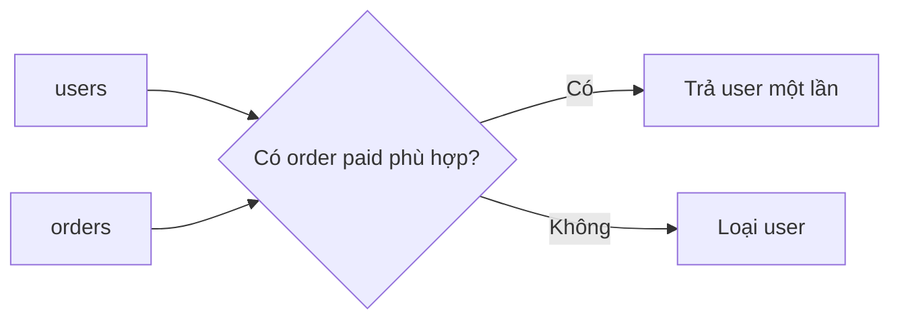
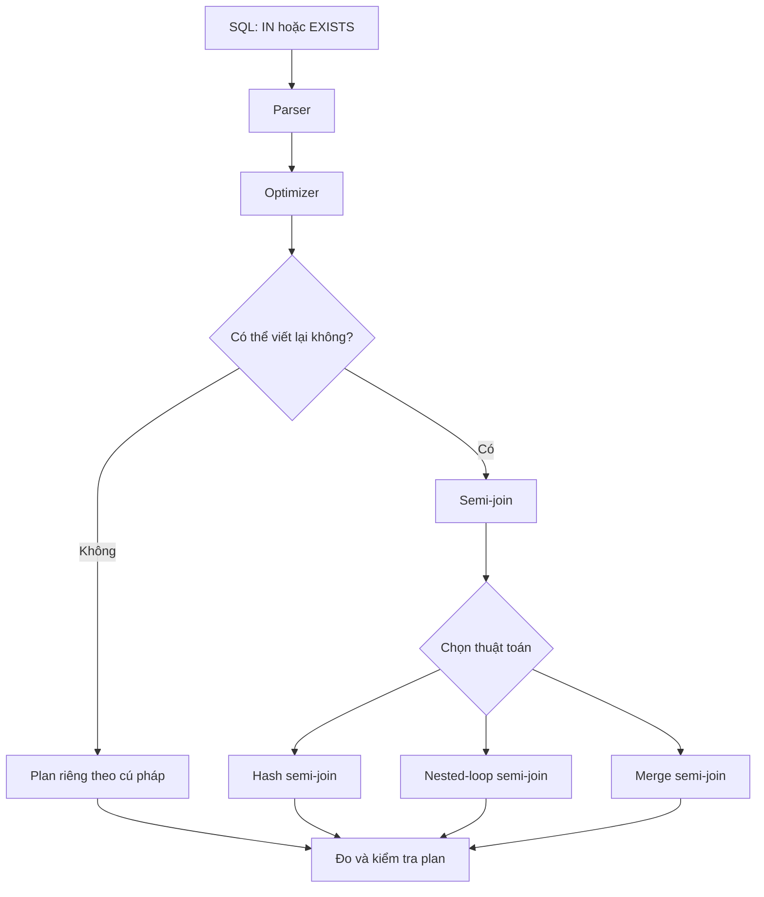
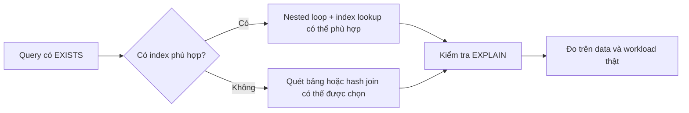

> [!IMPORTANT]
> Đây là một câu hỏi phỏng vấn về **cách suy luận**, không chỉ về việc nhớ câu “`EXISTS` nhanh hơn `IN`”. Câu trả lời tốt phải tách ba chuyện: **kết quả**, **kế hoạch thực thi**, và **dữ liệu thực tế**.

## Mục lục

- [Câu hỏi phỏng vấn](#câu-hỏi-phỏng-vấn)
- [Câu trả lời 30 giây](#câu-trả-lời-30-giây)
- [Bài toán mẫu](#bài-toán-mẫu)
- [IN và EXISTS khác nhau ở ngữ nghĩa nào](#in-và-exists-khác-nhau-ở-ngữ-nghĩa-nào)
  - [IN với subquery](#in-với-subquery)
  - [EXISTS với subquery tương quan](#exists-với-subquery-tương-quan)
  - [JOIN không phải là phép thay thế mặc định](#join-không-phải-là-phép-thay-thế-mặc-định)
- [Semi-join: vì sao hai câu có thể thành cùng một plan](#semi-join-vì-sao-hai-câu-có-thể-thành-cùng-một-plan)
- [Khi nào hiệu năng thật sự khác nhau](#khi-nào-hiệu-năng-thật-sự-khác-nhau)
  - [Optimizer không decorrelate được subquery](#optimizer-không-decorrelate-được-subquery)
  - [Index trên cột nối](#index-trên-cột-nối)
  - [Danh sách lớn và dữ liệu tràn bộ nhớ](#danh-sách-lớn-và-dữ-liệu-tràn-bộ-nhớ)
- [Cái bẫy NOT IN và NULL](#cái-bẫy-not-in-và-null)
- [Cách kiểm chứng thay vì đoán](#cách-kiểm-chứng-thay-vì-đoán)
  - [Xác nhận hai query có cùng ngữ nghĩa](#xác-nhận-hai-query-có-cùng-ngữ-nghĩa)
  - [Xem execution plan](#xem-execution-plan)
  - [So các dấu hiệu quan trọng](#so-các-dấu-hiệu-quan-trọng)
  - [Benchmark công bằng](#benchmark-công-bằng)
- [Câu hỏi đào sâu](#câu-hỏi-đào-sâu)
  - [Có nên luôn dùng EXISTS không?](#có-nên-luôn-dùng-exists-không)
  - [SELECT 1 hay SELECT * trong EXISTS?](#select-1-hay-select--trong-exists)
  - [JOIN có thể được optimizer biến thành semi-join không?](#join-có-thể-được-optimizer-biến-thành-semi-join-không)
  - [Khi nào IN chậm hơn EXISTS?](#khi-nào-in-chậm-hơn-exists)
  - [Vì sao query chạy 4,2 giây lại còn 0,4 giây?](#vì-sao-query-chạy-42-giây-lại-còn-04-giây)
- [Tóm tắt và checklist](#tóm-tắt-và-checklist)
  - [Cheat sheet](#cheat-sheet)
  - [Ba nguyên tắc trả lời phỏng vấn](#ba-nguyên-tắc-trả-lời-phỏng-vấn)
  - [Câu kết nên nhớ](#câu-kết-nên-nhớ)

## Câu hỏi phỏng vấn

> *“`IN` và `EXISTS` khác nhau thế nào? Cái nào nhanh hơn? Nếu query production chạy 4,2 giây nhưng đổi `IN` thành `EXISTS` còn 0,4 giây thì bạn kết luận gì?”*

Người phỏng vấn không chỉ chờ tên của một từ khóa. Họ muốn biết bạn có làm được bốn việc không:

1. Nói rõ query đang cần **lọc theo sự tồn tại** hay **lấy dữ liệu từ bảng khác**.
2. Phân biệt kết quả của `IN`/`EXISTS` với kết quả của `JOIN`.
3. Nhận ra optimizer có thể viết lại hai câu thành cùng một kế hoạch.
4. Biết kiểm chứng bằng execution plan và benchmark có kiểm soát.

> [!WARNING]
> Câu “`EXISTS` luôn nhanh hơn `IN`” là một câu trả lời thiếu. Nó có thể đúng trong một engine hoặc một kế hoạch cụ thể, nhưng không phải quy luật chung cho mọi database, phiên bản, dữ liệu và index.

## Câu trả lời 30 giây

> Nếu chỉ cần biết mỗi user **có ít nhất một** order phù hợp, `IN (subquery)` và `EXISTS` thường có cùng ngữ nghĩa lọc. Optimizer hiện đại có thể biến cả hai thành **semi-join**, nên execution plan và thời gian thường gần như nhau.
>
> `JOIN` khác ở chỗ nó có thể nhân bản một user nếu user đó có nhiều order phù hợp. Vì vậy không nên dùng `JOIN` chỉ để kiểm tra tồn tại.
>
> Hiệu năng thật sự phụ thuộc vào dữ liệu, index, statistics, phiên bản optimizer và kế hoạch đã chọn. Nếu thấy chênh lệch 4,2 giây so với 0,4 giây, tôi sẽ mở `EXPLAIN` hoặc execution plan để xem database đang làm gì, thay vì kết luận từ chữ `IN` hay `EXISTS`.
>
> Với bài toán phủ định, tôi đặc biệt tránh `NOT IN` nếu subquery có thể chứa `NULL`; khi đó `NOT EXISTS` thường là lựa chọn an toàn hơn.

## Bài toán mẫu

Giả sử có hai bảng:

```sql
CREATE TABLE users (
    id bigint PRIMARY KEY,
    email text NOT NULL
);

CREATE TABLE orders (
    id bigint PRIMARY KEY,
    user_id bigint,
    status text NOT NULL
);
```

Ta cần lấy những user đã có ít nhất một order đã thanh toán.



Có thể viết bằng `IN`:

```sql
SELECT u.*
FROM users AS u
WHERE u.id IN (
    SELECT o.user_id
    FROM orders AS o
    WHERE o.status = 'paid'
);
```

Hoặc bằng `EXISTS`:

```sql
SELECT u.*
FROM users AS u
WHERE EXISTS (
    SELECT 1
    FROM orders AS o
    WHERE o.user_id = u.id
      AND o.status = 'paid'
);
```

Trong bài toán này, cả hai câu đều diễn đạt ý định: **giữ lại user nếu tồn tại ít nhất một order phù hợp**.

## IN và EXISTS khác nhau ở ngữ nghĩa nào

### IN với subquery

`IN` so sánh một giá trị với tập giá trị do subquery trả về:

```sql
u.id IN (1, 2, 3)
```

có thể đọc là:

> “`u.id` có thuộc tập này không?”

Với `IN (subquery)`, tập giá trị có thể được materialize, hash, sort hoặc biến đổi thành một semi-join. Cách làm cụ thể là quyết định của optimizer, không được đảm bảo chỉ từ cú pháp SQL.

Cần phân biệt hai dạng sau:

```sql
-- Danh sách hằng
WHERE u.id IN (1, 2, 3)

-- Subquery
WHERE u.id IN (SELECT o.user_id FROM orders AS o)
```

Danh sách hằng rất ngắn thường được xử lý khác với subquery lớn. Không nên áp dụng một ngưỡng cố định như “1.000 phần tử dùng `IN`, trên 10.000 phần tử phải dùng bảng tạm”. Ngưỡng đó phụ thuộc database và workload.

### EXISTS với subquery tương quan

`EXISTS` chỉ hỏi một câu:

> “Có ít nhất một dòng thỏa điều kiện không?”

```sql
WHERE EXISTS (
    SELECT 1
    FROM orders AS o
    WHERE o.user_id = u.id
      AND o.status = 'paid'
)
```

Subquery ở đây là **subquery tương quan** vì nó dùng `u.id` từ query bên ngoài. Về mặt logic, database không cần đếm tất cả order. Nó chỉ cần biết câu trả lời là có hay không.

Tuy nhiên, “có thể dừng ở match đầu tiên” là mô tả về ngữ nghĩa và khả năng tối ưu. Nó không có nghĩa mọi execution plan đều quét bảng rồi dừng ngay. Ví dụ, với hash semi-join, database có thể xây hash table trước, sau đó kiểm tra các dòng bên ngoài.

### JOIN không phải là phép thay thế mặc định

Nếu dùng `JOIN` để giải bài toán trên:

```sql
SELECT u.*
FROM users AS u
JOIN orders AS o
  ON o.user_id = u.id
 AND o.status = 'paid';
```

một user có ba order `paid` sẽ xuất hiện ba lần:

```text
users:   user 1
orders:  user 1 có 3 order paid

JOIN:    user 1, user 1, user 1
EXISTS:  user 1
```

`JOIN` trả về các cặp dòng phù hợp. `EXISTS` chỉ trả về dòng bên trái khi có match. Đây là khác biệt về **kết quả**, không chỉ là khác biệt hiệu năng.

Nếu thật sự cần dùng `JOIN` nhưng chỉ muốn mỗi user xuất hiện một lần, có thể thêm `DISTINCT`:

```sql
SELECT DISTINCT u.*
FROM users AS u
JOIN orders AS o
  ON o.user_id = u.id
 AND o.status = 'paid';
```

Nhưng `DISTINCT` phải khử các dòng trùng bằng sort hoặc hash. Nếu mục tiêu ban đầu chỉ là kiểm tra tồn tại, `EXISTS` thể hiện đúng ý định hơn và tránh tạo bản sao ngay từ đầu.

## Semi-join: vì sao hai câu có thể thành cùng một plan

**Semi-join** là phép nối chỉ trả về dòng bên trái nếu có ít nhất một dòng match bên phải. Nó không lấy cột bên phải và không nhân bản dòng bên trái.



Với hai câu sau:

```sql
-- IN
SELECT u.id
FROM users AS u
WHERE u.id IN (
    SELECT o.user_id
    FROM orders AS o
    WHERE o.status = 'paid'
);

-- EXISTS
SELECT u.id
FROM users AS u
WHERE EXISTS (
    SELECT 1
    FROM orders AS o
    WHERE o.user_id = u.id
      AND o.status = 'paid'
);
```

optimizer có thể nhận ra rằng cả hai chỉ cần kiểm tra sự tồn tại. Kế hoạch có thể trở thành dạng tương đương với:

```text
Hash Semi Join
  Hash Cond: (u.id = o.user_id)
  -> Scan users
  -> Hash
       -> Scan orders
          Filter: status = 'paid'
```

Khi đó đổi từ `IN` sang `EXISTS` không nhất thiết tạo ra cải thiện nào. Nếu benchmark cho thấy hai câu lần lượt chạy 118 ms và 121 ms, chênh lệch 3 ms có thể chỉ là nhiễu đo.

> [!NOTE]
> Tên node trong execution plan khác nhau giữa PostgreSQL, SQL Server, Oracle và MySQL. Ý tưởng chung vẫn là: optimizer có thể biến phép kiểm tra tồn tại thành semi-join, nhưng bạn phải xem plan của engine đang dùng.

## Khi nào hiệu năng thật sự khác nhau

### Optimizer không decorrelate được subquery

**Decorrelation** là việc optimizer biến subquery tương quan thành một phép join có thể thực hiện hiệu quả hơn.

Ở database hoặc phiên bản cũ, optimizer có thể không decorrelate được câu lệnh. Khi đó subquery có thể bị chạy lại cho từng dòng bên ngoài:

```text
users có 210.000 dòng
→ subquery chạy lại 210.000 lần
→ mỗi lần quét orders
→ tổng thời gian tăng rất mạnh
```

Đây là một nguyên nhân hợp lý cho tình huống “đổi một từ khóa thì từ 4,2 giây còn 0,4 giây”. Nhưng kết luận chính xác không phải là “`EXISTS` nhanh hơn mọi lúc”. Kết luận là **hai câu đã nhận hai execution plan khác nhau**.

Các cấu trúc có thể khiến việc viết lại khó hơn gồm:

- `LIMIT` hoặc `OFFSET` nằm bên trong subquery.
- `ORDER BY` có ý nghĩa với kết quả của subquery.
- Hàm hoặc biểu thức có side effect.
- Điều kiện phức tạp khiến optimizer không chứng minh được hai cách viết tương đương.
- Khác biệt về `NULL` hoặc kiểu dữ liệu.

Nói ngắn gọn: nếu một mẹo chỉ đúng khi optimizer không đủ thông minh, hãy xem đó là đặc tính của môi trường cụ thể, không phải luật SQL.

### Index trên cột nối

Với `EXISTS`, index trên cột dùng để tìm match thường rất quan trọng:

```sql
CREATE INDEX orders_user_id_status_idx
    ON orders (user_id, status);
```

Index này có thể giúp database tìm order của từng user nhanh hơn trong nested-loop semi-join. Nhưng không có một index duy nhất tốt cho mọi query. Nếu query thường lọc `status` trước rồi mới nối theo `user_id`, thứ tự cột có thể cần đánh giá lại.

Optimizer cũng có thể chọn hash join hoặc sequential scan nếu:

- Phần lớn bảng đều khớp điều kiện.
- Bảng đủ nhỏ để quét toàn bộ rẻ hơn đi qua index.
- Statistics không phản ánh đúng dữ liệu.
- Chi phí random I/O cao.



Index là nhân vật quan trọng, nhưng không nên nói “thiếu index thì `EXISTS` luôn vô dụng”. Một hash semi-join vẫn có thể là lựa chọn tốt khi bảng lớn và tỷ lệ match cao.

### Danh sách lớn và dữ liệu tràn bộ nhớ

Nếu `IN (subquery)` tạo ra một tập kết quả rất lớn, database có thể cần materialize hoặc xây hash table. Nếu bộ nhớ không đủ, thao tác có thể tràn sang đĩa tạm. Đọc đĩa thường đắt hơn xử lý trong RAM nhiều lần.

Khi danh sách đến từ ứng dụng và rất lớn, thay vì ghép hàng nghìn giá trị vào SQL, hãy cân nhắc:

- Bảng tạm.
- Bảng staging có index.
- `VALUES` rồi join nếu tập nhỏ và cố định.
- Cơ chế truyền mảng hoặc table-valued parameter tùy database.

Không chọn giải pháp theo ngưỡng cứng. Hãy đo parse time, memory, I/O và execution plan trên dữ liệu gần production.

## Cái bẫy NOT IN và NULL

Đây là follow-up thường dùng để phân biệt người hiểu bản chất với người chỉ nhớ benchmark.

Giả sử muốn tìm user chưa từng đặt order:

```sql
SELECT u.*
FROM users AS u
WHERE u.id NOT IN (
    SELECT o.user_id
    FROM orders AS o
);
```

Nếu subquery trả về:

```text
(10, 20, NULL)
```

thì với một `u.id` không phải 10 hoặc 20, SQL phải đánh giá tương đương với:

```text
u.id <> 10
AND u.id <> 20
AND u.id <> NULL
```

So sánh bất kỳ giá trị nào với `NULL` cho kết quả `UNKNOWN`, không phải `TRUE` hay `FALSE`. Điều kiện `WHERE` chỉ giữ lại biểu thức có giá trị `TRUE`, nên các user không match có thể bị loại hết. Query không báo lỗi; nó chỉ trả kết quả thiếu hoặc rỗng.

Cách an toàn hơn là dùng `NOT EXISTS`:

```sql
SELECT u.*
FROM users AS u
WHERE NOT EXISTS (
    SELECT 1
    FROM orders AS o
    WHERE o.user_id = u.id
);
```

`NOT EXISTS` hỏi trực tiếp “không có dòng match nào phải không?”. Một giá trị `NULL` không tự biến thành điều kiện phủ định nguy hiểm như `NOT IN`.

Có thể dùng `NOT IN` nếu chứng minh được cột trong subquery không bao giờ có `NULL`:

```sql
SELECT u.*
FROM users AS u
WHERE u.id NOT IN (
    SELECT o.user_id
    FROM orders AS o
    WHERE o.user_id IS NOT NULL
);
```

Tuy vậy, khi ý định là anti-join — lấy dòng bên trái **không có** match — `NOT EXISTS` thường dễ đọc và ít rủi ro hơn.

## Cách kiểm chứng thay vì đoán

Khi được hỏi “cái nào nhanh hơn?”, câu trả lời nên chuyển từ lý thuyết sang quy trình kiểm chứng.

<Steps>
<Step>

### Xác nhận hai query có cùng ngữ nghĩa

Kiểm tra điều kiện nối, `NULL`, kiểu dữ liệu và việc có lấy cột từ bảng bên phải hay không. Nếu dùng `JOIN`, kiểm tra khả năng nhân bản dòng.

</Step>
<Step>

### Xem execution plan

Dùng công cụ phù hợp với database:

```sql
-- PostgreSQL
EXPLAIN (ANALYZE, BUFFERS)
SELECT ...;
```

Ở production, ưu tiên read replica hoặc môi trường an toàn. `EXPLAIN ANALYZE` thực sự chạy query, vì vậy không dùng tùy tiện với `UPDATE` hoặc `DELETE`.

</Step>
<Step>

### So các dấu hiệu quan trọng

Tập trung vào:

- Loại join: nested loop, hash, merge, semi-join hoặc anti-join.
- Estimated rows so với actual rows.
- Index scan hay sequential scan.
- Số page đọc từ disk và số page lấy từ cache.
- Sort hoặc hash có tràn ra disk hay không.
- Thời gian chờ lock, connection hoặc tài nguyên khác.

</Step>
<Step>

### Benchmark công bằng

Chạy mỗi query nhiều lần. Tách cold cache và warm cache. Dùng cùng tham số, cùng transaction isolation, cùng dữ liệu và workload tương đương.

Một lần chạy nhanh hơn chưa đủ để chứng minh một cú pháp tốt hơn.

</Step>
</Steps>

> [!TIP]
> Câu trả lời có điểm trong phỏng vấn thường là: “Em chưa thể kết luận chỉ từ cú pháp. Em sẽ xem execution plan, so estimated rows với actual rows, kiểm tra index và đo lại trên dữ liệu thực tế.” Đây là cách thể hiện năng lực chẩn đoán thay vì đoán bừa.

## Câu hỏi đào sâu

### Có nên luôn dùng EXISTS không?

Không. Hãy chọn cú pháp thể hiện đúng ý định:

| Ý định | Cú pháp thường phù hợp |
|---|---|
| Kiểm tra có match | `EXISTS` hoặc `IN (subquery)` |
| Kiểm tra không có match | `NOT EXISTS` |
| Lấy cột từ bảng bên phải | `JOIN` |
| Xử lý một danh sách hằng nhỏ | `IN (value1, value2, ...)` |

Sau đó kiểm tra plan nếu query quan trọng về hiệu năng.

### SELECT 1 hay SELECT * trong EXISTS?

Thông thường không. Với `EXISTS`, database chỉ cần biết subquery có trả về dòng hay không. `SELECT 1` được dùng vì nó truyền đạt rõ ý định và tránh làm người đọc nghĩ rằng ta cần dữ liệu từ bảng bên trong.

Không nên dùng ví dụ như `SELECT 1 / 0` để chứng minh mọi biểu thức trong select list luôn bị bỏ qua. Cách optimizer xử lý biểu thức không phải lúc nào cũng giống nhau giữa các engine và phiên bản.

### JOIN có thể được optimizer biến thành semi-join không?

Có thể, nếu optimizer chứng minh rằng việc loại bỏ cột và duplicate không làm thay đổi kết quả. Nhưng bạn không nên dựa vào việc optimizer luôn làm được điều đó. Nếu ý định chỉ là kiểm tra tồn tại, viết `EXISTS` sẽ rõ ràng hơn.

### Khi nào IN chậm hơn EXISTS?

Một số trường hợp có thể xảy ra:

- Engine cũ không decorrelate hoặc không chuyển `IN` thành semi-join.
- Tập kết quả của subquery rất lớn và bị materialize hoặc spill ra disk.
- Hai câu có điều kiện hoặc kiểu dữ liệu khác nhau nên nhận plan khác.
- Statistics, index hoặc tham số khiến optimizer chọn thuật toán không phù hợp.

Câu trả lời cuối cùng vẫn phải đến từ execution plan và benchmark. Không có ngưỡng chung áp dụng cho mọi hệ quản trị.

### Vì sao query chạy 4,2 giây lại còn 0,4 giây?

Có ít nhất bốn khả năng:

1. Hai câu nhận hai execution plan khác nhau.
2. Một plan lặp subquery theo từng dòng bên ngoài.
3. Một plan dùng index phù hợp còn plan kia quét toàn bộ bảng.
4. Một phép hash hoặc sort bị tràn ra disk.

Con số 100 lần là bằng chứng để điều tra, không phải bằng chứng rằng `EXISTS` luôn nhanh hơn `IN`.

## Tóm tắt và checklist

### Cheat sheet

```text
Cần biết “có match không?”
    → EXISTS hoặc IN (subquery)
    → thường có thể trở thành semi-join

Cần biết “không có match không?”
    → NOT EXISTS
    → tránh NOT IN nếu subquery có thể chứa NULL

Cần lấy cột từ bảng bên phải
    → JOIN
    → kiểm tra duplicate nếu quan hệ là one-to-many

Thấy chênh lệch hiệu năng
    → EXPLAIN / execution plan
    → kiểm tra index, statistics, data và I/O
    → benchmark nhiều lần trên môi trường tương đương
```

### Ba nguyên tắc trả lời phỏng vấn

> [!IMPORTANT]
> **1. Đừng bắt đầu bằng “cái nào nhanh hơn”.** Hãy bắt đầu bằng mục tiêu của query và sự tương đương về kết quả.
>
> **2. `EXISTS` không phải từ khóa thần kỳ.** Optimizer hiện đại có thể biến `IN` và `EXISTS` thành cùng một semi-join.
>
> **3. `NOT IN` + `NULL` là lỗi logic, không chỉ là lỗi hiệu năng.** Khi loại trừ theo subquery, ưu tiên `NOT EXISTS`.

### Câu kết nên nhớ

> `IN` và `EXISTS` có thể cùng tạo ra một kế hoạch. `JOIN` có thể tạo ra số dòng khác. `NOT IN` có thể cho kết quả sai âm thầm khi gặp `NULL`. Vì vậy, câu trả lời trưởng thành không phải là thuộc một mẹo tốc độ, mà là biết đọc execution plan và kiểm chứng trên dữ liệu thật.
