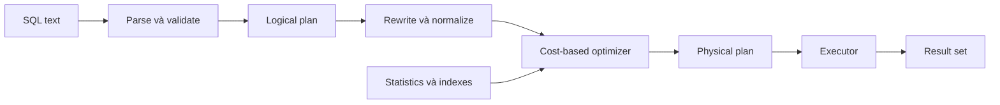
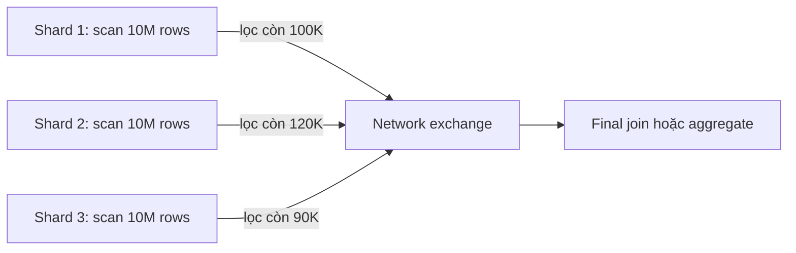

## Mục lục

- [1. Câu hỏi phỏng vấn](#1-câu-hỏi-phỏng-vấn)
- [2. Câu trả lời mẫu trong 30 giây](#2-câu-trả-lời-mẫu-trong-30-giây)
- [3. Kết luận từng phát biểu](#3-kết-luận-từng-phát-biểu)
- [4. Ba loại thứ tự thường bị trộn lẫn](#4-ba-loại-thứ-tự-thường-bị-trộn-lẫn)
- [5. Thứ tự xử lý logic của SELECT](#5-thứ-tự-xử-lý-logic-của-select)
- [6. Optimizer không nhất thiết chạy theo thứ tự logic](#6-optimizer-không-nhất-thiết-chạy-theo-thứ-tự-logic)
- [7. WHERE và HAVING: lọc dòng hay lọc nhóm](#7-where-và-having-lọc-dòng-hay-lọc-nhóm)
- [8. Đưa filter vào ON có nhanh hơn WHERE không](#8-đưa-filter-vào-on-có-nhanh-hơn-where-không)
- [9. INNER JOIN: ON và WHERE thường tương đương](#9-inner-join-on-và-where-thường-tương-đương)
- [10. OUTER JOIN: ON và WHERE có thể trả kết quả khác nhau](#10-outer-join-on-và-where-có-thể-trả-kết-quả-khác-nhau)
- [11. Filter sớm thực sự có nghĩa là gì](#11-filter-sớm-thực-sự-có-nghĩa-là-gì)
- [12. Predicate pushdown trong distributed system](#12-predicate-pushdown-trong-distributed-system)
- [13. PostgreSQL và MySQL xử lý như thế nào](#13-postgresql-và-mysql-xử-lý-như-thế-nào)
- [14. Cách kiểm chứng bằng EXPLAIN ANALYZE](#14-cách-kiểm-chứng-bằng-explain-analyze)
- [15. Bài thực hành hoàn chỉnh](#15-bài-thực-hành-hoàn-chỉnh)
- [16. Bộ câu hỏi đào sâu](#16-bộ-câu-hỏi-đào-sâu)
- [17. Rubric chấm điểm ứng viên](#17-rubric-chấm-điểm-ứng-viên)
- [18. Những câu trả lời là dấu hiệu cảnh báo](#18-những-câu-trả-lời-là-dấu-hiệu-cảnh-báo)
- [19. Checklist tối ưu query thực tế](#19-checklist-tối-ưu-query-thực-tế)
- [20. Cheat sheet](#20-cheat-sheet)
- [21. Tài liệu liên quan](#21-tài-liệu-liên-quan)
- [22. Tài liệu tham khảo](#22-tài-liệu-tham-khảo)

---

## 1. Câu hỏi phỏng vấn

### 1.1. Phiên bản ngắn để hỏi trực tiếp

> Một người đưa ra các nhận định sau:
>
> 1. SQL không thực thi theo thứ tự được viết; nó chạy `FROM/JOIN` trước, sau đó `WHERE`, `GROUP BY`, `HAVING`, `SELECT`...
> 2. Dùng `WHERE` luôn nhanh hơn `HAVING` vì `WHERE` lọc trước `GROUP BY`.
> 3. Khi join nhiều bảng, nên đặt toàn bộ filter trong `ON` thay vì `WHERE`; như vậy database lọc ngay trong lúc join và query sẽ nhanh hơn rất nhiều.
> 4. Trong distributed system, cần loại dữ liệu tại máy chứa dữ liệu trước khi truyền qua network.
>
> Những nhận định trên đúng hay sai? Hãy phân biệt **thứ tự xử lý logic** với **thứ tự thực thi vật lý**, giải thích sự khác nhau giữa `WHERE`, `HAVING`, `ON`, và cho biết cách kiểm chứng kết luận về hiệu năng trên PostgreSQL hoặc MySQL.

### 1.2. Phiên bản có code dành cho ứng viên Mid/Senior

Cho hai bảng:

```sql
CREATE TABLE customers (
    id          BIGINT PRIMARY KEY,
    name        VARCHAR(100) NOT NULL,
    region      VARCHAR(20) NOT NULL,
    active      BOOLEAN NOT NULL
);

CREATE TABLE orders (
    id          BIGINT PRIMARY KEY,
    customer_id BIGINT NOT NULL,
    status      VARCHAR(20) NOT NULL,
    amount      DECIMAL(18, 2) NOT NULL,
    created_at  TIMESTAMP NOT NULL,
    CONSTRAINT fk_orders_customer
        FOREIGN KEY (customer_id) REFERENCES customers(id)
);
```

So sánh các cặp query sau.

**Cặp A — `HAVING` và `WHERE`:**

```sql
-- A1
SELECT customer_id, status, COUNT(*) AS order_count
FROM orders
GROUP BY customer_id, status
HAVING status = 'paid';

-- A2
SELECT customer_id, status, COUNT(*) AS order_count
FROM orders
WHERE status = 'paid'
GROUP BY customer_id, status;
```

**Cặp B — `INNER JOIN`:**

```sql
-- B1
SELECT c.id, c.name, o.id AS order_id
FROM customers c
JOIN orders o
  ON o.customer_id = c.id
 AND o.status = 'paid';

-- B2
SELECT c.id, c.name, o.id AS order_id
FROM customers c
JOIN orders o
  ON o.customer_id = c.id
WHERE o.status = 'paid';
```

**Cặp C — `LEFT JOIN`:**

```sql
-- C1
SELECT c.id, c.name, o.id AS order_id
FROM customers c
LEFT JOIN orders o
  ON o.customer_id = c.id
 AND o.status = 'paid';

-- C2
SELECT c.id, c.name, o.id AS order_id
FROM customers c
LEFT JOIN orders o
  ON o.customer_id = c.id
WHERE o.status = 'paid';
```

Yêu cầu ứng viên trả lời:

1. Mỗi cặp có luôn trả cùng kết quả không?
2. Cặp nào có khả năng sinh cùng execution plan?
3. Có thể kết luận query nào nhanh hơn chỉ bằng vị trí của predicate không?
4. Predicate nào có thể được đẩy xuống table/index scan?
5. Điều gì thay đổi nếu `orders` nằm trên shard hoặc remote data source?

> [!IMPORTANT]
> Mục tiêu của câu hỏi không phải bắt ứng viên học thuộc một danh sách thứ tự. Mục tiêu là kiểm tra ứng viên có tách được **ngữ nghĩa SQL**, **optimizer rewrite**, **execution plan**, và **chi phí phân tán** hay không.

---

## 2. Câu trả lời mẫu trong 30 giây

> SQL có ba thứ tự khác nhau: thứ tự cú pháp ta viết, thứ tự xử lý logic dùng để định nghĩa kết quả, và execution plan vật lý do optimizer chọn. `FROM/JOIN → WHERE → GROUP BY → HAVING → SELECT → ORDER BY → LIMIT` là mô hình logic, không phải cam kết rằng database vật lý phải tạo toàn bộ kết quả join rồi mới lọc.
>
> `WHERE` lọc row trước aggregation; `HAVING` lọc group sau aggregation. Điều kiện trên dữ liệu gốc nên đặt ở `WHERE`, còn điều kiện như `COUNT(*) > 10` phải đặt ở `HAVING`. Tuy nhiên optimizer có thể tự đẩy một số predicate xuống sớm nên không được nói `WHERE` luôn nhanh hơn.
>
> Với `INNER JOIN`, một predicate thông thường đặt trong `ON` hoặc `WHERE` thường tương đương và PostgreSQL/MySQL thường tạo cùng plan. Với `LEFT/RIGHT/FULL JOIN`, vị trí predicate có thể thay đổi kết quả vì `ON` quyết định row nào match, còn `WHERE` lọc kết quả sau khi outer join đã bổ sung `NULL`.
>
> Trong hệ phân tán, lọc trước khi truyền dữ liệu là đúng và được gọi là predicate pushdown, nhưng việc chỉ chuyển predicate từ `WHERE` sang `ON` không đảm bảo pushdown. Phải dùng `EXPLAIN`/`EXPLAIN ANALYZE` để xem filter nằm ở đâu, scan bao nhiêu row và có network exchange hay không.

---

## 3. Kết luận từng phát biểu

| Phát biểu | Kết luận | Giải thích ngắn |
|---|---|---|
| Thứ tự viết SQL khác thứ tự xử lý logic | **Đúng** | `SELECT` được viết trước nhưng nguồn dữ liệu từ `FROM` phải được xác định về mặt logic trước. |
| SQL vật lý chắc chắn chạy `FROM → WHERE → GROUP BY...` | **Sai** | Optimizer có thể đổi join order, dùng index, đẩy predicate, gộp subquery hoặc thực hiện partial aggregation. |
| `WHERE` lọc row trước `GROUP BY` | **Đúng về logic** | Row bị loại ở `WHERE` không đi vào aggregate. |
| `WHERE` luôn nhanh hơn `HAVING` | **Sai vì quá tuyệt đối** | Tùy predicate, plan và khả năng rewrite. Aggregate predicate không thể chuyển xuống `WHERE`. |
| Nên đặt mọi filter vào `JOIN ON` | **Sai** | `ON` và `WHERE` có vai trò ngữ nghĩa khác nhau; với outer join, chuyển vị trí có thể làm sai kết quả. |
| Với `INNER JOIN`, filter trong `ON` luôn nhanh hơn | **Thường sai** | Hai cách thường được chuẩn hóa thành cùng logical/physical plan. |
| Với `LEFT JOIN`, filter trong `ON` và `WHERE` giống nhau | **Sai** | `ON` giữ row bên trái không match; `WHERE` có thể loại các row được bổ sung `NULL`. |
| Database luôn materialize một bảng join khổng lồ rồi mới lọc | **Sai** | “Bảng trung gian” là mô hình logic; executor thường pipeline row và áp dụng filter ở scan/join node. |
| Lọc dữ liệu trước khi truyền qua network thường có lợi | **Đúng** | Giảm bytes, serialization, shuffle và memory ở node nhận. |
| Viết filter trong `ON` đảm bảo remote pushdown | **Sai** | Pushdown phụ thuộc optimizer, connector, expression, join type và capability của remote source. |
| `EXPLAIN ANALYZE` là cách kiểm chứng | **Đúng** | Nó cho biết plan thực tế, row count, loops và thời gian; nhưng chính nó thực thi query. |

> [!NOTE]
> Câu mở đầu kiểu “không biết điều này thì bạn kém system design” là câu gây chú ý, không phải tiêu chuẩn đánh giá chuyên môn. Đây chủ yếu là kiến thức về relational semantics, query optimizer và distributed query execution.

---

## 4. Ba loại thứ tự thường bị trộn lẫn

### 4.1. Thứ tự cú pháp — thứ tự ta viết

```sql
SELECT      ...
FROM        ...
JOIN        ... ON ...
WHERE       ...
GROUP BY    ...
HAVING      ...
ORDER BY    ...
LIMIT       ...;
```

Parser cần câu lệnh tuân theo grammar của hệ quản trị. Không thể tùy ý chuyển `WHERE` lên trước `FROM`.

### 4.2. Thứ tự xử lý logic — định nghĩa kết quả

Một mô hình đơn giản:

```text
FROM / JOIN / ON
        ↓
WHERE
        ↓
GROUP BY + aggregate
        ↓
HAVING
        ↓
Window functions
        ↓
SELECT / projection
        ↓
DISTINCT
        ↓
Set operations
        ↓
ORDER BY
        ↓
LIMIT / OFFSET / FETCH
```

Mô hình này giúp trả lời các câu hỏi về **ngữ nghĩa**:

- Vì sao không dùng `COUNT(*)` trong `WHERE`?
- Vì sao filter bên phải của `LEFT JOIN` trong `ON` khác `WHERE`?
- Vì sao window function thường phải được bọc trong subquery nếu muốn lọc theo kết quả?
- Vì sao output alias thường dùng được trong `ORDER BY` nhưng không dùng được trong `WHERE`?

### 4.3. Thứ tự thực thi vật lý — plan mà database thật sự chạy

Ví dụ query được viết như sau:

```sql
SELECT c.region, SUM(o.amount) AS revenue
FROM customers c
JOIN orders o ON o.customer_id = c.id
WHERE o.status = 'paid'
  AND o.created_at >= TIMESTAMP '2026-01-01 00:00:00'
GROUP BY c.region;
```

Một physical plan hợp lý có thể là:

```text
Aggregate theo c.region
└── Hash Join theo customer_id
    ├── Scan customers
    └── Index/Range Scan orders
        ├── status = 'paid'
        └── created_at >= 2026-01-01
```

Predicate trong `WHERE` đã được gắn xuống scan của `orders`, dù theo thứ tự logic `WHERE` đứng sau `FROM/JOIN`.



> [!IMPORTANT]
> Khi nói “SQL chạy theo thứ tự”, phải hỏi lại: **thứ tự cú pháp, thứ tự logic hay thứ tự vật lý?** Nếu không tách ba khái niệm này, mọi kết luận hiệu năng phía sau rất dễ sai.

---

## 5. Thứ tự xử lý logic của SELECT

### 5.1. `FROM`, `JOIN` và `ON`

`FROM` xác định các nguồn row. `JOIN` kết hợp nguồn row. `ON` xác định cặp row nào được xem là match.

```sql
FROM customers c
JOIN orders o ON o.customer_id = c.id
```

Với `INNER JOIN`, chỉ các cặp match được giữ. Với `LEFT JOIN`, mỗi row bên trái phải xuất hiện ít nhất một lần; nếu không có match, các cột bên phải được bổ sung `NULL`.

### 5.2. `WHERE`

`WHERE` loại từng row khỏi virtual table do `FROM/JOIN` sinh ra.

```sql
WHERE o.status = 'paid'
```

Row bị loại ở đây không được nhìn thấy bởi `GROUP BY`, aggregate hoặc window function phía sau.

### 5.3. `GROUP BY` và aggregate

```sql
GROUP BY customer_id
```

Các row còn lại được chia thành group. Aggregate như `COUNT`, `SUM`, `AVG`, `MIN`, `MAX` được tính trên mỗi group.

### 5.4. `HAVING`

```sql
HAVING COUNT(*) >= 10
```

`HAVING` loại group. Nó có thể tham chiếu aggregate vì aggregate đã được xác định tại giai đoạn này.

### 5.5. Window function

Window function nhìn thấy virtual table sau `WHERE`, grouping, aggregate và `HAVING`.

```sql
ROW_NUMBER() OVER (
    PARTITION BY region
    ORDER BY revenue DESC
)
```

Do đó không thể dùng trực tiếp window function trong `WHERE` của cùng query block:

```sql
-- Không hợp lệ trong PostgreSQL/MySQL
SELECT
    customer_id,
    ROW_NUMBER() OVER (ORDER BY amount DESC) AS rn
FROM orders
WHERE rn <= 10;
```

Phải tạo một query block mới:

```sql
SELECT *
FROM (
    SELECT
        customer_id,
        amount,
        ROW_NUMBER() OVER (ORDER BY amount DESC) AS rn
    FROM orders
) ranked
WHERE rn <= 10;
```

### 5.6. `SELECT`, `DISTINCT`, `ORDER BY`, `LIMIT`

`SELECT` tạo output expressions và aliases. `DISTINCT` loại output row trùng. `ORDER BY` sắp xếp. `LIMIT/OFFSET/FETCH` chọn một phần kết quả.

```sql
SELECT SUM(amount) AS revenue
FROM orders
ORDER BY revenue DESC;
```

`ORDER BY` có thể dùng `revenue` vì đây là output alias.

### 5.7. Khác biệt alias giữa PostgreSQL và MySQL

| Vị trí dùng output alias | PostgreSQL | MySQL 8.4 | Khuyến nghị portable |
|---|:---:|:---:|---|
| `WHERE` | Không | Không | Lặp expression hoặc dùng subquery/CTE. |
| `GROUP BY` | Có hỗ trợ trong nhiều trường hợp | Có | Ưu tiên expression/cột rõ ràng khi cần portable tuyệt đối. |
| `HAVING` | Thông thường không dùng output alias | Có hỗ trợ alias | Dùng lại aggregate expression để tránh phụ thuộc dialect. |
| `ORDER BY` | Có | Có | Có thể dùng alias. |

Ví dụ portable:

```sql
SELECT customer_id, SUM(amount) AS revenue
FROM orders
GROUP BY customer_id
HAVING SUM(amount) > 1000000
ORDER BY revenue DESC;
```

> [!NOTE]
> Danh sách thứ tự logic là mô hình để hiểu scope và semantics. Một số chi tiết như output alias, functional dependency, `DISTINCT ON`, `QUALIFY`, set operations và locking clause khác nhau theo dialect.

---

## 6. Optimizer không nhất thiết chạy theo thứ tự logic

### 6.1. SQL là ngôn ngữ khai báo

Khi viết SQL, ta mô tả **kết quả cần có**, không viết từng instruction cho CPU như một chương trình imperative.

Optimizer được phép chọn bất kỳ plan nào nếu plan đó bảo toàn ngữ nghĩa, bao gồm:

- Đổi thứ tự `INNER JOIN`.
- Chọn `Nested Loop`, `Hash Join` hoặc `Merge Join` tùy engine.
- Dùng table scan, index scan, index-only/covering scan hoặc bitmap scan.
- Đẩy predicate xuống scan.
- Suy diễn predicate từ equality.
- Gộp view, derived table, subquery hoặc CTE khi an toàn.
- Chuyển semi-join/anti-join sang thuật toán vật lý phù hợp.
- Chuyển outer join thành inner join khi `WHERE` null-reject các row bổ sung `NULL`.
- Thực hiện partial/local aggregation trước final aggregation trong engine phân tán.
- Dừng sớm khi `LIMIT`, semi-join hoặc anti-join cho phép.

### 6.2. Logical intermediate table không đồng nghĩa materialization

Mô hình logic nói `FROM/JOIN` tạo một virtual table. Điều đó **không có nghĩa** executor bắt buộc phải:

1. Đọc toàn bộ mọi bảng.
2. Tạo Cartesian product khổng lồ.
3. Ghi bảng trung gian ra memory/disk.
4. Sau đó mới chạy `WHERE`.

Executor thường dùng iterator/pipeline:

```text
Parent gọi child để xin row tiếp theo
    ↓
Child scan/index chỉ trả row phù hợp
    ↓
Join node kết hợp row khi cần
    ↓
Aggregate tiêu thụ output của join
```

Một số operator là **blocking operator**, ví dụ sort hoặc hash aggregate có thể phải đọc nhiều/toàn bộ input trước khi trả output. Nhưng filter và nhiều scan/join có thể pipeline.

### 6.3. Predicate pushdown

Query:

```sql
SELECT *
FROM customers c
JOIN orders o ON o.customer_id = c.id
WHERE c.region = 'VN'
  AND o.status = 'paid';
```

Optimizer có thể biến đổi về mặt ý tưởng thành:

```text
Join(
    Filter(customers, region = 'VN'),
    Filter(orders, status = 'paid'),
    customers.id = orders.customer_id
)
```

Nếu có index phù hợp, filter còn có thể trở thành access condition:

```sql
CREATE INDEX idx_customers_region_id
    ON customers(region, id);

CREATE INDEX idx_orders_status_customer
    ON orders(status, customer_id);
```

### 6.4. Join reordering

Với nhiều `INNER JOIN`, thứ tự viết không nhất thiết là thứ tự chạy:

```sql
SELECT ...
FROM large_a a
JOIN large_b b ON b.a_id = a.id
JOIN tiny_c  c ON c.id = b.c_id
WHERE c.type = 'VIP';
```

Nếu `tiny_c` sau filter chỉ còn 10 row, optimizer có thể bắt đầu từ `tiny_c`, tìm các row `large_b` liên quan, rồi mới truy cập `large_a`.

Outer join hạn chế khả năng reorder vì phải bảo toàn row ở một phía. `FULL OUTER JOIN` thường ràng buộc mạnh hơn `LEFT JOIN`; MySQL không hỗ trợ trực tiếp `FULL OUTER JOIN`, còn PostgreSQL có hỗ trợ.

### 6.5. Optimizer không phải phép màu

Optimizer có thể chọn plan tệ khi:

- Statistics cũ hoặc thiếu.
- Data skew mạnh nhưng histogram/statistics không mô tả được.
- Predicate không sargable.
- Dùng function/cast làm mất khả năng dùng index.
- Correlation giữa nhiều cột không được thống kê.
- Prepared statement dùng generic plan không phù hợp với parameter cụ thể.
- Derived table/CTE/view bị materialize.
- Predicate có volatile/nondeterministic function.
- Connector hoặc remote source không hỗ trợ pushdown.
- Số lượng join quá lớn khiến optimizer phải giới hạn không gian tìm kiếm.

Vì vậy, “optimizer sẽ tự lo hết” cũng sai như “database luôn chạy theo thứ tự logic”.

---

## 7. WHERE và HAVING: lọc dòng hay lọc nhóm

### 7.1. Quy tắc ngữ nghĩa

| Tiêu chí | `WHERE` | `HAVING` |
|---|---|---|
| Đơn vị bị lọc | Row | Group |
| Thời điểm logic | Trước grouping/aggregate | Sau grouping/aggregate |
| Dùng aggregate trực tiếp | Không | Có |
| Trường hợp điển hình | `status = 'paid'` | `COUNT(*) >= 10` |
| Có thể giảm input cho aggregate | Có | Chỉ khi optimizer chứng minh predicate có thể push xuống |

### 7.2. Điều kiện trên row nên đặt trong WHERE

Không nên diễn đạt điều kiện row bằng `HAVING` nếu có thể viết rõ bằng `WHERE`:

```sql
-- Có thể hợp lệ nhưng diễn đạt ý định kém rõ ràng
SELECT customer_id, status, COUNT(*) AS order_count
FROM orders
GROUP BY customer_id, status
HAVING status = 'paid';
```

Nên viết:

```sql
SELECT customer_id, status, COUNT(*) AS order_count
FROM orders
WHERE status = 'paid'
GROUP BY customer_id, status;
```

Lợi ích:

- Đúng vai trò ngữ nghĩa của `WHERE`.
- Cho optimizer cơ hội rõ ràng để dùng index/partition pruning.
- Không phụ thuộc vào việc engine có rewrite `HAVING` xuống scan hay không.
- Người review biết ngay filter áp dụng lên row trước khi aggregate.

### 7.3. Điều kiện aggregate phải đặt trong HAVING

```sql
SELECT customer_id, COUNT(*) AS paid_order_count
FROM orders
WHERE status = 'paid'
GROUP BY customer_id
HAVING COUNT(*) >= 10;
```

Hai filter làm hai việc khác nhau:

1. `WHERE status = 'paid'`: chỉ đưa order đã thanh toán vào group.
2. `HAVING COUNT(*) >= 10`: chỉ giữ customer có ít nhất 10 order đã thanh toán.

Không thể viết:

```sql
-- Không hợp lệ
SELECT customer_id, COUNT(*)
FROM orders
WHERE COUNT(*) >= 10
GROUP BY customer_id;
```

### 7.4. WHERE không luôn nhanh hơn HAVING

Câu “`WHERE` luôn nhanh hơn `HAVING`” sai vì:

1. Có predicate chỉ tồn tại sau aggregate, nên không có phiên bản `WHERE` tương đương.
2. Optimizer có thể đẩy predicate trên grouping key từ `HAVING` xuống scan.
3. Với bảng rất nhỏ, khác biệt có thể không đáng kể.
4. Query có thể bị chi phối bởi join, sort, disk spill, network hoặc output transfer thay vì filter.
5. Hai query tưởng tương đương có thể thực ra tính trên tập dữ liệu khác nhau.

Ví dụ optimizer **có thể** đẩy:

```sql
SELECT customer_id, COUNT(*)
FROM orders
GROUP BY customer_id
HAVING customer_id BETWEEN 1000 AND 2000;
```

Predicate chỉ phụ thuộc grouping key `customer_id`. PostgreSQL thường có thể đặt nó ở scan bên dưới aggregate. MySQL có các rewrite/pushdown riêng, nhưng không nên dựa vào mọi version và mọi query shape đều làm giống nhau.

### 7.5. Ví dụ dễ trả lời sai

Bài toán: customer có ít nhất 10 order, và tổng doanh thu của **các order paid trong năm 2026** lớn hơn 100 triệu.

```sql
SELECT
    customer_id,
    COUNT(*) AS paid_orders,
    SUM(amount) AS revenue
FROM orders
WHERE status = 'paid'
  AND created_at >= TIMESTAMP '2026-01-01 00:00:00'
  AND created_at <  TIMESTAMP '2027-01-01 00:00:00'
GROUP BY customer_id
HAVING COUNT(*) >= 10
   AND SUM(amount) > 100000000;
```

Nếu đưa điều kiện `status/date` ra ngoài một subquery aggregate không đúng chỗ, kết quả có thể chuyển từ “aggregate order paid năm 2026” thành “aggregate toàn bộ order rồi mới chọn customer có thuộc tính nào đó”. Luôn xác định chính xác **tập row đầu vào của aggregate**.

### 7.6. Lỗi portability với GROUP BY

Query sau có thể bị từ chối trên PostgreSQL và trên MySQL khi `ONLY_FULL_GROUP_BY` bật:

```sql
SELECT customer_id, COUNT(*)
FROM orders
GROUP BY customer_id
HAVING status = 'paid';
```

`status` không nằm trong `GROUP BY`, không nằm trong aggregate, và không có một giá trị duy nhất cho mỗi group. Query đúng là dùng `WHERE status = 'paid'` hoặc thêm `status` vào grouping nếu bài toán thật sự cần group theo status.

---

## 8. Đưa filter vào ON có nhanh hơn WHERE không

### 8.1. Phải xét đúng kết quả trước, performance sau

Hai câu hỏi phải theo thứ tự:

1. Chuyển predicate có giữ nguyên kết quả không?
2. Nếu giữ nguyên kết quả, execution plan có khác không?

Không được tối ưu một query thành query nhanh hơn nhưng trả sai dữ liệu.

### 8.2. Vai trò nên dùng trong code review

- `ON`: mô tả điều kiện match giữa hai input của join; với outer join, đặt thêm điều kiện ở đây khi muốn giới hạn row bên phải được match nhưng vẫn giữ row được bảo toàn.
- `WHERE`: mô tả điều kiện row cuối của query block phải thỏa.
- `HAVING`: mô tả điều kiện group sau aggregate phải thỏa.

Ví dụ dễ đọc:

```sql
SELECT c.id, c.name, o.id
FROM customers c
JOIN orders o
  ON o.customer_id = c.id
WHERE c.region = 'VN'
  AND o.status = 'paid';
```

Không cần nhét mọi predicate vào `ON` để “giúp optimizer”. PostgreSQL và MySQL đều có khả năng phân tích predicate và đặt nó ở plan node phù hợp khi transformation là an toàn.

### 8.3. Vị trí trong SQL text không phải vị trí trong plan

Predicate nằm ở `WHERE` có thể xuất hiện trong plan dưới dạng:

- PostgreSQL: `Index Cond`, `Filter`, `Recheck Cond`, `Join Filter`.
- MySQL: index lookup/range, `Filter`, `attached_condition`, `Using index condition`, `Using where`.
- Distributed engine: scan filter tại worker, connector predicate, partition filter, dynamic filter.

Ngược lại, predicate viết trong `ON` vẫn có thể chỉ được kiểm tra ở join node nếu nó cần cột của cả hai phía hoặc không thể đẩy xuống an toàn.

---

## 9. INNER JOIN: ON và WHERE thường tương đương

### 9.1. Hai query cùng ngữ nghĩa

Với predicate thông thường, deterministic:

```sql
-- Filter trong ON
SELECT c.id, c.name, o.id
FROM customers c
INNER JOIN orders o
  ON o.customer_id = c.id
 AND o.status = 'paid';
```

```sql
-- Filter trong WHERE
SELECT c.id, c.name, o.id
FROM customers c
INNER JOIN orders o
  ON o.customer_id = c.id
WHERE o.status = 'paid';
```

Cả hai chỉ trả cặp `customer-order` thỏa đồng thời:

```text
o.customer_id = c.id AND o.status = 'paid'
```

Optimizer thường normalize chúng thành cùng một tập predicate và có thể tạo cùng plan.

### 9.2. Cùng kết quả không có nghĩa chắc chắn cùng performance

Trong đa số query đơn giản, plan giống nhau. Nhưng không nên biến “thường” thành “luôn”, vì còn phụ thuộc:

- Version và engine.
- View/derived table/CTE boundary.
- Security barrier hoặc row-level security.
- Volatile/nondeterministic function.
- UDF/stored function và side effect.
- Collation, implicit cast hoặc expression đặc biệt.
- Hint, optimizer switch và prepared plan.

Đối với code ứng dụng bình thường, hãy chọn vị trí theo ý nghĩa và readability; dùng plan để xử lý ngoại lệ.

### 9.3. Predicate tham chiếu cả hai bảng

```sql
SELECT ...
FROM products p
JOIN promotions x
  ON x.category_id = p.category_id
WHERE p.price BETWEEN x.min_price AND x.max_price;
```

Predicate `p.price BETWEEN x.min_price AND x.max_price` cần giá trị từ cả hai phía. Nó không thể trở thành filter độc lập chỉ trên `products` hoặc chỉ trên `promotions`; thường phải được đánh giá tại join hoặc bằng một access path phụ thuộc row phía ngoài.

### 9.4. Thứ tự viết nhiều INNER JOIN

```sql
FROM a
JOIN b ON b.a_id = a.id
JOIN c ON c.b_id = b.id
WHERE c.type = 'small-selective-set'
```

Không nên giả định database phải join `a → b → c`. Optimizer có thể bắt đầu từ `c` nếu filter rất selective, sau đó tìm `b`, rồi `a`. PostgreSQL và MySQL đều có cơ chế lựa chọn join order; outer join sẽ giới hạn mức tự do này.

---

## 10. OUTER JOIN: ON và WHERE có thể trả kết quả khác nhau

### 10.1. Dữ liệu ví dụ

```text
customers
┌────┬───────┐
│ id │ name  │
├────┼───────┤
│ 1  │ An    │
│ 2  │ Bình  │
│ 3  │ Chi   │
└────┴───────┘

orders
┌─────┬─────────────┬───────────┐
│ id  │ customer_id │ status    │
├─────┼─────────────┼───────────┤
│ 101 │ 1           │ paid      │
│ 102 │ 1           │ cancelled │
│ 103 │ 2           │ cancelled │
└─────┴─────────────┴───────────┘
```

### 10.2. Filter bên phải trong ON

```sql
SELECT c.id, c.name, o.id AS paid_order_id
FROM customers c
LEFT JOIN orders o
  ON o.customer_id = c.id
 AND o.status = 'paid';
```

Kết quả:

```text
1 | An   | 101
2 | Bình | NULL
3 | Chi  | NULL
```

Ý nghĩa: “Lấy **tất cả customer**, và gắn order `paid` nếu có.”

- Bình có order nhưng không có order `paid` → vẫn được giữ.
- Chi không có order nào → vẫn được giữ.

### 10.3. Filter bên phải trong WHERE

```sql
SELECT c.id, c.name, o.id AS paid_order_id
FROM customers c
LEFT JOIN orders o
  ON o.customer_id = c.id
WHERE o.status = 'paid';
```

Kết quả:

```text
1 | An | 101
```

Row của Bình và Chi có `o.status = NULL` sau outer join. Biểu thức `NULL = 'paid'` cho `UNKNOWN`, không phải `TRUE`, nên `WHERE` loại các row này.

Query có hiệu ứng tương đương một `INNER JOIN` cho điều kiện đó:

```sql
SELECT c.id, c.name, o.id AS paid_order_id
FROM customers c
JOIN orders o
  ON o.customer_id = c.id
WHERE o.status = 'paid';
```

PostgreSQL/MySQL có thể nhận ra null-rejecting predicate và thật sự đổi outer join thành inner join trong plan.

### 10.4. Bẫy filter bên trái trong ON của LEFT JOIN

Giả sử muốn chỉ lấy customer ở Việt Nam:

```sql
-- Sai ý định nếu muốn loại customer không thuộc VN
SELECT c.id, c.name, o.id
FROM customers c
LEFT JOIN orders o
  ON o.customer_id = c.id
 AND c.region = 'VN';
```

`customers` là phía được bảo toàn. Điều kiện `c.region = 'VN'` trong `ON` chỉ quyết định order có match hay không; nó **không loại customer ngoài VN**. Customer ngoài VN vẫn xuất hiện với cột `orders` là `NULL`.

Query đúng:

```sql
SELECT c.id, c.name, o.id
FROM customers c
LEFT JOIN orders o
  ON o.customer_id = c.id
WHERE c.region = 'VN';
```

Nếu vừa muốn chỉ lấy customer VN, vừa chỉ gắn order paid nhưng vẫn giữ customer chưa có order paid:

```sql
SELECT c.id, c.name, o.id AS paid_order_id
FROM customers c
LEFT JOIN orders o
  ON o.customer_id = c.id
 AND o.status = 'paid'
WHERE c.region = 'VN';
```

### 10.5. Bảng quyết định cho LEFT JOIN

| Yêu cầu | Vị trí predicate |
|---|---|
| Giữ mọi row bên trái, chỉ giới hạn row bên phải được match | Đặt predicate của bên phải trong `ON`. |
| Chỉ giữ row kết quả có bên phải thỏa điều kiện | Đặt trong `WHERE`, hoặc viết rõ `INNER JOIN`. |
| Lọc row bên trái | Đặt trong `WHERE` hoặc lọc bên trái trong subquery an toàn. |
| Tìm row bên trái không có match | `LEFT JOIN ... WHERE right.primary_key IS NULL`, hoặc ưu tiên `NOT EXISTS`. |
| Muốn giữ outer semantics | Kiểm tra mọi predicate null-rejecting trên phía không được bảo toàn. |

### 10.6. RIGHT JOIN và FULL OUTER JOIN

- `RIGHT JOIN`: logic đối xứng với `LEFT JOIN`; phía phải được bảo toàn.
- `FULL OUTER JOIN`: cả hai phía được bảo toàn; chuyển predicate giữa `ON` và `WHERE` càng dễ thay đổi kết quả.
- PostgreSQL hỗ trợ `FULL OUTER JOIN`.
- MySQL 8.4 không hỗ trợ trực tiếp `FULL OUTER JOIN`; thường phải mô phỏng bằng `UNION ALL` và anti-join phù hợp.

> [!WARNING]
> “Đặt filter trong `ON` để nhanh hơn” là lời khuyên nguy hiểm nhất khi query có outer join. Trước khi nói về milliseconds, phải chứng minh hai query trả cùng result set, kể cả row không match và giá trị `NULL`.

---

## 11. Filter sớm thực sự có nghĩa là gì

### 11.1. Mục tiêu thật sự

“Filter sớm” có nghĩa là giảm số row/byte mà các operator đắt tiền phía sau phải xử lý:

- Join.
- Sort.
- Hash table.
- Aggregate.
- Window function.
- Materialization.
- Disk spill.
- Serialization và network exchange.

Nó **không** có nghĩa đơn giản là đặt text predicate ở dòng SQL xuất hiện sớm hơn.

### 11.2. Các mức pushdown

```text
Query-level predicate
        ↓
Scan-level filter
        ↓
Index access condition
        ↓
Storage-engine condition
        ↓
Partition/shard pruning
        ↓
Remote-source predicate
```

Càng xuống thấp, càng có khả năng tránh đọc hoặc truyền dữ liệu. Nhưng mỗi mức có điều kiện áp dụng khác nhau.

### 11.3. Sargability quan trọng hơn vị trí ON/WHERE

Sargable predicate là predicate có thể dùng search argument của index.

Ví dụ index:

```sql
CREATE INDEX idx_orders_created_at ON orders(created_at);
```

Dễ dùng index range:

```sql
WHERE created_at >= TIMESTAMP '2026-01-01 00:00:00'
  AND created_at <  TIMESTAMP '2027-01-01 00:00:00'
```

Có thể làm mất khả năng dùng index thông thường:

```sql
WHERE EXTRACT(YEAR FROM created_at) = 2026;
```

MySQL thường gặp dạng:

```sql
WHERE YEAR(created_at) = 2026;
```

Giải pháp có thể là range predicate, expression/functional index phù hợp với engine, hoặc generated column có index. Chuyển expression này từ `WHERE` sang `ON` không tự làm nó sargable.

### 11.4. Selectivity và index

Filter không mặc định giúp query nhanh. Nếu `status = 'paid'` match 90% bảng, index đơn trên `status` có thể không tốt hơn sequential/table scan.

Optimizer cân nhắc:

- Tổng số row.
- Tỷ lệ row match.
- Row width.
- Clustering/locality.
- Random I/O và sequential I/O.
- Covering/index-only khả thi hay không.
- Cost của lookup về base table.
- Join order phía sau.

Composite index phải theo workload, không theo mẹo chung:

```sql
-- Có thể phù hợp cho filter status + khoảng thời gian,
-- sau đó cung cấp customer_id cho join/group.
CREATE INDEX idx_orders_status_created_customer
    ON orders(status, created_at, customer_id);
```

Index này không tự động tối ưu mọi query. Thứ tự cột phụ thuộc equality/range, sort/group, selectivity và engine.

### 11.5. Predicate không thể đẩy tùy ý

Ví dụ không thể đánh giá chỉ trên một bảng:

```sql
WHERE o.amount > c.credit_limit
```

Các trường hợp thường cản trở pushdown:

- Predicate cần cột từ nhiều input.
- Aggregate/window result chưa tồn tại.
- `LIMIT` trong derived table làm thay đổi tập row nếu đẩy filter vào.
- Nondeterministic/volatile function.
- Outer join cần bảo toàn row.
- UDF/stored function không chạy được ở storage/remote engine.
- Data type/collation semantics khác giữa coordinator và remote source.
- Materialization hoặc optimization fence.

---

## 12. Predicate pushdown trong distributed system

### 12.1. Phần đúng của nhận định ban đầu

Trong hệ phân tán, data transfer thường rất đắt vì có thêm:

- Serialization/deserialization.
- Network latency và bandwidth.
- Compression/decompression.
- Shuffle/repartition theo join key hoặc group key.
- Buffering và backpressure.
- Memory ở sender/receiver.
- Straggler khi một partition có data skew.

Nếu worker có thể loại 99% row trước network exchange, lợi ích có thể rất lớn.



Không pushdown:

```text
30 triệu row → network → coordinator filter → 310 nghìn row
```

Có pushdown:

```text
mỗi shard filter tại chỗ → tổng 310 nghìn row → network
```

### 12.2. Các tối ưu liên quan

| Tối ưu | Giảm chi phí gì |
|---|---|
| Predicate pushdown | Giảm row đọc/truyền. |
| Projection/column pruning | Giảm byte mỗi row. |
| Partition pruning | Không scan partition không liên quan. |
| Dynamic filtering | Dùng key từ một phía join để lọc scan phía kia lúc runtime. |
| Partial aggregation | Mỗi worker aggregate trước, chỉ gửi state/kết quả nhỏ. |
| Join pushdown | Thực hiện join tại remote source nếu source làm tốt hơn. |
| Bloom filter | Loại sớm key chắc chắn không match. |
| Co-located join | Tránh shuffle nếu hai bảng partition cùng key. |
| Broadcast join | Gửi bảng nhỏ tới worker thay vì shuffle cả hai bảng. |

### 12.3. Ví dụ partial aggregation

Bài toán tính doanh thu theo region trên nhiều shard.

Không tối ưu:

```text
Tất cả order row → coordinator → GROUP BY region
```

Tối ưu:

```text
Shard 1: SUM theo region ─┐
Shard 2: SUM theo region ─┼→ coordinator cộng partial sums
Shard 3: SUM theo region ─┘
```

Từ hàng triệu row qua network có thể giảm còn vài chục aggregate state.

### 12.4. Viết ON không đảm bảo pushdown

Query:

```sql
SELECT ...
FROM remote_customers c
JOIN remote_orders o
  ON o.customer_id = c.id
 AND o.status = 'paid';
```

Không đủ để kết luận filter chạy tại remote node. Có thể xảy ra một trong các plan:

1. Cả join và filter được remote source xử lý.
2. Chỉ `status = 'paid'` được push xuống remote scan; join chạy ở coordinator.
3. Hai bảng được tải về rồi join/filter ở coordinator.
4. Filter không push được vì function, cast hoặc connector limitation.

Phải xem distributed plan để tìm:

- `Remote Scan`/`Foreign Scan`.
- Remote SQL hoặc pushed predicates.
- Partition filters.
- `Exchange`, `Shuffle`, `Repartition`, `Gather`.
- Input/output rows và bytes ở mỗi stage.

### 12.5. Network là killer nhưng không phải lúc nào cũng là bottleneck

Query có thể bị chi phối bởi:

- Disk scan tại shard.
- CPU cho decompress/JSON/UDF.
- Hash join hoặc sort spill ra disk.
- Data skew làm một worker quá tải.
- Lock/transaction contention.
- Cardinality explosion do many-to-many join.
- Trả result set quá lớn về application.

Ứng viên Senior nên nói “đo bytes/rows giữa các stage” thay vì mặc định mọi query phân tán đều network-bound.

---

## 13. PostgreSQL và MySQL xử lý như thế nào

### 13.1. Điểm chung

Cả PostgreSQL và MySQL hiện đại đều có cost-based optimizer và có thể:

- Chọn access path/index.
- Chọn/reorder join trong giới hạn semantics.
- Áp dụng filter gần scan.
- Rewrite một số subquery/derived table.
- Simplify outer join khi predicate null-reject.
- Dùng statistics để ước lượng cardinality.
- Cung cấp `EXPLAIN` và `EXPLAIN ANALYZE`.

### 13.2. PostgreSQL

Các dấu hiệu thường gặp trong plan:

```text
Index Cond: (...)       -- predicate dùng để truy cập index
Filter: (...)           -- đọc row rồi kiểm tra predicate
Join Filter: (...)      -- predicate kiểm tra tại join node
Rows Removed by Filter  -- số row thực tế bị filter loại
Hash Cond: (...)        -- điều kiện hash join
Group Key: (...)        -- khóa aggregate
```

Ví dụ minh họa:

```text
HashAggregate
  Group Key: c.region
  -> Hash Join
       Hash Cond: (o.customer_id = c.id)
       -> Index Scan using idx_orders_status_created_customer on orders o
            Index Cond: (status = 'paid' AND created_at >= ...)
       -> Hash
            -> Seq Scan on customers c
```

Plan PostgreSQL là cây. Thường đọc từ node sâu nhất lên trên; child cung cấp row cho parent.

PostgreSQL có thể reorder inner joins. Outer joins hạn chế freedom vì row preservation. CTE side-effect-free dùng một lần thường có thể được fold/inlined ở các version hiện đại; `MATERIALIZED` có thể trở thành optimization fence.

### 13.3. MySQL 8.4

Các dấu hiệu thường gặp:

```text
Index lookup / Index range scan
Filter: (...)
Nested loop inner join
Nested loop left join
Inner hash join
Aggregate using temporary table
Table scan on <temporary>
```

Trong traditional `EXPLAIN`:

- `type`: `const`, `eq_ref`, `ref`, `range`, `index`, `ALL`...
- `possible_keys`, `key`, `key_len`.
- `rows`, `filtered`.
- `Extra`: `Using where`, `Using index`, `Using index condition`, `Using temporary`, `Using filesort`...

MySQL có **Index Condition Pushdown (ICP)**: nếu một phần `WHERE` có thể kiểm tra bằng cột trong secondary index, storage engine kiểm tra nó trước khi đọc full base-table row. Điều này có thể giảm I/O.

MySQL cũng hỗ trợ **Derived Condition Pushdown** cho các derived table đủ điều kiện. Ví dụ về mặt ý tưởng:

```sql
SELECT *
FROM (
    SELECT customer_id, SUM(amount) AS revenue
    FROM orders
    GROUP BY customer_id
) d
WHERE customer_id BETWEEN 1000 AND 2000;
```

Optimizer có thể đẩy predicate trên grouping key vào bên trong trước `GROUP BY`. Nhưng có giới hạn như nondeterministic expression, `LIMIT`, subquery trong condition, một số outer join và materialized CTE được tham chiếu nhiều lần.

### 13.4. So sánh nhanh

| Chủ đề | PostgreSQL | MySQL 8.4 |
|---|---|---|
| Plan thực tế | `EXPLAIN (ANALYZE, BUFFERS)` | `EXPLAIN ANALYZE`, output TREE |
| Scan toàn bảng | `Seq Scan` | `Table scan`, traditional type `ALL` |
| Filter dùng index | `Index Cond` | Index lookup/range; ICP có thể hiện `Using index condition` |
| Filter sau scan | `Filter` | `Filter`, `attached_condition`, `Using where` |
| Hash join | Có | Có trong MySQL 8.x khi phù hợp |
| Merge join | Có | Không phải lựa chọn join phổ biến/tương đương như PostgreSQL |
| FULL OUTER JOIN | Có | Không hỗ trợ trực tiếp |
| Output alias trong HAVING | Không nên dựa vào | Có hỗ trợ |
| Derived condition pushdown | Planner rewrite/inlining tùy query | Tính năng được tài liệu hóa, có optimizer switch/hint |
| Outer-to-inner simplification | Có thể | Có và được tài liệu hóa rõ với null-rejected condition |

> [!NOTE]
> Tên node khác nhau không làm thay đổi nguyên tắc: tìm nơi row được đọc, nơi predicate được áp dụng, số row đi qua mỗi node, và điểm xảy ra join/aggregate/sort.

---

## 14. Cách kiểm chứng bằng EXPLAIN ANALYZE

### 14.1. PostgreSQL

Chỉ xem estimated plan, không thực thi query:

```sql
EXPLAIN
SELECT ...;
```

Chạy thật và thu thập runtime statistics:

```sql
EXPLAIN (ANALYZE, BUFFERS, VERBOSE)
SELECT ...;
```

Nên nhìn:

1. `actual time`.
2. `actual rows` và `loops`.
3. Estimated `rows` so với actual rows.
4. `Index Cond` so với `Filter`.
5. `Rows Removed by Filter`.
6. `Buffers: shared hit/read`.
7. Join algorithm và child order.
8. Sort method, memory, disk spill.
9. Hash batches/memory.
10. Planning time và execution time.

> [!WARNING]
> `EXPLAIN ANALYZE` **thực thi** câu lệnh. Với `INSERT`, `UPDATE`, `DELETE` hoặc `MERGE`, side effect vẫn xảy ra. Nếu cần phân tích mà không giữ thay đổi, cân nhắc môi trường test/read replica hoặc transaction `BEGIN; EXPLAIN ANALYZE ...; ROLLBACK;` sau khi hiểu rõ tác động lock/trigger/external side effect.

### 14.2. MySQL 8.4

Estimated plan dạng tree:

```sql
EXPLAIN FORMAT=TREE
SELECT ...;
```

Plan và runtime thực tế:

```sql
EXPLAIN ANALYZE FORMAT=TREE
SELECT ...;
```

Hoặc:

```sql
EXPLAIN ANALYZE
SELECT ...;
```

MySQL 8.4 dùng TREE cho `EXPLAIN ANALYZE`. Nên nhìn:

1. Estimated `cost` và `rows`.
2. `actual time`.
3. Actual `rows` và `loops`.
4. Table scan hay index lookup/range.
5. Filter nằm trên iterator nào.
6. Nested-loop inner/left join hay hash join.
7. Temporary table, sort và aggregate.
8. Traditional `EXPLAIN`: `key`, `rows`, `filtered`, `Extra`.

### 14.3. Cách so sánh hai query đúng

Không được chỉ chạy mỗi query một lần rồi kết luận. Quy trình tối thiểu:

1. Chứng minh hai query trả cùng result set.
2. Dùng cùng schema, indexes, statistics và parameters.
3. Chạy `ANALYZE`/`ANALYZE TABLE` khi dữ liệu mới thay đổi lớn.
4. Lấy estimated plan của cả hai.
5. Lấy actual plan trong môi trường an toàn.
6. So scan rows, output rows, loops, buffers/I/O và spill; không chỉ nhìn tổng milliseconds.
7. Chạy nhiều lần để phân biệt cold cache và warm cache.
8. Đảo thứ tự chạy query để giảm bias cache.
9. Tránh trả result set khổng lồ về client khi chỉ muốn đo executor.
10. Test với data volume và data distribution gần production.

### 14.4. Điều gì chứng minh predicate đã được push xuống

**PostgreSQL:**

```text
Index Scan on orders
  Index Cond: (status = 'paid')
```

hoặc:

```text
Seq Scan on orders
  Filter: (status = 'paid')
```

Filter đã nằm tại scan node, dù là seq scan. Nếu nó nằm ở `Join Filter`, row có thể đã đi tới join node trước khi bị loại.

**MySQL:**

```text
Index lookup on orders using idx_status (status='paid')
```

hoặc traditional output có:

```text
key: idx_status
Extra: Using index condition
```

### 14.5. Đừng đọc plan chỉ bằng tên index

Query dùng index vẫn có thể chậm nếu:

- Index trả hàng triệu row.
- Mỗi row cần random lookup về heap/clustered record.
- Nested-loop inner side chạy hàng triệu `loops`.
- Cardinality estimate sai dẫn đến join algorithm/order tệ.
- Sort/aggregate spill ra disk.
- Result set quá lớn.

Query dùng sequential/table scan vẫn có thể là plan tốt nhất nếu phải đọc phần lớn bảng.

---

## 15. Bài thực hành hoàn chỉnh

### 15.1. Seed dữ liệu nhỏ để kiểm tra semantics

```sql
INSERT INTO customers (id, name, region, active) VALUES
    (1, 'An',   'VN', TRUE),
    (2, 'Bình', 'VN', TRUE),
    (3, 'Chi',  'SG', TRUE),
    (4, 'Dũng', 'VN', FALSE);

INSERT INTO orders (id, customer_id, status, amount, created_at) VALUES
    (101, 1, 'paid',      500000, '2026-01-10 10:00:00'),
    (102, 1, 'cancelled', 200000, '2026-01-11 10:00:00'),
    (103, 2, 'cancelled', 300000, '2026-02-01 10:00:00'),
    (104, 4, 'paid',      900000, '2025-12-01 10:00:00');
```

### 15.2. Bài 1 — dự đoán kết quả LEFT JOIN

```sql
-- Q1
SELECT c.id, c.name, o.id AS order_id
FROM customers c
LEFT JOIN orders o
  ON o.customer_id = c.id
 AND o.status = 'paid'
ORDER BY c.id, o.id;
```

```sql
-- Q2
SELECT c.id, c.name, o.id AS order_id
FROM customers c
LEFT JOIN orders o
  ON o.customer_id = c.id
WHERE o.status = 'paid'
ORDER BY c.id, o.id;
```

**Đáp án:**

```text
Q1:
1 | An   | 101
2 | Bình | NULL
3 | Chi  | NULL
4 | Dũng | 104

Q2:
1 | An   | 101
4 | Dũng | 104
```

### 15.3. Bài 2 — bẫy predicate bên trái trong ON

```sql
-- Q3
SELECT c.id, c.name, o.id AS order_id
FROM customers c
LEFT JOIN orders o
  ON o.customer_id = c.id
 AND c.region = 'VN'
ORDER BY c.id, o.id;
```

**Câu hỏi:** Chi có xuất hiện không?

**Đáp án:** Có. `customers` là phía được bảo toàn. `c.region = 'VN'` trong `ON` ngăn order match với Chi, nhưng không loại Chi khỏi kết quả.

Muốn loại customer ngoài VN:

```sql
SELECT c.id, c.name, o.id AS order_id
FROM customers c
LEFT JOIN orders o
  ON o.customer_id = c.id
WHERE c.region = 'VN'
ORDER BY c.id, o.id;
```

### 15.4. Bài 3 — WHERE và HAVING cùng tồn tại

Yêu cầu: tìm customer có ít nhất một order `paid` trong năm 2026 và tổng tiền paid lớn hơn 400.000.

```sql
SELECT
    customer_id,
    COUNT(*) AS paid_order_count,
    SUM(amount) AS paid_revenue
FROM orders
WHERE status = 'paid'
  AND created_at >= '2026-01-01 00:00:00'
  AND created_at <  '2027-01-01 00:00:00'
GROUP BY customer_id
HAVING COUNT(*) >= 1
   AND SUM(amount) > 400000;
```

**Đáp án trên seed data:** customer `1`.

### 15.5. Bài 4 — kiểm tra INNER JOIN ON vs WHERE

```sql
EXPLAIN
SELECT c.id, o.id
FROM customers c
JOIN orders o
  ON o.customer_id = c.id
 AND o.status = 'paid';
```

```sql
EXPLAIN
SELECT c.id, o.id
FROM customers c
JOIN orders o
  ON o.customer_id = c.id
WHERE o.status = 'paid';
```

Kỳ vọng trên PostgreSQL/MySQL hiện đại: plan thường giống hoặc tương đương về access path. Với data quá nhỏ, cả hai có thể table/seq scan; điều đó không chứng minh index vô dụng trên production.

### 15.6. Tạo index cho lab

```sql
CREATE INDEX idx_orders_status_customer
    ON orders(status, customer_id);

CREATE INDEX idx_orders_customer_status
    ON orders(customer_id, status);

CREATE INDEX idx_orders_status_created_customer
    ON orders(status, created_at, customer_id);
```

Không nên giữ cả ba index trong production chỉ vì lab. Chúng tăng:

- Dung lượng lưu trữ.
- Chi phí `INSERT/UPDATE/DELETE`.
- WAL/redo log.
- Buffer pool pressure.
- Thời gian maintenance.

Mục tiêu lab là xem workload khác nhau có thể chọn index khác nhau.

### 15.7. Sinh dữ liệu lớn trên PostgreSQL

```sql
INSERT INTO customers (id, name, region, active)
SELECT
    i,
    'customer-' || i,
    CASE
        WHEN i % 10 < 7 THEN 'VN'
        WHEN i % 10 < 9 THEN 'SG'
        ELSE 'US'
    END,
    i % 20 <> 0
FROM generate_series(1000, 101000) AS g(i);

INSERT INTO orders (id, customer_id, status, amount, created_at)
SELECT
    i + 1000000,
    1000 + (i % 100000),
    CASE
        WHEN i % 100 < 70 THEN 'paid'
        WHEN i % 100 < 90 THEN 'pending'
        ELSE 'cancelled'
    END,
    10000 + (i % 5000000),
    TIMESTAMP '2025-01-01 00:00:00'
        + (i % 730) * INTERVAL '1 day'
FROM generate_series(1, 2000000) AS g(i);

ANALYZE customers;
ANALYZE orders;
```

### 15.8. Sinh dữ liệu lớn trên MySQL 8.4

MySQL có thể dùng recursive CTE, nhưng recursion depth mặc định thường không đủ cho hàng triệu row. Trong lab nên tạo một bảng số hoặc cross join các digit set:

```sql
CREATE TEMPORARY TABLE digits (d INT PRIMARY KEY);
INSERT INTO digits VALUES (0),(1),(2),(3),(4),(5),(6),(7),(8),(9);

CREATE TEMPORARY TABLE numbers AS
SELECT
    d0.d
    + d1.d * 10
    + d2.d * 100
    + d3.d * 1000
    + d4.d * 10000
    + d5.d * 100000 AS n
FROM digits d0
CROSS JOIN digits d1
CROSS JOIN digits d2
CROSS JOIN digits d3
CROSS JOIN digits d4
CROSS JOIN digits d5;

INSERT INTO customers (id, name, region, active)
SELECT
    n + 1000,
    CONCAT('customer-', n + 1000),
    CASE
        WHEN MOD(n, 10) < 7 THEN 'VN'
        WHEN MOD(n, 10) < 9 THEN 'SG'
        ELSE 'US'
    END,
    MOD(n, 20) <> 0
FROM numbers
WHERE n < 100000;

INSERT INTO orders (id, customer_id, status, amount, created_at)
SELECT
    n + 1000000,
    1000 + MOD(n, 100000),
    CASE
        WHEN MOD(n, 100) < 70 THEN 'paid'
        WHEN MOD(n, 100) < 90 THEN 'pending'
        ELSE 'cancelled'
    END,
    10000 + MOD(n, 5000000),
    TIMESTAMP('2025-01-01 00:00:00')
        + INTERVAL MOD(n, 730) DAY
FROM numbers;

ANALYZE TABLE customers, orders;
```

Bảng `numbers` ở trên có tối đa một triệu row. Có thể thêm một digit nữa nếu máy lab đủ tài nguyên. Không chạy bulk seed trên production.

### 15.9. Bài benchmark WHERE vs HAVING

```sql
-- Phiên bản HAVING trên grouping key
SELECT customer_id, status, COUNT(*)
FROM orders
GROUP BY customer_id, status
HAVING status = 'paid';
```

```sql
-- Phiên bản WHERE
SELECT customer_id, status, COUNT(*)
FROM orders
WHERE status = 'paid'
GROUP BY customer_id, status;
```

Thực hiện:

```sql
-- PostgreSQL
EXPLAIN (ANALYZE, BUFFERS)
SELECT ...;
```

```sql
-- MySQL
EXPLAIN ANALYZE FORMAT=TREE
SELECT ...;
```

Không đặt trước kết luận. Ghi lại:

- Predicate nằm ở scan hay aggregate.
- Số row vào aggregate.
- Index nào được dùng.
- Temporary table/hash aggregate.
- Actual time và số loops.

### 15.10. Bài benchmark selectivity

So sánh:

```sql
WHERE status = 'paid'       -- khoảng 70% row trong dữ liệu mẫu
```

với:

```sql
WHERE status = 'cancelled'  -- khoảng 10% row
```

Cùng một index có thể được dùng cho giá trị hiếm nhưng bị bỏ qua cho giá trị phổ biến. Đây là cơ hội hỏi ứng viên về statistics, histogram, parameterized query và plan stability.

---

## 16. Bộ câu hỏi đào sâu

### 16.1. Vì sao SELECT alias không dùng được trong WHERE?

**Đáp án kỳ vọng:** `WHERE` thuộc giai đoạn logic trước khi select list tạo output alias. Dùng lại expression hoặc tạo query block mới bằng subquery/CTE. MySQL cũng không cho dùng select alias trong `WHERE`; MySQL có extension cho `HAVING`.

### 16.2. Có thể chuyển `HAVING COUNT(*) > 10` thành WHERE không?

**Đáp án kỳ vọng:** Không trực tiếp, vì `COUNT(*)` chỉ tồn tại sau grouping. Có thể dùng subquery/window hoặc rewrite bài toán theo cách khác, nhưng đó không phải cùng một `WHERE` trên base rows.

### 16.3. INNER JOIN filter trong ON và WHERE có luôn giống nhau không?

**Đáp án tốt:** Với predicate thông thường, deterministic trong một query block, chúng có cùng relational semantics và thường cùng plan. Tránh từ “luôn” vì có dialect, volatile function, optimizer fence, security/UDF và edge case.

### 16.4. Vì sao LEFT JOIN filter trong WHERE có thể thành INNER JOIN?

**Đáp án kỳ vọng:** Outer join tạo row có cột bên phải là `NULL` khi không match. Predicate như `right.status = 'paid'` trả `UNKNOWN` cho row đó, nên `WHERE` loại nó. Predicate null-reject mọi null-extended row, vì vậy optimizer có thể simplify thành inner join.

### 16.5. Đặt predicate của bảng trái trong ON của LEFT JOIN có lọc bảng trái không?

**Đáp án:** Không. Phía trái được bảo toàn. Predicate chỉ làm thay đổi khả năng match với bên phải. Muốn loại row trái phải dùng `WHERE` hoặc lọc input trái trong derived table khi semantics phù hợp.

### 16.6. Tại sao WHERE trước GROUP BY có thể không nhanh hơn nhiều?

**Đáp án tốt:** Predicate có thể match gần hết data; aggregate vẫn phải xử lý gần toàn bộ row; optimizer đã tự push predicate tương đương; bảng nhỏ; bottleneck nằm ở join/sort/network/output; hoặc index không selective.

### 16.7. Predicate ở WHERE nhưng plan vẫn table scan có phải optimizer sai không?

**Đáp án:** Không nhất thiết. Table scan có thể rẻ hơn nếu predicate match nhiều row, bảng nhỏ, index không covering, statistics cho thấy nhiều random lookup, hoặc không có index sargable.

### 16.8. Thứ tự điều kiện trong WHERE có quyết định thứ tự chạy không?

```sql
WHERE expensive_function(x)
  AND id = 42
```

**Đáp án tốt:** Không nên dựa vào thứ tự text để đảm bảo evaluation order hoặc short-circuit. Optimizer có thể reorder/simplify predicate khi semantics cho phép. Nếu function có side effect hoặc có thể lỗi, cần thiết kế expression/query an toàn thay vì dựa vào vị trí.

### 16.9. Filter trong subquery có luôn được đẩy ra/vào không?

**Đáp án:** Không. `LIMIT`, window function, aggregate, `DISTINCT`, materialization, volatile expression, outer join và connector limitation có thể ngăn rewrite. PostgreSQL có `MATERIALIZED`; MySQL có derived merge/condition pushdown với restrictions.

### 16.10. Network transfer có phải lúc nào cũng là chi phí lớn nhất?

**Đáp án:** Không. Phải xem bytes/rows và runtime theo stage. Disk scan, CPU, skew, spill, lock hoặc cardinality explosion có thể lớn hơn. Tuy vậy, predicate/projection/partial aggregate pushdown thường là tối ưu quan trọng trong distributed engine.

### 16.11. Làm sao biết remote predicate đã push xuống?

**Đáp án:** Xem distributed/foreign scan plan, remote SQL, pushed filters, partition filters và row/byte trước/sau exchange. Không suy luận chỉ từ SQL text.

### 16.12. Tại sao filter sớm đôi khi vẫn không giảm I/O?

**Đáp án:** Nếu không có index/partition pruning, engine vẫn phải scan mọi page rồi mới filter row. Filter giảm row đi lên operator sau nhưng không giảm số page đọc. PostgreSQL plan có thể hiện `Seq Scan + Filter`; MySQL có thể hiện `Table scan + Filter`.

### 16.13. `ON o.status = 'paid'` có dùng được index không?

**Đáp án:** Có thể, giống predicate tương đương trong `WHERE` của inner join. Khả năng dùng index phụ thuộc index, selectivity, join order, statistics và query shape, không phụ thuộc riêng từ khóa `ON`.

### 16.14. Có nên ép join order không?

**Đáp án tốt:** Chỉ sau khi chứng minh optimizer chọn plan xấu ổn định và đã xử lý statistics/index/query shape. PostgreSQL có cấu hình/hình thức giới hạn join reorder; MySQL có optimizer hints và `STRAIGHT_JOIN`. Hint tăng maintenance risk khi data distribution thay đổi.

### 16.15. Điều gì quan trọng hơn: filter row hay giảm column?

**Đáp án:** Cả hai. Predicate pushdown giảm số row; projection/column pruning giảm row width. Trong distributed/columnar system, chỉ đọc và truyền các cột cần thiết có thể tiết kiệm rất lớn ngay cả khi số row không đổi.

---

## 17. Rubric chấm điểm ứng viên

### 17.1. Thang điểm 100

| Hạng mục | Điểm tối đa | Tiêu chí |
|---|---:|---|
| Phân biệt ba loại thứ tự | 15 | Nói rõ syntax, logical processing và physical execution plan. |
| WHERE vs HAVING | 15 | Row vs group, aggregate predicate, không khẳng định “luôn nhanh hơn”. |
| INNER JOIN ON vs WHERE | 15 | Nhận ra thường tương đương và optimizer thường tạo cùng plan. |
| OUTER JOIN semantics | 20 | Giải thích null-extension, null-rejection và ví dụ trả kết quả khác nhau. |
| Optimizer/pushdown | 15 | Nêu predicate pushdown, join reorder, index/access path và giới hạn. |
| EXPLAIN/đo lường | 10 | Biết dùng PostgreSQL/MySQL EXPLAIN ANALYZE và đọc rows/loops/filter. |
| Distributed system | 10 | Nêu network/shuffle, local filter, projection/partial aggregate và kiểm tra plan. |

### 17.2. Đánh giá theo level

#### Junior — đạt nếu

- Biết `WHERE` trước `GROUP BY`, `HAVING` sau aggregate về mặt logic.
- Biết `COUNT(*)` không dùng trong `WHERE`.
- Biết `LEFT JOIN` giữ row bên trái.
- Không nhất thiết biết sâu về optimizer.

#### Mid-level — đạt nếu

- Phân biệt logical order và physical plan.
- Biết inner join `ON`/`WHERE` thường cùng kết quả và cùng plan.
- Dự đoán đúng kết quả hai query `LEFT JOIN`.
- Biết dùng `EXPLAIN ANALYZE` và xem index/filter/rows.
- Không đưa ra kết luận performance tuyệt đối.

#### Senior — đạt tốt nếu

- Giải thích null-rejecting predicate và outer-to-inner simplification.
- Nêu join reorder, cardinality estimation, selectivity, sargability và materialization boundary.
- Phân tích row flow/loops thay vì chỉ nhìn total time.
- Nêu predicate, projection, partition, dynamic filter và partial aggregate pushdown trong distributed plan.
- Nói rõ optimizer có thể sai và trình bày quy trình benchmark an toàn.

#### Staff/Principal — tín hiệu mạnh nếu

- Bắt đầu từ semantics và invariants trước performance.
- Phân tích trade-off giữa coordinator/worker, shuffle/broadcast/co-location và data skew.
- Nhắc tới plan stability, statistics, parameter sensitivity và observability theo stage.
- Biết rằng SQL text giống nhau không đảm bảo plan giống nhau giữa version, statistics hoặc parameter.
- Đề xuất guardrail: query regression tests, plan monitoring, production-like data và SLO/P95/P99.

### 17.3. Gợi ý chấm nhanh

```text
0–39:  Học thuộc mẹo, thiếu nền tảng semantics/plan.
40–59: Hiểu SQL logic cơ bản nhưng còn nhầm optimizer.
60–74: Mid-level tốt; trả đúng các case chính.
75–89: Senior; hiểu plan, outer join và đo lường.
90–100: Senior mạnh/Staff; kết nối local optimizer với distributed execution và vận hành production.
```

> [!NOTE]
> Không dùng một câu hỏi duy nhất để quyết định tuyển dụng. Rubric này chỉ đánh giá một lát cắt: SQL semantics, query optimization và distributed data processing.

---

## 18. Những câu trả lời là dấu hiệu cảnh báo

### 18.1. “Database luôn chạy đúng FROM rồi mới WHERE”

Ứng viên đang trộn logical order với physical plan và có thể tưởng toàn bộ join result luôn được materialize.

### 18.2. “Đưa hết filter vào ON là nhanh nhất”

Ứng viên chưa xét outer join semantics và đánh đồng vị trí text với plan node.

### 18.3. “WHERE luôn nhanh hơn HAVING”

Ứng viên bỏ qua aggregate predicate và optimizer rewrite.

### 18.4. “Có index thì chắc chắn nhanh”

Ứng viên bỏ qua selectivity, random lookup, covering, table size và cost model.

### 18.5. “Hai query nhìn giống nhau nên kết quả giống nhau”

Ứng viên chưa kiểm tra `NULL`, duplicate, row preservation và grouping input.

### 18.6. “EXPLAIN có index name nên query ổn”

Ứng viên chưa nhìn actual rows, loops, row estimate, buffer/I/O và spill.

### 18.7. “Optimizer luôn biết phương án tốt nhất”

Ứng viên bỏ qua statistics, skew, parameter sensitivity và giới hạn search space.

### 18.8. “Network luôn là bottleneck”

Ứng viên áp dụng khẩu hiệu distributed system mà không đo stage metrics.

### 18.9. “Thứ tự các dòng WHERE quyết định short-circuit”

Không nên dựa vào evaluation order của predicate để đảm bảo correctness hoặc tránh lỗi/side effect.

---

## 19. Checklist tối ưu query thực tế

### 19.1. Correctness trước

- [ ] Xác định query phải giữ row nào.
- [ ] Kiểm tra duplicate do join one-to-many/many-to-many.
- [ ] Kiểm tra `NULL` và three-valued logic.
- [ ] Với outer join, xác định phía nào được bảo toàn.
- [ ] Chứng minh rewrite trả cùng result set.
- [ ] Viết test cho customer không có order, chỉ có order không phù hợp, và có nhiều order phù hợp.

### 19.2. Predicate

- [ ] Điều kiện row đặt ở `WHERE`.
- [ ] Điều kiện aggregate đặt ở `HAVING`.
- [ ] Điều kiện match đặt ở `ON`.
- [ ] Outer join filter đặt theo semantics, không theo mẹo hiệu năng.
- [ ] Predicate có sargable không?
- [ ] Có implicit cast/function làm mất index không?
- [ ] Có thể partition prune không?

### 19.3. Plan

- [ ] Lấy `EXPLAIN` trước.
- [ ] Lấy `EXPLAIN ANALYZE` trong môi trường an toàn.
- [ ] So estimated rows và actual rows.
- [ ] Kiểm tra scan rows, output rows và loops.
- [ ] Kiểm tra join order/algorithm.
- [ ] Kiểm tra filter nằm ở scan hay join.
- [ ] Kiểm tra sort/hash spill.
- [ ] Kiểm tra buffer hit/read hoặc I/O metrics.

### 19.4. Index và statistics

- [ ] Index phục vụ equality/range/join/order nào?
- [ ] Predicate có đủ selective không?
- [ ] Index có covering không?
- [ ] Composite index order có phù hợp workload không?
- [ ] Statistics đã cập nhật chưa?
- [ ] Data có skew/correlation mạnh không?
- [ ] Chi phí write và storage của index mới có chấp nhận được không?

### 19.5. Distributed execution

- [ ] Predicate có push xuống worker/remote source không?
- [ ] Chỉ đọc/truyền cột cần thiết chưa?
- [ ] Partition/shard pruning có hoạt động không?
- [ ] Có partial aggregation không?
- [ ] Join cần shuffle, broadcast hay co-located?
- [ ] Rows/bytes trước và sau exchange là bao nhiêu?
- [ ] Có skew/straggler không?
- [ ] Connector có giới hạn function/type/collation pushdown không?

### 19.6. Benchmark

- [ ] Data volume giống production chưa?
- [ ] Data distribution và hot keys giống production chưa?
- [ ] Đã phân biệt cold/warm cache chưa?
- [ ] Đã chạy nhiều lần và đảo thứ tự chưa?
- [ ] Đã đo P50/P95/P99 dưới concurrency phù hợp chưa?
- [ ] Đã tách DB execution khỏi app/network/serialization chưa?

---

## 20. Cheat sheet

```text
┌─────────────────────────────────────────────────────────────────────┐
│ 1. SQL có 3 "thứ tự"                                               │
│    Syntax order ≠ Logical order ≠ Physical execution plan           │
│                                                                     │
│ 2. Logical model                                                    │
│    FROM/JOIN → WHERE → GROUP/AGG → HAVING → WINDOW                  │
│    → SELECT → DISTINCT → ORDER → LIMIT                              │
│                                                                     │
│ 3. WHERE vs HAVING                                                  │
│    WHERE  = lọc row trước aggregate                                 │
│    HAVING = lọc group sau aggregate                                 │
│    Row predicate → WHERE; aggregate predicate → HAVING              │
│                                                                     │
│ 4. INNER JOIN                                                       │
│    Predicate thường trong ON hoặc WHERE → cùng semantics, cùng plan │
│                                                                     │
│ 5. OUTER JOIN                                                       │
│    ON    = quyết định match, vẫn bảo toàn phía outer                │
│    WHERE = lọc null-extended row, có thể biến thành INNER JOIN      │
│                                                                     │
│ 6. Performance                                                     │
│    Vị trí text không quyết định vị trí vật lý                       │
│    Xem access path, selectivity, rows, loops, I/O, spill            │
│                                                                     │
│ 7. Distributed                                                     │
│    Push predicate + projection + partial aggregate xuống worker     │
│    Nhưng phải xác nhận bằng stage plan và rows/bytes                 │
│                                                                     │
│ 8. Trọng tài cuối cùng                                              │
│    PostgreSQL: EXPLAIN (ANALYZE, BUFFERS)                           │
│    MySQL 8.4: EXPLAIN ANALYZE FORMAT=TREE                           │
└─────────────────────────────────────────────────────────────────────┘
```

### Câu trả lời cuối cùng nên nghe như thế này

> Nguyên tắc “lọc càng sớm càng tốt” đúng ở cấp execution plan, nhưng không thể suy luận máy móc từ vị trí predicate trong SQL text. Hãy viết `WHERE`, `HAVING` và `ON` theo đúng semantics; để optimizer thực hiện transformation an toàn; sau đó dùng actual execution plan để xác nhận row được lọc ở đâu và chi phí thật nằm ở đâu.

---

## 21. Tài liệu liên quan

- [Thứ tự thực thi SQL Query](/fundamentals/query-execution-order/)
- [JOIN Deep Dive](/fundamentals/join-deep-dive/)
- [Query Optimization Patterns](/optimization/query-optimization-patterns/)
- [EXPLAIN ANALYZE Deep Dive](/optimization/explain-analyze-deep-dive/)
- [Join Algorithms Deep Dive](/optimization/join-algorithms-deep-dive/)
- [Statistics & Query Planner Deep Dive](/optimization/statistics-query-planner-deep-dive/)
- [IN vs EXISTS vs JOIN](/interview/in-vs-exists-vs-join/)
- [Query nhanh ở staging nhưng chậm ở production](/interview/fast-staging-slow-production/)

---

## 22. Tài liệu tham khảo

### PostgreSQL

- [PostgreSQL — SELECT: general processing](https://www.postgresql.org/docs/current/sql-select.html)
- [PostgreSQL — Table Expressions, WHERE, GROUP BY và HAVING](https://www.postgresql.org/docs/current/queries-table-expressions.html)
- [PostgreSQL — Window Functions](https://www.postgresql.org/docs/current/tutorial-window.html)
- [PostgreSQL — Using EXPLAIN](https://www.postgresql.org/docs/current/using-explain.html)
- [PostgreSQL — Controlling the Planner with Explicit JOIN Clauses](https://www.postgresql.org/docs/current/explicit-joins.html)
- [PostgreSQL — Statistics Used by the Planner](https://www.postgresql.org/docs/current/planner-stats.html)
- [PostgreSQL — postgres_fdw](https://www.postgresql.org/docs/current/postgres-fdw.html)

### MySQL 8.4

- [MySQL 8.4 — EXPLAIN Statement](https://docs.oracle.com/cd/E17952_01/mysql-8.4-en/explain.html)
- [MySQL 8.4 — WHERE Clause Optimization](https://docs.oracle.com/cd/E17952_01/mysql-8.4-en/where-optimization.html)
- [MySQL 8.4 — Outer Join Optimization](https://docs.oracle.com/cd/E17952_01/mysql-8.4-en/outer-join-optimization.html)
- [MySQL 8.4 — Derived Condition Pushdown Optimization](https://docs.oracle.com/cd/E17952_01/mysql-8.4-en/derived-condition-pushdown-optimization.html)
- [MySQL 8.4 — Index Condition Pushdown Optimization](https://docs.oracle.com/cd/E17952_01/mysql-8.4-en/index-condition-pushdown-optimization.html)
- [MySQL 8.4 — Condition Filtering](https://docs.oracle.com/cd/E17952_01/mysql-8.4-en/condition-filtering.html)
- [MySQL 8.4 — Optimizer Hints](https://docs.oracle.com/cd/E17952_01/mysql-8.4-en/optimizer-hints.html)
