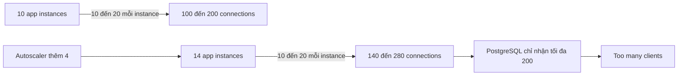
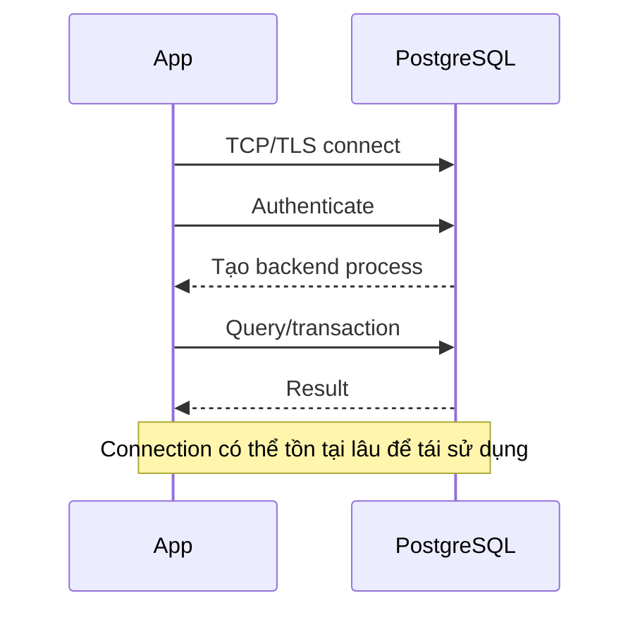
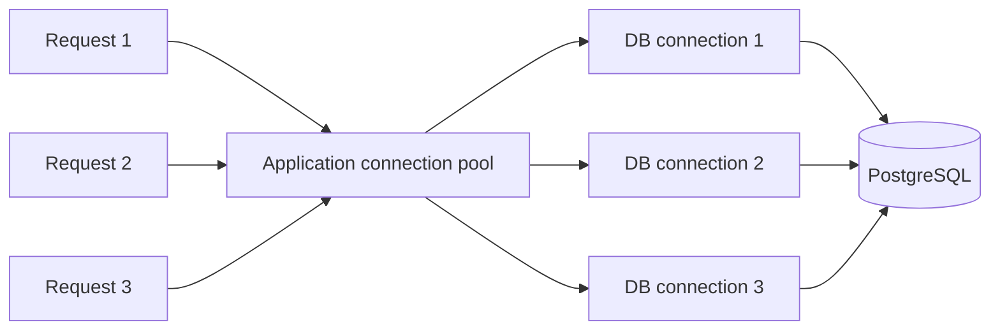
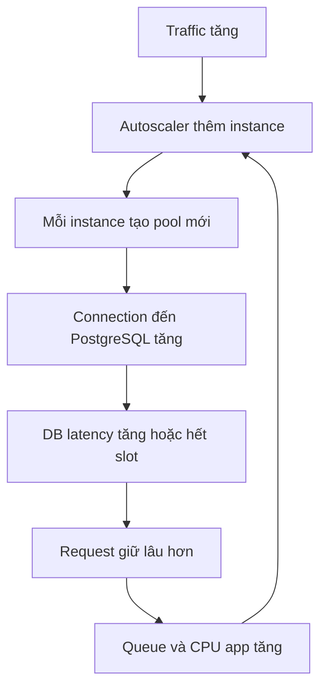
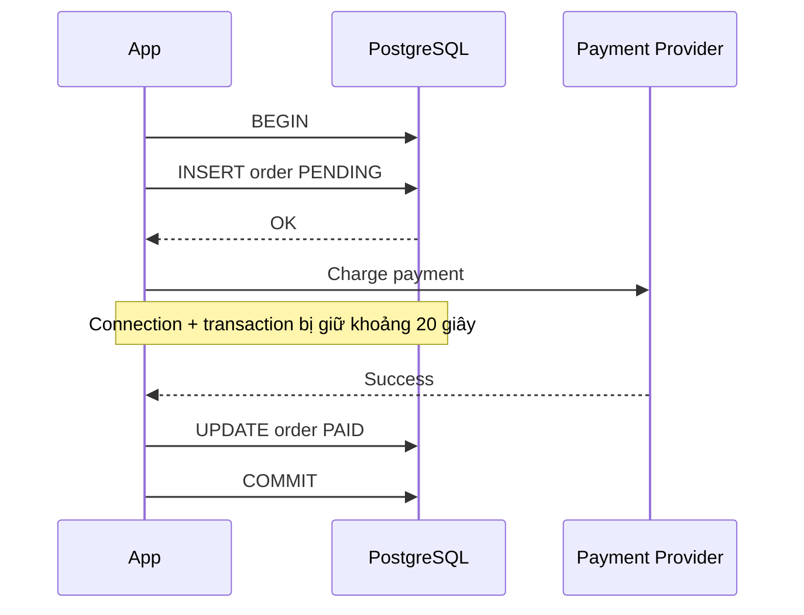
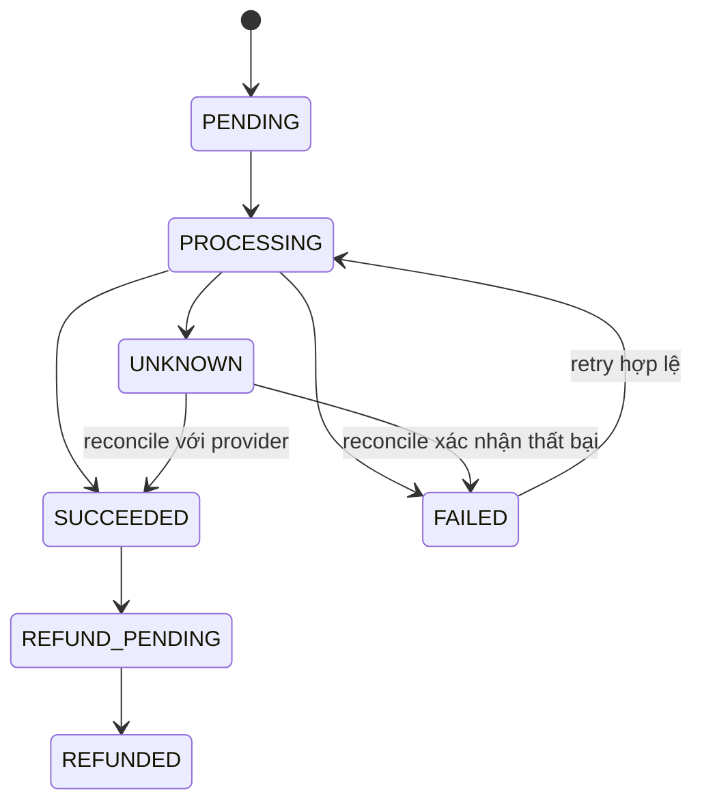
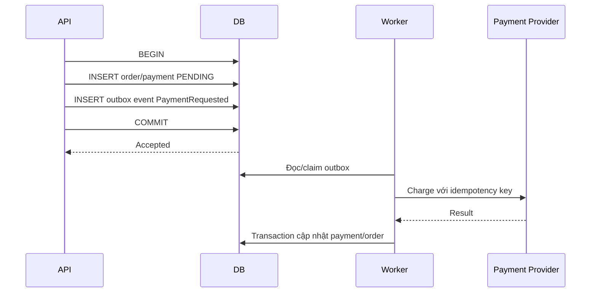
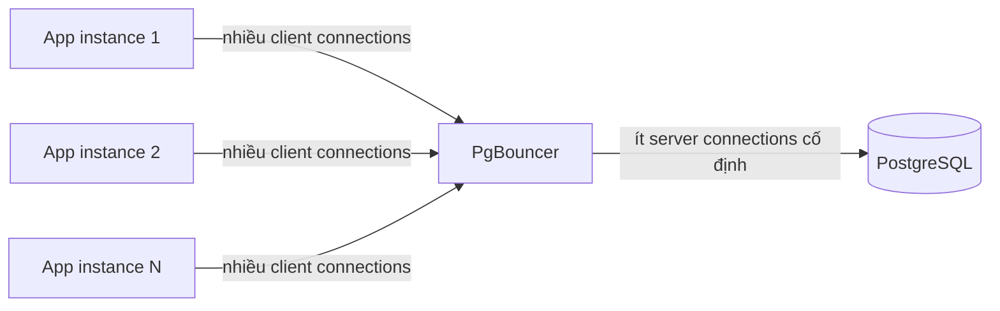

## Mục lục

- [1. Câu hỏi phỏng vấn](#1-câu-hỏi-phỏng-vấn)
- [2. Câu trả lời 30 giây](#2-câu-trả-lời-30-giây)
- [3. Phân tích phép tính connection](#3-phân-tích-phép-tính-connection)
- [4. Connection PostgreSQL thực sự là gì?](#4-connection-postgresql-thực-sự-là-gì)
- [5. Vì sao tăng max_connections không phải phản xạ tốt?](#5-vì-sao-tăng-max_connections-không-phải-phản-xạ-tốt)
- [6. Connection pool hoạt động như thế nào?](#6-connection-pool-hoạt-động-như-thế-nào)
- [7. Autoscaling và hiệu ứng nhân pool](#7-autoscaling-và-hiệu-ứng-nhân-pool)
- [8. Đọc đúng pg_stat_activity](#8-đọc-đúng-pg_stat_activity)
- [9. Root cause: gọi payment provider trong transaction](#9-root-cause-gọi-payment-provider-trong-transaction)
- [10. Tại sao giữ connection 20 giây nguy hiểm?](#10-tại-sao-giữ-connection-20-giây-nguy-hiểm)
- [11. Runbook SEV-1: checkout đang down](#11-runbook-sev-1-checkout-đang-down)
- [12. pg_cancel_backend và pg_terminate_backend](#12-pg_cancel_backend-và-pg_terminate_backend)
- [13. Timeout: hàng rào bảo vệ bắt buộc](#13-timeout-hàng-rào-bảo-vệ-bắt-buộc)
- [14. Sửa application code đúng cách](#14-sửa-application-code-đúng-cách)
- [15. Bài toán consistency của payment](#15-bài-toán-consistency-của-payment)
- [16. Idempotency, state machine và Outbox](#16-idempotency-state-machine-và-outbox)
- [17. PgBouncer giải quyết điều gì?](#17-pgbouncer-giải-quyết-điều-gì)
- [18. Ba chế độ pooling của PgBouncer](#18-ba-chế-độ-pooling-của-pgbouncer)
- [19. Cấu hình PgBouncer minh họa](#19-cấu-hình-pgbouncer-minh-họa)
- [20. Giới hạn của transaction pooling](#20-giới-hạn-của-transaction-pooling)
- [21. Capacity planning cho connection](#21-capacity-planning-cho-connection)
- [22. Backpressure: queue không phải phép màu](#22-backpressure-queue-không-phải-phép-màu)
- [23. Metrics và alert nên có](#23-metrics-và-alert-nên-có)
- [24. Load test để tái hiện sự cố](#24-load-test-để-tái-hiện-sự-cố)
- [25. Những câu trả lời sai thường gặp](#25-những-câu-trả-lời-sai-thường-gặp)
- [26. Câu hỏi đào sâu trong phỏng vấn](#26-câu-hỏi-đào-sâu-trong-phỏng-vấn)
- [27. Mẫu trả lời hoàn chỉnh 3 phút](#27-mẫu-trả-lời-hoàn-chỉnh-3-phút)
- [28. Checklist production](#28-checklist-production)
- [29. Cheat sheet](#29-cheat-sheet)
- [30. Tài liệu tham khảo](#30-tài-liệu-tham-khảo)

---

## 1. Câu hỏi phỏng vấn

> Hệ thống checkout chạy trên 10 application server và kết nối tới một PostgreSQL database. Mỗi server giữ tối thiểu 10 connection, có thể tăng đến tối đa 20 connection khi tải cao. PostgreSQL có `max_connections = 200`.
>
> Marketing mở flash sale, traffic tăng gấp ba. Autoscaler thêm 4 application server. Sau đó checkout lỗi hàng loạt với thông báo `FATAL: sorry, too many clients already`.
>
> Bạn sẽ điều tra, khôi phục và sửa hệ thống như thế nào? Có nên tăng `max_connections` lên 500 không? PgBouncer có giải quyết được vấn đề không?

Đây không chỉ là câu hỏi PostgreSQL. Nó kiểm tra đồng thời:

- khả năng tính capacity;
- hiểu biết về connection pool;
- transaction boundary;
- quan sát production bằng `pg_stat_activity`;
- xử lý incident;
- consistency khi tích hợp payment provider;
- backpressure và thiết kế hệ thống dưới tải lớn.

> [!IMPORTANT]
> Câu trả lời mạnh không bắt đầu bằng “tăng `max_connections`”. Nó bắt đầu bằng: **xác định connection đến từ đâu, đang ở trạng thái nào, giữ bao lâu và vì sao không được trả về pool**.

---

## 2. Câu trả lời 30 giây

> Autoscaling đã làm tổng pool tối đa tăng từ `10 × 20 = 200` lên `14 × 20 = 280`, vượt `max_connections = 200`. Tôi sẽ kiểm tra `pg_stat_activity` theo `application_name`, `client_addr`, `state`, `xact_start` và `wait_event` để xác định connection đang active, idle hay `idle in transaction`.
>
> Nếu phần lớn session là `idle in transaction`, nguyên nhân thường là application mở transaction rồi chờ network call, ở đây là payment provider. Trong incident, tôi terminate có chọn lọc các transaction bị kẹt, giảm tải và ngăn pool tiếp tục mở connection. Sau đó đặt `idle_in_transaction_session_timeout`, sửa code để không giữ transaction qua external call, thêm idempotency/state machine để payment vẫn đúng, rồi dùng PgBouncer transaction pooling để giới hạn số connection thật tới PostgreSQL.
>
> Tôi chỉ tăng `max_connections` sau benchmark và capacity planning; không dùng nó để che root cause.

---

## 3. Phân tích phép tính connection

### 3.1. Trạng thái bình thường

```text
10 application server × 10 connection/server = 100 connection
```

Nếu mỗi pool được phép tăng đến 20:

```text
10 application server × 20 connection/server = 200 connection
```

Ngay cả trước khi autoscale, cấu hình đã không có safety margin. Chỉ cần thêm:

- migration job;
- monitoring agent;
- background worker;
- BI/reporting tool;
- một engineer mở `psql`;

là tổng connection có thể vượt giới hạn dành cho application.

### 3.2. Sau khi autoscaler thêm 4 server

```text
Số server mới                 = 10 + 4 = 14
Connection bình thường        = 14 × 10 = 140
Connection tối đa lý thuyết   = 14 × 20 = 280
PostgreSQL max_connections    = 200
Phần vượt giới hạn            = 280 - 200 = 80
```

Sơ đồ:



### 3.3. Công thức tổng quát

```text
Tổng connection tiềm năng
= số instance tối đa × pool max mỗi instance
+ background jobs
+ migration
+ monitoring
+ admin
+ các application khác
```

Không được tính theo số instance **hiện tại**. Phải tính theo số instance **tối đa mà autoscaler có thể tạo**.

> [!WARNING]
> Nếu Kubernetes HPA cho phép tối đa 50 pod và mỗi pod có pool 20, application có khả năng tạo `50 × 20 = 1.000` connection, dù bình thường chỉ chạy 5 pod.

---

## 4. Connection PostgreSQL thực sự là gì?

Khi client mở một connection trực tiếp đến PostgreSQL, nó thường phải thực hiện:

1. TCP handshake;
2. TLS handshake nếu bật TLS;
3. authentication;
4. PostgreSQL tạo backend process cho session;
5. khởi tạo session state;
6. parse/execute query;
7. giữ socket cho tới khi client disconnect.



PostgreSQL dùng mô hình **một backend process cho mỗi client connection**. Vì vậy connection không hoàn toàn miễn phí:

- mỗi connection có process và socket;
- có memory nền cho session/backend;
- query đang chạy có thể dùng thêm `work_mem` cho từng sort/hash operation;
- nhiều backend active làm tăng CPU scheduling và context switching;
- concurrency quá cao làm tăng tranh chấp CPU, I/O và lock.

Tuy nhiên cần phân biệt:

| Loại | Tác động chính |
|------|----------------|
| 500 connection `idle` | Tốn process, socket và memory nền nhưng ít CPU |
| 500 connection `active` | Có thể bão hòa CPU/I/O, tăng context switching và lock contention |
| 500 connection `idle in transaction` | Chiếm connection, có thể giữ lock/snapshot và cản VACUUM |

> [!NOTE]
> Không nên dùng một con số memory cố định như “mỗi connection luôn tốn 10 MB”. Memory thực tế phụ thuộc phiên bản, extension, session state và query đang chạy. Điều quan trọng là **đo trên workload thật**.

---

## 5. Vì sao tăng `max_connections` không phải phản xạ tốt?

### 5.1. `max_connections` là giới hạn an toàn, không phải nút tăng throughput

`max_connections` quy định số connection đồng thời PostgreSQL cho phép. PostgreSQL còn cấp phát một số resource dựa trực tiếp vào giá trị này, bao gồm shared memory. Thay đổi setting này yêu cầu restart server.

Nếu database xử lý hiệu quả khoảng 60 query đồng thời, tăng connection từ 200 lên 500 không làm database xử lý 500 query hiệu quả. Nó có thể chỉ biến:

```text
200 request chạy/chờ + request mới bị từ chối
```

thành:

```text
500 request cùng tranh CPU, I/O, memory và lock
```

Kết quả có thể là latency tăng mạnh cho **tất cả** request.

### 5.2. Connection limit còn có vùng dự phòng

Các setting liên quan:

```sql
SHOW max_connections;
SHOW reserved_connections;
SHOW superuser_reserved_connections;
```

- `superuser_reserved_connections`: giữ slot cuối cùng cho superuser xử lý khẩn cấp;
- `reserved_connections`: giữ slot cho role có quyền `pg_use_reserved_connections` trên phiên bản hỗ trợ setting này.

Vì vậy application không nên kỳ vọng sử dụng toàn bộ `max_connections`.

### 5.3. Khi nào tăng `max_connections` có thể hợp lý?

Có thể tăng khi đã chứng minh rằng:

- phần lớn connection idle bình thường và memory còn dư;
- workload cần thêm session thật;
- CPU/I/O chưa bão hòa;
- lock contention không tăng nguy hiểm;
- benchmark cho thấy throughput hoặc availability được cải thiện;
- đã chừa slot cho admin và workload khác;
- primary/standby được cấu hình tương thích.

Tăng có kiểm soát khác hoàn toàn với tăng từ 200 lên 500 trong lúc chưa biết root cause.

---

## 6. Connection pool hoạt động như thế nào?

Application pool giữ sẵn một số connection để tránh chi phí connect/authenticate cho mỗi request.



Một pool thường có các tham số:

| Tham số | Ý nghĩa |
|---------|---------|
| `min` | Số connection giữ sẵn |
| `max` | Số connection tối đa pool được mở |
| acquisition timeout | Thời gian request được chờ lấy connection |
| idle timeout | Bao lâu thì pool đóng connection rảnh |
| max lifetime | Tuổi tối đa của một connection |
| validation | Cách kiểm tra connection còn sống |

Luồng đúng:

```text
Borrow connection → query/transaction ngắn → commit/rollback → release
```

Luồng sai:

```text
Borrow connection → BEGIN → query → gọi HTTP 20 giây
→ commit → release
```

Pool chỉ tái sử dụng được connection sau khi code **release** nó. Pool không thể lấy lại một connection mà request vẫn đang giữ.

> [!IMPORTANT]
> “Tôi dùng connection pool” không có nghĩa là đã giải quyết connection exhaustion. Pool cấu hình sai hoặc code giữ connection quá lâu chính là nguồn gây exhaustion.

---

## 7. Autoscaling và hiệu ứng nhân pool

Application autoscaling thường nhìn vào CPU, request rate hoặc queue length. Nó không tự hiểu database chỉ còn vài connection.



Đây là **positive feedback loop**:

1. traffic tăng;
2. app chậm vì database;
3. request tồn tại lâu hơn nên CPU/queue tăng;
4. autoscaler thêm app instance;
5. instance mới mở thêm connection;
6. database càng chịu concurrency lớn;
7. app càng chậm.

### 7.1. Connection storm khi deploy

Không chỉ flash sale. Rolling deploy cũng có thể gây storm:

- 20 pod cũ chưa dừng;
- 20 pod mới cùng khởi động;
- mỗi pod mới warm pool 10 connection;
- trong một khoảng ngắn tồn tại 40 pod;
- tổng connection tăng đột ngột.

Biện pháp:

- startup jitter;
- không eager-open toàn bộ pool nếu không cần;
- giới hạn `maxSurge`;
- connection acquisition timeout;
- PgBouncer;
- tính capacity cả trạng thái deploy chồng lấn.

---

## 8. Đọc đúng `pg_stat_activity`

`pg_stat_activity` có một dòng cho mỗi server process và cho biết session đang làm gì.

### 8.1. Các state quan trọng

| State | Ý nghĩa | Có đáng lo? |
|-------|---------|-------------|
| `active` | Đang chạy query | Tùy query duration và wait event |
| `idle` | Chờ command mới, không ở trong transaction | Bình thường với pool nếu số lượng hợp lý |
| `idle in transaction` | Transaction đang mở nhưng hiện không chạy query | Đáng lo nếu kéo dài |
| `idle in transaction (aborted)` | Transaction đã lỗi nhưng client chưa rollback | Đáng lo; code xử lý lỗi kém |
| `disabled` | `track_activities` bị tắt | Không đủ dữ liệu quan sát |

> [!IMPORTANT]
> Với session `idle in transaction`, cột `query` hiển thị **câu SQL gần nhất**, không hiển thị việc application đang chờ payment HTTP call. PostgreSQL không biết code đang chờ Stripe, PayPal hay ngủ; nó chỉ biết client chưa gửi command tiếp theo.

### 8.2. Đếm connection theo nguồn và state

```sql
SELECT
    datname,
    usename,
    application_name,
    client_addr,
    state,
    count(*) AS connection_count
FROM pg_stat_activity
WHERE backend_type = 'client backend'
GROUP BY datname, usename, application_name, client_addr, state
ORDER BY connection_count DESC;
```

Kết quả giả định:

```text
 application_name | client_addr | state               | count
------------------+-------------+---------------------+------
 checkout-api      | 10.0.1.21   | idle in transaction |   18
 checkout-api      | 10.0.1.22   | idle in transaction |   17
 checkout-api      | 10.0.1.23   | idle in transaction |   19
 reporting         | 10.0.2.10   | active              |    4
 monitoring        | 10.0.3.10   | idle                |    2
```

### 8.3. Tìm transaction lâu

```sql
SELECT
    pid,
    datname,
    usename,
    application_name,
    client_addr,
    state,
    now() - backend_start AS connection_age,
    now() - xact_start AS transaction_age,
    now() - state_change AS state_age,
    wait_event_type,
    wait_event,
    left(query, 300) AS last_query
FROM pg_stat_activity
WHERE backend_type = 'client backend'
  AND xact_start IS NOT NULL
ORDER BY xact_start;
```

Phân biệt các mốc:

| Cột | Bắt đầu khi nào? | Dùng để làm gì? |
|-----|------------------|-----------------|
| `backend_start` | Session connect | Tuổi connection |
| `xact_start` | Transaction hiện tại bắt đầu | Tuổi transaction |
| `query_start` | Query hiện tại/gần nhất bắt đầu | Tuổi query |
| `state_change` | Session đổi state gần nhất | Đã idle/active bao lâu |

### 8.4. Tìm `idle in transaction` quá lâu

```sql
SELECT
    pid,
    usename,
    application_name,
    client_addr,
    now() - xact_start AS transaction_age,
    now() - state_change AS idle_for,
    left(query, 300) AS last_query
FROM pg_stat_activity
WHERE backend_type = 'client backend'
  AND state IN ('idle in transaction', 'idle in transaction (aborted)')
  AND now() - state_change > interval '30 seconds'
ORDER BY state_change;
```

### 8.5. Tìm session đang bị block

```sql
SELECT
    a.pid AS blocked_pid,
    a.application_name AS blocked_app,
    a.wait_event_type,
    a.wait_event,
    pg_blocking_pids(a.pid) AS blocking_pids,
    now() - a.query_start AS waiting_for,
    left(a.query, 300) AS blocked_query
FROM pg_stat_activity AS a
WHERE cardinality(pg_blocking_pids(a.pid)) > 0
ORDER BY a.query_start;
```

### 8.6. Kiểm tra tỷ lệ sử dụng connection

```sql
WITH settings AS (
    SELECT setting::int AS max_connections
    FROM pg_settings
    WHERE name = 'max_connections'
), used AS (
    SELECT count(*) AS used_connections
    FROM pg_stat_activity
    WHERE backend_type = 'client backend'
)
SELECT
    used_connections,
    max_connections,
    round(100.0 * used_connections / max_connections, 2) AS used_percent
FROM used, settings;
```

Đây là tỷ lệ quan sát nhanh, không phải phép tính chính xác toàn bộ slot nội bộ. Khi vận hành, vẫn phải xét reserved slots và workload không phải application.

---

## 9. Root cause: gọi payment provider trong transaction

### 9.1. Code có vấn đề

Pseudo-code:

```typescript
await db.transaction(async (tx) => {
  const order = await tx.order.create({
    userId,
    amount,
    status: 'PENDING',
  });

  // Sai: transaction và DB connection vẫn đang bị giữ.
  const payment = await paymentProvider.charge({
    orderId: order.id,
    amount: order.amount,
  });

  await tx.order.update(order.id, {
    status: payment.success ? 'PAID' : 'PAYMENT_FAILED',
  });
});
```

Timeline:



Trong 20 giây chờ payment provider:

- PostgreSQL không chạy query cho request này;
- connection vẫn thuộc về request;
- transaction vẫn mở;
- pool không thể cho request khác mượn connection;
- session thường hiện là `idle in transaction`.

### 9.2. Vì sao lỗi chỉ xuất hiện khi flash sale?

Ở tải thấp, vài request giữ connection 20 giây chưa đủ làm cạn pool. Flash sale làm số request đồng thời tăng mạnh, nên mọi connection nhanh chóng bị giữ.

Đây là lỗi **latent**: code sai từ trước, nhưng chỉ bộc lộ khi concurrency vượt ngưỡng.

---

## 10. Tại sao giữ connection 20 giây nguy hiểm?

### 10.1. Little's Law

Công thức đơn giản:

```text
Concurrency trung bình = request rate × thời gian giữ resource
```

Giả sử checkout nhận 50 request/giây.

Nếu mỗi request giữ connection 20 giây:

```text
50 request/giây × 20 giây = 1.000 connection đồng thời
```

Nếu database work thực tế chỉ mất 40 ms:

```text
50 request/giây × 0,04 giây = 2 connection active trung bình
```

Chỉ bằng cách giảm **connection holding time** từ 20 giây xuống 40 ms, nhu cầu concurrency trung bình giảm từ khoảng 1.000 xuống khoảng 2.

> [!IMPORTANT]
> Nút thắt không phải database thiếu sức mạnh. Resource bị giữ sai phạm vi. Tối ưu quan trọng nhất là thu hẹp transaction/connection boundary.

### 10.2. Không chỉ chiếm connection

Transaction lâu có thể:

- giữ row/table lock;
- làm transaction khác phải chờ;
- giữ snapshot cũ;
- ngăn VACUUM dọn tuple mà transaction cũ có thể còn nhìn thấy;
- góp phần gây table/index bloat;
- làm rollback tốn thời gian hơn;
- kéo dài thời gian phục hồi khi incident.

Xem thêm:

- [ACID Transaction](/fundamentals/acid-transaction/)
- [Lock trong database](/fundamentals/lock/)
- [MVCC](/fundamentals/mvcc/)
- [PostgreSQL VACUUM](/postgresql/vacuum/)

---

## 11. Runbook SEV-1: checkout đang down

Mục tiêu xử lý incident theo thứ tự:

1. giữ quyền truy cập database;
2. chặn tình trạng xấu thêm;
3. xác định đúng nhóm session;
4. giải phóng resource có chọn lọc;
5. khôi phục checkout;
6. bảo toàn bằng chứng để làm postmortem.

### 11.1. Bước 0 — Không tự khóa cửa admin

Dùng account có quyền đi qua reserved slot nếu tổ chức đã cấu hình. Không cho application dùng superuser.

Kiểm tra:

```sql
SHOW max_connections;
SHOW reserved_connections;
SHOW superuser_reserved_connections;
```

### 11.2. Bước 1 — Xác nhận triệu chứng

```sql
SELECT state, count(*)
FROM pg_stat_activity
WHERE backend_type = 'client backend'
GROUP BY state
ORDER BY count(*) DESC;
```

Sau đó nhóm theo app/host như mục 8.2.

Đồng thời kiểm tra:

- app pool active/idle/waiting;
- acquisition timeout;
- số instance autoscaler vừa tạo;
- database CPU, I/O, memory;
- query latency và lock wait;
- payment provider latency/error rate.

### 11.3. Bước 2 — Chặn connection tiếp tục tăng

Tùy hệ thống, có thể:

- tạm dừng autoscaling tăng thêm;
- giảm traffic bằng rate limit/load shedding;
- pause background consumer không quan trọng;
- tắt endpoint/reporting workload không thiết yếu;
- giảm retry storm;
- mở circuit breaker với payment provider nếu provider đang chậm;
- giới hạn checkout concurrency ở application/gateway.

> [!WARNING]
> Restart đồng loạt application có thể làm sự cố nặng hơn vì tất cả instance cùng reconnect, tạo connection storm. Nếu phải restart, thực hiện theo batch và có jitter.

### 11.4. Bước 3 — Chụp bằng chứng trước khi terminate

Lưu kết quả:

```sql
SELECT
    now() AS captured_at,
    pid,
    datname,
    usename,
    application_name,
    client_addr,
    state,
    backend_start,
    xact_start,
    query_start,
    state_change,
    wait_event_type,
    wait_event,
    query
FROM pg_stat_activity
WHERE backend_type = 'client backend'
ORDER BY xact_start NULLS LAST;
```

Bằng chứng này giúp trả lời sau incident:

- host nào tạo nhiều connection nhất;
- transaction bắt đầu lúc nào;
- query cuối cùng là gì;
- state nào chiếm đa số;
- có lock wait hay không.

### 11.5. Bước 4 — Terminate có chọn lọc

Trước tiên chỉ xem danh sách sẽ bị tác động:

```sql
SELECT
    pid,
    application_name,
    client_addr,
    now() - xact_start AS transaction_age,
    now() - state_change AS idle_for,
    left(query, 200) AS last_query
FROM pg_stat_activity
WHERE backend_type = 'client backend'
  AND usename = 'checkout_app'
  AND application_name = 'checkout-api'
  AND state IN ('idle in transaction', 'idle in transaction (aborted)')
  AND now() - state_change > interval '60 seconds';
```

Nếu đã xác nhận đúng:

```sql
SELECT pg_terminate_backend(pid)
FROM pg_stat_activity
WHERE backend_type = 'client backend'
  AND usename = 'checkout_app'
  AND application_name = 'checkout-api'
  AND state IN ('idle in transaction', 'idle in transaction (aborted)')
  AND now() - state_change > interval '60 seconds'
  AND pid <> pg_backend_pid();
```

PostgreSQL sẽ kết thúc session và rollback transaction chưa commit.

> [!CAUTION]
> Database rollback không thể rollback side effect bên ngoài. Nếu payment provider đã charge tiền nhưng transaction DB bị terminate, tiền có thể đã trừ trong khi order chưa được đánh dấu `PAID`. Vì vậy sau incident phải chạy reconciliation với provider.

### 11.6. Bước 5 — Xác nhận hệ thống hồi phục

Theo dõi đồng thời:

- connection usage giảm;
- pool waiting giảm;
- checkout success rate tăng;
- P95/P99 giảm;
- payment duplicate/unknown không tăng;
- transaction `idle in transaction` không quay lại nhanh chóng.

### 11.7. Bước 6 — Không dừng ở “service đã xanh”

Sau incident cần:

- sửa transaction boundary;
- thêm timeout;
- thêm idempotency/reconciliation;
- chỉnh pool và autoscaler;
- load test lại;
- viết postmortem không đổ lỗi cá nhân.

---

## 12. `pg_cancel_backend` và `pg_terminate_backend`

| Function | Hành vi | Khi dùng |
|----------|----------|----------|
| `pg_cancel_backend(pid)` | Cancel query hiện tại, session vẫn tồn tại | Query active chạy quá lâu |
| `pg_terminate_backend(pid)` | Kết thúc toàn bộ session | `idle in transaction`, session hỏng hoặc cần giải phóng connection |

Ví dụ cancel query active trên 30 giây:

```sql
SELECT pg_cancel_backend(pid)
FROM pg_stat_activity
WHERE backend_type = 'client backend'
  AND state = 'active'
  AND now() - query_start > interval '30 seconds'
  AND usename = 'checkout_app'
  AND pid <> pg_backend_pid();
```

Với `idle in transaction`, không có query đang chạy để cancel. Do đó `pg_cancel_backend()` thường không giải phóng transaction; cần application rollback/close hoặc dùng `pg_terminate_backend()`.

Quyền thực thi bị giới hạn. Role vận hành có thể cần quyền phù hợp như `pg_signal_backend`, nhưng chỉ superuser mới có thể signal superuser backend.

> [!WARNING]
> Không dùng OS `kill -9` với PostgreSQL backend như một thao tác vận hành thông thường. Hãy dùng function PostgreSQL để server cleanup đúng cách.

---

## 13. Timeout: hàng rào bảo vệ bắt buộc

### 13.1. Bốn timeout dễ bị nhầm

| Setting | Giới hạn điều gì? | Ví dụ |
|---------|-------------------|-------|
| `statement_timeout` | Tổng thời gian một statement | Query chạy quá 5 giây |
| `lock_timeout` | Thời gian một statement chờ lock | Chờ row/table lock quá 1 giây |
| `idle_in_transaction_session_timeout` | Thời gian session không làm gì khi transaction vẫn mở | Code quên commit/rollback |
| `idle_session_timeout` | Thời gian session idle ngoài transaction | Interactive session bỏ quên |

Trên phiên bản hỗ trợ `transaction_timeout`, setting này giới hạn tổng tuổi transaction. Cần rollout thận trọng vì transaction hợp lệ như batch/report có thể dài hơn OLTP.

### 13.2. Setting đúng cho root cause này

```sql
ALTER ROLE checkout_app IN DATABASE shop
SET idle_in_transaction_session_timeout = '30s';
```

Ví dụ policy cho checkout OLTP:

```sql
ALTER ROLE checkout_app IN DATABASE shop
SET statement_timeout = '5s';

ALTER ROLE checkout_app IN DATABASE shop
SET lock_timeout = '1s';

ALTER ROLE checkout_app IN DATABASE shop
SET idle_in_transaction_session_timeout = '30s';
```

Các con số trên chỉ là minh họa. Giá trị thật phải dựa trên SLO và workload.

### 13.3. Vì sao nên set theo role/database?

Không phải workload nào cũng giống nhau:

- checkout cần transaction rất ngắn;
- reporting có thể chạy query vài phút;
- migration có thể chờ lock theo policy khác;
- maintenance job có thể cần transaction lâu hơn.

Set toàn cục trong `postgresql.conf` có thể vô tình kill workload hợp lệ. Policy theo role/database dễ kiểm soát hơn.

### 13.4. Timeout không thay thế code đúng

Timeout chỉ giới hạn blast radius. Nếu code vẫn sai:

- request vẫn lỗi sau 30 giây;
- transaction vẫn bị rollback;
- payment side effect vẫn có thể không khớp DB;
- user vẫn có trải nghiệm xấu.

Do đó phải sửa application, không dừng ở timeout.

### 13.5. Cẩn thận với `idle_session_timeout`

Session `idle` ngoài transaction không gây tác hại lớn như `idle in transaction`. PostgreSQL cũng cảnh báo cần thận trọng khi áp dụng `idle_session_timeout` cho connection pooler/middleware vì pooler có thể không xử lý tốt connection bị đóng bất ngờ.

---

## 14. Sửa application code đúng cách

### 14.1. Nguyên tắc transaction boundary

Chỉ đặt bên trong transaction những thao tác cần atomicity trong **cùng database**.

Không đặt bên trong transaction:

- HTTP/RPC call;
- gửi email;
- upload object storage;
- chờ user input;
- sleep/retry backoff;
- publish message không có transactional mechanism;
- CPU work dài không cần giữ snapshot/lock.

### 14.2. Bản sửa tối thiểu

```typescript
// Transaction DB ngắn số 1.
const paymentAttempt = await db.transaction(async (tx) => {
  const order = await tx.order.create({
    userId,
    amount,
    status: 'PAYMENT_PENDING',
  });

  return tx.paymentAttempt.create({
    orderId: order.id,
    amount,
    status: 'PENDING',
    idempotencyKey: generateStableKey(order.id),
  });
});

// Không giữ DB connection/transaction khi gọi network.
const paymentResult = await paymentProvider.charge({
  amount: paymentAttempt.amount,
  idempotencyKey: paymentAttempt.idempotencyKey,
});

// Transaction DB ngắn số 2.
await db.transaction(async (tx) => {
  await tx.paymentAttempt.update(paymentAttempt.id, {
    status: paymentResult.success ? 'SUCCEEDED' : 'FAILED',
    providerPaymentId: paymentResult.paymentId,
  });

  if (paymentResult.success) {
    await tx.order.update(paymentAttempt.orderId, { status: 'PAID' });
  }
});
```

Connection giờ được giữ ở hai khoảng ngắn quanh SQL, không bị giữ trong lúc chờ network.

### 14.3. Luôn rollback/release trong `finally`

Nếu không dùng transaction helper tự cleanup:

```typescript
const client = await pool.connect();

try {
  await client.query('BEGIN');
  // Database operations...
  await client.query('COMMIT');
} catch (error) {
  await client.query('ROLLBACK');
  throw error;
} finally {
  client.release();
}
```

Lỗi phổ biến:

```typescript
const client = await pool.connect();
await client.query('BEGIN');
await doWork(); // throw error
// Không finally → connection không bao giờ trở về pool.
```

Đây là **connection leak**, khác với giữ connection lâu nhưng cuối cùng vẫn release. Cả hai đều có thể làm cạn pool.

---

## 15. Bài toán consistency của payment

Tách transaction DB khỏi network call giải quyết connection holding time, nhưng tạo bài toán distributed consistency.

Không có một transaction ACID thông thường bao trùm cả:

- PostgreSQL của bạn;
- payment provider bên ngoài.

### 15.1. Các failure window

| Tình huống | Kết quả có thể xảy ra |
|------------|-----------------------|
| DB tạo `PENDING`, app crash trước khi charge | Order treo `PENDING`, chưa charge |
| Provider charge thành công, app crash trước khi update DB | Khách đã mất tiền, DB chưa biết |
| Provider timeout nhưng thực tế đã charge | App không biết kết quả chắc chắn |
| App retry không có idempotency | Khách bị charge hai lần |
| Hai worker xử lý cùng payment | Duplicate charge/race condition |
| DB update `PAID` lỗi sau provider success | Provider và DB lệch trạng thái |

> [!IMPORTANT]
> “Commit, gọi payment, rồi lưu kết quả” chỉ đúng về **resource management**. Muốn đúng về **business consistency**, phải có idempotency, state machine, retry và reconciliation.

### 15.2. Không rollback được thế giới bên ngoài

Nếu database transaction rollback:

- row insert/update được hoàn tác;
- lock được giải phóng;

nhưng:

- payment đã charge không tự refund;
- email đã gửi không thể “unsend”;
- message đã publish không tự biến mất;
- file đã upload vẫn tồn tại.

Đó là lý do external side effect không nên nằm trong giả định “database rollback sẽ xử lý tất cả”.

---

## 16. Idempotency, state machine và Outbox

### 16.1. Payment state machine



Không nên chỉ dùng boolean `paid = true/false`, vì nó không biểu diễn được `PENDING`, `UNKNOWN`, retry hay refund.

### 16.2. Idempotency key

Một logical payment phải luôn dùng cùng một stable key khi retry:

```sql
CREATE TABLE payment_attempts (
    id                  bigint GENERATED ALWAYS AS IDENTITY PRIMARY KEY,
    order_id            bigint NOT NULL,
    idempotency_key     text NOT NULL,
    status              text NOT NULL,
    provider_payment_id text,
    amount              numeric(18, 2) NOT NULL,
    created_at          timestamptz NOT NULL DEFAULT now(),
    updated_at          timestamptz NOT NULL DEFAULT now(),
    UNIQUE (idempotency_key)
);
```

Application gửi cùng key cho payment provider trong mọi lần retry. Provider hỗ trợ idempotency sẽ trả lại kết quả cũ thay vì charge lần nữa.

### 16.3. Conditional update chống hai worker

```sql
UPDATE payment_attempts
SET status = 'PROCESSING', updated_at = now()
WHERE id = $1
  AND status IN ('PENDING', 'FAILED')
RETURNING *;
```

Nếu không trả row nào, worker khác đã claim hoặc payment không còn ở state cho phép.

Có thể dùng `SELECT ... FOR UPDATE SKIP LOCKED` cho queue trong PostgreSQL, nhưng transaction claim phải ngắn.

### 16.4. Transactional Outbox

Nếu muốn gọi payment bất đồng bộ:



Order/payment row và outbox event được ghi trong cùng transaction, nên không có trường hợp DB commit order nhưng quên tạo việc cần xử lý.

### 16.5. Reconciliation job

Định kỳ tìm các payment treo:

```sql
SELECT id, order_id, idempotency_key, provider_payment_id, status
FROM payment_attempts
WHERE status IN ('PENDING', 'PROCESSING', 'UNKNOWN')
  AND updated_at < now() - interval '5 minutes';
```

Worker hỏi provider theo `idempotency_key` hoặc `provider_payment_id`, rồi cập nhật trạng thái đúng.

Reconciliation không phải workaround tạm thời; nó là thành phần bắt buộc của payment workflow đáng tin cậy.

---

## 17. PgBouncer giải quyết điều gì?

PgBouncer là connection pooler nhẹ nằm giữa application và PostgreSQL.



Phân biệt hai loại connection:

| Loại | Từ đâu đến đâu? | Chi phí |
|------|------------------|---------|
| Client connection | Application → PgBouncer | Nhẹ hơn, PgBouncer quản lý |
| Server connection | PgBouncer → PostgreSQL | Connection PostgreSQL thật, có backend process |

PgBouncer giúp:

- giảm số connection thật tới PostgreSQL;
- tái sử dụng server connection giữa nhiều client;
- giới hạn database concurrency;
- cho request chờ khi pool server bận;
- giảm connection storm khi app autoscale/deploy;
- giảm chi phí connect/authenticate trực tiếp tới PostgreSQL.

PgBouncer **không**:

- làm query nhanh hơn một cách tự động;
- tăng CPU/I/O của database;
- sửa long transaction;
- sửa connection leak trong application;
- giải quyết payment consistency;
- biến queue vô hạn thành hệ thống ổn định.

> [!IMPORTANT]
> Nếu transaction vẫn mở trong lúc gọi payment 20 giây, PgBouncer transaction pooling vẫn phải pin một server connection cho transaction đó. Phải sửa code trước hoặc đồng thời.

---

## 18. Ba chế độ pooling của PgBouncer

| Mode | Khi nào trả server connection về pool? | Tương thích | Use case |
|------|-----------------------------------------|-------------|----------|
| `session` | Khi client disconnect | Cao nhất | App phụ thuộc session state |
| `transaction` | Khi transaction kết thúc | Mất một số session feature | OLTP phổ biến |
| `statement` | Sau mỗi statement | Không cho multi-statement transaction | Trường hợp rất đặc biệt |

### 18.1. Session pooling

```text
Client A connect ───────────────────────── disconnect
         Server connection bị giữ toàn bộ thời gian
```

Ưu điểm: hỗ trợ đầy đủ PostgreSQL session semantics.

Nhược điểm: nếu application giữ hàng nghìn client connection, PgBouncer có thể vẫn cần nhiều server connection khi các session được gán.

### 18.2. Transaction pooling

```text
Client A:  [TX1]────idle────[TX2]
Server:    [TX1] trả pool   [TX2] trả pool
```

Đây thường là lựa chọn phù hợp cho stateless OLTP. Mỗi transaction có thể chạy trên backend PostgreSQL khác nhau.

### 18.3. Statement pooling

Server connection được trả sau từng statement. Multi-statement transaction bị cấm. Mode này rất mạnh tay và hiếm khi phù hợp với application nghiệp vụ thông thường.

---

## 19. Cấu hình PgBouncer minh họa

```ini
[databases]
shop = host=postgres.internal port=5432 dbname=shop pool_size=40 reserve_pool_size=5

[pgbouncer]
listen_addr = 0.0.0.0
listen_port = 6432

pool_mode = transaction
max_client_conn = 1000
default_pool_size = 40
reserve_pool_size = 5
reserve_pool_timeout = 3
max_db_connections = 50

server_connect_timeout = 5
server_idle_timeout = 600
query_wait_timeout = 10

max_prepared_statements = 200

auth_type = scram-sha-256
auth_file = /etc/pgbouncer/userlist.txt

admin_users = pgbouncer_admin
stats_users = pgbouncer_stats
```

> [!WARNING]
> Đây là cấu hình minh họa, không phải cấu hình copy-paste cho mọi production. Pool size phải dựa trên benchmark, số PgBouncer replica, số database/user pair và phần capacity dành cho workload khác.

### 19.1. `default_pool_size` không phải tổng toàn cục

Theo tài liệu PgBouncer, `default_pool_size` là số server connection tối đa cho **mỗi user/database pair**. Nếu có nhiều user và database, tổng có thể nhân lên.

Ví dụ:

```text
40 connection/pool × 3 database × 2 user = tối đa 240 server connection
```

Nếu chạy hai PgBouncer instance độc lập:

```text
2 PgBouncer × 40 connection cho cùng pool = 80 connection PostgreSQL
```

Capacity planning phải cộng trên **tất cả PgBouncer replica**.

### 19.2. `max_client_conn`

Đây là số client connection PgBouncer chấp nhận, không phải số connection thật tới PostgreSQL. Tăng setting này có thể yêu cầu tăng OS file descriptor limit.

### 19.3. Quan sát PgBouncer

Kết nối vào admin database của PgBouncer và dùng:

```sql
SHOW POOLS;
SHOW STATS;
SHOW CLIENTS;
SHOW SERVERS;
SHOW DATABASES;
SHOW CONFIG;
```

Các chỉ số quan trọng trong `SHOW POOLS` thường gồm:

- client active;
- client waiting;
- server active;
- server idle;
- pool/database/user tương ứng.

Nếu client waiting tăng liên tục, database capacity hoặc downstream latency đang không theo kịp arrival rate.

---

## 20. Giới hạn của transaction pooling

Với transaction pooling, hai transaction liên tiếp của cùng client có thể dùng hai PostgreSQL backend khác nhau. Vì vậy không được phụ thuộc vào session state nằm trên một backend cụ thể.

| PostgreSQL feature | Transaction pooling |
|--------------------|---------------------|
| Session-level `SET/RESET` tùy ý | Không an toàn nếu PgBouncer không track |
| `LISTEN` | Không hỗ trợ theo session semantics |
| Session-level advisory lock | Không hỗ trợ |
| `WITH HOLD` cursor | Không hỗ trợ |
| Temp table `ON COMMIT DROP` | Có thể dùng |
| Temp table giữ qua transaction | Không an toàn |
| SQL `PREPARE/EXECUTE/DEALLOCATE` | Không hỗ trợ như session pooling |
| Protocol-level prepared statement | Có thể hỗ trợ khi cấu hình phù hợp |

PgBouncer hiện có thể theo dõi protocol-level named prepared statements khi `max_prepared_statements` khác 0. Nhưng vẫn phải test driver/ORM và migration thực tế.

### 20.1. Câu hỏi audit trước khi bật transaction pooling

- Application có dùng session advisory lock không?
- Có `LISTEN/NOTIFY` consumer giữ session không?
- Có temp table tồn tại qua nhiều transaction không?
- ORM có dùng session-level `SET` không?
- Driver dùng SQL-level hay protocol-level prepared statements?
- Có code giả định cùng backend PID cho cả session không?
- Có extension lưu state theo session không?

Nếu có workload phụ thuộc session state, có thể:

- dùng session pooling cho workload đó;
- tách endpoint/role/database route;
- sửa code để state nằm trong transaction;
- kết nối trực tiếp cho listener chuyên dụng.

---

## 21. Capacity planning cho connection

### 21.1. Đừng bắt đầu từ `max_connections`

Câu hỏi đúng không phải:

> PostgreSQL cho phép bao nhiêu connection?

Mà là:

> Database xử lý hiệu quả bao nhiêu database work đồng thời trong SLO đã đặt?

Benchmark cần đo:

- throughput;
- P50/P95/P99 latency;
- CPU;
- I/O latency và IOPS;
- memory;
- lock wait;
- transaction duration;
- error rate;

Tăng concurrency từng bước. Khi throughput không tăng nhưng latency tăng nhanh, bạn đã qua “điểm ngọt”.

### 21.2. Công thức budget

```text
Application DB connection budget
= min(database concurrency đã benchmark,
      max_connections
      - superuser/admin reserve
      - replication/maintenance budget
      - background jobs
      - application khác)
```

Sau đó phân bổ cho từng PgBouncer/application pool.

### 21.3. Ví dụ

Giả sử:

```text
max_connections                     = 200
reserved cho admin/khẩn cấp         = 10
monitoring + migration              = 10
background jobs                     = 20
application khác                    = 20
slot còn lại theo hard limit        = 140
```

Nhưng benchmark cho thấy checkout đạt throughput tốt nhất ở 60 query đồng thời, sau 60 thì latency tăng mạnh.

```text
Checkout concurrency nên nhắm tới min(140, 60) = 60
```

Không nên cấp 140 chỉ vì còn slot.

Nếu có hai PgBouncer replica:

```text
Mỗi PgBouncer checkout pool khoảng 30
Tổng checkout server connections khoảng 60
```

Vẫn cần xem failover: nếu một PgBouncer mất, instance còn lại có cần gánh toàn bộ 60 không? Nếu có, cấu hình/cơ chế routing phải được thiết kế và load test cho trường hợp đó.

### 21.4. Application pool phía sau PgBouncer

Vẫn cần pool phía application để:

- tái sử dụng client connection tới PgBouncer;
- giới hạn concurrency mỗi instance;
- có acquisition timeout;
- tránh tạo hàng nghìn socket không cần thiết.

Nhưng tổng app client pool có thể lớn hơn số server connection thật của PgBouncer, vì PgBouncer multiplex transaction lên một pool nhỏ hơn.

---

## 22. Backpressure: queue không phải phép màu

PgBouncer có thể cho client chờ server connection thay vì tất cả cùng stampede PostgreSQL. Đây là backpressure hữu ích, nhưng chỉ khi queue có deadline và giới hạn.

### 22.1. Điều kiện ổn định

```text
Arrival rate < Service rate trong trung và dài hạn
```

Nếu database xử lý được 500 transaction/giây nhưng traffic duy trì 800 transaction/giây:

```text
Mỗi giây queue tăng khoảng 300 transaction
```

Dù PgBouncer không từ chối connection ngay, latency sẽ tăng cho tới khi request timeout.

### 22.2. Deadline phải được truyền xuyên suốt

Ví dụ budget API 3 giây:

```text
Tổng request deadline            3.000 ms
Chờ connection tối đa              300 ms
Chờ lock tối đa                    500 ms
Query timeout                    1.500 ms
Phần còn lại cho app/network       700 ms
```

Không nên để:

- gateway timeout 3 giây;
- app vẫn chờ pool 30 giây;
- query tiếp tục chạy sau khi client đã bỏ cuộc.

Đó là wasted work và có thể tạo retry storm.

### 22.3. Công cụ backpressure

- bounded queue;
- pool acquisition timeout;
- `query_wait_timeout` ở PgBouncer;
- rate limit;
- concurrency limit;
- circuit breaker;
- load shedding;
- retry với exponential backoff và jitter;
- tách workload ưu tiên cao/thấp.

> [!IMPORTANT]
> Queue làm tải trở nên có trật tự; nó không tạo thêm database capacity.

---

## 23. Metrics và alert nên có

### 23.1. PostgreSQL

| Metric | Ý nghĩa | Alert gợi ý |
|--------|---------|--------------|
| Connection usage % | Gần hết slot | Warning khoảng 70–80%, critical tùy headroom |
| Connection theo state | Active/idle/idle in transaction | `idle in transaction` lâu > 0 với checkout |
| Transaction age | Long transaction | Theo SLO workload |
| Query age | Long query | Theo query class |
| Lock wait | Blocked workload | Số lượng + thời gian |
| CPU/I/O | Database saturation | Sustained high + latency tăng |
| Dead tuples/bloat | Long transaction/VACUUM issue | Theo bảng |

### 23.2. Application pool

- pool size;
- active connections;
- idle connections;
- pending/waiting requests;
- acquisition latency P95/P99;
- acquisition timeout count;
- connection creation/destruction rate;
- transaction duration;
- số connection leak được phát hiện.

### 23.3. PgBouncer

- client active/waiting;
- server active/idle;
- average wait time;
- query count/transaction count;
- server connection failures;
- pool utilization theo database/user;
- max client connection usage;
- auth/connect errors.

### 23.4. Business và downstream

- checkout success rate;
- payment provider latency/error/timeout;
- duplicate payment rate;
- payment trạng thái `UNKNOWN`;
- order `PAYMENT_PENDING` quá lâu;
- reconciliation lag.

> [!TIP]
> Alert “database connections > 80%” là cần nhưng chưa đủ. Alert sớm hơn thường là **pool acquisition latency tăng** hoặc **client waiting tăng**.

### 23.5. Gắn `application_name`

Connection string nên đặt tên rõ:

```text
postgresql://.../shop?application_name=checkout-api
```

Tách theo workload nếu cần:

```text
checkout-api
payment-worker
inventory-worker
reporting
migration
```

Không để mọi connection đều có `application_name` trống hoặc giống nhau, vì incident sẽ khó xác định nguồn.

---

## 24. Load test để tái hiện sự cố

### 24.1. Mục tiêu

Load test không chỉ đo RPS. Nó phải chứng minh:

- pool không vượt budget;
- connection waiting có giới hạn;
- transaction không giữ qua payment delay;
- autoscaling không tạo connection storm;
- hệ thống degrade có kiểm soát;
- payment retry không duplicate.

### 24.2. Kịch bản tối thiểu

1. Baseline traffic bình thường.
2. Tăng traffic 3× trong 30 giây.
3. Payment provider latency từ 200 ms tăng lên 20 giây.
4. Payment provider trả timeout nhưng một phần request vẫn charge thành công.
5. Autoscaler scale từ 10 lên 14 hoặc cao hơn.
6. Rolling deploy trong lúc đang tải.
7. Kill một PgBouncer replica.
8. PostgreSQL connection pool đạt giới hạn.
9. Xác nhận recovery khi downstream bình thường lại.

### 24.3. Tiêu chí pass

- PostgreSQL server connection không vượt budget;
- không có transaction `idle in transaction` quá ngưỡng;
- request chờ có deadline;
- hệ thống trả `429/503` có kiểm soát thay vì treo toàn bộ;
- checkout quan trọng không bị reporting chiếm hết pool;
- không duplicate charge;
- record `UNKNOWN/PENDING` được reconciliation xử lý;
- sau spike hệ thống tự trở lại ổn định, không cần restart toàn bộ.

---

## 25. Những câu trả lời sai thường gặp

### 25.1. “Tăng `max_connections` lên 500”

Sai vì chưa biết:

- ai đang dùng connection;
- state nào chiếm đa số;
- database có chịu được concurrency mới không;
- code có giữ transaction sai không.

Có thể dùng như biện pháp tạm thời có kiểm soát sau đánh giá, nhưng không phải root-cause fix.

### 25.2. “Thêm read replica”

Checkout chủ yếu là write transaction và payment state. Read replica không tự giải quyết write connection exhaustion ở primary. Nó chỉ giúp nếu tách được workload read/reporting khỏi primary.

### 25.3. “Autoscale thêm application server”

Nếu mỗi server mở pool mới, thêm app có thể làm database chết nhanh hơn.

### 25.4. “Kill toàn bộ connection”

Có thể:

- rollback transaction hợp lệ;
- gây reconnect storm;
- làm mất bằng chứng;
- tạo mismatch với external side effect.

Phải terminate có chọn lọc.

### 25.5. “PgBouncer sẽ sửa hết”

PgBouncer không release server connection khi transaction chưa kết thúc. Long transaction vẫn giữ connection thật.

### 25.6. “`idle` nào cũng xấu”

`idle` ngoài transaction là trạng thái bình thường của pool. `idle in transaction` mới là tín hiệu nguy hiểm khi kéo dài.

### 25.7. “Đặt `idle_session_timeout` là đủ”

Root cause cần `idle_in_transaction_session_timeout`. Hai setting xử lý hai state khác nhau.

### 25.8. “Commit trước payment là xong”

Sửa được connection holding time nhưng chưa xử lý:

- provider timeout không rõ kết quả;
- crash giữa các bước;
- duplicate charge;
- reconciliation.

---

## 26. Câu hỏi đào sâu trong phỏng vấn

### 26.1. Vì sao `idle in transaction` vẫn nguy hiểm khi không chạy query?

Vì transaction vẫn mở, có thể giữ lock/snapshot, cản VACUUM dọn tuple cũ, gây bloat và chiếm connection.

### 26.2. Vì sao `query` trong `pg_stat_activity` có thể không phải thủ phạm?

Ở state không `active`, nó là query gần nhất. Thủ phạm có thể là code sau query, ví dụ HTTP call hoặc quên commit. Cần correlate PID/session với tracing application.

### 26.3. `pg_cancel_backend()` có xử lý `idle in transaction` không?

Thông thường không, vì không có query active để cancel. Cần rollback/close từ client hoặc terminate session.

### 26.4. Terminate session có an toàn không?

PostgreSQL rollback phần DB chưa commit, nhưng không rollback side effect bên ngoài. Phải đánh giá business impact và reconciliation.

### 26.5. PgBouncer transaction pooling khác application pool thế nào?

Application pool thường nằm trong từng process/instance và mỗi connection của nó là một PostgreSQL connection thật nếu kết nối trực tiếp. PgBouncer nằm tập trung ở giữa và multiplex nhiều client connection lên ít server connection.

### 26.6. Tại sao app pool `max = 20` không có nghĩa chỉ có 20 toàn hệ thống?

Vì đó là 20 **mỗi instance**. Tổng bằng số instance nhân pool max, cộng các workload khác.

### 26.7. Có phải càng ít connection càng tốt?

Không. Quá ít làm query phải chờ dù database còn capacity. Mục tiêu là concurrency tại điểm throughput tốt và latency đạt SLO, được xác định bằng benchmark.

### 26.8. Nếu PgBouncer queue request thì có còn lỗi không?

Có thể không lỗi connection ngay, nhưng vẫn timeout nếu arrival rate vượt service rate. Cần bounded waiting, backpressure và load shedding.

### 26.9. Làm sao tránh payment bị charge hai lần?

Stable idempotency key, unique constraint phía DB, provider idempotency, state transition có điều kiện, deduplicate webhook và reconciliation.

### 26.10. Có nên gọi payment trong transaction để “đảm bảo consistency” không?

Không đạt atomicity thật giữa DB và provider, vì provider không tham gia transaction PostgreSQL. Nó chỉ kéo dài transaction và vẫn còn failure window. Dùng Saga/state machine/idempotency/outbox.

### 26.11. `max_connections` có bao gồm connection từ monitoring không?

Các client backend thông thường cùng cạnh tranh connection slots, nên phải cộng application, monitoring, jobs, migration và admin vào capacity plan. Đồng thời PostgreSQL có reserved slots cho quyền vận hành phù hợp.

### 26.12. Làm sao phân biệt database saturation và connection leak?

- Database saturation: nhiều connection `active`, CPU/I/O/lock cao, query latency tăng.
- Connection leak/holding: pool active cao nhưng DB work thấp; nhiều `idle in transaction`, session age tăng hoặc connection không được release.
- Có thể xảy ra cả hai cùng lúc.

---

## 27. Mẫu trả lời hoàn chỉnh 3 phút

> Trước hết tôi sẽ không tăng ngay `max_connections`. Tôi tính tổng pool: sau autoscale có 14 server, mỗi server tối đa 20 connection, tức 280 connection tiềm năng, chưa tính monitoring, jobs và admin. Vì vậy giới hạn 200 chắc chắn có thể bị vượt.
>
> Trong incident, tôi dùng reserved admin connection để vào DB, kiểm tra `pg_stat_activity` theo `application_name`, `client_addr`, `state`, `xact_start`, `state_change`, `wait_event` và `pg_blocking_pids`. Tôi cũng xem metrics của application pool, số instance autoscaler và latency payment provider. Mục tiêu là phân biệt database đang bão hòa bởi query active hay connection đang bị giữ/leak.
>
> Nếu thấy đa số là `idle in transaction` và last query thuộc checkout, tôi sẽ chụp bằng chứng, giảm tải hoặc dừng autoscaling tăng thêm, rồi terminate có chọn lọc các session checkout bị idle quá lâu. PostgreSQL sẽ rollback transaction chưa commit, nhưng tôi lưu ý external payment không được rollback nên phải reconciliation sau incident.
>
> Root cause là code mở transaction, chạy SQL rồi gọi payment provider 20 giây. Theo Little's Law, 50 request/giây giữ connection 20 giây cần khoảng 1.000 connection; trong khi nếu DB work chỉ 40 ms thì trung bình chỉ cần khoảng 2 connection active. Tôi sửa transaction boundary để transaction DB ngắn, không giữ connection qua network call.
>
> Tuy nhiên commit trước rồi gọi payment tạo distributed consistency problem. Tôi dùng payment attempt state machine, stable idempotency key, unique constraint, conditional transition, retry và reconciliation; có thể dùng Transactional Outbox để worker xử lý bất đồng bộ.
>
> Tôi đặt `idle_in_transaction_session_timeout`, `statement_timeout` và `lock_timeout` theo role/database như safety net. Sau đó dùng PgBouncer transaction pooling để multiplex nhiều app connection lên số server connection nhỏ đã benchmark. Tôi audit session features như `LISTEN`, session advisory lock, temp table và prepared statement trước khi bật.
>
> Cuối cùng tôi load test traffic spike, downstream chậm, autoscaling, rolling deploy và PgBouncer failover. Tôi alert theo connection usage, pool waiting/acquisition latency, transaction age và `idle in transaction`. Chỉ tăng `max_connections` nếu benchmark chứng minh database còn đủ memory/CPU/I/O và cần thêm session thật.

---

## 28. Checklist production

### 28.1. Application

- [ ] Không gọi HTTP/RPC trong database transaction.
- [ ] Mọi code path đều commit hoặc rollback.
- [ ] Connection luôn release trong `finally` hoặc transaction helper.
- [ ] Có acquisition timeout.
- [ ] Có request deadline xuyên suốt.
- [ ] Retry có exponential backoff và jitter.
- [ ] Không retry vô hạn.
- [ ] `application_name` rõ ràng.
- [ ] Pool max tính theo số instance tối đa.

### 28.2. PostgreSQL

- [ ] Chừa reserved connection cho vận hành.
- [ ] Application không dùng superuser.
- [ ] Có `idle_in_transaction_session_timeout` theo role.
- [ ] Có `statement_timeout` theo workload.
- [ ] Có `lock_timeout` phù hợp.
- [ ] Theo dõi long transaction và `idle in transaction`.
- [ ] Theo dõi lock wait, CPU, I/O và bloat.
- [ ] Không tăng `max_connections` nếu chưa benchmark.

### 28.3. PgBouncer

- [ ] Chọn đúng `pool_mode`.
- [ ] Tính pool theo user/database pair.
- [ ] Cộng capacity của mọi PgBouncer replica.
- [ ] Có giới hạn client và server connection.
- [ ] Có query wait timeout.
- [ ] Theo dõi client waiting/server active.
- [ ] Audit session-level features.
- [ ] Test prepared statement của driver/ORM.
- [ ] Kiểm tra OS file descriptor limit.

### 28.4. Payment

- [ ] Có stable idempotency key.
- [ ] Có unique constraint chống duplicate.
- [ ] Có state machine thay vì boolean.
- [ ] Có conditional state transition.
- [ ] Webhook được deduplicate.
- [ ] Có reconciliation job.
- [ ] Có xử lý trạng thái `UNKNOWN`.
- [ ] Có quy trình refund/compensation.

### 28.5. Autoscaling và deploy

- [ ] HPA max replicas nằm trong DB connection budget.
- [ ] Rolling deploy tính cả old + new instance.
- [ ] Có startup jitter.
- [ ] Không warm toàn bộ pool cùng lúc nếu không cần.
- [ ] Có circuit breaker/load shedding.
- [ ] Đã test connection storm.

---

## 29. Cheat sheet

```text
TRIỆU CHỨNG
  FATAL: sorry, too many clients already

TÍNH NHANH
  total potential = max instances × pool max + workload khác
  14 × 20 = 280 > max_connections 200

CHẨN ĐOÁN
  pg_stat_activity:
    application_name + client_addr + state
    xact_start + state_change
    wait_event + pg_blocking_pids()

PHÂN BIỆT
  idle                 = chờ command, ngoài transaction
  idle in transaction  = transaction mở nhưng không chạy query
  active               = đang chạy query

ROOT CAUSE MẪU
  BEGIN → SQL → gọi payment 20s → SQL → COMMIT
  Connection bị giữ trong lúc DB không làm gì

LITTLE'S LAW
  concurrency = request rate × holding time
  50 req/s × 20s = 1.000 connections
  50 req/s × 0,04s = 2 connections

SEV-1
  1. Giữ admin access
  2. Chặn traffic/autoscale/retry storm
  3. Chụp pg_stat_activity
  4. Terminate có chọn lọc
  5. Xác nhận hồi phục
  6. Reconcile payment

TIMEOUT ĐÚNG
  idle_in_transaction_session_timeout
  + statement_timeout
  + lock_timeout

SỬA CODE
  TX ngắn tạo PENDING + idempotency key
  COMMIT
  gọi provider ngoài TX
  TX ngắn lưu kết quả
  + state machine + retry + reconciliation/outbox

PGBOUNCER
  Nhiều client connections → ít server connections
  transaction pooling trả server connection sau transaction
  không sửa được long transaction
  queue cần timeout/backpressure

KHÔNG LÀM MÁY MÓC
  tăng max_connections
  kill toàn bộ session
  autoscale thêm app
  coi mọi idle connection là lỗi
  tin rằng PgBouncer sửa mọi thứ
```

Ba nguyên tắc cần nhớ:

> [!IMPORTANT]
> **1. Pool là phép nhân.** Mọi giá trị “20 connection” phải đi kèm câu hỏi “20 trên mỗi cái gì, và tối đa có bao nhiêu cái?”.
>
> **2. Transaction phải ngắn và không chờ thế giới bên ngoài.** Network call không thuộc transaction PostgreSQL; giữ connection trong lúc chờ chỉ làm tăng blast radius.
>
> **3. Queue bảo vệ database nhưng không tạo capacity.** PgBouncer, timeout và backpressure phải đi cùng capacity planning, idempotency và load shedding.

---

## 30. Tài liệu tham khảo

- [PostgreSQL — Connections and Authentication](https://www.postgresql.org/docs/current/runtime-config-connection.html)
- [PostgreSQL — `pg_stat_activity`](https://www.postgresql.org/docs/current/monitoring-stats.html#MONITORING-PG-STAT-ACTIVITY-VIEW)
- [PostgreSQL — Client Connection Defaults và timeout](https://www.postgresql.org/docs/current/runtime-config-client.html)
- [PostgreSQL — Server Signaling Functions](https://www.postgresql.org/docs/current/functions-admin.html#FUNCTIONS-ADMIN-SIGNAL)
- [PgBouncer — Configuration](https://www.pgbouncer.org/config.html)
- [PgBouncer — Feature compatibility by pooling mode](https://www.pgbouncer.org/features.html)
- [ACID Transaction](/fundamentals/acid-transaction/)
- [Lock trong database](/fundamentals/lock/)
- [MVCC](/fundamentals/mvcc/)
- [PostgreSQL VACUUM](/postgresql/vacuum/)
