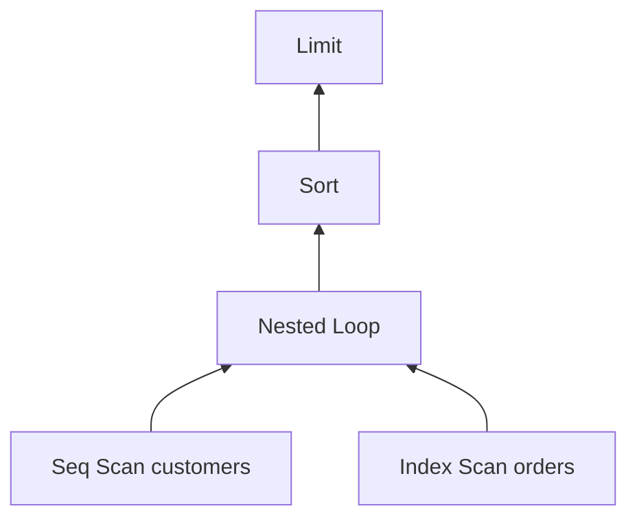
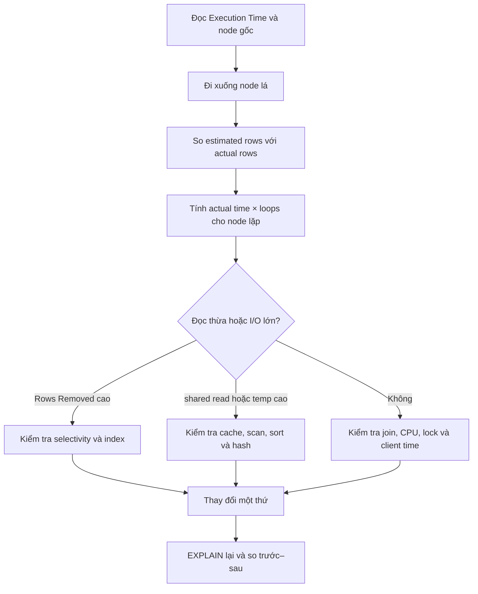

<Callout type="info" title="Phạm vi">
Bài này tập trung vào **cách đọc một execution plan trong thực tế**. Các con số trong plan là dữ liệu minh họa, nhưng cấu trúc và cách chẩn đoán bám sát output của PostgreSQL.
</Callout>

## Mục lục

- [1. Câu hỏi phỏng vấn](#1-câu-hỏi-phỏng-vấn)
- [2. Câu trả lời 30 giây](#2-câu-trả-lời-30-giây)
- [3. Chạy EXPLAIN ANALYZE an toàn](#3-chạy-explain-analyze-an-toàn)
  - [3.1. Câu lệnh nên dùng](#31-câu-lệnh-nên-dùng)
  - [3.2. Cẩn thận với câu lệnh ghi](#32-cẩn-thận-với-câu-lệnh-ghi)
- [4. Mô hình đọc plan](#4-mô-hình-đọc-plan)
  - [4.1. Đọc từ node lá lên node gốc](#41-đọc-từ-node-lá-lên-node-gốc)
  - [4.2. Phân biệt estimated và actual](#42-phân-biệt-estimated-và-actual)
  - [4.3. Hiểu đúng actual time và loops](#43-hiểu-đúng-actual-time-và-loops)
- [5. Plan thực hành](#5-plan-thực-hành)
- [6. Đọc plan từng node](#6-đọc-plan-từng-node)
  - [6.1. Seq Scan trên customers](#61-seq-scan-trên-customers)
  - [6.2. Index Scan trên orders](#62-index-scan-trên-orders)
  - [6.3. Nested Loop](#63-nested-loop)
  - [6.4. Sort và Limit](#64-sort-và-limit)
  - [6.5. Planning Time và Execution Time](#65-planning-time-và-execution-time)
- [7. Sáu tín hiệu cần tìm trong mọi plan](#7-sáu-tín-hiệu-cần-tìm-trong-mọi-plan)
  - [7.1. Ước lượng số dòng sai](#71-ước-lượng-số-dòng-sai)
  - [7.2. Đọc quá nhiều rồi loại bỏ](#72-đọc-quá-nhiều-rồi-loại-bỏ)
  - [7.3. I/O lớn qua BUFFERS](#73-io-lớn-qua-buffers)
  - [7.4. Sort hoặc hash tràn ra đĩa](#74-sort-hoặc-hash-tràn-ra-đĩa)
  - [7.5. Heap Fetches cao](#75-heap-fetches-cao)
  - [7.6. Node không bao giờ chạy](#76-node-không-bao-giờ-chạy)
- [8. Từ chẩn đoán đến tối ưu](#8-từ-chẩn-đoán-đến-tối-ưu)
  - [8.1. Thay đổi đề xuất](#81-thay-đổi-đề-xuất)
  - [8.2. Plan sau tối ưu](#82-plan-sau-tối-ưu)
  - [8.3. Cách kết luận đúng](#83-cách-kết-luận-đúng)
- [9. Workflow đọc plan trong 60 giây](#9-workflow-đọc-plan-trong-60-giây)
- [10. Những bẫy thường gặp](#10-những-bẫy-thường-gặp)
- [11. Mẫu trả lời phỏng vấn](#11-mẫu-trả-lời-phỏng-vấn)
- [12. Cheat sheet](#12-cheat-sheet)
- [13. Câu hỏi đào sâu](#13-câu-hỏi-đào-sâu)
- [14. Tài liệu liên quan](#14-tài-liệu-liên-quan)

## 1. Câu hỏi phỏng vấn

> *"Tôi đưa cho bạn output của `EXPLAIN ANALYZE`. Bạn sẽ đọc từ đâu, xác định bottleneck như thế nào, và làm sao biết cách tối ưu có thật sự hiệu quả?"*

Câu hỏi này không kiểm tra khả năng thuộc tên các node. Nó kiểm tra ba kỹ năng:

1. Đọc đúng luồng dữ liệu trong cây execution plan.
2. Phân biệt dự đoán của planner với số liệu thực tế khi chạy.
3. Dùng bằng chứng để đề xuất và kiểm chứng thay đổi.

<Callout type="warn" title="Không bắt đầu bằng việc thấy Seq Scan rồi thêm index">
`Seq Scan` không tự động là lỗi. Nếu query cần phần lớn bảng hoặc bảng rất nhỏ, quét tuần tự có thể là phương án rẻ nhất. Luôn đọc **số dòng**, **thời gian**, **loops** và **buffers** trước khi kết luận.
</Callout>

## 2. Câu trả lời 30 giây

> Tôi đọc plan từ **node thụt sâu nhất lên node gốc**, vì dữ liệu được tạo ở node lá rồi truyền lên trên. Trước tiên, tôi so `rows` ước lượng với `actual rows` để xem planner có đoán sai cardinality hay không. Sau đó, tôi tìm node tốn tài nguyên bằng `actual time`, `loops`, `Buffers`, `Rows Removed by Filter`, và dấu hiệu sort/hash tràn đĩa. Với `loops > 1`, các số `actual` là trung bình mỗi lần chạy nên phải nhân với `loops` để hiểu tổng công việc. Cuối cùng, tôi chỉ thay đổi một thứ, chạy lại cùng `EXPLAIN (ANALYZE, BUFFERS)`, rồi so thời gian, số page và số dòng trước–sau.

## 3. Chạy EXPLAIN ANALYZE an toàn

### 3.1. Câu lệnh nên dùng

Trong PostgreSQL, điểm bắt đầu thực tế thường là:

```sql
EXPLAIN (ANALYZE, BUFFERS, SETTINGS)
SELECT ...;
```

| Option | Trả lời câu hỏi nào? |
|---|---|
| `ANALYZE` | Query thực sự chạy mất bao lâu và trả bao nhiêu dòng? |
| `BUFFERS` | Query chạm bao nhiêu page trong cache, phải đọc bao nhiêu page và có dùng file tạm không? |
| `SETTINGS` | Có planner setting nào khác mặc định ảnh hưởng plan không? |
| `WAL` | Câu lệnh ghi tạo bao nhiêu WAL? |
| `FORMAT JSON` | Cần đưa plan vào công cụ trực quan hóa hoặc xử lý tự động? |

Nếu cần thời gian I/O chi tiết, PostgreSQL phải thu thập I/O timing:

```sql
SHOW track_io_timing;
SET track_io_timing = on; -- cần quyền phù hợp; có overhead nhỏ
```

Khi được bật, plan có thể hiện `I/O Timings`, giúp tách thời gian chờ đọc/ghi khỏi thời gian CPU.

### 3.2. Cẩn thận với câu lệnh ghi

`EXPLAIN ANALYZE` **thực thi câu lệnh thật**. Vì vậy, câu lệnh sau sẽ xóa dữ liệu:

```sql
EXPLAIN ANALYZE
DELETE FROM orders WHERE created_at < DATE '2024-01-01';
```

Khi cần đo một câu lệnh ghi trên môi trường kiểm thử, có thể bọc trong transaction rồi rollback:

```sql
BEGIN;

EXPLAIN (ANALYZE, BUFFERS, WAL)
DELETE FROM orders WHERE created_at < DATE '2024-01-01';

ROLLBACK;
```

<Callout type="error" title="Rollback không làm câu lệnh trở nên nhẹ">
Câu lệnh vẫn chạy, vẫn lấy lock, tạo WAL và tiêu thụ I/O trước khi rollback. Trên production, ưu tiên bản sao dữ liệu, môi trường staging tương đương, hoặc chỉ dùng `EXPLAIN` nếu chưa chắc tác động.
</Callout>

## 4. Mô hình đọc plan

### 4.1. Đọc từ node lá lên node gốc

Execution plan là một **cây**, không phải danh sách tuần tự từ trên xuống. Node con thụt vào sâu hơn và cung cấp dữ liệu cho node cha.



Trong sơ đồ này:

1. PostgreSQL tìm các customer phù hợp.
2. Với mỗi customer, PostgreSQL tìm orders tương ứng.
3. `Nested Loop` ghép các dòng.
4. `Sort` sắp xếp kết quả.
5. `Limit` trả số dòng được yêu cầu.

### 4.2. Phân biệt estimated và actual

Một node thường có hai nhóm số:

```text
Index Scan using idx_orders_customer_created on orders o
  (cost=0.43..48.20 rows=120 width=40)
  (actual time=0.050..0.780 rows=30 loops=42)
```

| Trường | Ý nghĩa |
|---|---|
| `cost=0.43..48.20` | Startup cost và total cost do planner ước lượng; **không phải mili-giây** |
| `rows=120` ở dòng cost | Số dòng planner dự đoán cho mỗi lần node chạy |
| `width=40` | Kích thước trung bình ước lượng của một dòng, tính bằng byte |
| `actual time=0.050..0.780` | Thời gian thực tế trung bình từ lúc bắt đầu đến dòng đầu và đến khi node hoàn tất một lần |
| `rows=30` ở dòng actual | Số dòng thực tế trung bình cho mỗi loop |
| `loops=42` | Node được thực thi 42 lần |

`cost` chỉ giúp planner so sánh các phương án. Không thể kết luận `cost=48.20` nghĩa là query chạy 48,20 ms.

### 4.3. Hiểu đúng actual time và loops

Khi `loops > 1`, `actual time` và `actual rows` được PostgreSQL hiển thị dưới dạng **trung bình mỗi loop**. Với node trên:

```text
Thời gian hoàn tất xấp xỉ = 0.780 ms × 42 = 32.76 ms
Số dòng tạo ra xấp xỉ    = 30 rows × 42 = 1,260 rows
```

Tuy nhiên, thời gian của node cha thường **đã bao gồm thời gian node con**. Không cộng toàn bộ thời gian các node lại với nhau, vì làm vậy sẽ đếm trùng.

<Callout type="info" title="Cách tìm bottleneck chính xác hơn">
Dùng `time × loops` để thấy lượng công việc của node lặp. Sau đó so node cha với các node con để ước lượng phần thời gian riêng của node cha. Hãy kết hợp thêm `BUFFERS`; chỉ nhìn thời gian có thể gây hiểu sai vì timing có overhead và bị ảnh hưởng bởi cache.
</Callout>

## 5. Plan thực hành

Giả sử dashboard cần 20 đơn hàng mới nhất của customer đang hoạt động tại Việt Nam:

```sql
SELECT
  o.id,
  o.customer_id,
  o.total,
  o.created_at
FROM customers AS c
JOIN orders AS o ON o.customer_id = c.id
WHERE c.country = 'VN'
  AND c.status = 'active'
ORDER BY o.created_at DESC
LIMIT 20;
```

Các index hiện có:

```sql
CREATE INDEX idx_orders_customer_created
  ON orders (customer_id, created_at DESC);
```

Plan trước khi tối ưu:

```text
Limit  (cost=52144.10..52144.15 rows=20 width=40)
       (actual time=84.110..84.118 rows=20 loops=1)
  Buffers: shared hit=5000 read=5700
  ->  Sort  (cost=52144.10..52414.10 rows=108000 width=40)
            (actual time=84.108..84.112 rows=20 loops=1)
        Sort Key: o.created_at DESC
        Sort Method: top-N heapsort  Memory: 29kB
        Buffers: shared hit=5000 read=5700
        ->  Nested Loop  (cost=0.43..49270.00 rows=108000 width=40)
                         (actual time=0.082..82.930 rows=1260 loops=1)
              Buffers: shared hit=5000 read=5700
              ->  Seq Scan on customers c
                    (cost=0.00..18500.00 rows=900 width=8)
                    (actual time=0.020..48.600 rows=42 loops=1)
                    Filter: ((country = 'VN') AND (status = 'active'))
                    Rows Removed by Filter: 999958
                    Buffers: shared hit=850 read=5520
              ->  Index Scan using idx_orders_customer_created on orders o
                    (cost=0.43..32.20 rows=120 width=40)
                    (actual time=0.050..0.780 rows=30 loops=42)
                    Index Cond: (customer_id = c.id)
                    Buffers: shared hit=4150 read=180
Planning Time: 0.820 ms
Execution Time: 84.310 ms
```

Đừng vội nhìn dòng đầu rồi kết luận. Hãy bắt đầu từ hai node sâu nhất.

## 6. Đọc plan từng node

### 6.1. Seq Scan trên customers

```text
Seq Scan on customers c
  (cost=0.00..18500.00 rows=900 width=8)
  (actual time=0.020..48.600 rows=42 loops=1)
  Filter: ((country = 'VN') AND (status = 'active'))
  Rows Removed by Filter: 999958
  Buffers: shared hit=850 read=5520
```

Node này cho thấy bốn vấn đề đáng chú ý:

1. PostgreSQL quét toàn bộ bảng `customers`.
2. Nó giữ lại 42 dòng nhưng loại 999.958 dòng.
3. Planner dự đoán 900 dòng, trong khi thực tế chỉ có 42 dòng. Ước lượng lệch khoảng 21 lần.
4. Nó phải đọc 5.520 page thay vì lấy toàn bộ từ cache.

Ở đây điều kiện chỉ lấy 42 trên 1 triệu customer. Điều kiện có **độ chọn lọc cao**, nghĩa là nó giữ lại một phần rất nhỏ. Một index phù hợp có khả năng giảm mạnh số page cần chạm.

Nói ngắn gọn: `Seq Scan` đáng nghi không phải vì tên node, mà vì **đọc gần một triệu dòng để giữ 42 dòng**.

### 6.2. Index Scan trên orders

```text
Index Scan using idx_orders_customer_created on orders o
  (cost=0.43..32.20 rows=120 width=40)
  (actual time=0.050..0.780 rows=30 loops=42)
  Index Cond: (customer_id = c.id)
  Buffers: shared hit=4150 read=180
```

Node này chạy một lần cho mỗi customer từ node ngoài. Vì `loops=42`:

- Tổng số order xấp xỉ `30 × 42 = 1.260`.
- Tổng thời gian đến khi hoàn tất các loop xấp xỉ `0,780 × 42 = 32,76 ms`.
- Planner dự đoán `120 × 900 = 108.000` dòng ở `Nested Loop`, nhưng thực tế chỉ có 1.260 dòng.

Index đang được dùng đúng để tìm order theo `customer_id`. Tuy nhiên, node này lặp 42 lần và vẫn là một phần đáng kể trong tổng thời gian.

<Callout type="warn" title="Đừng đọc 0,780 ms rồi cho rằng node này không đáng kể">
`0,780 ms` là trung bình cho **một loop**. `loops=42` mới cho thấy tổng lượng công việc. Đây là bẫy phổ biến nhất khi đọc node phía trong của `Nested Loop`.
</Callout>

### 6.3. Nested Loop

`Nested Loop` nhận 42 customer ở nhánh ngoài. Với mỗi customer, nó gọi `Index Scan` ở nhánh trong để tìm order.

Đây là lựa chọn hợp lý khi:

- Nhánh ngoài nhỏ.
- Nhánh trong có index tốt trên khóa join.
- Mỗi lần lookup trả ít dòng.

Vấn đề chính trong plan không phải tên `Nested Loop`. Vấn đề là planner dự đoán đầu ra 108.000 dòng nhưng thực tế chỉ có 1.260 dòng. Sai số ở các node con được khuếch đại khi tính cardinality của join.

Nếu nhánh ngoài thực tế là hàng trăm nghìn dòng, `Nested Loop` có thể gọi nhánh trong hàng trăm nghìn lần. Khi đó, `Hash Join` hoặc `Merge Join` có thể rẻ hơn.

### 6.4. Sort và Limit

```text
Sort
  (actual time=84.108..84.112 rows=20 loops=1)
  Sort Key: o.created_at DESC
  Sort Method: top-N heapsort  Memory: 29kB
```

`LIMIT 20` cho phép PostgreSQL dùng `top-N heapsort`. Nó chỉ giữ các ứng viên tốt nhất thay vì sắp xếp đầy đủ 1.260 dòng.

`Memory: 29kB` cho thấy sort nằm trong RAM. Đây **không** phải sort spill. Nếu thấy nội dung như sau, tình hình mới đáng lo:

```text
Sort Method: external merge  Disk: 512MB
Buffers: temp read=64000 written=64200
```

Khi đó sort đã tràn ra file tạm trên đĩa. Cần xem lại lượng dữ liệu đầu vào, index phục vụ `ORDER BY`, và `work_mem`. Không tăng `work_mem` toàn hệ thống một cách mù quáng, vì mỗi sort/hash node của mỗi query đồng thời có thể dùng bộ nhớ riêng.

### 6.5. Planning Time và Execution Time

```text
Planning Time: 0.820 ms
Execution Time: 84.310 ms
```

- `Planning Time` là thời gian parse/rewrite/plan được báo cáo cho câu lệnh.
- `Execution Time` là thời gian executor chạy plan, bao gồm overhead đo đạc của `EXPLAIN ANALYZE`.

Ở ví dụ này, planning nhỏ hơn rất nhiều execution. Vì vậy, tối ưu planner time không phải ưu tiên.

Thời gian người dùng nhìn thấy còn có thể bao gồm lấy connection, chờ lock, truyền dữ liệu qua mạng, serialize và render ở ứng dụng. `Execution Time` không đại diện cho toàn bộ end-to-end latency.

## 7. Sáu tín hiệu cần tìm trong mọi plan

### 7.1. Ước lượng số dòng sai

Planner chọn scan, join order và join algorithm dựa trên **cardinality**, tức số dòng dự đoán đi qua mỗi node.

Có thể đo mức lệch bằng Q-error:

```text
Q-error = max(estimated / actual, actual / estimated)
```

Với node `customers`:

```text
Q-error = 900 / 42 ≈ 21.4
```

Không có một ngưỡng tuyệt đối đúng cho mọi hệ thống. Tuy vậy, lệch hàng chục lần đáng điều tra; lệch hàng trăm hoặc hàng nghìn lần thường có thể làm planner chọn sai plan.

Nguyên nhân phổ biến:

- Statistics cũ sau bulk load hoặc thay đổi dữ liệu lớn.
- Phân bố dữ liệu lệch mạnh.
- Hai cột có tương quan nhưng planner ước lượng như độc lập.
- Biểu thức hoặc function khiến planner khó đoán selectivity.
- Prepared statement đang dùng generic plan không phù hợp với giá trị cụ thể.

Bước đầu tiên nên thử là:

```sql
ANALYZE customers;
```

Nếu `country` và `status` tương quan, extended statistics có thể giúp:

```sql
CREATE STATISTICS st_customers_country_status
  (dependencies, mcv)
  ON country, status
  FROM customers;

ANALYZE customers;
```

### 7.2. Đọc quá nhiều rồi loại bỏ

Các dòng sau là tín hiệu đọc thừa:

```text
Rows Removed by Filter: 999958
Rows Removed by Join Filter: 250000
```

`Rows Removed by Filter` cao có thể gợi ý:

- Thiếu index.
- Index không dùng được vì function, cast hoặc leading wildcard.
- Điều kiện vốn giữ lại phần lớn bảng, nên Seq Scan vẫn hợp lý.

Do đó, luôn so số dòng bị loại với số dòng được giữ và kích thước bảng. Con số lớn một mình chưa đủ để kết luận.

### 7.3. I/O lớn qua BUFFERS

PostgreSQL thường dùng page 8 KiB. Có thể ước lượng lượng dữ liệu được đọc:

```text
Dung lượng đọc gần đúng = shared read × 8 KiB
5.520 page × 8 KiB ≈ 43,1 MiB
```

Các trường thường gặp:

| Chỉ số | Ý nghĩa |
|---|---|
| `shared hit` | Page đã có trong shared buffer của PostgreSQL |
| `shared read` | PostgreSQL yêu cầu đọc page vào shared buffer; lần đọc có thể được phục vụ từ OS cache hoặc storage |
| `shared dirtied` | Query làm page trở thành dirty |
| `shared written` | Backend ghi page ra storage |
| `temp read/written` | Sort, hash hoặc materialization dùng file tạm |

<Callout type="info" title="shared read không luôn đồng nghĩa đọc đĩa vật lý">
Một `shared read` là cache miss ở `shared_buffers`. Hệ điều hành vẫn có thể phục vụ page từ OS page cache. Dùng thêm `I/O Timings` và metric storage để kết luận query thật sự chờ đĩa bao lâu.
</Callout>

### 7.4. Sort hoặc hash tràn ra đĩa

Tìm các dấu hiệu:

```text
Sort Method: external merge  Disk: ...
Batches: 8
Buffers: temp read=... written=...
```

`Sort Method: external merge` cho biết sort dùng file tạm. Với hash, `Batches > 1` thường cho thấy hash table không nằm trọn trong bộ nhớ được cấp.

Cách xử lý có thể là:

- Giảm số dòng trước sort/hash.
- Tạo index phù hợp với filter và thứ tự sắp xếp.
- Sửa cardinality estimation để planner chọn plan đúng.
- Điều chỉnh `work_mem` ở scope session/query sau khi đo đạc.

### 7.5. Heap Fetches cao

`Index Only Scan` vẫn có thể phải kiểm tra heap nếu visibility map chưa đánh dấu page là all-visible:

```text
Index Only Scan using idx_orders_covering on orders
  Heap Fetches: 180000
```

Nếu `Heap Fetches` cao, lợi ích của index-only scan giảm. Hãy kiểm tra autovacuum, tốc độ cập nhật dữ liệu và visibility map. Không nên thấy chữ `Index Only Scan` rồi mặc định rằng heap không bị chạm.

### 7.6. Node không bao giờ chạy

Plan đôi khi chứa:

```text
(never executed)
```

Điều này có nghĩa node không được gọi trong lần chạy cụ thể. Ví dụ, nhánh ngoài của nested loop không trả dòng nên nhánh trong không cần chạy.

`never executed` không đồng nghĩa node bị lỗi. Nó mô tả luồng điều khiển của lần thực thi hiện tại.

## 8. Từ chẩn đoán đến tối ưu

### 8.1. Thay đổi đề xuất

Plan thực hành cho thấy điều kiện trên `customers` rất chọn lọc nhưng lại quét toàn bảng. Ta có thể tạo index phù hợp:

```sql
CREATE INDEX CONCURRENTLY idx_customers_country_status_id
  ON customers (country, status, id);

ANALYZE customers;
```

Thứ tự `country, status, id` hỗ trợ hai điều kiện equality và cung cấp `id` cho phép join. Tuy nhiên, index có đáng tạo hay không còn phụ thuộc các query khác, tần suất ghi và phân bố dữ liệu.

Nếu hệ thống chỉ quan tâm đúng tập customer này và điều kiện ổn định, partial index nhỏ hơn có thể phù hợp:

```sql
CREATE INDEX CONCURRENTLY idx_customers_active_vn
  ON customers (id)
  WHERE country = 'VN' AND status = 'active';
```

Partial index chỉ hữu ích khi predicate trong query tương thích với predicate của index. Nó cũng làm tăng chi phí ghi và cần được bảo trì như mọi index khác.

### 8.2. Plan sau tối ưu

Một plan minh họa sau khi thêm index và cập nhật statistics:

```text
Limit  (actual time=34.020..34.028 rows=20 loops=1)
  Buffers: shared hit=4160 read=184
  ->  Sort  (actual time=34.018..34.022 rows=20 loops=1)
        Sort Key: o.created_at DESC
        Sort Method: top-N heapsort  Memory: 29kB
        ->  Nested Loop  (actual time=0.080..33.100 rows=1260 loops=1)
              ->  Index Only Scan using idx_customers_country_status_id on customers c
                    (actual time=0.030..0.260 rows=42 loops=1)
                    Index Cond: ((country = 'VN') AND (status = 'active'))
                    Heap Fetches: 0
                    Buffers: shared hit=10 read=4
              ->  Index Scan using idx_orders_customer_created on orders o
                    (actual time=0.050..0.760 rows=30 loops=42)
                    Index Cond: (customer_id = c.id)
                    Buffers: shared hit=4150 read=180
Planning Time: 0.910 ms
Execution Time: 34.210 ms
```

So sánh trước và sau:

| Chỉ số | Trước | Sau | Ý nghĩa |
|---|---:|---:|---|
| Execution Time | 84,31 ms | 34,21 ms | Nhanh hơn khoảng 2,46 lần trong lần đo này |
| `customers` actual time | 48,60 ms | 0,26 ms | Loại bỏ full table scan |
| Tổng shared read | 5.700 page | 184 page | Giảm mạnh lượng page cần nạp |
| Dòng join thực tế | 1.260 | 1.260 | Kết quả logic không đổi |
| Sort Method | top-N heapsort | top-N heapsort | Sort không phải vấn đề chính |

### 8.3. Cách kết luận đúng

Không nên kết luận chỉ từ một lần chạy. Cache, tải hệ thống và parameter có thể làm thời gian dao động.

Quy trình kiểm chứng tốt hơn:

1. Chạy trước và sau trên dữ liệu tương đương.
2. Dùng cùng query và cùng bộ parameter đại diện, bao gồm giá trị phổ biến và giá trị hiếm.
3. Chạy nhiều lần để phân biệt cold cache và warm cache.
4. So cả `Execution Time`, `Buffers`, rows, loops và temp I/O.
5. Kiểm tra tác động của index lên `INSERT`, `UPDATE`, `DELETE` và dung lượng lưu trữ.
6. Theo dõi query ở mức hệ thống bằng `pg_stat_statements`.

<Callout type="warn" title="Một plan nhanh hơn chưa chắc hệ thống tốt hơn">
Index mới có thể làm SELECT nhanh nhưng tăng write amplification, WAL, thời gian vacuum và dung lượng cache. Tối ưu query phải được đánh giá cùng workload tổng thể.
</Callout>

## 9. Workflow đọc plan trong 60 giây



Checklist ngắn:

1. **Node gốc:** Tổng thời gian và số dòng cuối có đúng kỳ vọng không?
2. **Node lá:** Bảng nào được đọc trước, bằng scan nào?
3. **Cardinality:** Estimated rows lệch actual rows ở node nào đầu tiên?
4. **Loops:** Node nào nhanh mỗi lần nhưng chạy quá nhiều lần?
5. **Waste:** Có `Rows Removed` hoặc intermediate result quá lớn không?
6. **I/O:** `shared read`, `temp read/written`, `I/O Timings` nằm ở đâu?
7. **Memory:** Sort/hash có spill không?
8. **Validation:** Thay một thứ rồi đo lại cùng điều kiện.

## 10. Những bẫy thường gặp

| Bẫy | Cách hiểu đúng |
|---|---|
| `cost` là mili-giây | Sai. Cost là đơn vị tương đối để planner so plan |
| Đọc plan từ trên xuống | Sai. Luồng dữ liệu đi từ node lá lên node gốc |
| Cộng thời gian mọi node | Sai. Thời gian node cha thường bao gồm node con |
| Bỏ qua `loops` | Sai. Actual time/rows là trung bình mỗi loop khi node chạy nhiều lần |
| Thấy Seq Scan là tạo index | Sai. Seq Scan có thể tối ưu nếu lấy phần lớn bảng |
| Thấy Index Scan là tốt | Sai. Index scan lặp hàng triệu lần có thể là bottleneck |
| `shared read` chắc chắn là physical disk read | Chưa chắc. OS page cache có thể phục vụ lần đọc |
| Chỉ nhìn `Execution Time` | Thiếu. Cần rows, buffers, loops, spill và kết quả nghiệp vụ |
| `EXPLAIN ANALYZE` không thay đổi dữ liệu | Sai. Nó thực thi DML thật |
| Một lần benchmark là đủ | Sai. Cache, tải và parameter có thể làm kết quả lệch |
| Tắt `enable_seqscan` để sửa production | Sai. Chỉ nên dùng tạm để thí nghiệm và so sánh phương án |
| Tăng `work_mem` toàn cục khi thấy spill | Nguy hiểm. Nhiều node và nhiều session có thể nhân mức dùng RAM |

Ngoài ra, `EXPLAIN ANALYZE` tự thêm overhead đo thời gian cho từng node. Với query có rất nhiều loop cực ngắn, overhead này có thể đáng kể. Có thể dùng `TIMING OFF` khi chỉ cần rows, loops, buffers và tổng execution time:

```sql
EXPLAIN (ANALYZE, BUFFERS, TIMING OFF)
SELECT ...;
```

## 11. Mẫu trả lời phỏng vấn

Bạn có thể trả lời theo cấu trúc sau:

> **Thứ nhất, tôi xác nhận phạm vi đo.** `EXPLAIN ANALYZE` thực thi query, nên tôi chỉ chạy an toàn trên SELECT hoặc môi trường phù hợp. Tôi thường thêm `BUFFERS`.
>
> **Thứ hai, tôi đọc từ node lá lên node gốc.** Tôi xác định bảng được truy cập bằng Seq Scan, Index Scan hay Bitmap Scan, rồi theo luồng dữ liệu qua join, aggregate, sort và limit.
>
> **Thứ ba, tôi kiểm tra cardinality.** Tôi so estimated rows với actual rows tại từng node và tìm nơi sai số bắt đầu. Sai số lớn có thể dẫn đến sai join order hoặc join algorithm.
>
> **Thứ tư, tôi tìm công việc thật.** Tôi xem `actual time × loops`, nhưng không cộng thời gian cha–con vì có tính bao hàm. Tôi đọc thêm `Rows Removed by Filter`, `Buffers`, `I/O Timings`, sort method và hash batches.
>
> **Cuối cùng, tôi kiểm chứng.** Tôi thay đổi một thứ như index, statistics hoặc query shape, chạy lại cùng workload, rồi so execution time, số page và số dòng trước–sau. Tôi cũng kiểm tra chi phí ghi của index mới.

Câu trả lời này cho thấy bạn không tối ưu theo cảm giác. Bạn dùng execution plan như một phép đo có giả thuyết và có bước kiểm chứng.

## 12. Cheat sheet

```text
┌───────────────────────────────────────────────────────────────┐
│ ĐỌC EXPLAIN ANALYZE                                           │
├───────────────────────────────────────────────────────────────┤
│ 1. Đọc từ node lá lên node gốc                               │
│ 2. So estimated rows với actual rows                         │
│ 3. Với loops > 1: actual time và rows là trung bình mỗi loop │
│ 4. Không cộng thời gian cha–con vì sẽ đếm trùng               │
│ 5. Tìm Rows Removed, shared read, temp I/O, spill             │
│ 6. Thay một thứ rồi đo lại                                    │
├───────────────────────────────────────────────────────────────┤
│ CỜ ĐỎ                                                        │
│ • Estimation lệch hàng chục/hàng trăm lần                     │
│ • Scan rất nhiều dòng để giữ rất ít dòng                      │
│ • Node trong Nested Loop có loops cực lớn                     │
│ • Sort Method: external merge                                │
│ • Hash Batches > 1                                           │
│ • temp read/written cao                                      │
│ • Index Only Scan nhưng Heap Fetches cao                     │
└───────────────────────────────────────────────────────────────┘
```

## 13. Câu hỏi đào sâu

> **Vì sao node cha có thời gian gần bằng node con?**
>
> Thời gian node cha bao gồm thời gian chờ node con tạo dữ liệu. Muốn ước lượng thời gian riêng của node cha, cần xem chênh lệch với node con và hiểu số loop. Không cộng toàn bộ node.

> **Khi nào Seq Scan là lựa chọn đúng?**
>
> Khi bảng nhỏ, khi query lấy phần lớn số dòng, hoặc khi truy cập tuần tự rẻ hơn rất nhiều lần random heap fetch. Hãy kiểm tra selectivity và buffers thay vì nhìn tên node.

> **Estimated rows đúng nhưng query vẫn chậm thì sao?**
>
> Planner có thể đoán đúng cardinality nhưng query vẫn phải đọc quá nhiều dữ liệu, sort/hash lớn, chờ storage, hoặc trả quá nhiều dòng cho client. Khi đó, statistics không phải gốc vấn đề. Hãy xem I/O, query shape và yêu cầu nghiệp vụ.

> **Tại sao thời gian trong ứng dụng lớn hơn Execution Time?**
>
> Ứng dụng còn có thể chờ connection pool, lock trước khi đo, network, truyền result set, deserialize và xử lý dữ liệu. Dùng `pg_stat_activity`, wait events, tracing và metric ứng dụng để tìm phần thời gian nằm ngoài executor.

> **Có nên dán plan production lên công cụ online không?**
>
> Plan có thể chứa tên bảng, cột, predicate và literal nhạy cảm. Hãy ẩn danh dữ liệu hoặc dùng công cụ self-hosted trước khi chia sẻ.

## 14. Tài liệu liên quan

<Cards>
  <Card title="EXPLAIN & EXPLAIN ANALYZE — Deep Dive" href="/optimization/explain-analyze-deep-dive" description="Nền tảng đầy đủ về cost, node scan, join và buffers." />
  <Card title="Index có nhưng vẫn Seq Scan" href="/interview/index-not-used-seq-scan" description="Phân tích selectivity, statistics và các biểu thức làm index mất tác dụng." />
  <Card title="Statistics & Query Planner" href="/optimization/statistics-query-planner-deep-dive" description="Hiểu cách PostgreSQL ước lượng cardinality và chọn plan." />
  <Card title="JOIN Algorithms" href="/optimization/join-algorithms-deep-dive" description="So sánh Nested Loop, Hash Join và Merge Join." />
</Cards>

Tài liệu chính thức:

- [PostgreSQL — Using EXPLAIN](https://www.postgresql.org/docs/current/using-explain.html)
- [PostgreSQL — EXPLAIN](https://www.postgresql.org/docs/current/sql-explain.html)
- [PostgreSQL — Planner Statistics](https://www.postgresql.org/docs/current/planner-stats.html)
