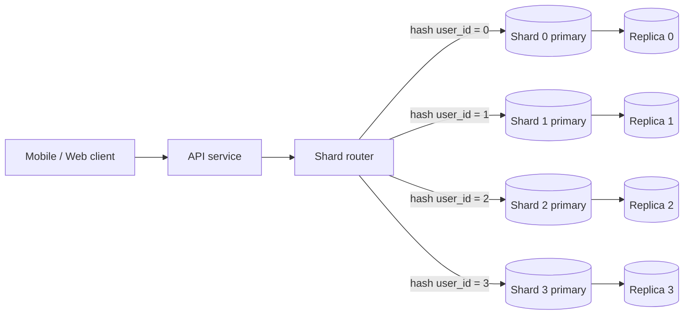
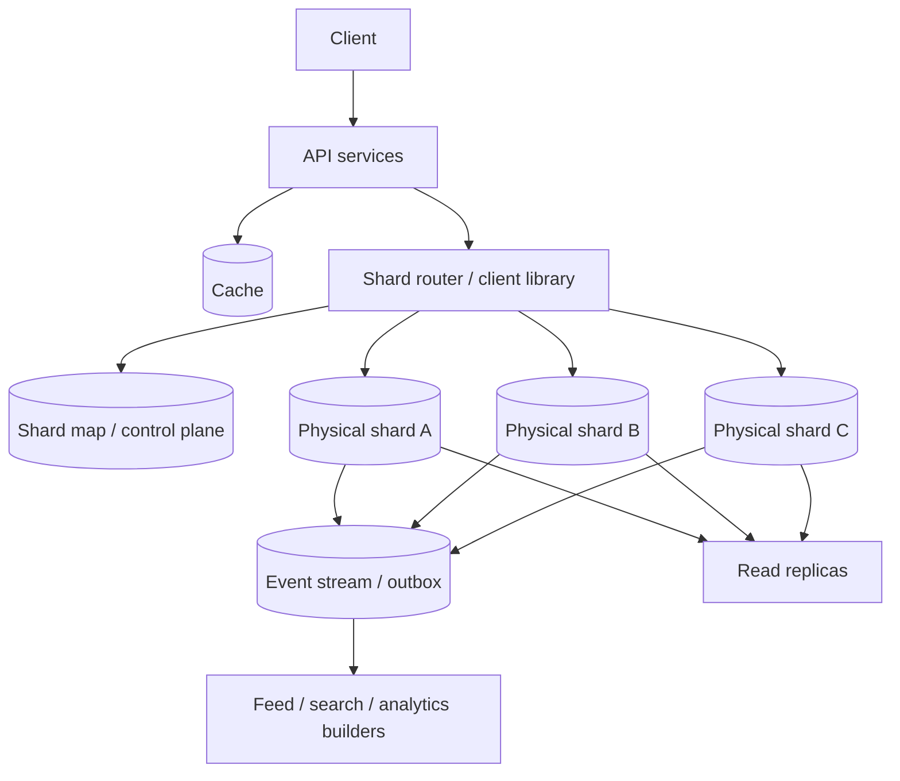
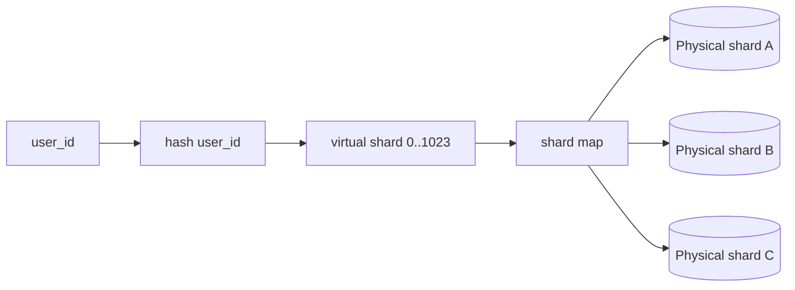
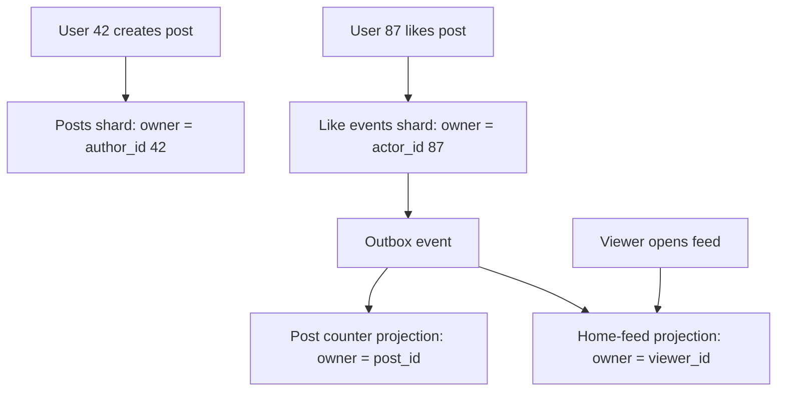
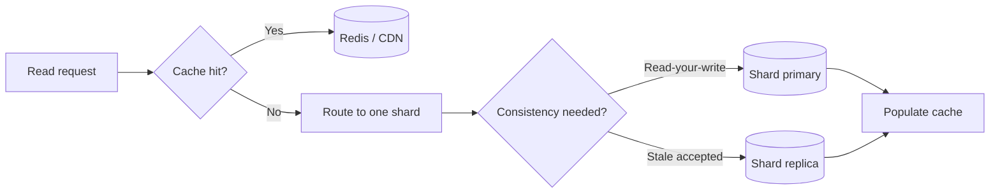
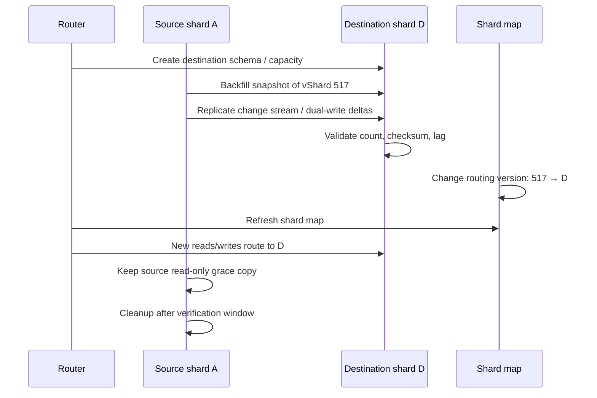

> [!IMPORTANT]
> **Sharding là một quyết định data-model, không chỉ là thêm database server.** Nó tăng write capacity bằng cách phân tán dữ liệu, nhưng cũng đưa routing, query xuyên shard, nhất quán dữ liệu và vận hành trở thành trách nhiệm của hệ thống.

## Mục lục

- [Sharding là gì?](#sharding-là-gì)
  - [Shard, partition và replica khác nhau thế nào?](#shard-partition-và-replica-khác-nhau-thế-nào)
  - [Bài toán sharding giải quyết](#bài-toán-sharding-giải-quyết)
- [Khi nào nên và không nên shard](#khi-nào-nên-và-không-nên-shard)
  - [Dấu hiệu một database đơn đã chạm giới hạn](#dấu-hiệu-một-database-đơn-đã-chạm-giới-hạn)
  - [Các lựa chọn cần thử trước](#các-lựa-chọn-cần-thử-trước)
- [Kiến trúc tổng quát](#kiến-trúc-tổng-quát)
  - [Luồng ghi](#luồng-ghi)
  - [Luồng đọc](#luồng-đọc)
- [Shard key: quyết định quan trọng nhất](#shard-key-quyết-định-quan-trọng-nhất)
  - [Các tiêu chí chấm điểm shard key](#các-tiêu-chí-chấm-điểm-shard-key)
  - [Ví dụ social app: user_id, post_id hay country?](#ví-dụ-social-app-user_id-post_id-hay-country)
  - [Một row cần được colocate với row nào?](#một-row-cần-được-colocate-với-row-nào)
- [Các chiến lược phân phối dữ liệu](#các-chiến-lược-phân-phối-dữ-liệu)
  - [Range sharding](#range-sharding)
  - [Hash modulo](#hash-modulo)
  - [Consistent hashing và virtual shards](#consistent-hashing-và-virtual-shards)
  - [Directory-based sharding](#directory-based-sharding)
  - [Geo sharding](#geo-sharding)
- [Thiết kế một social app](#thiết-kế-một-social-app)
  - [Mô hình dữ liệu và ownership](#mô-hình-dữ-liệu-và-ownership)
  - [Phân phối write](#phân-phối-write)
  - [Đọc profile, post và feed](#đọc-profile-post-và-feed)
- [Tránh scatter-gather query](#tránh-scatter-gather-query)
  - [Vì sao fan-out làm tail latency xấu đi](#vì-sao-fan-out-làm-tail-latency-xấu-đi)
  - [Các pattern thay thế](#các-pattern-thay-thế)
- [Hot shard và hot key](#hot-shard-và-hot-key)
  - [Hai loại hotspot cần phân biệt](#hai-loại-hotspot-cần-phân-biệt)
  - [Các biện pháp giảm nóng](#các-biện-pháp-giảm-nóng)
- [Tính nhất quán, transaction và ID](#tính-nhất-quán-transaction-và-id)
  - [Transaction xuyên shard](#transaction-xuyên-shard)
  - [ID toàn cục](#id-toàn-cục)
  - [Idempotency và retry](#idempotency-và-retry)
- [Read scaling: replica, cache và derived data](#read-scaling-replica-cache-và-derived-data)
- [Resharding không downtime](#resharding-không-downtime)
  - [Vì sao phải chuẩn bị trước](#vì-sao-phải-chuẩn-bị-trước)
  - [Quy trình migrate một virtual shard](#quy-trình-migrate-một-virtual-shard)
  - [Failure mode khi cutover](#failure-mode-khi-cutover)
- [Vận hành và observability](#vận-hành-và-observability)
- [Câu trả lời phỏng vấn](#câu-trả-lời-phỏng-vấn)
  - [Phiên bản 60 giây](#phiên-bản-60-giây)
  - [Câu hỏi đào sâu thường gặp](#câu-hỏi-đào-sâu-thường-gặp)
- [Checklist thiết kế](#checklist-thiết-kế)
- [Tóm tắt](#tóm-tắt)

## Sharding là gì?

**Sharding** là kỹ thuật chia dữ liệu của một database logic thành nhiều database độc lập, gọi là **shard**. Mỗi shard chứa một tập con dữ liệu và có CPU, RAM, disk, connection pool, primary/replica riêng. Ứng dụng hoặc một lớp router quyết định request phải đi tới shard nào.

Ví dụ, thay vì lưu toàn bộ `users`, `posts` và `likes` trên một PostgreSQL primary, hệ thống có thể đặt user có `user_id` khác nhau trên các shard khác nhau:



Nếu một shard chịu được khoảng 10.000 write/giây và write được phân bố gần đều, bốn shard có thể phục vụ xấp xỉ 40.000 write/giây. Đây chỉ là ước lượng năng lực thô. Throughput thực tế còn bị giới hạn bởi replication, network, index, transaction log, lock contention và traffic không đều.

### Shard, partition và replica khác nhau thế nào?

Ba khái niệm này thường bị gọi lẫn nhau, nhưng giải quyết các vấn đề khác nhau.

| Khái niệm | Dữ liệu | Mục tiêu chính | Ứng dụng có phải chọn node không? |
|---|---|---|---|
| **Table partitioning** | Một bảng được chia thành partition trong cùng database cluster | Quản lý bảng lớn, pruning, retention | Thường không; database planner tự làm |
| **Sharding** | Dữ liệu phân tán sang nhiều database/cluster độc lập | Tăng write/storage capacity theo chiều ngang | Có, trực tiếp hoặc qua router |
| **Read replica** | Bản sao của primary | Scale read, HA | Có thể chọn primary/replica, nhưng không chọn theo row ownership |
| **Cache** | Bản sao tạm thời, có thể stale | Giảm latency và tải read | Có, qua cache key |

Table partitioning vẫn có thể hữu ích **bên trong từng shard**. Ví dụ, shard theo `user_id`, sau đó partition bảng event theo tháng để xóa dữ liệu cũ nhanh hơn.

### Bài toán sharding giải quyết

Sharding phù hợp nhất khi một node đơn không còn đủ **write throughput**, **dung lượng lưu trữ**, hoặc **working set trong RAM**. Chia ownership dữ liệu cho nhiều node cho phép các shard làm việc song song.

Ví dụ, `likes` có 500.000 write/giây. Nếu mọi like phải vào một primary, node đó phải xử lý insert, update index, WAL/redo log và replication cho toàn bộ tải. Nếu like được shard theo `actor_user_id`, mỗi shard chỉ nhận một phần traffic.

> [!NOTE]
> Sharding không tự động làm một query đơn lẻ nhanh hơn. Nó làm hệ thống xử lý **nhiều request độc lập** song song hơn. Một request vẫn chỉ nhanh khi nó chạm ít shard và shard đó khỏe.

## Khi nào nên và không nên shard

### Dấu hiệu một database đơn đã chạm giới hạn

Trước khi đề xuất sharding, cần chứng minh nút thắt thực sự nằm ở database write/storage, không phải ở code ứng dụng hay query tệ.

Các dấu hiệu thường gặp:

- CPU, disk IOPS hoặc network của primary duy trì gần saturation trong peak traffic.
- Write latency P99 tăng cùng với WAL/redo generation, checkpoint pressure hoặc lock wait.
- Vertical scaling đã gần mức instance lớn nhất hoặc chi phí tăng quá nhanh.
- Disk/backup/restore/rebuild index vượt quá operational window.
- Một tenant hoặc tập dữ liệu lớn làm working set vượt RAM của một node.
- Replica chỉ giảm read load nhưng primary vẫn nghẽn vì mọi write và replication đều đi qua nó.

Đo **headroom** trước. Một database 70% CPU nhưng có query thiếu index có thể cần tối ưu query, không cần sharding. Một database 95% IOPS với write workload đã tối ưu có thể là ứng viên thực sự.

### Các lựa chọn cần thử trước

Sharding làm thay đổi cách query, migration và xử lý sự cố. Hãy cân nhắc các lựa chọn ít phức tạp hơn theo thứ tự phù hợp với vấn đề.

| Vấn đề | Thử trước | Vì sao có thể đủ |
|---|---|---|
| Read quá nhiều | Cache, read replica, CDN, materialized/derived view | Read thường dễ nhân bản hơn write |
| Query chậm | Index đúng, rewrite query, pre-aggregation | Giảm chi phí mỗi request |
| Connection quá nhiều | Connection pool, PgBouncer/proxy | Không biến connection thành overload database |
| Write burst ngắn | Queue/stream, batching, async processing | San bằng burst trước khi ghi |
| Một bảng time-series rất lớn | Native partitioning và retention | Hạn chế dữ liệu phải scan/quản lý |
| Storage/compute thiếu nhưng load đều | Vertical scale | Đơn giản hơn nếu còn headroom |

> [!WARNING]
> Không shard chỉ vì bảng có hàng trăm triệu row. Kích thước bảng không phải tiêu chí đủ. Nếu index, partitioning, archive và capacity của một cluster vẫn đáp ứng SLO, sharding có thể tạo thêm rủi ro mà không đem lại lợi ích tương xứng.

## Kiến trúc tổng quát

Một kiến trúc sharded production thường có ba lớp: **control plane**, **data plane** và **observability**.

- **Control plane** lưu metadata: virtual shard nào nằm trên physical shard nào, trạng thái migration, version routing.
- **Data plane** xử lý request thật: API service, shard router, primary, replica, cache và queue.
- **Observability** theo dõi độ lệch tải, latency, error, replication lag và tiến độ migration.



Shard map không nên nằm trong một file cấu hình deploy thủ công. Nó phải được versioned, cache được và có cơ chế cập nhật an toàn. Router có thể cache shard map trong vài giây, nhưng cần làm mới khi nhận lỗi stale routing.

### Luồng ghi

Một write tốt có thể xác định shard từ dữ liệu request trước khi query database.

Ví dụ tạo post, khi post thuộc về author `user_id = 42`:

```text
1. API xác thực user 42.
2. Router tính virtual shard từ user_id 42.
3. Shard map trả về physical shard B.
4. API ghi post vào primary của shard B.
5. Transaction cùng shard ghi outbox event.
6. Worker publish event để xây feed, notification, search index.
```

`user_id` xuất hiện ngay trong request nên router chọn đích với một phép tính hoặc một lần lookup nhỏ. Không cần broadcast request sang mọi shard.

### Luồng đọc

Read path phải phân biệt rõ dữ liệu **authoritative** và **derived**.

- Đọc profile của user 42: route theo `user_id`, thường chỉ chạm một shard.
- Đọc post theo `post_id`: cần biết post thuộc shard nào. Có thể encode shard/vShard vào ID, dùng directory lookup, hoặc lưu index `post_id → shard`.
- Đọc home feed: không nên query tất cả shard rồi sort. Nên đọc một feed materialized hoặc cache theo viewer.
- Search toàn cục: dùng search system/index chuyên dụng, không scatter query SQL sang mọi shard.

Nói ngắn gọn: sharding tốt bắt đầu từ **access pattern**, không phải từ schema hiện có.

## Shard key: quyết định quan trọng nhất

**Shard key** là trường hoặc hàm dùng để quyết định row thuộc shard nào. Nó thường là `user_id`, `tenant_id`, `account_id`, `order_id` hoặc một key dẫn xuất ổn định.

Ví dụ đơn giản:

```ts
function shardForUser(userId: bigint, shardCount: number) {
  return hash(userId) % shardCount;
}
```

Một shard key tốt phải đáp ứng đồng thời hai câu hỏi:

1. **Write có được phân phối đều không?**
2. **Các request phổ biến có route đến ít shard không?**

Chỉ tối ưu câu đầu dễ dẫn tới hệ thống write đều nhưng read lại phải fan-out đến hàng trăm shard.

### Các tiêu chí chấm điểm shard key

Dùng bảng này để đánh giá từng ứng viên, thay vì chọn key theo trực giác.

| Tiêu chí | Câu hỏi cần hỏi | Dấu hiệu tốt | Rủi ro nếu kém |
|---|---|---|---|
| Cardinality | Có đủ giá trị khác nhau không? | Hàng triệu/milliard key | Một vài key dồn vào vài shard |
| Distribution | Traffic trên mỗi key có lệch không? | Không key nào chi phối lớn | Hot shard hoặc hot key |
| Locality | Dữ liệu được đọc/ghi cùng nhau có chung key không? | Một request chạm một shard | Cross-shard join/transaction |
| Query alignment | Filter chính có chứa key không? | Lookup xác định đích | Scatter-gather |
| Immutability | Key có thay đổi không? | Gần như không đổi | Move row phức tạp |
| Availability | Key có mặt lúc route không? | Có ngay trong request/JWT/path | Lookup thêm hoặc broadcast |
| Growth | Có thể thêm shard/move data không? | Có vShard/directory indirection | Rehash dữ liệu lớn |
| Compliance | Có data residency không? | Có thể áp placement policy | Dữ liệu sai region |

Một cách thực dụng là lấy log production, nhóm write/read theo candidate key, rồi tính P50/P95/P99 request rate per key và per proposed shard. Dữ liệu thật thường bác bỏ các giả định đẹp trên whiteboard.

### Ví dụ social app: user_id, post_id hay country?

Giả sử có các bảng:

```sql
users(user_id, country, ...)
posts(post_id, author_id, created_at, body, ...)
likes(like_id, post_id, actor_id, created_at)
views(view_id, post_id, viewer_id, created_at)
```

| Shard key | Điểm mạnh | Điểm yếu | Đánh giá |
|---|---|---|---|
| `country` | Đơn giản cho data residency và local marketing query | Population/traffic rất lệch; viral region thành hot shard | Không phù hợp làm key duy nhất cho write scaling toàn cục |
| `author_id` / `user_id` | Colocate profile, post của author, setting; cardinality cao | Celebrity có nhiều post/read; like từ người khác cần xem ownership | Tốt cho user-centric data |
| `post_id` | Lookup post trực tiếp dễ; post phân bố đều nếu ID tốt | Profile/post list theo author cần secondary index; comments/likes phải chọn ownership rõ | Tốt cho object-centric workload |
| `actor_id` | Like/view writes phân bố theo người thực hiện hành động | Đếm like của một post cần aggregate qua shard | Tốt cho immutable event ingestion |
| `tenant_id` | Transaction và query trong một customer/organization rất local | Large tenant có thể thành hot tenant | Mặc định tốt cho SaaS B2B, cần escape hatch cho tenant lớn |

Không có key phổ quát. Với social app, có thể dùng **nhiều data domain với ownership khác nhau** thay vì ép toàn bộ bảng dùng cùng shard key:

- `users` và `posts`: shard theo `author_id`.
- `likes` raw event: shard theo `actor_id` để ghi đều.
- `post_like_count`: một counter/materialized aggregate theo `post_id` tại shard của post, cập nhật async hoặc striped counter.
- Search index và home feed: derived store riêng.

### Một row cần được colocate với row nào?

**Colocation** nghĩa là đặt dữ liệu thường được dùng trong cùng request vào cùng shard. Đây là cách giảm cross-shard query và transaction.

Ví dụ với SaaS invoicing, `tenant_id` thường là key tốt vì request tạo invoice thường chạm `customers`, `invoices`, `invoice_lines`, `payments` của cùng tenant. Đặt tất cả trên shard của tenant giữ transaction local.

Ngược lại, một bảng `audit_events` có thể shard theo `tenant_id` hoặc theo hash của `event_id`. Nếu màn hình audit luôn lọc tenant và time range, `tenant_id` locality quan trọng hơn phân phối tuyệt đối. Nếu hệ thống chỉ ingest event và phân tích offline, `event_id` hoặc hash bucket có thể tốt hơn.

> [!TIP]
> Trước khi chốt shard key, liệt kê top read và write path theo tần suất. Với mỗi path, ghi rõ **key có sẵn**, **số shard dự kiến chạm**, **có transaction không**, và **SLO latency**. Đây là artifact giá trị hơn sơ đồ database đơn thuần.

## Các chiến lược phân phối dữ liệu

### Range sharding

Range sharding chia key theo khoảng:

```text
user_id 0        - 9,999,999   → shard A
user_id 10,000,000 - 19,999,999 → shard B
created_at Jan-Mar             → shard C
created_at Apr-Jun             → shard D
```

**Ưu điểm**

- Dễ hiểu và route được bằng so sánh range.
- Query range trên cùng key có thể chạm ít shard.
- Dễ archive/drop dữ liệu cũ khi shard theo thời gian.

**Nhược điểm**

- Key tăng dần như auto-increment ID hoặc timestamp dồn toàn bộ write mới vào range cuối.
- Split một range nóng cần move nhiều dữ liệu và cập nhật routing.
- Range không tự cân bằng theo traffic.

Range sharding phù hợp khi range query là access pattern chính và write không chỉ dồn vào range mới nhất, hoặc khi có thêm tầng hash/bucket để phân tán write.

### Hash modulo

Hash modulo chọn shard bằng `hash(key) % N`.

```text
hash(user_id) % 4

user 101 → 2 → shard 2
user 102 → 0 → shard 0
user 103 → 3 → shard 3
```

**Ưu điểm:** đơn giản, nhanh và thường phân bố đều nếu key có cardinality cao.

**Nhược điểm lớn:** khi đổi từ 4 lên 5 shard, phần lớn key đổi kết quả. Điều đó buộc gần như toàn bộ dữ liệu phải di chuyển hoặc router phải hỗ trợ hai layout lâu dài.

```text
hash(101) % 4 = 2
hash(101) % 5 = 4  ← đích thay đổi
```

Hash modulo chỉ hợp lý khi số shard gần như cố định hoặc khi nó được áp dụng lên **virtual shard** thay vì physical shard.

### Consistent hashing và virtual shards

**Consistent hashing** đặt key và node lên một hash ring. Khi thêm/bớt node, chỉ một phần key gần node thay đổi cần di chuyển. Tuy nhiên consistent hashing thuần vẫn có thể phân phối không đều nếu số node ít hoặc capacity node khác nhau.

Cách phổ biến hơn trong database sharding là dùng **virtual shard** (còn gọi logical shard, bucket, tablet):



Ví dụ có 1.024 virtual shard và 4 physical shard. Mỗi physical shard sở hữu khoảng 256 virtual shard. Khi shard B nóng, chỉ cần move một số virtual shard từ B sang shard mới D. Router vẫn tính vShard như cũ; chỉ shard map thay đổi.

| Khái niệm | Ví dụ | Tác dụng |
|---|---|---|
| Virtual shard | bucket `0..1023` | Đơn vị phân phối/migration nhỏ |
| Physical shard | PostgreSQL cluster `db-shard-07` | Nơi dữ liệu thực sự chạy |
| Shard map | `vShard 512 → db-shard-07` | Tách thuật toán hash khỏi placement |

Chọn số vShard đủ lớn để rebalance mịn, nhưng không quá lớn đến mức metadata, connection hoặc migration scheduling trở nên nặng. Hàng trăm đến hàng nghìn bucket là điểm bắt đầu thường gặp; con số đúng phụ thuộc quy mô và tooling.

### Directory-based sharding

Directory-based sharding dùng một bảng/kv store mapping trực tiếp:

```text
tenant_id 8721 → physical shard eu-3
tenant_id 8722 → physical shard us-1
tenant_id 8723 → physical shard enterprise-9
```

Nó rất hữu ích khi placement không thể suy ra bằng hash:

- Tenant enterprise cần shard riêng.
- Data residency yêu cầu một region cụ thể.
- Tenant vừa được move vì quá nóng.
- Một customer cần isolation/compliance riêng.

Tradeoff là directory lookup trở thành thành phần critical. Nó cần cache, replication, version và fallback rõ ràng. Đừng để mỗi SQL query đều đồng bộ gọi một metadata database trung tâm.

### Geo sharding

Geo sharding đặt data gần user hoặc theo data residency, ví dụ EU data ở EU và US data ở US. Đây là **placement policy**, không phải mặc định là load-balancing policy tốt.

Ví dụ shard theo country làm China shard rất nóng trong khi New Zealand shard rảnh. Nếu cần residency lẫn scale, thường dùng hai tầng:

```text
Bước 1: Chọn region theo residency/latency: EU, US, APAC.
Bước 2: Trong mỗi region, shard theo hash(tenant_id hoặc user_id).
```

Cách này giới hạn dữ liệu trong region bắt buộc nhưng vẫn phân tán tải trong region đó.

## Thiết kế một social app

Giả sử social app có profile, post, like, comment, view và home feed. Không nên quyết định "mọi bảng shard theo X" ngay từ đầu. Hãy xác định ownership cho từng domain.

### Mô hình dữ liệu và ownership

Một phân chia khả thi:

| Domain | Primary owner | Lý do |
|---|---|---|
| User profile, setting, follow list | `user_id` | Request cá nhân chủ yếu theo user |
| Post và comment của post | `author_id` hoặc `post_id` | Đọc post/detail phải route chính xác |
| Like/view raw event | `actor_id` hoặc hash event key | Write-heavy, append-only, cần phân tán |
| Counter của post | `post_id` owner | Đọc count theo post, có thể cập nhật async |
| Home feed | `viewer_id` | Read path theo viewer cần một lookup |
| Search | Search index riêng | Full-text/global search không hợp SQL scatter-gather |



Điểm quan trọng: like raw event và like counter có thể không ở cùng shard. Hệ thống chấp nhận eventual consistency cho counter để đổi lấy write scale và read locality.

### Phân phối write

#### Tạo post

Nếu post nằm ở shard của author, transaction local có thể tạo post, cập nhật danh sách post của author và ghi outbox event trong cùng database transaction.

```sql
BEGIN;

INSERT INTO posts (post_id, author_id, body, created_at)
VALUES (:post_id, :author_id, :body, now());

INSERT INTO outbox (event_id, event_type, payload, created_at)
VALUES (:event_id, 'post_created', :payload, now());

COMMIT;
```

Worker đọc outbox và fan-out notification/feed/search một cách async. Đây là **transactional outbox pattern**: event được ghi cùng transaction với dữ liệu gốc nên tránh trường hợp post đã commit nhưng publish event bị mất.

#### Like post

Like cần idempotent vì mobile client và queue có thể retry. Nếu raw like được route theo `actor_id`, unique key cần phản ánh semantics:

```sql
-- Trong shard của actor
CREATE UNIQUE INDEX one_active_like_per_actor_post
ON likes (actor_id, post_id);
```

Sau khi insert thành công, một event `like_created` được publish. Counter ở post shard được cập nhật bất đồng bộ. UI có thể hiển thị count trễ vài giây, nhưng không double-count khi consumer idempotent theo `event_id`.

#### View event

View thường là event volume cao nhất. Không nhất thiết phải đồng bộ ghi từng view trực tiếp vào OLTP primary:

- Buffer qua Kafka/PubSub/queue.
- Batch vào event store hoặc data warehouse.
- Aggregate theo cửa sổ thời gian.
- Chỉ ghi một sampled hoặc deduplicated view nếu product semantics cho phép.

Sharding không bù được một data model ghi đồng bộ mọi telemetry event mà không có backpressure hoặc batching.

### Đọc profile, post và feed

| Read path | Route | Số shard mục tiêu | Gợi ý thiết kế |
|---|---|---:|---|
| `GET /users/42` | `user_id = 42` | 1 | Cache-aside + replica nếu chấp nhận stale |
| `GET /posts/abc` | decode shard từ ID hoặc directory lookup | 1 | Cache hot post; primary read sau write nếu cần |
| `GET /users/42/posts` | `author_id = 42` | 1 | Index `(author_id, created_at DESC)` local |
| `GET /feed` | `viewer_id` | 1 | Fan-out-on-write/read hybrid; cache feed |
| Global trending | Derived aggregate | Không query OLTP shard trực tiếp | Stream processor/materialized view |
| Search | Search index | 1 search cluster/query | Async indexing, eventual consistency |

## Tránh scatter-gather query

**Scatter-gather** là khi router gửi cùng một query đến nhiều hoặc tất cả shard, sau đó gom và merge kết quả. Nó đôi khi cần thiết, nhưng không được là đường đi mặc định của request online.

### Vì sao fan-out làm tail latency xấu đi

Giả sử query phải chạm 100 shard. Router chỉ có thể trả kết quả sau shard chậm nhất phản hồi.

- Mỗi shard có P99 là 50 ms không có nghĩa query toàn cục P99 là 50 ms.
- Xác suất có ít nhất một shard chậm tăng nhanh theo số shard.
- Router còn phải merge, sort, deduplicate và có thể retry shard lỗi.
- Một shard down biến query toàn cục thành partial result hoặc failure.

Nếu mỗi shard độc lập có 1% khả năng vượt 100 ms, request chạm 100 shard có xác suất xấp xỉ `1 - 0.99^100 ≈ 63%` có ít nhất một shard vượt 100 ms. Các biến cố không hoàn toàn độc lập trong production, nhưng trực giác vẫn đúng: fan-out khuếch đại tail latency.

### Các pattern thay thế

| Nhu cầu | Thiết kế nên cân nhắc | Tradeoff |
|---|---|---|
| List post của một author | Shard theo `author_id` | Không tối ưu cho query toàn cục |
| Home feed | Materialize theo `viewer_id`; cache | Write amplification, eventual consistency |
| Global search | Elasticsearch/OpenSearch/Meilisearch hoặc service search | Index async, dữ liệu có thể trễ |
| Global analytics | Warehouse/lakehouse/OLAP | Không phải real-time OLTP tuyệt đối |
| Global leaderboard | Stream aggregate + sorted set/OLAP | Semantics gần real-time cần xác định |
| Admin query hiếm | Scatter-gather có timeouts và pagination | Chậm/đắt nhưng chấp nhận được |

Nếu bắt buộc scatter-gather, hãy giới hạn blast radius:

- Chỉ query shard trong một region hoặc tenant cohort.
- Pagination theo cursor thay vì lấy toàn bộ rồi sort.
- Timeouts per shard và deadline tổng.
- Cho phép partial result rõ ràng nếu product chấp nhận.
- Rate-limit các admin/report query nặng.
- Cache kết quả aggregate khi có thể.

## Hot shard và hot key

Hash tốt chỉ phân phối **nhiều key** gần đều. Nó không thể làm một key đơn lẻ tự nhiên bớt nóng.

### Hai loại hotspot cần phân biệt

| Loại | Ví dụ | Triệu chứng | Cách xử lý chính |
|---|---|---|---|
| **Hot shard** | 10% vShard trên physical shard B có traffic cao | B nóng hơn shard khác | Move/rebalance vShard |
| **Hot key** | Post của celebrity nhận 100.000 like/giây | Một row/partition/key nóng dù shard còn capacity | Cache, batching, striping, async aggregate, isolate key |

Ví dụ `hash(user_id)` có thể phân phối user đều. Nhưng một celebrity có `user_id = 7` vẫn nằm trên đúng một shard. Tất cả write vào profile/follower row hoặc post của họ có thể tạo local contention.

### Các biện pháp giảm nóng

**1. Rebalance virtual shard**

Nếu hot load đến từ nhiều user/bucket, move vShard sang physical shard rảnh. Đây là lý do virtual shard hữu ích.

**2. Split hot entity**

Không giữ một counter duy nhất bị update liên tục:

```text
like_counter(post_id, stripe 0..63)
```

Mỗi like tăng một stripe, ví dụ `hash(like_id) % 64`. Read cộng 64 stripe hoặc dùng projection/cache aggregate. Cách này đổi read complexity lấy write contention thấp hơn.

**3. Buffer và batch**

Like/view có thể vào stream trước. Consumer gộp 1.000 increment thành một update aggregate. Độ trễ tăng nhỏ nhưng primary không phải xử lý từng increment đồng bộ.

**4. Cache read hot object**

Post viral thường read-heavy. Cache content và counter ngắn hạn giúp database tránh chịu read amplification. Dùng TTL, request coalescing/singleflight và CDN cho media/content public.

**5. Isolate tenant/key lớn**

Một tenant enterprise quá lớn có thể được đặt shard riêng qua directory map. Một post/event cực nóng có thể đi vào pipeline riêng thay vì mô hình OLTP mặc định.

**6. Quota và backpressure**

Không phải mọi tải đều phải hấp thụ vô hạn. Rate limit, load shedding và queue quota bảo vệ toàn hệ thống khi traffic bất thường hoặc abuse.

> [!WARNING]
> Đừng sửa hot key bằng cách tăng số shard một cách mù quáng. Nếu mọi request vẫn cùng route tới một key, thêm shard không thay đổi điểm nóng.

## Tính nhất quán, transaction và ID

### Transaction xuyên shard

Trong một database đơn, có thể dùng transaction ACID cho nhiều bảng. Qua shard, atomic commit đòi hỏi distributed transaction như two-phase commit (2PC), hoặc application phải chấp nhận workflow eventual consistency.

2PC có thể cung cấp atomicity, nhưng tăng độ phức tạp, latency và failure mode: coordinator failure, prepared transaction tồn đọng, recovery khó và throughput thấp hơn. Nhiều hệ thống quy mô lớn tránh đưa 2PC vào online write path phổ biến.

Các pattern thường dùng:

| Mục tiêu | Pattern | Ví dụ |
|---|---|---|
| Giữ transaction local | Chọn shard key để colocate dữ liệu | Invoice và payment cùng `tenant_id` |
| Publish thay đổi tin cậy | Transactional outbox | Post commit rồi phát event |
| Điều phối nhiều bước | Saga + compensating action | Đặt hàng, reserve inventory, charge payment |
| Tránh duplicate | Idempotency key + unique constraint | Retry payment/create-like |
| Đọc dữ liệu tổng hợp | Projection async/materialized view | Like count, feed, search |

Ví dụ chuyển tiền giữa account ở hai shard:

```text
Không nên: trừ tiền shard A, rồi hy vọng cộng tiền shard B thành công.

Nên: tạo transfer có state machine:
PENDING → FUNDS_RESERVED → CREDITED → COMPLETED
                         ↘ FAILED / COMPENSATED
```

Exact flow phụ thuộc domain. Với tiền thật, ledger design và compliance có thể yêu cầu stronger consistency hoặc database/distributed transaction chuyên biệt. Không gọi eventual consistency là câu trả lời chung cho mọi bài toán tài chính.

### ID toàn cục

Auto-increment ID độc lập trên từng shard sẽ trùng nhau. Hệ thống cần một global identity strategy.

| Cách | Ví dụ | Ưu điểm | Hạn chế |
|---|---|---|---|
| UUIDv4 | random 128-bit | Không cần coordinator, dễ tạo tại client/service | Không có thứ tự thời gian; index locality có thể kém |
| UUIDv7 / ULID | time-ordered unique ID | Gần thứ tự thời gian, index locality tốt hơn | Clock/implementation cần đúng |
| Snowflake-style | timestamp + worker + sequence | Compact, sortable, throughput cao | Cần worker ID/clock discipline |
| ID block/range | shard A cấp một range riêng | Đơn giản trong vài hệ thống | Rebalancing/central allocator cần quản lý |
| Encode shard/vShard | ID chứa routing hint | Lookup by ID route một bước | Placement thay đổi cần indirection hoặc stable vShard |

Đừng encode **physical shard ID** cứng vào ID nếu dự định reshard. Encode stable virtual shard, hoặc vẫn giữ directory mapping, để physical placement thay đổi mà ID không mất ý nghĩa.

### Idempotency và retry

Network timeout không cho biết write đã commit hay chưa. Client retry có thể tạo duplicate post, like hoặc payment nếu server không có idempotency.

Một pattern tối thiểu:

```sql
CREATE TABLE idempotency_keys (
  actor_id bigint NOT NULL,
  idempotency_key uuid NOT NULL,
  response_json jsonb,
  created_at timestamptz NOT NULL DEFAULT now(),
  PRIMARY KEY (actor_id, idempotency_key)
);
```

Request retry cùng key được route cùng shard của actor. Transaction kiểm tra hoặc insert key và trả kết quả đã có. Pattern cụ thể cần xử lý request đang chạy, expiry và response replay, nhưng nguyên tắc không đổi: retry phải an toàn trước khi hệ thống phân tán hơn.

## Read scaling: replica, cache và derived data

Sharding và read scaling bổ sung cho nhau:



### Replica

Replica scale read nhưng thường replication bất đồng bộ. Ngay sau khi user tạo post, read từ replica có thể chưa thấy post. Các lựa chọn:

- Sticky read-to-primary trong một thời gian ngắn sau write.
- Session token chứa replication position, đọc replica chỉ khi nó đã catch up.
- Read-your-write qua cache/write-through.
- Chấp nhận UI hiển thị trễ khi business semantics cho phép.

### Cache

Cache key phải chứa đầy đủ scope để không trộn dữ liệu giữa shard/tenant, ví dụ:

```text
user-profile:v3:user:42
post:v2:post:01J...
feed:v7:viewer:42
```

Các vấn đề cần xử lý:

- Invalidation sau write hoặc TTL phù hợp.
- Cache stampede khi key hot hết hạn cùng lúc.
- Negative caching cho object không tồn tại nếu có lookup abuse.
- Authorization: cache object public và private không được dùng cùng key/policy.
- Cache không phải source of truth; cần fallback khi miss hoặc cache down.

### Derived data

Feed, search, trending, counter và dashboard thường là **derived data**: chúng được tạo từ event/data gốc để tối ưu một read pattern. Điều này giảm scatter-gather, nhưng đổi lấy pipeline async, retry, replay và observability.

Đây là tradeoff thường đáng giá. Không nên cố phục vụ global feed hoặc global search bằng `SELECT` qua toàn bộ OLTP shard.

## Resharding không downtime

Resharding là quá trình thay đổi placement dữ liệu khi thêm shard, thay capacity hoặc giải quyết skew. Nó khó hơn initial sharding vì hệ thống vẫn đang nhận read/write trong lúc data di chuyển.

### Vì sao phải chuẩn bị trước

Nếu routing là `hash(key) % physicalShardCount`, tăng từ 8 lên 9 shard làm phần lớn key đổi vị trí. Một migration như vậy phải copy gần toàn bộ dataset và hỗ trợ routing kép dài ngày.

Virtual shard làm việc này nhỏ hơn: thêm physical shard chỉ cần move một số bucket. Directory mapping cho phép move tenant riêng lẻ. Cả hai là **indirection** cần có từ ngày đầu nếu hệ thống dự kiến tăng trưởng.

### Quy trình migrate một virtual shard

Giả sử vShard 517 đang ở shard A và cần chuyển sang shard D.



Các bước cụ thể:

1. **Provision đích.** Tạo schema, index, credentials, monitoring và capacity trên shard D.
2. **Snapshot/backfill.** Copy dữ liệu thuộc vShard 517 từ A sang D. Copy phải resumable và có checksum/count validation.
3. **Đồng bộ delta.** Trong khi copy, write mới vẫn đến A. Cần dual-write có version, CDC/change stream, hoặc log replay để D bắt kịp.
4. **Verify.** So sánh row count, checksum theo range, max version/timestamp và error. Không chỉ so sánh tổng row count.
5. **Cutover routing.** Atomically đổi owner trong shard map với `routing_version` mới. Router phải biết refresh và retry request bị stale.
6. **Grace period.** Giữ source trong trạng thái read-only/redirect một thời gian để phát hiện stale client, replay hoặc rollback routing nhanh.
7. **Cleanup.** Chỉ xóa source khi metrics, consistency check và backup/recovery plan đều ổn.

### Failure mode khi cutover

| Failure | Hậu quả | Mitigation |
|---|---|---|
| Router cache shard map cũ | Ghi vào shard cũ sau cutover | Routing version, stale-route error, refresh + retry |
| Dual-write không idempotent | Duplicate/mismatch ở destination | Event/version ID và upsert có condition |
| Delta lag chưa về 0 | Destination thiếu update mới | Không cutover trước catch-up barrier |
| Clock không đồng bộ | So sánh timestamp sai | Logical sequence/version thay timestamp wall clock |
| Source xóa quá sớm | Không rollback được | Grace period, snapshot/backup, approval gate |
| Schema destination khác | Query/write lỗi sau route | Schema migration được kiểm chứng trước copy |

> [!IMPORTANT]
> Resharding cần một **source of truth về ownership** duy nhất. Không để hai router/service tự suy luận placement theo hai version thuật toán khác nhau mà không có versioning và rollout plan.

## Vận hành và observability

Sharded system không thể quan sát chỉ bằng metric tổng. Tổng QPS đẹp có thể che một shard đang 100% CPU.

### Dashboard tối thiểu

| Nhóm | Metric cần xem theo **từng shard** | Mục tiêu |
|---|---|---|
| Load | QPS, write/s, row/s, connection, CPU, IOPS | Phát hiện saturation/skew |
| Latency | P50/P95/P99 read/write, lock wait | Phát hiện tail latency và hotspot |
| Storage | Disk used, WAL/redo rate, table/index growth | Bảo đảm headroom |
| Replication | Lag time/bytes, replay rate, failed replica | Bảo vệ read freshness/DR |
| Errors | Timeout, deadlock, retry, stale-route, partial-result | Phát hiện routing/migration issue |
| Distribution | vShard load, key frequency, top tenant/post | Phân biệt hot shard và hot key |
| Migration | Copy lag, checksum mismatch, cutover state | Reshard an toàn |

Các chỉ số phân phối nên có cả **max/median ratio**. Ví dụ một shard có 80.000 writes/s, median shard 20.000 writes/s, ratio 4× là tín hiệu rõ hơn tổng 800.000 writes/s.

### Runbook sự cố cơ bản

**Shard nóng:** xác nhận hot shard hay hot key → giảm load/caching/rate limit → move vShard nếu nhiều key → isolate/split nếu một key.

**Replica lag:** chuyển read quan trọng về primary hoặc cache phù hợp → giảm background write/backfill → kiểm tra WAL, disk, network → chỉ resume khi lag ổn định.

**Shard unavailable:** router ngừng gửi traffic tới node lỗi → failover primary/replica theo runbook → phục hồi routing → replay outbox/queue idempotently → kiểm tra missing/duplicate write.

**Shard map lỗi:** rollback map version nếu safe → invalidate router cache → chặn write khi ownership mơ hồ thay vì để split-brain → điều tra audit log và reconcile data.

## Câu trả lời phỏng vấn

### Phiên bản 60 giây

> “Nếu bottleneck là write capacity của một primary đã được tối ưu và scale dọc gần giới hạn, tôi sẽ shard dữ liệu theo một key có cardinality cao và phù hợp access pattern, thường là `user_id`, `tenant_id` hoặc `account_id`.
>
> Tôi không chỉ chọn key để write đều. Tôi sẽ kiểm tra top read/write path để đa số request có thể route tới một shard, tránh scatter-gather. Ví dụ SaaS thường colocate dữ liệu theo `tenant_id`; social app có thể shard profile/post theo owner và đưa feed/search/counter sang derived store.
>
> Tôi dùng hash vào nhiều virtual shard rồi shard map ánh xạ virtual shard sang physical database. Cách này cho phép rebalance từng bucket khi thêm capacity thay vì rehash toàn bộ data. Cache và read replica xử lý read-heavy traffic, còn transaction xuyên shard được hạn chế bằng colocating data, outbox/Saga và idempotency thay vì mặc định dùng distributed transaction.
>
> Cuối cùng, tôi theo dõi load từng shard, P99, replica lag, top hot key và chuẩn bị resharding online với backfill, delta sync, routing version và validation trước cutover.”

Câu trả lời này thể hiện bạn hiểu throughput, data locality và vận hành; không chỉ biết định nghĩa `hash(key) % N`.

### Câu hỏi đào sâu thường gặp

**“Vì sao không shard theo country?”**

Country có cardinality thấp và distribution thường lệch. Một nước lớn có thể tạo hot shard. Dùng country làm placement layer cho residency, sau đó hash `user_id`/`tenant_id` trong mỗi region thường cân bằng hơn.

**“Nếu post của celebrity viral thì `post_id` vẫn chỉ ở một shard, xử lý sao?”**

Phân biệt read và write. Read content qua cache/CDN. Like/view được buffer và aggregate async, hoặc dùng striped counter. Nếu một key thật sự write-hot, thêm shard không đủ; cần split/batch/isolate key.

**“Làm sao query theo `post_id` nếu posts shard theo `author_id`?”**

Có ba lựa chọn: ID chứa stable vShard routing hint; directory/index `post_id → owner shard`; hoặc store post detail projection được route theo post ID. Chọn theo tỷ lệ lookup và khả năng reshard; không broadcast query sang mọi shard.

**“Thêm shard mới có phải move toàn bộ data không?”**

Với modulo trực tiếp, thường gần như có. Với virtual shard hoặc directory map, chỉ move bucket/tenant được chọn. Vì vậy indirection nên được thiết kế từ đầu.

**“Khi nào dùng distributed transaction?”**

Chỉ khi business invariant cần atomicity xuyên shard và hạ tầng thật sự hỗ trợ/đo được tradeoff. Trước đó, cố colocate data. Với workflow có thể eventual consistent, dùng outbox, Saga và idempotency thường scale/vận hành tốt hơn.

**“Cache có làm sharding không cần thiết?”**

Cache giảm read load, không tăng write capacity hay storage của primary. Nếu write là bottleneck thật, cache chỉ giải quyết một phần gián tiếp. Nếu read mới là bottleneck, cache/replica thường rẻ và đơn giản hơn shard.

## Checklist thiết kế

### Trước khi shard

- [ ] Đã xác nhận bottleneck bằng metric, không chỉ dựa vào table size.
- [ ] Đã thử hoặc loại trừ index/query tuning, cache, replica, queue/batching, partitioning và vertical scale.
- [ ] Có SLO cho read/write, RPO/RTO và data residency/compliance.
- [ ] Có inventory top read/write path theo tần suất và latency budget.

### Chọn shard key

- [ ] Key có cardinality cao và write distribution được kiểm chứng bằng data thật.
- [ ] Phần lớn request online route được đến 1 shard hoặc một tập nhỏ hữu hạn.
- [ ] Transaction quan trọng được colocate cùng shard khi có thể.
- [ ] Key có sẵn trước khi query hoặc có directory lookup/cache rõ ràng.
- [ ] Có chiến lược cho large tenant, celebrity/hot object và skew.
- [ ] Key không thay đổi, hoặc có quy trình move ownership rõ ràng.

### Routing và data model

- [ ] Router có shard map versioned, cache và stale-route retry.
- [ ] ID là global unique; không hard-code physical shard nếu dự kiến reshard.
- [ ] Global search/report/feed dùng derived store thay vì OLTP fan-out mặc định.
- [ ] Cross-shard write có outbox/Saga/idempotency và reconciliation plan.
- [ ] Cache key có tenant/auth/version scope đúng.

### Vận hành và tăng trưởng

- [ ] Dashboard/alert theo từng shard và vShard, không chỉ metric aggregate.
- [ ] Theo dõi P99, replication lag, storage headroom, top key và load skew.
- [ ] Có backup/restore/failover test cho từng shard.
- [ ] Có runbook hot shard, hot key, bad shard map và partial outage.
- [ ] Resharding có snapshot, delta sync, validation, cutover version và rollback/grace period.

## Tóm tắt

Sharding là câu trả lời đúng khi một database node thật sự không còn đáp ứng write/storage workload. Nhưng câu trả lời đầy đủ không phải là “chia thành 10 server”.

Một thiết kế tốt cần:

1. Chọn shard key dựa trên **distribution và access pattern**.
2. Giữ request phổ biến chạm **một shard** bằng colocation và derived data.
3. Phân biệt **hot shard** với **hot key**, vì cách xử lý khác nhau.
4. Dùng cache/replica cho read; không dùng sharding như thuốc chữa mọi vấn đề.
5. Hạn chế cross-shard transaction bằng data ownership, outbox, Saga và idempotency.
6. Dùng virtual shard hoặc directory map để reshard/rebalance online.
7. Quan sát load ở cấp shard và chuẩn bị runbook trước khi cần migrate.

> [!TIP]
> Câu hỏi quan trọng nhất trong mọi bài sharding là: **“Một request phổ biến sẽ chạm bao nhiêu shard, và điều gì xảy ra khi một key hoặc một shard trở nên nóng?”** Nếu trả lời được câu này bằng số liệu và tradeoff cụ thể, thiết kế đã đi đúng hướng.
