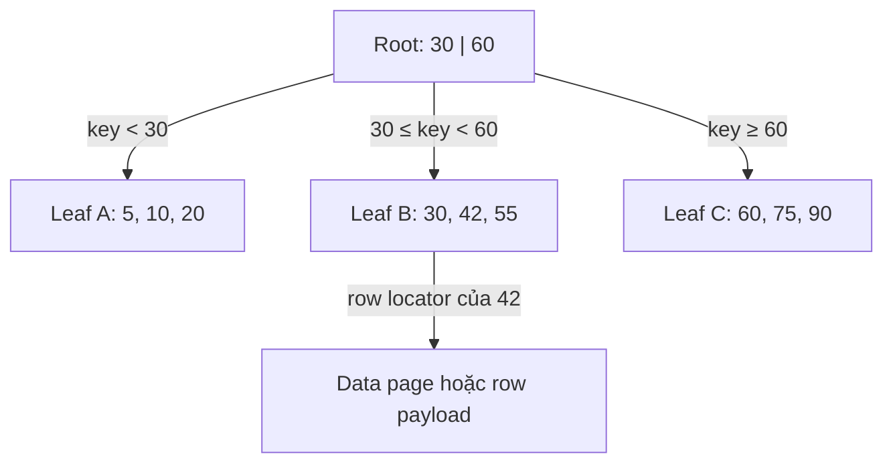
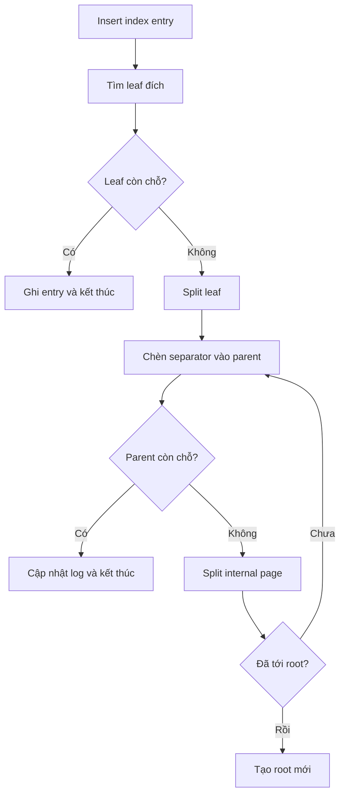

<Callout type="info" title="Phạm vi">
  Tài liệu này giải thích B+Tree từ góc nhìn của một database index trên đĩa. Các con số về kích thước page, ngưỡng split và cách dọn entry đã xóa phụ thuộc từng hệ quản trị, nhưng mô hình tìm kiếm và sắp xếp là giống nhau.
</Callout>

## Mục lục

- [Mô hình B Plus Tree](#mô-hình-b-plus-tree)
  - [B Tree và B Plus Tree khác gì](#b-tree-và-b-plus-tree-khác-gì)
  - [Bốn bất biến quan trọng](#bốn-bất-biến-quan-trọng)
- [Cấu trúc một node trên đĩa](#cấu-trúc-một-node-trên-đĩa)
  - [Internal page dùng để điều hướng](#internal-page-dùng-để-điều-hướng)
  - [Leaf page giữ index entry](#leaf-page-giữ-index-entry)
  - [Leaf page liên kết với nhau](#leaf-page-liên-kết-với-nhau)
- [Vì sao cây rất nông](#vì-sao-cây-rất-nông)
  - [Fanout quyết định chiều cao](#fanout-quyết-định-chiều-cao)
  - [Độ phức tạp phải tính theo page](#độ-phức-tạp-phải-tính-theo-page)
- [Tra cứu một khóa chính xác](#tra-cứu-một-khóa-chính-xác)
  - [Ví dụ tìm khóa 42](#ví-dụ-tìm-khóa-42)
  - [Chi phí fetch row sau khi tìm thấy leaf](#chi-phí-fetch-row-sau-khi-tìm-thấy-leaf)
- [Quét theo khoảng](#quét-theo-khoảng)
  - [Range scan diễn ra như thế nào](#range-scan-diễn-ra-như-thế-nào)
  - [Vì sao ORDER BY và LIMIT có thể rất nhanh](#vì-sao-order-by-và-limit-có-thể-rất-nhanh)
- [Chèn và tách page](#chèn-và-tách-page)
  - [Chèn khi leaf còn chỗ](#chèn-khi-leaf-còn-chỗ)
  - [Leaf split khi page đầy](#leaf-split-khi-page-đầy)
  - [Split lan lên root](#split-lan-lên-root)
- [Xóa và cập nhật](#xóa-và-cập-nhật)
  - [Xóa trong sách giáo khoa và trong database](#xóa-trong-sách-giáo-khoa-và-trong-database)
  - [Cập nhật cột có index](#cập-nhật-cột-có-index)
- [Từ leaf entry đến row thật](#từ-leaf-entry-đến-row-thật)
  - [PostgreSQL heap table](#postgresql-heap-table)
  - [MySQL InnoDB clustered index](#mysql-innodb-clustered-index)
  - [Các hệ quản trị khác](#các-hệ-quản-trị-khác)
- [Composite index được sắp xếp ra sao](#composite-index-được-sắp-xếp-ra-sao)
  - [Thứ tự từ điển của tuple](#thứ-tự-từ-điển-của-tuple)
  - [Leftmost prefix xuất hiện từ đâu](#leftmost-prefix-xuất-hiện-từ-đâu)
- [Khi B Plus Tree nhanh và chậm](#khi-b-plus-tree-nhanh-và-chậm)
  - [Những truy vấn phù hợp](#những-truy-vấn-phù-hợp)
  - [Những trường hợp index không mang lại lợi ích](#những-trường-hợp-index-không-mang-lại-lợi-ích)
  - [Ảnh hưởng của key rộng và kiểu chèn](#ảnh-hưởng-của-key-rộng-và-kiểu-chèn)
- [Quan sát B Plus Tree qua execution plan](#quan-sát-b-plus-tree-qua-execution-plan)
  - [PostgreSQL](#postgresql)
  - [MySQL](#mysql)
- [Các hiểu lầm thường gặp](#các-hiểu-lầm-thường-gặp)
- [Tóm tắt](#tóm-tắt)

## Mô hình B Plus Tree

B+Tree là một cây tìm kiếm **cân bằng** và **nhiều nhánh**. “Cân bằng” nghĩa là mọi đường đi từ root xuống leaf có cùng số tầng. “Nhiều nhánh” nghĩa là mỗi node có thể trỏ tới hàng trăm node con, thay vì chỉ hai nhánh như binary search tree.

Trong database, một node thường tương ứng với một **page** — đơn vị dữ liệu mà storage engine đọc, ghi và cache. Vì mỗi lần đọc page có thể đắt hơn hàng nghìn phép so sánh trong CPU, B+Tree cố giữ cây thấp bằng cách nhét nhiều key vào mỗi page.

```text
                              Root page
                         [ 30 | 60 | 90 ]
                         /      |      \
                        /       |       \
               Internal page    ...    Internal page
                 [10 | 20]                [110 | 130]
                  /  |  \                  /   |   \
                 ▼   ▼   ▼                ▼    ▼    ▼
              Leaf pages được sắp xếp và nối với nhau
             [1..9] ⇄ [10..19] ⇄ [20..29] ⇄ ... ⇄ [130..]
```

### B Tree và B Plus Tree khác gì

Hai cấu trúc cùng thuộc họ cây cân bằng nhiều nhánh, nhưng vị trí lưu dữ liệu khác nhau:

| Đặc điểm | B-Tree | B+Tree |
| --- | --- | --- |
| Entry trỏ tới row | Có thể nằm ở internal node và leaf | Nằm ở leaf |
| Internal node | Có thể vừa điều hướng vừa giữ dữ liệu | Chủ yếu giữ separator key và child pointer |
| Leaf ordering | Không bắt buộc tạo một chuỗi duyệt tuần tự | Thường có sibling link để quét liên tiếp |
| Range scan | Có thể phải quay lại nhiều nhánh của cây | Tìm điểm đầu rồi đi dọc leaf |
| Fanout | Thấp hơn nếu internal node phải giữ payload lớn | Cao hơn vì internal entry nhỏ |

Các database thường gọi index mặc định là **B-tree index**, dù cách tổ chức thực tế mang nhiều đặc tính của B+Tree hoặc một biến thể tối ưu cho concurrency. Khi đọc tài liệu của PostgreSQL, MySQL, Oracle hay SQL Server, đừng suy luận chỉ từ tên gọi. Hãy xem leaf chứa gì và row locator được lưu ở đâu.

### Bốn bất biến quan trọng

B+Tree duy trì bốn tính chất cốt lõi:

1. **Key trong mỗi page được sắp xếp.** Database có thể binary search bên trong page thay vì đọc tuần tự từng entry.
2. **Internal page chia không gian key thành các khoảng.** Mỗi child pointer chịu trách nhiệm cho một khoảng không chồng lấn với child bên cạnh.
3. **Mọi leaf nằm cùng độ sâu.** Không có nhánh dài 6 tầng trong khi nhánh khác chỉ dài 2 tầng.
4. **Entry dữ liệu nằm ở leaf.** Internal page chỉ cần đủ thông tin để chọn nhánh.

<Callout type="warn" title="Đừng áp dụng máy móc sách giáo khoa">
  Database thực tế còn phải xử lý MVCC, transaction, WAL, crash recovery và nhiều session cùng sửa một page. Vì vậy, quy tắc “node luôn đầy ít nhất một nửa” hoặc “DELETE lập tức merge node” thường không đúng tuyệt đối trong production.
</Callout>

## Cấu trúc một node trên đĩa

Một page không chỉ là mảng key. Nó còn có header, con trỏ tới vùng trống, metadata transaction và các slot trỏ tới từng item. Layout cụ thể khác nhau giữa các engine, nhưng mô hình sau đủ để hiểu đường đi của query:

```text
┌──────────────────────────────────────────────────────────────────┐
│ Page header                                                      │
│ page id · loại page · số item · free-space offset · sibling link │
├──────────────────────────────────────────────────────────────────┤
│ Item directory                                                   │
│ slot 1 │ slot 2 │ slot 3 │ ...                                  │
├──────────────────────────────────────────────────────────────────┤
│                         Free space                               │
├──────────────────────────────────────────────────────────────────┤
│ Item data                                                        │
│ key/pointer │ key/pointer │ key/pointer │ ...                    │
└──────────────────────────────────────────────────────────────────┘
```

Page thường có kích thước cố định. PostgreSQL thường dùng page 8 KiB. InnoDB thường dùng page 16 KiB theo cấu hình mặc định. Kích thước cố định giúp buffer pool cache và flush dữ liệu theo đơn vị nhất quán.

### Internal page dùng để điều hướng

Internal page chứa **separator key** và **child pointer**. Separator không nhất thiết là một bản sao đầy đủ của business key. Một engine có thể rút gọn separator miễn là giá trị đó vẫn phân biệt đúng hai khoảng lân cận.

Ví dụ internal page chứa `[30 | 60]`:

```text
                 [ 30 | 60 ]
                  /    |    \
                 /     |     \
          key < 30   30 ≤ key < 60   key ≥ 60
```

Khi tìm `42`, database không cần biết row của `42` nằm ở đâu ngay tại root. Root chỉ trả lời: “hãy đi vào child ở giữa”.

### Leaf page giữ index entry

Leaf page giữ các entry đã sắp xếp. Mỗi entry gồm:

- **Search key**: giá trị một cột hoặc tuple của composite index.
- **Row locator hoặc row payload**: cách đi tới row thật, tùy loại index và storage engine.
- **Metadata**: có thể gồm thông tin transaction, độ dài hoặc cờ trạng thái.

```text
┌──────────────────────── Leaf page #812 ────────────────────────┐
│ (30, 'paid')    → row locator A                                │
│ (30, 'pending') → row locator B                                │
│ (31, 'paid')    → row locator C                                │
│ (31, 'paid')    → row locator D                                │
│ (32, 'shipped') → row locator E                                │
└────────────────────────────────────────────────────────────────┘
```

Duplicate key không phá vỡ thứ tự. Engine dùng thêm row locator hoặc một giá trị ẩn để phân biệt nhiều entry có cùng search key. Với unique index, engine còn phải kiểm tra xem một entry trùng có đang visible với transaction hay không trước khi cho phép ghi.

### Leaf page liên kết với nhau

Leaf page thường giữ con trỏ tới sibling bên trái và bên phải:

```text
        prev                 next                 next
         ◄──┐                 ┌──►                 ┌──►
┌───────────┴────┐   ┌────────┴───────┐   ┌────────┴───────┐
│ 10  14  18  21 │ ⇄ │ 25  30  33  39 │ ⇄ │ 42  47  51  58 │
└────────────────┘   └────────────────┘   └────────────────┘
```

Liên kết này là lý do range scan hiệu quả. Sau khi tìm thấy leaf đầu tiên, database không cần quay lại root cho từng key tiếp theo. Nó chỉ đi sang sibling kế tiếp cho đến khi vượt khỏi điều kiện dừng.

Sibling link còn hỗ trợ scan ngược cho `ORDER BY ... DESC` trong nhiều engine. Tuy nhiên, khả năng dùng index cho một thứ tự cụ thể vẫn phụ thuộc hướng sort, collation và thứ tự cột của composite index.

## Vì sao cây rất nông

### Fanout quyết định chiều cao

**Fanout** là số child mà một internal page có thể trỏ tới. Nếu page chứa được 300 child pointer, mỗi tầng mới mở rộng phạm vi thêm khoảng 300 lần.

Giả sử:

- Một internal page có fanout khoảng `300`.
- Một leaf page chứa khoảng `250` index entry.
- Root luôn được cache sau khi index trở nên “nóng”.

Một cây ba tầng `root → internal → leaf` có thể địa chỉ hóa xấp xỉ:

```text
300 × 300 × 250 = 22,500,000 index entries
```

Thêm một tầng internal sẽ nâng sức chứa lý thuyết lên hàng tỷ entry. Con số thật thay đổi theo độ rộng key, page header, fill factor và compression, nhưng kết luận không đổi: **B+Tree của một bảng lớn thường chỉ cao vài page**.

### Độ phức tạp phải tính theo page

Ta thường viết lookup B+Tree là `O(log N)`. Chính xác hơn cho storage là:

```text
Số page trên đường tìm kiếm ≈ O(log_f N)
```

Trong đó `f` là fanout, thường lớn hơn 2 rất nhiều. Với một triệu row, database không nhất thiết thực hiện 20 lần đọc page như binary search tree. Nó có thể chỉ đọc root, một internal page và một leaf page.

Bên trong từng page, database vẫn phải so sánh key. Việc này diễn ra trong memory và thường dùng binary search hoặc kỹ thuật tìm kiếm được tối ưu riêng. Chi phí đáng quan tâm nhất vẫn là:

1. Page có nằm trong buffer pool không?
2. Nếu không, cần bao nhiêu random I/O để đọc page?
3. Sau khi tìm leaf, có phải đọc thêm data page để lấy row không?

<Callout type="idea" title="Mô hình chi phí hữu ích">
  Hãy đếm page read trước khi đếm phép so sánh. Một B+Tree chỉ cao ba tầng vẫn có thể chậm nếu query phải fetch hàng trăm nghìn row từ các data page rải rác.
</Callout>

## Tra cứu một khóa chính xác

### Ví dụ tìm khóa 42

Giả sử index có cây đơn giản sau:



Query:

```sql
SELECT *
FROM users
WHERE id = 42;
```

Database thực hiện các bước:

1. Đọc root page.
2. So sánh `42` với separator `30` và `60`.
3. Chọn child chịu trách nhiệm cho khoảng `[30, 60)`.
4. Đọc leaf page và binary search entry `42`.
5. Lấy row locator hoặc row payload từ leaf.
6. Nếu leaf chưa chứa toàn bộ cột cần trả về, đọc thêm data page.

Cây luôn cân bằng nên mọi exact lookup đi qua cùng số tầng. Một key ở đầu index không “gần root hơn” key ở cuối index.

### Chi phí fetch row sau khi tìm thấy leaf

Tìm được index entry chưa chắc đã hoàn thành query. Với secondary index, leaf thường không chứa tất cả cột trong `SELECT`.

```text
B+Tree lookup          Table lookup
──────────────         ─────────────
Root                   Data page #91
  ↓                         ▲
Internal                    │
  ↓                         │ row locator
Leaf entry ─────────────────┘
```

Nếu query trả một row, một lần fetch thêm thường rẻ. Nếu query trả 100.000 row, 100.000 row locator có thể dẫn tới rất nhiều data page rải rác. Đây là lúc optimizer có thể chọn table scan dù index tồn tại.

**Covering index** giảm chi phí này bằng cách giữ đủ cột cần thiết ngay tại leaf. PostgreSQL gọi plan tương ứng là `Index Only Scan` khi visibility cho phép. MySQL thường hiển thị `Using index` trong `Extra`.

## Quét theo khoảng

### Range scan diễn ra như thế nào

Xét query:

```sql
SELECT id, created_at
FROM orders
WHERE created_at >= '2026-01-01'
  AND created_at <  '2026-02-01';
```

B+Tree không tìm từng ngày riêng lẻ. Nó làm hai pha:

1. **Seek**: đi từ root xuống leaf chứa key đầu tiên lớn hơn hoặc bằng `2026-01-01`.
2. **Scan**: đi dọc các entry và sibling leaf cho đến khi gặp key `>= 2026-02-01`.

```text
                    Seek một lần
                         │
                         ▼
... ⇄ [2025-12-28 ... 2026-01-03] ⇄ [2026-01-04 ... 2026-01-20] ⇄ [2026-01-21 ... 2026-02-04] ⇄ ...
                 ▲                                                          ▲
                 └────────────── scan các entry thỏa điều kiện ─────────────┘
                                                                            dừng trước 2026-02-01
```

Chi phí gần đúng là:

```text
O(log_f N + số leaf page phải quét + chi phí fetch row)
```

Vì vậy, range scan trả 20 row và range scan trả 20 triệu row có cùng chi phí seek ban đầu nhưng hoàn toàn khác nhau về tổng I/O.

### Vì sao ORDER BY và LIMIT có thể rất nhanh

Nếu thứ tự index khớp với `ORDER BY`, database có thể đọc entry theo đúng thứ tự mong muốn và dừng sớm ở `LIMIT`:

```sql
CREATE INDEX idx_orders_customer_created
ON orders (customer_id, created_at DESC);

SELECT id, created_at, total
FROM orders
WHERE customer_id = 42
ORDER BY created_at DESC
LIMIT 20;
```

Leaf entries của `customer_id = 42` đã nằm cạnh nhau và được sắp theo `created_at DESC`. Engine seek tới đầu khoảng của customer `42`, đọc 20 entry rồi dừng. Nó không cần lấy toàn bộ đơn hàng ra để sort.

Nếu index chỉ có `(customer_id)` thì database vẫn tìm đúng customer nhanh, nhưng phải sort các row đó theo `created_at`. Nếu index là `(created_at, customer_id)`, các row của customer `42` có thể rải khắp cây và leftmost prefix không còn khớp query.

## Chèn và tách page

### Chèn khi leaf còn chỗ

Khi insert một row có indexed key, engine:

1. Đi từ root xuống leaf đích.
2. Tìm vị trí đúng theo thứ tự key.
3. Ghi index entry vào vùng trống của leaf.
4. Ghi log phục hồi và metadata transaction theo cơ chế của engine.

Ví dụ chèn `47` vào leaf còn chỗ:

```text
Trước: [ 30 | 42 | 55 ]
Sau:   [ 30 | 42 | 47 | 55 ]
```

Các entry về mặt logic vẫn được sắp xếp. Trên page vật lý, engine có thể di chuyển bytes hoặc chỉ cập nhật item directory. Chi tiết này không thay đổi cách query nhìn thấy index.

### Leaf split khi page đầy

Nếu leaf không còn đủ chỗ, engine phải **split page**. Ví dụ minh họa giả định leaf chứa tối đa bốn key:

```text
Trước khi chèn 47:

Parent:          [ 30 | 60 ]
                       │
Leaf:         [ 30 | 42 | 45 | 55 ]   ← đầy

Sau khi chèn và split:

Parent:       [ 30 | 45 | 60 ]
                    /      \
                   /        \
Leaf trái: [ 30 | 42 ] ⇄ [ 45 | 47 | 55 ] :Leaf phải
                            ▲
                            └─ separator 45 được copy lên parent
```

Trong B+Tree, separator `45` vẫn tồn tại ở leaf phải. Bản sao tại parent chỉ dùng để điều hướng. Đây là điểm khác quan trọng với một số mô tả B-Tree, nơi median key có thể được chuyển hẳn lên parent.

Split tạo thêm công việc:

- Cấp phát hoặc tái sử dụng một page.
- Phân phối lại entry giữa hai page.
- Sửa sibling link.
- Chèn separator vào parent.
- Ghi WAL hoặc redo log để crash recovery có thể khôi phục trạng thái hợp lệ.

Chiến lược chọn điểm split phụ thuộc engine. Database không nhất thiết chia đúng 50/50. Với workload insert tăng dần, nó có thể chừa thêm chỗ ở page bên phải để giảm split lặp lại.

### Split lan lên root

Parent cũng là page hữu hạn. Nếu parent đầy khi nhận separator mới, parent phải split và đẩy một separator lên tầng cao hơn. Quá trình có thể lan tới root:



Root split là thao tác duy nhất làm cây cao thêm một tầng. Nó hiếm hơn leaf split rất nhiều vì một root hoặc internal page có fanout lớn.

<Callout type="warn" title="Page split không đồng nghĩa query luôn chậm">
  Split làm tăng chi phí ghi tại thời điểm xảy ra. Tác động dài hạn phụ thuộc locality, free space, cache và cách engine tái sử dụng page. Đừng kết luận index “fragmented” chỉ từ việc biết đã có split; hãy đo bằng công cụ của database cụ thể.
</Callout>

## Xóa và cập nhật

### Xóa trong sách giáo khoa và trong database

Trong thuật toán sách giáo khoa, xóa key có thể làm node thiếu entry. Cây sẽ mượn entry từ sibling hoặc merge hai node, rồi cập nhật separator ở parent.

```text
Redistribute:  sibling dư entry → chuyển một phần sang page thiếu
Merge:         hai page ít entry → gộp thành một page, xóa separator ở parent
```

Database production thường trì hoãn công việc này vì transaction khác có thể vẫn nhìn thấy version cũ:

- **PostgreSQL** có thể để lại dead index tuple cho tới khi `VACUUM` dọn. PostgreSQL không cố merge mọi page vừa trở nên thưa như thuật toán lớp học.
- **InnoDB** dùng MVCC và purge để dọn version không còn cần thiết. Page merge diễn ra theo ngưỡng và chính sách của engine, không nhất thiết ngay sau câu `DELETE`.

Takeaway: `DELETE` về mặt logic loại bỏ entry, nhưng dung lượng file index không nhất thiết giảm ngay. Muốn đánh giá bloat hoặc reclaim space, phải dùng metric và lệnh bảo trì đúng cho từng database.

### Cập nhật cột có index

Nếu indexed key thay đổi, engine phải bảo toàn thứ tự của cây. Về mặt logic, nó thực hiện:

```text
xóa entry với key cũ + chèn entry với key mới
```

Ví dụ:

```sql
UPDATE orders
SET status = 'shipped'
WHERE id = 42;
```

Nếu có index `(status, created_at)`, entry có `status = 'paid'` không thể sửa tại chỗ thành `shipped` nếu vị trí sắp xếp mới nằm ở leaf khác. Engine phải tạo đường đi tới vị trí mới.

Nếu chỉ cập nhật cột không nằm trong index, một số engine tránh được phần lớn index maintenance. PostgreSQL còn có HOT update trong điều kiện phù hợp: không có indexed column nào đổi và heap page còn đủ chỗ. Đây là lý do thêm quá nhiều index làm workload `UPDATE` đắt hơn, kể cả query đọc được cải thiện.

## Từ leaf entry đến row thật

B+Tree mô tả cách tìm key. Cách leaf trỏ tới row lại phụ thuộc storage engine.

### PostgreSQL heap table

PostgreSQL lưu table theo dạng heap. B-tree leaf entry thường chứa indexed key và **TID** — định danh vị trí tuple trong heap, thường biểu diễn bằng `(block number, item offset)`.

```text
B-tree leaf                         Heap table
┌──────────────────────┐           ┌──────────────────────────┐
│ email='a@example.com'│           │ block 917                │
│ TID=(917, 4) ────────┼──────────►│ item 4: user row         │
└──────────────────────┘           └──────────────────────────┘
```

Một `Index Scan` thường đọc leaf rồi đọc heap page. Một `Index Only Scan` có thể trả dữ liệu từ index, nhưng PostgreSQL vẫn phải biết row có visible với snapshot không. Visibility map giúp tránh heap fetch khi page được đánh dấu all-visible.

### MySQL InnoDB clustered index

InnoDB tổ chức primary key thành clustered index:

- Leaf của **primary-key B+Tree** chứa row data.
- Leaf của **secondary index** chứa secondary key và primary-key value.

```text
Secondary index on email              Clustered primary-key tree
┌────────────────────────────┐        ┌─────────────────────────────┐
│ email='a@example.com'      │        │ PK=42 + toàn bộ row data    │
│ primary key=42 ────────────┼───────►│ name, email, created_at ... │
└────────────────────────────┘        └─────────────────────────────┘
```

Query dùng secondary index có thể cần hai lần tree traversal: một lần tìm secondary key, lần nữa tìm primary key trong clustered tree. Nếu secondary index đã cover toàn bộ cột cần trả về, lần lookup thứ hai có thể được bỏ qua.

Hệ quả thực tế: primary key rộng làm mọi secondary index rộng theo, vì primary-key value được lặp ở leaf của từng secondary index.

### Các hệ quản trị khác

| Hệ quản trị | Leaf của index thường trỏ tới gì? | Ghi chú |
| --- | --- | --- |
| PostgreSQL | Heap TID | Table không tự sắp theo primary key |
| MySQL InnoDB primary index | Row data | Primary key là clustered index |
| MySQL InnoDB secondary index | Primary-key value | Có thể cần lookup lần hai |
| SQL Server clustered index | Row data | Mỗi table tối đa một clustered index |
| SQL Server nonclustered index | Clustering key hoặc RID | Phụ thuộc table là clustered hay heap |
| Oracle B-tree index | ROWID | Dùng ROWID để truy cập table block |

Tên “clustered” không có cùng semantics tuyệt đối giữa mọi hệ quản trị. Luôn đọc tài liệu của engine đang dùng trước khi suy luận về số lần lookup.

## Composite index được sắp xếp ra sao

### Thứ tự từ điển của tuple

Composite index không phải nhiều cây độc lập ghép lại. Index `(tenant_id, status, created_at)` là **một cây** có search key là tuple ba phần.

Các tuple được so từ trái sang phải:

```text
(10, 'paid',    '2026-01-01')
(10, 'paid',    '2026-01-02')
(10, 'pending', '2025-12-30')
(11, 'paid',    '2024-01-01')
```

Ở tuple cuối, `tenant_id = 11` quyết định thứ tự ngay lập tức. `created_at = 2024-01-01` không thể đưa tuple đó lên trước nhóm `tenant_id = 10`.

### Leftmost prefix xuất hiện từ đâu

Vì tuple được sắp từ trái sang phải, index có thể xác định một khoảng liên tục cho:

```sql
WHERE tenant_id = 10;

WHERE tenant_id = 10
  AND status = 'paid';

WHERE tenant_id = 10
  AND status = 'paid'
  AND created_at >= '2026-01-01';
```

Nhưng với điều kiện chỉ có `status = 'paid'`, các entry `paid` xuất hiện trong mọi nhóm `tenant_id`. Không có một khoảng liên tục duy nhất để seek:

```text
tenant 10: cancelled, paid, pending
tenant 11: cancelled, paid, pending
tenant 12: cancelled, paid, pending
                     ▲
        'paid' lặp lại trong từng tenant
```

Đây là nguồn gốc tự nhiên của **leftmost prefix rule**. Một số optimizer có skip scan hoặc kết hợp nhiều range để tận dụng phần cột phía sau, nhưng đó là chiến lược bổ sung. Thiết kế index chính vẫn nên bám theo access pattern thường xuyên nhất.

<Callout type="idea" title="Quy tắc thiết kế thực dụng">
  Với query có equality và range, thường đặt các cột equality liên tiếp trước, rồi đặt cột range. Sau đó dùng `EXPLAIN` để xác nhận predicate nào thực sự trở thành điều kiện truy cập index.
</Callout>

## Khi B Plus Tree nhanh và chậm

### Những truy vấn phù hợp

B+Tree phù hợp khi dữ liệu cần một thứ tự toàn phần và query có thể thu hẹp thành một hoặc vài khoảng liên tục:

| Pattern | Vì sao phù hợp |
| --- | --- |
| `column = value` | Seek tới đúng vùng key |
| `<`, `<=`, `>`, `>=`, `BETWEEN` | Seek điểm đầu rồi scan leaf |
| `ORDER BY` khớp index | Leaf đã có thứ tự cần thiết |
| `MIN`, `MAX` | Đọc entry đầu hoặc cuối của khoảng |
| Prefix search như `LIKE 'abc%'` | Có thể chuyển thành khoảng theo collation hoặc operator class phù hợp |
| Pagination bằng keyset | Tiếp tục scan từ key cuối của trang trước |
| Unique constraint | Tìm key trùng hiệu quả trước khi ghi |

Ví dụ keyset pagination:

```sql
SELECT id, created_at
FROM events
WHERE (created_at, id) < ('2026-03-01 10:00:00+00', 98123)
ORDER BY created_at DESC, id DESC
LIMIT 50;
```

Với index `(created_at DESC, id DESC)`, engine seek tới tuple mốc rồi đọc 50 entry kế tiếp. Nó không phải bỏ qua hàng triệu row như `OFFSET` lớn.

### Những trường hợp index không mang lại lợi ích

B+Tree tồn tại không đồng nghĩa optimizer phải dùng nó.

| Trường hợp | Vấn đề |
| --- | --- |
| Query trả phần lớn table | Scan index rồi fetch nhiều row có thể đắt hơn sequential scan |
| `LIKE '%keyword'` | Không có left boundary để seek trên B+Tree thông thường |
| Hàm trên cột không khớp expression index | Thứ tự của giá trị gốc không giúp tìm kết quả của hàm |
| Implicit cast sai phía | Engine có thể phải biến đổi từng indexed value |
| Composite index thiếu cột bên trái | Các giá trị cần tìm rải trong nhiều khoảng |
| Cột có rất ít giá trị và một giá trị chiếm đa số | Lookup vẫn dẫn tới quá nhiều row |
| Statistics cũ hoặc sai | Optimizer ước lượng sai số row và chọn plan kém |

Ví dụ `status = 'active'` khớp 95% table. Index seek được tới nhóm `active`, nhưng sau đó vẫn phải đọc gần toàn bộ leaf và phần lớn data page. Full table scan có thể rẻ hơn.

Nói ngắn gọn: **B+Tree tối ưu việc tìm vị trí bắt đầu; nó không làm biến mất chi phí đọc tập kết quả lớn.**

### Ảnh hưởng của key rộng và kiểu chèn

Key càng rộng thì mỗi page chứa càng ít entry. Fanout giảm, index lớn hơn và cache được ít phần trăm cây hơn.

```text
Key nhỏ  → nhiều entry/page → fanout cao → cây thấp → cache tốt
Key rộng → ít entry/page    → fanout thấp → cây cao → nhiều I/O hơn
```

Kiểu phân bố của key mới cũng ảnh hưởng write path:

- **Key tăng dần** như sequence thường ghi vào leaf bên phải. Locality tốt, nhưng page cuối có thể thành điểm tranh chấp khi concurrency rất cao.
- **Key ngẫu nhiên** như UUID v4 phân tán insert trên nhiều leaf. Nó giảm điểm nóng tập trung nhưng tăng random write, page split ở giữa cây và working set trong cache.
- **Key gần tăng dần** như UUID v7 cố cân bằng locality và khả năng tạo ID phân tán. Hiệu quả thật vẫn phụ thuộc engine, workload và độ rộng key.

Không có lựa chọn luôn thắng. Hãy đo write throughput, index size, cache hit và query latency trên workload thật.

## Quan sát B Plus Tree qua execution plan

Execution plan không vẽ toàn bộ cây, nhưng cho biết optimizer định seek, scan và fetch row như thế nào.

### PostgreSQL

```sql
EXPLAIN (ANALYZE, BUFFERS)
SELECT id, created_at
FROM orders
WHERE customer_id = 42
  AND created_at >= '2026-01-01'
ORDER BY created_at;
```

Với index `(customer_id, created_at)`, plan tốt có thể giống:

```text
Index Scan using idx_orders_customer_created on orders
  Index Cond: ((customer_id = 42)
               AND (created_at >= '2026-01-01'::timestamp))
  Buffers: shared hit=8
```

Đọc các dấu hiệu:

- `Index Cond` cho biết predicate được dùng để xác định vùng index.
- `Filter` cho biết predicate còn phải kiểm tra sau khi đọc entry hoặc row.
- `Rows Removed by Filter` lớn cho thấy scan đang đọc thừa nhiều.
- `Heap Fetches` trong `Index Only Scan` cho thấy vẫn phải quay lại heap để kiểm tra visibility.
- `Buffers` giúp đánh giá số page thực tế đã đụng tới.

### MySQL

```sql
EXPLAIN ANALYZE
SELECT id, created_at
FROM orders
WHERE customer_id = 42
  AND created_at >= '2026-01-01'
ORDER BY created_at;
```

Các trường cần chú ý trong `EXPLAIN` truyền thống:

- `key`: index được chọn.
- `type`: `const`, `ref`, `range`, `index` hay `ALL`.
- `key_len`: phần key mà optimizer có thể tận dụng.
- `rows`: số row ước lượng phải đọc.
- `Extra: Using index`: query được cover bởi index.
- `Extra: Using filesort`: thứ tự index không đáp ứng hoàn toàn `ORDER BY`.

<Callout type="warn" title="Đo, đừng đoán">
  Cùng một B+Tree có thể được seek ở query này nhưng bị bỏ qua ở query khác. Statistics, số row dự kiến, cột trong `SELECT`, cache và cost model đều ảnh hưởng quyết định. Hãy dùng `EXPLAIN ANALYZE` trên dữ liệu đại diện thay vì chỉ nhìn câu lệnh `CREATE INDEX`.
</Callout>

## Các hiểu lầm thường gặp

| Hiểu lầm | Thực tế |
| --- | --- |
| “Một triệu row cần khoảng 20 lần đọc vì `log₂(1.000.000)`.” | B+Tree có fanout hàng trăm. Cây thường chỉ cao vài page; 20 là trực giác của cây nhị phân. |
| “Mỗi internal key trỏ trực tiếp tới row.” | Internal entry chủ yếu chọn child. Row locator hoặc row payload nằm ở leaf. |
| “Exact lookup luôn là `O(1)` nếu root được cache.” | Vẫn phải đi qua các tầng còn lại và có thể fetch data page. Độ phức tạp là logarithmic theo fanout. |
| “Có index thì query chắc chắn dùng index.” | Optimizer có thể chọn table scan nếu kết quả lớn hoặc lookup row quá đắt. |
| “DELETE lập tức trả dung lượng index về hệ điều hành.” | MVCC và cơ chế cleanup thường trì hoãn reclaim; file không nhất thiết co lại. |
| “Page split luôn chia đúng 50/50.” | Split policy là chi tiết implementation và có thể tối ưu cho hướng insert. |
| “Composite index là nhiều single-column index ghép lại.” | Nó là một cây, được sắp theo một tuple từ trái sang phải. |
| “Leaf luôn chứa toàn bộ row.” | Chỉ clustered index của một số engine làm vậy. Secondary index thường giữ row locator. |
| “B+Tree chỉ hữu ích cho dấu bằng.” | Thứ tự và sibling link khiến nó đặc biệt mạnh cho range scan và `ORDER BY`. |
| “Big O đủ để dự đoán latency.” | Cache miss, số data page, độ rộng key, selectivity và concurrency thường quyết định latency thật. |

## Tóm tắt

B+Tree nhanh không phải vì nó biến lookup thành phép màu, mà vì nó tối ưu đúng đơn vị chi phí của database: **page I/O**.

1. Internal page giữ separator và child pointer để loại bỏ phần lớn không gian tìm kiếm sau mỗi lần đọc.
2. Fanout lớn giữ cây thấp, thường chỉ vài tầng ngay cả với hàng triệu row.
3. Leaf page giữ index entry theo thứ tự và thường nối với sibling để range scan liên tục.
4. Exact lookup đi từ root xuống một leaf; query có thể cần thêm table lookup để lấy row.
5. Range scan chỉ seek một lần rồi đi dọc leaf cho tới upper bound.
6. Insert vào page đầy gây split; split có thể lan lên và root split làm cây cao thêm.
7. Delete và update phải tuân theo MVCC và crash recovery, nên hành vi thực tế phức tạp hơn thuật toán sách giáo khoa.
8. Composite index sắp theo tuple từ trái sang phải; leftmost prefix là hệ quả trực tiếp của thứ tự đó.
9. Index chỉ đáng giá khi nó giảm đủ số page phải đọc. Tập kết quả lớn vẫn có thể khiến table scan thắng.

<Cards>
  <Card title="Index SQL — Deep Dive" href="/optimization/index-sql-deep-dive/" description="Đi từ cấu trúc index tới selectivity, covering index và execution plan." />
  <Card title="Composite Index và Leftmost Prefix" href="/optimization/composite-index-deep-dive/" description="Thiết kế thứ tự cột cho equality, range và ORDER BY." />
  <Card title="EXPLAIN ANALYZE — Deep Dive" href="/optimization/explain-analyze-deep-dive/" description="Đọc plan, row estimate và buffer để xác minh hiệu năng." />
</Cards>
