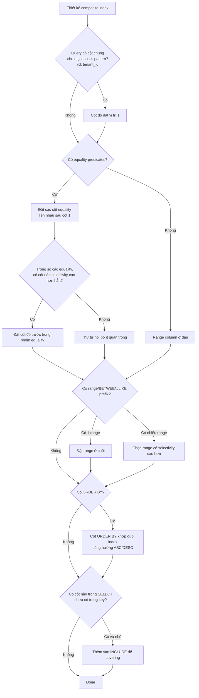

## Mục lục

- [Bối cảnh: Câu chuyện 8 giây trên bảng 50 triệu rows](#1-bối-cảnh-câu-chuyện-8-giây-trên-bảng-50-triệu-rows)
- [Composite Index là gì — Từ tuple sort order tới B-Tree](#2-composite-index-là-gì--từ-tuple-sort-order-tới-b-tree)
- [Leftmost Prefix Rule — Cốt lõi của composite index](#3-leftmost-prefix-rule--cốt-lõi-của-composite-index)
- [Access Predicate vs Filter Predicate trên composite index](#4-access-predicate-vs-filter-predicate-trên-composite-index)
- [Range column = "dấu chấm hết" cho các cột phía sau](#5-range-column--dấu-chấm-hết-cho-các-cột-phía-sau)
- [Catalog query patterns — Index dùng tới đâu?](#6-catalog-query-patterns--index-dùng-tới-đâu)
- [5 nguyên tắc thiết kế thứ tự cột](#7-5-nguyên-tắc-thiết-kế-thứ-tự-cột)
- [Index Skip Scan — Khi DB cứu được leftmost violation](#8-index-skip-scan--khi-db-cứu-được-leftmost-violation)
- [EXPLAIN — Đọc key_len, Index Cond, Predicates](#9-explain--đọc-key_len-index-cond-predicates)
- [ORDER BY + Composite Index — Sort cũng follow leftmost](#10-order-by--composite-index--sort-cũng-follow-leftmost)
- [Covering Index & INCLUDE Columns](#11-covering-index--include-columns)
- [Index Merge — Khi nào DB ghép nhiều single-column index?](#12-index-merge--khi-nào-db-ghép-nhiều-single-column-index)
- [So sánh giữa Postgres / MySQL / Oracle / SQL Server](#13-so-sánh-giữa-postgres--mysql--oracle--sql-server)
- [Real-world scenarios — E-commerce, SaaS multi-tenant, Logs, Pagination](#14-real-world-scenarios--e-commerce-saas-multi-tenant-logs-pagination)
- [Anti-patterns cần tránh](#15-anti-patterns-cần-tránh)
- [Monitoring & Maintenance](#16-monitoring--maintenance)
- [Migration playbook — Từ index tệ sang composite tối ưu](#17-migration-playbook--từ-index-tệ-sang-composite-tối-ưu)
- [Tóm tắt — Cheat sheet & 3 nguyên tắc](#18-tóm-tắt--cheat-sheet--3-nguyên-tắc)

---

## 1. Bối cảnh: Câu chuyện 8 giây trên bảng 50 triệu rows

Bạn đang vận hành một e-commerce. Bảng `orders` có **50 triệu bản ghi**:

```sql
CREATE TABLE orders (
    id           BIGSERIAL PRIMARY KEY,
    customer_id  BIGINT NOT NULL,
    status       TEXT NOT NULL,           -- 'pending' | 'paid' | 'shipped' | 'delivered' | 'cancelled'
    created_at   TIMESTAMPTZ NOT NULL,
    total        NUMERIC(10, 2),
    payload      JSONB
);
-- 50,000,000 rows
-- ~120,000 khách hàng active
-- status phân bố: paid 60%, delivered 30%, pending 5%, shipped 4%, cancelled 1%
```

Trang "Đơn hàng của tôi" gọi câu query này **mỗi giây hàng nghìn lần**:

```sql
SELECT id, status, created_at, total
FROM   orders
WHERE  customer_id = 90341
  AND  status      = 'pending'
  AND  created_at >= '2025-01-01'
ORDER BY created_at DESC
LIMIT  50;
```

Bạn nhìn vào schema, thấy đã có index, **ngạc nhiên** sao mà chậm:

```sql
CREATE INDEX idx_orders_v1 ON orders (status, created_at, customer_id);
```

`EXPLAIN ANALYZE`:

```text
                                  QUERY PLAN
─────────────────────────────────────────────────────────────────────────────
 Limit  (cost=124851.00..124851.13 rows=50 width=44)
        (actual time=8123.451..8123.470 rows=12 loops=1)
   ->  Sort  (actual time=8123.449..8123.464 rows=12 loops=1)
         Sort Key: created_at DESC
         Sort Method: top-N heapsort  Memory: 27kB
         ->  Bitmap Heap Scan on orders
                 (actual time=312.094..8120.518 rows=12 loops=1)
               Recheck Cond: ((status = 'pending')
                              AND (created_at >= '2025-01-01'))
               Filter: (customer_id = 90341)
               Rows Removed by Filter: 2499988
               Heap Blocks: exact=187432
               ->  Bitmap Index Scan on idx_orders_v1
                       (actual time=298.811..298.811 rows=2500000 loops=1)
                     Index Cond: ((status = 'pending')
                                  AND (created_at >= '2025-01-01'))
 Planning Time: 0.241 ms
 Execution Time: 8123.612 ms
```

Đọc kỹ: **`Rows Removed by Filter: 2,499,988`**. Database **quét 2.5 triệu rows** từ index, sau đó vứt đi 99.9995% chỉ để giữ lại 12 dòng đúng `customer_id`. Index *được dùng*, nhưng nó **chỉ giúp lọc 2 trong 3 điều kiện**.

Bạn đổi thứ tự cột:

```sql
DROP INDEX idx_orders_v1;
CREATE INDEX idx_orders_v2 ON orders (customer_id, status, created_at DESC);
```

Chạy lại:

```text
 Limit  (actual time=0.087..0.142 rows=12 loops=1)
   ->  Index Scan using idx_orders_v2 on orders
           (actual time=0.085..0.137 rows=12 loops=1)
         Index Cond: ((customer_id = 90341)
                       AND (status = 'pending')
                       AND (created_at >= '2025-01-01'))
 Planning Time: 0.198 ms
 Execution Time: 0.198 ms
```

**Từ 8.1 giây xuống 0.2 ms** — nhanh hơn ~**40,000 lần**. Cùng dữ liệu. Cùng query. **Chỉ đổi thứ tự cột** trong index.

> [!IMPORTANT]
> Composite index **không phải** là "thêm cột vào index sao cũng được". Thứ tự cột quyết định **B-Tree nhảy được tới đâu** và **dừng ở đâu** — một cú nhảy sai thứ tự có thể biến O(log n) thành O(n).

Trong doc này, ta sẽ mổ xẻ từng lớp:

1. Cách database lưu **tuple (a, b, c)** trên B-Tree và sort theo thứ tự lexicographic.
2. **Leftmost Prefix Rule** — vì sao phải truy cập từ trái sang phải, không có ngoại lệ tự nhiên.
3. Cơ chế **range column** làm "đóng băng" tất cả các cột phía sau, chuyển chúng thành filter.
4. **5 nguyên tắc** thiết kế thứ tự cột — equality trước, range sau, selectivity, ORDER BY.
5. **Skip Scan** — khi DB tự cứu được leftmost violation, và khi nào không.
6. Cách đọc **EXPLAIN** để biết chính xác cột nào của index thực sự được dùng.

Mục tiêu: sau khi đọc xong, bạn nhìn vào một câu `WHERE` là **đoán ngay** được phải tạo index theo thứ tự nào, và đọc EXPLAIN là biết index có "dùng đủ" hay chỉ "dùng nửa vời".

---

## 2. Composite Index là gì — Từ tuple sort order tới B-Tree

### 2.1. Một index, nhiều cột — sort như thế nào?

Composite index (còn gọi là **concatenated index**, **multi-column index**, **multipart key**) sắp xếp dữ liệu theo **tuple** — một bộ giá trị nhiều cột — bằng **lexicographic order** (so từ trái qua phải, gặp khác biệt đầu tiên thì dừng).

```sql
CREATE INDEX idx_orders ON orders (customer_id, status, created_at);
```

Cùng nguyên tắc xếp như từ điển. Khi so 2 entry:

```
(10, 'paid',    '2024-01-01')   vs   (10, 'paid',    '2024-01-02')
   ↑                                    ↑
   bằng → so tiếp                       bằng → so tiếp

(10, 'paid', X)   vs   (10, 'paid', Y)   → so X vs Y
```

Khi cột đầu khác nhau, **không quan tâm cột sau là gì**:

```
(10, 'shipped', '2024-12-31')   <   (11, 'paid',    '2020-01-01')
   ↑                                    ↑
   khác → quyết định luôn               (cột sau không cần xét)
```

### 2.2. Index trên đĩa — leaf node chứa gì?

Mỗi entry trên leaf node của B-Tree là một **key tuple** + một **pointer** trỏ về row trong table (CTID trên Postgres, primary-key trong InnoDB):

```
┌──────────────────────────────────────────────────────────────────────┐
│ Leaf page #4172 của idx_orders (customer_id, status, created_at)   │
├──────────────────────────────────────────────────────────────────────┤
│  (90340, 'paid',     '2024-12-29 10:01:55+07')  →  ctid (1234, 7)    │
│  (90340, 'paid',     '2024-12-30 14:22:08+07')  →  ctid (1234, 8)    │
│  (90340, 'shipped',  '2024-12-25 09:15:33+07')  →  ctid (1198, 3)    │
│  (90341, 'cancelled','2024-11-12 12:01:09+07')  →  ctid (8771, 9)    │
│  (90341, 'paid',     '2025-01-04 16:33:21+07')  →  ctid (9911, 2)    │
│  (90341, 'paid',     '2025-01-15 08:14:55+07')  →  ctid (9911, 3)    │
│  (90341, 'pending',  '2025-01-03 11:01:48+07')  →  ctid (9911, 4)    │
│  (90341, 'pending',  '2025-01-21 17:50:02+07')  →  ctid (9911, 5)    │
│  (90342, 'delivered','2024-08-01 09:00:00+07')  →  ctid (7723, 1)    │
└──────────────────────────────────────────────────────────────────────┘
                              ↓ ↑
                  liên kết với leaf trước/sau (B+Tree)
```

Đọc dọc xuống ta thấy:

1. Trước hết sort theo `customer_id` (90340 → 90341 → 90342).
2. Trong cùng một `customer_id`, sort theo `status` ('cancelled' → 'paid' → 'pending' → 'shipped').
3. Trong cùng `(customer_id, status)`, sort theo `created_at`.

> [!NOTE]
> Hai cột không hề "song song". Cột thứ 2 chỉ sort **bên trong** mỗi giá trị của cột 1. Cột thứ 3 chỉ sort **bên trong** mỗi cặp (cột 1, cột 2). Đây là chìa khóa để hiểu vì sao thứ tự cột không thể hoán đổi.

### 2.3. Storage internals — vì sao tuple không phải N B-Tree riêng

Một hiểu lầm phổ biến: "Composite index (a, b, c) = ba index (a), (b), (c) gộp lại". **Sai hoàn toàn.**

```
Index (a, b, c)            ≠     Index (a), Index (b), Index (c)

→ 1 B-Tree, key = a||b||c        → 3 B-Tree riêng biệt
→ Sort theo tuple                → Mỗi index sort theo cột của mình
→ Tiết kiệm storage              → Tốn 3x storage
→ Leftmost prefix rule           → Mỗi index dùng độc lập
```

Key trên leaf không phải 3 ô tách rời, mà là **1 chuỗi byte concat lại** (có terminator để phân tách):

```
Encoded key của (90341, 'paid', '2025-01-15')

  ┌────────────────────┬──────────────┬──────────────────────────┐
  │ 0x00 00 01 60 95   │ 'paid' 0x00  │ 0x00 02 8D F0 E2 B4 ...  │
  │ (bigint big-endian)│ (text + NULL)│ (timestamp 8 bytes)      │
  └────────────────────┴──────────────┴──────────────────────────┘
                      ↓
              Tất cả ghép thành 1 key byte string
              So sánh bằng memcmp() trên toàn chuỗi
```

Vì so sánh là **memcmp tuyến tính**, byte đầu tiên khác biệt **quyết định kết quả**. Đây là lý do thứ tự cột tương đương thứ tự byte — không tự nhiên đổi được.

### 2.4. Page layout — fanout giảm theo composite

Mỗi page B-Tree 8KB (Postgres) hoặc 16KB (InnoDB). Số entry chứa trong 1 page = fanout. Composite index có key **dài hơn** → fanout **thấp hơn** → cây **cao hơn**:

| Index | Key size (avg) | Fanout/page (8KB) | Cây cho 50M rows |
|-------|----------------|--------------------|------------------|
| `(customer_id)` | 8 bytes + 6 overhead | ~580 | 3 levels |
| `(customer_id, status)` | 8 + 8 + 12 overhead | ~290 | 4 levels |
| `(customer_id, status, created_at)` | 8 + 8 + 8 + 18 overhead | ~190 | 4 levels |
| `(customer_id, status, created_at, total, payload_id)` | ~80 bytes | ~85 | 5 levels |

> [!TIP]
> **Đừng nhồi nhét** quá nhiều cột vào index. Mỗi cột thêm vào làm fanout giảm, cây cao hơn → mỗi lookup tốn thêm 1 random I/O. Cột thứ 4-5 trở đi gần như chỉ "đi nhờ" — không tăng selectivity bao nhiêu mà inflate size đáng kể.

---

## 3. Leftmost Prefix Rule — Cốt lõi của composite index

### 3.1. Phát biểu chính thức

> [!IMPORTANT]
> **Leftmost Prefix Rule (LPR):**
> Cho index `(c₁, c₂, c₃, …, cₙ)`. Index **chỉ dùng được để truy cập** nếu query có điều kiện equality trên một **prefix liên tiếp tính từ trái**: `c₁`, hoặc `(c₁, c₂)`, hoặc `(c₁, c₂, c₃)`, …
>
> Bỏ qua bất kỳ cột nào ở giữa → phần index sau "gap" trở thành **filter predicate**, không phải access predicate.

Tương đương: index `(a, b, c)` cho phép seek bằng:

```
✅  (a)
✅  (a, b)
✅  (a, b, c)

⚠️  (a, c)        ← chỉ seek bằng a, lọc c sau (b là gap)
❌  (b)
❌  (b, c)
❌  (c)
```

### 3.2. Phép ẩn dụ — Danh bạ điện thoại

Hình dung danh bạ in giấy, sort theo (Họ, Tên, Thành phố):

```
Aaron Bachelor   — Boston
Aaron Bachelor   — Chicago
Aaron Carlton    — Austin
Aaron Carlton    — Boston
Abraham Adams    — Austin
Abraham Adams    — Boston
Abraham Bell     — Chicago
...
Zachary Young    — Atlanta
```

Tìm:

- **Họ = Adams** → mở quyển ở chữ "A", scan tới "Adams" ✅
- **Họ = Adams, Tên = Abraham** → scan "Adams" → trong khối Adams scan "Abraham" ✅
- **Họ = Adams, Tên = Abraham, Thành phố = Boston** → toàn bộ điều kiện ✅
- **Tên = Abraham** → ❌ phải lật từ đầu đến cuối, vì các "Abraham" rải đều khắp danh bạ (Abraham Adams, Abraham Bell, Abraham Carter, ...)
- **Thành phố = Boston** → ❌ tệ hơn nữa, các "Boston" rải khắp mọi họ và tên

Composite B-Tree hành xử **chính xác** như cuốn danh bạ này.

### 3.3. Vì sao gap khiến index thành filter

Index `(a, b, c)`. Query: `WHERE a = 10 AND c = 'X'`. Bỏ qua `b`.

```diagram
╭───────────────────────────────────────────────────────────────╮
│ B-Tree đi tới khối a = 10:                                    │
│                                                               │
│  (10, 'apple',   'X')   ✓                                     │
│  (10, 'apple',   'Y')                                         │
│  (10, 'apple',   'Z')                                         │
│  (10, 'banana',  'X')   ✓                                     │
│  (10, 'banana',  'Y')                                         │
│  (10, 'cherry',  'A')                                         │
│  (10, 'cherry',  'X')   ✓                                     │
│  (10, 'durian',  'X')   ✓                                     │
│  ...                                                          │
│  (10, 'zebra',   'X')   ✓                                     │
│                                                               │
│ → DB phải quét TOÀN BỘ khối a = 10                            │
│   vì c='X' rải đều giữa các giá trị b khác nhau.              │
│                                                               │
│ Index dùng được cho a (access).                               │
│ c trở thành filter (kiểm tra sau khi đọc).                    │
╰───────────────────────────────────────────────────────────────╯
```

EXPLAIN tương ứng (Postgres):

```text
Index Scan using idx_abc on tbl
   Index Cond: (a = 10)            ← Access (start/stop range)
   Filter:     (c = 'X'::text)     ← Filter sau khi đã quét
```

Cột `b` là "gap" → mọi cột sau gap bị **demote** thành filter.

> [!TIP]
> Bộ luật vàng: **cứ có gap, index degrade thành single-column index**. Nếu thực sự cần dùng `c` để seek, hãy thêm điều kiện cho `b` (kể cả `b IS NOT NULL`) — đôi khi đủ để Postgres quay sang index khác chứ không skip.

### 3.4. Nhưng còn thứ tự WHERE — có quan trọng không?

**Không.** Optimizer reorder predicate tự do. Hai câu này hoàn toàn tương đương về plan:

```sql
WHERE customer_id = 90341 AND status = 'pending'    -- ✅ dùng index (cust, status)
WHERE status = 'pending' AND customer_id = 90341    -- ✅ dùng index (cust, status)
```

Cái quan trọng là **cột nào có mặt** trong WHERE, không phải thứ tự bạn viết. Optimizer luôn cố ghép predicate vào prefix của index.

---

## 4. Access Predicate vs Filter Predicate trên composite index

Quay lại 2 khái niệm đã gặp ở doc LIKE (xem [LIKE Deep Dive §5](./like-query-deep-dive#5-access-predicate-vs-filter-predicate--mổ-xẻ-với-explain)), giờ áp dụng cho composite index. Mỗi cột trong index, đối với một câu query cụ thể, sẽ rơi vào **đúng một** trong 3 trạng thái:

| Trạng thái | Tác dụng | Cách trông trên EXPLAIN |
|------------|----------|-------------------------|
| **Access (Seek)** | Tham gia tính `start_key` / `end_key` → quyết định **bao nhiêu rows** được đọc từ index | `Index Cond` (Postgres), `key`+`key_len` cao (MySQL), `access(...)` (Oracle) |
| **Filter** | Chỉ check sau khi đã đọc xong entry → **không** thu hẹp scan | `Filter` (Postgres), `Extra: Using where` (MySQL), `filter(...)` (Oracle) |
| **Skip / không dùng** | Không tham gia gì cả | Vắng mặt khỏi cả Index Cond lẫn Filter (thực ra rất hiếm — thường rơi sang Filter) |

### 4.1. Quy tắc phân loại trên composite

Cho index `(c₁, c₂, c₃, c₄)`, mỗi cột được đánh giá **từ trái sang phải**:

```
Cột c_i  →  Access nếu:
              • c_i có equality predicate (=, IN với 1 giá trị, IS NULL có optimization)
              • TẤT CẢ c_1 ... c_{i-1} đều là Access cùng dạng
              
            →  Access RANGE (cuối chuỗi) nếu:
              • c_i có range predicate (>, <, BETWEEN, IS NOT NULL, LIKE 'prefix%')
              • TẤT CẢ c_1 ... c_{i-1} đều là Access equality
              
            →  Filter nếu:
              • Có predicate nhưng không thỏa điều kiện Access
              • (Tức là bị "đẩy lùi" về sau một range column hoặc một gap)
            
            →  Không liên quan nếu không xuất hiện trong WHERE
```

### 4.2. Bảng phân loại — ví dụ với index `(cust, status, created_at, total)`

| # | WHERE | cust | status | created_at | total | Ghi chú |
|---|-------|------|--------|------------|-------|---------|
| 1 | `cust=10` | **A** | – | – | – | Access 1 cột |
| 2 | `cust=10 AND status='paid'` | **A** | **A** | – | – | Prefix 2 cột |
| 3 | `cust=10 AND status='paid' AND created_at>X` | **A** | **A** | **A-R** | – | Prefix 3, cuối là range |
| 4 | `cust=10 AND status='paid' AND created_at>X AND total<Y` | **A** | **A** | **A-R** | **F** | `total` đứng sau range → filter |
| 5 | `cust=10 AND created_at>X` | **A** | – | **F** | – | Bỏ qua `status` → gap → `created_at` thành filter |
| 6 | `cust=10 AND total<Y` | **A** | – | – | **F** | 2 gap → `total` filter |
| 7 | `status='paid'` | – | – | – | – | Không có cột đầu → **không dùng index** |
| 8 | `status='paid' AND created_at>X` | – | – | – | – | Không có cust → **Seq Scan** (trừ khi skip scan) |
| 9 | `cust IN (10,20,30)` | **A** | – | – | – | IN với danh sách ngắn = Access |
| 10 | `cust IN (10,20) AND status='paid'` | **A** | **A** | – | – | Vẫn được — DB lặp seek cho từng cust |
| 11 | `cust>=10 AND cust<=20 AND status='paid'` | **A-R** | **F** | – | – | Range trên cust đầu tiên → `status` thành filter |

> [!IMPORTANT]
> Dòng **#11** là cú twist nhiều người không nhận ra — **range trên cột đầu chặn đứng các cột phía sau dùng cho access**. Sẽ phân tích kỹ ở mục 5.

### 4.3. Đếm thực tế — chênh lệch giữa Access và Filter

Bảng 50M rows. Index `(customer_id, status, created_at)`. 

```sql
-- Phân bố dữ liệu:
-- Mỗi customer có ~400 orders trung bình
-- status='pending' chiếm 5% → ~20 pending orders / customer
-- created_at >= '2025-01-01' chiếm 20% gần đây → ~4 rows / customer
```

Đo từng câu (Postgres 16, NVMe, warm cache):

| Query | Access columns | Rows scan trên index | Rows trả | Thời gian |
|-------|----------------|----------------------|----------|-----------|
| `cust=X` | cust | ~400 | 400 | **0.3 ms** |
| `cust=X AND status='p'` | cust + status | ~20 | 20 | **0.1 ms** |
| `cust=X AND status='p' AND created_at>'2025-01-01'` | cust + status + created_at | ~4 | 4 | **0.08 ms** |
| `cust=X AND created_at>'2025-01-01'` | cust (status là gap) | ~400 (filter created_at sau) | ~80 | **0.4 ms** |
| `status='p'` | (không có cust) | 50M (Seq Scan) | 2.5M | **5,800 ms** |
| `created_at>'2025-01-01'` | (không có cust) | 50M (Seq Scan) | 10M | **6,200 ms** |

Cùng một index, cùng một bảng. Sự khác biệt nằm ở **bạn có cho optimizer điểm bắt đầu hay không**.

---

## 5. Range column = "dấu chấm hết" cho các cột phía sau

### 5.1. Hiện tượng

Đây là một trong những quy tắc dễ bị bỏ sót nhất khi thiết kế composite index:

> [!IMPORTANT]
> **Range Stop Rule — với một B-Tree scan thông thường:**
> Các equality liên tiếp ở đầu index và range đầu tiên quyết định **khoảng leaf entries phải quét**. Predicate trên cột đứng sau range thường không thể làm khoảng đó ngắn hơn; nó chỉ loại entry trong lúc quét hoặc sau khi đọc row.

Nói chính xác hơn: cột phía sau range không tạo thêm được một cặp `start_key` / `end_key` liên tục cho lần scan đó. Một số engine vẫn kiểm tra predicate ấy ngay trong index, dùng Index Condition Pushdown, hoặc thực hiện nhiều sub-scan bằng skip scan. Những tối ưu này có thể giảm heap/table fetch, thậm chí bỏ qua một số đoạn index, nhưng không làm mất đi nguyên tắc thiết kế nền tảng: **equality trước, range sau**.

### 5.2. Vì sao? Hình ảnh sort trên đĩa

Index `(a, b, c)`. Hãy nhìn vào leaf khi `a = 10`:

```
(10, 1, 'X')
(10, 1, 'Y')
(10, 1, 'Z')
(10, 2, 'A')
(10, 2, 'X')
(10, 3, 'B')
(10, 3, 'X')
(10, 4, 'A')
(10, 4, 'X')
(10, 5, 'X')
```

Query: `WHERE a = 10 AND b >= 2 AND c = 'X'`.

DB nhảy tới `(10, 2, ...)` rồi quét **xuôi qua hết khối** `a=10`. Trong dãy ấy, các giá trị `c='X'` **rải rác** giữa các giá trị `b` — `(10,2,'X'), (10,3,'X'), (10,4,'X'), (10,5,'X')` — không có cách nào nhảy thẳng tới chỉ "các X".

Nói cách khác: trong **một khoảng range của `b`**, dữ liệu **không** sort theo `c` toàn cục, mà sort theo `(b, c)` cục bộ. Vì thế:

```diagram
╭───────────────────────────────────────────────────────────────╮
│ a = 10 AND b BETWEEN 2 AND 4 AND c = 'X'                      │
│                                                               │
│  Access range:  (10, 2)  →  (10, 5)   ← chỉ dùng a và b       │
│  Filter:        c = 'X'                                       │
│                                                               │
│  Rows quét trên index: 7  (tất cả rows trong khoảng b ∈ [2,4])│
│  Rows match:           3                                      │
╰───────────────────────────────────────────────────────────────╯
```

### 5.3. Ví dụ thực tế — `(country, signup_date, status)`

```sql
CREATE INDEX idx_users ON users (country, signup_date, status);
-- Bảng 80M users
-- country: 200 distinct, không skew quá nặng
-- signup_date: 5 năm dữ liệu
-- status: 4 giá trị (active/inactive/banned/deleted)
```

So 2 query:

**Query A — equality trên cả 3 cột:**

```sql
WHERE country = 'VN' AND signup_date = '2024-12-01' AND status = 'active';
```

```text
Index Scan using idx_users
   Index Cond: ((country = 'VN'::text)
                 AND (signup_date = '2024-12-01'::date)
                 AND (status = 'active'::text))
   rows: 12   time: 0.04 ms
```

3 cột đều là access. Đẹp.

**Query B — range giữa 3 cột:**

```sql
WHERE country = 'VN'
  AND signup_date BETWEEN '2024-01-01' AND '2024-12-31'
  AND status = 'active';
```

```text
Index Scan using idx_users
   Index Cond: ((country = 'VN'::text)
                 AND (signup_date >= '2024-01-01'::date)
                 AND (signup_date <= '2024-12-31'::date))
   Filter:     (status = 'active'::text)
   Rows Removed by Filter: 178,914
   rows: 432,098   time: 412 ms
```

`status` rớt xuống Filter. DB quét **600K rows** (toàn bộ user VN signup 2024) để giữ lại 432K — phải đụng heap để check `status`.

**Cách fix nếu `status` selectivity cao hơn `signup_date`:** đặt `status` trước range column.

```sql
CREATE INDEX idx_users_fixed
  ON users (country, status, signup_date);
```

```text
Index Scan using idx_users_fixed
   Index Cond: ((country = 'VN'::text)
                 AND (status = 'active'::text)
                 AND (signup_date >= '2024-01-01'::date)
                 AND (signup_date <= '2024-12-31'::date))
   rows: 432,098   time: 38 ms
```

**412ms → 38ms.** Cả 3 cột giờ đều là access.

### 5.4. Quy tắc luôn-luôn-đúng

Cụm “luôn-luôn-đúng” ở đây nên hiểu là **điểm xuất phát an toàn khi thiết kế B-Tree**, không phải lời khẳng định rằng mọi optimizer và mọi execution plan đều hành xử giống hệt nhau.

> [!TIP]
> Với query có dạng `equality + range`, hãy bắt đầu bằng công thức:
>
> ```text
> [các cột equality liên tiếp] → [range quan trọng nhất] → [cột phụ]
> ```
>
> - Nhóm equality khóa B-Tree vào đúng một nhánh hẹp.
> - Range đầu tiên xác định đoạn leaf entries phải đi qua.
> - Cột phía sau range không làm một đoạn scan thông thường ngắn hơn. Nó vẫn có thể hữu ích để lọc ngay trong index, phục vụ thứ tự đọc, hoặc làm covering index.

#### 5.4.1. “Range chặn cột sau” thực sự nghĩa là gì?

Giả sử có index:

```sql
CREATE INDEX ix_orders
ON orders (customer_id, status, created_at, total);
```

Và query:

```sql
SELECT id, created_at, total
FROM orders
WHERE customer_id = 90341
  AND status = 'paid'
  AND created_at >= TIMESTAMPTZ '2026-01-01'
  AND total >= 10000000;
```

B-Tree có thể tạo biên scan gần giống như sau:

```text
start_key = (90341, 'paid', '2026-01-01', -∞)
stop_key  = (90341, 'paid', +∞,           +∞)
```

`customer_id` và `status` là equality, nên chúng khóa hai chiều đầu tiên của key. `created_at` là range đầu tiên, nên nó xác định điểm bắt đầu của đoạn scan.

`total >= 10000000` không thể biến thành một biên liên tục khác. Lý do là `total` chỉ được sắp xếp **bên trong từng giá trị `created_at`**:

```text
(90341, paid, 2026-01-01 08:00,    500000)
(90341, paid, 2026-01-01 08:00,  12000000)  ✓
(90341, paid, 2026-01-01 09:00,    300000)
(90341, paid, 2026-01-01 09:00,  15000000)  ✓
(90341, paid, 2026-01-02 10:00,    200000)
(90341, paid, 2026-01-02 10:00,  11000000)  ✓
```

Các row thỏa `total` tạo thành nhiều “lỗ” rời rạc trong khoảng `created_at`, chứ không tạo thành một đoạn liền nhau. Vì vậy, với một range scan thông thường, DB vẫn phải đi qua các entry có `total` thấp để tìm entry tiếp theo có `total` cao.

> [!IMPORTANT]
> “Không giúp thu hẹp scan range” **không đồng nghĩa** với “hoàn toàn vô dụng”. Nếu `total` có trong index, engine có thể kiểm tra nó trước khi fetch row từ table. PostgreSQL có thể kiểm tra constraint ở tầng index; MySQL có Index Condition Pushdown. Ta tiết kiệm được table/heap I/O, nhưng vẫn có thể phải đọc cùng số leaf entries trong khoảng `created_at`.

#### 5.4.2. Nếu có hai range, chọn cột nào trước?

Xét query:

```sql
WHERE tenant_id = 42
  AND status = 'paid'
  AND created_at >= :seven_days_ago
  AND total >= 10000000
```

Hai index ứng viên:

```sql
-- created_at là range quyết định đoạn scan
CREATE INDEX ix_by_time
ON orders (tenant_id, status, created_at, total);

-- total là range quyết định đoạn scan
CREATE INDEX ix_by_total
ON orders (tenant_id, status, total, created_at);
```

Đừng so selectivity trên toàn bảng. Hãy so **selectivity có điều kiện sau nhóm equality**. Giả sử riêng trong `(tenant_id = 42, status = 'paid')` có 1.000.000 rows:

| Predicate range | Rows còn lại | Tỷ lệ phải quét |
|---|---:|---:|
| `created_at >= :seven_days_ago` | 10.000 | 1% |
| `total >= 10000000` | 100.000 | 10% |

Trong trường hợp này:

```text
ix_by_time  ≈ quét 10.000 index entries  → lọc total
ix_by_total ≈ quét 100.000 index entries → lọc created_at
```

`ix_by_time` thường tốt hơn vì range đầu tiên để lại ít entry hơn. Nếu phân bố dữ liệu đảo ngược, `ix_by_total` có thể thắng.

> [!NOTE]
> Selectivity phải lấy từ dữ liệu thật và trong đúng scope equality. Ví dụ, đơn giá trị cao có thể rất hiếm trên toàn hệ thống nhưng lại phổ biến với một tenant bán hàng xa xỉ. Correlation giữa `created_at` và `total` cũng khiến phép nhân tỷ lệ đơn giản bị sai.

#### 5.4.3. Equality trả nhiều rows hơn range thì có nên đảo range lên trước?

**Thông thường là không.** Đây là điểm rất dễ nhầm.

Giả sử bảng có 100 triệu orders:

```text
status = 'paid'                 → 60.000.000 rows (60%)
created_at trong 1 giờ gần nhất →    100.000 rows (0,1%)
Cả hai điều kiện                →     60.000 rows
```

Thoạt nhìn, `created_at` chọn lọc hơn rất nhiều nên có vẻ nên đặt nó trước. Nhưng hãy so hai index cho query luôn có cả hai điều kiện:

```sql
WHERE status = 'paid'
  AND created_at >= :one_hour_ago
```

**Index `(status, created_at)`:**

```text
start_key = ('paid', :one_hour_ago)
stop_key  = ('paid', +∞)

Số entry phải quét ≈ 60.000
```

DB **không quét 60 triệu rows `paid` rồi mới lọc ngày**. Vì `status` đã được khóa bằng equality, `created_at` vẫn được sắp xếp bên trong đúng nhóm `paid`. DB có thể nhảy thẳng tới `('paid', :one_hour_ago)`.

**Index `(created_at, status)`:**

```text
start_key = (:one_hour_ago, -∞)
stop_key  = (+∞,           +∞)

Số entry phải quét ≈ 100.000
Sau đó mới giữ lại khoảng 60.000 rows có status = 'paid'
```

Với một B-Tree range scan thông thường, có thể hình dung:

```text
scan(equality, range) ≈ số rows thỏa equality ∩ range
scan(range, equality) ≈ số rows thỏa range
```

Mà về mặt tập hợp:

```text
|equality ∩ range| ≤ |range|
```

Vì vậy, nếu query **luôn có cả equality và range**, đặt equality trước thường quét ít hơn hoặc bằng đặt range trước — kể cả khi equality đứng một mình trả về rất nhiều rows.

> [!IMPORTANT]
> “Equality trước” không có nghĩa là optimizer chỉ dùng equality. Nó dùng equality để chọn đúng nhóm, rồi dùng range để tìm start/stop point **bên trong nhóm đó**. Đây chính là lợi thế mà index `(equality, range)` mang lại.

Chỉ cân nhắc đặt range trước khi có một mục tiêu khác quan trọng hơn:

- Query thường chạy **không có equality predicate**, nên cần prefix bắt đầu bằng range.
- `ORDER BY` và `LIMIT` khớp với range column, cho phép đọc đúng thứ tự và dừng rất sớm.
- Bạn đang tối ưu một access pattern khác quan trọng hơn, hoặc sẽ tạo hai index riêng cho hai nhóm query.
- Kết quả `EXPLAIN ANALYZE` trên dữ liệu thật chứng minh plan range-first rẻ hơn do đặc điểm riêng của engine hoặc workload.

Nói ngắn gọn: **đừng đảo range lên trước chỉ vì range đứng một mình trả ít rows hơn equality**. Hãy so số entry của giao hai điều kiện và kiểm tra plan thực tế.

#### 5.4.4. Quy trình chọn thứ tự cột

Với mỗi query quan trọng, đi theo năm bước:

1. **Liệt kê equality predicate**: `=`, `IS NULL`, và đôi khi `IN` danh sách ngắn mà optimizer triển khai thành nhiều equality seek.
2. **Đặt equality thành một prefix liên tiếp**: không để gap trước range cần tối ưu.
3. **Ước lượng từng range ứng viên** sau khi đã cố định nhóm equality. Ưu tiên range khiến số index entries phải quét ít nhất.
4. **Xét `ORDER BY ... LIMIT`**. Một index quét nhiều hơn theo ước lượng lọc vẫn có thể thắng nếu đọc đúng thứ tự và dừng sau vài chục rows, thay vì đọc hết rồi sort.
5. **Xác nhận bằng `EXPLAIN (ANALYZE, BUFFERS)`** hoặc công cụ tương đương. So rows scanned, rows removed, buffer reads và thời gian; đừng chỉ nhìn tên index được chọn.

Ví dụ, nếu query đổi thành:

```sql
WHERE tenant_id = 42
  AND status = 'paid'
  AND created_at >= :seven_days_ago
  AND total >= 10000000
ORDER BY total DESC
LIMIT 20;
```

Index đặt `total` trước `created_at` có thể đáng cân nhắc. Nó cho phép đọc các đơn giá trị cao trước và dừng sớm sau 20 rows. Đây là lý do `ORDER BY ... LIMIT` phải được đánh giá cùng access pattern, không thể chỉ so selectivity từng predicate.

#### 5.4.5. Ba ngoại lệ dễ làm hiểu sai quy tắc

1. **`IN` không phải lúc nào cũng là một range liên tục.** Với danh sách ngắn, optimizer có thể thực hiện nhiều equality seek. Với danh sách rất dài, nó có thể đổi sang bitmap scan hoặc table scan.
2. **Predicate sau range có thể xuất hiện trong `Index Cond`.** Điều đó cho biết engine kiểm tra predicate ở tầng index; chưa chắc predicate ấy đã thu hẹp biên scan ban đầu. Hãy nhìn thêm số rows/index entries và buffers.
3. **Skip scan có thể tạo nhiều sub-seek.** PostgreSQL 18+, Oracle và một số trường hợp trên MySQL có thể dùng cột sau gap/range để tái định vị nhiều lần. Đây là tối ưu của optimizer, không phải lý do để chủ động thiết kế index sai thứ tự.

> [!WARNING]
> Không áp dụng máy móc câu “cột selectivity cao nhất luôn đứng đầu”. Thứ tự ưu tiên thực tế là: **access pattern chung → equality prefix → range phù hợp → `ORDER BY/LIMIT` → covering**. Giữa các equality luôn xuất hiện cùng nhau, thứ tự còn phụ thuộc khả năng tái sử dụng prefix cho các query khác; selectivity không phải tiêu chí duy nhất.

Tóm lại, phiên bản có thể hành động ngay của quy tắc là:

```text
Equality liên tiếp trước.
Range giúp giảm scan nhiều nhất đặt ngay sau.
Cột còn lại chỉ thêm khi có lợi ích đo được về filter-in-index,
ORDER BY, covering hoặc khả năng tái sử dụng cho query khác.
Sau cùng, dùng EXPLAIN ANALYZE để kiểm chứng.
```

---

## 6. Catalog query patterns — Index dùng tới đâu?

Index: `(a, b, c, d)` — 4 cột.

Bảng tham chiếu nhanh:

```
A   = Access (seek)
A-R = Access Range (cuối chuỗi access)
F   = Filter (lọc sau khi đọc)
–   = Không xuất hiện trong WHERE
✗   = Index không được dùng cho cột này (sau gap hoặc sau range)
```

### 6.1. Equality predicates

| WHERE | a | b | c | d | Status | Cột access |
|-------|---|---|---|---|--------|------------|
| `a=1` | A | – | – | – | ✅ Optimal | 1 |
| `a=1 AND b=2` | A | A | – | – | ✅ Optimal | 2 |
| `a=1 AND b=2 AND c=3` | A | A | A | – | ✅ Optimal | 3 |
| `a=1 AND b=2 AND c=3 AND d=4` | A | A | A | A | ✅ Optimal | 4 |
| `b=2` | – | ✗ | – | – | ❌ Seq Scan (or skip scan) | 0 |
| `c=3` | – | – | ✗ | – | ❌ Seq Scan | 0 |
| `b=2 AND c=3` | – | ✗ | ✗ | – | ❌ Seq Scan | 0 |
| `a=1 AND c=3` | A | – | F | – | ⚠️ Partial (chỉ access bằng `a`) | 1 |
| `a=1 AND d=4` | A | – | – | F | ⚠️ Partial | 1 |
| `a=1 AND b=2 AND d=4` | A | A | – | F | ⚠️ Gap ở `c` | 2 |

### 6.2. Range predicates

| WHERE | a | b | c | d | Cột access |
|-------|---|---|---|---|------------|
| `a>1` | A-R | – | – | – | 1 |
| `a>1 AND b=2` | A-R | F | – | – | 1 (b bị range chặn) |
| `a=1 AND b>2` | A | A-R | – | – | 2 |
| `a=1 AND b>2 AND c=3` | A | A-R | F | – | 2 |
| `a=1 AND b=2 AND c>3` | A | A | A-R | – | 3 |
| `a=1 AND b=2 AND c>3 AND d=4` | A | A | A-R | F | 3 |
| `a=1 AND b=2 AND c BETWEEN 3 AND 5 AND d=4` | A | A | A-R | F | 3 |
| `a BETWEEN 1 AND 9 AND b=2 AND c=3` | A-R | F | F | – | 1 |

### 6.3. IN, IS NULL, OR

| WHERE | Cột access | Ghi chú |
|-------|------------|---------|
| `a IN (1,2,3)` | a | DB lặp seek cho từng giá trị — vẫn nhanh nếu list ngắn |
| `a IN (1,...,1000)` | a (loose) | Quá nhiều giá trị → optimizer có thể chuyển Seq Scan |
| `a IS NULL` | a | NULL có entry riêng trong index (trừ Oracle B-Tree truyền thống) |
| `a IS NOT NULL` | a (range) | Range của toàn bộ giá trị non-null → ~Seq Scan |
| `a=1 OR a=2` | a | Optimizer rewrite thành IN |
| `a=1 OR b=2` | – | OR giữa các cột → 2 plan riêng hoặc Seq Scan |
| `a=1 AND (b=2 OR b=3)` | a, b | b vẫn được dùng — tương đương `b IN (2,3)` |

### 6.4. Function & Expression — phá luôn index

| WHERE | Index? |
|-------|--------|
| `LOWER(a) = 'x'` | ❌ — trừ khi có functional index `LOWER(a)` |
| `a + 0 = 1` | ❌ — bất kỳ phép tính nào trên cột |
| `a = '1'` (a là INT) | ⚠️ — implicit cast có thể kill index |
| `CAST(a AS TEXT) = '1'` | ❌ |
| `a IS DISTINCT FROM 1` | ⚠️ — phụ thuộc DB |
| `NOT (a = 1)` | ✅ (Postgres rewrite thành `a <> 1`, vẫn range scan) |

> [!CAUTION]
> Implicit cast là **âm thầm và chết người**. `WHERE bigint_col = '123'` đôi khi optimizer cast string → bigint (OK), đôi khi cast bigint → string (kill index). Luôn truyền **đúng kiểu** trong app code.

---

## 7. 5 nguyên tắc thiết kế thứ tự cột

### 7.1. Nguyên tắc 1 — **Equality trước, Range sau**

Đây là **nguyên tắc thiết kế quan trọng nhất**. Bắt nguồn trực tiếp từ Range Stop Rule (§5).

```sql
-- ❌ TỆ:
CREATE INDEX bad ON orders (created_at, customer_id, status);
-- → query "WHERE customer_id=X AND created_at>Y AND status='paid'"
--   chỉ dùng được created_at làm range, customer_id và status thành filter

-- ✅ TỐT:
CREATE INDEX good ON orders (customer_id, status, created_at);
-- → cả 3 đều access
```

### 7.2. Nguyên tắc 2 — **Cột nào xuất hiện trong MỌI query, đặt đầu**

Đặc biệt quan trọng với **multi-tenant SaaS**, nơi mọi query đều có `WHERE tenant_id = ?`:

```sql
-- SaaS pattern: tenant_id LUÔN có mặt
CREATE INDEX ix_invoices_1 ON invoices (tenant_id, status, due_date);
CREATE INDEX ix_invoices_2 ON invoices (tenant_id, customer_id, created_at);
CREATE INDEX ix_invoices_3 ON invoices (tenant_id, project_id, status);

-- tenant_id ở vị trí đầu mọi index → tự nhiên isolation theo tenant
-- và mọi query đều có thể dùng prefix của index
```

> [!TIP]
> Trong multi-tenant, đừng đắn đo: **`tenant_id` luôn là cột đầu tiên** của mọi composite index. Sự bất tiện vì tenant_id "trùng lặp khắp nơi" rẻ hơn nhiều so với việc phải nghĩ lại từng query.

### 7.3. Nguyên tắc 3 — **Selectivity cao đứng trước (giữa các cột equality)**

Selectivity = số lượng giá trị distinct / tổng số rows. Cao = filter mạnh.

```
customer_id  có ~100,000 giá trị → selectivity 0.000002 (cực cao)
status       có 5 giá trị        → selectivity 0.00000001 (thấp)
country      có 200 giá trị      → selectivity 0.000004 (trung)
```

Quy tắc: trong số các cột equality, **cột selectivity cao đứng trước** để cây hẹp lại nhanh:

```sql
-- ✅ TỐT:
CREATE INDEX ON orders (customer_id, status);   -- 100K → 5

-- ⚠️ ÍT TỐI ƯU:
CREATE INDEX ON orders (status, customer_id);   -- 5 → 100K
```

> [!WARNING]
> Nguyên tắc này **chỉ áp dụng khi cả 2 cột đều là equality**. Khi có range, Nguyên tắc 1 (Equality trước, Range sau) thắng. Selectivity là tiebreaker, không phải nguyên lý hàng đầu.

Có một **ngoại lệ tinh tế**: nếu cột selectivity thấp (như status) **luôn** có trong WHERE và cột selectivity cao (như customer_id) **chỉ thỉnh thoảng** xuất hiện, đặt cột phổ biến trước có lợi hơn về reuse:

```
Query A:  WHERE status='paid' AND customer_id=10      (hiếm)
Query B:  WHERE status='paid'                          (rất nhiều)

-- (status, customer_id) phục vụ được cả A và B
-- (customer_id, status) chỉ phục vụ A — Query B phải Seq Scan
```

### 7.4. Nguyên tắc 4 — **Cột trong ORDER BY đứng ở phần đuôi access**

Composite index sắp dữ liệu sẵn theo thứ tự, nên có thể tránh `Sort` step nếu thứ tự ORDER BY **khớp** với phần đuôi của index access.

```sql
-- Query
SELECT * FROM orders
WHERE customer_id = 10 AND status = 'paid'
ORDER BY created_at DESC
LIMIT 50;

-- ✅ Index khớp ORDER BY:
CREATE INDEX ix1 ON orders (customer_id, status, created_at DESC);
-- → Plan: Index Scan, không cần Sort, dừng sau 50 rows
```

Sẽ bàn kỹ ở §10.

### 7.5. Nguyên tắc 5 — **Cột cho covering đặt cuối, hoặc dùng INCLUDE**

Nếu chỉ cần một cột bổ sung để index-only scan (avoid heap fetch), đặt nó cuối hoặc dùng `INCLUDE`:

```sql
-- Cần SELECT id, status, created_at, total

-- Phương án 1: thêm vào key
CREATE INDEX ix1 ON orders (customer_id, status, created_at, total);

-- Phương án 2: INCLUDE (Postgres 11+, SQL Server lâu rồi)
CREATE INDEX ix2 ON orders (customer_id, status, created_at) INCLUDE (total);
```

Phương án 2 **tốt hơn** vì `total` không tham gia sort của B-Tree → fanout không giảm. Chi tiết ở §11.

### 7.6. Bảng tổng hợp các nguyên tắc

| # | Nguyên tắc | Khi áp dụng | Lý do |
|---|------------|-------------|-------|
| 1 | Equality trước, range sau | Luôn luôn | Range Stop Rule |
| 2 | Cột chung của mọi query đặt đầu | Multi-tenant, scoped query | Reuse index, leftmost prefix |
| 3 | Cột selectivity cao đứng trước | Khi tất cả equality | Cây hẹp lại nhanh |
| 4 | Cột ORDER BY ở đuôi access | Khi có sort + LIMIT | Tránh `Sort` step |
| 5 | Cột covering ở cuối hoặc INCLUDE | Khi cần index-only scan | Tiết kiệm I/O |

### 7.7. Decision tree



---

## 8. Index Skip Scan — Khi DB cứu được leftmost violation

### 8.1. Khái niệm

Bình thường, `WHERE b = X` trên index `(a, b)` → không dùng index. Nhưng nếu `a` có **rất ít** distinct values (vài chục), một số DB tự "lặp" qua từng giá trị `a` rồi sub-seek `b` — gọi là **Skip Scan**.

```diagram
╭───────────────────────────────────────────────────────────────╮
│ Index (a, b), a có 4 distinct values: 1, 2, 3, 4              │
│                                                               │
│ Query: WHERE b = 'X'                                          │
│                                                               │
│ Skip Scan logic:                                              │
│   1. Đọc distinct value đầu của a → 1                         │
│      Seek (a=1, b='X')                                        │
│      Nếu match, đọc và xuôi đến khi b ≠ 'X'                   │
│                                                               │
│   2. Tìm distinct value kế tiếp của a → 2                     │
│      Seek (a=2, b='X')                                        │
│      ...                                                      │
│                                                               │
│   3. Lặp tới 3, 4                                             │
│                                                               │
│   Tổng cộng: 4 sub-seek thay vì Seq Scan toàn bảng            │
╰───────────────────────────────────────────────────────────────╯
```

### 8.2. Hỗ trợ theo DB

| DB | Tên | Khi nào dùng | Ghi chú |
|----|-----|--------------|---------|
| **Oracle** | INDEX SKIP SCAN | Khi cột đầu cardinality thấp (~< 100) | Có từ Oracle 9i |
| **MySQL 8+** | Loose Index Scan / Skip Scan | Vài trường hợp với InnoDB | Hạn chế hơn Oracle |
| **PostgreSQL ≤ 17** | **Không có cho B-Tree** | – | Tìm "giả lập" bằng recursive CTE / lateral join thủ công |
| **PostgreSQL 18+** | B-Tree Skip Scan | Cột đầu cardinality thấp + có equality ở cột sau | Mới ra GA 2025-09; nhìn `Index Searches: N` trong EXPLAIN ANALYZE |
| **SQL Server** | Không gọi tên — tự động optimizer chọn | Tương tự MySQL | Khá hiếm |

### 8.3. Oracle Skip Scan ví dụ

```sql
CREATE INDEX ix_emp ON employees (gender, salary);
-- gender chỉ có 'M' và 'F' — cardinality = 2

SELECT * FROM employees WHERE salary > 100000;
```

```text
-----------------------------------------
| Id  | Operation         | Name        |
-----------------------------------------
|   0 | SELECT STATEMENT  |             |
|   1 |  INDEX SKIP SCAN  | IX_EMP      |
-----------------------------------------

Predicate Information (identified by operation id):
   1 - access("SALARY">100000)
       filter("SALARY">100000)
```

Oracle nhảy 2 lần: một lần với `gender='F'`, một lần `gender='M'`, trong mỗi lần seek `salary > 100000`.

### 8.4. Khi nào Skip Scan thắng Seq Scan?

```
Cost(Skip Scan) ≈ N_distinct(a) × Cost(seek B-Tree) + N_match × Cost(fetch row)
Cost(Seq Scan)  ≈ Total_pages × Cost(read page)
```

→ Skip scan thắng nếu **cardinality cột đầu thấp** VÀ **kết quả match ít**.

Nếu cột đầu cardinality cao (vài nghìn distinct), skip scan nhanh chóng tệ hơn Seq Scan.

### 8.5. Nguyên tắc thực tế

> [!WARNING]
> **Đừng bao giờ thiết kế index dựa vào skip scan.** Coi nó là **safety net** cho query bất ngờ. Nếu query lặp đi lặp lại, hãy tạo index đúng thứ tự cột — skip scan luôn chậm hơn full prefix match.

> [!TIP]
> **Postgres ≤ 17** không có skip scan B-Tree → nếu chạy Postgres cũ và có pattern "skip leftmost", cách duy nhất là **tạo thêm index** hoặc dùng query technique như recursive CTE + lateral join (chính là skip scan thủ công):
>
> ```sql
> -- Manual "skip scan" trên Postgres ≤ 17
> WITH RECURSIVE distinct_a AS (
>   (SELECT a FROM tbl ORDER BY a LIMIT 1)
>   UNION ALL
>   SELECT (SELECT a FROM tbl WHERE a > t.a ORDER BY a LIMIT 1)
>   FROM distinct_a t WHERE t.a IS NOT NULL
> )
> SELECT t.* FROM distinct_a d, tbl t
> WHERE t.a = d.a AND t.b = 'X';
> ```
>
> **Postgres 18+** đã có skip scan native — planner tự kích hoạt khi cột đầu cardinality thấp, không cần config. Đếm `Index Searches: N` trong EXPLAIN ANALYZE để biết planner đã "chẻ" thành mấy sub-seek:
>
> ```text
> Index Only Scan using ix_four_unique1 on tbl
>    Index Cond: ((four >= 1) AND (four <= 3) AND (unique1 = 42))
>    Index Searches: 3                                ← 3 sub-seek, 1 cho mỗi giá trị four
>    Heap Fetches: 0
> ```
>
> Lưu ý: skip scan PG18 cần ít nhất một equality ở cột sau gap để hoạt động — không áp dụng cho query có toàn range/non-equality.

---

## 9. EXPLAIN — Đọc key_len, Index Cond, Predicates

Mỗi DB hiển thị "cột nào của index được dùng" theo cách khác nhau. Phải đọc đúng dấu hiệu mới biết index có "dùng đủ" hay đang lãng phí.

### 9.1. PostgreSQL — Index Cond vs Filter

```sql
EXPLAIN (ANALYZE, BUFFERS, VERBOSE)
SELECT * FROM orders
WHERE customer_id = 90341 AND status = 'pending' AND created_at > '2025-01-01';
```

**Trường hợp tốt** (index `(customer_id, status, created_at)`):

```text
Index Scan using idx_orders_v2 on orders
   Index Cond: ((customer_id = 90341)
                 AND (status = 'pending'::text)
                 AND (created_at > '2025-01-01'::timestamptz))
   Buffers: shared hit=4
   rows: 12   time: 0.04 ms
```

Cả 3 predicate trong **Index Cond** → cả 3 là access. `Buffers: 4` = chỉ 4 page reads cho toàn bộ query.

**Trường hợp tệ** (index `(status, created_at, customer_id)`):

```text
Bitmap Heap Scan on orders
   Recheck Cond: ((status = 'pending')
                   AND (created_at > '2025-01-01'))
   Filter: (customer_id = 90341)
   Rows Removed by Filter: 2499988
   Buffers: shared hit=187432
   ->  Bitmap Index Scan on idx_orders_v1
         Index Cond: ((status = 'pending')
                       AND (created_at > '2025-01-01'))
   rows: 12   time: 8123 ms
```

- `Index Cond`: chỉ có status, created_at → 2 cột access.
- `Filter`: customer_id → cột thứ 3 chỉ là filter.
- `Rows Removed by Filter: 2.5M` → 2.5M rows đọc lên rồi vứt đi.
- `Buffers: 187K` → đụng heap quá nhiều.

> [!TIP]
> 3 con số giết người trên Postgres:
> 1. **`Rows Removed by Filter`** lớn → có cột rớt thành Filter mà đáng ra nên là Access.
> 2. **`Heap Fetches`** lớn trong Index Only Scan → covering index chưa đủ, có cột chưa được include.
> 3. **`Buffers: hit`** cao bất thường → cây không hẹp đúng cách.

### 9.2. MySQL — `key`, `key_len`, `Extra`

```sql
EXPLAIN FORMAT=TRADITIONAL
SELECT * FROM orders
WHERE customer_id = 90341 AND status = 'pending' AND created_at > '2025-01-01';
```

```text
+----+-------+--------+-----+-------+---------+---------+------+----------+-----------+
| id | type  | table  | key | key_len | ref     | rows    | filtered | Extra     |
+----+-------+--------+-----+-------+---------+---------+------+----------+-----------+
|  1 | range | orders | idx_orders_v2 | 22 | NULL  |   12  | 100.00   | Using index condition |
+----+-------+--------+-----+-------+---------+---------+------+----------+-----------+
```

Chìa khóa là **`key_len`** — số byte của index thực sự được dùng. Tính theo size của mỗi cột:

```
customer_id BIGINT     → 8 bytes
status      VARCHAR(20)→ 20 × 4 (utf8mb4) + 2 (length prefix) = 82 bytes
created_at  DATETIME(0)→ 5 bytes
```

| Trạng thái | key_len | Cột access |
|------------|---------|------------|
| Không dùng index | 0 hoặc NULL | – |
| Chỉ customer_id | 8 | 1 |
| customer_id + status | 8 + 82 = 90 | 2 |
| Cả 3 cột | 8 + 82 + 5 = 95 | 3 |
| **Quan sát thực tế: key_len = 22** | | ⚠️ Có vấn đề |

> [!IMPORTANT]
> Trên MySQL, **luôn đối chiếu `key_len`** với tổng size của các cột bạn KỲ VỌNG được dùng. Lệch là báo động đỏ — DB chỉ đang dùng một phần index.

`Extra` các trạng thái cần biết:

| Giá trị | Nghĩa |
|---------|-------|
| `Using index` | Covering — không cần fetch row data ✅ |
| `Using index condition` | Index Condition Pushdown — filter sớm ✅ |
| `Using where` | Có filter sau khi đọc — có thể là dấu hiệu rớt access ⚠️ |
| `Using filesort` | Phải sort lại — index không khớp ORDER BY ⚠️ |
| `Using temporary` | Tạo temp table — thường do GROUP BY/DISTINCT phức tạp ⚠️ |

### 9.3. Oracle — `access(...)` vs `filter(...)`

Oracle là DB **rõ ràng nhất** về access vs filter:

```text
| Id | Operation                   | Name        | Rows |
|  0 | SELECT STATEMENT            |             |      |
|  1 |  TABLE ACCESS BY INDEX ROWID| ORDERS      |   12 |
|  2 |   INDEX RANGE SCAN          | IX_ORDERS_V2|   12 |

Predicate Information (identified by operation id):
   2 - access("CUSTOMER_ID"=90341
              AND "STATUS"='pending'
              AND "CREATED_AT">DATE'2025-01-01')
```

Tất cả 3 nằm trong `access(...)` → tuyệt vời.

So với plan tệ:

```text
| Id | Operation                   | Name        | Rows  |
|  0 | SELECT STATEMENT            |             |       |
|  1 |  TABLE ACCESS BY INDEX ROWID| ORDERS      |    12 |
|  2 |   INDEX RANGE SCAN          | IX_ORDERS_V1| 2.5M  |

Predicate Information (identified by operation id):
   2 - access("STATUS"='pending'
              AND "CREATED_AT">DATE'2025-01-01')
       filter("CUSTOMER_ID"=90341)
```

`customer_id` trong `filter(...)` → biết ngay đây là chỗ rò rỉ performance.

### 9.4. SQL Server — `Predicate` vs `Seek Predicate`

```sql
SET STATISTICS PROFILE ON;
SELECT * FROM orders WHERE customer_id = 90341 AND status = 'pending';
```

Looking at the execution plan XML:

```xml
<IndexScan ...>
  <SeekPredicates>
    <SeekPredicateNew>
      <Prefix ScanType="EQ">
        <ColumnReference Column="customer_id" />
        <ScalarOperator>
          <Const ConstValue="(90341)" />
        </ScalarOperator>
      </Prefix>
      <Prefix ScanType="EQ">
        <ColumnReference Column="status" />
        <ScalarOperator>
          <Const ConstValue="N'pending'" />
        </ScalarOperator>
      </Prefix>
    </SeekPredicateNew>
  </SeekPredicates>
  <Predicate>...</Predicate>   <!-- ← các filter còn lại -->
</IndexScan>
```

- **SeekPredicates** = access columns.
- **Predicate** (ngoài seek) = filter.

### 9.5. Cross-DB cheat sheet

| DB | Access (good) | Filter (bad) | Tín hiệu cảnh báo |
|----|---------------|--------------|-------------------|
| Postgres | `Index Cond` | `Filter`, `Rows Removed by Filter` | `Rows Removed by Filter` lớn |
| MySQL | `key_len` cao | `Using where` | `key_len` nhỏ hơn kỳ vọng |
| Oracle | `access(...)` | `filter(...)` | Predicate ở filter thay vì access |
| SQL Server | `Seek Predicate` | `Predicate` | Cột mong đợi nằm ở Predicate |

---

## 10. ORDER BY + Composite Index — Sort cũng follow leftmost

### 10.1. Index là dữ liệu đã sort sẵn

B-Tree leaf nối linked list theo thứ tự key. Có nghĩa là khi quét xuôi, dữ liệu **đã sort sẵn** theo thứ tự index — DB có thể "trả về theo thứ tự đó" mà không cần Sort step.

```sql
CREATE INDEX ix ON orders (customer_id, created_at);

-- ✅ Tránh Sort:
SELECT * FROM orders
WHERE customer_id = 10
ORDER BY created_at;
```

Plan:

```text
Index Scan using ix on orders
   Index Cond: (customer_id = 10)
   (Không có Sort node)
```

### 10.2. Quy tắc ORDER BY với composite

> [!IMPORTANT]
> Index `(c₁, c₂, …, cₙ)` có thể **phục vụ ORDER BY** nếu:
> 1. ORDER BY khớp **prefix** của index từ trái sang phải.
> 2. **Mọi cột bị "skip"** trong ORDER BY phải có **equality predicate** trong WHERE (bị "khóa thành constant").
> 3. Hướng sort khớp **toàn bộ** (cùng ASC hoặc cùng DESC), hoặc DB hỗ trợ backward scan và đảo ngược toàn bộ.

### 10.3. Bảng — Index `(a, b, c)` ASC, ASC, ASC

| Query | Tránh Sort? | Lý do |
|-------|-------------|-------|
| `ORDER BY a` | ✅ | Prefix trùng |
| `ORDER BY a, b` | ✅ | Prefix trùng |
| `ORDER BY a, b, c` | ✅ | Toàn bộ trùng |
| `ORDER BY a DESC, b DESC, c DESC` | ✅ | Backward scan |
| `ORDER BY a DESC, b ASC` | ❌ | Hướng hỗn hợp |
| `ORDER BY b` | ❌ | Skip `a` không có equality |
| `WHERE a=1 ORDER BY b` | ✅ | `a` thành constant → `b` thành cột đầu |
| `WHERE a=1 ORDER BY b, c` | ✅ | Same |
| `WHERE a=1 ORDER BY c` | ❌ | `b` là gap (không equality) |
| `WHERE a=1 AND b=2 ORDER BY c` | ✅ | Cả `a` và `b` thành constant |
| `ORDER BY a, c` | ❌ | `b` thiếu |

### 10.4. Pagination — Trường hợp kinh điển nhất

```sql
-- Trang "Đơn hàng của tôi", sort theo thời gian giảm dần:
SELECT id, status, created_at, total
FROM orders
WHERE customer_id = 90341
ORDER BY created_at DESC
LIMIT 50 OFFSET 0;
```

**Index sai** (`(customer_id, status, created_at)`):

```text
Limit  
   ->  Sort  (Sort Method: top-N heapsort)
         Sort Key: created_at DESC
         ->  Index Scan using ix on orders
               Index Cond: (customer_id = 90341)
   rows: 50   time: 12 ms
```

DB đọc **toàn bộ** orders của customer 90341 (~400 rows), rồi sort top-50. Vẫn nhanh vì rows ít.

**Vấn đề** xuất hiện khi `customer_id` có **nhiều** orders (whale customer 10K+):

```text
Limit  
   ->  Sort
         Sort Method: external merge  Disk: 8MB
         ->  Index Scan using ix on orders
   rows: 50   time: 450 ms
```

Sort tràn ra disk vì 10K rows không fit memory.

**Index đúng** (`(customer_id, created_at DESC)`):

```text
Limit  
   ->  Index Scan Backward using ix2 on orders
         Index Cond: (customer_id = 90341)
   rows: 50   time: 0.2 ms
```

DB nhảy thẳng tới `customer_id=90341` rồi đọc 50 entry đầu — **không** sort, **không** đọc thừa.

### 10.5. Mixed direction — ASC + DESC

Khi ORDER BY có mix `ASC`/`DESC`, backward scan **không cứu** được:

```sql
SELECT * FROM events
WHERE user_id = 7
ORDER BY priority ASC, created_at DESC
LIMIT 100;
```

Index `(user_id, priority, created_at)` (default ASC ASC ASC) → vẫn cần Sort vì hướng không khớp.

**Postgres giải pháp:** index có thể khai báo từng cột với hướng riêng:

```sql
CREATE INDEX ix_events ON events (user_id, priority ASC, created_at DESC);
```

Giờ Index Scan forward khớp đúng `ORDER BY priority ASC, created_at DESC`.

**MySQL trước 8.0** không hỗ trợ mixed direction trong index → phải dùng "trick" như index cột tính toán `(user_id, priority, -UNIX_TIMESTAMP(created_at))`. MySQL 8+ hỗ trợ `DESC` trong index.

### 10.6. Keyset pagination + composite

OFFSET pagination phình to khi page sâu (page 1000 phải skip 50K rows). **Keyset pagination** xử lý đúng bằng composite index:

```sql
-- Page 1
SELECT * FROM orders
WHERE customer_id = 90341
ORDER BY created_at DESC, id DESC
LIMIT 50;

-- Page 2 — đưa giá trị cuối của page 1 vào WHERE
SELECT * FROM orders
WHERE customer_id = 90341
  AND (created_at, id) < ('2025-01-15 10:22:00', 4877)
ORDER BY created_at DESC, id DESC
LIMIT 50;
```

Index `(customer_id, created_at DESC, id DESC)` phục vụ cả 2:

- Page 1: jump tới `(90341, MAX, MAX)`, đọc 50 entry.
- Page 2: jump tới `(90341, '2025-01-15 10:22:00', 4877)`, đọc 50 entry kế.

**Mỗi page đều O(50 page reads)** — không phụ thuộc page number.

> [!TIP]
> Composite index không chỉ để filter — nó còn là **cấu trúc dữ liệu phục vụ scrolling**. Khi viết list view có pagination, hãy nghĩ index theo bộ ba: **(scope-cột, sort-cột, tiebreaker)**.

---

## 11. Covering Index & INCLUDE Columns

### 11.1. Index-only scan

Khi mọi cột query SELECT, WHERE, ORDER BY **đều có mặt** trong index → DB không cần đụng heap (table data) → **Index Only Scan**.

```sql
CREATE INDEX ix_covering ON orders (customer_id, status, created_at, total);

SELECT customer_id, status, created_at, total
FROM   orders
WHERE  customer_id = 10;
```

Plan:

```text
Index Only Scan using ix_covering on orders
   Index Cond: (customer_id = 10)
   Heap Fetches: 0     ← chìa khóa
```

`Heap Fetches: 0` = không có row nào đụng heap. **I/O giảm 5-50×** so với Index Scan thường.

### 11.2. INCLUDE — Covering "rẻ tiền hơn"

Vấn đề khi nhồi mọi cột vào key:

- Key dài → fanout giảm → cây cao hơn.
- Phải sort tất cả các cột → write overhead.
- Khó hiển nhiên cột nào dùng cho seek, cột nào chỉ "đi ké".

**`INCLUDE`** (Postgres 11+, SQL Server từ lâu, Oracle 18c, MySQL **chưa có**) giải quyết: cột trong INCLUDE chỉ lưu ở **leaf level**, không tham gia sort, không nằm trong tuple key.

```sql
-- Postgres
CREATE INDEX ix ON orders (customer_id, status, created_at)
  INCLUDE (total, payment_method);

-- SQL Server
CREATE INDEX ix ON orders (customer_id, status, created_at)
  INCLUDE (total, payment_method);
```

So sánh:

| Aspect | Tất cả vào key | INCLUDE |
|--------|----------------|---------|
| Sort theo cột include | ✅ (lãng phí) | ❌ |
| Fanout | Thấp | Cao (chỉ key được sort) |
| Cây cao | + 1-2 levels | Không tăng |
| Covering | ✅ | ✅ |
| Hỗ trợ ORDER BY trên cột include | ✅ | ❌ |

> [!TIP]
> Quy tắc:
> - Nếu cột **xuất hiện trong ORDER BY hoặc WHERE** → đưa vào **key**.
> - Nếu cột **chỉ xuất hiện trong SELECT** → đưa vào **INCLUDE**.

### 11.3. Cảnh giác với INCLUDE quá nhiều

INCLUDE giúp tránh heap fetch — nhưng:

- Mỗi cột INCLUDE tăng **size index** (bằng size dữ liệu thật).
- Mỗi UPDATE cột INCLUDE → index update.
- Mỗi INSERT phải write thêm cột INCLUDE vào leaf.

> [!WARNING]
> Đừng `INCLUDE (*)`. Chỉ include những cột **luôn xuất hiện** trong SELECT của query nóng. Mỗi cột thêm có cost.

### 11.4. Khi covering không khả thi

Khi cột cần SELECT là TEXT/JSONB lớn (`payload`, `description`), include sẽ làm index phồng to gấp 10. Lúc này chấp nhận heap fetch:

```sql
-- ✅ Index nhỏ, vẫn nhanh
CREATE INDEX ix ON orders (customer_id, status, created_at);

SELECT id, status, created_at, payload    -- payload đụng heap
FROM orders
WHERE customer_id = 10 AND status = 'paid';
```

Với index "narrow" + LIMIT thấp, chi phí 50 heap fetch (50 random I/O) vẫn nhanh hơn covering index 50× lớn.

### 11.5. Postgres — quirk của Index Only Scan

Postgres **MVCC** → một row có thể visible với transaction này, vô hình với transaction khác. Index không tự biết → phải tham khảo **visibility map** (VM):

```text
Heap Fetches: 421
```

Nếu `Heap Fetches > 0` mặc dù có covering index → `VACUUM` đang lag, VM chưa được update.

```sql
VACUUM (ANALYZE) orders;
-- Hoặc tăng autovacuum freq cho bảng nóng:
ALTER TABLE orders SET (autovacuum_vacuum_scale_factor = 0.05);
```

---

## 12. Index Merge — Khi nào DB ghép nhiều single-column index?

### 12.1. Câu hỏi quen thuộc

> "Em có 3 single-column index trên `customer_id`, `status`, `created_at`. Vậy query có WHERE cả 3 cột thì DB có gộp 3 index lại không, hay cần composite?"

Câu trả lời ngắn: **có thể**, nhưng **luôn chậm hơn** composite. Cơ chế gọi là **Index Merge** (MySQL) hoặc **BitmapAnd / BitmapOr** (Postgres).

### 12.2. Cơ chế Bitmap Index Scan

Postgres ví dụ:

```sql
CREATE INDEX ix_a ON orders (customer_id);
CREATE INDEX ix_b ON orders (status);
CREATE INDEX ix_c ON orders (created_at);

SELECT * FROM orders
WHERE customer_id = 10 AND status = 'paid' AND created_at > '2025-01-01';
```

Plan:

```text
Bitmap Heap Scan on orders
   Recheck Cond: ...
   ->  BitmapAnd
         ->  Bitmap Index Scan on ix_a
               Index Cond: (customer_id = 10)
         ->  Bitmap Index Scan on ix_b
               Index Cond: (status = 'paid')
         ->  Bitmap Index Scan on ix_c
               Index Cond: (created_at > '2025-01-01')
```

Quy trình:

```diagram
╭───────────────────────────────────────────────────────────────╮
│ 1. Quét ix_a → tạo bitmap A (bit set tại các row match)       │
│ 2. Quét ix_b → tạo bitmap B                                   │
│ 3. Quét ix_c → tạo bitmap C                                   │
│ 4. AND bit-wise: A & B & C → bitmap final                     │
│ 5. Bitmap final → fetch heap rows                             │
╰───────────────────────────────────────────────────────────────╯
```

### 12.3. Vì sao chậm hơn composite

| Aspect | Bitmap AND 3 index | 1 composite index |
|--------|--------------------|--------------------|
| Số B-Tree traversals | 3 | 1 |
| Số leaf pages đọc | A∪B∪C (tất cả rows match TỪNG cột) | A∩B∩C (chỉ rows match cả 3) |
| Bitmap build cost | O(matches) cho mỗi index | 0 |
| Heap fetch | Theo bitmap order (mất sort của từng index) | Theo index order (có thể sort) |
| Khả năng Index Only Scan | ❌ | ✅ |
| ORDER BY khớp | ❌ | ✅ |

Ví dụ với bảng 50M rows:

```
customer_id=10        match 400 rows
status='paid'         match 30M rows
created_at>'2025-01-01' match 10M rows

Intersection:        match 12 rows
```

- **Bitmap AND**: phải tạo 3 bitmap, riêng `ix_b` đã quét 30M entry trên index → cost rất cao.
- **Composite `(customer_id, status, created_at)`**: nhảy thẳng tới 12 rows.

### 12.4. MySQL — Index Merge

MySQL có 3 kiểu merge:

| Type | Khi dùng | Tương đương Postgres |
|------|----------|---------------------|
| `intersection` | AND giữa các index | BitmapAnd |
| `union` | OR giữa các index | BitmapOr |
| `sort_union` | OR có thể trùng | BitmapOr với sort |

```text
EXPLAIN ... 
type: index_merge
key: ix_a,ix_b,ix_c
Extra: Using intersect(ix_a,ix_b,ix_c); Using where
```

Optimizer MySQL **đôi khi chọn nhầm** — tốt nhất là không phụ thuộc.

### 12.5. Khi nào index merge có lý?

- **Ad-hoc queries** với combinations không thể đoán trước.
- **Mỗi index riêng selectivity rất cao** (mỗi cột match < 0.1% rows).
- **Không có composite index** phù hợp và không muốn tạo thêm.

> [!TIP]
> Nguyên tắc thực tế: nếu một combination query xảy ra **thường xuyên**, tạo composite index. Nếu chỉ là **dashboard query bất chợt**, để index merge xử lý.

---

## 13. So sánh giữa Postgres / MySQL / Oracle / SQL Server

### 13.1. Hỗ trợ feature

| Feature | Postgres | MySQL (InnoDB) | Oracle | SQL Server |
|---------|----------|----------------|--------|------------|
| Composite B-Tree | ✅ | ✅ | ✅ | ✅ |
| Index Skip Scan (B-Tree) | ✅ 18+ (`Index Searches: N`) | ⚠️ Loose Index Scan (hạn chế) | ✅ Từ 9i | ⚠️ Optimizer tự chọn |
| INCLUDE columns | ✅ 11+ | ❌ (phải nhồi vào key) | ✅ 18c+ | ✅ Lâu rồi |
| Mixed direction (ASC/DESC) | ✅ | ✅ 8.0+ | ✅ | ✅ |
| Function/Expression Index | ✅ | ✅ 8.0+ | ✅ | ✅ Computed column |
| Partial Index (WHERE clause) | ✅ | ❌ | ❌ (workaround function-based) | ✅ Filtered Index |
| Index Merge | ✅ BitmapAnd/Or | ✅ index_merge | ✅ Bitmap | ✅ Hash Match |
| Backward scan | ✅ | ✅ | ✅ | ✅ |
| Online concurrent build | ✅ `CONCURRENTLY` | ✅ `ONLINE` (5.6+) | ✅ `ONLINE` | ✅ `ONLINE = ON` |

### 13.2. Quirks đáng lưu ý

#### Postgres — NULL trong B-Tree

Khác với Oracle, Postgres **lưu NULL** trong B-Tree → `WHERE col IS NULL` dùng được index. Nhưng có quirk:

```sql
-- Mặc định NULL sort LAST trên Postgres
CREATE INDEX ix ON orders (created_at);
-- ORDER BY created_at DESC NULLS FIRST → cần index khác:
CREATE INDEX ix2 ON orders (created_at DESC NULLS LAST);
```

Phải đặt `NULLS FIRST/LAST` trong CREATE INDEX cho khớp với ORDER BY.

#### MySQL — Clustered Primary Key

InnoDB **luôn** clustered theo PRIMARY KEY. Secondary index chứa **PK value** thay vì RowID:

```
Index (customer_id, status)  →  leaf entries: (cust, status, pk)
```

→ Mỗi secondary index lookup = 2 B-Tree traversals (secondary → PK → data). Cân nhắc kích thước PK!

```sql
-- PK 16 bytes UUID
-- index (customer_id, status) thực sự = (cust, status, uuid 16 bytes)
-- → bloat lớn, fanout giảm

-- BIGINT PK (8 bytes) tốt hơn nhiều
```

#### Oracle — IOT (Index-Organized Table)

Tương tự InnoDB — bảng nằm trong leaf của PK. Khác đa số DB:

```sql
CREATE TABLE orders (...)
  ORGANIZATION INDEX
  PRIMARY KEY (customer_id, created_at);
-- Bảng được sort theo (customer_id, created_at)
-- Query WHERE customer_id=X tự nhiên là Index Scan
```

Lựa chọn khôn ngoan cho bảng đọc nhiều theo PK tự nhiên.

#### SQL Server — Filtered Index

Cho phép tạo index **chỉ với subset rows**:

```sql
CREATE INDEX ix_active_orders
ON orders (customer_id, created_at)
WHERE status = 'pending';
```

Cực kỳ hữu dụng khi 1 trong các giá trị status là "nóng" (cần search nhiều), còn lại là "lạnh". Index nhỏ hơn → cây hẹp hơn → nhanh hơn.

Postgres có tương đương: **Partial Index** (cùng cú pháp `WHERE`).

### 13.3. Đề xuất theo DB

| DB | Best practice composite |
|----|------------------------|
| Postgres | Dùng nhiều **partial index** + **INCLUDE**; vacuum thường xuyên cho IndexOnly Scan |
| MySQL | PK BIGINT nhỏ; nhồi cột covering vào key (chưa có INCLUDE); chú ý key_len |
| Oracle | Tận dụng **IOT** cho bảng tự nhiên; bind peeking + skip scan; histogram |
| SQL Server | **Clustered + Nonclustered + INCLUDE** combo; filtered index cho subset nóng |

---

## 14. Real-world scenarios — E-commerce, SaaS multi-tenant, Logs, Pagination

### 14.1. E-commerce — "Đơn hàng của tôi"

```sql
-- Bảng orders 50M rows, ~100K customers active
-- Query nóng:
--  A. WHERE customer_id=? ORDER BY created_at DESC LIMIT 50
--  B. WHERE customer_id=? AND status=? ORDER BY created_at DESC LIMIT 50
--  C. WHERE customer_id=? AND created_at BETWEEN ? AND ?

-- ✅ Index chính cho query B (filter theo status):
CREATE INDEX ix_orders_user_status
  ON orders (customer_id, status, created_at DESC);

-- ⚠️ Query A (không có status trong WHERE):
--    Trong slice customer_id=X, leaf sort theo (status, created_at DESC).
--    → created_at KHÔNG monotonic DESC trên toàn slice → cần Sort step / Incremental Sort.
--    → ix_orders_user_status KHÔNG tránh được sort cho query A.
--
-- ⚠️ Query C (range trên created_at, không có status):
--    status thành filter (Range Stop Rule không liên quan ở đây — chỉ là gap),
--    nhưng cũng không thu hẹp seek bằng status.
--
-- ✅ Index thứ 2 chuyên cho A và C (tránh sort, scope chính xác):
CREATE INDEX ix_orders_user_date
  ON orders (customer_id, created_at DESC);

-- → A: Index Scan Backward, không Sort, dừng sau 50 rows.
-- → C: Index Range Scan trên (customer_id, created_at).
-- → B: vẫn dùng ix_orders_user_status (cả 3 cột access).
-- Sometimes duplicating is the right call.
```

### 14.2. SaaS multi-tenant — Mọi query đều có tenant_id

```sql
-- tenant_id trên mọi bảng, mọi query.
-- Pattern repeat:
SELECT ... FROM invoices WHERE tenant_id=? AND status=?     ORDER BY due_date;
SELECT ... FROM invoices WHERE tenant_id=? AND customer=?   ORDER BY created_at DESC;
SELECT ... FROM invoices WHERE tenant_id=? AND project=?    AND status=?;

-- ✅ Strategy: tenant_id LUÔN ở vị trí đầu
CREATE INDEX ix_inv_1 ON invoices (tenant_id, status, due_date);
CREATE INDEX ix_inv_2 ON invoices (tenant_id, customer_id, created_at DESC);
CREATE INDEX ix_inv_3 ON invoices (tenant_id, project_id, status);
```

> [!TIP]
> **Bonus**: Postgres **Row Level Security** không tự thêm predicate — bạn phải viết policy. Pattern phổ biến:
>
> ```sql
> ALTER TABLE invoices ENABLE ROW LEVEL SECURITY;
> CREATE POLICY tenant_isolation ON invoices
>   USING (tenant_id = current_setting('app.tenant_id')::bigint);
> ```
>
> Khi policy đã viết, Postgres tự áp `tenant_id = ...` vào mọi query trên `invoices`. Đặt `tenant_id` đầu mỗi composite index → policy predicate **luôn** trùng prefix của index → không cần lo về kế hoạch query.

### 14.3. Log/Event table — Time-series

```sql
-- 1B events, mỗi giây thêm hàng nghìn
CREATE TABLE events (
    id BIGSERIAL PRIMARY KEY,
    ts TIMESTAMPTZ NOT NULL,
    service TEXT,
    level TEXT,    -- 'debug','info','warn','error'
    user_id BIGINT,
    payload JSONB
);

-- Query nóng:
-- A. Recent errors:  WHERE level='error' AND ts > NOW() - '1 hour'
-- B. By service:     WHERE service='checkout' AND ts BETWEEN ? AND ?
-- C. By user:        WHERE user_id=? AND ts > NOW() - '24 hours' ORDER BY ts DESC

-- ❌ TỆ:
CREATE INDEX ix1 ON events (ts);
-- → A phải scan toàn bộ rows trong khoảng ts rồi filter level

-- ✅ TỐT — cho mỗi access pattern, 1 index:
CREATE INDEX ix_by_level   ON events (level, ts DESC);
CREATE INDEX ix_by_service ON events (service, ts);
CREATE INDEX ix_by_user    ON events (user_id, ts DESC);

-- Hoặc tốt hơn: PARTITION BY ts + nhỏ hơn per partition
```

> [!NOTE]
> Với bảng time-series cực lớn, **partitioning** thường thắng. Composite index riêng cho từng dimension chỉ hữu ích trong từng partition. Xem [SQL Partition Deep Dive](./sql-partition-deep-dive).

### 14.4. Pagination "đúng cách" — Keyset

```sql
-- ❌ OFFSET 100K — chậm trầm trọng ở page sâu:
SELECT * FROM posts ORDER BY id DESC LIMIT 20 OFFSET 100000;
-- DB scan 100,020 rows rồi vứt 100,000

-- ✅ Keyset với composite index:
CREATE INDEX ix_posts ON posts (id DESC);

-- Page 1
SELECT * FROM posts ORDER BY id DESC LIMIT 20;
-- last_id = 4877123

-- Page 2
SELECT * FROM posts WHERE id < 4877123 ORDER BY id DESC LIMIT 20;
-- last_id = 4876789
-- ... và cứ thế
```

Khi sort theo cột không unique (`created_at`), cần tiebreaker bằng PK:

```sql
CREATE INDEX ix_posts_time ON posts (created_at DESC, id DESC);

-- Page N+1, cursor = (last_created, last_id):
SELECT * FROM posts
WHERE (created_at, id) < (?, ?)
ORDER BY created_at DESC, id DESC
LIMIT 20;
```

**Mọi page đều O(20)** thay vì O(offset).

### 14.5. Reporting — "Tổng doanh thu theo khách hàng + tháng"

```sql
SELECT customer_id, DATE_TRUNC('month', created_at) AS mo, SUM(total)
FROM orders
WHERE status = 'paid' AND created_at >= '2024-01-01'
GROUP BY customer_id, mo;
```

```sql
-- ✅ Index hỗ trợ index-only + sort
CREATE INDEX ix_orders_report
  ON orders (status, created_at, customer_id)
  INCLUDE (total);

-- Plan:
-- Index Only Scan: status='paid' + created_at >= '2024-01-01'
-- → HashAggregate cho GROUP BY
```

Lưu ý: cột GROUP BY (customer_id) **không nhất thiết** phải khớp index prefix. Nhưng nếu **có** khớp, DB chuyển HashAggregate → GroupAggregate, tiết kiệm memory.

---

## 15. Anti-patterns cần tránh

### 15.1. ❌ Tạo index cho mọi cột riêng lẻ

```sql
-- ❌ "Để cho chắc"
CREATE INDEX ix1 ON orders (customer_id);
CREATE INDEX ix2 ON orders (status);
CREATE INDEX ix3 ON orders (created_at);
CREATE INDEX ix4 ON orders (total);

-- Hậu quả:
-- - INSERT/UPDATE phải update 4 index
-- - Query WHERE cust=X AND status=Y dùng index merge (chậm)
-- - Storage gấp 4 lần
```

**Đúng**: nghĩ về **access pattern** trước, tạo composite phục vụ pattern đó.

### 15.2. ❌ Redundant prefix index

```sql
-- ❌ Có 2 index, 1 trong số là prefix của cái kia
CREATE INDEX ix1 ON orders (customer_id);
CREATE INDEX ix2 ON orders (customer_id, status);

-- ix1 redundant — mọi query dùng ix1 đều có thể dùng ix2 với cùng performance
```

**Đúng**: drop `ix1`. Ngoại lệ: nếu `ix1` rất nhỏ (1 cột bigint) và query trên 1 cột chiếm > 90% workload, có thể giữ vì cây hẹp hơn chút.

### 15.3. ❌ Đặt range column ở giữa

```sql
-- ❌ Range ở giữa → cột sau range thành filter
CREATE INDEX ix ON orders (customer_id, created_at, status);

-- Query: WHERE customer_id=X AND created_at>Y AND status='paid'
-- → status thành filter, không thu hẹp seek
```

**Đúng**: `(customer_id, status, created_at)`.

### 15.4. ❌ Cột low-cardinality đứng đầu mà không phải scope column

```sql
-- ❌ status có 5 giá trị → cây không hẹp được
CREATE INDEX ix ON orders (status, customer_id, created_at);

-- Query WHERE status='paid' → match 30M rows mới lọc tiếp customer_id
```

**Đúng**: `customer_id` đầu (selectivity cao), trừ khi `status` luôn xuất hiện và `customer_id` chỉ thỉnh thoảng.

### 15.5. ❌ Composite cho cột UPDATE thường xuyên

```sql
-- ❌ updated_at trong key → mỗi UPDATE = index update
CREATE INDEX ix ON orders (customer_id, status, updated_at);
```

Cứ `UPDATE orders SET ... WHERE id = ?` là phải xóa entry cũ + chèn entry mới trong B-Tree.

**Đúng**: nếu thực sự cần ORDER BY updated_at, dùng partial index hoặc bảng riêng cho audit log.

### 15.6. ❌ INCLUDE quá nhiều cột

```sql
-- ❌ "Để cho covering"
CREATE INDEX ix ON orders (customer_id)
  INCLUDE (status, created_at, total, payload, shipping_address, ...);

-- Index size gấp 5 lần data
-- Mỗi UPDATE cột nào trong INCLUDE → index rewrite
```

**Đúng**: chỉ INCLUDE 1-2 cột thực sự xuất hiện trong SELECT hot path.

### 15.7. ❌ Composite cho query đa dạng không pattern

```sql
-- ❌ "1 index siêu to khổng lồ cho mọi WHERE"
CREATE INDEX ix ON orders (
  customer_id, status, created_at, total, country, source, channel, ...
);
```

Index 8 cột chỉ dùng được khi query có 8 cột match prefix theo đúng thứ tự — gần như **không bao giờ** xảy ra.

**Đúng**: chấp nhận tạo 2-3 composite cho 2-3 access pattern khác nhau, mỗi cái 2-4 cột.

### 15.8. ❌ Dựa vào skip scan trên Postgres cũ

Trên **Postgres ≤ 17**, skip scan **không tồn tại** trên B-Tree. Postgres 18+ đã có nhưng chỉ kích hoạt khi cột đầu cardinality thấp **và** cột sau có equality — không phải mọi trường hợp.

```sql
-- Postgres
CREATE INDEX ix ON users (gender, salary);

-- WHERE salary > 100000;
-- → Postgres ≤ 17: Seq Scan
-- → Postgres 18: cũng Seq Scan, vì không có equality nào ở cột sau gap để skip scan kích hoạt
```

**Đúng**: tạo riêng `CREATE INDEX ON users (salary)` cho pattern này; chỉ pattern `WHERE a IS [NOT] specified AND b = ?` mới hưởng lợi từ skip scan PG18.

### 15.9. ❌ Function trong WHERE phá composite

```sql
CREATE INDEX ix ON orders (customer_id, created_at);

-- ❌ Function trên cột → kill index
WHERE customer_id = 10 AND DATE(created_at) = '2025-01-15';

-- ✅ Range trên cột raw:
WHERE customer_id = 10
  AND created_at >= '2025-01-15'
  AND created_at <  '2025-01-16';
```

### 15.10. ❌ Cast ngầm giữa string và number

```sql
-- ❌ customer_id BIGINT mà truyền string
WHERE customer_id = '90341';

-- Postgres OK
-- MySQL có thể OK
-- Oracle có thể cast COL → NUMBER nhưng cũng có thể cast theo hướng kill index
```

**Đúng**: luôn truyền **đúng kiểu** từ app code.

---

## 16. Monitoring & Maintenance

### 16.1. Tìm index không dùng

```sql
-- Postgres
SELECT
    schemaname || '.' || relname AS table,
    indexrelname AS index,
    idx_scan,
    pg_size_pretty(pg_relation_size(indexrelid)) AS size
FROM pg_stat_user_indexes
JOIN pg_index USING (indexrelid)
WHERE idx_scan = 0
  AND NOT indisunique
  AND NOT indisprimary
ORDER BY pg_relation_size(indexrelid) DESC;
-- → index có 0 scan = candidate to drop
```

```sql
-- MySQL 5.7+
SELECT * FROM sys.schema_unused_indexes;
```

### 16.2. Tìm composite "dùng nửa vời"

```sql
-- Postgres: rows fetched / rows read tỉ lệ thấp = filter cao
SELECT
    indexrelname,
    idx_scan,
    idx_tup_read,
    idx_tup_fetch,
    CASE WHEN idx_tup_read > 0
         THEN round(idx_tup_fetch::numeric / idx_tup_read, 3)
         ELSE 0 END AS fetch_ratio
FROM pg_stat_user_indexes
WHERE idx_scan > 100
ORDER BY fetch_ratio ASC
LIMIT 20;
-- → fetch_ratio thấp (< 0.5) = index quét nhiều, fetch ít
--    → khả năng cao bị Range Stop Rule hoặc thiếu cột access
```

### 16.3. Phân tích queries chậm

```sql
-- Postgres + pg_stat_statements
SELECT
    substring(query, 1, 100) AS query,
    calls,
    round(mean_exec_time::numeric, 2) AS mean_ms,
    round(total_exec_time::numeric, 2) AS total_ms,
    rows
FROM pg_stat_statements
WHERE query !~* '^(BEGIN|COMMIT|ROLLBACK|SET)'
ORDER BY total_exec_time DESC
LIMIT 20;
```

```sql
-- MySQL slow_log
SELECT * FROM mysql.slow_log
WHERE query_time > 1
ORDER BY query_time DESC
LIMIT 50;
```

### 16.4. Index bloat

Index dày lên khi rows bị delete/update nhiều (B-Tree không tự nén ngay).

```sql
-- Postgres: ước lượng bloat
SELECT
    indexrelname,
    pg_size_pretty(pg_relation_size(indexrelid)) AS index_size,
    idx_scan
FROM pg_stat_user_indexes
WHERE relname = 'orders'
ORDER BY pg_relation_size(indexrelid) DESC;

-- Reindex để clean bloat
REINDEX INDEX CONCURRENTLY ix_orders_v2;
```

### 16.5. Statistics — chìa khóa của optimizer

Optimizer chọn plan dựa trên **histogram** của cột. Nếu statistics outdated, plan sai:

```sql
-- Postgres
ANALYZE orders;
-- Hoặc tăng autovacuum:
ALTER TABLE orders SET (autovacuum_analyze_scale_factor = 0.02);

-- Chi tiết histogram của cột:
SELECT attname, n_distinct, most_common_vals, most_common_freqs
FROM pg_stats
WHERE tablename = 'orders' AND attname = 'status';
```

```sql
-- MySQL
ANALYZE TABLE orders;
-- Histogram (MySQL 8+):
ANALYZE TABLE orders UPDATE HISTOGRAM ON status WITH 100 BUCKETS;
```

### 16.6. Multi-column statistics (Postgres extended stats)

Khi 2 cột **tương quan** (vd: `country` và `city`), histogram đơn lẻ ước lượng sai selectivity của AND. Postgres có extended stats:

```sql
CREATE STATISTICS stat_orders_country_city (dependencies, ndistinct)
  ON country, city FROM orders;
ANALYZE orders;
```

Optimizer giờ hiểu `country=VN AND city=HN` không độc lập → ước lượng đúng → chọn composite index thay vì 2 single-column.

---

## 17. Migration playbook — Từ index tệ sang composite tối ưu

### 17.1. Bước 1 — Xác định hot queries

```sql
-- Top 20 query có total_time cao nhất
SELECT
    substring(query, 1, 80) AS query,
    calls, mean_exec_time, total_exec_time
FROM pg_stat_statements
WHERE query ~* '^SELECT'
ORDER BY total_exec_time DESC
LIMIT 20;
```

Phân loại từng query theo:
- Cột nào trong WHERE (equality vs range)
- Có ORDER BY / LIMIT không
- Cột nào trong SELECT (để biết cần covering không)

### 17.2. Bước 2 — Thiết kế index mới

Áp dụng 5 nguyên tắc (§7) cho mỗi access pattern. Một số queries có thể share index.

```sql
-- Ví dụ output của design:
CREATE INDEX ix_orders_user_status_date
  ON orders (customer_id, status, created_at DESC)
  INCLUDE (total);   -- nếu hot query SELECT total
```

### 17.3. Bước 3 — Build CONCURRENTLY

```sql
-- Postgres: không block writes
CREATE INDEX CONCURRENTLY ix_orders_user_status_date
  ON orders (customer_id, status, created_at DESC)
  INCLUDE (total);
```

> [!CAUTION]
> `CREATE INDEX CONCURRENTLY` **không** chạy trong transaction. Nếu fail, để lại `INVALID` index — phải `DROP INDEX` rồi tạo lại. Kiểm tra:
>
> ```sql
> SELECT * FROM pg_index WHERE NOT indisvalid;
> ```

```sql
-- MySQL InnoDB
ALTER TABLE orders
  ADD INDEX ix_orders_user_status_date (customer_id, status, created_at)
  ALGORITHM = INPLACE, LOCK = NONE;
```

### 17.4. Bước 4 — Verify với EXPLAIN

```sql
EXPLAIN (ANALYZE, BUFFERS)
SELECT id, status, created_at, total
FROM orders
WHERE customer_id = 90341 AND status = 'pending' AND created_at > '2025-01-01';
```

Kiểm tra:

- **Index Cond** chứa **cả 3** predicate.
- **Filter** rỗng hoặc chỉ chứa thứ không nằm trong index.
- **Heap Fetches: 0** nếu kỳ vọng Index-Only Scan.
- `Execution Time` đúng kỳ vọng (vài ms thay vì giây).

### 17.5. Bước 5 — Monitor production

```sql
-- Theo dõi 24-48 giờ
SELECT indexrelname, idx_scan, idx_tup_read, idx_tup_fetch,
       round(idx_tup_fetch::numeric / NULLIF(idx_tup_read, 0), 3) AS fetch_ratio
FROM pg_stat_user_indexes
WHERE indexrelname = 'ix_orders_user_status_date';
-- Kỳ vọng: idx_scan > 0, fetch_ratio > 0.9
```

Đối chiếu `mean_exec_time` trong `pg_stat_statements` — phải giảm rõ rệt.

### 17.6. Bước 6 — Drop index cũ

Sau 1-2 tuần, nếu index mới chứng minh ổn:

```sql
-- Tìm index cũ không còn được dùng
SELECT indexrelname, idx_scan
FROM pg_stat_user_indexes
WHERE relname = 'orders' AND idx_scan = 0;

DROP INDEX CONCURRENTLY ix_orders_v1;
```

### 17.7. Rollback plan

Nếu plan tệ hơn sau migration:

```sql
-- Tạm dùng hint hoặc force index để nghiên cứu:
-- Postgres: pg_hint_plan extension
/*+ IndexScan(orders ix_orders_v1) */ SELECT ...;

-- MySQL: USE INDEX
SELECT * FROM orders USE INDEX (ix_orders_v1) WHERE ...;
```

Nếu cần thiết, restore index cũ trước khi điều tra.

---

## 18. Tóm tắt — Cheat sheet & 3 nguyên tắc

Quay lại câu hỏi đầu doc: **Tại sao đổi thứ tự cột làm query nhanh 40,000 lần?**

> Composite B-Tree sort theo tuple. Đặt cột sai chỗ = optimizer không tính được start_key cho **cột thực sự lọc mạnh nhất** → buộc phải quét rộng rồi filter sau. Đặt đúng = nhảy thẳng tới 12 rows cần tìm.

### 18.1. Cheat sheet thứ tự cột

```diagram
╭───────────────────────────────────────────────────────────────────────╮
│   Pattern query                       Thứ tự cột tối ưu               │
│   ──────────────────────────────────────────────────────────────────  │
│   WHERE a=? AND b=?                   (a, b)                          │
│   WHERE a=? AND b=? AND c=?           (a, b, c)                       │
│   WHERE a=? AND b>?                   (a, b)                          │
│   WHERE a=? AND b BETWEEN ? AND ?     (a, b)                          │
│   WHERE a=? AND b=? ORDER BY c        (a, b, c)                       │
│   WHERE a=? ORDER BY b DESC LIMIT k   (a, b DESC)                     │
│   WHERE a IN (...) AND b=?            (a, b)                          │
│   SaaS WHERE tenant=? AND x=? AND y=? (tenant, x, y)                  │
│   Recent WHERE x=? ORDER BY ts DESC   (x, ts DESC)                    │
│   Keyset paging                       (scope, sort DESC, pk DESC)     │
│                                                                       │
│   Cell phone book:                                                    │
│     (lastname, firstname, city)  ←  KHÔNG đổi được lastname ↔ city    │
╰───────────────────────────────────────────────────────────────────────╯
```

### 18.2. Bảng quyết định cho ORDER BY

| WHERE | ORDER BY | Index design |
|-------|----------|--------------|
| `a=?` | `a` | `(a)` — sort tự nhiên |
| `a=?` | `b` | `(a, b)` |
| `a=?` | `b DESC` | `(a, b DESC)` |
| `a=?, b=?` | `c, d` | `(a, b, c, d)` |
| `a=?, b BETWEEN ? AND ?` | `b DESC` | `(a, b DESC)` |
| `a=?, b BETWEEN ? AND ?` | `c` | ❌ Không tránh được sort — chấp nhận filesort hoặc đổi access pattern |
| `(none)` | `a` | `(a)` |
| `(none)` | `a DESC, b ASC` | `(a DESC, b ASC)` (Postgres/MySQL 8+) |

### 18.3. Bảng so sánh tóm tắt

| Aspect | Bad composite | Good composite |
|--------|---------------|----------------|
| Cột đầu | Low cardinality | High cardinality / Scope column |
| Range column | Giữa | Cuối |
| ORDER BY | Khác hướng index | Khớp prefix + hướng |
| Cột covering | Tất cả vào key | Trong INCLUDE |
| Số cột | 6+ | 2-4 |
| Rows Removed by Filter | Hàng triệu | < 100 |
| key_len (MySQL) | < tổng kỳ vọng | = tổng kỳ vọng |
| Heap Fetches (PG) | Cao | 0 (nếu covering) |

### 18.4. 3 nguyên tắc áp dụng ngay

> [!IMPORTANT]
> **1. Equality trước, Range sau — luôn luôn.**
> Một range column ở vị trí `k` biến tất cả cột `k+1..n` thành filter. Đặt range cuối → tối đa số cột access.
>
> **2. Leftmost Prefix — không có ngoại lệ trên B-Tree thường.**
> Index `(a, b, c)` không phục vụ `WHERE b=?` hay `WHERE c=?` ở dạng tổng quát. Skip scan (Oracle 9i+, Postgres 18+, một phần MySQL) chỉ cứu khi cột đầu cardinality thấp **và** có equality ở cột sau — đừng dựa vào nó để thiết kế. Tạo index đúng thứ tự cột vẫn rẻ và nhanh hơn.
>
> **3. Mỗi access pattern nóng = một composite index riêng.**
> Đừng cố nhồi 1 index phục vụ tất cả. 2-3 composite hẹp tốt hơn 1 composite siêu rộng. Nhưng cũng đừng tạo 10 single-column index — đó là cực đoan kia.

### 18.5. Câu hỏi thần chú khi viết WHERE

> *"Với câu WHERE này, optimizer có một **chuỗi cột liên tục** từ trái sang phải của index để nhảy không?"*

Nếu **có** → đường tới rows ngắn nhất.

Nếu **không** → bạn đã biết phải sửa thứ tự cột nào hoặc tạo index nào.

### 18.6. Quote cuối

> Composite index không phải "thêm cột vào index" — nó là **thiết kế cấu trúc dữ liệu phục vụ access pattern cụ thể**. Đọc kỹ query trước khi gõ `CREATE INDEX`. Một thứ tự cột đúng đáng giá hơn cả terabyte RAM.

Lần sau khi viết một câu `WHERE` với 3+ cột — hãy dừng lại và vẽ ra trên giấy thứ tự cột của index. **Cây sort theo tuple, và tuple luôn đọc từ trái sang phải.**
