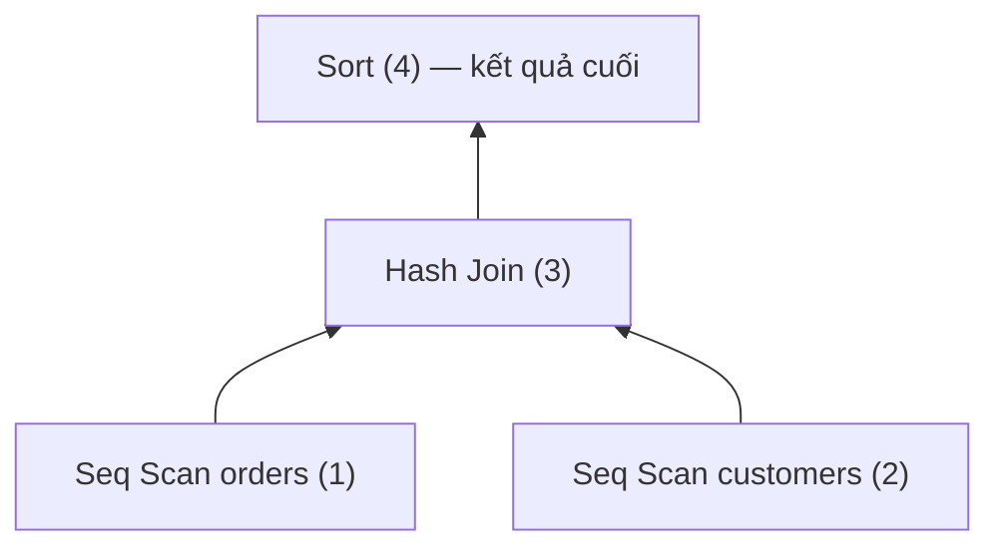
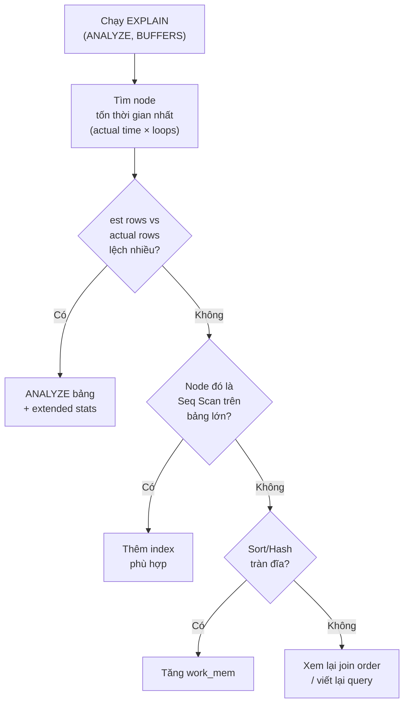

# EXPLAIN & EXPLAIN ANALYZE — Deep Dive

## Mục lục

- [Bối cảnh: Query chậm mà không biết vì sao](#1-bối-cảnh-query-chậm-mà-không-biết-vì-sao)
- [EXPLAIN vs EXPLAIN ANALYZE — Khác biệt sống còn](#2-explain-vs-explain-analyze--khác-biệt-sống-còn)
- [Execution Plan là một cái cây — Cách đọc](#3-execution-plan-là-một-cái-cây--cách-đọc)
- [Giải mã dòng đầu tiên: cost, rows, width](#4-giải-mã-dòng-đầu-tiên-cost-rows-width)
- [Giải mã EXPLAIN ANALYZE: actual time, rows, loops](#5-giải-mã-explain-analyze-actual-time-rows-loops)
- [Estimated vs Actual — Vũ khí số một để debug](#6-estimated-vs-actual--vũ-khí-số-một-để-debug)
- [BUFFERS — Nhìn thấy I/O thật sự](#7-buffers--nhìn-thấy-io-thật-sự)
- [Catalog các loại Node — Scan](#8-catalog-các-loại-node--scan)
- [Catalog các loại Node — Join & Aggregate](#9-catalog-các-loại-node--join--aggregate)
- [Các con số cảnh báo đỏ trong plan](#10-các-con-số-cảnh-báo-đỏ-trong-plan)
- [Workflow đọc plan trong 60 giây](#11-workflow-đọc-plan-trong-60-giây)
- [EXPLAIN trong MySQL — Đọc khác Postgres](#12-explain-trong-mysql--đọc-khác-postgres)
- [Case study: Từ 12 giây xuống 40ms](#13-case-study-từ-12-giây-xuống-40ms)
- [Công cụ trực quan hóa plan](#14-công-cụ-trực-quan-hóa-plan)
- [Tóm tắt — Cheat sheet](#15-tóm-tắt--cheat-sheet)

---

## 1. Bối cảnh: Query chậm mà không biết vì sao

Một query production chạy 12 giây. Bạn có ba lựa chọn:

1. **Đoán mò** — thêm đại một index, đổi thứ tự WHERE, hy vọng may mắn.
2. **Đọc code** — nhìn câu SQL và tưởng tượng DB làm gì (thường sai).
3. **Hỏi thẳng database** — `EXPLAIN` cho bạn xem **chính xác** kế hoạch DB dùng.

`EXPLAIN` là **cách duy nhất đáng tin** để hiểu tại sao query chậm. Nó là X-quang của query: cho biết DB quét bảng hay dùng index, join kiểu gì, sort ở đâu, đọc bao nhiêu row.

> [!IMPORTANT]
> Quy tắc số một khi tối ưu SQL: **đừng đoán, hãy EXPLAIN**. Mọi thao tác tối ưu (thêm index, viết lại query) phải được kiểm chứng bằng plan trước và sau. Tối ưu mà không đọc plan là mò kim đáy bể.

---

## 2. EXPLAIN vs EXPLAIN ANALYZE — Khác biệt sống còn

| | `EXPLAIN` | `EXPLAIN ANALYZE` |
|---|-----------|-------------------|
| Query có chạy thật không? | **Không** — chỉ hiện kế hoạch dự kiến | **Có** — chạy thật rồi báo cáo |
| Con số | **Ước lượng** (estimated) | **Thực tế** (actual) + ước lượng |
| Có `actual time`, `loops` | Không | Có |
| An toàn với `UPDATE/DELETE` | An toàn | **NGUY HIỂM** — thực sự sửa dữ liệu! |
| Dùng khi | Xem nhanh plan | Debug thật sự |

```sql
-- Chỉ xem kế hoạch, không chạy
EXPLAIN SELECT * FROM orders WHERE total > 1000;

-- Chạy thật, đo thời gian thật
EXPLAIN ANALYZE SELECT * FROM orders WHERE total > 1000;
```

> [!WARNING]
> `EXPLAIN ANALYZE DELETE FROM orders WHERE ...` sẽ **XÓA DỮ LIỆU THẬT** vì nó chạy query. Với `UPDATE`/`DELETE`/`INSERT`, bọc trong transaction rồi rollback:
> ```sql
> BEGIN;
> EXPLAIN ANALYZE DELETE FROM orders WHERE id = 5;
> ROLLBACK;
> ```

### 2.1. Bộ option đầy đủ (Postgres)

```sql
EXPLAIN (ANALYZE, BUFFERS, VERBOSE, FORMAT TEXT)
SELECT ...;
```

| Option | Cho biết |
|--------|----------|
| `ANALYZE` | Chạy thật, báo actual time & rows |
| `BUFFERS` | Số page đọc từ cache (shared hit) vs đĩa (read) |
| `VERBOSE` | Chi tiết cột output, schema |
| `SETTINGS` | Tham số planner khác mặc định |
| `WAL` | Lượng WAL sinh ra (cho ghi) |
| `FORMAT JSON/YAML` | Định dạng máy đọc được, cho công cụ visualize |

> [!TIP]
> Dùng thói quen `EXPLAIN (ANALYZE, BUFFERS)` mặc định. `BUFFERS` cho biết query đọc từ RAM hay đĩa — thông tin cực kỳ quan trọng mà `ANALYZE` một mình không có.

---

## 3. Execution Plan là một cái cây — Cách đọc

Plan **không** đọc từ trên xuống như code. Nó là **cây**, đọc từ **node lá (thụt sâu nhất) lên gốc**.

```text
 Sort                              ← (4) GỐC: chạy cuối, trả kết quả
   Sort Key: o.created_at
   ->  Hash Join                   ← (3) ghép kết quả của (1) và (2)
         Hash Cond: (o.customer_id = c.id)
         ->  Seq Scan on orders o  ← (1) LÁ: chạy trước nhất
         ->  Hash                  ← (2)
               ->  Seq Scan on customers c
```

Thứ tự thực thi thật: (1) → (2) → (3) → (4). Dữ liệu chảy **từ lá lên gốc**.



**Cách nhận diện quan hệ cha–con:** node con thụt vào sâu hơn và bắt đầu bằng `->`. Mỗi node nhận input từ (các) node con và trả output cho node cha.

> [!NOTE]
> Mẹo đọc nhanh: tìm node **thụt sâu nhất** — đó là nơi bắt đầu. Node **trên cùng** là kết quả cuối cùng. Chi phí của node cha đã **bao gồm** chi phí các node con.

---

## 4. Giải mã dòng đầu tiên: cost, rows, width

Mỗi node có dòng thống kê. Đây là plan chỉ với `EXPLAIN` (chưa `ANALYZE`):

```text
Seq Scan on orders  (cost=0.00..185430.00 rows=1240 width=32)
                          ▲         ▲          ▲        ▲
                    startup cost  total cost  rows   width
```

| Trường | Ý nghĩa | Đơn vị |
|--------|---------|--------|
| `cost=0.00..185430.00` | `startup..total` | Đơn vị chi phí trừu tượng (không phải ms!) |
| **startup cost** (0.00) | Chi phí đến khi trả **row đầu tiên** | — |
| **total cost** (185430) | Chi phí để trả **toàn bộ** row | — |
| `rows=1240` | Số row **ước tính** node này trả ra | row |
| `width=32` | Kích thước trung bình mỗi row | byte |

### 4.1. "Cost" là gì — không phải mili-giây

Cost là con số **trừu tượng** để optimizer **so sánh** các plan với nhau, không phải thời gian thực. Nó tính từ các tham số:

```
seq_page_cost     = 1.0    -- đọc tuần tự 1 page
random_page_cost  = 4.0    -- đọc ngẫu nhiên 1 page (đắt hơn 4 lần)
cpu_tuple_cost    = 0.01   -- xử lý 1 row
cpu_index_tuple_cost = 0.005
cpu_operator_cost = 0.0025
```

> [!IMPORTANT]
> `random_page_cost = 4.0` là mặc định cho **ổ đĩa quay (HDD)**. Nếu bạn dùng **SSD/NVMe**, giảm xuống `1.1` giúp optimizer sẵn sàng chọn Index Scan hơn (vì random read trên SSD gần như tuần tự). Đây là một trong những tinh chỉnh hiệu quả nhất.

### 4.2. startup cost quan trọng khi có LIMIT

```text
->  Sort  (cost=1000.00..1000.50 ...)   ← startup=1000: phải sort XONG mới trả row đầu
->  Index Scan  (cost=0.42..8.50 ...)   ← startup=0.42: trả row đầu gần như tức thì
```

Với `LIMIT 10`, node có startup cost thấp thắng: nó trả 10 row rồi dừng, không cần làm hết. `Sort` phải xử lý toàn bộ trước khi trả row đầu → startup cost cao.

---

## 5. Giải mã EXPLAIN ANALYZE: actual time, rows, loops

Thêm `ANALYZE`, ta có **con số thực tế**:

```text
Seq Scan on orders  (cost=0.00..185430.00 rows=1240 width=32)
                    (actual time=0.031..842.115 rows=1198 loops=1)
                                 ▲       ▲          ▲       ▲
                          startup    total     rows    số lần
                          (ms)       (ms)      thực    chạy node
```

| Trường | Ý nghĩa |
|--------|---------|
| `actual time=0.031..842.115` | `startup..total` tính bằng **mili-giây thật** |
| `rows=1198` | Số row **thực tế** trả ra (so với est `rows=1240`) |
| `loops=1` | Node này được thực thi **1 lần** |

### 5.1. Bẫy `loops` — phải nhân lên

Khi `loops > 1` (điển hình trong Nested Loop), **`actual time` là thời gian MỘT lần chạy**, phải **nhân với loops** để ra tổng.

```text
->  Index Scan on orders  (actual time=0.004..0.142 rows=10 loops=50000)
```

- Thời gian **mỗi loop**: 0.142ms
- Số loop: 50.000
- **Tổng thực tế**: 0.142 × 50.000 = **7.100ms** (≈ 7 giây!)

> [!WARNING]
> Đừng nhìn `actual time=0.142` rồi nghĩ node này nhanh. Với `loops=50000`, node này ngốn 7 giây. Luôn nhân `actual time × loops` cho node bên trong Nested Loop.

### 5.2. Đọc tổng thời gian

Cuối plan `EXPLAIN ANALYZE` có:

```text
 Planning Time: 0.213 ms      ← thời gian optimizer nghĩ ra plan
 Execution Time: 842.567 ms   ← thời gian chạy thật
```

Nếu `Planning Time` cao bất thường (hàng chục ms) → có thể do quá nhiều bảng join, quá nhiều partition, hoặc prepared statement chưa cache.

---

## 6. Estimated vs Actual — Vũ khí số một để debug

Đây là kỹ năng **quan trọng nhất** cả doc. So sánh `rows` (estimated) với `rows` (actual):

```text
Seq Scan on orders (cost=... rows=1240 ...) (actual ... rows=1198 loops=1)
                              ▲                            ▲
                        est: 1240                    actual: 1198
                        → lệch ~3%, TỐT
```

Ngược lại, khi lệch lớn:

```text
Nested Loop (cost=... rows=5 ...) (actual ... rows=2000000 loops=1)
                        ▲                        ▲
                   est: 5                   actual: 2 triệu
                   → lệch 400.000 lần, THẢM HỌA
```

| Mức lệch (est vs actual) | Đánh giá | Hành động |
|--------------------------|----------|-----------|
| < 10 lần | Bình thường | Không cần lo |
| 10 – 100 lần | Đáng ngờ | Kiểm tra statistics |
| > 100 lần | Nghiêm trọng | `ANALYZE` bảng, xem lại điều kiện |

> [!IMPORTANT]
> Khi optimizer ước lượng sai số row, nó chọn **sai thuật toán join, sai index, sai thứ tự**. Sửa gốc rễ (statistics) thường hiệu quả hơn nhiều so với vá triệu chứng. Xem [Statistics & Query Planner](/optimization/statistics-query-planner-deep-dive/).

**Nguyên nhân lệch phổ biến:**

- Statistics lỗi thời → chạy `ANALYZE table_name;`
- Cột tương quan nhau (VD `city` và `country`) mà optimizer giả định độc lập → dùng extended statistics.
- Hàm/biểu thức phức tạp trong WHERE mà planner không ước lượng được.
- Điều kiện trên cột không có statistics (VD kết quả của subquery).

---

## 7. BUFFERS — Nhìn thấy I/O thật sự

`BUFFERS` cho biết query chạm bao nhiêu **page 8KB**, và từ **cache** hay **đĩa**:

```sql
EXPLAIN (ANALYZE, BUFFERS) SELECT * FROM orders WHERE total > 1000;
```

```text
Seq Scan on orders (actual time=0.02..842 rows=1198 loops=1)
   Buffers: shared hit=48213 read=137802
                        ▲              ▲
                  từ cache RAM     đọc từ ĐĨA
```

| Chỉ số | Ý nghĩa |
|--------|---------|
| `shared hit` | Page tìm thấy trong buffer cache (RAM) — **nhanh** |
| `shared read` | Page phải đọc từ đĩa — **chậm** |
| `temp read/written` | Dữ liệu tạm ghi ra đĩa (sort/hash tràn RAM) — **rất chậm** |

### 7.1. Đọc tín hiệu

- `read` cao, `hit` thấp → query đọc nhiều từ đĩa, cache không đủ hoặc query quét quá nhiều.
- `temp written` xuất hiện → sort hoặc hash tràn `work_mem` ra đĩa. Tăng `work_mem`.

> [!TIP]
> Một Seq Scan với `Buffers: shared read=137802` nghĩa là đọc ~1GB từ đĩa (137802 × 8KB). Đây là bằng chứng cụ thể cần một index để giảm số page phải chạm.

---

## 8. Catalog các loại Node — Scan

Cách DB **lấy dữ liệu từ bảng**:

| Node | Cách hoạt động | Tốt khi | Cảnh báo khi |
|------|----------------|---------|--------------|
| **Seq Scan** | Quét toàn bộ bảng, từng page | Bảng nhỏ, hoặc lấy phần lớn row | Bảng lớn mà chỉ cần vài row → thiếu index |
| **Index Scan** | Đi B-Tree tìm row, rồi đọc heap | Lấy ít row (selectivity cao) | Lấy nhiều row → random I/O đắt |
| **Index Only Scan** | Lấy dữ liệu **chỉ từ index**, không chạm heap | Query chỉ cần cột trong index (covering) | — |
| **Bitmap Heap Scan** | Dựng bitmap các page cần đọc, rồi đọc tuần tự | Lấy lượng row trung bình | — |
| **Bitmap Index Scan** | Dựng bitmap từ index (thường trước Bitmap Heap) | Kết hợp nhiều index | — |
| **Tid Scan** | Truy cập trực tiếp bằng CTID vật lý | `WHERE ctid = ...` | — |

### 8.1. Seq Scan không phải lúc nào cũng xấu

> [!NOTE]
> Nếu query lấy **> 5–10% số row** của bảng, Seq Scan thường **nhanh hơn** Index Scan. Lý do: Index Scan cho nhiều row = nhiều random I/O (nhảy lung tung trên đĩa), trong khi Seq Scan là tuần tự (nhanh hơn nhiều mỗi page). Optimizer biết điều này — đừng ép index khi không cần.

### 8.2. Index Scan vs Bitmap Heap Scan

```text
-- Ít row → Index Scan (đi thẳng)
Index Scan using idx_total on orders  (rows=12)

-- Nhiều row hơn → Bitmap (gom page rồi đọc tuần tự, tránh random I/O)
Bitmap Heap Scan on orders  (rows=45000)
   Recheck Cond: (total > 1000)
   ->  Bitmap Index Scan on idx_total
```

Bitmap là "cầu nối": nhiều row hơn Index Scan nhưng ít hơn ngưỡng Seq Scan.

---

## 9. Catalog các loại Node — Join & Aggregate

### 9.1. Join nodes

| Node | Xem chi tiết |
|------|--------------|
| `Nested Loop` | Vòng lặp lồng — [JOIN Deep Dive §4](/fundamentals/join-deep-dive/) |
| `Hash Join` | Build + probe — [JOIN Deep Dive §5](/fundamentals/join-deep-dive/) |
| `Merge Join` | Hai con trỏ sorted — [JOIN Deep Dive §6](/fundamentals/join-deep-dive/) |

### 9.2. Aggregate & Sort nodes

| Node | Ý nghĩa |
|------|---------|
| **Aggregate** | Gộp toàn bảng (`COUNT(*)`, `SUM` không GROUP BY) |
| **HashAggregate** | GROUP BY bằng hash table (không cần sort) |
| **GroupAggregate** | GROUP BY trên dữ liệu đã sorted |
| **Sort** | Sắp xếp — xem `Sort Method` |
| **Incremental Sort** | Sort thêm khi đã sorted một phần |
| **Limit** | Cắt số row |
| **Gather / Gather Merge** | Gom kết quả từ các **parallel worker** |
| **Materialize** | Lưu tạm kết quả node con để tái dùng |
| **Memoize** | Cache kết quả loop lặp lại (Postgres 14+) |

### 9.3. Đọc Sort Method

```text
Sort  (actual time=... rows=100000)
   Sort Key: created_at
   Sort Method: quicksort  Memory: 24MB          ← sort trong RAM, TỐT
```

```text
   Sort Method: external merge  Disk: 82304kB    ← sort tràn ĐĨA, chậm
```

> [!TIP]
> Thấy `Sort Method: external merge Disk: ...` nghĩa là sort không đủ `work_mem` và tràn ra đĩa. Tăng `work_mem` cho session này để đưa sort về RAM (`SET work_mem = '256MB';`).

---

## 10. Các con số cảnh báo đỏ trong plan

Checklist quét nhanh tìm vấn đề:

| Cảnh báo đỏ | Nghĩa là | Fix hướng tới |
|-------------|----------|---------------|
| `Seq Scan` trên bảng lớn + filter chọn ít row | Thiếu index | Tạo index phù hợp |
| est `rows` lệch actual `rows` > 100× | Statistics sai | `ANALYZE`, extended stats |
| `loops` rất lớn trong Nested Loop | Chọn nhầm thuật toán | `ANALYZE`, kiểm tra outer |
| `Rows Removed by Filter` rất cao | Đọc thừa rồi vứt | Index có điều kiện lọc |
| `Sort Method: external merge Disk` | Sort tràn đĩa | Tăng `work_mem` |
| `Hash ... Batches: N` (N>1) | Hash tràn đĩa | Tăng `work_mem` |
| `Buffers: ... read=` rất cao | I/O đĩa nhiều | Index, hoặc tăng cache |
| `temp read/written` xuất hiện | Dùng đĩa tạm | Tăng `work_mem` |
| `Recheck Cond` với `lossy` blocks nhiều | Bitmap thiếu bộ nhớ | Tăng `work_mem` |

### 10.1. "Rows Removed by Filter" — đọc thừa

```text
Seq Scan on orders (actual ... rows=100 loops=1)
   Filter: (status = 'pending')
   Rows Removed by Filter: 49999900     ← đọc 50 triệu row để lấy 100!
```

DB đọc **50 triệu row** rồi vứt gần hết, chỉ giữ 100. Rõ ràng cần index trên `status`.

---

## 11. Workflow đọc plan trong 60 giây



**Các bước cụ thể:**

1. `EXPLAIN (ANALYZE, BUFFERS)` câu query.
2. Tìm node **ngốn thời gian nhất** — nhớ nhân `actual time × loops`.
3. Ở node đó, so `est rows` với `actual rows`.
4. Kiểm tra `Buffers` (đọc đĩa nhiều?), `Sort Method`/`Batches` (tràn đĩa?).
5. Áp một thay đổi (index / analyze / work_mem / viết lại), rồi **EXPLAIN lại** để kiểm chứng.

> [!IMPORTANT]
> Chỉ thay **một thứ mỗi lần** rồi đo lại. Đổi nhiều thứ cùng lúc thì không biết cái nào có tác dụng.

---

## 12. EXPLAIN trong MySQL — Đọc khác Postgres

MySQL trình bày plan **dạng bảng** (mặc định), không phải cây:

```sql
EXPLAIN SELECT c.name, o.total
FROM customers c JOIN orders o ON o.customer_id = c.id
WHERE c.country = 'Vietnam';
```

```text
+----+------+---------+------+---------------+------+---------+------------+--------+----------+
| id | type | table   | type | possible_keys | key  | key_len | ref        | rows   | Extra    |
+----+------+---------+------+---------------+------+---------+------------+--------+----------+
|  1 |      | c       | ref  | idx_country   | ...  | 767     | const      | 50     | Using... |
|  1 |      | o       | ref  | idx_customer  | ...  | 8       | c.id       | 12     |          |
+----+------+---------+------+---------------+------+---------+------------+--------+----------+
```

| Cột | Ý nghĩa |
|-----|---------|
| `type` (access type) | Cách truy cập — từ tốt đến tệ: `system > const > eq_ref > ref > range > index > ALL` |
| `possible_keys` | Index có thể dùng |
| `key` | Index **thực sự** dùng |
| `key_len` | Số byte của index được dùng (biết dùng bao nhiêu cột composite) |
| `rows` | Số row ước tính DB phải đọc |
| `Extra` | Thông tin quan trọng nhất — xem dưới |

### 12.1. `type = ALL` là báo động

> [!WARNING]
> `type: ALL` trong MySQL nghĩa là **Full Table Scan** — quét toàn bảng, không dùng index. Trên bảng lớn đây gần như luôn là vấn đề. Mục tiêu tối thiểu là đạt `range` hoặc `ref`.

### 12.2. Đọc cột `Extra`

| `Extra` | Ý nghĩa |
|---------|---------|
| `Using index` | Index-only scan (covering) — **tốt** |
| `Using where` | Lọc sau khi đọc — bình thường |
| `Using filesort` | Phải sort thủ công — cân nhắc index cho ORDER BY |
| `Using temporary` | Tạo bảng tạm (GROUP BY/DISTINCT) — coi chừng |
| `Using index condition` | Index Condition Pushdown — tốt |

### 12.3. MySQL 8.0.18+ có EXPLAIN ANALYZE

```sql
EXPLAIN ANALYZE SELECT ...;   -- có actual time & loops giống Postgres
EXPLAIN FORMAT=JSON SELECT ...;  -- chi tiết cost, cho công cụ visualize
```

---

## 13. Case study: Từ 12 giây xuống 40ms

**Query gốc** — dashboard đếm đơn hàng theo trạng thái của khách VIP:

```sql
SELECT o.status, COUNT(*)
FROM orders o
JOIN customers c ON c.id = o.customer_id
WHERE c.tier = 'VIP'
  AND o.created_at >= '2026-01-01'
GROUP BY o.status;
```

**Plan trước (12s):**

```text
 HashAggregate  (actual time=12043 rows=4 loops=1)
   ->  Hash Join  (actual time=210..11980 rows=1200000 loops=1)
         Hash Cond: (o.customer_id = c.id)
         ->  Seq Scan on orders o  (actual ... rows=50000000 loops=1)
               Filter: (created_at >= '2026-01-01')
               Rows Removed by Filter: 38000000       ← đọc 50 triệu, vứt 38 triệu
               Buffers: shared read=685000            ← ~5GB từ đĩa
         ->  Hash  (rows=8000)
               ->  Seq Scan on customers c
                     Filter: (tier = 'VIP')
```

**Chẩn đoán:**

1. `Seq Scan on orders` đọc 50 triệu row, `Rows Removed by Filter: 38M` → thiếu index trên `created_at`.
2. `Buffers read=685000` → ~5GB đọc từ đĩa.

**Fix — index composite phủ điều kiện:**

```sql
CREATE INDEX idx_orders_created_customer
    ON orders(created_at, customer_id, status);
```

**Plan sau (40ms):**

```text
 HashAggregate  (actual time=39.8 rows=4 loops=1)
   ->  Nested Loop  (actual time=0.1..35 rows=1200000 loops=1)
         ->  Seq Scan on customers c (rows=8000)   ← driving nhỏ
               Filter: (tier = 'VIP')
         ->  Index Only Scan using idx_orders_created_customer on orders o
               Index Cond: (created_at >= '2026-01-01' AND customer_id = c.id)
               Buffers: shared hit=41200            ← toàn bộ từ cache!
 Execution Time: 40.2 ms
```

**Kết quả:** 12.043ms → 40ms = **nhanh gấp 300 lần**. Chìa khóa: đọc `Rows Removed by Filter` và `Buffers` để thấy đúng chỗ thắt cổ chai.

---

## 14. Công cụ trực quan hóa plan

Với plan phức tạp (chục node), đọc text rất mệt. Dùng công cụ:

| Công cụ | Dùng cho |
|---------|----------|
| [explain.dalibo.com](https://explain.dalibo.com) | Postgres — dán plan, hiện cây màu, chỉ node tốn nhất |
| [explain.depesz.com](https://explain.depesz.com) | Postgres — bảng highlight node chậm |
| [pev2](https://github.com/dalibo/pev2) | Component nhúng, offline |
| MySQL Workbench | Visual Explain cho MySQL |
| SSMS / Azure Data Studio | Graphical Execution Plan cho SQL Server |

> [!TIP]
> Dùng `EXPLAIN (ANALYZE, BUFFERS, FORMAT JSON)` rồi dán vào explain.dalibo.com — nó tự tô đỏ node ngốn thời gian nhất, tiết kiệm hàng phút soi text.

---

## 15. Tóm tắt — Cheat sheet

```
╭────────────────────────────────────────────────────────────────╮
│  ĐỌC EXPLAIN TRONG 5 BƯỚC                                      │
│                                                                │
│  1. EXPLAIN (ANALYZE, BUFFERS) — luôn kèm BUFFERS              │
│  2. Đọc từ node THỤT SÂU NHẤT lên GỐC                          │
│  3. Tìm node tốn nhất: actual time × loops                     │
│  4. So est rows vs actual rows (lệch >100× = statistics sai)   │
│  5. Đổi MỘT thứ → EXPLAIN lại → đo                             │
│                                                                │
│  CỜ ĐỎ                                                         │
│  • Seq Scan bảng lớn + ít row cần    → thêm index              │
│  • Rows Removed by Filter cao         → index lọc              │
│  • Sort/Hash: external/Disk/Batches>1 → tăng work_mem          │
│  • Buffers read cao                    → index / cache         │
│  • MySQL type: ALL                     → thiếu index           │
╰────────────────────────────────────────────────────────────────╯
```

| Bạn muốn biết | Nhìn vào |
|---------------|----------|
| DB quét bảng hay dùng index? | Node type: `Seq Scan` vs `Index Scan` |
| Query thật sự chậm ở đâu? | `actual time × loops` lớn nhất |
| Optimizer có đoán đúng không? | est `rows` vs actual `rows` |
| Đọc từ RAM hay đĩa? | `Buffers: shared hit vs read` |
| Sort/hash có tràn đĩa không? | `Sort Method` / `Batches` / `temp` |

---

## Tài liệu tham khảo

- [PostgreSQL — Using EXPLAIN](https://www.postgresql.org/docs/current/using-explain.html)
- [MySQL — EXPLAIN Output Format](https://dev.mysql.com/doc/refman/8.0/en/explain-output.html)
- [Dalibo EXPLAIN Visualizer](https://explain.dalibo.com)
- [JOIN & Join Algorithms — Deep Dive](/fundamentals/join-deep-dive/)
- [Statistics & Query Planner — Deep Dive](/optimization/statistics-query-planner-deep-dive/)
