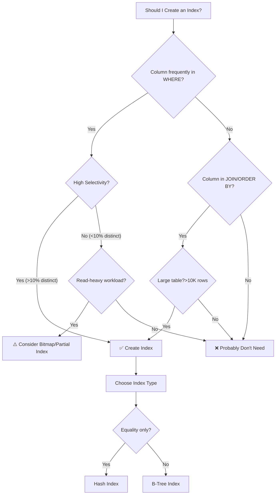
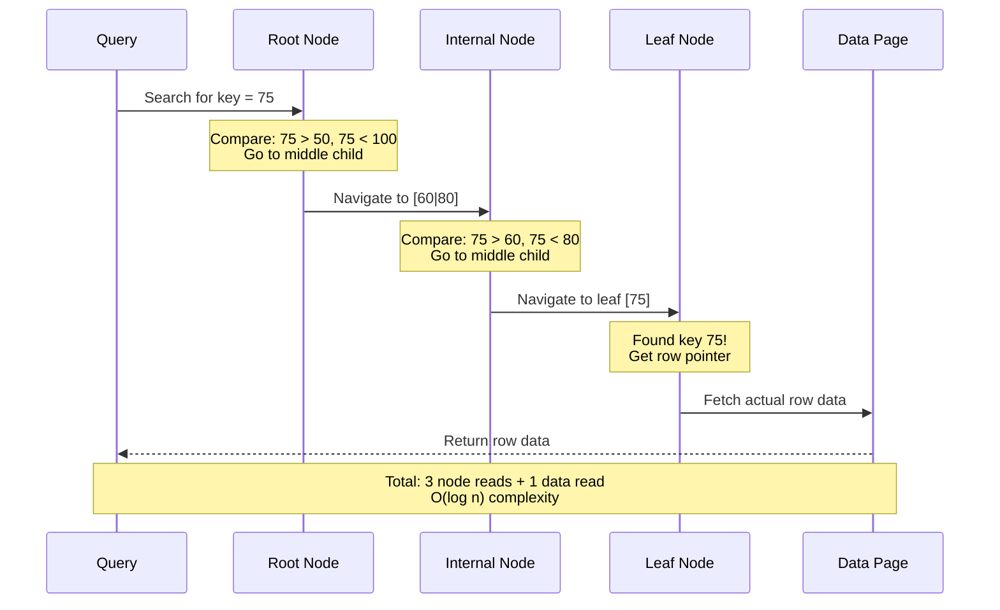
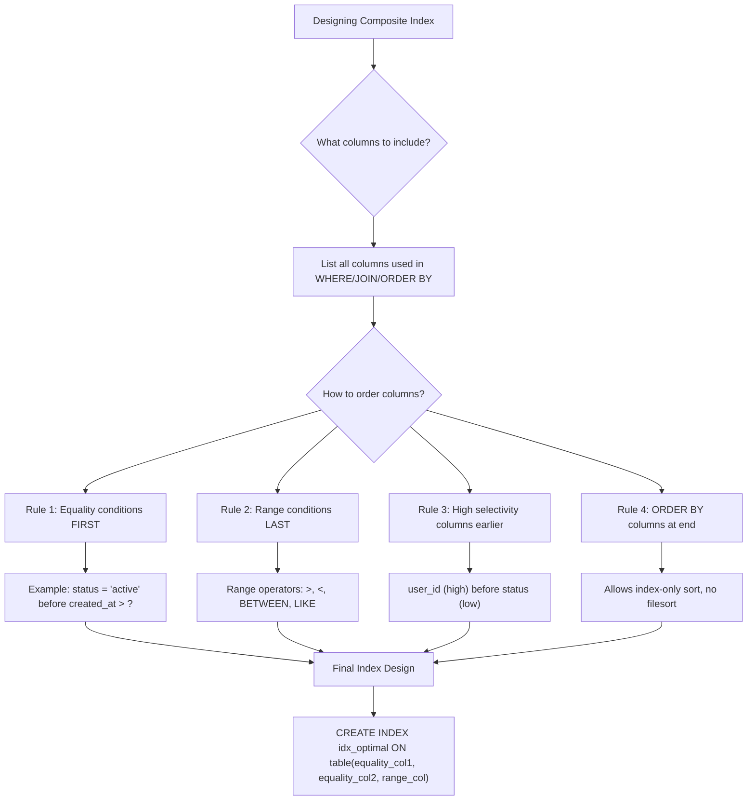
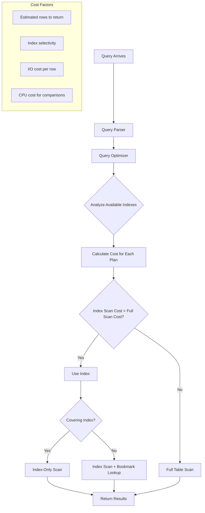
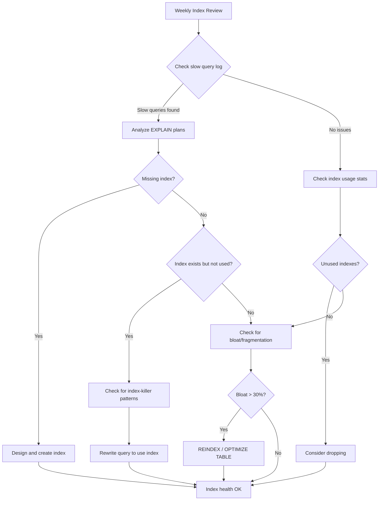
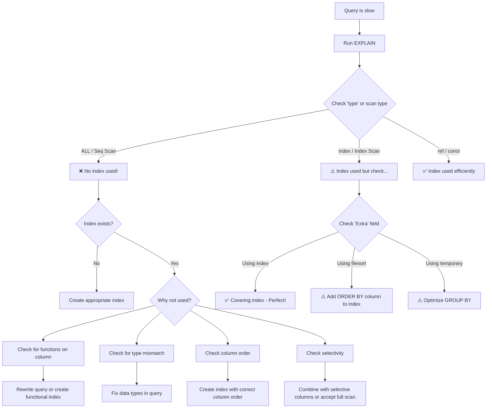

## Mục lục

- [Index Fundamentals](#1-index-fundamentals)
- [Index Storage Structures](#2-index-storage-structures)
- [B-Tree Index Deep Dive](#3-b-tree-index-deep-dive)
- [Clustered vs Non-Clustered Index](#4-clustered-vs-non-clustered-index)
- [Composite Index & Column Order](#5-composite-index--column-order)
- [Index and Query Execution](#6-index-and-query-execution)
- [Index Selectivity & Cardinality](#7-index-selectivity--cardinality)
- [Common Mistakes & How to Prevent](#8-common-mistakes--how-to-prevent)
- [Real-World Examples](#9-real-world-examples)
- [Index Optimization Strategies](#10-index-optimization-strategies)
- [Monitoring & Maintenance](#11-monitoring--maintenance)
- [Why Index Is Not Used](#12-why-index-is-not-used-deep-dive-with-examples)
- [How to Know Which Index Will Be Used](#13-how-to-know-which-index-will-be-used)
- [Index Best Practices Summary](#14-index-best-practices-summary)

---

## 1. Index Fundamentals

### What is an Index?

An **Index** is a separate data structure that maintains pointers to rows in a table, organized in a way that allows fast lookups. Think of it like a book's index - instead of reading every page to find a topic, you look up the index to find the exact page number.

```
┌─────────────────────────────────────────────────────────────────────────────────┐
│                         WITHOUT INDEX (Full Table Scan)                         │
├─────────────────────────────────────────────────────────────────────────────────┤
│                                                                                 │
│   Query: SELECT * FROM users WHERE email = 'john@example.com'                   │
│                                                                                 │
│   ┌─────┐ ┌─────┐ ┌─────┐ ┌─────┐ ┌─────┐ ┌─────┐ ┌─────┐ ┌─────┐               │
│   │Row 1│→│Row 2│→│Row 3│→│Row 4│→│Row 5│→│Row 6│→│Row 7│→│Row 8│→ ...          │
│   │ ❌  │ │ ❌  │ │ ❌  │ │ ✅  │ │ ❌  │ │ ❌  │ │ ❌  │ │ ❌  │              │
│   └─────┘ └─────┘ └─────┘ └─────┘ └─────┘ └─────┘ └─────┘ └─────┘               │
│                                                                                 │
│   ⏱️ Time: O(n) - Must scan ALL rows (1,000,000 rows = 1,000,000 checks)        │
└─────────────────────────────────────────────────────────────────────────────────┘

┌─────────────────────────────────────────────────────────────────────────────────┐
│                           WITH INDEX (B-Tree Lookup)                            │
├─────────────────────────────────────────────────────────────────────────────────┤
│                                                                                 │
│   Query: SELECT * FROM users WHERE email = 'john@example.com'                   │
│                                                                                 │
│                          [Index Root]                                           │
│                              │                                                  │
│                    ┌─────────┴─────────┐                                        │
│                    ▼                   ▼                                        │
│               [a-m...]            [n-z...]                                      │
│                    │                                                            │
│              ┌─────┴─────┐                                                      │
│              ▼           ▼                                                      │
│         [j-k...]    [l-m...]                                                    │
│              │                                                                  │
│              ▼                                                                  │
│    john@example.com → Row 4 ✅                                                  │
│                                                                                 │
│   ⏱️ Time: O(log n) - Only 3 comparisons (1,000,000 rows ≈ 20 comparisons)      │
└─────────────────────────────────────────────────────────────────────────────────┘
```

### Performance Comparison

| Rows in Table | Full Table Scan | B-Tree Index Lookup | Speed Improvement |
|---------------|-----------------|---------------------|-------------------|
| 1,000 | 1,000 comparisons | ~10 comparisons | **100x faster** |
| 10,000 | 10,000 comparisons | ~14 comparisons | **714x faster** |
| 100,000 | 100,000 comparisons | ~17 comparisons | **5,882x faster** |
| 1,000,000 | 1,000,000 comparisons | ~20 comparisons | **50,000x faster** |
| 10,000,000 | 10,000,000 comparisons | ~24 comparisons | **416,667x faster** |

### Index Benefits Summary

| Benefit | Explanation | Example |
|---------|-------------|---------|
| **Speed up SELECT queries** | DB reads only relevant data blocks, not full table | `WHERE email = ?` uses index instead of scanning all rows |
| **Optimize WHERE conditions** | Index provides direct path to matching rows | `WHERE status = 'active' AND created_at > '2024-01-01'` |
| **Accelerate JOIN operations** | Index on foreign key speeds up table joins | `JOIN orders ON users.id = orders.user_id` |
| **Improve ORDER BY / GROUP BY** | Data already sorted in index structure | `ORDER BY created_at DESC` uses index order |
| **Enforce UNIQUE constraints** | UNIQUE index checks duplicates efficiently | Prevent duplicate emails in users table |

### When to Create Index



### When NOT to Create Index

| Scenario | Reason | Example |
|----------|--------|---------|
| **Small tables** (< 1000 rows) | Full scan is faster than index lookup overhead | Configuration tables, lookup tables |
| **Low selectivity columns** | Index scan still reads most of the table | `gender` (M/F), `is_active` (true/false) |
| **Frequently updated columns** | Every UPDATE requires index update too | `view_count`, `last_login_at` |
| **Columns with functions** | Index won't be used if column is wrapped in function | `WHERE YEAR(created_at) = 2024` |
| **Write-heavy tables** | Index maintenance slows down INSERT/UPDATE/DELETE | High-frequency logging tables |

---

## 2. Index Storage Structures

### Overview of Index Types

| Index Type | Data Structure | Best For | Operators Supported | Database Support |
|------------|---------------|----------|---------------------|------------------|
| **B-Tree** | Balanced Tree | Range queries, equality, sorting | `=`, `<`, `>`, `<=`, `>=`, `BETWEEN`, `LIKE 'abc%'` | MySQL, PostgreSQL, Oracle, SQL Server |
| **Hash** | Hash Table | Equality only | `=` | PostgreSQL, MySQL (Memory Engine) |
| **Bitmap** | Bit vectors | Low-cardinality columns | `=`, `IN`, `AND`, `OR` | Oracle, PostgreSQL |
| **GiST** | Generalized Search Tree | Spatial, full-text, custom types | `@>`, `<@`, `&&`, `~` | PostgreSQL |
| **GIN** | Generalized Inverted Index | Arrays, JSONB, full-text | `@>`, `?`, `?&`, `?|` | PostgreSQL |
| **BRIN** | Block Range Index | Large tables with natural ordering | Range queries on correlated data | PostgreSQL |

### B-Tree vs Hash Index Comparison

```
┌─────────────────────────────────────────────────────────────────────────────────┐
│                              B-TREE INDEX                                       │
├─────────────────────────────────────────────────────────────────────────────────┤
│                                                                                 │
│   Structure: Balanced Tree (sorted nodes)                                       │
│                                                                                 │
│                          [M]                                                    │
│                         /   \                                                   │
│                      [E]     [R]                                                │
│                     / | \   / | \                                               │
│                   [A][F][H][N][S][Z]                                            │
│                                                                                 │
│   ✅ Supports: =, <, >, <=, >=, BETWEEN, LIKE 'abc%', ORDER BY                  │
│   ✅ Range scans: Find all values between 10 and 20                             │
│   ✅ Prefix search: LIKE 'john%'                                                │
│   ❌ Slower for exact match than Hash (need tree traversal)                     │
│                                                                                 │
└─────────────────────────────────────────────────────────────────────────────────┘

┌─────────────────────────────────────────────────────────────────────────────────┐
│                              HASH INDEX                                         │
├─────────────────────────────────────────────────────────────────────────────────┤
│                                                                                 │
│   Structure: Hash Table (key → bucket)                                          │
│                                                                                 │
│   hash('john@example.com') = 42 → Bucket[42] → Row Pointer                      │
│   hash('jane@example.com') = 17 → Bucket[17] → Row Pointer                      │
│   hash('bob@example.com')  = 42 → Bucket[42] → Row Pointer (collision)          │
│                                                                                 │
│   ✅ O(1) lookup for exact match (=)                                            │
│   ✅ Very fast for equality comparisons                                         │
│   ❌ NO support for: <, >, BETWEEN, ORDER BY, LIKE                              │
│   ❌ Not useful for range queries                                               │
│                                                                                 │
└─────────────────────────────────────────────────────────────────────────────────┘
```

### Bitmap Index Deep Dive

```
┌─────────────────────────────────────────────────────────────────────────────────┐
│                            BITMAP INDEX                                         │
├─────────────────────────────────────────────────────────────────────────────────┤
│                                                                                 │
│   Table: employees (status column has 3 values: active, inactive, pending)      │
│                                                                                 │
│   Row ID:           1   2   3   4   5   6   7   8   9   10                      │
│   Status:        active  inactive  active  pending  active  inactive  ...       │
│                                                                                 │
│   Bitmap Vectors:                                                               │
│   ┌────────────┬───┬───┬───┬───┬───┬───┬───┬───┬───┬────┐                       │
│   │ active     │ 1 │ 0 │ 1 │ 0 │ 1 │ 0 │ 1 │ 0 │ 1 │ 0  │                       │
│   ├────────────┼───┼───┼───┼───┼───┼───┼───┼───┼───┼────┤                       │
│   │ inactive   │ 0 │ 1 │ 0 │ 0 │ 0 │ 1 │ 0 │ 1 │ 0 │ 1  │                       │
│   ├────────────┼───┼───┼───┼───┼───┼───┼───┼───┼───┼────┤                       │
│   │ pending    │ 0 │ 0 │ 0 │ 1 │ 0 │ 0 │ 0 │ 0 │ 0 │ 0  │                       │
│   └────────────┴───┴───┴───┴───┴───┴───┴───┴───┴───┴────┘                       │
│                                                                                 │
│   Query: WHERE status = 'active' AND department = 'sales'                       │
│   → Bitwise AND between status_active bitmap and department_sales bitmap        │
│   → Extremely fast for analytical queries with multiple conditions              │
│                                                                                 │
│   ✅ Best for: Low cardinality columns (gender, status, category)               │
│   ✅ Excellent for: Data warehousing, OLAP, complex WHERE with AND/OR           │
│   ❌ Bad for: High cardinality (email, user_id)                                 │
│   ❌ Bad for: Frequent updates (need to rebuild bitmaps)                        │
│                                                                                 │
└─────────────────────────────────────────────────────────────────────────────────┘
```

---

## 3. B-Tree Index Deep Dive

### B-Tree Structure Explained

B-Tree (Balanced Tree) is the most common index structure. Most databases actually use **B+Tree** variant.

```
┌─────────────────────────────────────────────────────────────────────────────────┐
│                         B+TREE INDEX STRUCTURE                                  │
├─────────────────────────────────────────────────────────────────────────────────┤
│                                                                                 │
│   Level 0 (Root):                    [50 | 100]                                 │
│                                     /    |    \                                 │
│                                    /     |     \                                │
│   Level 1 (Internal):        [20|30] [60|80]  [120|150]                         │
│                              /  |  \   / | \    /  |  \                         │
│                             /   |   \ /  |  \  /   |   \                        │
│   Level 2 (Leaf):         [10][25][35][55][75][90][110][140][180]               │
│                            ↓   ↓   ↓   ↓   ↓   ↓   ↓    ↓    ↓                  │
│                          Data Data Data Data Data Data Data Data Data           │
│                            └──────────────────────────────────────┘             │
│                             Leaf nodes linked for range scans                   │
│                                                                                 │
│   Key Differences B-Tree vs B+Tree:                                             │
│   ┌────────────────┬─────────────────────────┬────────────────────────────────┐ │
│   │ Feature        │ B-Tree                  │ B+Tree                         │ │
│   ├────────────────┼─────────────────────────┼────────────────────────────────┤ │
│   │ Data location  │ All nodes               │ Only leaf nodes                │ │
│   │ Leaf linking   │ No                      │ Yes (linked list)              │ │
│   │ Range scans    │ Complex (tree traversal)│ Simple (follow leaf links)     │ │
│   │ Disk I/O       │ More random             │ More sequential                │ │
│   │ Space          │ More wasted             │ More efficient                 │ │
│   └────────────────┴─────────────────────────┴────────────────────────────────┘ │
│                                                                                 │
└─────────────────────────────────────────────────────────────────────────────────┘
```

### B-Tree Search Process



### B-Tree Operations Complexity

| Operation | Average Case | Worst Case | Description |
|-----------|-------------|------------|-------------|
| **Search** | O(log n) | O(log n) | Tree height determines lookups |
| **Insert** | O(log n) | O(log n) | May cause node splits |
| **Delete** | O(log n) | O(log n) | May cause node merges |
| **Range Scan** | O(log n + k) | O(log n + k) | k = number of matching rows |

### Node Split Visualization

```
┌─────────────────────────────────────────────────────────────────────────────────┐
│                         B-TREE NODE SPLIT                                       │
├─────────────────────────────────────────────────────────────────────────────────┤
│                                                                                 │
│   BEFORE: Insert key 45 into full node                                          │
│                                                                                 │
│                           [30]                                                  │
│                          /    \                                                 │
│                  [10|20]      [35|40|50|55] ← FULL (max 4 keys)                 │
│                                                                                 │
│   INSERT 45: Node is full, must SPLIT!                                          │
│                                                                                 │
│   AFTER: Node splits, middle key moves up                                       │
│                                                                                 │
│                        [30 | 45]  ← 45 promoted to parent                       │
│                       /    |    \                                               │
│               [10|20] [35|40] [50|55]                                           │
│                                                                                 │
│   ⚠️ Impact on Write Performance:                                               │
│   - Node splits require additional I/O                                          │
│   - May cascade up to root (rare but possible)                                  │
│   - This is why INSERTs are slower with indexes                                 │
│                                                                                 │
└─────────────────────────────────────────────────────────────────────────────────┘
```

---

## 4. Clustered vs Non-Clustered Index

### Visual Comparison

```
┌─────────────────────────────────────────────────────────────────────────────────┐
│                         CLUSTERED INDEX                                         │
├─────────────────────────────────────────────────────────────────────────────────┤
│                                                                                 │
│   The table IS the index - data physically sorted by index key                  │
│                                                                                 │
│              [Index Root]                                                       │
│                   │                                                             │
│          ┌────────┴────────┐                                                    │
│          ▼                 ▼                                                    │
│     [Internal]        [Internal]                                                │
│          │                 │                                                    │
│    ┌─────┴─────┐     ┌─────┴─────┐                                              │
│    ▼           ▼     ▼           ▼                                              │
│ ┌─────────┐ ┌─────────┐ ┌─────────┐ ┌─────────┐                                 │
│ │ Row 1   │ │ Row 2   │ │ Row 3   │ │ Row 4   │  ← ACTUAL DATA in leaf!         │
│ │ id=1    │ │ id=2    │ │ id=5    │ │ id=10   │                                 │
│ │ name=A  │ │ name=B  │ │ name=C  │ │ name=D  │                                 │
│ │ email=..│ │ email=..│ │ email=..│ │ email=..│                                 │
│ └─────────┘ └─────────┘ └─────────┘ └─────────┘                                 │
│                                                                                 │
│   ✅ Only ONE per table (defines physical order)                                │
│   ✅ Very fast for range scans (sequential reads)                               │
│   ✅ No extra lookup needed (data is right there)                               │
│   ❌ INSERT in middle requires shifting data                                    │
│                                                                                 │
└─────────────────────────────────────────────────────────────────────────────────┘

┌─────────────────────────────────────────────────────────────────────────────────┐
│                       NON-CLUSTERED INDEX                                       │
├─────────────────────────────────────────────────────────────────────────────────┤
│                                                                                 │
│   Separate structure with pointers to actual rows                               │
│                                                                                 │
│   Index (on email):              Heap/Clustered Table:                          │
│                                                                                 │
│        [Index Root]               ┌─────────────────┐                           │
│             │                     │ Row 1 (id=5)    │ ←──┐                      │
│      ┌──────┴──────┐              │ Row 2 (id=1)    │ ←──┼──┐                   │
│      ▼             ▼              │ Row 3 (id=10)   │ ←──┼──┼──┐                │
│   [a-m...]    [n-z...]            │ Row 4 (id=2)    │ ←──┼──┼──┼──┐             │
│      │             │              └─────────────────┘    │  │  │  │             │
│   ┌──┴──┐     ┌───┴───┐                                  │  │  │  │             │
│   ▼     ▼     ▼       ▼                                  │  │  │  │             │
│ ┌────┐┌────┐┌────┐┌────┐                                 │  │  │  │             │
│ │a@..│→──────────────────────────────────────────────────┘  │  │  │             │
│ │b@..│→─────────────────────────────────────────────────────┘  │  │             │
│ │c@..│→────────────────────────────────────────────────────────┘  │             │
│ │d@..│→───────────────────────────────────────────────────────────┘             │
│ └────┘└────┘└────┘└────┘                                                        │
│   (Index leaf contains key + pointer to row)                                    │
│                                                                                 │
│   ⚠️ Requires TWO lookups: Index → Pointer → Data (bookmark lookup)             │
│   ✅ Can have MANY per table                                                    │
│   ✅ Smaller than clustered (only keys + pointers)                              │
│   ✅ INSERTs faster (no data reordering)                                        │
│                                                                                 │
└─────────────────────────────────────────────────────────────────────────────────┘
```

### Detailed Comparison Table

| Aspect | Clustered Index | Non-Clustered Index |
|--------|----------------|---------------------|
| **Count per table** | Only 1 | Multiple (up to 999 in SQL Server) |
| **Data storage** | Leaf nodes contain actual data | Leaf nodes contain pointers |
| **Physical order** | Determines physical row order | Does not affect physical order |
| **Speed for key lookup** | Fastest (1 lookup) | Slower (2 lookups: index → data) |
| **Speed for range scan** | Very fast (sequential I/O) | Slower (random I/O to fetch rows) |
| **Size** | Larger (contains all data) | Smaller (keys + pointers only) |
| **INSERT impact** | May require page splits and data movement | Only updates index structure |
| **Default in MySQL InnoDB** | Primary Key | Other indexes |
| **Default in PostgreSQL** | None (heap table) | All indexes are non-clustered |

### Bookmark Lookup Problem

**Bookmark Lookup** (also called Key Lookup in SQL Server, or RID Lookup for heap tables) occurs when the database finds rows using a non-clustered index but must then go back to the base table (or clustered index) to retrieve additional columns not stored in the index.

```
┌─────────────────────────────────────────────────────────────────────────────────┐
│                       BOOKMARK LOOKUP PROBLEM                                   │
├─────────────────────────────────────────────────────────────────────────────────┤
│                                                                                 │
│   Query: SELECT id, email, name, address                                        │
│          FROM users                                                             │
│          WHERE email = 'john@example.com'                                       │
│                                                                                 │
│   Index on (email) - Non-Clustered                                              │
│                                                                                 │
│   Step 1: Search index for email                                                │
│           ┌─────────────────────┐                                               │
│           │ email = john@...    │                                               │
│           │ Pointer → Row 1234  │                                               │
│           └─────────────────────┘                                               │
│                      │                                                          │
│                      ▼                                                          │
│   Step 2: BOOKMARK LOOKUP - Go to table to get other columns                    │
│           ┌─────────────────────────────────────┐                               │
│           │ Row 1234                            │                               │
│           │ id=5, email=john@..., name=John,    │                               │
│           │ address=123 Main St                 │                               │
│           └─────────────────────────────────────┘                               │
│                                                                                 │
│   ⚠️ Problem: If query returns 1000 rows, that's 1000 random I/O operations!    │
│                                                                                 │
│   💡 Solution: COVERING INDEX                                                   │
│   CREATE INDEX idx_email_cover ON users(email) INCLUDE (name, address);         │
│                                                                                 │
│   Now index leaf contains:                                                      │
│   ┌───────────────────────────────────────────────┐                             │
│   │ email = john@...                              │                             │
│   │ INCLUDED: name = John, address = 123 Main St  │  ← No bookmark lookup!      │
│   └───────────────────────────────────────────────┘                             │
│                                                                                 │
└─────────────────────────────────────────────────────────────────────────────────┘
```

### Why Bookmark Lookup is Problematic

| Reason | Explanation | Impact |
|--------|-------------|--------|
| **Random I/O Operations** | Each lookup jumps to a different location in the table/clustered index, causing random disk seeks | Random I/O is 10-100x slower than sequential I/O on HDDs, still 2-10x slower on SSDs |
| **I/O Amplification** | Finding 1,000 rows in index requires 1,000 additional table lookups | Query that should read 10 pages ends up reading 1,000+ pages |
| **Buffer Pool Pollution** | Each lookup loads a full data page into memory just for one row | Pushes out frequently used pages, degrading overall cache efficiency |
| **Unpredictable Latency** | Pages may or may not be cached; performance varies wildly | Query times can range from 5ms to 500ms depending on cache state |
| **Tipping Point Problem** | Optimizer may abandon index entirely if too many lookups needed | Index becomes useless when selectivity drops below threshold (~1-5%) |
| **Lock Contention** | More pages accessed means more locks held longer | Increases blocking in high-concurrency environments |

### The Tipping Point: When Index Becomes Slower Than Full Scan

```
┌─────────────────────────────────────────────────────────────────────────────────┐
│                         BOOKMARK LOOKUP TIPPING POINT                           │
├─────────────────────────────────────────────────────────────────────────────────┤
│                                                                                 │
│   Table: orders (1,000,000 rows, 100 rows per page = 10,000 pages)              │
│   Index: idx_status (status) - Non-Clustered                                    │
│                                                                                 │
│   Scenario 1: WHERE status = 'cancelled' (0.1% = 1,000 rows)                    │
│   ┌──────────────────────────────────────────────────────────────────────────┐  │
│   │ Index Scan: ~5 pages + Bookmark Lookups: ~1,000 page reads               │  │
│   │ Total: ~1,005 page reads                                                 │  │
│   │ Full Table Scan: 10,000 pages                                            │  │
│   │ Winner: ✅ INDEX (10x faster)                                            │  │
│   └──────────────────────────────────────────────────────────────────────────┘  │
│                                                                                 │
│   Scenario 2: WHERE status = 'active' (30% = 300,000 rows)                      │
│   ┌──────────────────────────────────────────────────────────────────────────┐  │
│   │ Index Scan: ~1,500 pages + Bookmark Lookups: ~300,000 random reads!      │  │
│   │ Even with some page reuse: ~50,000+ page reads                           │  │
│   │ Full Table Scan: 10,000 sequential pages                                 │  │
│   │ Winner: ✅ FULL SCAN (5x faster!)                                        │  │
│   └──────────────────────────────────────────────────────────────────────────┘  │
│                                                                                 │
│   ⚠️ Rule of Thumb: Optimizer often chooses full scan when returning >5-15%     │
│      of total rows, because random I/O from bookmarks is too expensive.         │
│                                                                                 │
└─────────────────────────────────────────────────────────────────────────────────┘
```

### Real-World Example: E-Commerce Product Search

```sql
-- Scenario: E-commerce site with 5 million products
-- Table: products (id, name, category_id, price, description, image_url, 
--                  stock_qty, created_at, rating, review_count)
-- Size: ~2GB data, 500 bytes average per row

-- Index exists: CREATE INDEX idx_category ON products(category_id);

-- Query: Show products in "Electronics" category for listing page
SELECT id, name, price, image_url, rating
FROM products
WHERE category_id = 42  -- Electronics: 150,000 products (3%)
ORDER BY rating DESC
LIMIT 50;
```

```
┌────────────────────────────────────────────────────────────────────────────────┐
│              REAL-WORLD BOOKMARK LOOKUP PROBLEM ANALYSIS                       │
├────────────────────────────────────────────────────────────────────────────────┤
│                                                                                │
│   WHAT HAPPENS INTERNALLY:                                                     │
│                                                                                │
│   Step 1: Index Scan on idx_category                                           │
│   ┌─────────────────────────────────────────────────────────────────────────┐  │
│   │ Find all 150,000 product IDs where category_id = 42                     │  │
│   │ Index pages read: ~500 pages (efficient!)                               │  │
│   └─────────────────────────────────────────────────────────────────────────┘  │
│                                                                                │
│   Step 2: Bookmark Lookup for EACH row (THE PROBLEM!)                          │
│   ┌─────────────────────────────────────────────────────────────────────────┐  │
│   │ For each of 150,000 products:                                           │  │
│   │   - Go to table to fetch: name, price, image_url, rating                │  │
│   │   - Each lookup = 1 random page read                                    │  │
│   │   - Best case (all cached): ~150,000 logical reads                      │  │
│   │   - Worst case (cold cache): ~150,000 physical disk reads!              │  │
│   └─────────────────────────────────────────────────────────────────────────┘  │
│                                                                                │
│   Step 3: Sort by rating (after fetching ALL data)                             │
│   ┌─────────────────────────────────────────────────────────────────────────┐  │
│   │ Sort 150,000 rows in memory/tempdb                                      │  │
│   │ Then return only TOP 50                                                 │  │
│   │ ❌ We fetched 150,000 rows just to return 50!                           │  │
│   └─────────────────────────────────────────────────────────────────────────┘  │
│                                                                                │
│   PERFORMANCE IMPACT:                                                          │
│   ┌─────────────────────────────────────────────────────────────────────────┐  │
│   │ Metric              │ With Bookmark Lookups  │ Expected by Developer    │  │
│   │─────────────────────┼────────────────────────┼──────────────────────────│  │
│   │ Logical Reads       │ 150,500 pages          │ ~50 pages                │  │
│   │ Execution Time      │ 2-8 seconds            │ <50 ms                   │  │
│   │ Memory Usage        │ 75MB+ for sort         │ <1 MB                    │  │
│   │ CPU Time            │ 500ms+                 │ <10 ms                   │  │
│   └─────────────────────────────────────────────────────────────────────────┘  │
│                                                                                │
└────────────────────────────────────────────────────────────────────────────────┘
```

### Solution: Covering Index

```sql
-- SOLUTION 1: Covering Index with INCLUDE (SQL Server/PostgreSQL)
CREATE INDEX idx_category_covering 
ON products(category_id, rating DESC) 
INCLUDE (name, price, image_url);

-- SOLUTION 2: Composite Covering Index (MySQL/All databases)
CREATE INDEX idx_category_covering 
ON products(category_id, rating DESC, name, price, image_url);

-- Now the query execution:
-- Step 1: Index seek to category_id = 42
-- Step 2: Data already sorted by rating in index
-- Step 3: First 50 entries have ALL needed columns
-- Step 4: Return immediately - NO table access needed!
```

```
┌─────────────────────────────────────────────────────────────────────────────────┐
│              PERFORMANCE COMPARISON: BEFORE vs AFTER                            │
├─────────────────────────────────────────────────────────────────────────────────┤
│                                                                                 │
│   Metric              │ Before (Bookmark)     │ After (Covering)     │ Gain     │
│   ────────────────────┼───────────────────────┼──────────────────────┼───────── │
│   Logical Reads       │ 150,500 pages         │ 5 pages              │ 30,000x  │
│   Physical Reads      │ Up to 150,000         │ 0-5                  │ ~30,000x │
│   Execution Time      │ 2-8 seconds           │ 2-10 ms              │ 200-400x │
│   Memory for Sort     │ 75MB+                 │ 0 (index pre-sorted) │ 100%     │
│   EXPLAIN Extra       │ "Using index cond"    │ "Using index"        │ -        │
│                                                                                 │
│   Trade-off:                                                                    │
│   ┌─────────────────────────────────────────────────────────────────────────┐   │
│   │ - Index size increases: ~200MB → ~400MB (+200MB)                        │   │
│   │ - INSERT/UPDATE slightly slower (more index maintenance)                │   │
│   │ - Worth it for high-frequency queries (this page viewed 100K+/day)      │   │
│   └─────────────────────────────────────────────────────────────────────────┘   │
│                                                                                 │
└─────────────────────────────────────────────────────────────────────────────────┘
```

### When to Solve Bookmark Lookup

| Factor | Create Covering Index | Keep Bookmark Lookup |
|--------|----------------------|---------------------|
| **Query frequency** | High (1000s/day) | Low (few times/day) |
| **Result set size** | Small (< 100 rows typically) | Large or variable |
| **Column sizes** | Small columns (int, date, short varchar) | Large columns (TEXT, BLOB) |
| **Write frequency** | Read-heavy table | Write-heavy table |
| **Storage constraints** | Plenty of disk space | Limited storage |

### Detecting Bookmark Lookups

```sql
-- MySQL: Look for "Using index condition" vs "Using index"
EXPLAIN SELECT id, name, price FROM products WHERE category_id = 42;
-- "Using index" = Covering index (good!)
-- "Using index condition" or no mention = Bookmark lookup happening

-- SQL Server: Look for "Key Lookup" or "RID Lookup" operators
SET STATISTICS IO ON;
SELECT id, name, price FROM products WHERE category_id = 42;
-- Check for "Key Lookup" in execution plan

-- PostgreSQL: Look for "Index Scan" vs "Index Only Scan"
EXPLAIN (ANALYZE, BUFFERS) SELECT id, name, price FROM products WHERE category_id = 42;
-- "Index Only Scan" = Covering index (good!)
-- "Index Scan" + "Heap Fetches: X" = Bookmark lookups happening
```

---

## 5. Composite Index & Column Order

### The Critical Importance of Column Order

```
┌─────────────────────────────────────────────────────────────────────────────────┐
│              COMPOSITE INDEX COLUMN ORDER MATTERS!                              │
├─────────────────────────────────────────────────────────────────────────────────┤
│                                                                                 │
│   Index: CREATE INDEX idx_orders ON orders(customer_id, status, created_at)     │
│                                                                                 │
│   Imagine the index as a phone book sorted by: Last Name → First Name → City    │
│                                                                                 │
│   ┌────────────────────────────────────────────────────────────────────┐        │
│   │ customer_id │ status   │ created_at    │ Row Pointer               │        │
│   ├─────────────┼──────────┼───────────────┼───────────────────────────┤        │
│   │ 100         │ active   │ 2024-01-01    │ → Row 5                   │        │
│   │ 100         │ active   │ 2024-01-15    │ → Row 12                  │        │
│   │ 100         │ pending  │ 2024-01-10    │ → Row 8                   │        │
│   │ 101         │ active   │ 2024-01-05    │ → Row 3                   │        │
│   │ 101         │ complete │ 2024-01-20    │ → Row 15                  │        │
│   │ 102         │ active   │ 2024-01-02    │ → Row 1                   │        │
│   └─────────────┴──────────┴───────────────┴───────────────────────────┘        │
│                                                                                 │
│   ✅ LEFT PREFIX RULE: Index can be used if query uses leftmost columns         │
│                                                                                 │
└─────────────────────────────────────────────────────────────────────────────────┘
```

### Which Queries Use the Index?

| Query | Uses Index? | Explanation |
|-------|-------------|-------------|
| `WHERE customer_id = 100` | ✅ Yes | Uses first column |
| `WHERE customer_id = 100 AND status = 'active'` | ✅ Yes | Uses first two columns |
| `WHERE customer_id = 100 AND status = 'active' AND created_at > '2024-01-01'` | ✅ Yes | Uses all three columns |
| `WHERE status = 'active'` | ❌ No | Skips first column! |
| `WHERE created_at > '2024-01-01'` | ❌ No | Skips first two columns! |
| `WHERE customer_id = 100 AND created_at > '2024-01-01'` | ⚠️ Partial | Only uses customer_id, can't skip status |
| `WHERE status = 'active' AND customer_id = 100` | ✅ Yes | Optimizer reorders (same as first two) |

### Column Order Decision Guide



### Real Example: Optimizing a Slow Query

```sql
-- Original slow query
SELECT * FROM orders 
WHERE status = 'pending' 
  AND customer_id = 12345 
  AND created_at BETWEEN '2024-01-01' AND '2024-12-31'
ORDER BY created_at DESC;

-- Analysis:
-- status = 'pending'      → Equality (low selectivity: ~5 values)
-- customer_id = 12345     → Equality (high selectivity: millions of values)
-- created_at BETWEEN      → Range
-- ORDER BY created_at     → Sorting

-- ❌ BAD INDEX: (status, created_at, customer_id)
-- Why bad: Low selectivity first, range before equality

-- ✅ GOOD INDEX: (customer_id, status, created_at)
-- Why good: 
--   1. customer_id (high selectivity) filters most rows first
--   2. status (equality) further filters
--   3. created_at (range + sort) at end - can use for both filter AND sort!

CREATE INDEX idx_orders_optimal ON orders(customer_id, status, created_at);
```

---

## 6. Index and Query Execution

### How Database Chooses to Use Index



### Understanding EXPLAIN Output

```sql
-- MySQL EXPLAIN example
EXPLAIN SELECT * FROM users WHERE email = 'john@example.com';
```

```
┌─────────────────────────────────────────────────────────────────────────────────┐
│                         EXPLAIN OUTPUT ANALYSIS                                 │
├─────────────────────────────────────────────────────────────────────────────────┤
│                                                                                 │
│ +----+-------------+-------+------+---------------+----------+---------+-------+│
│ | id | select_type | table | type | possible_keys | key      | key_len | rows  |│
│ +----+-------------+-------+------+---------------+----------+---------+-------+│
│ |  1 | SIMPLE      | users | ref  | idx_email     | idx_email| 767     | 1     |│
│ +----+-------------+-------+------+---------------+----------+---------+-------+│
│                                                                                 │
│ Key columns explained:                                                          │
│                                                                                 │
│ ┌────────────────┬────────────────────────────────────────────────────────────┐ │
│ │ Column         │ Meaning                                                    │ │
│ ├────────────────┼────────────────────────────────────────────────────────────┤ │
│ │ type           │ Access method (best to worst):                             │ │
│ │                │ system > const > eq_ref > ref > range > index > ALL        │ │
│ │                │                                                            │ │
│ │ possible_keys  │ Indexes that COULD be used                                 │ │
│ │ key            │ Index actually CHOSEN                                      │ │
│ │ key_len        │ Bytes of index used (longer = more columns used)           │ │
│ │ rows           │ Estimated rows to examine                                  │ │
│ │ Extra          │ Additional info (Using index, Using filesort, etc.)        │ │
│ └────────────────┴────────────────────────────────────────────────────────────┘ │
│                                                                                 │
│ Access Type Meanings:                                                           │
│ ┌──────────┬──────────────────────────────────────────────────────────────┐     │
│ │ Type     │ Description                                    │ Performance │     │
│ ├──────────┼────────────────────────────────────────────────┼─────────────┤     │
│ │ const    │ At most one matching row (PRIMARY KEY lookup)  │ ⭐⭐⭐⭐⭐  │     │
│ │ eq_ref   │ One row per join (unique index)                │ ⭐⭐⭐⭐⭐  │     │
│ │ ref      │ Multiple matching rows (non-unique index)      │ ⭐⭐⭐⭐    │     │
│ │ range    │ Index range scan                               │ ⭐⭐⭐      │     │
│ │ index    │ Full index scan (reads all index)              │ ⭐⭐        │     │
│ │ ALL      │ Full table scan                                │ ⭐ BAD!     │     │
│ └──────────┴────────────────────────────────────────────────┴─────────────┘     │
│                                                                                 │
└─────────────────────────────────────────────────────────────────────────────────┘
```

### Common "Extra" Field Values

| Extra Value | Meaning | Good/Bad |
|-------------|---------|----------|
| `Using index` | Covering index - no table access needed | ✅ Excellent |
| `Using where` | WHERE clause applied after index lookup | ⚠️ Normal |
| `Using filesort` | Sorting done in memory/disk, not using index | ⚠️ Can be slow |
| `Using temporary` | Temporary table created for GROUP BY/DISTINCT | ⚠️ Can be slow |
| `Using index condition` | Index condition pushdown (ICP) | ✅ Good optimization |
| `Full scan on NULL key` | Subquery requires full scan | ❌ Bad |

---

## 7. Index Selectivity & Cardinality

### Understanding Selectivity

**Selectivity** = How well an index can narrow down results
**Cardinality** = Number of distinct values in a column

```
┌─────────────────────────────────────────────────────────────────────────────────┐
│                    SELECTIVITY VISUALIZATION                                    │
├─────────────────────────────────────────────────────────────────────────────────┤
│                                                                                 │
│   Table: users (1,000,000 rows)                                                 │
│                                                                                 │
│   Column: id (PRIMARY KEY)                                                      │
│   ┌────────────────────────────────────────────────────────────────────────┐    │
│   │ Cardinality: 1,000,000 (all unique)                                    │    │
│   │ Selectivity: 1/1,000,000 = 0.0001% per value                           │    │
│   │ ✅ PERFECT for index - each lookup returns 1 row                       │    │
│   └────────────────────────────────────────────────────────────────────────┘    │
│                                                                                 │
│   Column: email (UNIQUE)                                                        │
│   ┌────────────────────────────────────────────────────────────────────────┐    │
│   │ Cardinality: 1,000,000 (all unique)                                    │    │
│   │ Selectivity: 1/1,000,000 = 0.0001% per value                           │    │
│   │ ✅ EXCELLENT for index                                                 │    │
│   └────────────────────────────────────────────────────────────────────────┘    │
│                                                                                 │
│   Column: country                                                               │
│   ┌────────────────────────────────────────────────────────────────────────┐    │
│   │ Cardinality: 200 (200 countries)                                       │    │
│   │ Selectivity: 1,000,000/200 = 5,000 rows per value                      │    │
│   │ ⚠️ MODERATE - might use index, depends on data distribution            │    │
│   └────────────────────────────────────────────────────────────────────────┘    │
│                                                                                 │
│   Column: gender                                                                │
│   ┌────────────────────────────────────────────────────────────────────────┐    │
│   │ Cardinality: 3 (male, female, other)                                   │    │
│   │ Selectivity: 1,000,000/3 = 333,333 rows per value                      │    │
│   │ ❌ POOR - reading 33% of table via index is SLOWER than full scan      │    │
│   └────────────────────────────────────────────────────────────────────────┘    │
│                                                                                 │
│   Column: is_active                                                             │
│   ┌────────────────────────────────────────────────────────────────────────┐    │
│   │ Cardinality: 2 (true, false)                                           │    │
│   │ Selectivity: 50% of table per value                                    │    │
│   │ ❌ WORST - index is completely useless, full scan faster               │    │
│   └────────────────────────────────────────────────────────────────────────┘    │
│                                                                                 │
└─────────────────────────────────────────────────────────────────────────────────┘
```

### Selectivity Threshold Rule

| Selectivity | % of Table | Index Useful? | Recommendation |
|-------------|------------|---------------|----------------|
| < 1% | Very few rows | ✅ Definitely | Index will be used |
| 1-5% | Small portion | ✅ Usually | Index typically used |
| 5-15% | Moderate | ⚠️ Maybe | Depends on row size, optimizer choice |
| 15-30% | Large portion | ⚠️ Unlikely | Full scan often faster |
| > 30% | Most of table | ❌ No | Full scan is faster |

### Checking Cardinality in Practice

```sql
-- MySQL: Check index cardinality
SHOW INDEX FROM users;

-- PostgreSQL: Check distinct values
SELECT 
    attname AS column,
    n_distinct AS estimated_distinct_values,
    CASE 
        WHEN n_distinct > 0 THEN n_distinct::text
        ELSE (reltuples * -n_distinct)::bigint::text || ' (fraction: ' || n_distinct || ')'
    END AS cardinality
FROM pg_stats
WHERE tablename = 'users';

-- Manual calculation
SELECT 
    COUNT(DISTINCT email) AS email_cardinality,
    COUNT(DISTINCT gender) AS gender_cardinality,
    COUNT(*) AS total_rows,
    COUNT(DISTINCT email)::float / COUNT(*) AS email_selectivity,
    COUNT(DISTINCT gender)::float / COUNT(*) AS gender_selectivity
FROM users;
```

---

## 8. Common Mistakes & How to Prevent

### Mistake #1: Function on Indexed Column

```sql
-- ❌ BAD: Index on created_at will NOT be used
SELECT * FROM orders WHERE YEAR(created_at) = 2024;

-- Why? Function transforms the column value
-- Database cannot use index because it must evaluate YEAR() for each row

-- ✅ GOOD: Rewrite to use range
SELECT * FROM orders 
WHERE created_at >= '2024-01-01' AND created_at < '2025-01-01';
```

### Mistake #2: Implicit Type Conversion

```sql
-- Table definition: phone_number VARCHAR(20)

-- ❌ BAD: Comparing string to number causes implicit conversion
SELECT * FROM users WHERE phone_number = 1234567890;
-- Database converts EVERY phone_number to number before comparing = full scan!

-- ✅ GOOD: Match the data type
SELECT * FROM users WHERE phone_number = '1234567890';
```

### Mistake #3: LIKE with Leading Wildcard

```sql
-- ❌ BAD: Leading wildcard cannot use index
SELECT * FROM products WHERE name LIKE '%phone%';
-- Must scan all values to find matches anywhere in string

-- ⚠️ PARTIAL: Trailing wildcard CAN use index
SELECT * FROM products WHERE name LIKE 'phone%';
-- Can seek to 'phone' in index, then scan forward

-- ✅ BETTER: Use Full-Text Index for search
CREATE FULLTEXT INDEX idx_products_name ON products(name);
SELECT * FROM products WHERE MATCH(name) AGAINST('phone');
```

### Mistake #4: OR Conditions Breaking Index

```sql
-- ❌ BAD: OR can prevent index usage
SELECT * FROM orders 
WHERE customer_id = 100 OR status = 'pending';
-- Index on (customer_id, status) can't efficiently handle OR

-- ✅ GOOD: Use UNION instead
SELECT * FROM orders WHERE customer_id = 100
UNION
SELECT * FROM orders WHERE status = 'pending';
-- Each subquery can use appropriate index
```

### Mistake #5: Wrong Column Order in Composite Index

```sql
-- Index: (status, customer_id, created_at)

-- ❌ Query can't fully use index
SELECT * FROM orders WHERE customer_id = 100;
-- status is first in index, must be specified first!

-- ✅ Query uses full index
SELECT * FROM orders WHERE status = 'active' AND customer_id = 100;
```

### Complete Mistakes Reference Table

| Mistake | Example | Why Index Fails | Prevention |
|---------|---------|-----------------|------------|
| **Function on column** | `WHERE YEAR(date) = 2024` | Value transformed before comparison | Rewrite as range condition |
| **Implicit type conversion** | `WHERE varchar_col = 123` | Column values converted | Match data types exactly |
| **Leading wildcard** | `WHERE name LIKE '%john%'` | No starting point in index | Use full-text search |
| **OR conditions** | `WHERE a = 1 OR b = 2` | Can't use single index efficiently | Use UNION or multiple indexes |
| **Wrong column order** | Index (a,b), query uses only b | Left prefix rule violation | Create index (b) or query both a,b |
| **NOT / != operators** | `WHERE status != 'deleted'` | Must scan for non-matches | Rewrite as positive condition |
| **NULL comparisons** | `WHERE col IS NULL` | Depends on database | Check if index includes NULLs |
| **Expressions** | `WHERE price * 1.1 > 100` | Computation on indexed column | Move computation: `price > 100/1.1` |
| **Too many indexes** | 10+ indexes on one table | Slows down writes significantly | Keep 3-5 well-designed indexes |
| **Over-indexing** | Index every column | Storage waste, slow writes | Only index queried columns |

### Visual: Index Killer Patterns

```
┌─────────────────────────────────────────────────────────────────────────────────┐
│                        INDEX KILLER PATTERNS                                    │
├─────────────────────────────────────────────────────────────────────────────────┤
│                                                                                 │
│   Pattern 1: Function Wrapping                                                  │
│   ┌─────────────────────────────────────────────────────────────────────────┐   │
│   │ WHERE LOWER(email) = 'john@example.com'                                 │   │
│   │       └─────┬─────┘                                                     │   │
│   │             │                                                           │   │
│   │             ▼                                                           │   │
│   │   ❌ LOWER() applied to every row → Full Table Scan                     │   │
│   │                                                                         │   │
│   │   Fix: CREATE INDEX idx_email_lower ON users(LOWER(email));             │   │
│   │        (Functional Index - PostgreSQL/MySQL 8.0+)                       │   │
│   └─────────────────────────────────────────────────────────────────────────┘   │
│                                                                                 │
│   Pattern 2: Implicit Conversion                                                │
│   ┌─────────────────────────────────────────────────────────────────────────┐   │
│   │ Column: account_id VARCHAR(20)                                          │   │
│   │ Query:  WHERE account_id = 12345                                        │   │
│   │                             └──┬──┘                                     │   │
│   │                                │                                        │   │
│   │                                ▼                                        │   │
│   │   ❌ All account_id values converted to INT → Full Table Scan           │   │
│   │                                                                         │   │
│   │   Fix: WHERE account_id = '12345'                                       │   │
│   └─────────────────────────────────────────────────────────────────────────┘   │
│                                                                                 │
│   Pattern 3: Negative Conditions                                                │
│   ┌─────────────────────────────────────────────────────────────────────────┐   │
│   │ WHERE status <> 'deleted'                                               │   │
│   │              └────┬────┘                                                │   │
│   │                   │                                                     │   │
│   │                   ▼                                                     │   │
│   │   ❌ Must check all rows to find NON-matches → Less efficient           │   │
│   │                                                                         │   │
│   │   Fix: WHERE status IN ('active', 'pending', 'completed')               │   │
│   │        (If you know all possible positive values)                       │   │
│   └─────────────────────────────────────────────────────────────────────────┘   │
│                                                                                 │
└─────────────────────────────────────────────────────────────────────────────────┘
```

---

## 9. Real-World Examples

### Example 1: E-Commerce Order Query Optimization

```sql
-- Scenario: Orders table with 10 million rows
-- Frequent query: Find recent orders for a customer

-- Before optimization: Query takes 15 seconds
SELECT order_id, status, total, created_at
FROM orders
WHERE customer_id = 12345
  AND status IN ('pending', 'processing')
  AND created_at > NOW() - INTERVAL 30 DAY
ORDER BY created_at DESC
LIMIT 20;

-- EXPLAIN shows: type=ALL, rows=10000000 (Full table scan!)
```

```
┌─────────────────────────────────────────────────────────────────────────────────┐
│                         OPTIMIZATION PROCESS                                    │
├─────────────────────────────────────────────────────────────────────────────────┤
│                                                                                 │
│   Step 1: Analyze the query                                                     │
│   ┌─────────────────────────────────────────────────────────────────────────┐  │
│   │ • customer_id = 12345         → Equality, HIGH selectivity              │  │
│   │ • status IN (...)             → Equality, LOW selectivity               │  │
│   │ • created_at > ...            → Range condition                         │  │
│   │ • ORDER BY created_at DESC    → Sorting requirement                     │  │
│   └─────────────────────────────────────────────────────────────────────────┘  │
│                                                                                 │
│   Step 2: Design optimal index                                                  │
│   ┌─────────────────────────────────────────────────────────────────────────┐  │
│   │ Rule: Equality columns first, range/sort column last                    │  │
│   │                                                                         │  │
│   │ Option A: (customer_id, status, created_at)                             │  │
│   │   ✅ customer_id filters first (very selective)                         │  │
│   │   ✅ status further filters                                             │  │
│   │   ✅ created_at for range AND sort (no filesort needed!)                │  │
│   │                                                                         │  │
│   │ Option B: (customer_id, created_at, status)                             │  │
│   │   ⚠️ status after range column = status can't use index                 │  │
│   │   (Range condition "breaks" the index for subsequent columns)           │  │
│   └─────────────────────────────────────────────────────────────────────────┘  │
│                                                                                 │
│   Step 3: Create the index                                                      │
│   CREATE INDEX idx_orders_customer_status_date                                  │
│   ON orders(customer_id, status, created_at);                                   │
│                                                                                 │
│   Result: Query time 15 seconds → 5 milliseconds (3000x improvement!)          │
│                                                                                 │
└─────────────────────────────────────────────────────────────────────────────────┘
```

### Example 2: User Search with Partial Match

```sql
-- Scenario: Search users by name (millions of users)
-- Current index: (name)
-- Problem: Users search like "John%" works, but "John Doe" search is slow

-- Query that's slow:
SELECT * FROM users 
WHERE first_name LIKE 'John%' AND last_name LIKE 'Doe%';

-- Current index: (first_name)
-- Issue: Only first_name uses index, last_name requires full scan of matched rows
```

**Solution: Composite index with both columns**

```sql
-- Create composite index
CREATE INDEX idx_users_name ON users(first_name, last_name);

-- Now both conditions can use the index
-- EXPLAIN shows: type=range, key=idx_users_name

-- For full-text search needs, add full-text index
CREATE FULLTEXT INDEX idx_users_fulltext ON users(first_name, last_name);
SELECT * FROM users WHERE MATCH(first_name, last_name) AGAINST('John Doe');
```

### Example 3: Covering Index to Eliminate Bookmark Lookups

```sql
-- Scenario: Dashboard showing order summary
-- Query runs millions of times per day

SELECT customer_id, COUNT(*) as order_count, SUM(total) as total_spent
FROM orders
WHERE created_at > NOW() - INTERVAL 7 DAY
GROUP BY customer_id;

-- Current index: (created_at)
-- Problem: After finding rows by date, must go to table for customer_id and total
```

```
┌─────────────────────────────────────────────────────────────────────────────────┐
│                         COVERING INDEX SOLUTION                                 │
├─────────────────────────────────────────────────────────────────────────────────┤
│                                                                                 │
│   Before: Index on (created_at)                                                 │
│   ┌─────────────────┐          ┌─────────────────────────────────┐             │
│   │ Index Leaf      │   2nd    │ Table Row                       │             │
│   │ created_at      │ ──────►  │ customer_id, total, ...         │             │
│   │ + row pointer   │  I/O     │                                 │             │
│   └─────────────────┘          └─────────────────────────────────┘             │
│   ⚠️ Thousands of random I/O operations to fetch columns                       │
│                                                                                 │
│   After: Covering Index on (created_at, customer_id, total)                    │
│   ┌─────────────────────────────────────────────────────────────────┐          │
│   │ Index Leaf (contains all needed columns)                        │          │
│   │ created_at | customer_id | total                                │          │
│   └─────────────────────────────────────────────────────────────────┘          │
│   ✅ No table access needed - "Index Only Scan"!                                │
│                                                                                 │
│   CREATE INDEX idx_orders_covering                                              │
│   ON orders(created_at, customer_id, total);                                    │
│                                                                                 │
│   -- Or using INCLUDE (PostgreSQL/SQL Server)                                  │
│   CREATE INDEX idx_orders_covering                                              │
│   ON orders(created_at) INCLUDE (customer_id, total);                          │
│                                                                                 │
│   EXPLAIN shows: Extra = "Using index" ← This is the goal!                     │
│                                                                                 │
└─────────────────────────────────────────────────────────────────────────────────┘
```

---

## 10. Index Optimization Strategies

### Strategy 1: Analyze Query Patterns First

```sql
-- MySQL: Find slow queries
SELECT * FROM mysql.slow_log ORDER BY query_time DESC LIMIT 100;

-- PostgreSQL: Find most time-consuming queries
SELECT query, calls, total_time, mean_time
FROM pg_stat_statements
ORDER BY total_time DESC
LIMIT 20;

-- Focus on: High frequency + High execution time queries
```

### Strategy 2: Use Partial Indexes (PostgreSQL)

```sql
-- Full index: Indexes ALL 10 million rows
CREATE INDEX idx_orders_status ON orders(status);

-- Partial index: Only indexes 'pending' orders (maybe 10,000 rows)
CREATE INDEX idx_orders_pending ON orders(created_at)
WHERE status = 'pending';

-- Benefits:
-- • Much smaller index (10K vs 10M entries)
-- • Faster to maintain
-- • Faster to scan
-- • Uses less memory
```

### Strategy 3: Index Maintenance Schedule

| Task | Frequency | MySQL Command | PostgreSQL Command |
|------|-----------|---------------|-------------------|
| **Analyze statistics** | Daily | `ANALYZE TABLE orders;` | `ANALYZE orders;` |
| **Check fragmentation** | Weekly | `SHOW INDEX FROM orders;` | `SELECT * FROM pg_stat_user_indexes;` |
| **Rebuild index** | Monthly | `ALTER TABLE orders ENGINE=InnoDB;` | `REINDEX INDEX idx_name;` |
| **Find unused indexes** | Monthly | Query performance_schema | Query pg_stat_user_indexes |

### Strategy 4: Index Monitoring Queries

```sql
-- MySQL: Find unused indexes
SELECT 
    t.TABLE_SCHEMA,
    t.TABLE_NAME,
    s.INDEX_NAME,
    s.COLUMN_NAME,
    s.SEQ_IN_INDEX,
    (SELECT COUNT(*) FROM information_schema.STATISTICS WHERE 
     TABLE_SCHEMA = t.TABLE_SCHEMA AND TABLE_NAME = t.TABLE_NAME) AS total_indexes
FROM information_schema.TABLES t
JOIN information_schema.STATISTICS s ON t.TABLE_SCHEMA = s.TABLE_SCHEMA 
    AND t.TABLE_NAME = s.TABLE_NAME
LEFT JOIN performance_schema.table_io_waits_summary_by_index_usage u
    ON s.TABLE_SCHEMA = u.OBJECT_SCHEMA 
    AND s.TABLE_NAME = u.OBJECT_NAME 
    AND s.INDEX_NAME = u.INDEX_NAME
WHERE u.INDEX_NAME IS NULL
  AND s.INDEX_NAME != 'PRIMARY';

-- PostgreSQL: Find unused indexes
SELECT 
    schemaname || '.' || relname AS table,
    indexrelname AS index,
    pg_size_pretty(pg_relation_size(i.indexrelid)) AS index_size,
    idx_scan AS times_used
FROM pg_stat_user_indexes i
JOIN pg_index USING (indexrelid)
WHERE idx_scan < 50  -- Used less than 50 times
  AND indisunique IS FALSE
ORDER BY pg_relation_size(i.indexrelid) DESC;
```

---

## 11. Monitoring & Maintenance

### Index Health Dashboard Metrics

```
┌─────────────────────────────────────────────────────────────────────────────────┐
│                    INDEX HEALTH MONITORING DASHBOARD                            │
├─────────────────────────────────────────────────────────────────────────────────┤
│                                                                                 │
│   ┌─────────────────────────────────────────────────────────────────────────┐  │
│   │ METRIC                    │ HEALTHY    │ WARNING    │ CRITICAL          │  │
│   ├───────────────────────────┼────────────┼────────────┼───────────────────┤  │
│   │ Index Hit Ratio           │ > 99%      │ 95-99%     │ < 95%             │  │
│   │ Index Scans vs Seq Scans  │ > 90%      │ 70-90%     │ < 70%             │  │
│   │ Index Bloat               │ < 20%      │ 20-50%     │ > 50%             │  │
│   │ Unused Indexes            │ 0          │ 1-3        │ > 3               │  │
│   │ Missing Index Suggestions │ 0          │ 1-2        │ > 2               │  │
│   │ Index Size vs Table Size  │ < 50%      │ 50-100%    │ > 100%            │  │
│   └───────────────────────────┴────────────┴────────────┴───────────────────┘  │
│                                                                                 │
└─────────────────────────────────────────────────────────────────────────────────┘
```

### PostgreSQL: Index Bloat Detection

```sql
-- Check index bloat
SELECT
    schemaname || '.' || tablename AS table_name,
    indexname,
    pg_size_pretty(pg_relation_size(indexrelid)) AS index_size,
    idx_scan AS index_scans,
    ROUND(100.0 * pg_relation_size(indexrelid) / 
          NULLIF(pg_relation_size(tablename::regclass), 0), 2) AS index_to_table_ratio
FROM pg_stat_user_indexes
ORDER BY pg_relation_size(indexrelid) DESC
LIMIT 20;

-- Rebuild bloated index (PostgreSQL)
REINDEX INDEX CONCURRENTLY idx_orders_customer;
```

### MySQL: InnoDB Index Statistics

```sql
-- Check index statistics
SELECT 
    TABLE_NAME,
    INDEX_NAME,
    COLUMN_NAME,
    CARDINALITY,
    INDEX_TYPE
FROM information_schema.STATISTICS
WHERE TABLE_SCHEMA = 'your_database'
ORDER BY TABLE_NAME, INDEX_NAME, SEQ_IN_INDEX;

-- Update statistics
ANALYZE TABLE orders;
```

### Index Maintenance Checklist



---

## Quick Reference Card

### Index Creation Syntax

```sql
-- Basic index
CREATE INDEX idx_name ON table(column);

-- Unique index
CREATE UNIQUE INDEX idx_email ON users(email);

-- Composite index
CREATE INDEX idx_composite ON orders(customer_id, status, created_at);

-- Partial index (PostgreSQL)
CREATE INDEX idx_active ON users(email) WHERE is_active = true;

-- Covering index with INCLUDE (PostgreSQL/SQL Server)
CREATE INDEX idx_covering ON orders(customer_id) INCLUDE (total, status);

-- Functional index (PostgreSQL/MySQL 8.0+)
CREATE INDEX idx_lower_email ON users((LOWER(email)));

-- Full-text index
CREATE FULLTEXT INDEX idx_search ON products(name, description);

-- Drop index
DROP INDEX idx_name ON table;  -- MySQL
DROP INDEX idx_name;           -- PostgreSQL
```

### Index Selection Decision Matrix

| Query Type | Recommended Index | Example |
|------------|-------------------|---------|
| Exact match (`=`) | B-Tree or Hash | `WHERE email = 'x'` → Index on email |
| Range (`<`, `>`, `BETWEEN`) | B-Tree | `WHERE price > 100` → Index on price |
| Prefix search (`LIKE 'abc%'`) | B-Tree | `WHERE name LIKE 'John%'` → Index on name |
| Full-text search | Full-Text Index | `WHERE MATCH(content)` → FULLTEXT on content |
| Low cardinality | Bitmap (Oracle/PG) | `WHERE status IN (...)` → Bitmap on status |
| JSON/Array contains | GIN (PostgreSQL) | `WHERE tags @> '{java}'` → GIN on tags |
| Geospatial | GiST (PostgreSQL) | `WHERE point @> box` → GiST on point |

### Performance Impact Summary

| Operation | Without Index | With Index | Notes |
|-----------|--------------|------------|-------|
| SELECT with WHERE | O(n) | O(log n) | Massive improvement |
| INSERT | Fast | Slower | Must update all indexes |
| UPDATE (indexed col) | O(n) lookup | O(log n) lookup, O(log n) update | Net benefit if selective |
| DELETE | O(n) lookup | O(log n) lookup | Faster with index |
| JOIN | O(n * m) | O(n * log m) | Index on foreign key |
| ORDER BY | O(n log n) filesort | O(log n + k) | If index matches sort |

---

---

## 12. Why Index Is Not Used (Deep Dive with Examples)

This section focuses specifically on scenarios where you CREATE an index but the database IGNORES it.

### Overview: Index Ignored Scenarios

```
┌─────────────────────────────────────────────────────────────────────────────────┐
│                    WHY DATABASE IGNORES YOUR INDEX                              │
├─────────────────────────────────────────────────────────────────────────────────┤
│                                                                                 │
│   You created index → Query still slow → EXPLAIN shows full table scan         │
│                                                                                 │
│   Common Reasons:                                                               │
│   ┌─────────────────────────────────────────────────────────────────────────┐  │
│   │ 1. Function/Expression on indexed column                                │  │
│   │ 2. Implicit type conversion                                             │  │
│   │ 3. LIKE with leading wildcard                                           │  │
│   │ 4. OR conditions                                                        │  │
│   │ 5. NOT, !=, <> operators                                                │  │
│   │ 6. Low selectivity (optimizer chooses full scan)                        │  │
│   │ 7. Wrong column order in composite index                                │  │
│   │ 8. NULL comparisons (IS NULL / IS NOT NULL)                             │  │
│   │ 9. Outdated statistics                                                  │  │
│   │ 10. Small table (full scan faster)                                      │  │
│   │ 11. Returning too many rows (>15-30% of table)                          │  │
│   │ 12. Index hints ignored by optimizer                                    │  │
│   └─────────────────────────────────────────────────────────────────────────┘  │
│                                                                                 │
└─────────────────────────────────────────────────────────────────────────────────┘
```

### Mistake 1: Function on Indexed Column

```sql
-- Setup
CREATE TABLE users (
    id INT PRIMARY KEY,
    email VARCHAR(255),
    created_at DATETIME,
    first_name VARCHAR(100)
);
CREATE INDEX idx_email ON users(email);
CREATE INDEX idx_created_at ON users(created_at);
CREATE INDEX idx_first_name ON users(first_name);

-- ❌ INDEX NOT USED: Function wraps the column
SELECT * FROM users WHERE LOWER(email) = 'john@example.com';
SELECT * FROM users WHERE YEAR(created_at) = 2024;
SELECT * FROM users WHERE SUBSTRING(first_name, 1, 3) = 'Joh';
SELECT * FROM users WHERE created_at + INTERVAL 1 DAY > NOW();

-- Why? Database must apply function to EVERY row before comparing
-- Index stores original values, not function results
```

```
┌─────────────────────────────────────────────────────────────────────────────────┐
│                         FUNCTION ON COLUMN - EXPLAINED                          │
├─────────────────────────────────────────────────────────────────────────────────┤
│                                                                                 │
│   Index on email stores:          Query needs:                                  │
│   ┌─────────────────────┐         ┌─────────────────────┐                      │
│   │ 'John@Example.com'  │   VS    │ LOWER('John@...') = │                      │
│   │ 'JANE@COMPANY.COM'  │         │ 'john@example.com'  │                      │
│   │ 'bob@test.org'      │         │                     │                      │
│   └─────────────────────┘         └─────────────────────┘                      │
│                                                                                 │
│   Index cannot help because:                                                    │
│   • Index stores 'John@Example.com'                                            │
│   • Query looks for 'john@example.com' (after LOWER)                           │
│   • These don't match in index lookup!                                         │
│                                                                                 │
│   ✅ SOLUTIONS:                                                                 │
│                                                                                 │
│   Solution 1: Rewrite query (best)                                              │
│   SELECT * FROM users WHERE email = 'john@example.com';                        │
│   -- Store emails in lowercase, compare as-is                                  │
│                                                                                 │
│   Solution 2: Functional Index (PostgreSQL/MySQL 8.0+)                         │
│   CREATE INDEX idx_email_lower ON users((LOWER(email)));                       │
│   SELECT * FROM users WHERE LOWER(email) = 'john@example.com'; -- Now works!   │
│                                                                                 │
│   Solution 3: Generated Column + Index (MySQL 5.7+)                            │
│   ALTER TABLE users ADD email_lower VARCHAR(255)                               │
│       GENERATED ALWAYS AS (LOWER(email)) STORED;                               │
│   CREATE INDEX idx_email_lower ON users(email_lower);                          │
│                                                                                 │
└─────────────────────────────────────────────────────────────────────────────────┘
```

**Date Function Examples:**

```sql
-- ❌ BAD: Function on date column
SELECT * FROM orders WHERE YEAR(created_at) = 2024;
SELECT * FROM orders WHERE DATE(created_at) = '2024-01-15';
SELECT * FROM orders WHERE MONTH(created_at) = 12;

-- ✅ GOOD: Range conditions (index-friendly)
SELECT * FROM orders 
WHERE created_at >= '2024-01-01' AND created_at < '2025-01-01';

SELECT * FROM orders 
WHERE created_at >= '2024-01-15' AND created_at < '2024-01-16';

SELECT * FROM orders 
WHERE created_at >= '2024-12-01' AND created_at < '2025-01-01';
```

### Mistake 2: Implicit Type Conversion

```sql
-- Setup
CREATE TABLE accounts (
    id INT PRIMARY KEY,
    account_number VARCHAR(20),  -- String type!
    phone VARCHAR(15),
    zipcode VARCHAR(10)
);
CREATE INDEX idx_account ON accounts(account_number);
CREATE INDEX idx_phone ON accounts(phone);

-- ❌ INDEX NOT USED: Comparing string column with number
SELECT * FROM accounts WHERE account_number = 12345;
SELECT * FROM accounts WHERE phone = 1234567890;

-- What happens internally:
-- MySQL converts: VARCHAR → INT for comparison
-- This means: CAST(account_number AS INT) = 12345
-- Now it's a function on column → index ignored!
```

```
┌─────────────────────────────────────────────────────────────────────────────────┐
│                    IMPLICIT TYPE CONVERSION - EXPLAINED                         │
├─────────────────────────────────────────────────────────────────────────────────┤
│                                                                                 │
│   Column type: VARCHAR(20)                                                      │
│   Query value: 12345 (integer)                                                  │
│                                                                                 │
│   What MySQL does:                                                              │
│   ┌─────────────────────────────────────────────────────────────────────────┐  │
│   │ Row 1: account_number = '12345'  → CAST to INT → 12345  → Compare      │  │
│   │ Row 2: account_number = '12346'  → CAST to INT → 12346  → Compare      │  │
│   │ Row 3: account_number = '00123'  → CAST to INT → 123    → Compare      │  │
│   │ Row 4: account_number = 'ABC12'  → CAST to INT → 0      → Compare      │  │
│   │ ... (EVERY row must be converted!)                                      │  │
│   └─────────────────────────────────────────────────────────────────────────┘  │
│                                                                                 │
│   ⚠️ Extra Problem: Data loss in conversion!                                    │
│   • '00123' becomes 123 (leading zeros lost)                                   │
│   • 'ABC12' becomes 0 (non-numeric converted to 0)                             │
│   • You might get WRONG results!                                               │
│                                                                                 │
│   ✅ SOLUTION: Always match data types                                          │
│   SELECT * FROM accounts WHERE account_number = '12345';                       │
│                                                                                 │
└─────────────────────────────────────────────────────────────────────────────────┘
```

**Type Conversion Rules:**

| Column Type | Query Value | Index Used? | Fix |
|-------------|-------------|-------------|-----|
| VARCHAR | `= 12345` (int) | ❌ No | `= '12345'` |
| INT | `= '12345'` (string) | ✅ Yes* | `= 12345` |
| DATE | `= '2024-01-15'` (string) | ✅ Yes | OK as-is |
| DATETIME | `= '2024-01-15'` | ⚠️ Partial | Include time or use range |

*MySQL converts string to int without function on column

### Mistake 3: LIKE with Leading Wildcard

```sql
CREATE INDEX idx_name ON products(name);

-- ❌ INDEX NOT USED: Leading wildcard
SELECT * FROM products WHERE name LIKE '%phone%';
SELECT * FROM products WHERE name LIKE '%Apple%';

-- ⚠️ INDEX PARTIALLY USED: Trailing wildcard only
SELECT * FROM products WHERE name LIKE 'iPhone%';  -- Uses index!
SELECT * FROM products WHERE name LIKE 'Samsung Galaxy%';  -- Uses index!

-- ❌ INDEX NOT USED: Wildcard at start
SELECT * FROM products WHERE name LIKE '%Phone 15';
```

```
┌─────────────────────────────────────────────────────────────────────────────────┐
│                         LIKE WILDCARD - EXPLAINED                               │
├─────────────────────────────────────────────────────────────────────────────────┤
│                                                                                 │
│   B-Tree Index on 'name' (sorted alphabetically):                               │
│                                                                                 │
│   ┌──────────────────────────────────────────────────────────────────────────┐ │
│   │ Apple Watch │ Galaxy Phone │ iPhone 15 │ MacBook │ Pixel │ Samsung TV │  │ │
│   └──────────────────────────────────────────────────────────────────────────┘ │
│                                                                                 │
│   Query: WHERE name LIKE 'iPhone%'                                              │
│   ✅ Can seek to 'iPhone' position, scan forward                                │
│   ┌──────────────────────────────────────────────────────────────────────────┐ │
│   │ Apple Watch │ Galaxy Phone │ [iPhone 15] │ MacBook │ Pixel │ Samsung TV │ │ │
│   └──────────────────────────────────────────────────────────────────────────┘ │
│                              ↑ Start here                                       │
│                                                                                 │
│   Query: WHERE name LIKE '%Phone%'                                              │
│   ❌ Where to start? 'Phone' could be ANYWHERE in string                        │
│   ┌──────────────────────────────────────────────────────────────────────────┐ │
│   │ Apple Watch │ [Galaxy Phone] │ [iPhone 15] │ MacBook │ Pixel │ Samsung │ │ │
│   └──────────────────────────────────────────────────────────────────────────┘ │
│        Must check ALL ↑              ↑ Also matches                            │
│                                                                                 │
│   ✅ SOLUTIONS:                                                                 │
│                                                                                 │
│   1. Full-Text Search Index (recommended for text search)                      │
│      CREATE FULLTEXT INDEX idx_name_ft ON products(name);                      │
│      SELECT * FROM products WHERE MATCH(name) AGAINST('phone');                │
│                                                                                 │
│   2. Reverse index for suffix search (PostgreSQL)                              │
│      CREATE INDEX idx_name_reverse ON products(REVERSE(name));                 │
│      WHERE REVERSE(name) LIKE REVERSE('%Phone 15');                            │
│                                                                                 │
│   3. Trigram index (PostgreSQL pg_trgm extension)                              │
│      CREATE INDEX idx_name_trgm ON products USING gin(name gin_trgm_ops);      │
│      WHERE name LIKE '%phone%';  -- Now uses index!                            │
│                                                                                 │
└─────────────────────────────────────────────────────────────────────────────────┘
```

### Mistake 4: OR Conditions

```sql
CREATE INDEX idx_customer ON orders(customer_id);
CREATE INDEX idx_status ON orders(status);

-- ❌ INDEX MAY NOT BE USED EFFICIENTLY
SELECT * FROM orders 
WHERE customer_id = 100 OR status = 'pending';

-- Why? Single index can't handle OR between different columns
-- Database might choose full table scan if:
-- • Both conditions return many rows
-- • Cost of index merge > full scan
```

```
┌─────────────────────────────────────────────────────────────────────────────────┐
│                            OR CONDITIONS - EXPLAINED                            │
├─────────────────────────────────────────────────────────────────────────────────┤
│                                                                                 │
│   Query: WHERE customer_id = 100 OR status = 'pending'                          │
│                                                                                 │
│   Option 1: Use idx_customer                                                    │
│   ┌─────────────────────────────────────────────────────────────────────────┐  │
│   │ Find customer_id = 100 → 50 rows                                        │  │
│   │ But what about status = 'pending'? Index doesn't help!                  │  │
│   │ Must scan remaining rows → defeats purpose                              │  │
│   └─────────────────────────────────────────────────────────────────────────┘  │
│                                                                                 │
│   Option 2: Index Merge (if optimizer supports)                                 │
│   ┌─────────────────────────────────────────────────────────────────────────┐  │
│   │ Scan idx_customer for customer_id = 100 → Row IDs: {1, 5, 10, ...}     │  │
│   │ Scan idx_status for status = 'pending' → Row IDs: {2, 5, 15, ...}      │  │
│   │ UNION both sets → {1, 2, 5, 10, 15, ...}                                │  │
│   │ Fetch rows by IDs                                                       │  │
│   │ ⚠️ Expensive if both return many rows                                   │  │
│   └─────────────────────────────────────────────────────────────────────────┘  │
│                                                                                 │
│   ✅ SOLUTIONS:                                                                 │
│                                                                                 │
│   Solution 1: UNION (guaranteed to use both indexes)                           │
│   SELECT * FROM orders WHERE customer_id = 100                                 │
│   UNION                                                                        │
│   SELECT * FROM orders WHERE status = 'pending';                               │
│                                                                                 │
│   Solution 2: Composite index (if pattern is common)                           │
│   CREATE INDEX idx_composite ON orders(customer_id, status);                   │
│   -- But only helps if BOTH conditions use same index                          │
│                                                                                 │
│   Solution 3: Rethink the query                                                │
│   -- Maybe two separate queries are better for your use case                   │
│                                                                                 │
└─────────────────────────────────────────────────────────────────────────────────┘
```

### Mistake 5: NOT, !=, <> Operators

```sql
CREATE INDEX idx_status ON orders(status);

-- ❌ INDEX OFTEN NOT USED
SELECT * FROM orders WHERE status != 'deleted';
SELECT * FROM orders WHERE status <> 'cancelled';
SELECT * FROM orders WHERE NOT status = 'archived';

-- Why? Negative conditions often match MOST rows
-- Full scan might be faster than index scan + row lookup
```

```
┌─────────────────────────────────────────────────────────────────────────────────┐
│                        NEGATIVE CONDITIONS - EXPLAINED                          │
├─────────────────────────────────────────────────────────────────────────────────┤
│                                                                                 │
│   Table: 1,000,000 orders                                                       │
│   Status distribution:                                                          │
│   • 'active':    500,000 (50%)                                                  │
│   • 'completed': 400,000 (40%)                                                  │
│   • 'pending':    90,000 (9%)                                                   │
│   • 'deleted':    10,000 (1%)                                                   │
│                                                                                 │
│   Query: WHERE status != 'deleted'                                              │
│   Returns: 990,000 rows (99% of table!)                                         │
│                                                                                 │
│   Using Index:                                                                  │
│   ┌─────────────────────────────────────────────────────────────────────────┐  │
│   │ 1. Scan index for all NON-'deleted' entries                             │  │
│   │ 2. For each entry (990,000), do random I/O to fetch row                 │  │
│   │ 3. Total: 990,000 random disk reads! VERY SLOW                          │  │
│   └─────────────────────────────────────────────────────────────────────────┘  │
│                                                                                 │
│   Using Full Scan:                                                              │
│   ┌─────────────────────────────────────────────────────────────────────────┐  │
│   │ 1. Sequential read of entire table                                      │  │
│   │ 2. Filter out 'deleted' rows                                            │  │
│   │ 3. Sequential I/O is MUCH faster than random I/O                        │  │
│   └─────────────────────────────────────────────────────────────────────────┘  │
│                                                                                 │
│   ✅ SOLUTIONS:                                                                 │
│                                                                                 │
│   Solution 1: Rewrite as positive condition                                    │
│   SELECT * FROM orders WHERE status IN ('active', 'completed', 'pending');     │
│                                                                                 │
│   Solution 2: Partial index (PostgreSQL)                                       │
│   CREATE INDEX idx_not_deleted ON orders(created_at)                           │
│   WHERE status != 'deleted';                                                   │
│   -- Index only contains non-deleted rows!                                     │
│                                                                                 │
│   Solution 3: Soft delete with boolean + partial index                         │
│   ALTER TABLE orders ADD is_deleted BOOLEAN DEFAULT FALSE;                     │
│   CREATE INDEX idx_active ON orders(created_at) WHERE is_deleted = FALSE;      │
│                                                                                 │
└─────────────────────────────────────────────────────────────────────────────────┘
```

### Mistake 6: Low Selectivity / High Cardinality

```sql
CREATE INDEX idx_gender ON users(gender);  -- Only 'M', 'F', 'Other'
CREATE INDEX idx_active ON users(is_active);  -- Only TRUE, FALSE

-- ❌ INDEX IGNORED BY OPTIMIZER
SELECT * FROM users WHERE gender = 'M';  -- Returns 50% of table
SELECT * FROM users WHERE is_active = TRUE;  -- Returns 90% of table

-- Optimizer calculates:
-- "Using index returns too many rows, full scan is faster"
```

```
┌─────────────────────────────────────────────────────────────────────────────────┐
│                         SELECTIVITY PROBLEM - EXPLAINED                         │
├─────────────────────────────────────────────────────────────────────────────────┤
│                                                                                 │
│   The 15-30% Rule:                                                              │
│   ┌─────────────────────────────────────────────────────────────────────────┐  │
│   │ If query returns MORE than 15-30% of table rows,                        │  │
│   │ optimizer usually prefers FULL TABLE SCAN over INDEX SCAN               │  │
│   └─────────────────────────────────────────────────────────────────────────┘  │
│                                                                                 │
│   Why?                                                                          │
│   Index Scan Cost:                                                              │
│   • Random I/O to read index pages                                              │
│   • Random I/O to fetch each row (bookmark lookup)                              │
│   • 500,000 random reads = VERY SLOW                                            │
│                                                                                 │
│   Full Scan Cost:                                                               │
│   • Sequential I/O to read table pages                                          │
│   • Read all 1,000,000 rows in order                                            │
│   • Sequential I/O = 10-100x faster than random I/O                             │
│                                                                                 │
│   ✅ SOLUTIONS:                                                                 │
│                                                                                 │
│   Solution 1: Combine with high-selectivity column                             │
│   CREATE INDEX idx_gender_created ON users(gender, created_at);                │
│   SELECT * FROM users WHERE gender = 'M' AND created_at > '2024-01-01';        │
│   -- created_at adds selectivity                                               │
│                                                                                 │
│   Solution 2: Covering index (avoid row lookup)                                │
│   CREATE INDEX idx_gender_cover ON users(gender) INCLUDE (name, email);        │
│   SELECT name, email FROM users WHERE gender = 'M';                            │
│   -- No bookmark lookup needed!                                                │
│                                                                                 │
│   Solution 3: Accept it (sometimes full scan is correct choice)                │
│   -- If you need 50% of table, full scan might truly be best                   │
│                                                                                 │
└─────────────────────────────────────────────────────────────────────────────────┘
```

### Mistake 7: Wrong Column Order in Composite Index

```sql
CREATE INDEX idx_status_customer_date ON orders(status, customer_id, created_at);

-- ✅ INDEX USED (follows left-to-right rule)
SELECT * FROM orders WHERE status = 'active';
SELECT * FROM orders WHERE status = 'active' AND customer_id = 100;
SELECT * FROM orders WHERE status = 'active' AND customer_id = 100 
                      AND created_at > '2024-01-01';

-- ❌ INDEX NOT USED (skips leftmost column)
SELECT * FROM orders WHERE customer_id = 100;  -- Skips 'status'!
SELECT * FROM orders WHERE created_at > '2024-01-01';  -- Skips 'status' and 'customer_id'!

-- ⚠️ INDEX PARTIALLY USED
SELECT * FROM orders WHERE status = 'active' AND created_at > '2024-01-01';
-- Uses 'status' only, can't use 'created_at' (skipped customer_id)
```

```
┌─────────────────────────────────────────────────────────────────────────────────┐
│                    COMPOSITE INDEX ORDER - EXPLAINED                            │
├─────────────────────────────────────────────────────────────────────────────────┤
│                                                                                 │
│   Index: (status, customer_id, created_at)                                      │
│                                                                                 │
│   Think of it as a phone book sorted by:                                        │
│   Last Name → First Name → City                                                 │
│                                                                                 │
│   ┌─────────────────────────────────────────────────────────────────────────┐  │
│   │ status   │ customer_id │ created_at  │ Row Pointer                      │  │
│   ├──────────┼─────────────┼─────────────┼──────────────────────────────────┤  │
│   │ active   │ 100         │ 2024-01-01  │ → Row 5                          │  │
│   │ active   │ 100         │ 2024-01-15  │ → Row 12                         │  │
│   │ active   │ 101         │ 2024-01-05  │ → Row 3                          │  │
│   │ active   │ 102         │ 2024-01-10  │ → Row 8                          │  │
│   │ pending  │ 100         │ 2024-01-20  │ → Row 15                         │  │
│   │ pending  │ 103         │ 2024-01-02  │ → Row 1                          │  │
│   └──────────┴─────────────┴─────────────┴──────────────────────────────────┘  │
│                                                                                 │
│   Query: WHERE customer_id = 100 (without status)                               │
│   ❌ Can't use index! Data for customer 100 is SCATTERED:                       │
│      Row 5, Row 12 (under 'active')                                             │
│      Row 15 (under 'pending')                                                   │
│   Index is sorted by STATUS first, not customer_id                              │
│                                                                                 │
│   ✅ SOLUTION: Create index with right column order                             │
│   For query WHERE customer_id = ? → CREATE INDEX idx_customer(customer_id)     │
│   For query WHERE customer_id = ? AND status = ? AND created_at > ?            │
│   → CREATE INDEX idx_optimal(customer_id, status, created_at)                  │
│                                                                                 │
└─────────────────────────────────────────────────────────────────────────────────┘
```

### Mistake 8: Outdated Statistics

```sql
-- After massive data changes (bulk insert/delete)
-- Index statistics become stale

-- Symptom: Optimizer makes wrong decisions
-- Query uses wrong index or ignores good index

-- ✅ SOLUTION: Update statistics

-- MySQL
ANALYZE TABLE orders;

-- PostgreSQL
ANALYZE orders;
-- Or more aggressive:
VACUUM ANALYZE orders;

-- SQL Server
UPDATE STATISTICS orders;
-- Or:
EXEC sp_updatestats;
```

---

## 13. How to Know Which Index Will Be Used

### Using EXPLAIN (MySQL)

```sql
-- Basic EXPLAIN
EXPLAIN SELECT * FROM orders WHERE customer_id = 100;

-- EXPLAIN with more details
EXPLAIN FORMAT=JSON SELECT * FROM orders WHERE customer_id = 100;

-- EXPLAIN ANALYZE (MySQL 8.0+) - Actually executes query
EXPLAIN ANALYZE SELECT * FROM orders WHERE customer_id = 100;
```

```
┌─────────────────────────────────────────────────────────────────────────────────┐
│                         EXPLAIN OUTPUT - MYSQL                                  │
├─────────────────────────────────────────────────────────────────────────────────┤
│                                                                                 │
│ +----+-------------+--------+------+---------------+---------+---------+-------+
│ | id | select_type | table  | type | possible_keys | key     | key_len | rows  |
│ +----+-------------+--------+------+---------------+---------+---------+-------+
│ | 1  | SIMPLE      | orders | ref  | idx_customer  | idx_cust| 4       | 150   |
│ +----+-------------+--------+------+---------------+---------+---------+-------+
│                                                                                 │
│   KEY COLUMNS:                                                                  │
│   ┌────────────────┬────────────────────────────────────────────────────────┐  │
│   │ possible_keys  │ Indexes AVAILABLE for this query                       │  │
│   │ key            │ Index ACTUALLY CHOSEN by optimizer                     │  │
│   │ key_len        │ Bytes of index used (more = more columns used)        │  │
│   │ rows           │ ESTIMATED rows to examine                              │  │
│   │ type           │ Access method used                                     │  │
│   │ Extra          │ Additional execution info                              │  │
│   └────────────────┴────────────────────────────────────────────────────────┘  │
│                                                                                 │
│   TYPE VALUES (Best to Worst):                                                  │
│   ┌──────────┬──────────────────────────────────────────────┬───────────────┐  │
│   │ Type     │ Meaning                                      │ Performance   │  │
│   ├──────────┼──────────────────────────────────────────────┼───────────────┤  │
│   │ system   │ Table has only 1 row                         │ ⭐⭐⭐⭐⭐       │  │
│   │ const    │ At most 1 row (PRIMARY/UNIQUE lookup)        │ ⭐⭐⭐⭐⭐       │  │
│   │ eq_ref   │ 1 row per join (UNIQUE index)                │ ⭐⭐⭐⭐⭐       │  │
│   │ ref      │ Multiple rows (non-unique index)             │ ⭐⭐⭐⭐        │  │
│   │ range    │ Index range scan                             │ ⭐⭐⭐         │  │
│   │ index    │ Full INDEX scan (reads entire index)         │ ⭐⭐          │  │
│   │ ALL      │ Full TABLE scan (worst!)                     │ ⭐ BAD!       │  │
│   └──────────┴──────────────────────────────────────────────┴───────────────┘  │
│                                                                                 │
│   EXTRA VALUES TO WATCH:                                                        │
│   ┌─────────────────────────┬───────────────────────────────────────────────┐  │
│   │ Using index             │ ✅ Covering index - no table access!         │  │
│   │ Using where             │ ⚠️ Filter applied after index (normal)        │  │
│   │ Using filesort          │ ⚠️ Extra sort operation needed               │  │
│   │ Using temporary         │ ⚠️ Temp table created                        │  │
│   │ Using index condition   │ ✅ Index condition pushdown (optimization)   │  │
│   └─────────────────────────┴───────────────────────────────────────────────┘  │
│                                                                                 │
└─────────────────────────────────────────────────────────────────────────────────┘
```

### Using EXPLAIN (PostgreSQL)

```sql
-- Basic EXPLAIN
EXPLAIN SELECT * FROM orders WHERE customer_id = 100;

-- With actual execution stats
EXPLAIN ANALYZE SELECT * FROM orders WHERE customer_id = 100;

-- More verbose
EXPLAIN (ANALYZE, BUFFERS, FORMAT TEXT) 
SELECT * FROM orders WHERE customer_id = 100;
```

```
┌─────────────────────────────────────────────────────────────────────────────────┐
│                       EXPLAIN OUTPUT - POSTGRESQL                               │
├─────────────────────────────────────────────────────────────────────────────────┤
│                                                                                 │
│ EXPLAIN ANALYZE SELECT * FROM orders WHERE customer_id = 100;                   │
│                                                                                 │
│ ┌─────────────────────────────────────────────────────────────────────────────┐│
│ │ Index Scan using idx_customer on orders                                     ││
│ │   (cost=0.43..8.45 rows=1 width=100)                                        ││
│ │   (actual time=0.025..0.026 rows=1 loops=1)                                 ││
│ │   Index Cond: (customer_id = 100)                                           ││
│ │ Planning Time: 0.085 ms                                                     ││
│ │ Execution Time: 0.045 ms                                                    ││
│ └─────────────────────────────────────────────────────────────────────────────┘│
│                                                                                 │
│   SCAN TYPES:                                                                   │
│   ┌─────────────────────────┬───────────────────────────────────────────────┐  │
│   │ Seq Scan                │ Full table scan (no index)                    │  │
│   │ Index Scan              │ Uses index, then fetches rows from table      │  │
│   │ Index Only Scan         │ ✅ Covering index - no table access!          │  │
│   │ Bitmap Index Scan       │ Builds bitmap of row locations, then fetches  │  │
│   │ Bitmap Heap Scan        │ Fetches rows from bitmap                      │  │
│   └─────────────────────────┴───────────────────────────────────────────────┘  │
│                                                                                 │
│   COST FORMAT: (startup_cost..total_cost rows=X width=Y)                        │
│   • startup_cost: Cost before first row returned                               │
│   • total_cost: Cost to return all rows                                        │
│   • rows: Estimated number of rows                                             │
│   • width: Average row size in bytes                                           │
│                                                                                 │
│   ACTUAL FORMAT: (actual time=X..Y rows=Z loops=N)                             │
│   • time: Milliseconds to first row..last row                                  │
│   • rows: Actual rows returned                                                 │
│   • loops: Number of times this node executed                                  │
│                                                                                 │
└─────────────────────────────────────────────────────────────────────────────────┘
```

### Reading EXPLAIN: Real Examples

```sql
-- Example 1: Good - Index is used
EXPLAIN SELECT * FROM users WHERE email = 'john@example.com';
```
```
┌──────────────────────────────────────────────────────────────────────────────┐
│ RESULT: Index Scan using idx_email on users                                  │
│         Index Cond: (email = 'john@example.com')                             │
│                                                                              │
│ ✅ GOOD: "Index Scan using idx_email" means index is used                    │
└──────────────────────────────────────────────────────────────────────────────┘
```

```sql
-- Example 2: Bad - Full table scan
EXPLAIN SELECT * FROM users WHERE LOWER(email) = 'john@example.com';
```
```
┌──────────────────────────────────────────────────────────────────────────────┐
│ RESULT: Seq Scan on users                                                    │
│         Filter: (lower(email) = 'john@example.com')                          │
│                                                                              │
│ ❌ BAD: "Seq Scan" means full table scan, index ignored                      │
│ Reason: LOWER() function prevents index usage                                │
└──────────────────────────────────────────────────────────────────────────────┘
```

```sql
-- Example 3: Covering index (best)
EXPLAIN SELECT email, name FROM users WHERE email = 'john@example.com';
-- Index: CREATE INDEX idx_email_cover ON users(email) INCLUDE (name);
```
```
┌──────────────────────────────────────────────────────────────────────────────┐
│ RESULT: Index Only Scan using idx_email_cover on users                       │
│         Index Cond: (email = 'john@example.com')                             │
│                                                                              │
│ ✅ BEST: "Index Only Scan" - no table access needed at all!                  │
└──────────────────────────────────────────────────────────────────────────────┘
```

### Quick Diagnosis Flowchart



---

## 14. Index Best Practices Summary

### Do's and Don'ts

| Category | ✅ DO | ❌ DON'T |
|----------|-------|---------|
| **Column Selection** | Index columns in WHERE, JOIN, ORDER BY | Index every column |
| **Column Order** | Put equality columns first, range last | Random order in composite index |
| **Selectivity** | Index high-selectivity columns | Index boolean/gender columns alone |
| **Query Writing** | Use exact data types | Compare varchar with int |
| **Query Writing** | Use range for dates | Use YEAR()/MONTH() functions |
| **Query Writing** | Use trailing wildcard LIKE 'abc%' | Use leading wildcard LIKE '%abc' |
| **Index Count** | 3-5 well-designed indexes | 10+ indexes per table |
| **Maintenance** | Run ANALYZE regularly | Ignore stale statistics |
| **Monitoring** | Check slow query log | Assume indexes are working |
| **Covering** | Include frequently selected columns | Always SELECT * |

### Index Design Checklist

```
┌─────────────────────────────────────────────────────────────────────────────────┐
│                         INDEX DESIGN CHECKLIST                                  │
├─────────────────────────────────────────────────────────────────────────────────┤
│                                                                                 │
│   Before Creating Index:                                                        │
│   □ Analyzed slow query log for common patterns                                 │
│   □ Checked if similar index already exists                                     │
│   □ Verified column selectivity is high enough                                  │
│   □ Considered impact on write operations                                       │
│                                                                                 │
│   Index Column Order:                                                           │
│   □ Equality conditions (=) columns first                                       │
│   □ High selectivity columns before low selectivity                             │
│   □ Range conditions (<, >, BETWEEN) columns last                               │
│   □ ORDER BY columns at end (if applicable)                                     │
│                                                                                 │
│   After Creating Index:                                                         │
│   □ Verified with EXPLAIN that index is used                                    │
│   □ Checked 'type' is ref/range/const (not ALL)                                 │
│   □ Confirmed estimated rows are reasonable                                     │
│   □ Tested query performance improvement                                        │
│                                                                                 │
│   Ongoing Maintenance:                                                          │
│   □ Monitor index usage statistics                                              │
│   □ Remove unused indexes                                                       │
│   □ Update statistics after large data changes                                  │
│   □ Rebuild fragmented indexes periodically                                     │
│                                                                                 │
└─────────────────────────────────────────────────────────────────────────────────┘
```

### Quick Reference: Index Problem Diagnosis

| Symptom | Likely Cause | Solution |
|---------|--------------|----------|
| EXPLAIN shows `ALL` / `Seq Scan` | No usable index | Create appropriate index |
| EXPLAIN shows index but query slow | Bookmark lookups | Create covering index |
| Index exists but `key` is NULL | Function/type issue | Check query for issues |
| `rows` estimate very high | Low selectivity | Add more selective columns |
| `Using filesort` in Extra | ORDER BY not in index | Add ORDER BY column to index |
| `Using temporary` in Extra | GROUP BY optimization | Review GROUP BY columns |
| Index used for some queries, not others | Column order mismatch | Check left-prefix rule |
| Query was fast, now slow | Stale statistics | Run ANALYZE |

### SQL to Check Index Health

```sql
-- MySQL: Find queries not using indexes
SELECT * FROM sys.statements_with_full_table_scans 
ORDER BY no_index_used_count DESC 
LIMIT 10;

-- MySQL: Find unused indexes
SELECT 
    object_schema AS database_name,
    object_name AS table_name,
    index_name
FROM performance_schema.table_io_waits_summary_by_index_usage
WHERE index_name IS NOT NULL
  AND count_star = 0
  AND object_schema NOT IN ('mysql', 'performance_schema');

-- PostgreSQL: Find unused indexes
SELECT 
    schemaname || '.' || relname AS table,
    indexrelname AS index,
    pg_size_pretty(pg_relation_size(i.indexrelid)) AS size,
    idx_scan AS scans
FROM pg_stat_user_indexes i
WHERE idx_scan = 0
  AND indexrelname NOT LIKE '%pkey%'
ORDER BY pg_relation_size(i.indexrelid) DESC;

-- PostgreSQL: Index hit ratio
SELECT 
    sum(idx_blks_hit) / nullif(sum(idx_blks_hit + idx_blks_read), 0) AS index_hit_ratio
FROM pg_statio_user_indexes;
-- Should be > 0.99 (99%)
```

---

## Summary

> **Golden Rules of Indexing:**
> 1. Always analyze before creating - use EXPLAIN
> 2. Index columns in WHERE, JOIN, ORDER BY, GROUP BY
> 3. Put high selectivity columns first in composite indexes
> 4. Avoid functions on indexed columns
> 5. Monitor and remove unused indexes
> 6. Consider covering indexes for frequently run queries
> 7. Update statistics regularly
> 8. Don't over-index - each index slows writes
