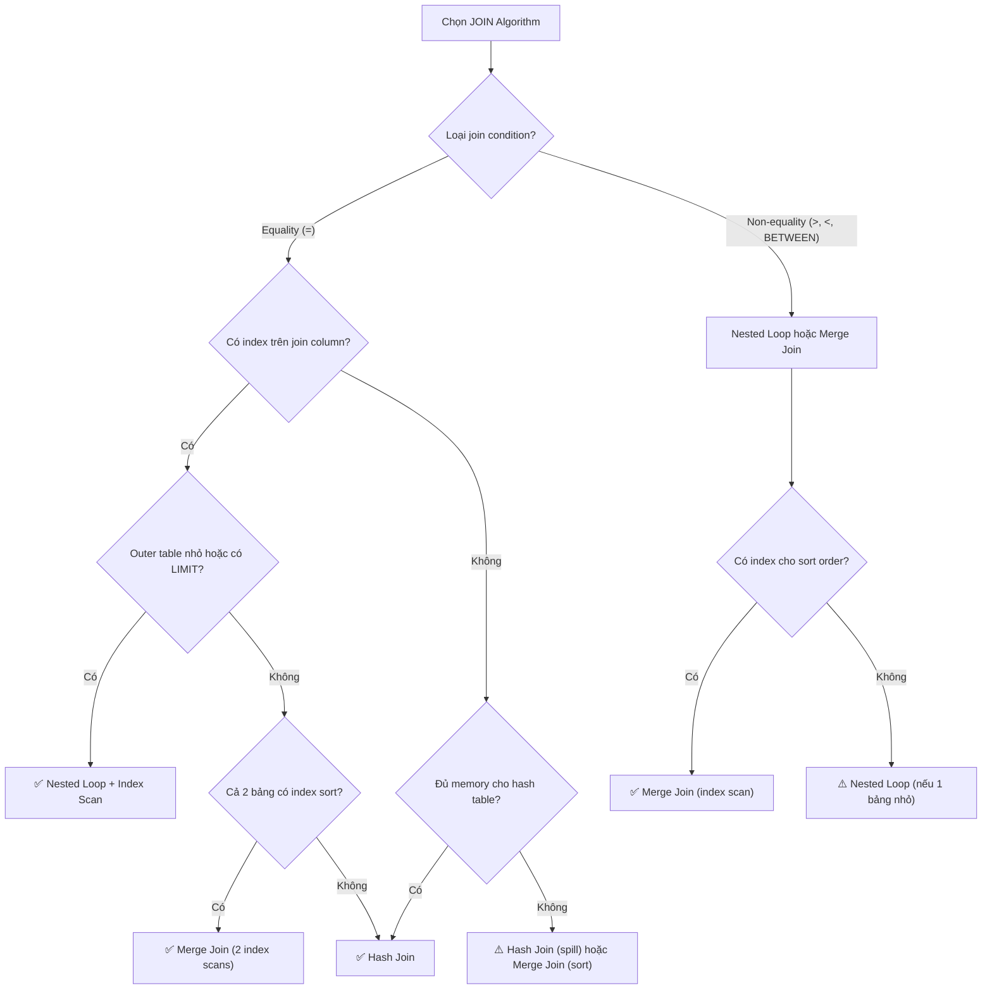

## Mục lục

- [Bối cảnh: Tại sao cần hiểu JOIN algorithms](#1-bối-cảnh-tại-sao-cần-hiểu-join-algorithms)
- [Tổng quan 3 thuật toán JOIN](#2-tổng-quan-3-thuật-toán-join)
- [Nested Loop Join — Chi tiết](#3-nested-loop-join--chi-tiết)
- [Hash Join — Chi tiết](#4-hash-join--chi-tiết)
- [Merge Join — Chi tiết](#5-merge-join--chi-tiết)
- [So sánh hiệu năng 3 thuật toán](#6-so-sánh-hiệu-năng-3-thuật-toán)
- [Optimizer chọn thuật toán như thế nào](#7-optimizer-chọn-thuật-toán-như-thế-nào)
- [EXPLAIN ANALYZE — Đọc JOIN plan thực tế](#8-explain-analyze--đọc-join-plan-thực-tế)
- [Khác biệt giữa MySQL, PostgreSQL, Oracle](#9-khác-biệt-giữa-mysql-postgresql-oracle)
- [Các lỗi thường gặp & Anti-patterns](#10-các-lỗi-thường-gặp--anti-patterns)
- [Ví dụ thực tế — Real-world Scenarios](#11-ví-dụ-thực-tế--real-world-scenarios)
- [Tuning & Best Practices](#12-tuning--best-practices)
- [Tóm tắt — Cheat Sheet](#13-tóm-tắt--cheat-sheet)

---

## 1. Bối cảnh: Tại sao cần hiểu JOIN algorithms

Bạn có 2 bảng: `orders` (50 triệu dòng) và `customers` (1 triệu dòng). Một query JOIN đơn giản:

```sql
SELECT o.id, c.name, o.total
FROM orders o
JOIN customers c ON o.customer_id = c.id
WHERE o.created_at >= '2024-01-01';
```

Tùy thuộc vào **thuật toán JOIN** mà database chọn, query này có thể chạy trong **50ms** hoặc **50 phút**:

```
┌─────────────────────────────────────────────────────────────────────────────────┐
│                    CÙNG MỘT QUERY — KHÁC THUẬT TOÁN                             │
├─────────────────────────────────────────────────────────────────────────────────┤
│                                                                                 │
│   Nested Loop (không có index):  ~50 PHÚT  ❌                                   │
│   ├── Với mỗi order (5M rows 2024), scan toàn bộ customers (1M rows)            │
│   └── Tổng so sánh: 5M × 1M = 5 NGHÌN TỶ phép so sánh                           │
│                                                                                 │
│   Nested Loop (có index trên customers.id):  ~200ms  ✅                         │
│   ├── Với mỗi order, lookup index → O(log n) per row                            │
│   └── Tổng: 5M × log(1M) ≈ 100M phép so sánh                                    │
│                                                                                 │
│   Hash Join:  ~800ms  ✅                                                        │
│   ├── Build hash table từ customers (1M rows) → ~200ms                          │
│   ├── Probe: mỗi order lookup hash table → O(1) per row                         │
│   └── Tổng: 1M (build) + 5M (probe) = 6M operations                             │
│                                                                                 │
│   Merge Join (cả 2 bảng đã sort):  ~500ms  ✅                                   │
│   ├── Merge 2 sorted streams                                                    │
│   └── Tổng: 5M + 1M = 6M operations (single pass)                               │
│                                                                                 │
└─────────────────────────────────────────────────────────────────────────────────┘
```

> **Kết luận:** Hiểu JOIN algorithms giúp bạn:
> 1. Đọc hiểu EXPLAIN plan và biết query đang chạy tối ưu hay chưa
> 2. Tạo index đúng để optimizer chọn thuật toán tốt nhất
> 3. Viết query tránh các anti-pattern khiến DB chọn sai thuật toán

---

## 2. Tổng quan 3 thuật toán JOIN

### Bảng so sánh nhanh

| Thuật toán | Cơ chế | Độ phức tạp | Tốt nhất khi | Yêu cầu |
|------------|--------|-------------|---------------|----------|
| **Nested Loop** | 2 vòng lặp lồng nhau | O(N × M) hoặc O(N × log M) với index | Bảng nhỏ, có index, hoặc LIMIT nhỏ | Index trên join column (khuyến nghị) |
| **Hash Join** | Build hash table + probe | O(N + M) | Bảng lớn, không có index, equality join | Đủ memory cho hash table |
| **Merge Join** | Merge 2 sorted streams | O(N log N + M log M) hoặc O(N + M) nếu đã sort | Dữ liệu đã sort sẵn, range join | Dữ liệu sorted hoặc có index |

### Minh họa trực quan

```
┌─────────────────────────────────────────────────────────────────────────────────┐
│                         3 THUẬT TOÁN JOIN                                       │
├─────────────────────────────────────────────────────────────────────────────────┤
│                                                                                 │
│   1. NESTED LOOP JOIN                                                           │
│   ───────────────────                                                           │
│   Outer table    Inner table                                                    │
│   ┌───┐          ┌───┐                                                          │
│   │ A │────────→ │ 1 │ So sánh A với 1, 2, 3, 4                                 │
│   ├───┤          │ 2 │                                                          │
│   │ B │────────→ │ 3 │ So sánh B với 1, 2, 3, 4                                 │
│   ├───┤          │ 4 │                                                          │
│   │ C │────────→ └───┘ So sánh C với 1, 2, 3, 4                                 │
│   └───┘                                                                         │
│   → Với index: mỗi lookup = O(log n) thay vì O(n)                               │
│                                                                                 │
│   2. HASH JOIN                                                                  │
│   ──────────────                                                                │
│   Build phase:              Probe phase:                                        │
│   Small table → Hash table  Large table → Probe hash                            │
│   ┌───┐      ┌──────────┐   ┌───┐                                               │
│   │ 1 │─────→│ h(1) → 1 │   │ A │──→ h(A.key) → lookup                          │
│   │ 2 │─────→│ h(2) → 2 │   │ B │──→ h(B.key) → lookup                          │
│   │ 3 │─────→│ h(3) → 3 │   │ C │──→ h(C.key) → lookup                          │
│   └───┘      └──────────┘   └───┘                                               │
│   → Mỗi probe = O(1) average                                                    │
│                                                                                 │
│   3. MERGE JOIN                                                                 │
│   ──────────────                                                                │
│   Sorted input 1    Sorted input 2                                              │
│   ┌───┐              ┌───┐                                                      │
│   │ 1 │◄────────────►│ 1 │ Match! → output                                      │
│   │ 2 │              │ 2 │ Match! → output                                      │
│   │ 3 │◄────────────►│ 3 │ Match! → output                                      │
│   │ 5 │              │ 4 │ Advance right (4 < 5)                                │
│   └───┘              │ 5 │ Match! → output                                      │
│                      └───┘                                                      │
│   → Single pass qua cả 2 inputs = O(N + M)                                      │
│                                                                                 │
└─────────────────────────────────────────────────────────────────────────────────┘
```

---

## 3. Nested Loop Join — Chi tiết

### Cơ chế hoạt động

Nested Loop Join là thuật toán đơn giản nhất: với mỗi row từ **outer table** (driving table), duyệt qua **inner table** để tìm row khớp.

```
┌─────────────────────────────────────────────────────────────────────────────────┐
│                    NESTED LOOP JOIN — CƠ CHẾ                                    │
├─────────────────────────────────────────────────────────────────────────────────┤
│                                                                                 │
│   Pseudocode:                                                                   │
│   ┌─────────────────────────────────────────────────────────────────────────┐   │
│   │ for each row r in outer_table:           -- Outer loop                  │   │
│   │     for each row s in inner_table:       -- Inner loop                  │   │
│   │         if r.join_key == s.join_key:     -- Join condition              │   │
│   │             output (r, s)                -- Emit matched pair           │   │
│   └─────────────────────────────────────────────────────────────────────────┘   │
│                                                                                 │
│   Có 3 biến thể:                                                                │
│                                                                                 │
│   ┌──────────────────────┬───────────────────────────────────────────────────┐  │
│   │ Simple Nested Loop   │ Full scan inner table cho mỗi outer row           │  │
│   │                      │ Complexity: O(N × M)                              │  │
│   ├──────────────────────┼───────────────────────────────────────────────────┤  │
│   │ Index Nested Loop    │ Dùng index trên inner table                       │  │
│   │                      │ Complexity: O(N × log M)                          │  │
│   ├──────────────────────┼───────────────────────────────────────────────────┤  │
│   │ Block Nested Loop    │ Buffer nhiều outer rows, scan inner table 1 lần   │  │
│   │ (BNL / BKA)          │ Giảm số lần đọc inner table                       │  │
│   └──────────────────────┴───────────────────────────────────────────────────┘  │
│                                                                                 │
└─────────────────────────────────────────────────────────────────────────────────┘
```

### Simple Nested Loop vs Index Nested Loop

```sql
-- Giả sử: orders (5M rows), customers (1M rows)
-- Query: SELECT * FROM orders o JOIN customers c ON o.customer_id = c.id

-- TRƯỜNG HỢP 1: Không có index trên customers.id
-- → Simple Nested Loop
-- → Với MỖI order row, scan TOÀN BỘ customers table
-- → 5M × 1M = 5,000,000,000,000 comparisons ❌ CHẬM KINH KHỦNG

-- TRƯỜNG HỢP 2: Có index (B-Tree) trên customers.id
-- → Index Nested Loop
-- → Với MỖI order row, lookup index = O(log 1M) ≈ 20 comparisons
-- → 5M × 20 = 100,000,000 comparisons ✅ NHANH HƠN 50,000 LẦN
```

### Block Nested Loop (BNL) — MySQL

MySQL sử dụng **join buffer** để giảm số lần đọc inner table:

```
┌─────────────────────────────────────────────────────────────────────────────────┐
│                    BLOCK NESTED LOOP (MySQL)                                    │
├─────────────────────────────────────────────────────────────────────────────────┤
│                                                                                 │
│   Thay vì: 1 outer row → scan inner table                                       │
│   BNL:     N outer rows → scan inner table 1 lần                                │
│                                                                                 │
│   ┌────────────────────┐                                                        │
│   │    Join Buffer     │                                                        │
│   │  ┌──────────────┐  │     ┌────────────────┐                                 │
│   │  │ outer row 1  │  │     │  Inner table   │                                 │
│   │  │ outer row 2  │──┼────→│  (scan 1 lần)  │                                 │
│   │  │ outer row 3  │  │     │                │                                 │
│   │  │ ...          │  │     │  So sánh từng  │                                 │
│   │  │ outer row N  │  │     │  inner row với │                                 │
│   │  └──────────────┘  │     │  TẤT CẢ rows   │                                 │
│   └────────────────────┘     │  trong buffer  │                                 │
│                              └────────────────┘                                 │
│   join_buffer_size = 256KB (default)                                            │
│   Tăng lên 4-8MB cho JOIN lớn                                                   │
│                                                                                 │
│   Số lần scan inner table = ceil(outer_rows / buffer_capacity)                  │
│                                                                                 │
└─────────────────────────────────────────────────────────────────────────────────┘
```

```sql
-- MySQL: Xem và tune join_buffer_size
SHOW VARIABLES LIKE 'join_buffer_size';

-- Tăng join buffer (session level)
SET SESSION join_buffer_size = 4 * 1024 * 1024;  -- 4MB
```

> **MySQL 8.0.18+:** Block Nested Loop đã được thay thế bằng **Hash Join** cho equality join. BNL chỉ còn dùng cho non-equality join hoặc khi hash join không áp dụng được.

### Khi nào Nested Loop tối ưu?

| Tình huống | Lý do tối ưu |
|------------|-------------|
| Inner table nhỏ (< vài nghìn rows) | Scan nhanh, không cần hash/sort |
| Có index tốt trên inner table join column | Index lookup O(log n) rất nhanh |
| Outer table có ít rows (sau WHERE filter) | Ít iterations → ít lookups |
| Query có `LIMIT` nhỏ | Có thể dừng sớm — không cần xử lý hết |
| Non-equality join (`<`, `>`, `!=`) | Hash Join chỉ hoạt động với `=` |

### EXPLAIN ANALYZE — Nested Loop

```sql
-- PostgreSQL
EXPLAIN ANALYZE
SELECT o.id, c.name, o.total
FROM orders o
JOIN customers c ON o.customer_id = c.id
WHERE o.created_at >= '2024-01-01'
LIMIT 100;
```

```
Limit  (cost=0.87..45.23 rows=100 width=52) (actual time=0.042..0.893 rows=100 loops=1)
  ->  Nested Loop  (cost=0.87..221847.32 rows=500000 width=52) (actual time=0.041..0.881 rows=100 loops=1)
        ->  Index Scan using idx_orders_created on orders o  (cost=0.44..48923.44 rows=500000 width=32)
              (actual time=0.025..0.089 rows=100 loops=1)
              Index Cond: (created_at >= '2024-01-01'::date)
        ->  Index Scan using customers_pkey on customers c  (cost=0.42..0.35 rows=1 width=24)
              (actual time=0.006..0.006 rows=1 loops=100)
              ──────────────────────────────────────────────
              │ loops=100 → chạy 100 lần (1 lần per outer row)
              │ actual time per loop = 0.006ms
              │ Total: 100 × 0.006ms = 0.6ms
              └──────────────────────────────────────────────
              Index Cond: (id = o.customer_id)
Planning Time: 0.321 ms
Execution Time: 0.952 ms
```

**Cách đọc:**
- `Nested Loop` → optimizer chọn nested loop
- Inner scan dùng `customers_pkey` (index scan) → Index Nested Loop
- `loops=100` → inner scan chạy 100 lần (vì outer trả về 100 rows do LIMIT)
- `actual time=0.006..0.006` → mỗi index lookup mất 0.006ms

---

## 4. Hash Join — Chi tiết

### Cơ chế hoạt động

Hash Join gồm 2 giai đoạn: **Build** (xây hash table) và **Probe** (dò tìm).

```
┌─────────────────────────────────────────────────────────────────────────────────┐
│                    HASH JOIN — CƠ CHẾ                                           │
├─────────────────────────────────────────────────────────────────────────────────┤
│                                                                                 │
│   PHASE 1: BUILD                                                                │
│   ─────────────────                                                             │
│   Chọn bảng NHỎ hơn (build input) → xây hash table                              │
│                                                                                 │
│   customers (1M rows)                    Hash Table                             │
│   ┌─────────────────┐                    ┌──────────────────────────┐           │
│   │ id=1, name=An   │──→ h(1) = 0x3A ──→ │ bucket[0x3A] → (1, An)   │           │
│   │ id=2, name=Bình │──→ h(2) = 0x7F ──→ │ bucket[0x7F] → (2, Bình) │           │
│   │ id=3, name=Chi  │──→ h(3) = 0x12 ──→ │ bucket[0x12] → (3, Chi)  │           │
│   │ ...             │                    │ ...                      │           │
│   └─────────────────┘                    └──────────────────────────┘           │
│                                                                                 │
│   PHASE 2: PROBE                                                                │
│   ──────────────────                                                            │
│   Duyệt bảng LỚN (probe input) → hash join key → lookup hash table              │
│                                                                                 │
│   orders (5M rows)                                                              │
│   ┌─────────────────────────┐     ┌───────────────────────────────┐             │
│   │ id=101, customer_id=2   │──→  │h(2) = 0x7F ──→ bucket[0x7F]   │             │
│   │                         │     │ → Found! (2, Bình) → OUTPUT   │             │
│   │ id=102, customer_id=1   │──→  │h(1) = 0x3A ──→ bucket[0x3A]   │             │
│   │                         │     │→ Found! (1, An) → OUTPUT      │             │
│   │ id=103, customer_id=5   │──→  │h(5) = 0x91 ──→ bucket[0x91]   │             │
│   │                         │     │→ Not found → SKIP (inner join)│             │
│   └─────────────────────────┘     └───────────────────────────────┘             │
│                                                                                 │
│   Pseudocode:                                                                   │
│   ┌─────────────────────────────────────────────────────────────────────────┐   │
│   │ -- Build phase                                                          │   │
│   │ hash_table = {}                                                         │   │
│   │ for each row s in build_table:          -- Bảng nhỏ                     │   │
│   │     bucket = hash(s.join_key)                                           │   │
│   │     hash_table[bucket].append(s)                                        │   │
│   │                                                                         │   │
│   │ -- Probe phase                                                          │   │
│   │ for each row r in probe_table:          -- Bảng lớn                     │   │
│   │     bucket = hash(r.join_key)                                           │   │
│   │     for each row s in hash_table[bucket]:                               │   │
│   │         if r.join_key == s.join_key:    -- Verify (handle collision)    │   │
│   │             output (r, s)                                               │   │
│   └─────────────────────────────────────────────────────────────────────────┘   │
│                                                                                 │
│   Complexity: O(N + M) — linear!                                                │
│   Memory:     O(min(N, M)) — hash table cho bảng nhỏ hơn                        │
│                                                                                 │
└─────────────────────────────────────────────────────────────────────────────────┘
```

### Grace Hash Join — Khi hash table không vừa memory

Khi bảng build quá lớn, hash table không vừa `work_mem` (PostgreSQL) hoặc `join_buffer_size` (MySQL). Database dùng **Grace Hash Join** (spill to disk):

```
┌─────────────────────────────────────────────────────────────────────────────────┐
│                    GRACE HASH JOIN (Spill to Disk)                              │
├─────────────────────────────────────────────────────────────────────────────────┤
│                                                                                 │
│   Khi hash table > work_mem:                                                    │
│                                                                                 │
│   1. PARTITION phase:                                                           │
│      Chia cả 2 bảng thành N partitions dùng hash function                       │
│                                                                                 │
│      Build table          Probe table                                           │
│      ┌──────────┐         ┌──────────┐                                          │
│      │ Part 0   │─────────│ Part 0   │  ← Cùng hash range                       │
│      │ Part 1   │─────────│ Part 1   │  ← Cùng hash range                       │
│      │ Part 2   │─────────│ Part 2   │  ← Cùng hash range                       │
│      │ Part 3   │─────────│ Part 3   │  ← Cùng hash range                       │
│      └──────────┘         └──────────┘                                          │
│           │                    │                                                │
│           └── Write to disk ───┘                                                │
│                                                                                 │
│   2. BUILD + PROBE per partition:                                               │
│      Với mỗi partition pair:                                                    │
│      - Build hash table từ build partition (giờ vừa memory)                     │
│      - Probe với probe partition tương ứng                                      │
│                                                                                 │
│   ⚠️ Chậm hơn vì disk I/O, nhưng vẫn O(N + M) comparisons                       │
│                                                                                 │
└─────────────────────────────────────────────────────────────────────────────────┘
```

### Cấu hình memory cho Hash Join

```sql
-- PostgreSQL: work_mem ảnh hưởng trực tiếp đến hash join
SHOW work_mem;               -- Mặc định: 4MB
SET work_mem = '256MB';      -- Tăng cho query lớn (session level)

-- Xem hash join có bị spill to disk không
EXPLAIN (ANALYZE, BUFFERS)
SELECT o.*, c.name
FROM orders o
JOIN customers c ON o.customer_id = c.id;

-- Nếu thấy "Batches: 4" → hash table bị chia 4 partitions (spill to disk)
-- Nếu thấy "Batches: 1" → hash table vừa memory ✅

-- MySQL 8.0.18+: Hash join tự động cho equality join
-- join_buffer_size ảnh hưởng đến hash join performance
SET SESSION join_buffer_size = 256 * 1024 * 1024;  -- 256MB
```

### Khi nào Hash Join tối ưu?

| Tình huống | Lý do tối ưu |
|------------|-------------|
| JOIN 2 bảng lớn (không có index phù hợp) | O(N+M) tốt hơn O(N×M) |
| Equality join (`=`) | Hash function cần exact match |
| Một bảng nhỏ hơn đáng kể (fit memory) | Hash table nhỏ → probe nhanh |
| Không cần kết quả theo thứ tự | Hash Join không bảo toàn order |
| Đủ work_mem | Tránh spill to disk |

### EXPLAIN ANALYZE — Hash Join

```sql
-- PostgreSQL
EXPLAIN ANALYZE
SELECT o.id, c.name, o.total
FROM orders o
JOIN customers c ON o.customer_id = c.id
WHERE o.created_at >= '2024-01-01';
```

```
Hash Join  (cost=27850.00..139742.85 rows=500000 width=52) (actual time=312.45..1842.12 rows=498723 loops=1)
  Hash Cond: (o.customer_id = c.id)
  ->  Seq Scan on orders o  (cost=0.00..98456.00 rows=500000 width=32) (actual time=0.025..876.34 rows=498723 loops=1)
        Filter: (created_at >= '2024-01-01'::date)
        Rows Removed by Filter: 4501277
  ->  Hash  (cost=15406.00..15406.00 rows=1000000 width=24) (actual time=310.22..310.22 rows=1000000 loops=1)
        Buckets: 1048576  Memory Usage: 56789kB
        ─────────────────────────────────────────────────────────
        │ Buckets: 1048576 → hash table có ~1M buckets
        │ Memory Usage: 56789kB ≈ 55MB cho hash table
        │ Batches: 1 → vừa memory, không spill to disk ✅
        └─────────────────────────────────────────────────────────
        ->  Seq Scan on customers c  (cost=0.00..15406.00 rows=1000000 width=24) (actual time=0.012..123.45 rows=1000000 loops=1)
Planning Time: 0.456 ms
Execution Time: 1912.78 ms
```

**Cách đọc:**
- `Hash Join` → optimizer chọn hash join
- `Hash Cond: (o.customer_id = c.id)` → join condition
- Build input = `customers` (bảng nhỏ hơn, 1M rows)
- Probe input = `orders` (bảng lớn hơn, filtered 498K rows)
- `Memory Usage: 56789kB` → hash table chiếm ~55MB
- `Batches: 1` → không cần spill to disk

---

## 5. Merge Join — Chi tiết

### Cơ chế hoạt động

Merge Join (Sort-Merge Join) yêu cầu cả 2 input đã được **sort theo join key**. Sau đó, merge 2 streams theo kiểu merge sort.

```
┌─────────────────────────────────────────────────────────────────────────────────┐
│                    MERGE JOIN — CƠ CHẾ                                          │
├─────────────────────────────────────────────────────────────────────────────────┤
│                                                                                 │
│   Yêu cầu: Cả 2 input PHẢI sorted theo join key                                 │
│                                                                                 │
│   Sorted Input A          Sorted Input B                                        │
│   (orders by customer_id) (customers by id)                                     │
│   ┌─────┐                 ┌─────┐                                               │
│   │  1  │◄───────────────►│  1  │  Match! → Output (1,1)                        │
│   │  1  │◄───────────────►│  1  │  Match! → Output (1,1) (customer_id=1 lặp)    │
│   │  2  │                 │  2  │  Match! → Output (2,2)                        │
│   │  2  │                 │  3  │  Advance A (2 < 3)                            │
│   │  3  │◄───────────────►│  3  │  Match! → Output (3,3)                        │
│   │  5  │                 │  4  │  Advance B (4 < 5)                            │
│   │  5  │◄───────────────►│  5  │  Match! → Output (5,5)                        │
│   └─────┘                 └─────┘                                               │
│                                                                                 │
│   Pseudocode:                                                                   │
│   ┌─────────────────────────────────────────────────────────────────────────┐   │
│   │ -- Cả 2 input đã sort theo join key                                     │   │
│   │ a = next(sorted_input_A)                                                │   │
│   │ b = next(sorted_input_B)                                                │   │
│   │                                                                         │   │
│   │ while a != EOF and b != EOF:                                            │   │
│   │     if a.key == b.key:                                                  │   │
│   │         output (a, b)         -- Emit match                             │   │
│   │         -- Handle duplicates: join tất cả rows cùng key                 │   │
│   │         advance both (or handle group)                                  │   │
│   │     elif a.key < b.key:                                                 │   │
│   │         a = next(sorted_input_A)    -- Advance A                        │   │
│   │     else:                                                               │   │
│   │         b = next(sorted_input_B)    -- Advance B                        │   │
│   └─────────────────────────────────────────────────────────────────────────┘   │
│                                                                                 │
│   Complexity:                                                                   │
│   - Nếu đã sort: O(N + M) — chỉ 1 pass qua mỗi input                            │
│   - Nếu chưa sort: O(N log N + M log M + N + M) — phải sort trước               │
│                                                                                 │
└─────────────────────────────────────────────────────────────────────────────────┘
```

### Nguồn sorted input

Database có thể có sorted input từ nhiều nguồn:

```
┌─────────────────────────────────────────────────────────────────────────────────┐
│                    SORTED INPUT CHO MERGE JOIN                                  │
├─────────────────────────────────────────────────────────────────────────────────┤
│                                                                                 │
│   1. INDEX SCAN (miễn phí sort)                                                 │
│   ─────────────────────────────                                                 │
│   B-Tree index trả dữ liệu THEO THỨ TỰ                                          │
│   → Merge Join không cần sort thêm ✅                                           │
│                                                                                 │
│   2. EXPLICIT SORT                                                              │
│   ─────────────────                                                             │
│   DB sort trong memory (nếu vừa work_mem) hoặc external sort (disk)             │
│   → Tốn thêm O(N log N) nhưng merge vẫn nhanh                                   │
│                                                                                 │
│   3. MATERIALIZE từ subquery đã sort                                            │
│   ──────────────────────────────────                                            │
│   Subquery có ORDER BY → kết quả đã sort sẵn                                    │
│                                                                                 │
│   Optimizer quyết định:                                                         │
│   ┌──────────────────────────────────────────────────────────────────────────┐  │
│   │ IF cả 2 bảng có index trên join key:                                     │  │
│   │   → Merge Join rất rẻ (2 index scans + merge)                            │  │
│   │ ELIF 1 bảng có index, bảng kia nhỏ:                                      │  │
│   │   → Sort bảng nhỏ + index scan bảng lớn + merge                          │  │
│   │ ELSE:                                                                    │  │
│   │   → Sort cả 2 bảng + merge (thường thua Hash Join)                       │  │
│   └──────────────────────────────────────────────────────────────────────────┘  │
│                                                                                 │
└─────────────────────────────────────────────────────────────────────────────────┘
```

### Merge Join với range conditions

Một ưu điểm lớn của Merge Join so với Hash Join: **hỗ trợ non-equality conditions**.

```sql
-- Hash Join KHÔNG hỗ trợ range condition
-- Merge Join CÓ THỂ xử lý:
SELECT *
FROM events e
JOIN time_ranges t ON e.event_time BETWEEN t.start_time AND t.end_time;

-- Merge Join cũng hiệu quả cho:
SELECT *
FROM table_a a
JOIN table_b b ON a.key >= b.key_start AND a.key < b.key_end;
```

### Khi nào Merge Join tối ưu?

| Tình huống | Lý do tối ưu |
|------------|-------------|
| Cả 2 input đã sort (index scan) | Không cần sort thêm → O(N + M) |
| JOIN kết quả cần ORDER BY theo join key | Sort miễn phí — kết quả đã theo thứ tự |
| Non-equality join (`BETWEEN`, `>=`, `<`) | Hash Join không hỗ trợ |
| Dữ liệu rất lớn, không vừa memory | Không cần hash table trong memory |
| Merge với nhiều duplicates (many-to-many) | Xử lý tốt hơn hash join cho high-duplication keys |

### EXPLAIN ANALYZE — Merge Join

```sql
-- PostgreSQL
EXPLAIN ANALYZE
SELECT o.id, c.name, o.total
FROM orders o
JOIN customers c ON o.customer_id = c.id
ORDER BY o.customer_id;
```

```
Merge Join  (cost=0.86..487352.15 rows=5000000 width=52) (actual time=0.031..4521.87 rows=4998723 loops=1)
  Merge Cond: (o.customer_id = c.id)
  ->  Index Scan using idx_orders_customer on orders o  (cost=0.44..362841.44 rows=5000000 width=32)
        (actual time=0.015..2145.23 rows=4998723 loops=1)
  ->  Index Scan using customers_pkey on customers c  (cost=0.42..30408.42 rows=1000000 width=24)
        (actual time=0.012..312.45 rows=999987 loops=1)
Planning Time: 0.289 ms
Execution Time: 4987.12 ms
```

**Cách đọc:**
- `Merge Join` → optimizer chọn merge join
- `Merge Cond: (o.customer_id = c.id)` → join condition
- Cả 2 inputs dùng **Index Scan** → đã sorted sẵn → không cần explicit sort
- Không có node `Sort` → merge miễn phí nhờ B-Tree index

---

## 6. So sánh hiệu năng 3 thuật toán

### Bảng so sánh chi tiết

| Tiêu chí | Nested Loop | Hash Join | Merge Join |
|----------|-------------|-----------|------------|
| **Độ phức tạp (best case)** | O(N × log M) với index | O(N + M) | O(N + M) nếu đã sort |
| **Độ phức tạp (worst case)** | O(N × M) | O(N + M) + disk I/O | O(N log N + M log M) |
| **Memory cần** | Thấp | Cao (hash table) | Trung bình (sort buffer) |
| **Cần index?** | Rất khuyến nghị | Không | Khuyến nghị (tránh sort) |
| **Equality join** | ✅ | ✅ | ✅ |
| **Range join** | ✅ | ❌ | ✅ |
| **Kết quả đã sort?** | ❌ | ❌ | ✅ (theo join key) |
| **Early termination (LIMIT)** | ✅ Rất tốt | ❌ Phải build xong | ⚠️ Có thể tốt |
| **Bảng nhỏ + index** | ⭐⭐⭐⭐⭐ | ⭐⭐⭐ | ⭐⭐⭐ |
| **2 bảng lớn, không index** | ⭐ | ⭐⭐⭐⭐⭐ | ⭐⭐⭐⭐ |
| **Dữ liệu đã sort** | ⭐⭐ | ⭐⭐⭐ | ⭐⭐⭐⭐⭐ |

### Biểu đồ hiệu năng theo kích thước dữ liệu

```
Thời gian
  │
  │                                          ╱ Simple Nested Loop O(N×M)
  │                                        ╱
  │                                      ╱
  │                                    ╱
  │                                  ╱
  │                                ╱
  │                              ╱
  │                           ╱
  │                         ╱            ╱ Merge Join (cần sort) O(N log N)
  │                       ╱            ╱
  │                     ╱           ╱
  │                   ╱          ╱          ╱── Hash Join O(N + M)
  │                 ╱         ╱          ╱
  │               ╱        ╱          ╱
  │             ╱       ╱─ ─ ─ ─ ─ ╱── Index Nested Loop O(N log M)
  │           ╱      ╱── ─ ─ ─ ╱
  │         ╱     ╱─ ─ ─ ─ ╱── Merge Join (đã sort) O(N + M)
  │       ╱    ╱─ ─ ─ ╱
  │     ╱   ╱─ ─ ╱
  │   ╱  ╱─ ╱
  │  ╱╱╱
  └──────────────────────────────────────────────────→ Kích thước dữ liệu
       1K    10K    100K    1M     10M    100M
```

### Ma trận quyết định



---

## 7. Optimizer chọn thuật toán như thế nào

### Cost-Based Optimization

Database optimizer KHÔNG chọn thuật toán JOIN cố định. Thay vào đó, nó **ước tính chi phí** (cost) của mỗi phương án và chọn phương án rẻ nhất.

```
┌─────────────────────────────────────────────────────────────────────────────────┐
│                    OPTIMIZER DECISION PROCESS                                   │
├─────────────────────────────────────────────────────────────────────────────────┤
│                                                                                 │
│   Input: Query + Statistics                                                     │
│                                                                                 │
│   1. Thu thập statistics:                                                       │
│      ┌────────────────────────────────────────────────────────────────────┐     │
│      │ • Số rows mỗi bảng (pg_class.reltuples)                            │     │
│      │ • Số distinct values mỗi cột (pg_stats.n_distinct)                 │     │
│      │ • Histogram phân phối giá trị (pg_stats.histogram_bounds)          │     │
│      │ • Correlation (mức độ sort vật lý) (pg_stats.correlation)          │     │
│      │ • Index availability và selectivity                                │     │
│      └────────────────────────────────────────────────────────────────────┘     │
│                                                                                 │
│   2. Ước tính cost cho mỗi phương án:                                           │
│      ┌──────────────────┬──────────┬──────────┬──────────────────────────┐      │
│      │ Phương án        │ CPU cost │ I/O cost │ Memory cost              │      │
│      ├──────────────────┼──────────┼──────────┼──────────────────────────┤      │
│      │ NL + Index Scan  │   500K   │   200K   │ Thấp                     │      │
│      │ NL + Seq Scan    │   5000M  │   2000M  │ Thấp                     │      │
│      │ Hash Join        │   6M     │   500K   │ 55MB (hash table)        │      │
│      │ Merge Join       │   6M     │   800K   │ 0 (index scan)           │      │
│      │ Merge + Sort     │   60M    │   1500K  │ 128MB (sort buffer)      │      │
│      └──────────────────┴──────────┴──────────┴──────────────────────────┘      │
│                                                                                 │
│   3. Chọn phương án có TỔNG COST thấp nhất                                      │
│                                                                                 │
└─────────────────────────────────────────────────────────────────────────────────┘
```

### Các yếu tố ảnh hưởng đến quyết định

| Yếu tố | Ảnh hưởng |
|---------|----------|
| **Kích thước bảng** (rows estimate) | Bảng nhỏ → NL; bảng lớn → Hash/Merge |
| **Index availability** | Có index → NL hoặc Merge; không → Hash |
| **Join selectivity** | Ít kết quả → NL tốt; nhiều kết quả → Hash/Merge |
| **Memory available** | Đủ memory → Hash; ít memory → NL hoặc Merge |
| **Sort order needed** | Cần ORDER BY theo join key → Merge |
| **LIMIT clause** | LIMIT nhỏ → NL (early termination) |
| **Statistics freshness** | Statistics cũ → optimizer chọn sai! |

### Cập nhật statistics

```sql
-- PostgreSQL: Cập nhật statistics
ANALYZE orders;
ANALYZE customers;

-- Hoặc analyze cả database
ANALYZE;

-- Xem statistics hiện tại
SELECT tablename, n_live_tup, n_dead_tup, last_analyze
FROM pg_stat_user_tables
WHERE tablename IN ('orders', 'customers');

-- MySQL: Cập nhật statistics
ANALYZE TABLE orders;
ANALYZE TABLE customers;

-- Oracle: Cập nhật statistics
EXEC DBMS_STATS.GATHER_TABLE_STATS('SCHEMA_NAME', 'ORDERS');
```

> ⚠️ **Statistics lỗi thời là nguyên nhân #1 khiến optimizer chọn sai JOIN algorithm.** Luôn chạy `ANALYZE` sau bulk INSERT/UPDATE/DELETE.

---

## 8. EXPLAIN ANALYZE — Đọc JOIN plan thực tế

### PostgreSQL — Đọc JOIN plan chi tiết

```sql
-- EXPLAIN cơ bản
EXPLAIN SELECT ...;

-- EXPLAIN ANALYZE (thực thi query, hiển thị actual time)
EXPLAIN ANALYZE SELECT ...;

-- EXPLAIN đầy đủ nhất (bao gồm buffers, I/O)
EXPLAIN (ANALYZE, BUFFERS, FORMAT TEXT) SELECT ...;
```

### Các keyword quan trọng trong EXPLAIN

| Keyword | Ý nghĩa | Loại JOIN |
|---------|---------|-----------|
| `Nested Loop` | Nested loop join | NL |
| `Hash Join` | Hash join | Hash |
| `Merge Join` | Merge join (sort-merge) | Merge |
| `Hash Cond` | Điều kiện hash join | Hash |
| `Merge Cond` | Điều kiện merge join | Merge |
| `Join Filter` | Điều kiện filter sau join | Tất cả |
| `Index Scan` | Đọc qua index | NL/Merge |
| `Seq Scan` | Full table scan | Hash/NL |
| `Sort` | Phải sort trước merge | Merge |
| `Hash` / `Buckets` / `Batches` | Hash table info | Hash |
| `loops=N` | Inner scan chạy N lần | NL |
| `Memory Usage` | Bộ nhớ hash table dùng | Hash |

### MySQL — Đọc JOIN plan

```sql
-- MySQL EXPLAIN
EXPLAIN SELECT o.id, c.name
FROM orders o
JOIN customers c ON o.customer_id = c.id
WHERE o.created_at >= '2024-01-01';

-- MySQL 8.0+: EXPLAIN FORMAT=TREE (dễ đọc hơn)
EXPLAIN FORMAT=TREE SELECT o.id, c.name
FROM orders o
JOIN customers c ON o.customer_id = c.id
WHERE o.created_at >= '2024-01-01';
```

```
-> Nested loop inner join  (cost=45632.10 rows=500000)
    -> Index range scan on o using idx_orders_created  (cost=22816.05 rows=500000)
    -> Single-row index lookup on c using PRIMARY (id=o.customer_id)  (cost=0.25 rows=1)
```

```sql
-- MySQL 8.0+: EXPLAIN ANALYZE (thực thi query)
EXPLAIN ANALYZE SELECT o.id, c.name
FROM orders o
JOIN customers c ON o.customer_id = c.id
WHERE o.created_at >= '2024-01-01';
```

```
-> Nested loop inner join  (cost=45632.10 rows=500000) (actual time=0.089..2341.56 rows=498723 loops=1)
    -> Index range scan on o using idx_orders_created  (cost=22816.05 rows=500000)
       (actual time=0.067..1234.56 rows=498723 loops=1)
    -> Single-row index lookup on c using PRIMARY (id=o.customer_id)  (cost=0.25 rows=1)
       (actual time=0.002..0.002 rows=1 loops=498723)
```

---

## 9. Khác biệt giữa MySQL, PostgreSQL, Oracle

### Bảng so sánh hỗ trợ JOIN algorithms

| Tính năng | MySQL 8.0+ | PostgreSQL | Oracle |
|-----------|------------|------------|--------|
| **Nested Loop Join** | ✅ | ✅ | ✅ |
| **Hash Join** | ✅ (từ 8.0.18) | ✅ | ✅ |
| **Merge Join (Sort-Merge)** | ❌ Không hỗ trợ | ✅ | ✅ (Sort-Merge Join) |
| **Block Nested Loop** | ✅ (legacy, trước 8.0.18) | ❌ | ❌ |
| **Batched Key Access (BKA)** | ✅ | ❌ | ❌ |
| **Parallel Hash Join** | ❌ | ✅ (từ PG 11) | ✅ |
| **Adaptive Join** | ❌ | ❌ | ✅ (12c+) |
| **Hint để force algorithm** | ✅ (limited) | ✅ (enable/disable) | ✅ (USE_NL, USE_HASH, USE_MERGE) |

### MySQL — Đặc thù

```sql
-- MySQL CHỈ hỗ trợ Nested Loop và Hash Join (từ 8.0.18)
-- KHÔNG có Merge Join

-- MySQL tự động chọn Hash Join cho equi-join không có index
-- Ví dụ: 2 bảng JOIN ON a.col = b.col, cả 2 không có index trên col
-- → MySQL 8.0.18+ dùng Hash Join (trước đó dùng Block Nested Loop)

-- Force sử dụng index (gián tiếp ép Nested Loop)
SELECT /*+ JOIN_ORDER(c, o) */ o.id, c.name
FROM orders o
JOIN customers c ON o.customer_id = c.id;

-- Tắt hash join (force nested loop)
SET optimizer_switch = 'hash_join=off';

-- MySQL 8.0.20+: Hash Join cũng hỗ trợ LEFT/RIGHT JOIN
```

### PostgreSQL — Đặc thù

```sql
-- PostgreSQL hỗ trợ cả 3 thuật toán
-- Optimizer tự chọn dựa trên cost estimation

-- Disable từng thuật toán để test performance
SET enable_nestloop = off;     -- Tắt nested loop
SET enable_hashjoin = off;     -- Tắt hash join
SET enable_mergejoin = off;    -- Tắt merge join

-- Ví dụ: Force hash join
SET enable_nestloop = off;
SET enable_mergejoin = off;
EXPLAIN ANALYZE SELECT ...;

-- Nhớ bật lại sau khi test!
RESET enable_nestloop;
RESET enable_hashjoin;
RESET enable_mergejoin;

-- PostgreSQL parallel hash join (PG 11+)
SET max_parallel_workers_per_gather = 4;
-- Optimizer có thể chọn Parallel Hash Join cho bảng lớn
```

### Oracle — Đặc thù

```sql
-- Oracle hỗ trợ cả 3 + Adaptive Join (12c+)

-- Dùng hint để force thuật toán
SELECT /*+ USE_NL(o c) */ o.id, c.name       -- Force Nested Loop
FROM orders o JOIN customers c ON o.customer_id = c.id;

SELECT /*+ USE_HASH(o c) */ o.id, c.name     -- Force Hash Join
FROM orders o JOIN customers c ON o.customer_id = c.id;

SELECT /*+ USE_MERGE(o c) */ o.id, c.name    -- Force Sort-Merge Join
FROM orders o JOIN customers c ON o.customer_id = c.id;

-- Oracle Adaptive Join (12c+):
-- Optimizer chọn NL hoặc Hash tại runtime dựa trên actual cardinality
-- → Tránh chọn sai do statistics không chính xác
```

---

## 10. Các lỗi thường gặp & Anti-patterns

### Lỗi 1: Thiếu index trên join column

```sql
-- ❌ CHẬM: Không có index trên orders.customer_id
-- → Optimizer phải chọn Hash Join hoặc Simple Nested Loop (catastrophic)
SELECT * FROM orders o
JOIN customers c ON o.customer_id = c.id;

-- ✅ NHANH: Tạo index
CREATE INDEX idx_orders_customer_id ON orders(customer_id);
-- → Optimizer chọn Index Nested Loop → nhanh hơn đáng kể
```

### Lỗi 2: JOIN quá nhiều bảng

```sql
-- ❌ JOIN 8 bảng → optimizer phải đánh giá hàng nghìn phương án join order
SELECT *
FROM orders o
JOIN customers c ON o.customer_id = c.id
JOIN products p ON o.product_id = p.id
JOIN categories cat ON p.category_id = cat.id
JOIN warehouses w ON o.warehouse_id = w.id
JOIN shipping s ON o.shipping_id = s.id
JOIN payments pay ON o.payment_id = pay.id
JOIN coupons cp ON o.coupon_id = cp.id;
-- Số phương án join order: 8! = 40,320 → optimizer mất thời gian planning

-- ✅ TỐI ƯU: Chia thành subquery hoặc CTE nếu không cần tất cả
WITH recent_orders AS (
    SELECT o.*, c.name as customer_name
    FROM orders o
    JOIN customers c ON o.customer_id = c.id
    WHERE o.created_at >= '2024-01-01'
)
SELECT ro.*, p.product_name
FROM recent_orders ro
JOIN products p ON ro.product_id = p.id;
```

### Lỗi 3: Function trên join column

```sql
-- ❌ Function trên join column → không dùng được index → Hash/NL chậm
SELECT *
FROM orders o
JOIN customers c ON LOWER(o.customer_email) = LOWER(c.email);

-- ✅ Tạo expression index hoặc lưu normalized value
CREATE INDEX idx_orders_email_lower ON orders(LOWER(customer_email));
CREATE INDEX idx_customers_email_lower ON customers(LOWER(email));
```

### Lỗi 4: Implicit type conversion

```sql
-- ❌ customer_id là INT trong orders, nhưng VARCHAR trong customers
-- → Database phải convert, không dùng được index
SELECT * FROM orders o
JOIN customers c ON o.customer_id = CAST(c.id AS INT);

-- ✅ Đảm bảo data type khớp nhau
-- Sửa schema hoặc dùng consistent types
```

### Lỗi 5: Cartesian product vô tình

```sql
-- ❌ Thiếu ON condition → Cartesian Product → N × M rows
SELECT * FROM orders, customers;
-- 5M × 1M = 5 NGHÌN TỶ rows!

-- ❌ Điều kiện WHERE thay vì ON (có thể tạo Cartesian trước khi filter)
SELECT * FROM orders o, customers c
WHERE o.customer_id = c.id;

-- ✅ Luôn dùng explicit JOIN syntax
SELECT * FROM orders o
JOIN customers c ON o.customer_id = c.id;
```

### Lỗi 6: Statistics lỗi thời

```sql
-- ❌ Sau khi bulk insert 1M rows, không chạy ANALYZE
-- → Optimizer nghĩ bảng vẫn nhỏ → chọn Nested Loop thay vì Hash Join
COPY orders FROM '/data/new_orders.csv';
-- Quên ANALYZE!

-- ✅ Luôn ANALYZE sau bulk operations
COPY orders FROM '/data/new_orders.csv';
ANALYZE orders;
```

### Bảng tổng hợp anti-patterns

| Anti-pattern | Hậu quả | Cách fix |
|-------------|---------|----------|
| Thiếu index trên join column | NL chậm, Hash thay vì Index NL | `CREATE INDEX` trên join columns |
| Function trên join column | Index không dùng được | Expression index hoặc stored column |
| Type mismatch | Implicit cast, mất index | Đảm bảo cùng data type |
| JOIN quá nhiều bảng (>6) | Planning chậm, plan kém | Chia query, dùng CTE |
| Statistics cũ | Optimizer chọn sai algorithm | `ANALYZE` định kỳ |
| SELECT * trong JOIN | Quá nhiều data transfer | Chỉ SELECT cột cần thiết |
| Cartesian product | N × M explosion | Luôn có ON condition |

---

## 11. Ví dụ thực tế — Real-world Scenarios

### Ví dụ 1: E-Commerce — Dashboard đơn hàng

```sql
-- Scenario: Hiển thị 20 đơn hàng mới nhất với thông tin customer
-- orders: 50M rows, customers: 1M rows

-- Query:
SELECT o.id, o.order_date, o.total, o.status,
       c.name, c.email
FROM orders o
JOIN customers c ON o.customer_id = c.id
WHERE o.status = 'pending'
ORDER BY o.created_at DESC
LIMIT 20;

-- Optimizer chọn: Nested Loop + Index Scan
-- Lý do:
-- 1. LIMIT 20 → chỉ cần 20 rows → NL dừng sớm
-- 2. Index trên orders(status, created_at DESC) → lấy 20 pending mới nhất
-- 3. Index trên customers(id) → lookup nhanh per order

-- Index cần thiết:
CREATE INDEX idx_orders_status_created ON orders(status, created_at DESC);
-- customers.id đã có PK index
```

### Ví dụ 2: Reporting — Doanh thu theo khu vực

```sql
-- Scenario: Report doanh thu tháng này, group by region
-- orders: 50M rows, customers: 1M rows, regions: 50 rows

SELECT r.name as region, 
       COUNT(*) as order_count,
       SUM(o.total) as revenue
FROM orders o
JOIN customers c ON o.customer_id = c.id
JOIN regions r ON c.region_id = r.id
WHERE o.created_at >= DATE_TRUNC('month', CURRENT_DATE)
GROUP BY r.name
ORDER BY revenue DESC;

-- Optimizer chọn:
-- 1. Hash Join (orders ⋈ customers) → bảng lớn, nhiều kết quả
-- 2. Nested Loop (kết quả ⋈ regions) → regions chỉ 50 rows

-- Plan:
-- Sort (ORDER BY revenue DESC)
--   → HashAggregate (GROUP BY r.name)
--     → Nested Loop (join với regions — 50 rows)
--       → Hash Join (orders ⋈ customers)
--         → Seq Scan on orders (filter by created_at)
--         → Hash (build từ customers)
```

### Ví dụ 3: Analytics — Time-series JOIN

```sql
-- Scenario: JOIN events với time windows
-- events: 100M rows, time_windows: 365 rows (1 per day)

SELECT tw.window_date, COUNT(*) as event_count, AVG(e.duration) as avg_duration
FROM events e
JOIN time_windows tw 
  ON e.event_time >= tw.start_time 
  AND e.event_time < tw.end_time
WHERE tw.window_date >= '2024-01-01'
GROUP BY tw.window_date
ORDER BY tw.window_date;

-- Optimizer chọn: Merge Join hoặc Nested Loop
-- Lý do: Range condition (>=, <) → Hash Join KHÔNG áp dụng được
-- Nếu events có index trên event_time → Merge Join (cả 2 sorted)
-- Nếu time_windows nhỏ (365 rows) → Nested Loop cũng hiệu quả

-- Index tối ưu:
CREATE INDEX idx_events_time ON events(event_time);
```

---

## 12. Tuning & Best Practices

### Checklist tối ưu JOIN

```
┌─────────────────────────────────────────────────────────────────────────────────┐
│                    JOIN OPTIMIZATION CHECKLIST                                  │
├─────────────────────────────────────────────────────────────────────────────────┤
│                                                                                 │
│   □ 1. INDEX                                                                    │
│     ├── Tạo index trên TẤT CẢ join columns (cả 2 phía)                          │
│     ├── Join column trong inner table (NL) là quan trọng nhất                   │
│     └── Composite index nếu WHERE + JOIN dùng nhiều cột                         │
│                                                                                 │
│   □ 2. STATISTICS                                                               │
│     ├── Chạy ANALYZE sau bulk data changes                                      │
│     ├── Cấu hình AUTOVACUUM/auto analyze (PostgreSQL)                           │
│     └── Kiểm tra statistics: pg_stats, SHOW TABLE STATUS                        │
│                                                                                 │
│   □ 3. MEMORY                                                                   │
│     ├── PostgreSQL: tune work_mem (256MB–1GB cho reporting)                     │
│     ├── MySQL: tune join_buffer_size (4–256MB)                                  │
│     └── Oracle: tune PGA_AGGREGATE_TARGET                                       │
│                                                                                 │
│   □ 4. QUERY                                                                    │
│     ├── Chỉ SELECT cột cần thiết (tránh SELECT *)                               │
│     ├── Filter sớm (WHERE trước JOIN nếu có thể)                                │
│     ├── Dùng LIMIT khi chỉ cần N rows đầu                                       │
│     └── Tránh function trên join columns                                        │
│                                                                                 │
│   □ 5. EXPLAIN                                                                  │
│     ├── Luôn EXPLAIN ANALYZE trước khi deploy                                   │
│     ├── Kiểm tra actual rows vs estimated rows                                  │
│     ├── Kiểm tra loops count cho Nested Loop                                    │
│     └── Kiểm tra Batches cho Hash Join (1 = tốt)                                │
│                                                                                 │
└─────────────────────────────────────────────────────────────────────────────────┘
```

### Cấu hình memory theo workload

| Workload | PostgreSQL `work_mem` | MySQL `join_buffer_size` | Ghi chú |
|----------|----------------------|--------------------------|---------|
| OLTP (nhiều query nhỏ) | 4–16MB | 256KB–4MB | Nhỏ vì nhiều connection đồng thời |
| Reporting (ít query lớn) | 256MB–1GB | 64–256MB | Lớn cho hash join/sort |
| Analytics (batch) | 1–4GB | 256MB–1GB | Rất lớn, ít connections |
| Mixed | 32–64MB | 4–32MB | Cân bằng |

```sql
-- PostgreSQL: Set work_mem per query (không ảnh hưởng session khác)
SET LOCAL work_mem = '512MB';
SELECT ... complex JOIN ...;
RESET work_mem;

-- MySQL: Set per session
SET SESSION join_buffer_size = 67108864;  -- 64MB
SELECT ... complex JOIN ...;
SET SESSION join_buffer_size = DEFAULT;
```

### Kỹ thuật nâng cao

#### 1. Materialized View cho JOIN phức tạp

```sql
-- PostgreSQL: Cache kết quả JOIN phức tạp
CREATE MATERIALIZED VIEW mv_order_summary AS
SELECT o.id, o.order_date, o.total, o.status,
       c.name, c.email, c.region_id,
       r.name as region_name
FROM orders o
JOIN customers c ON o.customer_id = c.id
JOIN regions r ON c.region_id = r.id;

-- Tạo index trên materialized view
CREATE INDEX idx_mv_region ON mv_order_summary(region_name);
CREATE INDEX idx_mv_date ON mv_order_summary(order_date);

-- Refresh khi cần
REFRESH MATERIALIZED VIEW CONCURRENTLY mv_order_summary;
```

#### 2. Partitioning + JOIN

```sql
-- Partition-wise join (PostgreSQL 11+, Oracle)
-- Nếu cả 2 bảng partitioned theo cùng key → JOIN từng partition pair
SET enable_partitionwise_join = on;

-- Ví dụ: orders partitioned by date, order_items partitioned by date
-- → PostgreSQL JOIN từng partition pair song song
```

---

## 13. Tóm tắt — Cheat Sheet

### Chọn nhanh thuật toán

| Tình huống | Thuật toán tốt nhất | Lý do |
|------------|---------------------|-------|
| Bảng nhỏ JOIN bảng lớn (có index) | **Nested Loop** | Index lookup O(log n) per row |
| Query có `LIMIT` nhỏ | **Nested Loop** | Dừng sớm, không cần xử lý hết |
| 2 bảng lớn, equality join | **Hash Join** | O(N + M), không cần index |
| Dữ liệu đã sort (có index B-Tree) | **Merge Join** | O(N + M), miễn phí sort |
| Non-equality join (BETWEEN, >, <) | **Merge Join** hoặc **Nested Loop** | Hash Join không hỗ trợ |
| Kết quả cần ORDER BY join key | **Merge Join** | Output đã sorted sẵn |

### Công thức nhớ nhanh

```
┌─────────────────────────────────────────────────────────────────────────────────┐
│                                                                                 │
│   🔄 Nested Loop = "Tra từ điển"                                                │
│      Với MỖI từ cần tra (outer), mở từ điển tìm (inner)                         │
│      → Nhanh nếu từ điển có MỤC LỤC (index)                                     │
│      → Chậm nếu phải lật từng trang                                             │
│                                                                                 │
│   #️⃣ Hash Join = "Bảng phân loại"                                               │
│      Bước 1: Phân loại items nhỏ vào các ngăn (build hash table)                │
│      Bước 2: Với mỗi item lớn, xem ngăn tương ứng (probe)                       │
│      → Nhanh cho equality, cần memory                                           │
│                                                                                 │
│   ↕️ Merge Join = "Merge 2 danh sách đã sort"                                   │
│      Cả 2 danh sách đã sắp xếp → duyệt song song                                │
│      → Nhanh nhất nếu đã sort, hỗ trợ range                                     │
│                                                                                 │
└─────────────────────────────────────────────────────────────────────────────────┘
```

### Nguyên tắc vàng

> 1. **Index trên join columns** — giảm Nested Loop từ O(N×M) xuống O(N×log M)
> 2. **ANALYZE thường xuyên** — giúp optimizer chọn đúng thuật toán
> 3. **EXPLAIN trước khi deploy** — luôn kiểm tra plan trước khi đưa lên production
> 4. **Tune work_mem/join_buffer_size** — đủ memory cho Hash Join tránh spill to disk
> 5. **Filter sớm, SELECT ít** — giảm data volume trước khi JOIN
