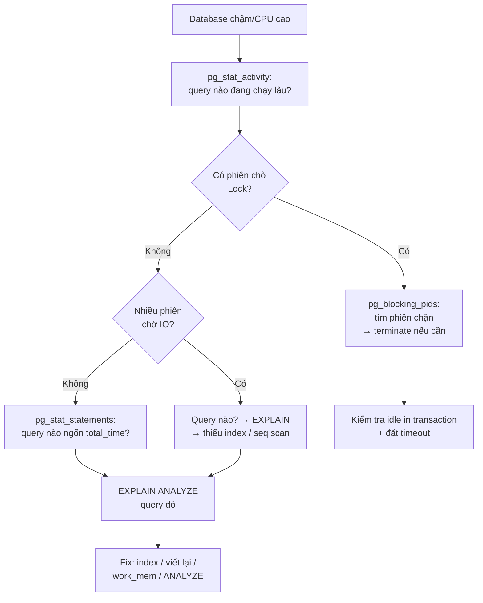

# Monitoring & Slow Query — Deep Dive

## Mục lục

- [Bối cảnh: 3 giờ sáng, database 100% CPU](#1-bối-cảnh-3-giờ-sáng-database-100-cpu)
- [Triết lý monitoring: đo cái gì và tại sao](#2-triết-lý-monitoring-đo-cái-gì-và-tại-sao)
- [pg_stat_statements — Vũ khí số một của Postgres](#3-pg_stat_statements--vũ-khí-số-một-của-postgres)
- [Slow Query Log — Bắt query chậm khi xảy ra](#4-slow-query-log--bắt-query-chậm-khi-xảy-ra)
- [Active Session Monitoring — Đang xảy ra gì ngay bây giờ](#5-active-session-monitoring--đang-xảy-ra-gì-ngay-bây-giờ)
- [Wait Events — Query đang chờ cái gì](#6-wait-events--query-đang-chờ-cái-gì)
- [Lock Monitoring — Ai chặn ai](#7-lock-monitoring--ai-chặn-ai)
- [Cache Hit Ratio & I/O Statistics](#8-cache-hit-ratio--io-statistics)
- [Index Health — Index thừa, thiếu, không dùng](#9-index-health--index-thừa-thiếu-không-dùng)
- [MySQL — performance_schema & sys schema](#10-mysql--performance_schema--sys-schema)
- [Bốn tín hiệu vàng & Metrics cần alert](#11-bốn-tín-hiệu-vàng--metrics-cần-alert)
- [Quy trình điều tra sự cố — Runbook](#12-quy-trình-điều-tra-sự-cố--runbook)
- [Công cụ & Dashboard](#13-công-cụ--dashboard)
- [Anti-patterns & Best Practices](#14-anti-patterns--best-practices)
- [Tóm tắt — Cheat sheet](#15-tóm-tắt--cheat-sheet)

---

## 1. Bối cảnh: 3 giờ sáng, database 100% CPU

Điện thoại reo. Alert: API p99 latency vọt lên 8 giây, database CPU 100%. Bạn mở laptop. Có hai kiểu kỹ sư:

- **Kiểu 1**: SSH vào server, chạy `top`, thấy CPU cao, restart database, cầu nguyện. Sự cố lặp lại tuần sau.
- **Kiểu 2**: Mở dashboard, chạy vài query monitoring, trong 2 phút xác định *chính xác* query nào đang ngốn tài nguyên, vì sao, và fix đúng gốc.

Sự khác biệt không phải tài năng — mà là **có công cụ và biết đọc số liệu**. Bạn không thể tối ưu cái bạn không đo được.

> [!IMPORTANT]
> `EXPLAIN` cho bạn biết **một** query chạy thế nào. Monitoring cho biết **query nào đáng để EXPLAIN**. Trong production với hàng nghìn query/giây, việc khó nhất không phải tối ưu một query — mà là **tìm ra query nào cần tối ưu**. Đó là vai trò của monitoring.

Doc này trang bị cho bạn:

1. Các **công cụ** thu thập số liệu (pg_stat_statements, slow log, performance_schema).
2. Cách **đọc** số liệu để tìm thủ phạm.
3. Cách quan sát **những gì đang xảy ra ngay bây giờ** (active session, lock, wait).
4. Một **runbook** để điều tra sự cố có phương pháp.

---

## 2. Triết lý monitoring: đo cái gì và tại sao

Có hai loại monitoring, cần cả hai:

```
╭─────────────────────────╮        ╭─────────────────────────╮
│  RETROSPECTIVE          │        │  REAL-TIME              │
│  (nhìn lại lịch sử)     │        │  (đang xảy ra gì)       │
│                         │        │                         │
│  pg_stat_statements     │        │  pg_stat_activity       │
│  slow query log         │        │  lock / wait events     │
│  → query nào tốn nhất   │        │  → điều tra sự cố sống  │
│    theo thời gian?      │        │    đang diễn ra         │
╰─────────────────────────╯        ╰─────────────────────────╯
```

- **Retrospective**: "Trong 24h qua, query nào ngốn tổng thời gian nhiều nhất?" → tối ưu có chủ đích.
- **Real-time**: "Ngay lúc này, cái gì đang chặn hệ thống?" → dập lửa.

> [!TIP]
> Sai lầm phổ biến: chỉ tối ưu query **chậm nhất một lần**. Query chạy 5 giây nhưng ngày 2 lần (10s/ngày) ít quan trọng hơn query chạy 50ms nhưng 1 triệu lần/ngày (50.000s/ngày). Luôn ưu tiên theo **tổng thời gian = latency × tần suất**.

---

## 3. pg_stat_statements — Vũ khí số một của Postgres

Extension này ghi lại thống kê tích lũy của **mọi** query đã chạy — công cụ retrospective quan trọng nhất.

### 3.1. Cài đặt

```sql
-- postgresql.conf
shared_preload_libraries = 'pg_stat_statements'   -- cần restart

-- Rồi trong database:
CREATE EXTENSION pg_stat_statements;
```

### 3.2. Top query theo TỔNG thời gian (quan trọng nhất)

```sql
SELECT
    substring(query, 1, 60) AS query,
    calls,
    round(total_exec_time::numeric, 0) AS total_ms,
    round(mean_exec_time::numeric, 2) AS mean_ms,
    round((100 * total_exec_time / sum(total_exec_time) OVER ())::numeric, 1) AS pct
FROM pg_stat_statements
ORDER BY total_exec_time DESC
LIMIT 10;
```

```text
 query                          | calls    | total_ms  | mean_ms | pct
────────────────────────────────┼──────────┼───────────┼─────────┼──────
 SELECT * FROM orders WHERE ... | 8500000  | 4250000   | 0.50    | 42.1  ← thủ phạm thật
 SELECT ... JOIN customers ...  | 1200     | 1980000   | 1650.00 | 19.6
 UPDATE inventory SET ...       | 450000   | 890000    | 1.98    | 8.8
```

> [!IMPORTANT]
> Query đầu tiên chỉ mất **0.5ms/lần** — nhìn riêng lẻ có vẻ nhanh. Nhưng nó chạy **8,5 triệu lần**, chiếm **42% tổng thời gian** toàn database. Đây mới là thứ cần tối ưu trước, không phải query 1650ms chạy 1200 lần. Đây là lý do **luôn sắp theo `total_exec_time`**, không phải `mean_exec_time`.

### 3.3. Các góc nhìn khác

```sql
-- Query chậm nhất trung bình (ứng viên cần index/viết lại)
SELECT substring(query,1,60), calls, round(mean_exec_time::numeric,1) AS mean_ms
FROM pg_stat_statements
WHERE calls > 50
ORDER BY mean_exec_time DESC LIMIT 10;

-- Query đọc đĩa nhiều nhất (I/O bound)
SELECT substring(query,1,60), shared_blks_read, shared_blks_hit
FROM pg_stat_statements
ORDER BY shared_blks_read DESC LIMIT 10;

-- Query biến động nhất (stddev cao = plan không ổn định)
SELECT substring(query,1,60), calls, round(stddev_exec_time::numeric,1) AS stddev_ms
FROM pg_stat_statements
ORDER BY stddev_exec_time DESC LIMIT 10;
```

### 3.4. Cache hit ratio theo query

```sql
SELECT
    substring(query,1,50) AS query,
    shared_blks_hit,
    shared_blks_read,
    round(100.0 * shared_blks_hit /
          nullif(shared_blks_hit + shared_blks_read, 0), 1) AS hit_pct
FROM pg_stat_statements
ORDER BY shared_blks_read DESC LIMIT 10;
```

`hit_pct` thấp (< 90%) → query đọc nhiều từ đĩa → ứng viên cho index hoặc tăng cache.

> [!TIP]
> `pg_stat_statements` **gộp** các query giống nhau về cấu trúc (thay literal bằng `$1`). Nhờ đó `WHERE id = 1` và `WHERE id = 2` được đếm chung — chính xác điều bạn muốn để thấy tổng tải. Reset thống kê bằng `SELECT pg_stat_statements_reset();` sau khi deploy để đo sạch.

---

## 4. Slow Query Log — Bắt query chậm khi xảy ra

Slow log ghi ra file mọi query vượt ngưỡng thời gian — bổ sung cho pg_stat_statements (ghi cả tham số thật).

### 4.1. PostgreSQL

```sql
-- Ghi mọi query chạy > 1 giây
ALTER SYSTEM SET log_min_duration_statement = 1000;   -- ms
SELECT pg_reload_conf();

-- Ghi kèm thông tin phiên
ALTER SYSTEM SET log_line_prefix = '%t [%p] %u@%d ';
```

```text
2026-07-03 03:14:22 [8412] app@prod LOG:  duration: 8241.5 ms
    statement: SELECT * FROM orders o JOIN customers c ...
```

### 4.2. auto_explain — plan của query chậm tự động vào log

```sql
-- postgresql.conf
session_preload_libraries = 'auto_explain'
auto_explain.log_min_duration = 1000   -- ms
auto_explain.log_analyze = true
auto_explain.log_buffers = true
```

Khi query chạy > 1s, **plan EXPLAIN ANALYZE** của nó tự động vào log — không cần chạy lại thủ công. Cực kỳ hữu ích cho query chậm không tái hiện được.

### 4.3. MySQL slow query log

```sql
SET GLOBAL slow_query_log = 'ON';
SET GLOBAL long_query_time = 1;             -- giây
SET GLOBAL log_queries_not_using_indexes = 'ON';
```

Phân tích bằng `pt-query-digest` (Percona Toolkit) hoặc `mysqldumpslow`:

```bash
pt-query-digest /var/log/mysql/slow.log
```

> [!WARNING]
> `log_min_duration_statement = 0` (Postgres) hoặc `long_query_time = 0` (MySQL) ghi **MỌI** query — có thể làm ngập đĩa và tự nó trở thành nút thắt I/O trên hệ thống tải cao. Đặt ngưỡng hợp lý (500ms–1s) trong production.

---

## 5. Active Session Monitoring — Đang xảy ra gì ngay bây giờ

Khi sự cố **đang diễn ra**, `pg_stat_activity` cho biết mọi phiên đang làm gì.

### 5.1. Query đang chạy lâu nhất

```sql
SELECT
    pid,
    now() - query_start AS duration,
    state,
    wait_event_type,
    wait_event,
    substring(query, 1, 60) AS query
FROM pg_stat_activity
WHERE state != 'idle'
ORDER BY duration DESC;
```

```text
 pid  | duration        | state  | wait_event_type | wait_event | query
──────┼─────────────────┼────────┼─────────────────┼────────────┼──────────
 8412 | 00:03:42        | active | Lock            | tuple      | UPDATE ...  ← chạy 3 phút, đang chờ lock!
 8420 | 00:00:08        | active | IO              | DataFileRead| SELECT ...
```

### 5.2. Giết query lỗi

```sql
-- Hủy nhẹ nhàng (cho query đang chạy)
SELECT pg_cancel_backend(8412);

-- Giết kết nối (mạnh tay hơn)
SELECT pg_terminate_backend(8412);
```

### 5.3. Idle in transaction — kẻ giết ngầm

```sql
-- Phiên mở transaction rồi bỏ đó (giữ lock, chặn vacuum)
SELECT pid, now() - state_change AS idle_duration, query
FROM pg_stat_activity
WHERE state = 'idle in transaction'
ORDER BY idle_duration DESC;
```

> [!IMPORTANT]
> `idle in transaction` lâu là một trong những vấn đề nguy hiểm nhất: nó giữ lock, chặn VACUUM dọn dead tuple (gây bloat), và có thể dẫn tới cạn kiệt kết nối. Đặt `idle_in_transaction_session_timeout` để tự động giết những phiên này.

---

## 6. Wait Events — Query đang chờ cái gì

Query chậm không phải lúc nào cũng vì "tính toán nhiều". Thường nó **đang chờ**: chờ lock, chờ I/O, chờ WAL. `wait_event` cho biết chờ cái gì.

| `wait_event_type` | Nghĩa là query đang chờ | Nếu nhiều → nghi ngờ |
|-------------------|--------------------------|----------------------|
| `Lock` | Chờ row/table lock của phiên khác | Lock contention, transaction dài |
| `IO` | Chờ đọc/ghi đĩa | Thiếu index, cache nhỏ, đĩa chậm |
| `LWLock` | Chờ lock nội bộ (buffer, WAL) | Contention nội bộ, checkpoint |
| `Client` | Chờ client gửi/nhận | Mạng chậm, client xử lý chậm |
| `IPC` | Chờ tiến trình khác (parallel worker) | Bình thường với parallel query |
| `Timeout` | Đang trong khoảng chờ có chủ đích | — |

### 6.1. Tổng hợp wait event đang diễn ra

```sql
SELECT wait_event_type, wait_event, count(*)
FROM pg_stat_activity
WHERE state = 'active' AND wait_event IS NOT NULL
GROUP BY 1, 2
ORDER BY count(*) DESC;
```

> [!TIP]
> `wait_event` biến monitoring từ đoán mò thành khoa học: thay vì "database chậm", bạn biết chính xác "40 phiên đang chờ `Lock:transactionid`" (→ lock contention) hay "30 phiên chờ `IO:DataFileRead`" (→ thiếu index/cache). Đây là phương pháp **wait-based tuning** mà DBA Oracle gọi là "the method R".

---

## 7. Lock Monitoring — Ai chặn ai

Khi thấy nhiều `wait_event_type = Lock`, cần biết **phiên nào chặn phiên nào**.

### 7.1. Cây blocking (Postgres 9.6+)

```sql
SELECT
    blocked.pid          AS blocked_pid,
    blocked.query        AS blocked_query,
    blocking.pid         AS blocking_pid,
    blocking.query       AS blocking_query
FROM pg_stat_activity blocked
JOIN pg_stat_activity blocking
     ON blocking.pid = ANY(pg_blocking_pids(blocked.pid))
WHERE blocked.wait_event_type = 'Lock';
```

```text
 blocked_pid | blocked_query          | blocking_pid | blocking_query
─────────────┼────────────────────────┼──────────────┼─────────────────────
 8412        | UPDATE orders SET ...  | 8390         | UPDATE orders SET ... (idle in tx)
```

Phiên 8390 đang giữ lock (và idle in transaction) → chặn 8412. Xử lý: `pg_terminate_backend(8390)`.

### 7.2. Deadlock

Postgres tự phát hiện deadlock và hủy một phiên, ghi vào log:

```text
ERROR:  deadlock detected
DETAIL:  Process 8412 waits for ShareLock on transaction 5501; blocked by process 8390.
```

> [!NOTE]
> Chi tiết cơ chế lock, deadlock, optimistic vs pessimistic: xem doc [Lock trong Database](/fundamentals/lock/). Ở đây ta tập trung vào **quan sát** lock trong production.

---

## 8. Cache Hit Ratio & I/O Statistics

### 8.1. Cache hit ratio toàn cục

```sql
SELECT
    round(100.0 * sum(heap_blks_hit) /
          nullif(sum(heap_blks_hit) + sum(heap_blks_read), 0), 2) AS cache_hit_pct
FROM pg_statio_user_tables;
```

> [!IMPORTANT]
> Với OLTP, cache hit ratio nên **> 99%**. Dưới 95% nghĩa là database đọc quá nhiều từ đĩa — hoặc `shared_buffers` quá nhỏ (nên đặt ~25% RAM), hoặc working set lớn hơn RAM, hoặc query quét bảng thay vì dùng index. **Lưu ý**: hit ratio cao không có nghĩa mọi thứ ổn (query vẫn có thể đọc thừa từ cache) — dùng kèm các chỉ số khác.

### 8.2. Bảng bị quét tuần tự nhiều nhất

```sql
SELECT
    relname,
    seq_scan,               -- số lần Seq Scan
    seq_tup_read,           -- số row đọc bằng seq scan
    idx_scan,               -- số lần Index Scan
    n_live_tup              -- số row hiện có
FROM pg_stat_user_tables
WHERE seq_scan > 0
ORDER BY seq_tup_read DESC
LIMIT 10;
```

`seq_scan` cao trên bảng lớn (`n_live_tup` lớn) mà `idx_scan` thấp → bảng thiếu index cho các query thường gặp.

---

## 9. Index Health — Index thừa, thiếu, không dùng

### 9.1. Index không bao giờ được dùng (nên xóa)

```sql
SELECT
    schemaname, relname AS table, indexrelname AS index,
    idx_scan,
    pg_size_pretty(pg_relation_size(indexrelid)) AS size
FROM pg_stat_user_indexes
WHERE idx_scan = 0
  AND indexrelname NOT LIKE '%_pkey'
ORDER BY pg_relation_size(indexrelid) DESC;
```

> [!TIP]
> Index không dùng (`idx_scan = 0`) là gánh nặng thuần: chúng làm chậm mọi INSERT/UPDATE/DELETE và tốn dung lượng, mà không giúp query nào. Xem tác động của index lên write: [Insert, Update, Delete & Index](/optimization/dml-index-impact-deep-dive/). Kiểm tra kỹ trước khi xóa (query hiếm/theo mùa vẫn có thể cần).

### 9.2. Index trùng lặp

```sql
-- Index (a) là thừa nếu đã có index (a, b) — leftmost prefix phủ nó
-- Tìm thủ công qua pg_indexes, hoặc dùng extension như pgstattuple
```

Xem quy tắc leftmost prefix: [Composite Index Deep Dive](/optimization/composite-index-deep-dive/).

### 9.3. Bảng cần index (nhiều seq scan)

Đã có ở §8.2 — kết hợp với pg_stat_statements để biết query nào gây seq scan.

---

## 10. MySQL — performance_schema & sys schema

MySQL cung cấp `performance_schema` (dữ liệu thô) và `sys` schema (view thân thiện).

### 10.1. Top query theo tổng thời gian

```sql
SELECT
    digest_text,
    count_star AS calls,
    round(sum_timer_wait/1e12, 1) AS total_sec,
    round(avg_timer_wait/1e9, 2) AS avg_ms
FROM performance_schema.events_statements_summary_by_digest
ORDER BY sum_timer_wait DESC
LIMIT 10;
```

### 10.2. sys schema — view dựng sẵn

```sql
-- Query chậm nhất
SELECT * FROM sys.statement_analysis ORDER BY total_latency DESC LIMIT 10;

-- Full table scan
SELECT * FROM sys.statements_with_full_table_scans LIMIT 10;

-- Index không dùng
SELECT * FROM sys.schema_unused_indexes;

-- Bảng thiếu index (nhiều full scan)
SELECT * FROM sys.schema_tables_with_full_table_scans LIMIT 10;

-- Ai đang chặn ai
SELECT * FROM sys.innodb_lock_waits;
```

### 10.3. Kết nối & thread hiện tại

```sql
SELECT * FROM sys.processlist WHERE conn_id IS NOT NULL ORDER BY time DESC;
-- hoặc cổ điển:
SHOW FULL PROCESSLIST;
```

> [!TIP]
> `sys` schema của MySQL là điểm khởi đầu tuyệt vời — nó bọc `performance_schema` phức tạp thành các view đọc được ngay. `sys.statement_analysis` ≈ `pg_stat_statements`, `sys.schema_unused_indexes` ≈ query index không dùng của Postgres.

---

## 11. Bốn tín hiệu vàng & Metrics cần alert

Áp dụng "Four Golden Signals" (Google SRE) cho database:

| Tín hiệu | Metric database | Ngưỡng alert gợi ý |
|----------|-----------------|---------------------|
| **Latency** | p95/p99 query time, `mean_exec_time` | p99 > SLO của bạn |
| **Traffic** | QPS, `xact_commit + xact_rollback`/s | Đột biến bất thường |
| **Errors** | rollback rate, deadlock, connection refused | Rollback tăng vọt |
| **Saturation** | CPU, connection usage, cache hit, replication lag | conn > 80% max, lag > ngưỡng |

### 11.1. Metrics cốt lõi cần theo dõi liên tục

```sql
-- Số kết nối theo state (coi chừng cạn kiệt)
SELECT state, count(*) FROM pg_stat_activity GROUP BY state;

-- Transaction rate & rollback ratio
SELECT datname, xact_commit, xact_rollback,
       round(100.0*xact_rollback/nullif(xact_commit+xact_rollback,0),2) AS rollback_pct
FROM pg_stat_database WHERE datname = current_database();

-- Replication lag (trên replica)
SELECT now() - pg_last_xact_replay_timestamp() AS replica_lag;

-- Longest running transaction (coi chừng wraparound & bloat)
SELECT max(now() - xact_start) FROM pg_stat_activity WHERE state != 'idle';
```

> [!IMPORTANT]
> Alert quan trọng nhất thường bị bỏ qua: **connection count sắp chạm `max_connections`**. Khi cạn kết nối, ứng dụng không kết nối được và toàn hệ thống sập — dù CPU/RAM vẫn dư. Dùng connection pooler (PgBouncer) và alert khi connection > 80%.

---

## 12. Quy trình điều tra sự cố — Runbook

Khi "database chậm" đang xảy ra, làm theo thứ tự:



**Các bước cụ thể:**

1. **Ảnh chụp hiện trạng**: `pg_stat_activity` — query lâu nhất, state, wait_event.
2. **Có lock không?** → `pg_blocking_pids` tìm phiên chặn. Có `idle in transaction`? → terminate + đặt timeout.
3. **Chờ IO nhiều?** → tìm query, `EXPLAIN` xem có seq scan / thiếu index.
4. **Không rõ thủ phạm tức thời?** → `pg_stat_statements` xem tải tích lũy.
5. **Có nghi phạm?** → `EXPLAIN (ANALYZE, BUFFERS)` (xem [EXPLAIN Deep Dive](/optimization/explain-analyze-deep-dive/)).
6. **Fix đúng gốc** → thường là index, viết lại query, ANALYZE (statistics), hoặc tăng work_mem.
7. **Sau sự cố**: thêm alert/dashboard để lần sau phát hiện sớm hơn.

> [!TIP]
> Luôn **chụp lại số liệu trước khi can thiệp** (screenshot pg_stat_activity, lưu output pg_stat_statements). Khi restart/kill xong, dữ liệu sự cố biến mất — bạn cần nó để phân tích nguyên nhân gốc (post-mortem) và ngăn tái diễn.

---

## 13. Công cụ & Dashboard

| Công cụ | Loại | Dùng cho |
|---------|------|----------|
| **pg_stat_statements** | Extension | Nền tảng retrospective (Postgres) |
| **PgHero** | Web UI | Dashboard nhanh: slow query, index thiếu/thừa |
| **pgBadger** | Log analyzer | Báo cáo HTML từ Postgres log |
| **pganalyze** | SaaS | Monitoring chuyên sâu Postgres |
| **Percona PMM** | Self-host | Postgres + MySQL, dashboard Grafana |
| **pt-query-digest** | CLI | Phân tích MySQL slow log |
| **Prometheus + Grafana** | Metrics + dashboard | `postgres_exporter` / `mysqld_exporter` |
| **Datadog / New Relic** | APM SaaS | Liên kết query DB với trace ứng dụng |

> [!TIP]
> Với Prometheus, `postgres_exporter` và `mysqld_exporter` trưng ra hầu hết metrics trong doc này (connection, cache hit, replication lag, slow query) để vẽ dashboard Grafana và đặt alert. Đây là combo self-host phổ biến nhất.

---

## 14. Anti-patterns & Best Practices

**Anti-patterns:**

- **Restart database khi có sự cố** — mất hết bằng chứng, sự cố tái diễn.
- **Tối ưu query chậm nhất một lần** thay vì query ngốn tổng thời gian nhiều nhất.
- **Bật full query log trong production tải cao** — log I/O tự trở thành nút thắt.
- **Không giám sát connection count** — cạn kết nối gây sập dù tài nguyên còn dư.
- **Bỏ qua `idle in transaction`** — gây lock, bloat, wraparound.
- **Chỉ nhìn CPU/RAM** — bỏ qua wait events (thứ thực sự cho biết nguyên nhân).

**Best Practices:**

- ✅ Bật `pg_stat_statements` ngay từ ngày đầu.
- ✅ Đặt `log_min_duration_statement` + `auto_explain` cho query chậm.
- ✅ Đặt `idle_in_transaction_session_timeout` và `statement_timeout`.
- ✅ Ưu tiên tối ưu theo **total time = latency × tần suất**.
- ✅ Alert trên 4 golden signals + connection count + replication lag.
- ✅ Dùng wait events để chẩn đoán, không chỉ CPU/RAM.
- ✅ Chụp số liệu trước khi can thiệp; viết post-mortem sau sự cố.

---

## 15. Tóm tắt — Cheat sheet

```
╭────────────────────────────────────────────────────────────────────╮
│  MONITORING — DÙNG ĐÚNG CÔNG CỤ ĐÚNG LÚC                           │
│                                                                    │
│  Nhìn lại lịch sử (query nào đáng tối ưu?)                         │
│    → pg_stat_statements ORDER BY total_exec_time                   │
│    → slow query log + auto_explain                                 │
│                                                                    │
│  Đang xảy ra gì ngay bây giờ? (dập lửa)                            │
│    → pg_stat_activity (query lâu, state, wait_event)               │
│    → pg_blocking_pids (ai chặn ai)                                 │
│                                                                    │
│  NGUYÊN TẮC VÀNG                                                   │
│  • Ưu tiên theo total time = latency × tần suất                    │
│  • Wait events cho biết NGUYÊN NHÂN, không chỉ CPU/RAM             │
│  • idle in transaction = kẻ giết ngầm → đặt timeout                │
│  • Alert connection count trước khi cạn kiệt                       │
│  • Chụp số liệu TRƯỚC khi restart/kill                             │
╰────────────────────────────────────────────────────────────────────╯
```

| Câu hỏi | Chạy query |
|---------|-----------|
| Query nào ngốn nhiều nhất? | `pg_stat_statements` ORDER BY `total_exec_time` |
| Ngay lúc này ai chạy lâu? | `pg_stat_activity` WHERE state != 'idle' |
| Ai chặn ai? | `pg_blocking_pids()` |
| Query đang chờ gì? | `wait_event_type` / `wait_event` |
| Cache có đủ không? | `pg_statio_user_tables` hit ratio |
| Index nào thừa? | `pg_stat_user_indexes` WHERE `idx_scan = 0` |
| Bảng nào thiếu index? | `pg_stat_user_tables` `seq_scan` cao |

---

## Tài liệu tham khảo

- [PostgreSQL — pg_stat_statements](https://www.postgresql.org/docs/current/pgstatstatements.html)
- [PostgreSQL — The Statistics Collector](https://www.postgresql.org/docs/current/monitoring-stats.html)
- [MySQL — The sys Schema](https://dev.mysql.com/doc/refman/8.0/en/sys-schema.html)
- [EXPLAIN / EXPLAIN ANALYZE — Deep Dive](/optimization/explain-analyze-deep-dive/)
- [Statistics & Query Planner — Deep Dive](/optimization/statistics-query-planner-deep-dive/)
- [Lock trong Database](/fundamentals/lock/)
- [Insert, Update, Delete & Index — Deep Dive](/optimization/dml-index-impact-deep-dive/)
