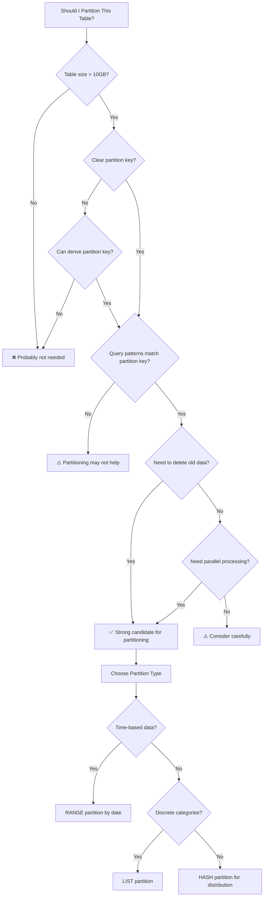
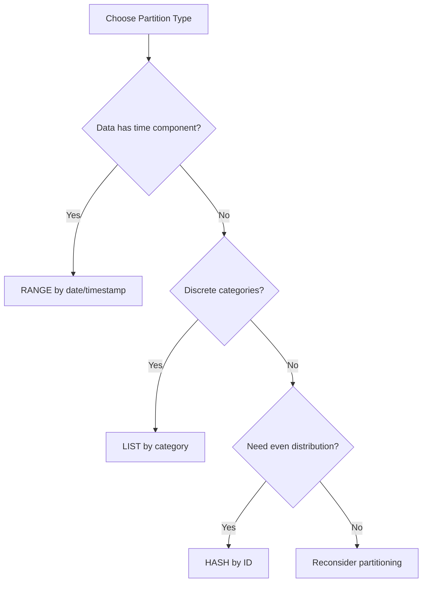

## Mục lục

- [Partitioning Fundamentals](#1-partitioning-fundamentals)
- [Partition Types](#2-partition-types)
- [Range Partitioning Deep Dive](#3-range-partitioning-deep-dive)
- [List Partitioning Deep Dive](#4-list-partitioning-deep-dive)
- [Hash Partitioning Deep Dive](#5-hash-partitioning-deep-dive)
- [Key Partitioning](#6-key-partitioning)
- [Composite (Sub) Partitioning](#7-composite-sub-partitioning)
- [Partition Pruning](#8-partition-pruning)
- [Partitioning vs Indexing](#9-partitioning-vs-indexing)
- [Global vs Local Indexes](#10-global-vs-local-indexes)
- [Common Mistakes & How to Prevent](#11-common-mistakes--how-to-prevent)
- [Real-World Examples](#12-real-world-examples)
- [Partition Maintenance Operations](#13-partition-maintenance-operations)
- [Best Practices](#14-best-practices)

---

## 1. Partitioning Fundamentals

### What is Table Partitioning?

**Partitioning** is a database technique that divides a large table into smaller, more manageable pieces called **partitions**. Each partition is stored separately but appears as a single logical table to applications.

```
┌─────────────────────────────────────────────────────────────────────────────────┐
│                    WITHOUT PARTITIONING (Single Table)                          │
├─────────────────────────────────────────────────────────────────────────────────┤
│                                                                                 │
│   Table: orders (100 million rows)                                              │
│   ┌────────────────────────────────────────────────────────────────────────┐    │
│   │ id │ customer_id │ order_date │ total │ status │ ... │ ... │ ... │ ... │    │
│   ├────┼─────────────┼────────────┼───────┼────────┼─────┼─────┼─────┼─────┤    │
│   │ 1  │ 100         │ 2020-01-01 │ 50.00 │ done   │     │     │     │     │    │
│   │ 2  │ 101         │ 2020-01-02 │ 75.00 │ done   │     │     │     │     │    │
│   │ .. │ ...         │ ...        │ ...   │ ...    │     │     │     │     │    │
│   │ N  │ 999         │ 2024-12-01 │ 99.00 │ pending│     │     │     │     │    │
│   └────┴─────────────┴────────────┴───────┴────────┴─────┴─────┴─────┴─────┘    │
│                                                                                 │
│   Problems:                                                                     │
│   ❌ Query scans 100M rows even for recent data                                 │
│   ❌ Backup takes hours                                                         │
│   ❌ Index maintenance is slow                                                  │
│   ❌ Deleting old data is expensive (DELETE + VACUUM)                           │
│                                                                                 │
└─────────────────────────────────────────────────────────────────────────────────┘

┌─────────────────────────────────────────────────────────────────────────────────┐
│                    WITH PARTITIONING (Divided Table)                            │
├─────────────────────────────────────────────────────────────────────────────────┤
│                                                                                 │
│   Table: orders (partitioned by year)                                           │
│                                                                                 │
│   ┌─────────────────┐  ┌─────────────────┐  ┌─────────────────┐                 │
│   │ orders_2022     │  │ orders_2023     │  │ orders_2024     │                 │
│   │ (20M rows)      │  │ (30M rows)      │  │ (50M rows)      │                 │
│   ├─────────────────┤  ├─────────────────┤  ├─────────────────┤                 │
│   │ Jan-Dec 2022    │  │ Jan-Dec 2023    │  │ Jan-Dec 2024    │                 │
│   │ data only       │  │ data only       │  │ data only       │                 │
│   └─────────────────┘  └─────────────────┘  └─────────────────┘                 │
│          │                    │                    │                            │
│          └────────────────────┼────────────────────┘                            │
│                               ▼                                                 │
│                    ┌─────────────────────┐                                      │
│                    │ Logical Table:      │                                      │
│                    │ orders              │                                      │
│                    │ (appears as one)    │                                      │
│                    └─────────────────────┘                                      │
│                                                                                 │
│   Benefits:                                                                     │
│   ✅ Query 2024 data → scans only orders_2024 (50M rows)                        │
│   ✅ Backup each partition independently                                        │
│   ✅ Drop old partition instantly (no DELETE needed)                            │
│   ✅ Parallel query execution across partitions                                 │
│                                                                                 │
└─────────────────────────────────────────────────────────────────────────────────┘
```

### Why Use Partitioning?

| Benefit | Explanation | Example |
|---------|-------------|---------|
| **Query Performance** | Partition pruning skips irrelevant partitions | Query for 2024 data only scans 2024 partition |
| **Faster Data Deletion** | DROP partition instead of DELETE millions of rows | Remove 2020 data: `DROP PARTITION p_2020` (instant) |
| **Easier Maintenance** | Backup/restore individual partitions | Backup only current month's partition |
| **Parallel Operations** | Multiple partitions can be processed simultaneously | Parallel index rebuild across partitions |
| **Improved Availability** | Partition-level operations don't lock entire table | Add partition without blocking queries |
| **Storage Optimization** | Different partitions can use different tablespaces | Archive partitions on cheaper storage |

### When to Use Partitioning



### When NOT to Use Partitioning

| Scenario | Reason | Alternative |
|----------|--------|-------------|
| **Small tables** (< 1GB) | Overhead not worth it | Use indexes |
| **No clear partition key** | Can't effectively prune | Use indexes |
| **Queries span all partitions** | No pruning benefit | Use indexes |
| **Frequent cross-partition joins** | Performance degradation | Reconsider schema |
| **High-frequency small transactions** | Partition overhead | Use indexes |

---

## 2. Partition Types

### Overview of Partition Types

| Type | How It Works | Best For | Example |
|------|--------------|----------|---------|
| **RANGE** | Rows assigned based on value ranges | Time-series data, sequential IDs | `order_date` by year/month |
| **LIST** | Rows assigned based on discrete values | Categories, regions, status | `country` IN ('US', 'UK', 'JP') |
| **HASH** | Rows distributed by hash function | Even distribution, no natural key | `user_id` MOD 4 |
| **KEY** | Like HASH but uses MySQL's internal hash | Similar to HASH, MySQL-specific | `user_id` |
| **COMPOSITE** | Combination of above types | Complex requirements | RANGE by date, then LIST by region |

### Visual Comparison

```
┌─────────────────────────────────────────────────────────────────────────────────┐
│                         PARTITION TYPES COMPARISON                              │
├─────────────────────────────────────────────────────────────────────────────────┤
│                                                                                 │
│   RANGE PARTITION (by order_date)                                               │
│   ┌─────────────────────────────────────────────────────────────────────────┐   │
│   │     2022          │      2023          │      2024          │   Future  │   │
│   │ ←───────────────→ │ ←────────────────→ │ ←────────────────→ │ ←───────→ │   │
│   │   Jan 1, 2022     │   Jan 1, 2023      │   Jan 1, 2024      │  Jan 2025 │   │
│   │        to         │        to          │        to          │    ...    │   │
│   │   Dec 31, 2022    │   Dec 31, 2023     │   Dec 31, 2024     │           │   │
│   └─────────────────────────────────────────────────────────────────────────┘   │
│   Use: Time-series, logs, orders, events                                        │
│                                                                                 │
│   LIST PARTITION (by region)                                                    │
│   ┌──────────────┐ ┌──────────────┐ ┌──────────────┐ ┌──────────────┐           │
│   │   AMERICAS   │ │    EUROPE    │ │     ASIA     │ │    OTHER     │           │
│   │ US, CA, MX,  │ │ UK, DE, FR,  │ │ JP, CN, KR,  │ │ Everything   │           │
│   │ BR, AR       │ │ ES, IT       │ │ IN, SG       │ │ else         │           │
│   └──────────────┘ └──────────────┘ └──────────────┘ └──────────────┘           │
│   Use: Geographic data, categories, fixed sets of values                        │
│                                                                                 │
│   HASH PARTITION (by user_id, 4 partitions)                                     │
│   ┌──────────────┐ ┌──────────────┐ ┌──────────────┐ ┌──────────────┐           │
│   │     P0       │ │     P1       │ │     P2       │ │     P3       │           │
│   │ hash % 4 = 0 │ │ hash % 4 = 1 │ │ hash % 4 = 2 │ │ hash % 4 = 3 │           │
│   │ user_id:     │ │ user_id:     │ │ user_id:     │ │ user_id:     │           │
│   │ 4,8,12,16... │ │ 1,5,9,13...  │ │ 2,6,10,14... │ │ 3,7,11,15... │           │
│   └──────────────┘ └──────────────┘ └──────────────┘ └──────────────┘           │
│   Use: Even distribution when no natural range/list key                         │
│                                                                                 │
└─────────────────────────────────────────────────────────────────────────────────┘
```

### Partition Type Decision Matrix

| Criteria | RANGE | LIST | HASH |
|----------|-------|------|------|
| **Data has natural ordering** | ✅ Best | ❌ | ❌ |
| **Data has discrete categories** | ❌ | ✅ Best | ❌ |
| **Need even distribution** | ⚠️ Depends | ⚠️ Depends | ✅ Best |
| **Query by range** | ✅ Excellent | ❌ | ❌ |
| **Query by specific values** | ⚠️ OK | ✅ Excellent | ❌ |
| **Easy to add partitions** | ✅ Yes | ✅ Yes | ⚠️ Requires reorg |
| **Easy to drop old data** | ✅ Yes | ✅ Yes | ❌ No |

---

## 3. Range Partitioning Deep Dive

### How Range Partitioning Works

Range partitioning divides data based on value ranges. Each partition holds rows where the partition key falls within a specified range.

```
┌─────────────────────────────────────────────────────────────────────────────────┐
│                    RANGE PARTITION INTERNAL STRUCTURE                           │
├─────────────────────────────────────────────────────────────────────────────────┤
│                                                                                 │
│   CREATE TABLE orders (                                                         │
│       id INT,                                                                   │
│       order_date DATE,                                                          │
│       amount DECIMAL(10,2)                                                      │
│   ) PARTITION BY RANGE (order_date);                                            │
│                                                                                 │
│   Partition Boundaries:                                                         │
│   ┌─────────────────────────────────────────────────────────────────────────┐   │
│   │                                                                         │   │
│   │  -∞ ──────┬──────────┬──────────┬──────────┬──────────┬────────── +∞    │   │
│   │           │          │          │          │          │                 │   │
│   │       2022-01-01 2023-01-01 2024-01-01 2025-01-01  MAXVALUE             │   │
│   │           │          │          │          │          │                 │   │
│   │    p_2022 │  p_2023  │  p_2024  │  p_2025  │ p_future │                 │   │
│   │           │          │          │          │          │                 │   │
│   └─────────────────────────────────────────────────────────────────────────┘   │
│                                                                                 │
│   Row Routing:                                                                  │
│   INSERT (id=1, order_date='2023-06-15', amount=100)                            │
│          │                                                                      │
│          ▼                                                                      │
│   Check: '2023-06-15' >= '2023-01-01' AND '2023-06-15' < '2024-01-01'           │
│          │                                                                      │
│          ▼                                                                      │
│   Route to: p_2023 partition                                                    │
│                                                                                 │
└─────────────────────────────────────────────────────────────────────────────────┘
```

### Range Partition Syntax

```sql
-- MySQL: Range Partition by Date
CREATE TABLE orders (
    id INT NOT NULL AUTO_INCREMENT,
    customer_id INT NOT NULL,
    order_date DATE NOT NULL,
    amount DECIMAL(10,2),
    PRIMARY KEY (id, order_date)  -- partition key must be in PK!
) PARTITION BY RANGE (YEAR(order_date)) (
    PARTITION p_2022 VALUES LESS THAN (2023),
    PARTITION p_2023 VALUES LESS THAN (2024),
    PARTITION p_2024 VALUES LESS THAN (2025),
    PARTITION p_future VALUES LESS THAN MAXVALUE
);

-- PostgreSQL: Range Partition by Date
CREATE TABLE orders (
    id SERIAL,
    customer_id INT NOT NULL,
    order_date DATE NOT NULL,
    amount DECIMAL(10,2)
) PARTITION BY RANGE (order_date);

CREATE TABLE orders_2022 PARTITION OF orders
    FOR VALUES FROM ('2022-01-01') TO ('2023-01-01');
CREATE TABLE orders_2023 PARTITION OF orders
    FOR VALUES FROM ('2023-01-01') TO ('2024-01-01');
CREATE TABLE orders_2024 PARTITION OF orders
    FOR VALUES FROM ('2024-01-01') TO ('2025-01-01');

-- PostgreSQL: Default partition for unmatched values
CREATE TABLE orders_default PARTITION OF orders DEFAULT;
```

### Range Partition by Month (Common Pattern)

```sql
-- MySQL: Monthly partitions
CREATE TABLE logs (
    id BIGINT NOT NULL AUTO_INCREMENT,
    log_date DATETIME NOT NULL,
    message TEXT,
    PRIMARY KEY (id, log_date)
) PARTITION BY RANGE (TO_DAYS(log_date)) (
    PARTITION p_2024_01 VALUES LESS THAN (TO_DAYS('2024-02-01')),
    PARTITION p_2024_02 VALUES LESS THAN (TO_DAYS('2024-03-01')),
    PARTITION p_2024_03 VALUES LESS THAN (TO_DAYS('2024-04-01')),
    -- ... more months
    PARTITION p_future VALUES LESS THAN MAXVALUE
);

-- PostgreSQL: Monthly partitions with automatic naming
CREATE TABLE logs (
    id BIGSERIAL,
    log_date TIMESTAMP NOT NULL,
    message TEXT
) PARTITION BY RANGE (log_date);

-- Create partitions for each month
CREATE TABLE logs_2024_01 PARTITION OF logs
    FOR VALUES FROM ('2024-01-01') TO ('2024-02-01');
CREATE TABLE logs_2024_02 PARTITION OF logs
    FOR VALUES FROM ('2024-02-01') TO ('2024-03-01');
-- ... etc
```

### Range Partition Query Examples

```sql
-- This query ONLY scans p_2024 partition (partition pruning)
SELECT * FROM orders 
WHERE order_date >= '2024-01-01' AND order_date < '2024-06-01';

-- Check which partitions will be scanned
EXPLAIN SELECT * FROM orders WHERE order_date = '2024-03-15';
-- MySQL output will show: partitions: p_2024
-- PostgreSQL output will show: only orders_2024 scanned
```

---

## 4. List Partitioning Deep Dive

### How List Partitioning Works

List partitioning assigns rows to partitions based on discrete values. Each partition contains rows matching specific values in a list.

```
┌─────────────────────────────────────────────────────────────────────────────────┐
│                    LIST PARTITION INTERNAL STRUCTURE                            │
├─────────────────────────────────────────────────────────────────────────────────┤
│                                                                                 │
│   CREATE TABLE customers (                                                      │
│       id INT,                                                                   │
│       name VARCHAR(100),                                                        │
│       country VARCHAR(2)                                                        │
│   ) PARTITION BY LIST (country);                                                │
│                                                                                 │
│   Partition Value Mapping:                                                      │
│   ┌─────────────────────────────────────────────────────────────────────────┐   │
│   │                                                                         │   │
│   │   country     Partition                                                 │   │
│   │   ─────────   ─────────                                                 │   │
│   │   'US'    ─┐                                                            │   │
│   │   'CA'    ─┼──► p_americas                                              │   │
│   │   'MX'    ─┘                                                            │   │
│   │                                                                         │   │
│   │   'UK'    ─┐                                                            │   │
│   │   'DE'    ─┼──► p_europe                                                │   │
│   │   'FR'    ─┘                                                            │   │
│   │                                                                         │   │
│   │   'JP'    ─┐                                                            │   │
│   │   'CN'    ─┼──► p_asia                                                  │   │
│   │   'KR'    ─┘                                                            │   │
│   │                                                                         │   │
│   │   Others  ───► p_other (catch-all)                                      │   │
│   │                                                                         │   │
│   └─────────────────────────────────────────────────────────────────────────┘   │
│                                                                                 │
│   Row Routing:                                                                  │
│   INSERT (id=1, name='John', country='DE')                                      │
│          │                                                                      │
│          ▼                                                                      │
│   Check: 'DE' IN ('UK', 'DE', 'FR') → TRUE                                      │
│          │                                                                      │
│          ▼                                                                      │
│   Route to: p_europe partition                                                  │
│                                                                                 │
└─────────────────────────────────────────────────────────────────────────────────┘
```

### List Partition Syntax

```sql
-- MySQL: List Partition by Region
CREATE TABLE customers (
    id INT NOT NULL AUTO_INCREMENT,
    name VARCHAR(100),
    country VARCHAR(2) NOT NULL,
    PRIMARY KEY (id, country)
) PARTITION BY LIST COLUMNS (country) (
    PARTITION p_americas VALUES IN ('US', 'CA', 'MX', 'BR', 'AR'),
    PARTITION p_europe VALUES IN ('UK', 'DE', 'FR', 'ES', 'IT'),
    PARTITION p_asia VALUES IN ('JP', 'CN', 'KR', 'IN', 'SG'),
    PARTITION p_other VALUES IN ('AU', 'NZ', 'ZA')
);

-- PostgreSQL: List Partition
CREATE TABLE customers (
    id SERIAL,
    name VARCHAR(100),
    country VARCHAR(2) NOT NULL
) PARTITION BY LIST (country);

CREATE TABLE customers_americas PARTITION OF customers
    FOR VALUES IN ('US', 'CA', 'MX', 'BR', 'AR');
CREATE TABLE customers_europe PARTITION OF customers
    FOR VALUES IN ('UK', 'DE', 'FR', 'ES', 'IT');
CREATE TABLE customers_asia PARTITION OF customers
    FOR VALUES IN ('JP', 'CN', 'KR', 'IN', 'SG');
CREATE TABLE customers_other PARTITION OF customers DEFAULT;
```

### List Partition Use Cases

| Use Case | Partition Key | Partition Values |
|----------|---------------|------------------|
| **Geographic** | country/region | Americas, Europe, Asia |
| **Status** | order_status | pending, processing, shipped, delivered |
| **Category** | product_category | electronics, clothing, food |
| **Tenant** | tenant_id | tenant_a, tenant_b, tenant_c |
| **Priority** | priority_level | low, medium, high, critical |

---

## 5. Hash Partitioning Deep Dive

### How Hash Partitioning Works

Hash partitioning distributes rows across partitions using a hash function. This ensures even distribution when there's no natural range or list key.

```
┌─────────────────────────────────────────────────────────────────────────────────┐
│                    HASH PARTITION INTERNAL STRUCTURE                            │
├─────────────────────────────────────────────────────────────────────────────────┤
│                                                                                 │
│   CREATE TABLE user_sessions (                                                  │
│       session_id VARCHAR(64),                                                   │
│       user_id INT                                                               │
│   ) PARTITION BY HASH (user_id) PARTITIONS 4;                                   │
│                                                                                 │
│   Hash Distribution Formula:                                                    │
│   partition_number = HASH(user_id) MOD number_of_partitions                     │
│                                                                                 │
│   ┌─────────────────────────────────────────────────────────────────────────┐   │
│   │                                                                         │   │
│   │   user_id=101  ──► HASH(101)=2847362 ──► 2847362 MOD 4 = 2 ──► P2       │   │
│   │   user_id=102  ──► HASH(102)=9283741 ──► 9283741 MOD 4 = 1 ──► P1       │   │
│   │   user_id=103  ──► HASH(103)=1827364 ──► 1827364 MOD 4 = 0 ──► P0       │   │
│   │   user_id=104  ──► HASH(104)=5738291 ──► 5738291 MOD 4 = 3 ──► P3       │   │
│   │   user_id=105  ──► HASH(105)=8273648 ──► 8273648 MOD 4 = 0 ──► P0       │   │
│   │                                                                         │   │
│   └─────────────────────────────────────────────────────────────────────────┘   │
│                                                                                 │
│   Resulting Distribution:                                                       │
│   ┌───────────┐ ┌───────────┐ ┌───────────┐ ┌───────────┐                       │
│   │    P0     │ │    P1     │ │    P2     │ │    P3     │                       │
│   │ user_id:  │ │ user_id:  │ │ user_id:  │ │ user_id:  │                       │
│   │ 103, 105  │ │ 102       │ │ 101       │ │ 104       │                       │
│   │ ~25% data │ │ ~25% data │ │ ~25% data │ │ ~25% data │                       │
│   └───────────┘ └───────────┘ └───────────┘ └───────────┘                       │
│                                                                                 │
│   ✅ Advantage: Even distribution across partitions                             │
│   ❌ Disadvantage: Can't predict which partition holds specific data            │
│   ❌ Disadvantage: Range queries scan ALL partitions                            │
│                                                                                 │
└─────────────────────────────────────────────────────────────────────────────────┘
```

### Hash Partition Syntax

```sql
-- MySQL: Hash Partition
CREATE TABLE user_sessions (
    id BIGINT NOT NULL AUTO_INCREMENT,
    user_id INT NOT NULL,
    session_data JSON,
    created_at TIMESTAMP,
    PRIMARY KEY (id, user_id)
) PARTITION BY HASH (user_id) PARTITIONS 8;

-- MySQL: Linear Hash (easier to add/remove partitions)
CREATE TABLE user_sessions (
    id BIGINT NOT NULL AUTO_INCREMENT,
    user_id INT NOT NULL,
    session_data JSON,
    PRIMARY KEY (id, user_id)
) PARTITION BY LINEAR HASH (user_id) PARTITIONS 8;

-- PostgreSQL: Hash Partition
CREATE TABLE user_sessions (
    id BIGSERIAL,
    user_id INT NOT NULL,
    session_data JSONB,
    created_at TIMESTAMP
) PARTITION BY HASH (user_id);

CREATE TABLE user_sessions_p0 PARTITION OF user_sessions
    FOR VALUES WITH (MODULUS 4, REMAINDER 0);
CREATE TABLE user_sessions_p1 PARTITION OF user_sessions
    FOR VALUES WITH (MODULUS 4, REMAINDER 1);
CREATE TABLE user_sessions_p2 PARTITION OF user_sessions
    FOR VALUES WITH (MODULUS 4, REMAINDER 2);
CREATE TABLE user_sessions_p3 PARTITION OF user_sessions
    FOR VALUES WITH (MODULUS 4, REMAINDER 3);
```

### Hash vs Linear Hash (MySQL)

| Aspect | HASH | LINEAR HASH |
|--------|------|-------------|
| **Distribution** | Very even | Slightly less even |
| **Add partition** | Requires reorganizing all data | Only ~50% data moves |
| **Remove partition** | Requires reorganizing all data | Only ~50% data moves |
| **Performance** | Better for queries | Similar |
| **Use case** | Fixed partition count | Need flexibility |

---

## 6. Key Partitioning

### Key Partitioning (MySQL Only)

Key partitioning is similar to hash partitioning, but MySQL manages the hashing algorithm internally. It can use columns that aren't integers.

```sql
-- MySQL: Key Partition (uses internal hash)
CREATE TABLE orders (
    order_id VARCHAR(36) NOT NULL,  -- UUID
    customer_email VARCHAR(255) NOT NULL,
    order_date DATE,
    PRIMARY KEY (order_id)
) PARTITION BY KEY (order_id) PARTITIONS 4;

-- Key partition with multiple columns
CREATE TABLE user_actions (
    user_id INT,
    action_type VARCHAR(50),
    action_date DATE,
    PRIMARY KEY (user_id, action_type, action_date)
) PARTITION BY KEY (user_id, action_type) PARTITIONS 8;

-- Key partition using primary key (no column specified)
CREATE TABLE items (
    id INT NOT NULL AUTO_INCREMENT,
    name VARCHAR(100),
    PRIMARY KEY (id)
) PARTITION BY KEY () PARTITIONS 4;  -- Uses PRIMARY KEY
```

### Key vs Hash Partitioning

| Aspect | KEY | HASH |
|--------|-----|------|
| **Column types** | Any type | Integer only (or expression) |
| **Algorithm** | MySQL internal (MD5-based) | User-visible MOD operation |
| **Multiple columns** | ✅ Yes | ❌ No (need expression) |
| **Predictability** | ❌ Cannot predict partition | ⚠️ Can calculate |
| **Primary key** | Can use PK implicitly | Must specify column |

---

## 7. Composite (Sub) Partitioning

### What is Composite Partitioning?

Composite partitioning combines two partitioning methods. The table is first partitioned by one method, then each partition is further divided (subpartitioned) by another method.

```
┌────────────────────────────────────────────────────────────────────────────────┐
│                    COMPOSITE PARTITION STRUCTURE                               │
├────────────────────────────────────────────────────────────────────────────────┤
│                                                                                │
│   Table: sales (RANGE by year, then HASH by store_id)                          │
│                                                                                │
│   ┌─────────────────────────────────────────────────────────────────────────┐  │
│   │                           RANGE by year                                 │  │
│   │                                                                         │  │
│   │   ┌───────────────────┐  ┌───────────────────┐  ┌───────────────────┐   │  │
│   │   │      p_2023       │  │      p_2024       │  │      p_2025       │   │  │
│   │   │  (year = 2023)    │  │  (year = 2024)    │  │  (year = 2025)    │   │  │
│   │   ├───────────────────┤  ├───────────────────┤  ├───────────────────┤   │  │
│   │   │ HASH by store_id  │  │ HASH by store_id  │  │ HASH by store_id  │   │  │
│   │   │                   │  │                   │  │                   │   │  │
│   │   │ ┌────┐ ┌────┐     │  │ ┌────┐ ┌────┐     │  │ ┌────┐ ┌────┐     │   │  │
│   │   │ │sp0 │ │sp1 │     │  │ │sp0 │ │sp1 │     │  │ │sp0 │ │sp1 │     │   │  │
│   │   │ └────┘ └────┘     │  │ └────┘ └────┘     │  │ └────┘ └────┘     │   │  │
│   │   │ ┌────┐ ┌────┐     │  │ ┌────┐ ┌────┐     │  │ ┌────┐ ┌────┐     │   │  │
│   │   │ │sp2 │ │sp3 │     │  │ │sp2 │ │sp3 │     │  │ │sp2 │ │sp3 │     │   │  │
│   │   │ └────┘ └────┘     │  │ └────┘ └────┘     │  │ └────┘ └────┘     │   │  │
│   │   └───────────────────┘  └───────────────────┘  └───────────────────┘   │  │
│   │                                                                         │  │
│   │   Total: 3 partitions × 4 subpartitions = 12 physical segments          │  │
│   │                                                                         │  │
│   └─────────────────────────────────────────────────────────────────────────┘  │
│                                                                                │
│   Query: WHERE year = 2024 AND store_id = 5                                    │
│   Pruning: Scans only p_2024_sp1 (1 of 12 segments)                            │
│                                                                                │
└────────────────────────────────────────────────────────────────────────────────┘
```

### Composite Partition Syntax

```sql
-- MySQL: RANGE + HASH composite
CREATE TABLE sales (
    id BIGINT NOT NULL AUTO_INCREMENT,
    sale_date DATE NOT NULL,
    store_id INT NOT NULL,
    amount DECIMAL(10,2),
    PRIMARY KEY (id, sale_date, store_id)
)
PARTITION BY RANGE (YEAR(sale_date))
SUBPARTITION BY HASH (store_id)
SUBPARTITIONS 4 (
    PARTITION p_2022 VALUES LESS THAN (2023),
    PARTITION p_2023 VALUES LESS THAN (2024),
    PARTITION p_2024 VALUES LESS THAN (2025),
    PARTITION p_future VALUES LESS THAN MAXVALUE
);

-- MySQL: RANGE + LIST composite
CREATE TABLE orders (
    id BIGINT NOT NULL AUTO_INCREMENT,
    order_date DATE NOT NULL,
    region VARCHAR(20) NOT NULL,
    amount DECIMAL(10,2),
    PRIMARY KEY (id, order_date, region)
)
PARTITION BY RANGE (YEAR(order_date))
SUBPARTITION BY LIST COLUMNS (region) (
    PARTITION p_2023 VALUES LESS THAN (2024) (
        SUBPARTITION p_2023_us VALUES IN ('US'),
        SUBPARTITION p_2023_eu VALUES IN ('UK', 'DE', 'FR'),
        SUBPARTITION p_2023_asia VALUES IN ('JP', 'CN')
    ),
    PARTITION p_2024 VALUES LESS THAN (2025) (
        SUBPARTITION p_2024_us VALUES IN ('US'),
        SUBPARTITION p_2024_eu VALUES IN ('UK', 'DE', 'FR'),
        SUBPARTITION p_2024_asia VALUES IN ('JP', 'CN')
    )
);
```

### Composite Partition Use Cases

| Combination | Use Case | Example |
|-------------|----------|---------|
| **RANGE + HASH** | Time-series with even distribution | Logs by month, then hash by server_id |
| **RANGE + LIST** | Time-series with regional data | Sales by year, then by region |
| **LIST + HASH** | Categories with even distribution | Product type, then hash by product_id |

---

## 8. Partition Pruning

### What is Partition Pruning?

**Partition pruning** is the database optimizer's ability to skip partitions that cannot contain matching rows. This is the PRIMARY performance benefit of partitioning.

```
┌─────────────────────────────────────────────────────────────────────────────────┐
│                         PARTITION PRUNING EXPLAINED                             │
├─────────────────────────────────────────────────────────────────────────────────┤
│                                                                                 │
│   Table: orders (partitioned by RANGE on order_date)                            │
│   ┌──────────┐ ┌──────────┐ ┌──────────┐ ┌──────────┐ ┌──────────┐              │
│   │  p_2020  │ │  p_2021  │ │  p_2022  │ │  p_2023  │ │  p_2024  │              │
│   │  20M     │ │  25M     │ │  30M     │ │  35M     │ │  40M     │              │
│   └──────────┘ └──────────┘ └──────────┘ └──────────┘ └──────────┘              │
│       Total: 150 million rows                                                   │
│                                                                                 │
│   ───────────────────────────────────────────────────────────────────────────   │
│                                                                                 │
│   Query 1: SELECT * FROM orders WHERE order_date = '2024-06-15';                │
│                                                                                 │
│   Without Pruning: Scan all 150M rows                                           │
│   With Pruning:    Scan only p_2024 (40M rows)                                  │
│   ┌──────────┐ ┌──────────┐ ┌──────────┐ ┌──────────┐ ┌──────────┐              │
│   │  SKIP    │ │  SKIP    │ │  SKIP    │ │  SKIP    │ │ ✅ SCAN  │              │
│   └──────────┘ └──────────┘ └──────────┘ └──────────┘ └──────────┘              │
│   Improvement: 3.75x faster (40M vs 150M)                                       │
│                                                                                 │
│   ───────────────────────────────────────────────────────────────────────────   │
│                                                                                 │
│   Query 2: SELECT * FROM orders                                                 │
│            WHERE order_date >= '2023-01-01' AND order_date < '2024-07-01';      │
│                                                                                 │
│   ┌──────────┐ ┌──────────┐ ┌──────────┐ ┌──────────┐ ┌──────────┐              │
│   │  SKIP    │ │  SKIP    │ │  SKIP    │ │ ✅ SCAN  │ │ ✅ SCAN  │              │
│   └──────────┘ └──────────┘ └──────────┘ └──────────┘ └──────────┘              │
│   Scans: p_2023 (35M) + p_2024 (40M) = 75M rows                                 │
│   Improvement: 2x faster (75M vs 150M)                                          │
│                                                                                 │
│   ───────────────────────────────────────────────────────────────────────────   │
│                                                                                 │
│   Query 3: SELECT * FROM orders WHERE customer_id = 12345;                      │
│            (customer_id is NOT the partition key!)                              │
│                                                                                 │
│   ┌──────────┐ ┌──────────┐ ┌──────────┐ ┌──────────┐ ┌──────────┐              │
│   │ ✅ SCAN  │ │ ✅ SCAN  │ │ ✅ SCAN  │ │ ✅ SCAN  │ │ ✅ SCAN  │              │
│   └──────────┘ └──────────┘ └──────────┘ └──────────┘ └──────────┘              │
│   ❌ NO PRUNING - Must scan ALL partitions!                                     │
│                                                                                 │
└─────────────────────────────────────────────────────────────────────────────────┘
```

### Conditions That Enable Pruning

| Condition Type | RANGE Partition | LIST Partition | HASH Partition |
|----------------|-----------------|----------------|----------------|
| `= value` | ✅ Yes | ✅ Yes | ✅ Yes |
| `IN (values)` | ✅ Yes | ✅ Yes | ✅ Yes |
| `< value` | ✅ Yes | ❌ No | ❌ No |
| `> value` | ✅ Yes | ❌ No | ❌ No |
| `BETWEEN a AND b` | ✅ Yes | ❌ No | ❌ No |
| `LIKE 'prefix%'` | ⚠️ Sometimes | ❌ No | ❌ No |
| `IS NULL` | ✅ Yes | ✅ Yes | ❌ No |
| Function on column | ❌ Usually No | ❌ No | ❌ No |

### Checking Partition Pruning

```sql
-- MySQL: Check which partitions will be scanned
EXPLAIN SELECT * FROM orders WHERE order_date = '2024-06-15';
-- Look for "partitions: p_2024" in output

EXPLAIN PARTITIONS SELECT * FROM orders WHERE order_date = '2024-06-15';
-- Explicit partition information

-- PostgreSQL: Check partition pruning
EXPLAIN (ANALYZE, COSTS OFF) 
SELECT * FROM orders WHERE order_date = '2024-06-15';
-- Output shows which child tables are scanned

-- PostgreSQL: Enable partition pruning (usually enabled by default)
SET enable_partition_pruning = on;
```

### Pruning NOT Working - Common Causes

```sql
-- ❌ Function on partition key prevents pruning
SELECT * FROM orders WHERE YEAR(order_date) = 2024;
-- Rewrite as:
SELECT * FROM orders 
WHERE order_date >= '2024-01-01' AND order_date < '2025-01-01';

-- ❌ Type mismatch prevents pruning
SELECT * FROM orders WHERE order_date = '2024-06-15 00:00:00';
-- If partition key is DATE, not DATETIME

-- ❌ OR condition may prevent pruning
SELECT * FROM orders 
WHERE order_date = '2024-01-01' OR customer_id = 100;
-- customer_id is not partition key - must scan all

-- ❌ Subquery may prevent pruning
SELECT * FROM orders 
WHERE order_date IN (SELECT max_date FROM some_table);
```

---

## 9. Partitioning vs Indexing

### When to Use Each

```
┌────────────────────────────────────────────────────────────────────────────────┐
│                     PARTITIONING VS INDEXING COMPARISON                        │
├────────────────────────────────────────────────────────────────────────────────┤
│                                                                                │
│   INDEXING                           PARTITIONING                              │
│   ┌─────────────────────────┐        ┌─────────────────────────┐               │
│   │ Creates separate        │        │ Physically divides      │               │
│   │ data structure          │        │ the table itself        │               │
│   │                         │        │                         │               │
│   │    Table                │        │    ┌───┐ ┌───┐ ┌───┐    │               │
│   │   ┌─────────────────┐   │        │    │ P1│ │ P2│ │ P3│    │               │
│   │   │ Data rows       │   │        │    └───┘ └───┘ └───┘    │               │
│   │   └─────────────────┘   │        │      Separate files     │               │
│   │          ↑              │        │                         │               │
│   │   ┌─────────────────┐   │        │                         │               │
│   │   │ Index (B-Tree)  │   │        │                         │               │
│   │   │ key → row ptr   │   │        │                         │               │
│   │   └─────────────────┘   │        │                         │               │
│   └─────────────────────────┘        └─────────────────────────┘               │
│                                                                                │
│   Best for:                          Best for:                                 │
│   • Selective queries (<15%)         • Time-based data lifecycle               │
│   • Point lookups                    • Bulk delete old data                    │
│   • Any query pattern                • Very large tables (>10GB)               │
│   • Small to medium tables           • Queries on partition key                │
│                                                                                │
└────────────────────────────────────────────────────────────────────────────────┘
```

### Comparison Table

| Aspect | Indexing | Partitioning |
|--------|----------|--------------|
| **Primary purpose** | Speed up queries | Manage large data sets |
| **Data organization** | Separate structure | Divides table physically |
| **Query performance** | Any selective query | Only queries using partition key |
| **Write performance** | Slower (index update) | Similar or better |
| **Delete old data** | Slow (row by row) | Fast (drop partition) |
| **Storage overhead** | Additional space for index | Minimal overhead |
| **Maintenance** | Index rebuild | Partition add/drop/merge |
| **Parallelism** | Limited | Query parallel across partitions |

### Using Both Together

```sql
-- Best practice: Partition + Local Index

-- Step 1: Create partitioned table
CREATE TABLE orders (
    id BIGINT NOT NULL AUTO_INCREMENT,
    customer_id INT NOT NULL,
    order_date DATE NOT NULL,
    status VARCHAR(20),
    amount DECIMAL(10,2),
    PRIMARY KEY (id, order_date)
) PARTITION BY RANGE (YEAR(order_date)) (
    PARTITION p_2023 VALUES LESS THAN (2024),
    PARTITION p_2024 VALUES LESS THAN (2025),
    PARTITION p_future VALUES LESS THAN MAXVALUE
);

-- Step 2: Add indexes for common queries
-- Local index (per partition) on customer_id
CREATE INDEX idx_customer ON orders(customer_id);

-- Local index on status
CREATE INDEX idx_status ON orders(status);

-- Query using both partition pruning AND index:
SELECT * FROM orders 
WHERE order_date >= '2024-01-01'   -- Partition pruning
  AND customer_id = 12345;          -- Index lookup within partition
```

---

## 10. Global vs Local Indexes

### Understanding Global vs Local Indexes

```
┌─────────────────────────────────────────────────────────────────────────────────┐
│                    GLOBAL VS LOCAL INDEX COMPARISON                             │
├─────────────────────────────────────────────────────────────────────────────────┤
│                                                                                 │
│   LOCAL INDEX (Per Partition)                                                   │
│   ─────────────────────────────                                                 │
│   Each partition has its own index                                              │
│                                                                                 │
│   ┌─────────────────┐  ┌─────────────────┐  ┌─────────────────┐                 │
│   │   Partition 1   │  │   Partition 2   │  │   Partition 3   │                 │
│   │ ┌─────────────┐ │  │ ┌─────────────┐ │  │ ┌─────────────┐ │                 │
│   │ │   Index 1   │ │  │ │   Index 2   │ │  │ │   Index 3   │ │                 │
│   │ └─────────────┘ │  │ └─────────────┘ │  │ └─────────────┘ │                 │
│   │ ┌─────────────┐ │  │ ┌─────────────┐ │  │ ┌─────────────┐ │                 │
│   │ │    Data     │ │  │ │    Data     │ │  │ │    Data     │ │                 │
│   │ └─────────────┘ │  │ └─────────────┘ │  │ └─────────────┘ │                 │
│   └─────────────────┘  └─────────────────┘  └─────────────────┘                 │
│                                                                                 │
│   ✅ Partition operations are fast (only local index affected)                  │
│   ✅ Index maintenance is distributed                                           │
│   ❌ Query without partition key must search ALL indexes                        │
│                                                                                 │
│   ═══════════════════════════════════════════════════════════════════════════   │
│                                                                                 │
│   GLOBAL INDEX (Spans All Partitions) - Oracle/PostgreSQL                       │
│   ─────────────────────────────────────                                         │
│   Single index covers all partitions                                            │
│                                                                                 │
│          ┌─────────────────────────────────────────────────┐                    │
│          │              Global Index                       │                    │
│          │  customer_id → (partition, row_pointer)         │                    │
│          └─────────────────────────────────────────────────┘                    │
│                     │                │                │                         │
│                     ▼                ▼                ▼                         │
│   ┌─────────────────┐  ┌─────────────────┐  ┌─────────────────┐                 │
│   │   Partition 1   │  │   Partition 2   │  │   Partition 3   │                 │
│   │ ┌─────────────┐ │  │ ┌─────────────┐ │  │ ┌─────────────┐ │                 │
│   │ │    Data     │ │  │ │    Data     │ │  │ │    Data     │ │                 │
│   │ └─────────────┘ │  │ └─────────────┘ │  │ └─────────────┘ │                 │
│   └─────────────────┘  └─────────────────┘  └─────────────────┘                 │
│                                                                                 │
│   ✅ Query by indexed column is fast (single index lookup)                      │
│   ❌ Partition operations may invalidate/rebuild global index                   │
│   ❌ Index maintenance is centralized (potential bottleneck)                    │
│                                                                                 │
└─────────────────────────────────────────────────────────────────────────────────┘
```

### Comparison Table

| Aspect | Local Index | Global Index |
|--------|-------------|--------------|
| **Scope** | Per partition | Entire table |
| **Query without partition key** | Scans all partition indexes | Single index lookup |
| **Drop partition** | Fast (local index dropped too) | May invalidate global index |
| **Add partition** | Fast (new local index) | May need index update |
| **Maintenance** | Distributed | Centralized |
| **MySQL support** | ✅ Yes (only option) | ❌ No |
| **PostgreSQL support** | ✅ Yes (default) | ⚠️ Limited |
| **Oracle support** | ✅ Yes | ✅ Yes |

### MySQL: All Indexes are Local

```sql
-- MySQL only supports local (partition-wise) indexes
CREATE TABLE orders (
    id BIGINT NOT NULL AUTO_INCREMENT,
    customer_id INT NOT NULL,
    order_date DATE NOT NULL,
    PRIMARY KEY (id, order_date),  -- Must include partition key
    INDEX idx_customer (customer_id, order_date)  -- Local index
) PARTITION BY RANGE (YEAR(order_date)) (
    PARTITION p_2023 VALUES LESS THAN (2024),
    PARTITION p_2024 VALUES LESS THAN (2025)
);

-- Query without partition key searches ALL local indexes
EXPLAIN SELECT * FROM orders WHERE customer_id = 100;
-- Shows: partitions: p_2023,p_2024 (both scanned)

-- Query WITH partition key uses partition pruning + local index
EXPLAIN SELECT * FROM orders 
WHERE customer_id = 100 AND order_date >= '2024-01-01';
-- Shows: partitions: p_2024 (only one scanned)
```

### PostgreSQL: Creating Global-like Index

```sql
-- PostgreSQL: Create index on parent table (behaves like local indexes)
CREATE TABLE orders (
    id BIGSERIAL,
    customer_id INT NOT NULL,
    order_date DATE NOT NULL
) PARTITION BY RANGE (order_date);

-- Create partitions
CREATE TABLE orders_2024 PARTITION OF orders
    FOR VALUES FROM ('2024-01-01') TO ('2025-01-01');

-- Index on parent creates local indexes on all partitions
CREATE INDEX idx_customer ON orders(customer_id);
-- This creates orders_2024_customer_id_idx automatically

-- For true global unique constraint (PostgreSQL 11+)
-- The unique constraint must include partition key
CREATE UNIQUE INDEX idx_unique ON orders(id, order_date);
```

---

## 11. Common Mistakes & How to Prevent

### Mistake 1: Wrong Partition Key Choice

```sql
-- ❌ BAD: Partition by rarely-queried column
CREATE TABLE orders (...)
PARTITION BY RANGE (created_by_user_id);  -- Users rarely query by this!

-- Most queries are:
SELECT * FROM orders WHERE order_date = '2024-01-15';  -- No pruning!
SELECT * FROM orders WHERE customer_id = 100;  -- No pruning!

-- ✅ GOOD: Partition by commonly-queried column
CREATE TABLE orders (...)
PARTITION BY RANGE (YEAR(order_date));

-- Now date queries benefit from pruning
SELECT * FROM orders WHERE order_date = '2024-01-15';  -- Prunes to p_2024!
```

### Mistake 2: Too Many or Too Few Partitions

```
┌─────────────────────────────────────────────────────────────────────────────────┐
│                    PARTITION COUNT GUIDELINES                                   │
├─────────────────────────────────────────────────────────────────────────────────┤
│                                                                                 │
│   ❌ TOO FEW PARTITIONS                                                         │
│   ┌─────────────────────────────────────────────────────────────────────────┐   │
│   │                                                                         │   │
│   │   2 partitions for 100M rows = 50M rows each                            │   │
│   │   • Still too large to manage efficiently                               │   │
│   │   • Limited pruning benefit                                             │   │
│   │   • Can't parallelize effectively                                       │   │
│   │                                                                         │   │
│   └─────────────────────────────────────────────────────────────────────────┘   │
│                                                                                 │
│   ❌ TOO MANY PARTITIONS                                                        │
│   ┌─────────────────────────────────────────────────────────────────────────┐   │
│   │                                                                         │   │
│   │   1000 partitions for 100M rows = 100K rows each                        │   │
│   │   • Excessive metadata overhead                                         │   │
│   │   • Query planning becomes slow                                         │   │
│   │   • File handle exhaustion                                              │   │
│   │   • MySQL limit: 8192 partitions per table                              │   │
│   │                                                                         │   │
│   └─────────────────────────────────────────────────────────────────────────┘   │
│                                                                                 │
│   ✅ RECOMMENDED: Balance partition size and count                              │
│   ┌─────────────────────────────────────────────────────────────────────────┐   │
│   │                                                                         │   │
│   │   Rule of thumb:                                                        │   │
│   │   • Each partition: 1M - 100M rows (or 1GB - 50GB)                      │   │
│   │   • Total partitions: 12 - 100 for most use cases                       │   │
│   │   • Time-based: Monthly or quarterly partitions                         │   │
│   │                                                                         │   │
│   │   100M rows ÷ 50 partitions = 2M rows each ✅                           │   │
│   │                                                                         │   │
│   └─────────────────────────────────────────────────────────────────────────┘   │
│                                                                                 │
└─────────────────────────────────────────────────────────────────────────────────┘
```

### Mistake 3: Missing MAXVALUE/DEFAULT Partition

```sql
-- ❌ BAD: No catch-all partition
CREATE TABLE orders (...)
PARTITION BY RANGE (YEAR(order_date)) (
    PARTITION p_2023 VALUES LESS THAN (2024),
    PARTITION p_2024 VALUES LESS THAN (2025)
);

-- What happens when 2025 data arrives?
INSERT INTO orders (order_date) VALUES ('2025-01-15');
-- ERROR: Table has no partition for value 2025

-- ✅ GOOD: Include MAXVALUE partition
CREATE TABLE orders (...)
PARTITION BY RANGE (YEAR(order_date)) (
    PARTITION p_2023 VALUES LESS THAN (2024),
    PARTITION p_2024 VALUES LESS THAN (2025),
    PARTITION p_future VALUES LESS THAN MAXVALUE  -- Catch-all
);

-- PostgreSQL: DEFAULT partition
CREATE TABLE orders_default PARTITION OF orders DEFAULT;
```

### Mistake 4: Primary Key Not Including Partition Key (MySQL)

```sql
-- ❌ BAD: MySQL requires partition key in primary key
CREATE TABLE orders (
    id INT PRIMARY KEY,  -- Error! partition key not included
    order_date DATE
) PARTITION BY RANGE (YEAR(order_date)) (...);
-- ERROR: A PRIMARY KEY must include all columns in the partition function

-- ✅ GOOD: Include partition key in primary key
CREATE TABLE orders (
    id INT,
    order_date DATE,
    PRIMARY KEY (id, order_date)  -- Both columns
) PARTITION BY RANGE (YEAR(order_date)) (...);

-- Or use a composite unique constraint
CREATE TABLE orders (
    id INT AUTO_INCREMENT,
    order_date DATE,
    PRIMARY KEY (id, order_date),
    UNIQUE KEY (id)  -- This won't work either!
) PARTITION BY RANGE (YEAR(order_date)) (...);
-- ERROR: UNIQUE KEY must include partition key too
```

### Mistake 5: Queries Not Using Partition Key

```sql
-- Setup: orders partitioned by order_date
CREATE TABLE orders (...) PARTITION BY RANGE (YEAR(order_date));

-- ❌ BAD: Query doesn't use partition key
SELECT * FROM orders WHERE customer_id = 100;
-- Scans ALL partitions! No pruning benefit.

-- ❌ BAD: Function on partition key
SELECT * FROM orders WHERE YEAR(order_date) = 2024;
-- May not prune in all databases

-- ✅ GOOD: Direct comparison on partition key
SELECT * FROM orders 
WHERE order_date >= '2024-01-01' AND order_date < '2025-01-01';
-- Prunes to p_2024 only

-- ✅ GOOD: Combine partition key with other filters
SELECT * FROM orders 
WHERE order_date >= '2024-01-01' 
  AND order_date < '2025-01-01'
  AND customer_id = 100;
-- Prunes to p_2024, then uses index on customer_id
```

### Mistake 6: Not Planning for Partition Maintenance

```sql
-- ❌ BAD: No automation for new partitions
-- Table created in 2023 with partitions up to 2025
-- In 2025, application crashes because no partition exists!

-- ✅ GOOD: Schedule partition maintenance

-- Option 1: MAXVALUE partition + regular reorganization
-- Create with MAXVALUE
CREATE TABLE orders (...) PARTITION BY RANGE (YEAR(order_date)) (
    PARTITION p_2024 VALUES LESS THAN (2025),
    PARTITION p_future VALUES LESS THAN MAXVALUE
);

-- Monthly cron job to add new partition:
-- ALTER TABLE orders REORGANIZE PARTITION p_future INTO (
--     PARTITION p_2025 VALUES LESS THAN (2026),
--     PARTITION p_future VALUES LESS THAN MAXVALUE
-- );

-- Option 2: PostgreSQL pg_partman extension
-- Automatically creates and maintains partitions
CREATE EXTENSION pg_partman;
SELECT partman.create_parent('public.orders', 'order_date', 'native', 'monthly');
```

### Complete Mistakes Summary Table

| Mistake | Symptom | Solution |
|---------|---------|----------|
| **Wrong partition key** | No pruning, full scans | Partition by commonly-queried column |
| **Too many partitions** | Slow planning, metadata overhead | Keep under 100-200 partitions |
| **Too few partitions** | Large partitions, limited benefit | Aim for 1-100M rows per partition |
| **No MAXVALUE/DEFAULT** | Insert errors for new data | Always include catch-all partition |
| **PK missing partition key** | MySQL error on create | Include partition key in all unique constraints |
| **Function on partition key** | No pruning | Use direct comparisons |
| **No maintenance plan** | Future inserts fail | Automate partition creation |
| **Cross-partition queries** | Full scans | Redesign schema or accept cost |

---

## 12. Real-World Examples

### Example 1: E-Commerce Orders Table

```sql
-- Scenario: 500M orders over 5 years
-- Requirements: 
--   - Fast queries for recent orders
--   - Easy archival of old data
--   - Monthly reporting

-- MySQL Implementation
CREATE TABLE orders (
    id BIGINT NOT NULL AUTO_INCREMENT,
    customer_id INT NOT NULL,
    order_date DATE NOT NULL,
    status ENUM('pending', 'processing', 'shipped', 'delivered', 'cancelled'),
    total_amount DECIMAL(10,2),
    shipping_address_id INT,
    created_at TIMESTAMP DEFAULT CURRENT_TIMESTAMP,
    PRIMARY KEY (id, order_date),
    INDEX idx_customer_date (customer_id, order_date),
    INDEX idx_status (status, order_date)
) PARTITION BY RANGE (TO_DAYS(order_date)) (
    PARTITION p_2022_q1 VALUES LESS THAN (TO_DAYS('2022-04-01')),
    PARTITION p_2022_q2 VALUES LESS THAN (TO_DAYS('2022-07-01')),
    PARTITION p_2022_q3 VALUES LESS THAN (TO_DAYS('2022-10-01')),
    PARTITION p_2022_q4 VALUES LESS THAN (TO_DAYS('2023-01-01')),
    PARTITION p_2023_q1 VALUES LESS THAN (TO_DAYS('2023-04-01')),
    PARTITION p_2023_q2 VALUES LESS THAN (TO_DAYS('2023-07-01')),
    PARTITION p_2023_q3 VALUES LESS THAN (TO_DAYS('2023-10-01')),
    PARTITION p_2023_q4 VALUES LESS THAN (TO_DAYS('2024-01-01')),
    PARTITION p_2024_q1 VALUES LESS THAN (TO_DAYS('2024-04-01')),
    PARTITION p_2024_q2 VALUES LESS THAN (TO_DAYS('2024-07-01')),
    PARTITION p_2024_q3 VALUES LESS THAN (TO_DAYS('2024-10-01')),
    PARTITION p_2024_q4 VALUES LESS THAN (TO_DAYS('2025-01-01')),
    PARTITION p_future VALUES LESS THAN MAXVALUE
);

-- Query for customer's recent orders (pruned to recent partitions)
SELECT * FROM orders 
WHERE customer_id = 12345 
  AND order_date >= '2024-01-01'
ORDER BY order_date DESC 
LIMIT 20;

-- Archive old data by dropping partition
ALTER TABLE orders DROP PARTITION p_2022_q1;
-- Instant! No DELETE needed
```

### Example 2: Multi-Tenant SaaS Application

```sql
-- Scenario: SaaS with 100+ tenants
-- Requirements:
--   - Data isolation per tenant
--   - Easy tenant data deletion
--   - Fair resource distribution

-- PostgreSQL Implementation with LIST partitioning
CREATE TABLE tenant_data (
    id BIGSERIAL,
    tenant_id INT NOT NULL,
    data_type VARCHAR(50),
    payload JSONB,
    created_at TIMESTAMP DEFAULT NOW()
) PARTITION BY LIST (tenant_id);

-- Create partition for each tenant
CREATE TABLE tenant_data_t1 PARTITION OF tenant_data FOR VALUES IN (1);
CREATE TABLE tenant_data_t2 PARTITION OF tenant_data FOR VALUES IN (2);
CREATE TABLE tenant_data_t3 PARTITION OF tenant_data FOR VALUES IN (3);
-- ... more tenants

-- Default for new tenants
CREATE TABLE tenant_data_default PARTITION OF tenant_data DEFAULT;

-- Each tenant's queries only hit their partition
SELECT * FROM tenant_data WHERE tenant_id = 1;
-- Scans only tenant_data_t1

-- Delete tenant = drop partition
DROP TABLE tenant_data_t3;  -- Instantly removes tenant 3's data
```

### Example 3: Time-Series Logs with Retention

```sql
-- Scenario: Application logs, 10M rows/day
-- Requirements:
--   - 90-day retention
--   - Fast recent queries
--   - Automated cleanup

-- MySQL Implementation with daily partitions
CREATE TABLE app_logs (
    id BIGINT NOT NULL AUTO_INCREMENT,
    log_date DATE NOT NULL,
    log_time TIME NOT NULL,
    level ENUM('DEBUG', 'INFO', 'WARN', 'ERROR'),
    service VARCHAR(50),
    message TEXT,
    metadata JSON,
    PRIMARY KEY (id, log_date),
    INDEX idx_level_date (level, log_date),
    INDEX idx_service_date (service, log_date)
) PARTITION BY RANGE (TO_DAYS(log_date)) (
    -- Generate 90+ daily partitions
    PARTITION p_20241001 VALUES LESS THAN (TO_DAYS('2024-10-02')),
    PARTITION p_20241002 VALUES LESS THAN (TO_DAYS('2024-10-03')),
    -- ... more days
    PARTITION p_future VALUES LESS THAN MAXVALUE
);

-- Automated partition management script (run daily via cron)
-- 1. Add new partition for tomorrow
-- 2. Drop partition older than 90 days

-- Add tomorrow's partition
SET @tomorrow = DATE_ADD(CURDATE(), INTERVAL 1 DAY);
SET @day_after = DATE_ADD(CURDATE(), INTERVAL 2 DAY);
SET @part_name = CONCAT('p_', DATE_FORMAT(@tomorrow, '%Y%m%d'));

-- DROP old partition (90 days ago)
SET @old_date = DATE_SUB(CURDATE(), INTERVAL 90 DAY);
SET @old_part_name = CONCAT('p_', DATE_FORMAT(@old_date, '%Y%m%d'));
-- ALTER TABLE app_logs DROP PARTITION {old_part_name};
```

### Example 4: Geographic Data Distribution

```sql
-- Scenario: Global company with regional compliance
-- Requirements:
--   - Data residency by region
--   - Regional performance optimization
--   - Compliance reporting by region

-- Composite: LIST by region, then RANGE by date
CREATE TABLE customer_transactions (
    id BIGINT NOT NULL AUTO_INCREMENT,
    customer_id INT NOT NULL,
    region VARCHAR(10) NOT NULL,
    transaction_date DATE NOT NULL,
    amount DECIMAL(12,2),
    currency VARCHAR(3),
    PRIMARY KEY (id, region, transaction_date)
)
PARTITION BY LIST COLUMNS (region)
SUBPARTITION BY RANGE (TO_DAYS(transaction_date))
SUBPARTITIONS 12 (  -- Monthly subpartitions
    PARTITION p_americas VALUES IN ('US', 'CA', 'MX', 'BR') (
        SUBPARTITION p_americas_m01 VALUES LESS THAN (TO_DAYS('2024-02-01')),
        SUBPARTITION p_americas_m02 VALUES LESS THAN (TO_DAYS('2024-03-01')),
        -- ... more months
        SUBPARTITION p_americas_future VALUES LESS THAN MAXVALUE
    ),
    PARTITION p_europe VALUES IN ('UK', 'DE', 'FR', 'ES') (
        SUBPARTITION p_europe_m01 VALUES LESS THAN (TO_DAYS('2024-02-01')),
        SUBPARTITION p_europe_m02 VALUES LESS THAN (TO_DAYS('2024-03-01')),
        -- ... more months
        SUBPARTITION p_europe_future VALUES LESS THAN MAXVALUE
    ),
    PARTITION p_asia VALUES IN ('JP', 'CN', 'KR', 'SG') (
        SUBPARTITION p_asia_m01 VALUES LESS THAN (TO_DAYS('2024-02-01')),
        SUBPARTITION p_asia_m02 VALUES LESS THAN (TO_DAYS('2024-03-01')),
        -- ... more months
        SUBPARTITION p_asia_future VALUES LESS THAN MAXVALUE
    )
);

-- Query for European transactions in March
SELECT * FROM customer_transactions
WHERE region IN ('UK', 'DE', 'FR', 'ES')
  AND transaction_date >= '2024-03-01'
  AND transaction_date < '2024-04-01';
-- Scans only: p_europe_m03 subpartition
```

---

## 13. Partition Maintenance Operations

### Adding New Partitions

```sql
-- MySQL: Add partition (requires MAXVALUE partition to reorganize)
ALTER TABLE orders REORGANIZE PARTITION p_future INTO (
    PARTITION p_2025_q1 VALUES LESS THAN (TO_DAYS('2025-04-01')),
    PARTITION p_2025_q2 VALUES LESS THAN (TO_DAYS('2025-07-01')),
    PARTITION p_future VALUES LESS THAN MAXVALUE
);

-- PostgreSQL: Simply create new partition
CREATE TABLE orders_2025_q1 PARTITION OF orders
    FOR VALUES FROM ('2025-01-01') TO ('2025-04-01');
```

### Dropping Old Partitions

```sql
-- MySQL: Drop partition (instant, no row-by-row delete)
ALTER TABLE orders DROP PARTITION p_2022_q1;

-- PostgreSQL: Drop partition table
DROP TABLE orders_2022_q1;
-- Or detach first (keeps data accessible)
ALTER TABLE orders DETACH PARTITION orders_2022_q1;
```

### Merging Partitions

```sql
-- MySQL: Merge adjacent partitions
ALTER TABLE orders REORGANIZE PARTITION p_2023_q1, p_2023_q2 INTO (
    PARTITION p_2023_h1 VALUES LESS THAN (TO_DAYS('2023-07-01'))
);
```

### Splitting Partitions

```sql
-- MySQL: Split a partition into smaller ones
ALTER TABLE orders REORGANIZE PARTITION p_2024 INTO (
    PARTITION p_2024_q1 VALUES LESS THAN (TO_DAYS('2024-04-01')),
    PARTITION p_2024_q2 VALUES LESS THAN (TO_DAYS('2024-07-01')),
    PARTITION p_2024_q3 VALUES LESS THAN (TO_DAYS('2024-10-01')),
    PARTITION p_2024_q4 VALUES LESS THAN (TO_DAYS('2025-01-01'))
);
```

### Exchanging Partitions (Advanced)

```sql
-- MySQL: Exchange partition with non-partitioned table
-- Useful for bulk loading

-- 1. Create staging table with same structure (no partitions)
CREATE TABLE orders_staging LIKE orders;
ALTER TABLE orders_staging REMOVE PARTITIONING;

-- 2. Bulk load data into staging
LOAD DATA INFILE 'orders_2024_q4.csv' INTO TABLE orders_staging;

-- 3. Exchange staging with partition (instant!)
ALTER TABLE orders EXCHANGE PARTITION p_2024_q4 WITH TABLE orders_staging;

-- PostgreSQL: ATTACH existing table as partition
CREATE TABLE orders_2024_q4 (...);  -- Non-partitioned
-- Load data into orders_2024_q4
ALTER TABLE orders ATTACH PARTITION orders_2024_q4
    FOR VALUES FROM ('2024-10-01') TO ('2025-01-01');
```

### Maintenance Operations Summary

| Operation | MySQL Syntax | PostgreSQL Syntax | Notes |
|-----------|--------------|-------------------|-------|
| **Add partition** | `REORGANIZE PARTITION` | `CREATE ... PARTITION OF` | MySQL needs MAXVALUE to reorganize |
| **Drop partition** | `DROP PARTITION` | `DROP TABLE` partition | Data deleted instantly |
| **Detach partition** | Not available | `DETACH PARTITION` | Keeps data accessible |
| **Merge partitions** | `REORGANIZE PARTITION` | Not available | Combine adjacent partitions |
| **Split partition** | `REORGANIZE PARTITION` | Manual | Create new, move data |
| **Exchange partition** | `EXCHANGE PARTITION` | `ATTACH PARTITION` | Bulk load pattern |
| **Truncate partition** | `TRUNCATE PARTITION` | `TRUNCATE` partition table | Remove all data |

---

## 14. Best Practices

### Partition Design Checklist

```
┌─────────────────────────────────────────────────────────────────────────────────┐
│                       PARTITION DESIGN CHECKLIST                                │
├─────────────────────────────────────────────────────────────────────────────────┤
│                                                                                 │
│   Before Implementing:                                                          │
│   □ Table size > 10GB or expected to grow significantly                         │
│   □ Clear partition key identified (commonly queried column)                    │
│   □ Query patterns analyzed - will pruning help?                                │
│   □ Data lifecycle defined (retention, archival needs)                          │
│   □ Partition count estimated (aim for 10-200)                                  │
│                                                                                 │
│   Partition Key Selection:                                                      │
│   □ Column appears in WHERE clause of frequent queries                          │
│   □ Column has good distribution across partitions                              │
│   □ Column aligns with data lifecycle (date for time-series)                    │
│   □ Column is NOT frequently updated                                            │
│                                                                                 │
│   Schema Design:                                                                │
│   □ Partition key included in PRIMARY KEY (MySQL requirement)                   │
│   □ Partition key included in all UNIQUE constraints                            │
│   □ MAXVALUE/DEFAULT partition included                                         │
│   □ Local indexes created for common query patterns                             │
│                                                                                 │
│   Maintenance Planning:                                                         │
│   □ Partition creation automated (cron job, pg_partman)                         │
│   □ Partition drop/archive schedule defined                                     │
│   □ Monitoring for partition size imbalance                                     │
│   □ Backup strategy accounts for partitions                                     │
│                                                                                 │
│   Query Optimization:                                                           │
│   □ Queries include partition key in WHERE clause                               │
│   □ EXPLAIN verified partition pruning works                                    │
│   □ Cross-partition queries minimized                                           │
│                                                                                 │
└─────────────────────────────────────────────────────────────────────────────────┘
```

### Performance Tips

| Tip | Explanation |
|-----|-------------|
| **Always include partition key in queries** | Enables partition pruning |
| **Use direct comparisons, not functions** | `date >= '2024-01-01'` not `YEAR(date) = 2024` |
| **Keep partition count reasonable** | 10-200 partitions typically |
| **Monitor partition sizes** | Uneven sizes indicate poor key choice |
| **Index within partitions** | Local indexes still improve query speed |
| **Use covering indexes** | Avoid table access after index scan |
| **Batch cross-partition operations** | Full scans are expensive |

### Common SQL Patterns

```sql
-- ✅ GOOD: Query with partition key
SELECT * FROM orders 
WHERE order_date >= '2024-01-01' AND order_date < '2024-02-01'
  AND status = 'pending';

-- ✅ GOOD: Aggregate with partition pruning
SELECT DATE(order_date) as day, COUNT(*), SUM(amount)
FROM orders
WHERE order_date >= '2024-01-01' AND order_date < '2024-02-01'
GROUP BY DATE(order_date);

-- ⚠️ CAUTION: Cross-partition join (may scan all)
SELECT o.*, c.name
FROM orders o
JOIN customers c ON o.customer_id = c.id
WHERE c.region = 'US';
-- Better: Add order_date filter if possible

-- ✅ GOOD: DELETE old data (drop partition)
ALTER TABLE orders DROP PARTITION p_2022_q1;

-- ❌ BAD: DELETE without partition key
DELETE FROM orders WHERE status = 'cancelled';
-- Scans all partitions!

-- ✅ GOOD: DELETE with partition key
DELETE FROM orders 
WHERE order_date < '2023-01-01' AND status = 'cancelled';
-- Prunes to old partitions
```

---

## Quick Reference Card

### Partition Type Selection



### Syntax Quick Reference

```sql
-- RANGE (MySQL)
PARTITION BY RANGE (YEAR(date_col)) (
    PARTITION p1 VALUES LESS THAN (2024),
    PARTITION p2 VALUES LESS THAN MAXVALUE
);

-- RANGE (PostgreSQL)
PARTITION BY RANGE (date_col);
CREATE TABLE t_p1 PARTITION OF t FOR VALUES FROM ('2023-01-01') TO ('2024-01-01');

-- LIST (MySQL)
PARTITION BY LIST COLUMNS (region) (
    PARTITION p_us VALUES IN ('US', 'CA'),
    PARTITION p_eu VALUES IN ('UK', 'DE')
);

-- LIST (PostgreSQL)
PARTITION BY LIST (region);
CREATE TABLE t_us PARTITION OF t FOR VALUES IN ('US', 'CA');

-- HASH (MySQL)
PARTITION BY HASH (user_id) PARTITIONS 4;

-- HASH (PostgreSQL)
PARTITION BY HASH (user_id);
CREATE TABLE t_p0 PARTITION OF t FOR VALUES WITH (MODULUS 4, REMAINDER 0);
```

### Partition Operations Cheat Sheet

| Task | MySQL | PostgreSQL |
|------|-------|------------|
| Add partition | `REORGANIZE PARTITION` | `CREATE ... PARTITION OF` |
| Drop partition | `ALTER ... DROP PARTITION` | `DROP TABLE` |
| List partitions | `SHOW CREATE TABLE` | `\d+ table_name` |
| Check pruning | `EXPLAIN PARTITIONS` | `EXPLAIN ANALYZE` |
| Truncate partition | `ALTER ... TRUNCATE PARTITION` | `TRUNCATE` partition |

---

## Summary

> **Golden Rules of Partitioning:**
> 1. Partition only large tables (>10GB) with clear partition key
> 2. Choose partition key based on query patterns, not just data structure
> 3. Always include MAXVALUE/DEFAULT partition for safety
> 4. Include partition key in WHERE clauses for pruning
> 5. Plan maintenance automation before going live
> 6. Monitor partition sizes for balance
> 7. Combine with indexes for best performance
> 8. Use DROP PARTITION instead of DELETE for old data
