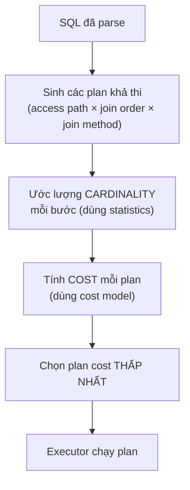

# Statistics & Query Planner — Deep Dive

## Mục lục

- [Bối cảnh: Vì sao cùng query lúc nhanh lúc chậm](#1-bối-cảnh-vì-sao-cùng-query-lúc-nhanh-lúc-chậm)
- [Query Planner làm gì — Toàn cảnh](#2-query-planner-làm-gì--toàn-cảnh)
- [Cost-Based Optimization — Chọn plan rẻ nhất](#3-cost-based-optimization--chọn-plan-rẻ-nhất)
- [Statistics — Nhiên liệu của optimizer](#4-statistics--nhiên-liệu-của-optimizer)
- [Bên trong pg_stats — Đọc từng cột](#5-bên-trong-pg_stats--đọc-từng-cột)
- [Cardinality Estimation — Ước lượng số row](#6-cardinality-estimation--ước-lượng-số-row)
- [Selectivity — Toán học đằng sau ước lượng](#7-selectivity--toán-học-đằng-sau-ước-lượng)
- [Vì sao planner đoán sai — 6 nguyên nhân](#8-vì-sao-planner-đoán-sai--6-nguyên-nhân)
- [Extended Statistics — Cứu cột tương quan](#9-extended-statistics--cứu-cột-tương-quan)
- [ANALYZE & Autovacuum — Giữ statistics tươi](#10-analyze--autovacuum--giữ-statistics-tươi)
- [Điều chỉnh độ chi tiết statistics](#11-điều-chỉnh-độ-chi-tiết-statistics)
- [Khi optimizer vẫn sai — Cách can thiệp](#12-khi-optimizer-vẫn-sai--cách-can-thiệp)
- [So sánh Postgres / MySQL / Oracle](#13-so-sánh-postgres--mysql--oracle)
- [Anti-patterns & Best Practices](#14-anti-patterns--best-practices)
- [Tóm tắt — Cheat sheet](#15-tóm-tắt--cheat-sheet)

---

## 1. Bối cảnh: Vì sao cùng query lúc nhanh lúc chậm

Một query chạy 40ms suốt nhiều tháng. Một sáng, không ai đổi code, nó đột nhiên chạy **9 giây**. Không có deploy, không đổi index. Chuyện gì xảy ra?

Câu trả lời gần như luôn là: **statistics lỗi thời**. Bảng lớn lên, phân bố dữ liệu thay đổi, nhưng optimizer vẫn dùng thống kê cũ để ước lượng. Nó nghĩ query trả về 10 row (như tháng trước) nên chọn Nested Loop; thực tế giờ là 2 triệu row → Nested Loop chạy 9 giây.

> [!IMPORTANT]
> Optimizer **không nhìn dữ liệu thật** khi lập kế hoạch. Nó nhìn **statistics** — một bản tóm tắt được thu thập định kỳ. Nếu bản tóm tắt sai, mọi quyết định (index nào, join nào, thứ tự nào) đều có thể sai. Hiểu statistics = hiểu vì sao optimizer hành xử như vậy.

Trong doc này ta sẽ mổ xẻ:

1. Planner **suy nghĩ** như thế nào (cost-based).
2. **Statistics** gồm những gì và lưu ở đâu.
3. **Cardinality estimation** — cách nó đoán số row.
4. **6 nguyên nhân** khiến nó đoán sai và cách sửa từng cái.
5. Khi nào và làm sao **can thiệp** vào optimizer.

---

## 2. Query Planner làm gì — Toàn cảnh

Sau khi câu SQL được parse và rewrite, planner (optimizer) vào cuộc:



Với một query đơn giản `SELECT ... WHERE a AND b JOIN c`, không gian plan gồm:

- **Access path**: Seq Scan? Index Scan trên index nào? Bitmap?
- **Join method**: Nested Loop / Hash / Merge?
- **Join order**: bảng nào trước?

Số tổ hợp bùng nổ rất nhanh. Optimizer không thử hết — nó dùng cost để cắt tỉa và chọn.

> [!NOTE]
> Toàn bộ pipeline xử lý một câu SQL (parse → rewrite → plan → execute) được mô tả trong doc [Thứ tự thực thi SQL Query](/fundamentals/query-execution-order/). Doc này zoom vào riêng bước **plan**.

---

## 3. Cost-Based Optimization — Chọn plan rẻ nhất

Postgres và hầu hết DB hiện đại dùng **Cost-Based Optimizer (CBO)**: gán một con số "cost" cho mỗi plan và chọn plan rẻ nhất.

### 3.1. Cost = f(cardinality, đơn giá thao tác)

```
cost của plan = Σ (số thao tác × đơn giá mỗi thao tác)
```

Trong đó "số thao tác" phụ thuộc **cardinality** (số row ước tính ở mỗi bước), còn "đơn giá" là các tham số:

```
seq_page_cost        = 1.0     -- đọc tuần tự 1 page 8KB
random_page_cost     = 4.0     -- đọc ngẫu nhiên 1 page
cpu_tuple_cost       = 0.01    -- xử lý 1 row
cpu_index_tuple_cost = 0.005   -- xử lý 1 entry index
cpu_operator_cost    = 0.0025  -- 1 phép toán/hàm
```

### 3.2. Ví dụ: Index Scan vs Seq Scan

Bảng `orders` có 50 triệu row, 685.000 page. Query lấy N row bằng cột có index:

```
Seq Scan cost   ≈ 685000 × seq_page_cost + 50M × cpu_tuple_cost
                ≈ 685000 + 500000 = 1,185,000   (cố định, không phụ thuộc N)

Index Scan cost ≈ N × random_page_cost + N × cpu_index_tuple_cost
                ≈ N × 4 + N × 0.005 ≈ 4N          (tỉ lệ với N)
```

Hai đường cắt nhau tại **N ≈ 296.000 row**:

- N < 296K → Index Scan rẻ hơn → optimizer chọn index.
- N > 296K → Seq Scan rẻ hơn → optimizer bỏ index.

```
cost
 │        Seq Scan (phẳng, ~1.18M)
 │  ─────────────────────────────
 │            ╱  Index Scan (dốc lên = 4N)
 │          ╱
 │        ╱
 │      ╱ ◀── điểm cắt N≈296K
 │    ╱
 └──────────────────────────────▶ N (số row)
```

> [!IMPORTANT]
> Đây là lý do "có index mà không dùng" **không phải bug**. Khi query lấy quá nhiều row, Seq Scan thật sự rẻ hơn (đọc tuần tự < nhiều random I/O). Optimizer chọn đúng — miễn là **cardinality ước lượng đúng**. Vấn đề chỉ nảy sinh khi nó đoán sai N.

### 3.3. random_page_cost và SSD

Điểm cắt phụ thuộc `random_page_cost`. Trên SSD, random read gần bằng sequential read:

```sql
-- HDD (mặc định): random gấp 4 lần → optimizer ngại index
SET random_page_cost = 4.0;

-- SSD/NVMe: random ≈ sequential → optimizer ưa index hơn
SET random_page_cost = 1.1;
```

> [!TIP]
> Nếu chạy trên SSD mà optimizer cứ chọn Seq Scan trong khi Index Scan thực tế nhanh hơn, giảm `random_page_cost` xuống `1.1`. Đây là một trong những tinh chỉnh có tác động lớn nhất trên hạ tầng SSD.

---

## 4. Statistics — Nhiên liệu của optimizer

Optimizer ước lượng cardinality dựa trên statistics thu thập bởi lệnh `ANALYZE`. Postgres lưu chúng trong catalog và trưng ra qua view `pg_stats`.

### 4.1. Các loại statistics cốt lõi

| Statistic | Trả lời câu hỏi | Ví dụ |
|-----------|------------------|-------|
| `n_distinct` | Cột có bao nhiêu giá trị khác nhau? | `status` có 5 giá trị |
| `null_frac` | Bao nhiêu % là NULL? | 2% `phone` là NULL |
| **MCV** (Most Common Values) | Giá trị nào xuất hiện nhiều nhất + tần suất | `'active'` chiếm 80% |
| **Histogram** | Phân bố giá trị (chia thành các "bucket") | `price` từ 0–10000 |
| `correlation` | Thứ tự vật lý có khớp thứ tự logic? | `id` tăng dần → 0.99 |
| `avg_width` | Kích thước trung bình 1 giá trị (byte) | `email` ≈ 24 byte |

### 4.2. Statistics là bản MẪU, không phải toàn bộ

> [!NOTE]
> `ANALYZE` **không** đọc toàn bảng. Nó lấy **mẫu ngẫu nhiên** (mặc định ~300 × `default_statistics_target` = 30.000 row) rồi ngoại suy. Đây là lý do statistics là ước lượng, và vì sao bảng có phân bố lệch (skew) đôi khi bị lấy mẫu không đại diện.

---

## 5. Bên trong pg_stats — Đọc từng cột

Xem trực tiếp statistics optimizer đang dùng:

```sql
SELECT attname, n_distinct, null_frac, most_common_vals, most_common_freqs, correlation
FROM pg_stats
WHERE tablename = 'orders' AND attname = 'status';
```

```text
 attname          | status
 n_distinct       | 5
 null_frac        | 0
 most_common_vals | {completed, pending, shipped, cancelled, refunded}
 most_common_freqs| {0.72, 0.15, 0.08, 0.03, 0.02}
 correlation      | 0.13
```

**Diễn giải:** cột `status` có 5 giá trị; `'completed'` chiếm 72%, `'pending'` 15%… Nhờ MCV, khi bạn viết `WHERE status = 'completed'`, optimizer biết ngay ~72% row khớp → chọn Seq Scan. Với `WHERE status = 'refunded'` (2%) → chọn Index Scan.

### 5.1. n_distinct — số âm nghĩa là gì

```text
 n_distinct = 5       → chính xác 5 giá trị khác nhau
 n_distinct = -1      → mỗi row một giá trị (unique, VD primary key)
 n_distinct = -0.5    → số distinct = 50% số row
```

Giá trị âm là **tỉ lệ** so với số row (dùng khi số distinct tăng theo kích thước bảng).

### 5.2. correlation — quyết định Index Scan hay Bitmap

```text
 correlation = 1.0   → thứ tự vật lý khớp hoàn toàn logic (VD cột id auto-increment)
 correlation = 0.0   → hoàn toàn ngẫu nhiên
 correlation = -1.0  → ngược hoàn toàn
```

> [!IMPORTANT]
> `correlation` gần 1 → các row cùng khoảng giá trị nằm gần nhau trên đĩa → Index Scan rẻ (ít random I/O). `correlation` gần 0 → Index Scan phải nhảy khắp đĩa → optimizer ưu tiên Bitmap Heap Scan. Đây là lý do index trên cột `created_at` (thường tăng dần) rất hiệu quả cho range query.

---

## 6. Cardinality Estimation — Ước lượng số row

Cardinality = số row đi qua mỗi bước. Đây là **con số quan trọng nhất** vì cost phụ thuộc trực tiếp vào nó.

### 6.1. Ước lượng lan truyền qua cây plan

```text
Bảng orders: 50,000,000 row
  → WHERE status = 'pending'  (MCV: 15%)     → est 7,500,000 row
    → AND created_at >= '2026-01-01' (30%)   → est 2,250,000 row
      → JOIN customers (mỗi order 1 customer) → est 2,250,000 row
        → GROUP BY status                     → est 5 row
```

Sai số **tích lũy**: nếu ước lượng bước đầu lệch 10 lần, các bước sau càng lệch xa. Đây là lý do sai cardinality ở node lá gây hậu quả lớn nhất.

### 6.2. Xem ước lượng vs thực tế

```sql
EXPLAIN ANALYZE SELECT * FROM orders WHERE status = 'pending';
```

```text
Seq Scan on orders (cost=... rows=7500000 ...) (actual ... rows=7480210 ...)
                              ▲                              ▲
                        est: 7.5M                     actual: 7.48M  → khớp, TỐT
```

---

## 7. Selectivity — Toán học đằng sau ước lượng

**Selectivity** = tỉ lệ row còn lại sau một điều kiện (từ 0 đến 1). `cardinality = số row × selectivity`.

### 7.1. Công thức cho từng loại điều kiện

| Điều kiện | Selectivity ước tính |
|-----------|----------------------|
| `col = value` (value trong MCV) | Lấy trực tiếp tần suất từ MCV |
| `col = value` (không trong MCV) | `(1 - Σ MCV_freq) / (n_distinct - số MCV)` |
| `col = value` (không có stats) | `1 / n_distinct` |
| `col > value` / range | Ước từ **histogram** |
| `col IS NULL` | `null_frac` |
| `col LIKE 'x%'` | Ước từ histogram trên prefix |
| `a AND b` | `sel(a) × sel(b)` — **giả định độc lập** ⚠️ |
| `a OR b` | `sel(a) + sel(b) - sel(a)×sel(b)` |

### 7.2. Giả định độc lập — nguồn gốc lỗi lớn nhất

Với `WHERE a AND b`, optimizer nhân hai selectivity như thể `a` và `b` **độc lập**. Nhưng thực tế nhiều cột **tương quan**:

```sql
SELECT * FROM cars WHERE brand = 'Toyota' AND model = 'Camry';
```

- `sel(brand = 'Toyota')` = 0.1
- `sel(model = 'Camry')` = 0.01
- Optimizer nhân: 0.1 × 0.01 = **0.001** → ước lượng 0.1% row.

Nhưng `Camry` **chỉ có** ở Toyota — hai cột hoàn toàn tương quan! Thực tế selectivity ≈ 0.01 (1%), tức optimizer ước **thấp gấp 10 lần**. Nó nghĩ ít row → chọn Nested Loop → chậm.

> [!IMPORTANT]
> Giả định độc lập giữa các cột là nguyên nhân phổ biến nhất khiến cardinality ước lượng sai lệch. Với cột tương quan (`city`/`country`, `brand`/`model`, `status`/`type`), dùng **extended statistics** (§9) để dạy optimizer về tương quan.

---

## 8. Vì sao planner đoán sai — 6 nguyên nhân

| # | Nguyên nhân | Dấu hiệu | Cách sửa |
|---|-------------|----------|----------|
| 1 | **Statistics lỗi thời** | est lệch actual sau khi data lớn lên | `ANALYZE table` |
| 2 | **Cột tương quan** (giả định độc lập) | est thấp cho `a AND b` | `CREATE STATISTICS` (extended) |
| 3 | **Statistics quá thô** (ít bucket) | est sai cho cột nhiều giá trị | tăng `statistics target` |
| 4 | **Hàm/biểu thức trong WHERE** | est mặc định cho `WHERE f(col)=x` | expression index (có stats riêng) |
| 5 | **Kết quả subquery/CTE** | est cứng cho row từ subquery | viết lại, hoặc `ANALYZE` bảng tạm |
| 6 | **Skew cực đoan** | mẫu ANALYZE không bắt được | tăng target, hoặc extended stats |

### 8.1. Chẩn đoán: luôn bắt đầu bằng est vs actual

```text
->  Index Scan (cost=... rows=12 ...) (actual ... rows=1850000 ...)
                          ▲                          ▲
                     est: 12                   actual: 1.85M   ← lệch 150.000 lần!
```

Bất cứ khi nào est và actual lệch > 100 lần, một trong 6 nguyên nhân trên đang xảy ra. Đây là điểm khởi đầu để debug.

> [!TIP]
> Đừng vội thêm index hay hint khi thấy plan tệ. Trước hết hỏi: **est vs actual có lệch không?** Nếu có, sửa cardinality (analyze/extended stats) — optimizer sẽ tự chọn lại plan đúng. Nếu est đã đúng mà plan vẫn tệ thì mới xét cost model / hint.

---

## 9. Extended Statistics — Cứu cột tương quan

Postgres (10+) cho phép khai báo statistics **đa cột** để dạy optimizer về mối quan hệ.

### 9.1. Ba loại

```sql
-- ndistinct: số tổ hợp distinct của nhóm cột
CREATE STATISTICS s_geo (ndistinct)
    ON city, country FROM addresses;

-- dependencies: quan hệ phụ thuộc hàm (city → country)
CREATE STATISTICS s_dep (dependencies)
    ON city, country FROM addresses;

-- mcv: giá trị tổ hợp phổ biến nhất (đa cột)
CREATE STATISTICS s_mcv (mcv)
    ON brand, model FROM cars;

ANALYZE cars;   -- phải ANALYZE lại để thu thập
```

### 9.2. Ví dụ trước/sau

```sql
CREATE STATISTICS s_car (dependencies, mcv) ON brand, model FROM cars;
ANALYZE cars;

EXPLAIN SELECT * FROM cars WHERE brand='Toyota' AND model='Camry';
```

```text
-- TRƯỚC (giả định độc lập): rows=100   ← sai gấp 100 lần
-- SAU  (có extended stats): rows=9800  ← khớp thực tế
```

Với ước lượng đúng, optimizer chuyển từ Nested Loop (sai) sang Hash Join (đúng).

> [!NOTE]
> Extended statistics chỉ ảnh hưởng **ước lượng**, không tạo cấu trúc dữ liệu như index. Chi phí gần như bằng 0, nhưng phải nhớ `ANALYZE` lại sau khi tạo.

---

## 10. ANALYZE & Autovacuum — Giữ statistics tươi

### 10.1. ANALYZE thủ công

```sql
ANALYZE;                    -- toàn database
ANALYZE orders;             -- một bảng
ANALYZE orders (status);    -- một cột
VACUUM ANALYZE orders;      -- dọn dead tuple + cập nhật stats
```

### 10.2. Autovacuum tự chạy ANALYZE

Postgres tự động chạy ANALYZE khi số row thay đổi vượt ngưỡng:

```
ngưỡng = autovacuum_analyze_threshold
       + autovacuum_analyze_scale_factor × số_row_bảng
```

Mặc định `scale_factor = 0.1` (10%). Với bảng 50 triệu row → phải thay đổi **5 triệu row** mới auto-analyze. Với bảng lớn, ngưỡng này quá cao → statistics ôi thiu lâu.

```sql
-- Bảng lớn: hạ scale_factor để analyze thường xuyên hơn
ALTER TABLE orders SET (autovacuum_analyze_scale_factor = 0.02);
```

> [!IMPORTANT]
> Nguyên nhân phổ biến nhất của "query đột nhiên chậm" là bảng lớn vượt ngưỡng auto-analyze mặc định (10%). Trên bảng lớn, giảm `autovacuum_analyze_scale_factor` xuống 1–2% hoặc lên lịch `ANALYZE` định kỳ. Xem thêm [PostgreSQL VACUUM](/postgresql/vacuum/).

### 10.3. Kiểm tra lần ANALYZE gần nhất

```sql
SELECT relname, last_analyze, last_autoanalyze, n_mod_since_analyze
FROM pg_stat_user_tables
WHERE relname = 'orders';
```

`n_mod_since_analyze` cao (hàng triệu) → statistics đã cũ, cần ANALYZE.

---

## 11. Điều chỉnh độ chi tiết statistics

### 11.1. statistics target — số bucket histogram & MCV

```sql
-- Mặc định 100. Tăng cho cột quan trọng, phân bố phức tạp
ALTER TABLE orders ALTER COLUMN status SET STATISTICS 500;
ANALYZE orders;

-- Toàn cục
SET default_statistics_target = 200;
```

| target | Số MCV & histogram bucket | Đánh đổi |
|--------|---------------------------|----------|
| 100 (mặc định) | 100 | ANALYZE nhanh, ước lượng thô |
| 500–1000 | Nhiều hơn | Ước lượng chính xác hơn, ANALYZE chậm hơn, plan lâu hơn |

> [!TIP]
> Chỉ tăng `statistics target` cho **cột cụ thể** hay dùng trong WHERE/JOIN và có phân bố phức tạp (nhiều giá trị, skew). Tăng toàn cục làm mọi ANALYZE và planning chậm đi không cần thiết.

---

## 12. Khi optimizer vẫn sai — Cách can thiệp

Sau khi đã ANALYZE, extended stats mà plan vẫn tệ, các mức can thiệp (từ nhẹ đến nặng):

### 12.1. Postgres — không có hint chính thức

```sql
-- Tắt tạm một loại node để buộc thử phương án khác (chỉ để DEBUG/kiểm chứng)
SET enable_nestloop = off;
SET enable_seqscan = off;

-- Điều chỉnh cost model cho SSD
SET random_page_cost = 1.1;

-- Tăng bộ nhớ để sort/hash không tràn đĩa
SET work_mem = '256MB';

-- Giới hạn không gian join order (khi query nhiều bảng)
SET join_collapse_limit = 8;
```

> [!WARNING]
> `SET enable_nestloop = off` là công cụ **debug**, không phải fix production. Nó tắt toàn cục và có thể làm query khác chậm đi. Dùng để xác nhận "nếu không Nested Loop thì nhanh hơn" rồi đi tìm nguyên nhân gốc (statistics), đừng để nguyên trong config.

### 12.2. Extension pg_hint_plan

Nếu thực sự cần hint kiểu Oracle trên Postgres:

```sql
/*+ HashJoin(o c) IndexScan(o idx_orders_created) */
SELECT ... FROM orders o JOIN customers c ...;
```

### 12.3. MySQL / Oracle có hint sẵn

```sql
-- MySQL
SELECT /*+ JOIN_ORDER(c, o) INDEX(o idx_customer) */ ...;

-- Oracle
SELECT /*+ USE_HASH(o c) LEADING(c) */ ...;
```

> [!IMPORTANT]
> Hint là **giải pháp cuối cùng**. Nó đóng băng plan và có thể trở nên tệ khi dữ liệu thay đổi. Ưu tiên sửa gốc rễ: ANALYZE, extended statistics, index, viết lại query. Chỉ dùng hint khi đã thử hết và plan sai là do giới hạn cơ bản của optimizer.

---

## 13. So sánh Postgres / MySQL / Oracle

| Đặc điểm | PostgreSQL | MySQL (InnoDB) | Oracle |
|----------|-----------|----------------|--------|
| Kiểu optimizer | Cost-based | Cost-based | Cost-based (CBO) |
| Xem statistics | `pg_stats` | `information_schema.STATISTICS`, `ANALYZE TABLE` | `DBA_TAB_STATISTICS`, histograms |
| Histogram | Có | Có (từ 8.0) | Có (nhiều loại) |
| Extended/multi-col stats | `CREATE STATISTICS` | Không (dùng index) | Column groups, expression stats |
| Cập nhật stats | `ANALYZE` / autovacuum | `ANALYZE TABLE` / auto (persistent stats) | `DBMS_STATS` / auto job |
| Hint chính thức | Không (pg_hint_plan ext) | Có (`/*+ */`) | Có (mạnh & phong phú nhất) |
| Plan cache | Prepared statements | Không (parse mỗi lần)¹ | Shared pool (bind peeking) |
| Cột lấy mẫu | ~30.000 row mặc định | Tùy engine | Cấu hình được |

> [!NOTE]
> ¹ MySQL cache **kết quả** (trước 8.0) và có prepared statements nhưng không cache plan như Oracle. Oracle có **bind variable peeking** (nhìn giá trị bind lần đầu để chọn plan) — mạnh nhưng gây "plan instability" khi giá trị bind sau khác xa lần đầu.

---

## 14. Anti-patterns & Best Practices

**Anti-patterns:**

- **Thêm index khi vấn đề là statistics sai** — index không cứu được nếu optimizer đoán sai cardinality.
- **Để hint vĩnh viễn thay vì sửa gốc** — plan đóng băng sẽ tệ khi data đổi.
- **Tắt `enable_*` trong postgresql.conf production** — ảnh hưởng mọi query.
- **Không ANALYZE sau bulk load** — nạp hàng triệu row rồi query ngay → statistics rỗng/cũ → plan thảm họa.
- **Tăng `default_statistics_target` toàn cục lên quá cao** — mọi planning chậm đi.

**Best Practices:**

- ✅ Luôn `ANALYZE` (hoặc `VACUUM ANALYZE`) sau bulk load / migration lớn.
- ✅ Hạ `autovacuum_analyze_scale_factor` cho bảng lớn.
- ✅ Dùng extended statistics cho cột tương quan.
- ✅ So `est vs actual` mỗi khi debug — đó là la bàn.
- ✅ Trên SSD, cân nhắc `random_page_cost = 1.1`.
- ✅ Tăng `statistics target` chọn lọc cho cột quan trọng.

---

## 15. Tóm tắt — Cheat sheet

```
╭────────────────────────────────────────────────────────────────────╮
│  OPTIMIZER SUY NGHĨ NHƯ THẾ NÀO                                    │
│                                                                    │
│  statistics  →  cardinality estimate  →  cost  →  chọn plan rẻ nhất│
│      ▲              ▲                                              │
│   ANALYZE      lệch actual = gốc rễ mọi vấn đề                     │
│                                                                    │
│  QUY TRÌNH DEBUG                                                   │
│  1. EXPLAIN ANALYZE → so est rows vs actual rows                   │
│  2. Lệch >100×?  → ANALYZE bảng                                    │
│  3. Vẫn lệch cho a AND b?  → CREATE STATISTICS (extended)          │
│  4. Cột skew/nhiều giá trị? → tăng STATISTICS target               │
│  5. est đúng mà plan tệ?    → cost model (random_page_cost)/hint   │
╰────────────────────────────────────────────────────────────────────╯
```

| Statistic | Cho optimizer biết | Xem ở |
|-----------|--------------------|-------|
| `n_distinct` | Số giá trị khác nhau | `pg_stats` |
| MCV + freq | Giá trị phổ biến & tần suất | `pg_stats.most_common_vals` |
| Histogram | Phân bố cho range query | `pg_stats.histogram_bounds` |
| `correlation` | Index Scan hay Bitmap | `pg_stats.correlation` |
| `null_frac` | Tỉ lệ NULL | `pg_stats.null_frac` |

---

## Tài liệu tham khảo

- [PostgreSQL — How the Planner Uses Statistics](https://www.postgresql.org/docs/current/planner-stats.html)
- [PostgreSQL — Extended Statistics](https://www.postgresql.org/docs/current/planner-stats.html#PLANNER-STATS-EXTENDED)
- [PostgreSQL — Row Estimation Examples](https://www.postgresql.org/docs/current/row-estimation-examples.html)
- [EXPLAIN / EXPLAIN ANALYZE — Deep Dive](/optimization/explain-analyze-deep-dive/)
- [JOIN & Join Algorithms — Deep Dive](/fundamentals/join-deep-dive/)
- [PostgreSQL VACUUM](/postgresql/vacuum/)
