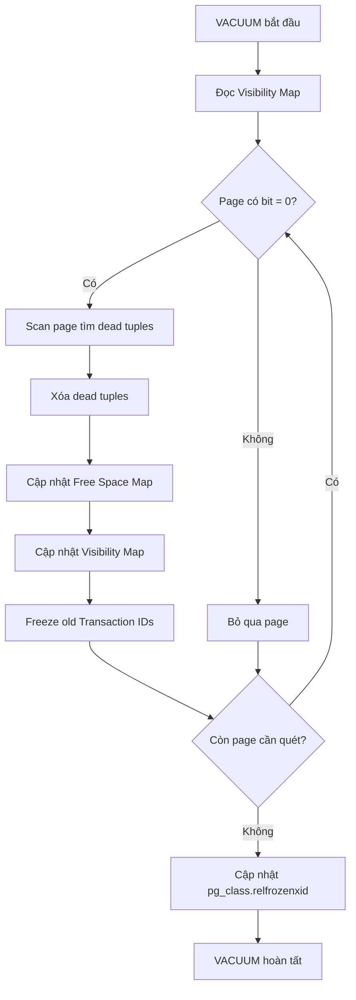

# PostgreSQL VACUUM

## Mục lục

- [VACUUM là gì?](#vacuum-là-gì)
- [Dead Tuples và MVCC](#dead-tuples-và-mvcc)
- [Các loại VACUUM](#các-loại-vacuum)
- [VACUUM hoạt động chi tiết](#vacuum-hoạt-động-chi-tiết)
- [Transaction ID Wraparound](#transaction-id-wraparound)
- [Khi nào cần VACUUM thủ công](#khi-nào-cần-vacuum-thủ-công)
- [Cấu hình AUTOVACUUM tối ưu](#cấu-hình-autovacuum-tối-ưu)
- [Kiểm tra Table Bloat](#kiểm-tra-table-bloat)
- [So sánh với MySQL và Oracle](#so-sánh-với-mysql-và-oracle)
- [Best Practices](#best-practices)
- [TL;DR — Tóm tắt nhanh](#tldr--tóm-tắt-nhanh)

---

## VACUUM là gì?

VACUUM là quá trình **dọn dẹp nội bộ** (garbage collection) trong PostgreSQL, chịu trách nhiệm loại bỏ **dead tuples** — các bản ghi đã bị UPDATE hoặc DELETE nhưng vẫn chiếm không gian trong heap.

### Tại sao PostgreSQL cần VACUUM?

PostgreSQL sử dụng kiến trúc **heap-based MVCC** — khi UPDATE một row, PostgreSQL **không ghi đè row cũ** mà tạo một bản copy mới. Row cũ vẫn nằm trong table (gọi là dead tuple) cho đến khi được dọn dẹp.

Nếu không có VACUUM:

- Table và index **phình to** (bloat) liên tục, chiếm disk vô ích
- Query **chậm dần** vì phải scan qua dead tuples
- **Transaction ID Wraparound** có thể xảy ra, khiến database **từ chối mọi write operation**
- Query planner sử dụng **statistics cũ**, chọn execution plan kém tối ưu

### Mục tiêu chính của VACUUM

| Mục tiêu | Mô tả |
|-----------|--------|
| Giải phóng dead tuples | Xóa row đã chết, cho phép tái sử dụng không gian |
| Cập nhật Visibility Map | Hỗ trợ Index-Only Scan hiệu quả |
| Cập nhật Free Space Map | Cho phép INSERT mới tái sử dụng page trống |
| Freeze Transaction ID | Ngăn chặn Transaction ID Wraparound |
| Cập nhật statistics (ANALYZE) | Giúp query planner chọn plan tối ưu |

## Dead Tuples và MVCC

### MVCC Heap-Based hoạt động thế nào?

PostgreSQL triển khai MVCC bằng cách lưu **nhiều phiên bản** của cùng một row ngay trong heap (data file). Mỗi tuple có hai trường metadata quan trọng:

- **`xmin`** — Transaction ID đã tạo ra tuple này
- **`xmax`** — Transaction ID đã xóa/update tuple này (0 nếu chưa bị xóa)

Khi một transaction thực hiện SELECT, nó dùng `xmin` và `xmax` để xác định tuple nào **visible** với snapshot hiện tại.

### Cơ chế tạo Dead Tuples

Khi thực hiện **UPDATE**, PostgreSQL:

1. Đánh dấu row cũ là **dead** (set `xmax` = transaction ID hiện tại)
2. Tạo một **bản copy mới** của row với giá trị đã thay đổi
3. Cập nhật index trỏ đến tuple mới

Khi thực hiện **DELETE**:

1. Chỉ đánh dấu `xmax` = transaction ID hiện tại
2. Row vẫn nằm trong heap, chỉ không visible với transaction mới

### ASCII Diagram: Trước và sau UPDATE

**Trước UPDATE** — Table `users` có row `id=1, name='Alice'`:

```
Heap Page 0
┌─────────────────────────────────────────────────┐
│  Tuple 1                                        │
│  xmin=100  xmax=0  │ id=1 │ name='Alice'        │  ← LIVE
│                                                 │
│  (free space)                                   │
└─────────────────────────────────────────────────┘
```

**Sau `UPDATE users SET name='Bob' WHERE id=1`** (Transaction ID = 200):

```
Heap Page 0
┌─────────────────────────────────────────────────┐
│  Tuple 1                                        │
│  xmin=100  xmax=200 │ id=1 │ name='Alice'       │  ← DEAD TUPLE ☠️
│                                                 │
│  Tuple 2                                        │
│  xmin=200  xmax=0   │ id=1 │ name='Bob'         │  ← LIVE ✅
└─────────────────────────────────────────────────┘
```

**Sau VACUUM**:

```
Heap Page 0
┌─────────────────────────────────────────────────┐
│  (free space — có thể tái sử dụng)              │
│                                                 │
│  Tuple 2                                        │
│  xmin=200  xmax=0   │ id=1 │ name='Bob'         │  ← LIVE ✅
└─────────────────────────────────────────────────┘
```

> [!IMPORTANT]
> Mỗi UPDATE trong PostgreSQL tương đương **DELETE + INSERT** ở mức storage. Đây là lý do table có nhiều UPDATE sẽ tạo dead tuples nhanh chóng.

## Các loại VACUUM

### VACUUM (thường)

```sql
VACUUM my_table;
```

- **Không khóa bảng** — chạy song song với đọc/ghi, an toàn cho production
- Quét heap, đánh dấu dead tuples là **reusable space**
- Cập nhật **Visibility Map** và **Free Space Map**
- **Không trả disk về OS** — chỉ cho phép tái sử dụng nội bộ

```
Trước VACUUM:  [Live][Dead][Live][Dead][Dead][Live]  → 6 pages
Sau VACUUM:    [Live][Free][Live][Free][Free][Live]  → 6 pages (same size on disk)
```

### VACUUM FULL

```sql
VACUUM FULL my_table;
```

- **Khóa exclusive** toàn bộ table — mọi query phải chờ
- Tạo file table mới, chỉ copy **live rows** sang
- **Trả disk về OS** — table size giảm thực sự
- Rebuild lại tất cả indexes

```
Trước VACUUM FULL:  [Live][Dead][Live][Dead][Dead][Live]  → 6 pages, 60KB
Sau VACUUM FULL:    [Live][Live][Live]                    → 3 pages, 30KB ← disk freed!
```

> [!IMPORTANT]
> VACUUM FULL cần **dung lượng trống tương đương kích thước table** để tạo bản copy. Không chạy khi disk gần đầy!

### VACUUM ANALYZE

```sql
VACUUM ANALYZE my_table;
```

Kết hợp VACUUM thường + **ANALYZE** (cập nhật pg_statistic). Query planner dựa vào statistics để ước lượng số row, chọn join method, quyết định dùng index hay sequential scan.

### AUTOVACUUM

AUTOVACUUM là daemon tự động chạy VACUUM khi dead tuples vượt **ngưỡng cấu hình**. PostgreSQL bật mặc định và **không nên tắt**.

Công thức kích hoạt:

```
dead_tuples > autovacuum_vacuum_threshold + autovacuum_vacuum_scale_factor × reltuples
```

Ví dụ: Table 1 triệu rows, threshold = 50, scale_factor = 0.2:

```
Trigger khi dead_tuples > 50 + 0.2 × 1,000,000 = 200,050
```

> [!TIP]
> Với table lớn (>10M rows), scale_factor mặc định 0.2 có nghĩa là phải có **2 triệu dead tuples** mới trigger. Nên giảm scale_factor cho table lớn.

| Tham số | Mặc định | Ý nghĩa |
|---------|----------|---------|
| `autovacuum` | `on` | Bật/tắt autovacuum daemon |
| `autovacuum_vacuum_threshold` | `50` | Số dead tuples tối thiểu |
| `autovacuum_vacuum_scale_factor` | `0.2` | % table cần dead tuples để trigger |
| `autovacuum_vacuum_cost_delay` | `2ms` | Delay giữa mỗi cost unit, giảm I/O impact |
| `autovacuum_vacuum_cost_limit` | `200` | Cost limit mỗi cycle |
| `autovacuum_naptime` | `1min` | Thời gian nghỉ giữa các lần check |

## VACUUM hoạt động chi tiết

### Visibility Map (VM)

Mỗi table có một **Visibility Map** — bitmap tracking trạng thái từng page:

- **Bit = 1**: Tất cả tuples trong page đều visible với mọi transaction → VACUUM **bỏ qua** page này
- **Bit = 0**: Page có thể chứa dead tuples → VACUUM cần quét

VM giúp:

- VACUUM chạy nhanh hơn vì chỉ quét page cần thiết
- **Index-Only Scan** hoạt động hiệu quả — chỉ cần check VM thay vì đọc heap

```
Visibility Map:  [1][0][1][1][0][1]
                      ↑           ↑
                 VACUUM quét  VACUUM quét
                 (có dead)    (có dead)
```

### Free Space Map (FSM)

**Free Space Map** theo dõi không gian trống trong mỗi page:

- Sau VACUUM, dead tuples được xóa → page có free space
- INSERT mới sẽ **tái sử dụng** free space thay vì append cuối file
- FSM giúp PostgreSQL tìm nhanh page có đủ chỗ cho row mới

```
Free Space Map:  Page 0: 2KB free
                 Page 1: 0KB free (full)
                 Page 2: 6KB free  ← INSERT sẽ dùng page này
                 Page 3: 8KB free  ← hoặc page này
```

### Quy trình VACUUM thường



## Transaction ID Wraparound

### Vấn đề

PostgreSQL sử dụng **32-bit Transaction ID** (txid) — khoảng **4.2 tỷ** giá trị. Khi hết, txid quay vòng (wrap around) về 0.

Nếu không freeze dead tuples kịp thời:

- Tuples với txid cũ sẽ **biến mất** — hệ thống coi chúng là "từ tương lai"
- PostgreSQL sẽ **từ chối mọi write** (emergency shutdown) để bảo vệ dữ liệu

```
  Txid:  0 ──────── 2 tỷ ──────── 4.2 tỷ ──────── WRAP → 0
         ↑                                            ↑
   "quá khứ"                                     "tương lai"
         ← visible ──────── invisible →
```

### VACUUM Freeze

VACUUM thực hiện **freeze** — thay thế txid cũ bằng giá trị đặc biệt `FrozenTransactionId`. Tuple đã frozen **luôn visible** với mọi transaction, không bị ảnh hưởng bởi wraparound.

| Tham số | Mặc định | Ý nghĩa |
|---------|----------|---------|
| `vacuum_freeze_min_age` | `50,000,000` | Tuổi txid tối thiểu để freeze |
| `vacuum_freeze_table_age` | `150,000,000` | Tuổi table để trigger aggressive vacuum |
| `autovacuum_freeze_max_age` | `200,000,000` | Tuổi tối đa, force autovacuum chạy |

> [!IMPORTANT]
> Khi `age(relfrozenxid)` tiến gần `autovacuum_freeze_max_age`, PostgreSQL sẽ **force anti-wraparound vacuum** — chạy rất nặng, có thể ảnh hưởng performance. Monitor giá trị này!

Kiểm tra tuổi txid của table:

```sql
SELECT relname,
       age(relfrozenxid) AS xid_age,
       pg_size_pretty(pg_total_relation_size(oid)) AS total_size
FROM pg_class
WHERE relkind = 'r'
ORDER BY age(relfrozenxid) DESC
LIMIT 10;
```

## Khi nào cần VACUUM thủ công

| Tình huống | Hành động |
|-----------|-----------|
| Table phình to dù đã xóa nhiều row | `VACUUM FULL my_table;` (giờ thấp điểm) |
| Query chậm đột ngột, plan thay đổi | `VACUUM ANALYZE my_table;` |
| Bulk DELETE/UPDATE lớn (migration) | `VACUUM my_table;` ngay sau đó |
| `age(relfrozenxid)` quá cao | `VACUUM FREEZE my_table;` |
| Index size >> table size | `REINDEX TABLE my_table;` + `VACUUM` |
| Autovacuum không theo kịp workload | VACUUM thủ công + tune autovacuum |

Ví dụ thực tế: table `alerts` có 50M records, mỗi ngày update/delete hàng trăm ngàn rows:

```sql
-- Kiểm tra dead tuples
SELECT relname, n_dead_tup, n_live_tup,
       round(n_dead_tup::numeric / greatest(n_live_tup, 1) * 100, 2) AS dead_pct,
       last_autovacuum
FROM pg_stat_user_tables
WHERE relname = 'alerts';

-- Nếu dead_pct > 20%, chạy vacuum
VACUUM ANALYZE alerts;

-- Nếu bloat quá lớn (>50%), chạy VACUUM FULL giờ thấp điểm
VACUUM FULL alerts;
```

## Cấu hình AUTOVACUUM tối ưu

### Tham số Global

```sql
-- Xem cấu hình hiện tại
SHOW autovacuum_vacuum_threshold;
SHOW autovacuum_vacuum_scale_factor;
SHOW autovacuum_vacuum_cost_limit;
SHOW autovacuum_max_workers;
```

### Per-Table Configuration

Table lớn hoặc write-heavy nên cấu hình **riêng**:

```sql
-- Table 100M rows: giảm scale_factor để trigger sớm hơn
ALTER TABLE orders SET (
    autovacuum_vacuum_threshold = 1000,
    autovacuum_vacuum_scale_factor = 0.01,
    autovacuum_analyze_threshold = 500,
    autovacuum_analyze_scale_factor = 0.005
);

-- Table write-heavy: tăng cost limit cho autovacuum chạy nhanh hơn
ALTER TABLE events SET (
    autovacuum_vacuum_cost_limit = 1000,
    autovacuum_vacuum_cost_delay = 0
);
```

### Cấu hình khuyến nghị theo workload

| Workload | scale_factor | threshold | cost_limit | cost_delay |
|----------|-------------|-----------|------------|------------|
| Table nhỏ (<100K rows) | 0.2 (mặc định) | 50 | 200 | 2ms |
| Table trung bình (100K–10M) | 0.05 | 500 | 500 | 1ms |
| Table lớn (>10M) | 0.01 | 1000 | 1000 | 0ms |
| Write-heavy (>1K writes/sec) | 0.005 | 100 | 2000 | 0ms |

## Kiểm tra Table Bloat

### Sử dụng pg_stat_user_tables

```sql
SELECT
    schemaname,
    relname,
    n_live_tup,
    n_dead_tup,
    round(n_dead_tup::numeric / greatest(n_live_tup, 1) * 100, 2) AS dead_pct,
    last_vacuum,
    last_autovacuum,
    vacuum_count,
    autovacuum_count
FROM pg_stat_user_tables
WHERE n_dead_tup > 0
ORDER BY n_dead_tup DESC
LIMIT 20;
```

### Sử dụng pgstattuple Extension

```sql
-- Cài extension (cần superuser)
CREATE EXTENSION IF NOT EXISTS pgstattuple;

-- Xem chi tiết bloat
SELECT * FROM pgstattuple('my_table');
```

Kết quả mẫu:

| Trường | Giá trị | Ý nghĩa |
|--------|---------|---------|
| `table_len` | `819200` | Tổng kích thước table (bytes) |
| `tuple_count` | `5000` | Số live tuples |
| `tuple_len` | `400000` | Tổng kích thước live tuples |
| `dead_tuple_count` | `3000` | Số dead tuples |
| `dead_tuple_len` | `240000` | Kích thước dead tuples |
| `free_space` | `179200` | Không gian trống |
| `free_percent` | `21.88` | % không gian trống |

### Ước tính Bloat Ratio

```sql
SELECT
    current_database(),
    schemaname,
    tablename,
    pg_size_pretty(pg_total_relation_size(schemaname || '.' || tablename)) AS total_size,
    pg_size_pretty(pg_relation_size(schemaname || '.' || tablename)) AS table_size,
    pg_size_pretty(
        pg_total_relation_size(schemaname || '.' || tablename)
        - pg_relation_size(schemaname || '.' || tablename)
    ) AS index_size
FROM pg_tables
WHERE schemaname = 'public'
ORDER BY pg_total_relation_size(schemaname || '.' || tablename) DESC;
```

## So sánh với MySQL và Oracle

### Tại sao MySQL/Oracle không cần VACUUM?

Sự khác biệt **nằm ở kiến trúc storage**:

| DB | Nơi lưu row cũ | Table chứa nhiều phiên bản? | Cần VACUUM? | Cơ chế cleanup |
|----|----------------|----------------------------|-------------|----------------|
| **PostgreSQL** | Heap (ngay trong table) | ✔ Có | ✔ Có | VACUUM, AUTOVACUUM |
| **MySQL (InnoDB)** | Undo Log | ❌ Không | ❌ Không | Purge Thread tự động |
| **Oracle** | Undo Tablespace | ❌ Không | ❌ Không | Undo Retention tự động |

### Minh họa UPDATE cho từng database

**PostgreSQL** — row cũ nằm trong heap:

```
Heap:  [row v1 DEAD ☠️] [row v2 LIVE ✅]
       └── cần VACUUM để dọn
```

**MySQL InnoDB** — row cũ trong undo log:

```
Table:    [row v2 LIVE ✅]    ← table luôn sạch
Undo Log: [row v1]            ← purge thread tự dọn
```

**Oracle** — row cũ trong Undo Tablespace:

```
Table:           [row v2 LIVE ✅]     ← table luôn sạch
Undo Tablespace: [row v1 snapshot]    ← tự hết hạn theo retention
```

### Ưu nhược so sánh

| Tiêu chí | PostgreSQL | MySQL InnoDB | Oracle |
|----------|-----------|-------------|--------|
| Table bloat | ❗ Có, cần VACUUM | ✅ Không | ✅ Không |
| Rollback speed | ✅ Nhanh (dữ liệu trong heap) | ❗ Chậm hơn (đọc undo log) | Trung bình |
| Write I/O | ❗ Cao (ghi phiên bản mới vào heap) | ✅ Thấp hơn | ✅ Thấp |
| Maintenance burden | ❗ Cần tune AUTOVACUUM | ✅ Ít | ✅ Ít |
| Crash recovery | ✅ Đơn giản (WAL) | ✅ Tốt | ✅ Tốt |

## Best Practices

### 1. Không tắt AUTOVACUUM

```sql
-- ❌ KHÔNG BAO GIỜ làm điều này
ALTER TABLE my_table SET (autovacuum_enabled = false);

-- ✅ Thay vào đó, tune cho phù hợp
ALTER TABLE my_table SET (
    autovacuum_vacuum_scale_factor = 0.01,
    autovacuum_vacuum_cost_limit = 1000
);
```

### 2. Monitor Autovacuum Lag

```sql
-- Kiểm tra table nào cần vacuum nhất
SELECT relname, n_dead_tup, last_autovacuum,
       age(relfrozenxid) AS xid_age
FROM pg_stat_user_tables
ORDER BY n_dead_tup DESC
LIMIT 10;
```

Thiết lập alert khi:

- `n_dead_tup / n_live_tup > 0.2` (>20% dead tuples)
- `age(relfrozenxid) > 150,000,000` (gần wraparound)

### 3. Tránh Long-Running Transactions

Long-running transactions **chặn VACUUM** xóa dead tuples vì PostgreSQL phải giữ lại tuples mà transaction cũ có thể cần đọc.

```sql
-- Tìm transaction chạy lâu
SELECT pid, now() - xact_start AS duration, query, state
FROM pg_stat_activity
WHERE state != 'idle'
  AND xact_start IS NOT NULL
ORDER BY xact_start
LIMIT 10;

-- Cancel transaction chạy quá lâu (> 1 giờ)
SELECT pg_cancel_backend(pid)
FROM pg_stat_activity
WHERE now() - xact_start > interval '1 hour'
  AND state != 'idle';
```

### 4. Tune theo Workload

- **OLTP write-heavy**: giảm `scale_factor`, tăng `cost_limit`, tăng `autovacuum_max_workers`
- **OLAP read-heavy**: mặc định thường đủ, focus vào `ANALYZE` cho statistics chính xác
- **Bulk operations**: chạy `VACUUM ANALYZE` ngay sau bulk INSERT/UPDATE/DELETE

### 5. Schedule VACUUM FULL cẩn thận

```bash
# Chạy VACUUM FULL giờ thấp điểm (ví dụ 3AM Chủ Nhật)
# Cần planning vì table bị lock hoàn toàn
0 3 * * 0 psql -d mydb -c "VACUUM FULL ANALYZE large_table;"
```

### 6. Sử dụng pg_repack thay VACUUM FULL

[pg_repack](https://github.com/reorg/pg_repack) là extension cho phép rebuild table **không cần exclusive lock**:

```bash
# Cài pg_repack
sudo apt install postgresql-16-repack

# Repack table không lock
pg_repack -d mydb -t large_table
```

## TL;DR — Tóm tắt nhanh

| Loại | Khóa bảng | Trả disk về OS | Impact | Khi nào dùng? |
|------|-----------|---------------|--------|--------------|
| `VACUUM` | ❌ Không | ❌ Không | Nhẹ | Định kỳ / autovacuum |
| `VACUUM FULL` | ✅ Exclusive | ✅ Có | Nặng | Bloat quá lớn, giờ thấp điểm |
| `VACUUM ANALYZE` | ❌ Không | ❌ Không | Nhẹ | Sau bulk operations |
| `VACUUM FREEZE` | ❌ Không | ❌ Không | Trung bình | Ngăn txid wraparound |
| `AUTOVACUUM` | ❌ Không | ❌ Không | Nhẹ | Tự động, luôn bật |
| `ANALYZE` | ❌ Không | ❌ Không | Nhẹ | Cập nhật statistics |

**Checklist nhanh cho production:**

- ✅ AUTOVACUUM luôn **bật**
- ✅ Tune `scale_factor` cho table lớn (giảm xuống 0.01–0.05)
- ✅ Monitor `n_dead_tup` và `age(relfrozenxid)`
- ✅ Alert khi dead_pct > 20% hoặc xid_age > 150M
- ✅ Tránh long-running transactions
- ✅ Dùng `pg_repack` thay `VACUUM FULL` khi có thể
- ✅ Chạy `VACUUM ANALYZE` sau bulk operations
